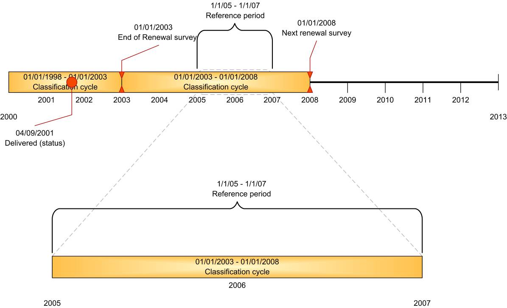
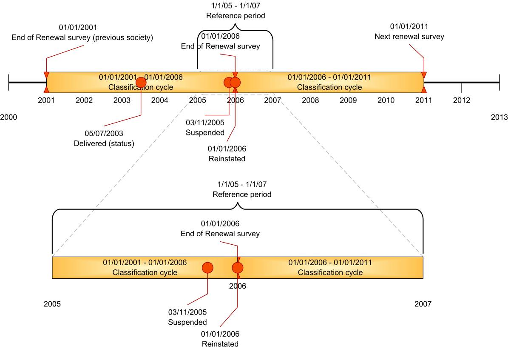
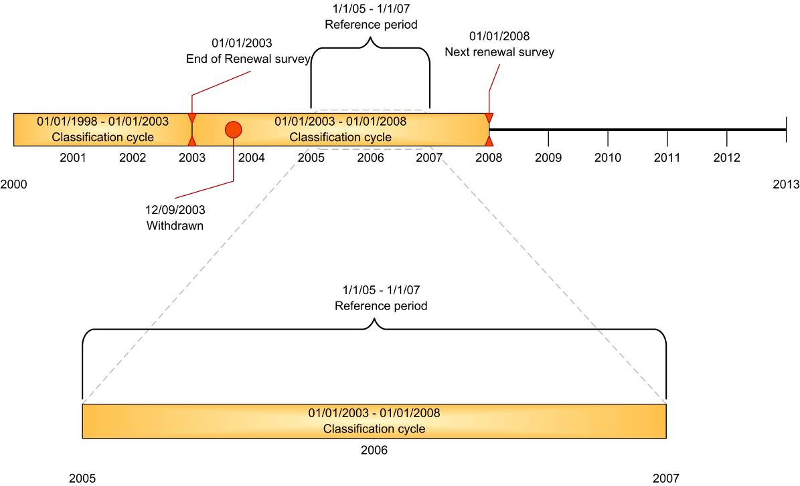
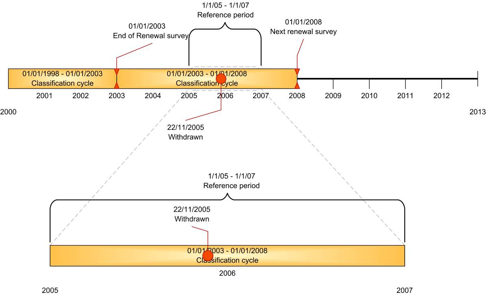
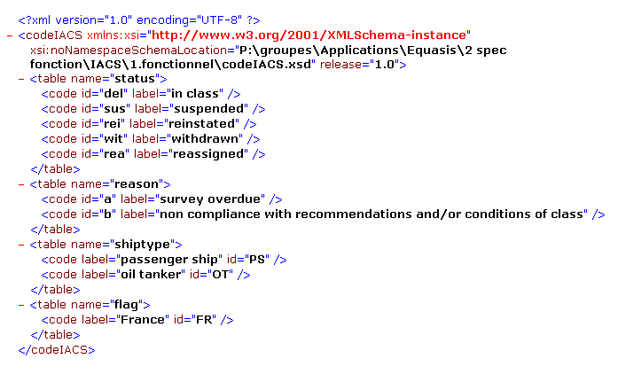

<!-- markdownlint-disable MD007 MD013 MD024 MD025 MD026 MD029 MD033 MD034 MD036 MD056 MD060 -->

# No.16 Procedure for providing lists of classed ships to Equasis

(Rev.0 July 2009)
(Corr.1 May 2015)
(Corr.2 Feb 2016)
(Rev.1 May 2019)
(Corr.1 Nov 2020)

## 1 Definition

"EQUASIS" means the public-access information system on quality and safety-related information about the world's merchant fleet, [www.equasis.org](http://www.equasis.org).

"Technical Specifications" means the Technical Specifications for Data Exchange between members of the International Association of Classification Societies and Equasis, as may be revised from time to time.

## 2 Data supply to Equasis

A Classification society is to supply data files to Equasis listing ships in class and changes in class status. The data files and the frequency of sending them are to be in accordance with the Technical Specifications.

## 3 Data verification

Data verification is covered in the Technical Specifications.

The data that Equasis receives comes directly from Classification Societies without any involvement of IACS. Any errors in the data should be notified directly to the Classification Societies concerned, not through the IACS Secretariat.

Any questions or complaints by the Classification Societies on the data should be sent directly to Equasis MU, as relevant.

Attached:

Technical Specifications for Data Exchange between members of the International Association of Classification Societies and Equasis.

Note:

1. This Procedural Requirement applies from 1 July 2009.

2. Acceptance of a classification society to be a data supplier using the attached Technical Specification remains the prerogative of the Equasis Editorial Board and Supervisory Committee.

3. Revision 1 of this Procedural Requirement applies from 1 July 2020.

End of Document

---

# Data exchange between Members of the International Association of Classification Societies & Equasis

## Technical specifications

tech_IACS_file_format_version_1.12
Version 1.12
Nov 2020

## Revisions

| Version | Authors | Description | Date |
|---|---|---|---|
| 0.0.1 | Hervé GUICHARD | Initial document | 10/07/2003 |
| 0.0.2 | Hervé GUICHARD | Integration of the remarks made by E. BOULET | 11/07/2003 |
| 0.0.3 | Hervé GUICHARD | Modification of the procedures for management of inconsistencies | 16/07/2003 |
| 0.0.4 | Hervé GUICHARD | New rule for the "Date to be delivered" information. Inscription of the Reason Codes in the protocol and thus, suppression of the cross-reference panels. Addition of the reason in the error file. Reason Code only required for an insertion. | 21/07/2003 |
| 0.0.5 | Eric BOULET | Editorial modifications. Planning of supplies, Modelling, Handling of exceptions, Drafting of business rules. SMC & DoC management. Decoding tables management. | 21/07/2003 |
| 0.0.6 | Eric BOULET | Editorial proofreading | 05/08/2003 |
| 0.1.0 | George BARCLAY | Equasis approval | 26/09/2003 |
| 0.1.1 | G. BARCLAY & A. BERGONZO | Translation & modifications | 19/11/2003 |
| 0.1.5 | Hervé GUICHARD | Modification in accordance with the principle of separated supplies from the different IACS Members | 19/03/2004 |
| 0.1.6 | A. Bergonzo | Editorial proofreading and modifications | 24/03/2004 |
| 0.1.7 | A. Bergonzo | 2nd set of modifications | 20/04/2004 |
| 0.1.8 | Hervé GUICHARD | Additional explanations | |
| 0.2 | A. Bergonzo | Changes and preamble addition | 14/06/2004 |
| 0.3 | Hervé GUICHARD | Modification in accordance with the meeting held with IACS Members (Feb 05) | 18/02/2005 |
| 0.4 | Hervé GUICHARD | Intégration of comments. Collect of information on SMC audits without issue. Correction of business rules for acknowledgments of DoC ship types. | 21/03/2005 |
| 0.5 | Hervé GUICHARD | Distinction between data sets Specifications for file sent to IACS | 18/04/2005 |
| 0.6 | Eric BOULET | Technical annex ch.4 | 08/05/2005 |
| 0.7 | Equasis/DSI | Amendments 2.1.5 and ch.4 | 20/05/2005 |
| 1 | Equasis/DSI | Amendments, version for validation | 08/06/2005 |
| 1.1 | Alistair Stubbs | Amendments for further clarification | 21/11/2005 |
| 1.2 | Eric BOULET | Update technical annex ch.4 | 28/11/2005 |
| 1.3 | | Comments from Tony Choplin (BV) – working document. | 30/03/2007 |
| 1.4 | Philippe DUCHESNE | Restructured document after meeting BV-Equasis 03/07/2007 | 10/07/2007 |
| 1.5 | Philippe DUCHESNE | Comments E. Boulet, D. Jones | 23/08/2007 |
| 1.6 | Philippe DUCHESNE | Comments Tony Choplin, Eric Boulet technical annex replaced by examples | 17/10/2007 |
| 1.7 | Tony CHOPLIN | Minor updates + XML sample in line with the samples of the spec. | 15/11/2007 |
| 1.8 | Tony Choplin | wording | 4/1/2008 |
| 1.8a | Tony Choplin | Wording | 6/2/2008 |
| 1.9 | IACS | Description of IACS member details updated | May 2015 |
| 1.10 | IACS | Description of IACS member details updated in relation to DNV GL | Feb 2016 |
| 1.11 | IACS | To harmonize the terms of 'recommendation' and 'condition of class' with only the term 'condition of class' being retained. | May 2019 |
| 1.12 | IACS | An IACS member requested to update its company name from "Korean Register of Shipping" to "Korean Register". | Nov 2020 |

## Approval

| Approving Party | Reviewer | Version Approved | Signature | Date |
|---|---|---|---|---|
| IACS | | | | |
| Equasis Management Unit | | | | |
| Equasis Technical Unit | | | | |

## Contents

Revisions

Approval

Contents

1. Introduction
1.1. Recipients
1.2. Objective
1.3. Acronyms and abbreviations
1.4. Layout of the document

2. General specifications
2.1. Scope of supply from IACS Members to EQUASIS
    .Information concerning the classification:
    .Information concerning the DoC:
2.2. Scope of supply from EQUASIS to IACS Secretariat
2.3. Responsibilities

3. Detailed specifications
3.1. Communication procedures
3.1.1. Standard scenario
3.1.2. Communication interfaces
3.1.3. Electronic mails format
3.2. Data files
3.2.1. Data file provided by IACS Members
3.2.2. Code file
3.2.3. Error file
3.2.4. Data file provided by Equasis
3.3. Description of the datafile provided by IACS members
3.3.1. Common information
3.3.2. Root of the datafile
3.3.3. Information concerning the classification of ships
    .Ship data description
    .Certificate (Survey) Data description (certificate tag)
    .Status Data description
3.3.4. Information concerning Safety Management Certificates
    .Certificate Data description
    .Status Data description
3.3.5. Information concerning the Documents of Compliance
    .Company description
    .Certificate Data description
    .Status Data description
3.4. Description of the code file
3.4.1. IACS Members Codification
3.4.2. Flag codification
    .Data description
    .Decoding values
3.4.3. Classification status codification
    .Data description
    .Decoding values
3.4.4. Codification of reasons for a change of classification status
    .Data description
    .Decoding values
3.4.5. SMC and DoC status codification
    .Data description
    .Decoding values
3.4.6. Codification of reasons of change of SMC and DoC status
    .Data description
    .Decoding values
3.4.7. Ship type Codification
    .Data description
    .Decoding values (as per defined in the ISM code)
3.4.8. IACS ship types
3.5. Description of the code file error file
    .Principle
    .Description of the error file
    .Example

4. Annex: examples
4.1. XML datafile examples
4.2. XML schema example

## 1. Introduction

### 1.1 Recipients

This document is intended for the Equasis Management Unit, Equasis Technical Unit and members of the International Association of Classification Societies (IACS).

### 1.2 Objective

This document contains the specification and methodology for the data exchange between Equasis and each IACS member:

| IACS member |
|---|
| American Bureau of Shipping |
| Bureau Veritas |
| China Classification Society |
| Croatian Register of Shipping |
| DNV GL |
| Indian Register of Shipping |
| Korean Register |
| Lloyd's Register |
| Nippon Kaiji Kyokai |
| Polish Register of Shipping |
| RINA Services |
| Russian Maritime Register of Shipping |

The list of emails authorized to send the files has to be kept by Equasis and if an IACS member want to change the address that send the files it has to inform Equasis prior to change.

This document is to be formally approved by the IACS Secretariat, the Equasis Management Unit and Equasis Technical Unit.

### 1.3 Acronyms and abbreviations

**DoC**    :    Document of Compliance.

**ISM**    :    International Safety Management.

**IACS**    :    International Association of Classification Societies.

**LR-F**    :    Lloyd's Register-Fairplay.

**IMO**    :    International Maritime Organization.

**SMC**    :    Safety Management Certificate.

**SMS**    :    Safety Management System

**SOLAS** :    Safety of Life at Sea.

### 1.4 Layout of the document

Chapter 2 defines the general specifications.

Chapter 3 defines the detailed specifications. It describes the format of the data files.

Chapter 4 contains examples.

## 2. General specification

### 2.1 Scope of supply from IACS Members to EQUASIS

The information provided by IACS members concerns:

- Classification,

- Safety Management Certificate (SMC), as required by the ISM Code,

- Document of Compliance (DOC).

**Frequency:**

Each IACS Member sends information at its convenience, but the file exchanges for each category of certificate have to occur at least monthly. A more frequent update schedule would be advantageous, weekly for example.

Equasis sends information to IACS weekly.

#### .Information concerning the classification:

Equasis requires classification information for sea-going<sup>1</sup> ships of 100GT and over, with IMO numbers<sup>2</sup>, except:

- vessels solely engaged in fishing,

- ships without mechanical means of propulsion,

- pleasure yachts,

- ships engaged on special service,

- hopper barges,

- floating docks and structures classified in a similar manner,

- ships of war and troop ships,

- wooden ships in general.

Ships are subject to "classification cycles" of duration of 5 years. Each classification is limited by renewal surveys.

---

<sup>1</sup> Sea-going ships are understood to mean the ships engaged in international voyage or domestic voyage but not in inland waters.

<sup>2</sup> The scope of reporting is in line with IMO Res. A.600(15) "IMO ship identification number scheme", with the inclusion of hydrofoils and hovercraft.

Equasis is to be provided with the following information:

- Dates of renewal surveys of classification cycles, which appear in the time frame of the last 730 days (2 years) or if the 2 year cycle is included between the 2 dates.

    With the exception of classification cycles of ships which last status is "withdrawn", if this status is before the time frame (see example 3 below).

- Statuses which occurred in the last 730 days (2 years). For each status, the date is to be provided.

The following diagrams summarise the scope of information to be provided ("Reference date" is the date when data is extracted). The corresponding data to be sent for those examples are described at the end of this document.


**1 Sample 1 : Ship imo no 1234561**

The first sample is a ship with a renewal during the 2 years rolling period and some status also (suspension and reinstatment).

In this case, the latest cycle is reported and all status during the 2 years rolling period are reported.



**2 Sample 2 : Ship imo no 1234562**

The ship is classed during the period but no event during the 2 year rolling period (no renewal, no status).

In this case, the ship is reported with the previous and next renewal dates without any status.


**3 Sample 3 : ship imo no 1234563**

The ship has been withdrawn before the 2 year rolling period but the renewal was scheduled after the 2 year period.

In this case, the ship is not sent since she is withdrawn for more than 2 year.


**4 Sample 4 : ship imo no 1234564**

The ship has been withdrawn during the 2 year cycle.

In this case the previous and next renewal dates are reported with the status withdrawn.

Those sample are for the classification but the same principles can be applied to the SMC and DOC.

#### - Information concerning the SMC:

Equasis requires information on the SMC issued by IACS members, for ships of 500GT and over, with IMO numbers.

Equasis is to be provided with the following information:

- Date of the latest renewal audit and date of expiry of the certificate which appear in the time frame of the last 730 days (2 years) or if the 2 year cycle is included between the 2 dates,

- Statuses which occurred in the last 730 days (2 years). For each status, the date is to be provided.

#### - Information concerning the DoC:

Equasis requires information on the DoC issued by IACS members.

Equasis is to be provided with the following information:

- Dates of the latest renewal audit and date of expiry of the certificate which appear in the time frame of the last 730 days (2 years) or if the 2 year cycle is included between the 2 dates,

- Statuses which occurred in the last 730 days (2 years). For each status, the date is to be provided.

### 2.2 Scope of supply from EQUASIS to IACS Secretariat

Equasis provides the IACS secretariat with a data file which contains an up to date report of all ships classed by their members.

**Content:**

For all ships which are classed by an IACS classification society:

- IMO number,

- ship name (as recorded in the Equasis database and provided by LR-F)

- name of the existing class society,

- date of the last renewal survey,

- date of the next renewal survey,

- latest status,

- and the attached reason for the status.

**Frequency:**

The file is sent on a weekly basis.

### 2.3 Responsibilities

IACS Members are responsible for delivering data in conformity with this specification document.

Each IACS member registers a point of contact name and its e-mail address (see list in §1.2). Data files sent from unregistered e-mail addresses are rejected by Equasis.

Equasis is responsible for verification and conformity of the data to the specifications.

- If the data file provided by an IACS member is not of a compliant format and structure and codification (e.g. does not comply with the XML schema file, see §3.3), it is not loaded into Equasis.

- If more that 30% of the data does not comply with the business rules (see §3.3), the whole data file is rejected and no data is loaded into Equasis.

Equasis does not perform any consistency check in the data provided, and uploads the data supplied in the system without alteration.

The quality of the Equasis information system data relies upon the quality of the data transmitted by the IACS members and the quality of the service will be degraded by infrequent supply of data.

## 3. Detailed specifications

### 3.1 Communication procedures

#### 3.1.1 Standard scenario

In normal situations, the following scenario applies:

*(Use-case diagram: "data exchange" — Class Member actor connected to "Send Information"; Support Equasis actor connected to "Pre-processing check", "Erasing of current data", "Loading of the supply", "Return errors".)*

1. The IACS member sends a data file to the Equasis Technical Unit.

2. The Equasis Technical Unit sends an acknowledgment of receipt by email.

3. The Equasis Technical Unit performs a pre-processing check  of the following :

    - the electronic mail address of the provider (as listed in §1.2),

    - the file format (using the "XML schema" file, see §3.3)

    If the result of this  pre-processing check is not positive, the datafile is rejected (with the rules defined in 2.3).

4. The Equasis Technical Unit replaces the data from the database with the datafile.

5. The Equasis Technical Unit sends a report to the provider. This report contains a description of the errors found during the upload process.

6. It is then the responsibility of the data provider to correct the errors and re-send the amended file reloading.

#### 3.1.2 Communication interfaces

The format of the exchanged files is XML.

The files are exchanged through standard electronic mail (SMTP protocol).

#### 3.1.3 Electronic mails format

IACS member send their data file to the Equasis Technical Unit's e-mail address :

equasis@equipement.gouv.fr

The object of the e-mail is "Equasis update from <name of class> <date>".

Where : <name of class> is the name of the IACS member ; <date> is the date "reference date". Format to be used is yyyymmdd.

After having treated the data file, the Equasis Technical Unit sends and e-mail back to the IACS member.

In case of successful treatment, the object of the e-mail is "Equasis ACK for <name of class> <date>".

In case of unsuccessful treatment,  the object of the e-mail is "Equasis report for <name of class> <date>". The e-mail contains an "error file" which lists the errors encountered during the treatment.

### 3.2 Data files

#### 3.2.1 Data file provided by IACS Members

- The data files sent by IACS members to Equasis are named "Ccyymmdd.xml". Where yymmdd represents the date the file was extracted and CC is the IACS member code (see § 3.4.1).

- The data file is embedded in a compressed archive file which name is "Ccyymmdd.zip". The file format is ZIP.

#### 3.2.2 Code file

All the decoding tables used in the exchange are gathered in a unique code file. The code file name is "codeIACS.xml".

This file is not due in the periodical supply.

The decoding tables are initialised under the responsibility of IACS secretariat and according to the data format described below. All changes under the responsibility of IACS secretariat must be accompanied by advices to all parties and keep compatibility at least for a period of two rolling years.

#### 3.2.3 Error file

The file which is sent back to the IACS member in case of errors is named : "OriginalFileName.bad.xml". Where  OriginalFileName is the name of the data file sent to Equasis.

The error file is embedded in a compressed archive file which name is "OriginalFileName.bad.zip". The file format is ZIP.

#### 3.2.4 Data file provided by Equasis

The data file sent by Equasis to the IACS secretariat is named "IACSyymmdd.xml". Where yymmdd is the date of data extraction.

### 3.3 Description of the datafile provided by IACS members

This chapter describes:

- the data to be include in the data file, and

- the business rules that the data have to comply to.

The Data file format is described in a "XML Schema" file (XSD file). This XSD file is used to control the data file format. It is provided as an annex to this document.

#### 3.3.1 Common information

For all chapter 3.3:

- Item [**idIMO**] : A ship is identified by its unique "IMO" number (which is coded with 7 digits). This information is always mandatory. The checksum must be checked. The ship must be known in the Equasis database. Information about unknown ships from Equasis are reported as errors.

- Item [**provider**] : This item identifies the classification society. Each classification society is identified by its code (see § 3.4.1.). This information is always mandatory.

- Item [**idCompany**] : A company is identified by its unique "IMO" number (which is coded with 7 digits). The Company must be known in the Equasis database. This information is always mandatory.

- Item [**dReference**] : The date of the extraction of data (as indicated in the header of the file).

#### 3.3.2 Root of the datafile

In each file provided by IACS Members, a root is expected to be filled in as follows:

| Item | Occ. | Type | Length/format | Description |
|---|---|---|---|---|
| release | 1 | Char | 1-3 | Release Number of the data protocol. The current number to be used for this present protocol is "1.8" |
| Provider | 1 | Char | 2 | Code (according to chapter 3.4.1) of the classification society provider of the file |
| dREFERENCE | 1 | Date | yyyymmdd | Date of Reference : the date at which the data was extracted. |
| classSupplied | 1 | Char | [Y] or [N] | Indicates if Yes or No the file includes information on Class certificates |
| smcSupplied | 1 | Char | [Y] or [N] | Indicates if Yes or No the file includes information on SMC certificates |
| docSuplied | 1 | Char | [Y] or [N] | Indicates if yes or No the file includes information on DoC |

The same root is returned in the error file.

#### 3.3.3 Information concerning the classification of ships

The information concerning the classification of a ship is divided into several fields which are defined as follows:

##### .Ship data description

| Item | Occ. | Type | Length/format | Description |
|---|---|---|---|---|
| idIMO | 1 | Int | 7 | IMO Number of the ship |

##### .Certificate (Survey) Data description (certificate tag)

This survey information is linked to the ship element.

The survey information is inside the *certificate* tag with attribute *cTypeCertificate* equals to *CLASS*

These fields are provided for each classification cycle:

| Item | Occ. | Type | Length/format | Description |
|---|---|---|---|---|
| cTypeCertificate | 1 | Value:CLASS | | |
| dSurvey | 1 | Date | yyyymmdd | Date of the previous renewal surveys (beginning of the classification cycle) |
| dNextSurvey | 0-1 | Date | yyyymmdd | Due of the next renewal survey (end of the classification cycle) |

**Business rules:**

- The "dSurvey" date is always before or the same as the date of reference. This information is mandatory.
- The "dNextSurvey" date is always after the "dSurvey" date.

##### .Status Data description

This Status element is linked to the certificate element.

These fields are provided for each status description.

| Item | Occ. | Type | Length/format | Description |
|---|---|---|---|---|
| cStatus | 1 | Char | 1 to 3 | Code of the status given to the ship |
| dStatus | 1 | Date | yyyymmdd | Date of status delivery |
| cReason | 0-1 | Char | 1 to 2 | Code of the reason for the change of status |

**Business rules:**

- The "cStatus" of a ship is supplied as a code according to chapter 3.4.3.

- The date "dStatus" is always before the date of reference.

- In the case where several cStatus are provided for with the same date the order of the line in the XML file will determine the order of the operation.
    But this should be very rare and avoided as much as possible

- The "cReason" is provided as a code according to chapter 3.4.4. This data is mandatory only when the "cStatus" field is equal to "suspended" or "withdrawn".

- Suspension that is less than 7 days shall not to be reported.

- Suspension of ship "other" (IACS type ZZ) shall not to be reported

#### 3.3.4 Information concerning Safety Management Certificates

The information concerning a SMC is divided into several fields which are defined as follows.

##### .Certificate Data description

This Certificate element is linked to the ship element

These fields are provided for each certificate.

| Item | Occ. | Type | Length/format | Description |
|---|---|---|---|---|
| cFlag | 1 | Char | 3 | Code of the flag on whose behalf SMC is issued. |
| cConvOrVol | 1 | Char | [V] or [C] | This pointer shows in which framework the SMC certificate is delivered : voluntary (V) or statutory (C). |
| dSurvey | 1 | Date | yyyymmdd | Date of completion of the SMC previous renewal survey |
| dNextSurvey | 0-1 | Date | yyyymmdd | **Date of SMC expiry.** |
| idCompany | 0-1 | Int | 7 | IMO Company Number of the company indicated on the SMC |

**Business rules:**

- A classification society may audit several companies and ships.

- The "cFlag" is issued by a code according to chapter 3.4.2.

- The "cConvOrVol" pointer indicates the framework in which the delivery of the SMC intervenes. This delivery may be the outcome of a voluntary action , in this case the pointer takes the "V" value. The delivery may be the outcome of a regulation obligation, in this case the pointer takes the "C" value.

- The "dSurvey" date is always before or the same as the date of reference.

- The "dNextSurvey" date is always after the "dSurvey"date.

##### .Status Data description

This Status element is linked to the certificate element.

These fields are provided for each status description.

| Item | Occ. | Type | Length/format | Description |
|---|---|---|---|---|
| cStatus | 1 | Char | 1 to 3 | Code of the SMC status given to the ship |
| dStatus | 1 | Date | yyyymmdd | Date of status delivery |
| cReason | 0-1 | Char | 1 to 2 | Code of the reason for the change of status |

- The "cStatus" of a SMC is supplied as a code according to chapter 3.4.5.

- The date "dStatus" is always before the date of reference. The date is mandatory for each status.

- In the case where several cStatus are provided for with the same date the order of the line in the XML file will determine the order of the operation.
    But this should be very rare and avoided as much as possible

- The "cReason" is given as a code according to chapter 3.4.6. This information is optional.

#### 3.3.5 Information concerning the Documents of Compliance

##### .Company description

| Item | Occ. | Type | Length/format | Description |
|---|---|---|---|---|
| ID_COMPANY | 1 | Int | 7 | IMO Company Number of the company indicated on the DoC |

The information concerning a DoC is divided into several fields which are defined as follows.

##### .Certificate Data description

This certificate element is linked to the company element.

These fields are provided for each certificate.

| Item | Occ. | Type | Length/format | Description |
|---|---|---|---|---|
| cFlag | 1 | Char | 3 | Code of the flag on whose behalf the DoC was issued. |
| shipType | 1-* | Char | 2-4 | Code(s) of the ship types for which the DoC is delivered to the Company. |
| dSurvey | 1 | Date | yyyymmdd | Date of completion of the survey |
| dNextSurvey | 0-1 | Date | yyyymmdd | Date of DoC expiry |

**Business rules:**

- A DoC  is issued to a given company for one or several ship type(s) and one flag.

- A classification society audits several companies and ships.

- The "cFlag" is issued by a code according to chapter 3.4.2.

- The "shipType" field is populated by a list of ship types for which the company is approved for that flag. The list of ships types is given on the DoC. Ship types are defined with a code according to chapter 3.4.7. This is always the complete list of approved ship types, regardless whether this is covered on a single DOC certificate or a combination of certificates, such as a full term and an interim.

- The "dSurvey" date is always before or the same as the date of reference.

- The "dNextSurvey" date is always after the "dSurvey" date.

Where a classification societies carries out an audit to add (or remove) a ship type from the DOC for a particular company and flag, this shall be recorded as a status change. In this scenario it is assumed that the overall dates of the DOC renewal audit do not change in accordance with standard IACS procedure.

##### .Status Data description

This Status element is linked to the company element.

These fields are provided for each status description.

| Item | Occ. | Type | Length/format | Description |
|---|---|---|---|---|
| cStatus | 1 | Char | 1 to 3 | Code of the DoC status given to the ship |
| dStatus | 1 | Date | yyyymmdd | Date the status was delivered |
| cReason | 0-1 | Char | 1 to 2 | Code of the reason for the change of status |

- The "cStatus" of a DoC is supplied as a code according to chapter 3.4.5.

- The date "dStatus" is always before the date of reference. The date is mandatory for each status.

- In the case where several cStatus are provided for with the same date the order of the line in the XML file will determine the order of the operation.
    But this should be very rare and avoided as much as possible.

- The "cReason" for the change of the DoC status is given as a code according to chapter 3.4.6. This data is optional.

### 3.4 Description of the code file

In all the decoding tables, one label is associated with each code.

The decoding tables needed for the exchange are the following:

| | |
|---|---|
| General | •IACS members<br><br>•Flag |
| Classification | •Status<br><br>•Reason for a change of status |
| SMC and DoC | •Status<br><br>•Reason for a change of status |
| DoC only | •ShipType |

#### 3.4.1 IACS Members Codification

Each classification society is described by a 2 letter code:

| Code | IACS member |
|---|---|
| AB | American Bureau of Shipping |
| BV | Bureau Veritas |
| CC | China Classification Society |
| CR | Croatian Register of Shipping |
| VL | DNV GL |
| IR | Indian Register of Shipping |
| KR | Korean Register |
| LR | Lloyd's Register |
| NK | Nippon Kaiji Kyokai |
| PR | Polish Register of Shipping |
| RI | RINA Services |
| RS | Russian Maritime Register of Shipping |

#### 3.4.2 Flag codification

##### .Data description

The information is divided into several fields which are defined in the following table:

| Item | Occ. | Type | Length/format | Description |
|---|---|---|---|---|
| CODE_FLAG | 1 | Char | 3 | Code (unique identifier) used in the IACS information system |
| LABEL_FLAG | 1 | Char | 1-256 | String used to define the flag code |

##### .Decoding values

As provided by IACS.

#### 3.4.3 Classification status codification

##### .Data description

The information is divided into several fields which are defined in the following table:

| Item | Occ. | Type | Length/format | Description |
|---|---|---|---|---|
| CODE_CLASS_STATUS | 1 | Char | 3 | Code (unique identifier) used in the IACS information system |
| LABEL_CLASS_STATUS | 1 | Char | 1-99 | Term used to define the code of the status of the class certificate |

##### .Decoding values

```text
del     in class
sus     supended
rei     reinstated
wit     withdrawn
rea     reassigned
```

#### 3.4.4 Codification of reasons for a change of classification status

##### .Data description

The information is divided into several fields which are defined in the following table:

| Item | Occ. | Type | Length/format | Description |
|---|---|---|---|---|
| CODE_CLASS_REASON | 1 | Char | 1-3 | Code (unique identifier) used in the IACS information system |
| LABEL_CLASS_REASON | 1 | Char | 1-256 | String used to define the code for the reason of the change of status of the class certificate. |

##### .Decoding values

```text
a       Survey overdue
b       Non-compliance with conditions of class
c       Casualty
d       by society for other reasons
0       Transfer of class to another IACS member
1       Transfer of class to a non-IACS society
2       Sold for recycling (scrap)
3       Owner's request for other reasons
```

#### 3.4.5 SMC and DoC status codification

##### .Data description

The information is divided into several fields which are defined in the following table:

| Item | Occ. | Type | Length/format | Description |
|---|---|---|---|---|
| CODE_SMCDOC_STATUS | 1 | Char | 3 | Code (unique identifier) used in the IACS information system |
| LABEL_SMCDOC_STATUS | 1 | Char | 1-99 | String used to define the code of the status of the SMC |

##### .Decoding values

```text
del     delivered
wit     withdrawn
rea     reassigned
```

*Note : value "sus", "rei", "ast", "rst" are not available (compared to previous versions of the document)*

#### 3.4.6 Codification of reasons of change of SMC and DoC status

##### .Data description

The information is divided into several fields which are defined in the following table:

| Item | Occ. | Type | Length/format | Description |
|---|---|---|---|---|
| CODE_SMCDOC_REASON | 1 | Char | 1-3 | Code (unique identifier) used in the IACS information system |
| LABEL_SMCDOC_REASON | 1 | Char | 1-256 | Term used to define the code for the reason of the change of status. |

##### .Decoding values

```text
a       periodical verification audit not requested
b       corrective action not completed within agreed schedule
c       unresolved major non-conformity
d       amendments to the ISM code are not taken into account
e       by society for other reasons
0       transfer of certification of management systems to another IACS member
1       transfer of certification of management system to a non-IACS body
2       sold for recycling (scrap)
3       company's request for other reasons
```

#### 3.4.7 Ship type Codification

##### .Data description

The information is divided into several fields which are defined in the following table:

| Item | Occ. | Type | Length/format | Description |
|---|---|---|---|---|
| CODE_SHIP | 1 | Char | 2-4 | Code (unique identifier) used in the IACS information system |
| LABEL_SHIP | 1 | Char | 1-256 | String used to define the Ship Type code |

##### .Decoding values (as per defined in the ISM code)

```text
PS       Passenger Ships
PSHC     Passenger HSC
OT       Oil Tankers
CT       Chemical Tankers
GC       Gas Carriers
BC       Bulk Carriers
CHSC     Cargo HSC
OCS      Other Cargo Ships
MODU     MODU's
```

#### 3.4.8 IACS ship types

```text
OT       Oil Tanker Flag
CT       Chemical Tanker
GT       Gas Tanker
LC       Other Bulk Liquid Carrier
BC       Bulk Carrier (all combinations OB, OBO, OO)
GC       General Cargo Vessel (including Ro-Ro Cargo, Container, Reefer, HSC Cargo)
PS       Passenger Vessel (including Passenger / General Cargo, Passenger / Ro-Ro,
         Passenger HSC)
ZZ       Other Vessel Type
```

### 3.5 Description of the code file error file

#### .Principle

When there are errors in the original file, the Equasis Technical Unit sends an e-mail back with the erroneous data to the sender. This file contains the name of the original file with the extension ".bad.xml".

#### .Description of the error file

The file is in the standard XML format and data is shown in the same manner than in the original one. The root of this file is the same than the header of the original file.

The erroneous file is made with all the folders that the Equasis automated process cannot manage to integrate or to treat entirely.  The rules used to check the data quality are the ones indicated in the business rules of the original data.

#### .Example

*(Diagram: "Example of an erroneous data in a main Folder" — left column "Original file" shows a Folder tree with one top sub-folder marked red as "Error" and two rows of gray Sub-Folders below; right column "Content of the erroneous file returned" shows a Folder with only the single erroneous sub-folder preserved.*

*"Example of an erroneous data in a Sub-Folder" — left column "Original file" shows a Folder tree with normal top sub-folders and one gray sub-folder in the first row of Sub-Folders marked red as "Error"; right column "Content of the erroneous file returned" shows a Folder with only the single erroneous Sub-Folder preserved.)*

## 4. Annex:examples

### 4.1 XML datafile examples

XML code of the examples from §2.1:

Date of reference : 1/1/2007

```xml
<classExport
    xmlns:xsi=http://www.w3.org/2001/XMLSchema-instance
    xsi:noNamespaceSchemaLocation="classImportv1.8.xsd"
    provider="BV"
    release="1.8"
    dReference="20070101"
    classSupplied="Y"
    smcSupplied="N"
    docSupplied="N">
```



```xml
<ship idIMO="1234561">
   <certificate
    cTypeCertificate="CLASS"
    dSurvey="20060101"
    dNextSurvey="20110101">
     <status cStatus="sus" dStatus="20051103"  cReason="d"/>
     <status cStatus="rei" dStatus="20060101"/>
   </certificate>
</ship>
```


```xml
<ship idIMO="1234562">
    <certificate
     cTypeCertificate="CLASS"
     dSurvey="20030101"
     dNextSurvey="20080101"/>
</ship>
```



NOTHING: (including if the (next) renewal survey is under the 2 year rolling period).

=> if the ship is withdrawn for more that 2 years ; she is not sent.



```xml
<ship idIMO="1234564">
    <certificate
     cTypeCertificate="CLASS"
     dSurvey="20030101"
     dNextSurvey="20080101">
     <status cStatus="wit" dStatus="20051122"  cReason="0"/>
   </certificate>
</ship>
```

```xml
</classExport>
```

### 4.2 XML schema example



End of Document
