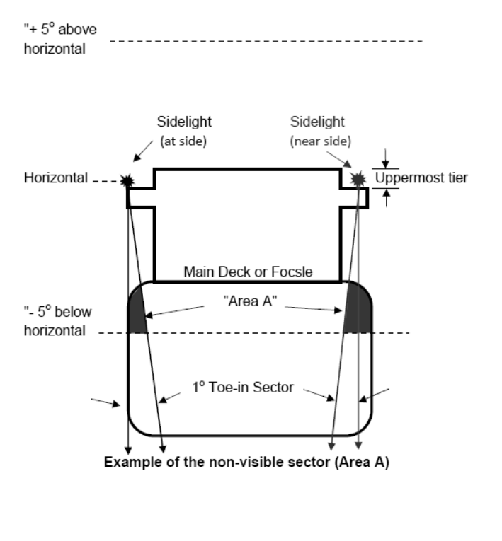

<!-- markdownlint-disable MD033 MD024 -->

# COLREG5 (May 2018)

## Interpretation to COLREG 1972 Annex I Sections 9(a)(i) and 10(a)(i)

### Regulation

Annex I, Sections 9(a)(i) and 10(a)(i) read:

#### 9(a)(i) – Horizontal sectors

In the forward direction, sidelights as fitted on the vessel shall show the minimum required intensities. The intensities shall decrease to reach practical cut-off between 1 degree and 3 degrees outside the prescribed sectors.

#### 10(a)(i) - Vertical sectors

The vertical sectors of electric lights as fitted, with the exception of lights on sailing vessels underway shall ensure that at least the required minimum intensity is maintained at all angles from 5 degrees above to 5 degrees below the horizontal;

### Interpretation

#### 9(a)(i) – Horizontal sectors (MSC.1/Circ.1427, MSC.1/Circ.1260/Rev.1)

COLREG Annex I, section 9(a)(i) would require the full intensity of the side lights to be maintained in the forward direction of 1° outside the prescribed sector (one-degree toe-in sector) with the practical cut-off between 1° and 3°. This is needed to enable other vessels to determine a "head-on-situation" as per COLREG rule 14.

Note:

1. This Unified Interpretation is to be uniformly implemented by IACS Societies on ships contracted for construction on or after 1 July 2019 when encountering design difficulties during the approval of navigation light arrangements. The provisions of this Unified Interpretation will also be applied when design difficulties are encountered during the approval of navigation light arrangements on ships contracted for construction earlier than 1 July 2019 unless they are instructed otherwise in writing by the Administration on whose behalf they are authorized to act as a Recognized Organization.

#### 10(a)(i) - Vertical sectors

Where sidelights, installed in a position at or "near the side" [1], are not fully visible at all angles from 5 degrees above to 5 degrees below the horizontal including the 1° toe-in sector (e.g., see Area A), then that installation is acceptable provided the installed sidelights are visible, with the ship in all normal conditions of trim corresponding to the lightest seagoing draft in the approved T&S Booklet, at a minimum distance of 1000 m measured from the stem when viewed from sea level throughout the horizontal plane of 112.5o defined by Rule 21(b) including the horizontal 1° toe-in sector in the forward direction prescribed in 9(a)(i).

Example of the non-visible sector (Area A)

[1] Refer to MSC.1/Circ.1260/Rev.1, for interpretation of "near the side".

End of Document
