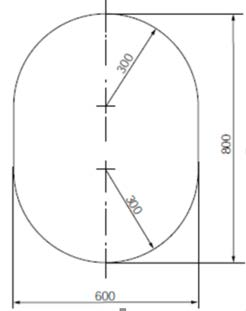
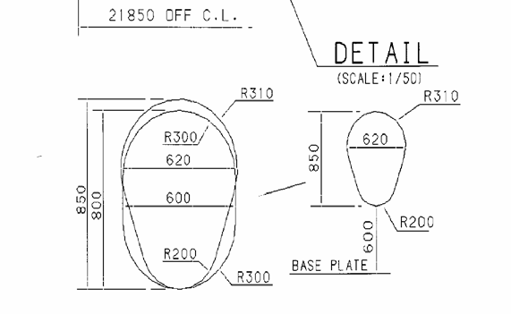

<!-- markdownlint-disable-file MD013 MD033 MD036 MD026 MD041 MD024 MD029 MD060 MD007 -->
# GC16 Cargo tank clearances (on ships constructed on or after 1 July 2016)

(Mar 2016)

**The International Code for the Construction and Equipment of Ships Carrying Liquid Gases in Bulk (IGC Code) as amended by Res. MSC.370(93), 3.5.3.1.2 reads:**

*"access through horizontal openings, hatches or manholes. The dimensions shall be sufficient to allow a person wearing a breathing apparatus to ascend or descend any ladder without obstruction and also to provide a clear opening to facilitate the hoisting of an injured person from the bottom of the space. The minimum clear opening shall be not less than 600 mm x 600 mm;"*

## Interpretation

The minimum clear opening of 600 mm x 600 mm may have corner radii up to 100 mm maximum. In such a case where as a consequence of structural analysis of a given design the stress is to be reduced around the opening, it is considered appropriate to take measures to reduce the stress such as making the opening larger with increased radii, e.g. 600 x 800 with 300 mm radii, in which a clear opening of 600 mm x 600 mm with corner radii up to 100 mm maximum fits.

## Technical Background

The interpretation is based upon the established Guidelines in MSC/Circ.686.

## Ref.

Paragraphs 9 of Annex of MSC/Circ.686.

Note:

1. This UI is to be uniformly implemented by IACS Members on ships whose keels are laid, or which are at a similar stage of construction, on or after 1 July 2016.
2. For ships with keels laid, or at a similar stage of construction, before 1 July 2016, refer to UI GC6.

**The International Code for the Construction and Equipment of Ships Carrying Liquid Gases in Bulk (IGC Code) as amended by Res. MSC.370(93), 3.5.3.1.3 reads:**

*"access through vertical openings or manholes providing passage through the length and breadth of the space. The minimum clear opening shall be not less than 600 mm x 800 mm at a height of not more than 600 mm from the bottom plating unless gratings or other footholds are provided;"*

## Interpretation

1. The minimum clear opening of not less than 600 mm x 800 mm may also include an opening with corner radii of 300 mm. An opening of 600 mm in height x 800 mm in width may be accepted as access openings in vertical structures where it is not desirable to make large opening in the structural strength aspects, i.e. girders and floors in double bottom tanks.

2. Subject to verification of easy evacuation of injured person on a stretcher the vertical opening 850 mm x 620 mm with wider upper half than 600 mm, while the lower half may be less than 600 mm with the overall height not less than 850 mm is considered an acceptable alternative to the traditional opening of 600 mm x 800 mm with corner radii of 300 mm.

3. If a vertical opening is at a height of more than 600 mm steps and handgrips are to be provided. In such arrangements it is to be demonstrated that an injured person can be easily evacuated.

## Technical Background

The interpretation is based upon the established Guidelines in MSC/Circ.686 and an innovative design is considered for easy access by humans through the opening.

## Ref.

Paragraphs 11 of Annex of MSC/Circ.686.

End of Document
