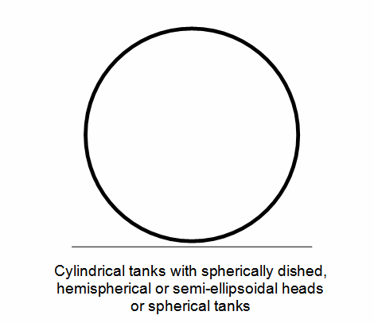
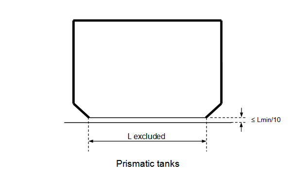
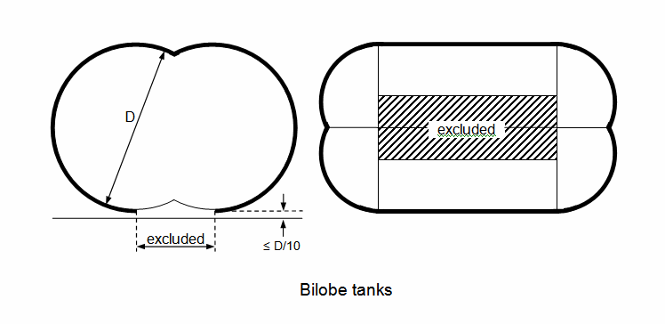
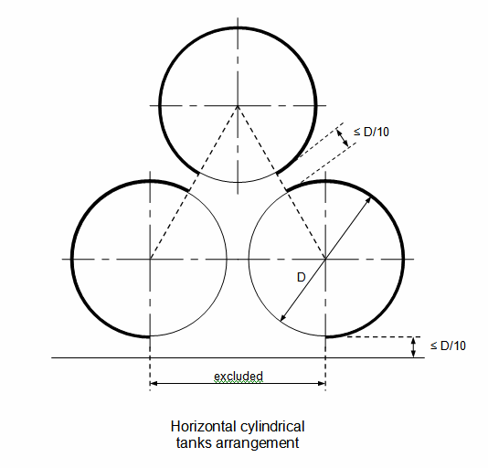

<!-- markdownlint-disable-file MD013 MD033 MD036 MD026 MD041 MD024 MD029 MD060 MD007 -->
# GC19 (Aug 2017) External surface area of the tank for determining sizing of pressure relief valve (paragraph 8.4.1.2 and figure 8.1)

## Regulation

**IMO IGC Code, as amended by MSC.370(93), Ch. 8/8.4.1.2**

8.4.1.2 Vapours generated under fire exposure computed using the following formula:

$$Q = FGA^{0.82} \ (m^3/s),$$

where:

- Q = minimum required rate of discharge of air at standard conditions of 273.15 Kelvin (K) and 0.1013 MPa;
- F = fire exposure factor for different cargo types as follows:
  - 1 for tanks without insulation located on deck;
  - 0.5 for tanks above the deck, when insulation is approved by the Administration. Approval will be based on the use of a fireproofing material, the thermal conductance of insulation and its stability under fire exposure;
  - 0.5 for uninsulated independent tanks installed in holds;
  - 0.2 for insulated independent tanks in holds (or uninsulated independent tanks in insulated holds);
  - 0.1 for insulated independent tanks in inerted holds (or uninsulated independent tanks in inerted, insulated holds);
  - 0.1 for membrane and semi-membrane tanks. For independent tanks partly protruding through the weather decks, the fire exposure factor shall be determined on the basis of the surface areas above and below deck.

Note:

1. This Unified Interpretation is to be uniformly implemented by IACS Societies on ships contracted for construction on or after 1 January 2018.

- G = gas factor according to formula:

$$G = \frac{12.4}{LD} \sqrt{\frac{ZT}{M}}$$

with:

- T = temperature in degrees Kelvin at relieving conditions, i.e. 120% of the pressure at which the pressure relief valve is set;
- L = latent heat of the material being vaporized at relieving conditions, in kJ/kg;
- D = a constant based on relation of specific heats k and is calculated as follows:

$$D = \sqrt{k \left(\frac{2}{k+1}\right)^{\frac{k+1}{k-1}}}$$

where:

- k = ratio of specific heats at relieving conditions, and the value of which is between 1 and 2.2. If k is not known, D = 0.606 shall be used;
- Z = compressibility factor of the gas at relieving conditions. If not known, Z = 1 shall be used; and
- M = molecular mass of the product.

The gas factor of each cargo to be carried shall be determined and the highest value shall be used for PRV sizing.

- A = external surface area of the tank (m2), as defined in 1.2.14, for different tank types, as shown in figure 8.1.

### Figure 8.1

*Figure 8.1*

## Interpretation

*For prismatic tanks*

Lmin, for non-tapered tanks, is the smaller of the horizontal dimensions of the flat bottom of the tank. For tapered tanks, as would be used for the forward tank, Lmin is the smaller of the length and the average width.

For prismatic tanks whose distance between the flat bottom of the tank and bottom of the hold space is equal to or less than Lmin/10:
A = external surface area minus flat bottom surface area.

For prismatic tanks whose distance between the flat bottom of the tank and bottom of the hold space is greater than Lmin/10:
A = external surface area.

End of Document
