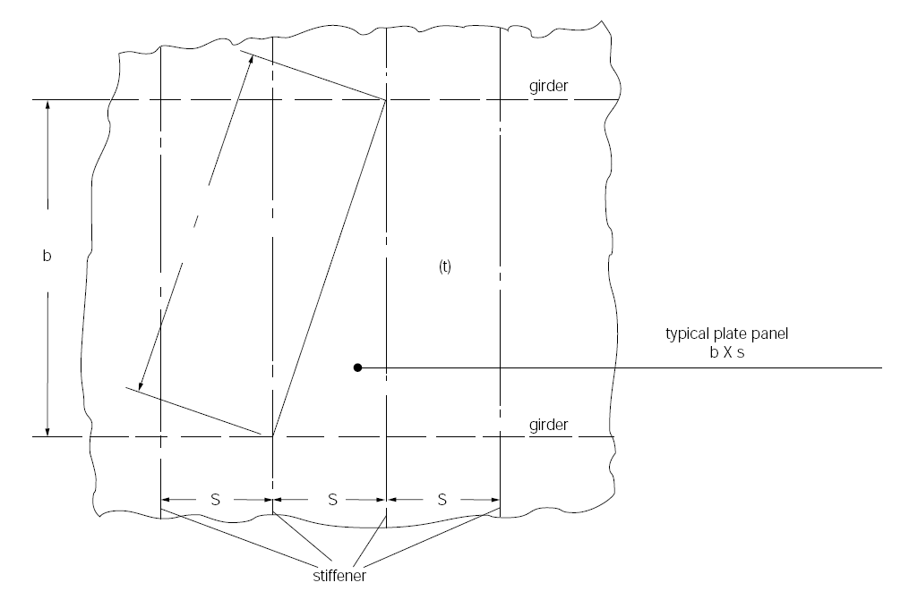

<!-- markdownlint-disable-file MD013 MD033 MD036 MD026 MD041 MD024 MD029 MD060 MD007 -->
# GC28 - Guidance for sizing pressure relief systems for interbarrier spaces

GC28
(Dec 2018 Withdrawn)
(Rev.1, Dec 2019)
(Corr.1 Feb 2021)

Interpretation of the second sentence of paragraph 8.1 of the IMO International Code for the Construction and Equipment of Ships Carrying Liquefied Gases in Bulk (as amended by Resolutions MSC.370(93), MSC.411(97) and MSC.441(99))

The second sentence of paragraph 8.1 reads as follows:

*Hold spaces and interbarrier spaces, which may be subject to pressures beyond their design capabilities, shall also be provided with a suitable pressure relief system*

## Interpretation

### 1 General

1.1 The formula for determining the relieving capacity given in section 2 is for interbarrier spaces surrounding independent type A cargo tanks, where the thermal insulation is fitted to the cargo tanks.

1.2 The relieving capacity of pressure relief devices of interbarrier spaces surrounding independent type B cargo tanks may be determined on the basis of the method given in section 2, however, the leakage rate is to be determined in accordance with 4.7.2 of the IGC Code.

1.3 The relieving capacity of pressure relief devices for interbarrier spaces of membrane and semi- membrane tanks is to be evaluated on the basis of specific membrane/semi-membrane tank design.

1.4 The relieving capacity of pressure relief devices for interbarrier spaces adjacent to integral type cargo tanks may, if applicable, be determined as for type A independent cargo tanks.

Note:

1. The original version of this Unified Interpretation was withdrawn prior to coming into force on 1 January 2020.
2. Rev.1 of this Unified Interpretation is to be uniformly implemented by IACS Societies on ships contracted for construction on or after 1 January 2021.
3. The "contracted for construction" date means the date on which the contract to build the vessel is signed between the prospective owner and the shipbuilder. For further details regarding the date of "contract for construction", refer to IACS Procedural Requirement (PR) No. 29.

### 2 Size of pressure relief devices

The combined relieving capacity of the pressure relief devices for interbarrier spaces surrounding type A independent cargo tanks where the insulation is fitted to the cargo tanks may be determined by the following formula:

$$Q_{sa} = 3{,}4 \cdot A_c \frac{\rho}{\rho_v} \sqrt{h} \quad (m^3/s)$$

Where:

Qsa = minimum required discharge rate of air at standard conditions of 273 K and 1.013 bar

Ac = design crack opening area (m2)

$$A_c = \frac{\pi}{4} \delta \cdot l \quad (m^2)$$

δ = max, crack opening width (m)

δ = 0.2t (m)

t = thickness of tank bottom plating (m)

l = design crack length (m) equal to the diagonal of the largest plate panel of the tank bottom, see sketch below.

h = max liquid height above tank bottom plus 10.MARVS (m)

ρ = density of product liquid phase (kg/m3) at the set pressure of the interbarrier space relief device

ρv = density of product vapour phase (kg/m3) at the set pressure of the interbarrier space relief device and a temperature of 273 K

MARVS = max allowable relief valve setting of the cargo tank (bar).

End of Document
