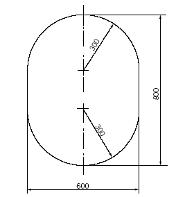
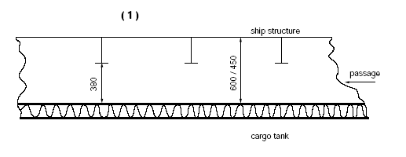
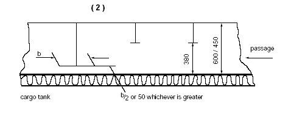
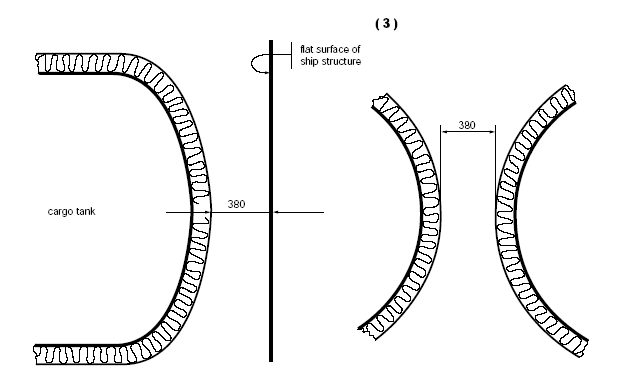
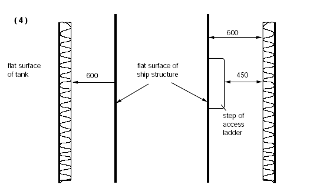
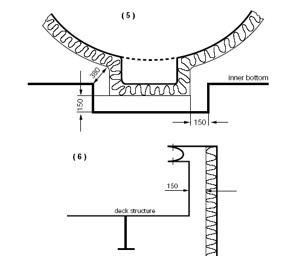

<!-- markdownlint-disable-file MD013 MD033 MD036 MD026 MD041 MD024 MD029 MD060 MD007 -->
# GC6

GC6
(1986)
(Rev.1 Feb 2016)

## Cargo tank clearances

Interpretation of section 3.5 of the INTERNATIONAL CODE FOR THE CONSTRUCTION AND EQUIPMENT OF SHIPS CARRYING LIQUEFIED GASES IN BULK (MSC.5(48)) as amended by resolutions MSC.17(58), MSC.30(61), MSC.32(63), MSC.59(67), MSC.103(73), MSC.177(79) and MSC.220(82)

This section may be interpreted as follows:

1. Designated passage ways below and above cargo tanks should have at least the cross sections as required by 3.5.3.1.3.

2. For the purpose of 3.5.1 or 3.5 2 the following should apply:

    .1 Where the surveyor requires to pass between the surface to be inspected, flat or curved, and structural elements such as deckbeams, stiffeners, frames, girders etc., the distance between that surface and the free edge of the structural elements should be at least 380 mm. The distance between the surface to be inspected and the surface to which the above structural elements are fitted, eg deck, bulkhead or shell, should be at least 450 mm in case of a curved tank surface (eg in case of type C-tank) or 600 mm in case of a flat tank surface (eg in case of type A-tank). (See figure 1).

    .2 Where the surveyor does not require to pass between the surface to be inspected and any part of the structure, for visibility reasons the distance between the free edge of that structural element and the surface to be inspected should be at least 50 mm or half the breadth of the structure's face plate, whichever is the larger. (See figure 2).

    .3 If for inspection of a curved surface the surveyor requires to pass between that surface and another surface, flat or curved, to which no structural elements are fitted, the distance between both surfaces should be at least 380 mm. (See figure 3). Where the surveyor does not require to pass between that curved surface and another surface, a smaller distance than 380 mm may be accepted taking into account the shape of the curved surface.

    .4 If for inspection of an approximately flat surface the surveyor requires to pass between two approximately flat and approximately parallel surfaces, to which no structural elements are fitted, the distance between those surfaces should be at least 600 mm. (See figure 4).

    .5 The minimum distances between a cargo tank sump and adjacent double bottom structure in way of a suction wells should not be less than shown in figure 5. If there is no suction well, the distance between the cargo tank sump and the inner bottom should not be less than 50 mm.

    .6 The distance between a cargo tank dome and deck structures should not be less than 150 mm. (See figure 6).

    .7 If necessary for inspection fixed or portable staging should be installed. This staging should not impair the distances required under .1 to .4.

    .8 If fixed or portable ventilation ducting has to be fitted in compliance with 12.2 such ducting should not impair the distances required under .1 to .4.

3. For the purpose of sub-paragraph 3.5.3.1.2 and .1.3 the following should apply:

    .1 The term "minimum clear opening of not less than 600 x 600 mm" means that such openings may have corner radii up to 100 mm maximum.

    .2 The term "minimum clear opening of not less than 600 x 800 mm" includes also an opening of the following size:

    

    .3 Circular access openings in type-C cargo tanks should have diameters of not less than 600 mm.

---

Note:

1. This Unified Interpretation is to be uniformly implemented by IACS Societies on ships constructed on or after 1 January 1986 but before 1 July 2016.

2. For ships whose keels are laid, or which are at a similar stage of construction, on or after 1 July 2016 refer to UI GC16.

End of Document
