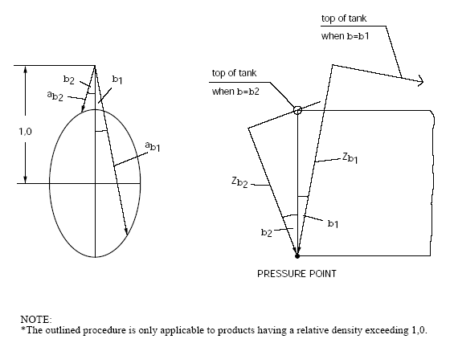

<!-- markdownlint-disable-file MD013 MD033 MD036 MD026 MD041 MD024 MD029 MD060 MD007 -->
# GC7 Carriage of products not covered by the code

GC7
(1986)
(Rev.1 June 2016)

Section 4.23.1.2 of the IMO INTERNATIONAL CODE FOR THE CONSTRUCTION AND EQUIPMENT OF SHIPS CARRYING LIQUEFIED GASES IN BULK (MSC.370(93)) reads:

*"4.23.1.2 The design vapour pressure shall not be less than:*

$$P_o = 0.2 + AC(\rho_r)^{1.5} \ (MPa)$$

*where:*

$$A = 0.00185 \left( \frac{\sigma_m}{\Delta\sigma_A} \right)^2$$

*with:*

- σm = *design primary membrane stress;*
- ΔσA = *allowable dynamic membrane stress (double amplitude at probability level Q = 10-8) and equal to:*
  - *55 N/mm2 for ferritic-perlitic, martensitic and austenitic steel;*
  - *25 N/mm2 for aluminium alloy (5083-O);*

*C = a characteristic tank dimension to be taken as the greatest of the following:*

*h, 0.75b or 0.45ℓ,*

*with:*

- h = *height of tank (dimension in ship's vertical direction) (m);*
- b = *width of tank (dimension in ship's transverse direction)(m);*
- ℓ = *length of tank (dimension in ship's longitudinal direction) (m);*
- ρr = *the relative density of the cargo (ρr = 1 for fresh water) at the design temperature.*

*When a specified design life of the tank is longer than 108 wave encounters, ΔσA shall be modified to give equivalent crack propagation corresponding to the design life."*

Note:

1. Rev.1 of this UI is to be uniformly implemented by IACS Societies on ships the keels of which are laid or which are at a similar stage of construction on or after 1 July 2016.

## Interpretation

1. If the carriage of products not covered by the Code* is intended, it should be verified that the double amplitude of the primary membrane stress Δσm created by the maximum dynamic pressure differential ΔP does not exceed the allowable double amplitude of the dynamic membrane stress ΔσA as specified in paragraph 4.23.1.2 of the Code, ie:

    $$\Delta\sigma_m \leq \Delta\sigma_A$$

2. The dynamic pressure differential ΔP in MPa should be calculated as follows:

    $$\Delta P = \frac{\rho}{1,02.10^5} \left( a_{\beta 1} Z_{\beta 1} - a_{\beta 2} Z_{\beta 2} \right)$$

    where:

    ρ is maximum liquid cargo density in kg/m3 at the design temperature
    aβ, Zβ are as defined in 4.28.1.2 of the Code, see also Figure below
    aβ1, Zβ1 are the aβ and Zβ values giving the maximum liquid pressure (Pgd)max
    aβ2, Zβ2 are the aβ and Zβ values giving the minimum liquid pressure (Pgd)min

    In order to evaluate the maximum pressure differential ΔP, pressure differentials should be evaluated over the full range of the acceleration ellipse as shown in the sketches given below.

NOTE:
*The outlined procedure is only applicable to products having a relative density exceeding 1,0.

End of Document
