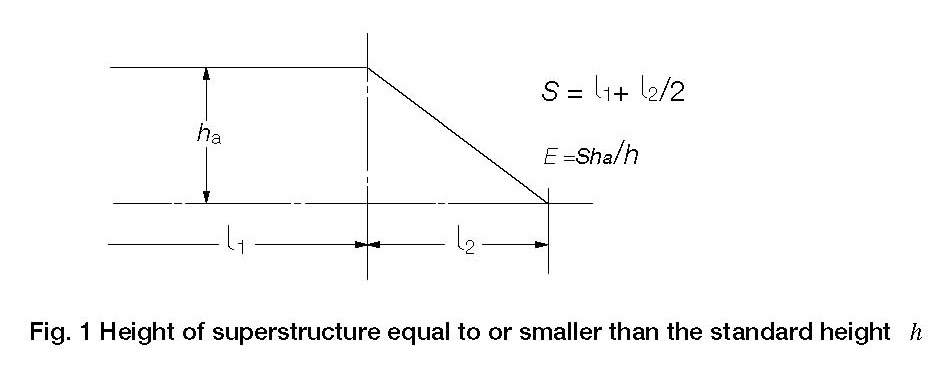
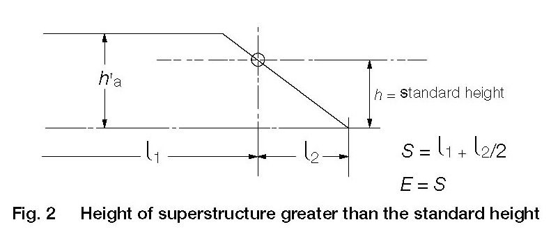
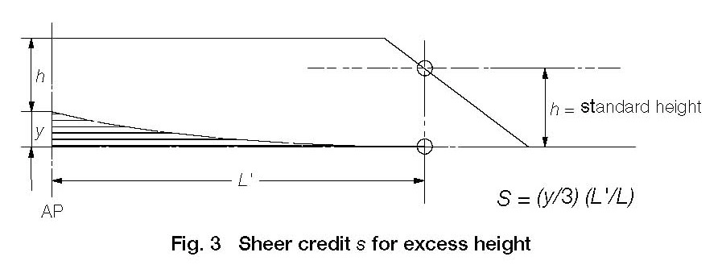

<!-- markdownlint-disable MD033 -->

# LL37 Superstructures with sloping end bulkheads (Regulations 34, 35 and 38(12))

LL37
(1975)
(Rev.1 1983)
(Corr. 1996)
(Rev.2 July 2008)

When taking account of superstructures which have sloping end bulkheads in the calculations of freeboards, such superstructures shall be dealt with in the following manner:

## (a) Regulation 34

(i) When the height of the superstructure, clear of slope, is equal to or smaller than the standard height, length *S* is to be obtained as shown in Fig. 1.

(ii) When the height is greater than the standard, length *S* is to be obtained as shown in Fig 2.

(iii) The foregoing will apply only when the slope, related to the base line, is 15° or greater. Where the slope is less than 15°, the configuration will be treated as sheer.

Fig. 1 Height of superstructure equal to or smaller than the standard height  *h*

Fig. 2   Height of superstructure greater than the standard height

## (b) Regulation 35

When the height of the superstructure, clear of the slope, is less than the standard height, its effective length E shall be its length *S* as obtained from (a)(i), reduced in the ratio of the actual height to the standard height.

Footnote: This UI is also applicable to Regulations 34, 35 and 38(12) of the 1988 Protocol.

## (c) Regulation 38(12)

When a poop or a forecastle has sloping end bulkheads, the sheer credit may be allowed on account of excess height, the formula given in Regulation 38(12) shall be used, the values for *y* and *L'* being as shown in Fig 3.

Fig. 3   Sheer credit *s* for excess height

End of Document
