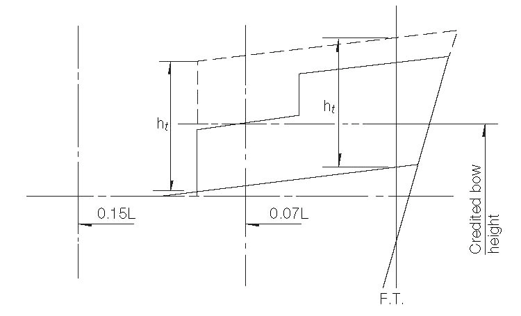

<!-- markdownlint-disable MD033 -->

# LL38 (1976) (Rev.1 1983) (Corr.1 Jun 2006) (Rev.2 July 2008)

## Bow Height (Regulation 39(2))

1. When calculating bow height, the sheer of the forecastle deck may be taken into account, even if the length of the forecastle is less than 0.15*L*, but greater than 0.07*L*, provided that the forecastle height is not less than one half of standard height of superstructure as defined in Regulation 33 between 0.07*L* and the forward terminal.

2. Where the forecastle height is less than one half of standard height of superstructure, as defined in Regulation 33, the credited bow height may be determined as follows (Figs 1 and 2 illustrate the intention of 2.1 and 2.2 respectively):

2.1 When the freeboard deck has sheer extending from abaft 0.15*L*, by a parabolic curve having its origin at 0.15*L* abaft the forward terminal at a height equal to the midship depth of the ship, extended through the point of intersection of forecastle bulkhead and deck, and up to a point at the forward terminal not higher than the level of the forecastle deck. However, if the value of the height denoted ht on Fig 1 is smaller than the value of the height denoted hb, then ht may be replaced in the available bow height.

2.2 When the freeboard deck has sheer extending for less than 0.15*L* or has no sheer, by a line from the forecastle deck at side at 0.07*L* extended parallel to the base line to the forward terminal.

Fig.1

Footnote: This UI is applicable to Regulation 39(2) of the 1988 Protocol.

Fig. 2

ht = Half standard height of superstructure as defined in regulation 33.

$$h_t = Z_b \left(\frac{0.15L}{x_b}\right)^2 - Z_t$$

End of Document
