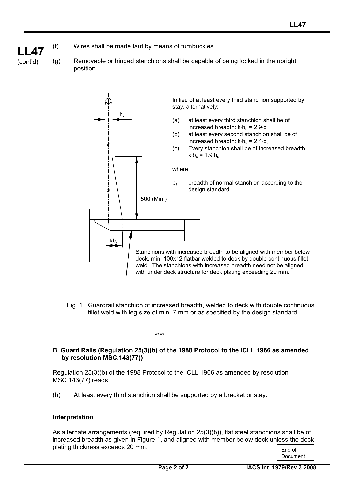

<!-- markdownlint-disable MD033 -->

# LL47 Guard Rails

LL47
(1979)
(Rev.1 1980)
(Rev.2 June 2006)
(Rev.2.1 Oct 2006)
(Corr.1 Oct 2007)
(Rev.3 July 2008)

**Content**

A. Guard Rails (Regulation 25(2) and (3) of 1966 ICLL and the 1988 Protocol)

B. Guard Rails (Regulation 25(3)(b) of the 1988 Protocol to the ICLL 1966 as amended by resolution MSC.143(77))

****

## A. Guard Rails (Regulation 25(2) and (3) of 1966 ICLL and the 1988 Protocol)

Regulation 25(2) and (3) of 1966 ICLL read:

(2) Efficient guard rails or bulwarks shall be fitted to all exposed parts of the freeboard and superstructure decks. The height of the bulwarks or guard rails shall be at least 1 m (39_ inches) from the deck, provided that where this height would interfere with the normal operation of the ship, a lesser height may be approved if the Administration is satisfied that adequate protection is provided.

(3) The opening below the lowest course of the guard rails shall not exceed 230 mm (9 inches). The other courses shall be not more than 380 mm (15 inches) apart. In the case of ships with rounded gunwales the guard rail supports shall be placed on the flat of the deck.

### Interpretation

(a) Fixed, removable or hinged stanchions shall be fitted about 1,5 m apart.

(b) At least every third stanchion shall be supported by a bracket or stay. In lieu of this, flat steel stanchions shall be of increased breadth as given in Figure 1, and aligned with member below deck unless the deck plating thickness exceeds 20 mm.

(c) Wire ropes may only be accepted in lieu of guard rails in special circumstances and then only in limited lengths.

(d) Lengths of chain may only be accepted in lieu of guard rails if they are fitted between two fixed stanchions and/or bulwarks.

(e) The openings between courses should be in accordance with Regulation 25(3) of the Convention.

(f) Wires shall be made taut by means of turnbuckles.

(g) Removable or hinged stanchions shall be capable of being locked in the upright position.

Note:

1. Rev.2 was withdrawn in Nov 2006, to remove ambiguity in referencing relevant regulations.

2. Rev.2.1 of this UI is to be uniformly applied by IACS Societies to ships contracted for construction on or after 1 April 2007. However, Societies are not precluded from applying this UI before such date.

3. The "contracted for construction" date means the date on which the contract to build the vessel is signed between the prospective owner and the shipbuilder. For further details regarding the date of "contract for construction", refer to IACS Procedural Requirement (PR) No. 29.

****

## B. Guard Rails (Regulation 25(3)(b) of the 1988 Protocol to the ICLL 1966 as amended by resolution MSC.143(77))

Regulation 25(3)(b) of the 1988 Protocol to the ICLL 1966 as amended by resolution MSC.143(77) reads:

(b) At least every third stanchion shall be supported by a bracket or stay.

### Interpretation

As alternate arrangements (required by Regulation 25(3)(b)), flat steel stanchions shall be of increased breadth as given in Figure 1, and aligned with member below deck unless the deck plating thickness exceeds 20 mm.

In lieu of at least every third stanchion supported by stay, alternatively:

(a) at least every third stanchion shall be of increased breadth: k&middot;bs = 2.9&middot;bs

(b) at least every second stanchion shall be of increased breadth: k&middot;bs = 2.4&middot;bs

(c) Every stanchion shall be of increased breadth: k&middot;bs = 1.9&middot;bs

where

bs breadth of normal stanchion according to the design standard

Stanchions with increased breadth to be aligned with member below deck, min. 100x12 flatbar welded to deck by double continuous fillet weld. The stanchions with increased breadth need not be aligned with under deck structure for deck plating exceeding 20 mm.

Fig. 1 Guardrail stanchion of increased breadth, welded to deck with double continuous fillet weld with leg size of min. 7 mm or as specified by the design standard.

End of Document
