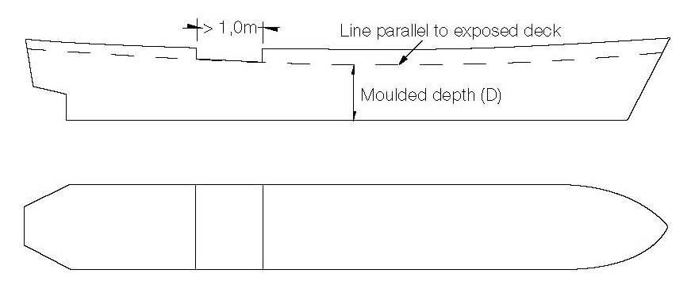
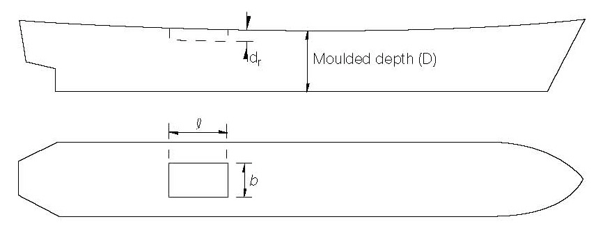
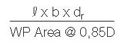

<!-- markdownlint-disable MD033 -->

# LL48 (1980) (Rev.1 1983) (Rev.2 July 2008)

## Moulded Depth (Regulation 3(5)(c) and 3(9) and Freeboard Calculation (Regulation 40(1))

**Discontinuous Freeboard Deck, Stepped Freeboard Deck.**

1. Where a step exists in the freeboard deck, creating a discontinuity extending over the full breadth of the ship, and this step is in excess of one metre in length, Reg 3(9) shall apply. (Fig 1). A step one metre or less in length shall be treated as a recess in accordance with paragraph 2.

2. Where a recess is arranged in the freeboard deck, and this recess does not extend to the side of the ship, the freeboard calculated without regard to the recess is to be corrected for the consequent loss of buoyancy. The correction would be equal to the value obtained by dividing the volume of the recess by the waterplane area of the ship at 85% of the least moulded depth. (Fig 2).

2.1 The correction would be a straight addition to the freeboard obtained after all other corrections have been applied, except bow height correction.

2.2 Where the freeboard, corrected for lost buoyancy as above, is greater than the minimum geometric freeboard determined on the basis of a moulded depth measured to the bottom of the recess, the latter value may be used.

3. Recesses in a second deck, designated as the freeboard deck, may be disregarded in this Interpretation provided all openings in the weather deck are fitted with weathertight closing appliances.

4. Due regard is to be given to the drainage of exposed recesses and to free surface effects on stability.

5. This Interpretation is not intended to apply to dredgers, hopper barges or other similar types of ships with large open holds, where each case would require individual consideration.

Footnotes:

1. This UI is also applicable to Regulations 3(5)(c), 3(9) and 40(1) of 1988 Protocol.

2. Paragraph 1 should be replaced with the following sentence: "A step one metre or less in length shall be treated as a recess in accordance with Reg. 32-1." when this UI applies to the revised 1988 Protocol. Paragraphs from 2 to 5 are not applicable to the revised 1988 Protocol.

Fig. 1 (Para. 1)

Fig. 2 (Para. 2)

Correction is addition to freeboard equal to:

End of Document
