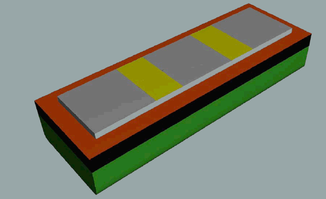
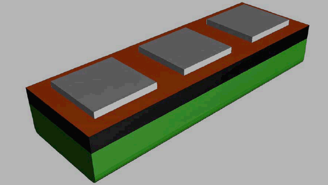
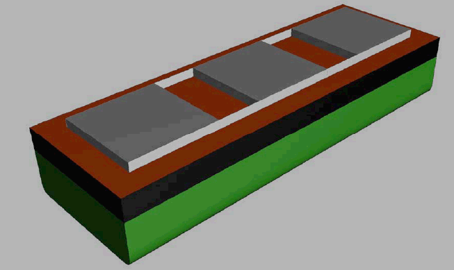

# LL79 Continuous hatchways (Regulation 36(6))

LL79
(July 2014)
(cont)

## Regulation

Regulation 36(6) of 1988 protocol of 1966 ICLL and its amendment MSC.143(77) reads:

*"(6) 'Continuous hatchways' may be treated as a trunk in the freeboard computation, on condition that the provisions of Reg. 36 (6) are complied with in all respects."*

## Interpretation

Generally two types of 'continuous hatchways' can be distinguished:

A. In case of a **single** hatchway the hatchway may be regarded as a 'continuous hatchway'.

B. In case **more than one** hatchway is fitted, the following arrangement may be considered as 'continuous hatchway', too:

Detached hatchways linked by weathertight decked steel structures in between;
The hatchways are connected by longitudinal coamings connected transversally by decked steel structures. In this case, the equivalent 'continuous hatchway' is the entire enclosed volume of the single hatchways and the weathertight spaces between them.

Note:

This Unified Interpretation is to be uniformly implemented by IACS Societies from 1 July 2015.

C. In case more than one hatchway is fitted the following arrangements shall **not** be regarded as 'continuous hatchways':

(1) Detached hatchways;

Each hatchway is to be considered as a "separated detached trunk", thus each hatchway may be treated separately as a trunk in the freeboard computation.

(2) Detached hatchways connected by longitudinal coamings;

All hatchways may be treated in the same manner as (1).

End of Document
