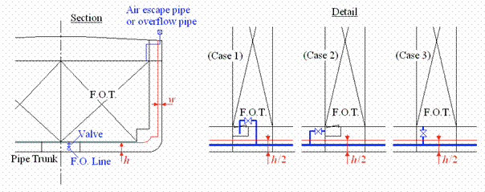

# MPC 87 (Jan 2007)

## Annex I of MARPOL 73/78 Regulation 12A as amended by Resolution MEPC.141(54)

**Regulation 12A.9, as amended by Resolution MEPC.141(54), reads:**

*"Lines of oil fuel piping located at a distance from the ship's bottom of less than h, as defined in paragraph 6, or from the ship's side less than w, as defined in paragraphs 7 and 8 shall be fitted with valves or similar closing devices within or immediately adjacent to the oil fuel tank. These valves shall be capable of being brought into operation from a readily accessible enclosed space the location of which is accessible from the navigation bridge or propulsion machinery control position without traversing exposed freeboard or superstructure decks.*
*The valves shall close in case of remote control system failure (fail in a closed position) and shall be kept closed at sea at any time when the tank contains oil fuel except that they may be opened during oil fuel transfer operations."*

**Regulation 12A.10, as amended by Resolution MEPC.141(54), reads:**

*"Suction wells in oil fuel tanks may protrude into the double bottom below the boundary line defined by the distance h provided that such wells are as small as practicable and the distance between the well bottom and the bottom shell plating is not less than 0.5 h."*

**Interpretation:**

1. Valves for oil fuel tanks located in accordance with the provisions of paragraphs 6, 7 and 8 of MARPOL regulation I/12A may be treated in a manner similar to the treatment of suction wells as per MARPOL regulation I/12A.10 and therefore arranged at a distance from the ship's bottom of not less than *h/2* (see the figure below).

2. Valves for tanks which are permitted to be located at a distance from the ship's bottom or side at a distance less than *h* or *w*, respectively, in accordance with the accidental oil fuel outflow performance standard of MARPOL regulation I/12A.11 may be arranged at the distance less than *h* or *w*, respectively.

3. Fuel tank air escape pipes and overflow pipes are not considered as part of *'lines of fuel oil piping"* and therefore may be located at a distance from the ship's side of less than *w*.

Note:
This Unified Interpretation is to be applied by all Members and Associates on ships delivered on or after 1 August 2010 as defined in MARPOL regulation I/28.9.

End
