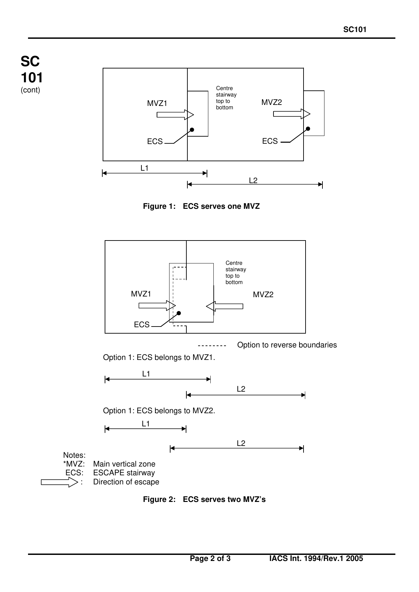
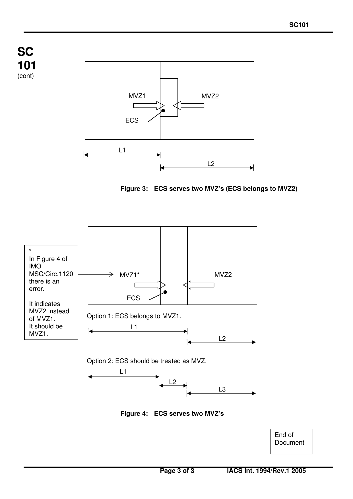

<!-- markdownlint-disable MD033 -->

# SC 101 (1994) (Rev.1 Nov 2005)

## Main vertical zones

**(Reg. II-2/9.2.2.1)**

If a stairway serves two main vertical zones, the maximum length of one main vertical zone is to be measured from the far side of the main vertical zone stairway enclosure. In this case, all boundaries of the stairway enclosure are to be insulated as main vertical zone bulkheads and access doors leading into the stairway are to be provided from the zones (see Figures 1 to 4 for regulation 9.2.2.1). However, the stairway is not to be included in calculating the size of the main vertical zone if it is treated as its own main vertical zone.

*(MSC/Circ. 1120)*

The number of MVZ of 48m length is not limited as long as they comply with all the requirements.

---

Note:

Rev.1 of this UI is to be uniformly implemented by IACS Societies from 1 July 2006.

**Figure 1: ECS serves one MVZ**

Option 1: ECS belongs to MVZ1.

Option 1: ECS belongs to MVZ2.

Notes:

- \*MVZ: Main vertical zone
- ECS: ESCAPE stairway
- ⇒ : Direction of escape

**Figure 2: ECS serves two MVZ's**

(Dashed line — Option to reverse boundaries)

**Figure 3: ECS serves two MVZ's (ECS belongs to MVZ2)**

Option 1: ECS belongs to MVZ1.

Option 2: ECS should be treated as MVZ.

\* In Figure 4 of IMO MSC/Circ.1120 there is an error. It indicates MVZ2 instead of MVZ1. It should be MVZ1.

**Figure 4: ECS serves two MVZ's**

End of Document
