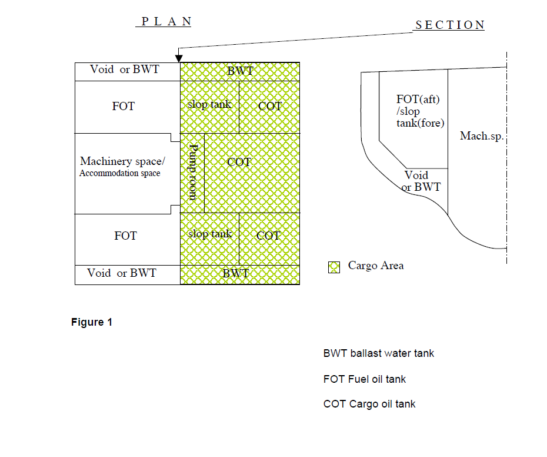
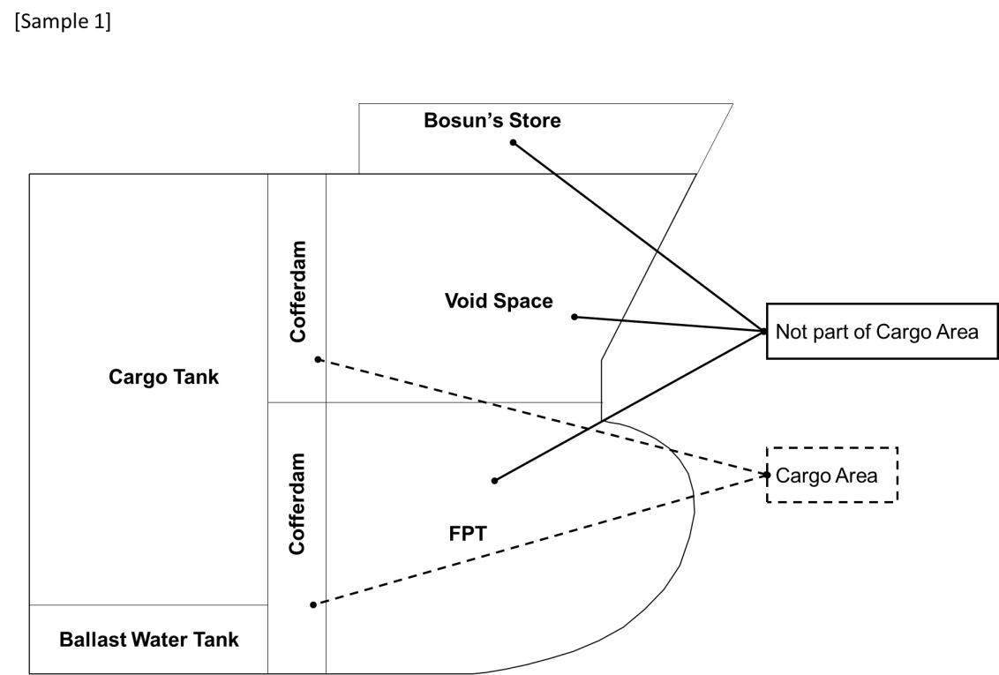
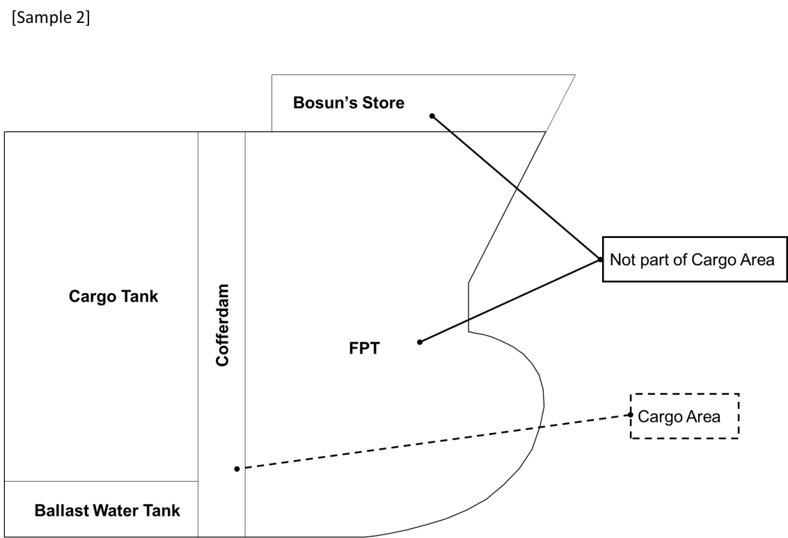
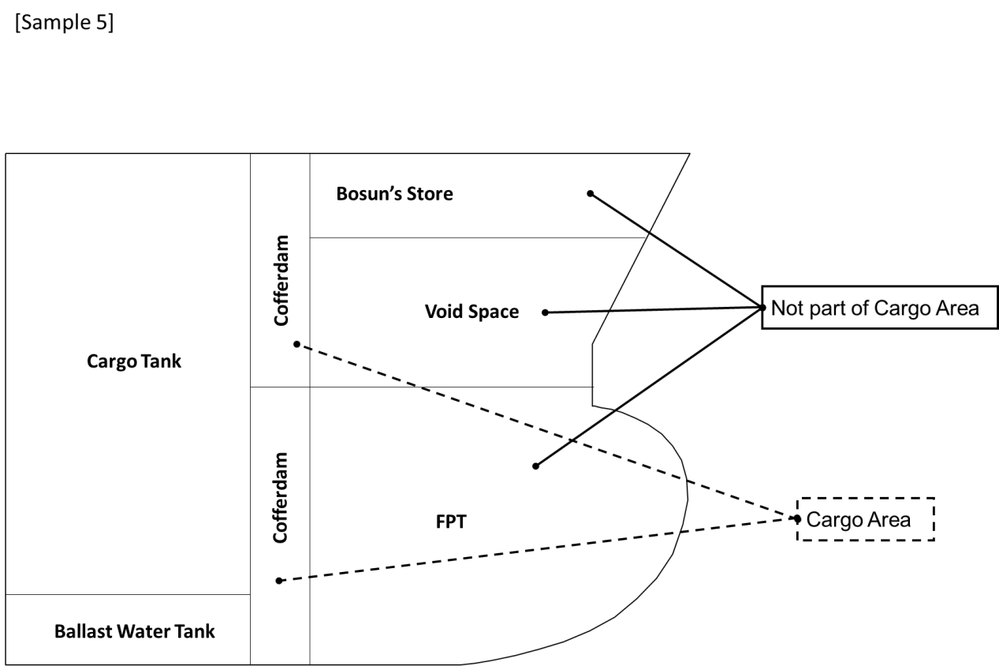
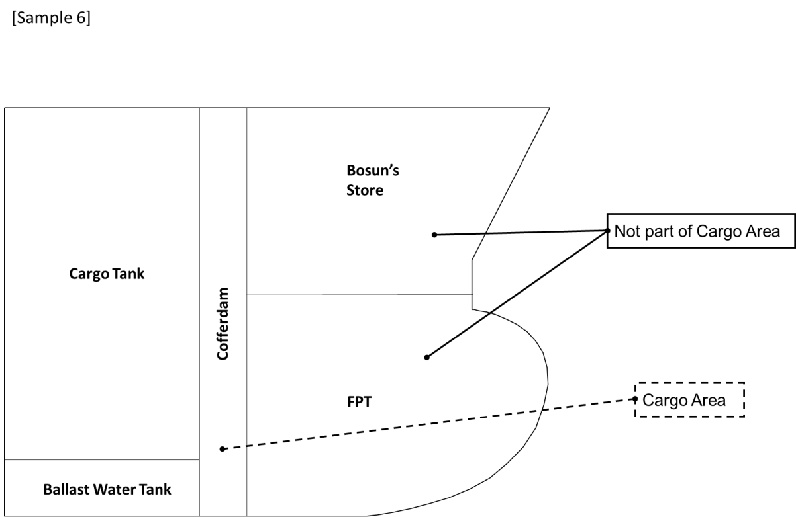
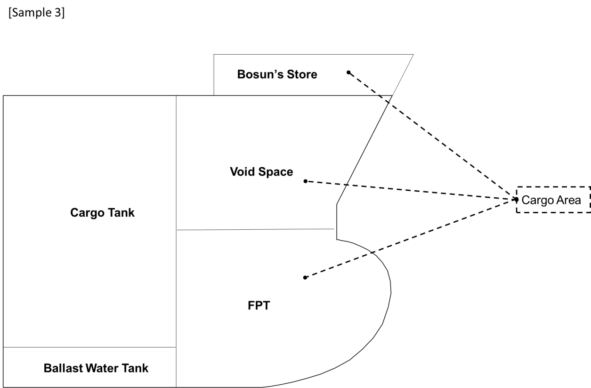
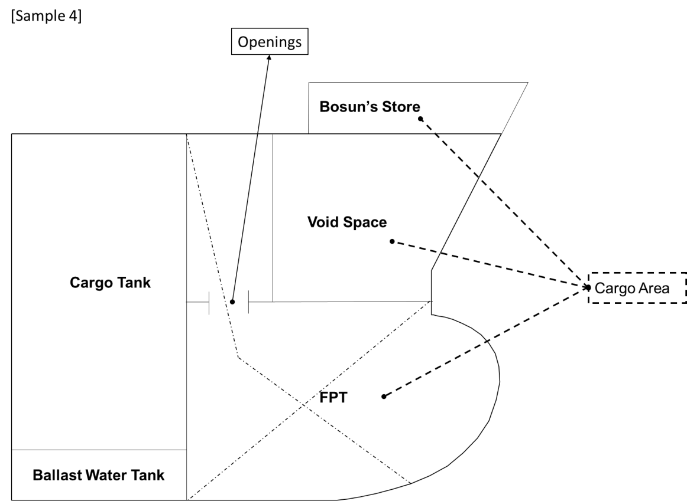

<!-- markdownlint-disable MD033 -->

# SC211 — Protection of fuel oil tanks and designation of fore peak spaces

(June 2006)
(Corr.1 Oct 2007)
(Rev.1 Sep 2024)

Interpretation of regulations 3.6 and 4.5.1.1 of SOLAS Chapter II-2 and paragraphs 1.3.6 and 3.2.1 of the International Code for the Construction and Equipment of Ships Carrying Dangerous Chemicals in Bulk (IBC Code)

**SOLAS II-2/3.6 reads as follows:**

*"Cargo area is that part of the ship that contains cargo holds, cargo tanks, slop tanks and cargo pump-rooms including pump-rooms, cofferdams, ballast and void spaces adjacent to cargo tanks and also deck areas throughout the entire length and breadth of the part of the ship over the above-mentioned spaces."*

**SOLAS II-2/4.5.1.1 reads as follows:**

*"Cargo pump-rooms, cargo tanks, slop tanks and cofferdams shall be positioned forward of machinery spaces. However, oil fuel bunker tanks need not be forward of machinery spaces. Cargo tanks and slop tanks shall be isolated from machinery spaces by cofferdams, cargo pump-rooms, oil bunker tanks or ballast tanks. Pump-rooms containing pumps and their accessories for ballasting those spaces situated adjacent to cargo tanks and slop tanks and pumps for oil fuel transfer, shall be considered as equivalent to a cargo pump-room within the context of this regulation provided that such pump rooms have the same safety standard as that required for cargo pump-rooms. Pump-rooms intended solely for ballast or oil fuel transfer, however, need not comply with the requirements of regulation 10.9. The lower portion of the pump-room may be recessed into machinery spaces of category A to accommodate pumps, provided that the deck head of the recess is in general not more than one third of the moulded depth above the keel, except that in the case of ships of not more than 25,000 tonnes deadweight, where it can be demonstrated that for reasons of access and satisfactory piping arrangements this is impracticable, the Administration may permit a recess in excess of such height, but not exceeding one half of the moulded depth above the keel."*

Note:

1. This UI is to be uniformly implemented by IACS Societies for ships contracted for construction on or after 1 July 2006.
2. Rev.1 of this UI is to be uniformly implemented by IACS Societies for ships contracted for construction on or after 1 January 2026.
3. The "contracted for construction" date means the date on which the contract to build the vessel is signed between the prospective owner and the shipbuilder. For further details regarding the date of "contract for construction", refer to IACS Procedural Requirement (PR) No. 29.

**Paragraph 1.3.6 of the IBC Code reads as follows:**

*Cargo area is that part of the ship that contains cargo tanks, slop tanks, cargo pump rooms including pump rooms, cofferdams, ballast or void spaces adjacent to cargo tanks or slop tanks and also deck areas throughout the entire length and breadth of the part of the ship over the above mentioned spaces. Where independent tanks are installed in hold spaces, cofferdams, ballast or void spaces at the after end of the aftermost hold space or at the forward end of the forward-most hold space are excluded from the cargo area.*

**Paragraph 3.2.1 of the IBC Code reads as follows:**

*No accommodation or service spaces or control stations shall be located within the cargo area except over a cargo pump-room recess or pump-room recess that complies with SOLAS regulation II-2/4.5.1 to 4.5.2.4 and no cargo or slop tank shall be aft the forward end of any accommodation.*

## Interpretations

### Interpretation 1

Void space or ballast water tank protecting fuel oil tank as shown in Figure 1 at Annex, need not be considered as "cargo area" defined in Reg. II-2/3.6 even though they have a cruciform contact with the cargo oil tank or slop tank.

The void space protecting fuel oil tank is not considered as a cofferdam specified in Reg. II-2/4.5.1.1. There is no objection to the locations of the void space shown in Figure 1, even though they have a cruciform contact with the slop tank.

### Interpretation 2

Regarding the spaces referred to in SOLAS II-2/3.6 and IBC Code 1.3.6, the following interpretation is provided:

- A non-hazardous space in the forecastle area which is protected from the cargo tanks by cofferdam, void space or other compartments, will not be defined as part of cargo area.
- Compartments located above the Cofferdam, void or other compartments protecting the non-hazardous spaces will be defined as part of the cargo area.

Interpretation 2 is illustrated in Figure 2.

## Annex

### Figure 1

BWT ballast water tank

FOT Fuel oil tank

COT Cargo oil tank

### Figure 2

Arrangements shown in samples 1, 2, 5 and 6 are applicable to both oil tankers and chemical tankers

[Sample 1]

[Sample 2]

[Sample 5]

[Sample 6]

Arrangements shown in samples 3 and 4 are applicable to oil tankers only.

[Sample 3]

[Sample 4]

End of Document
