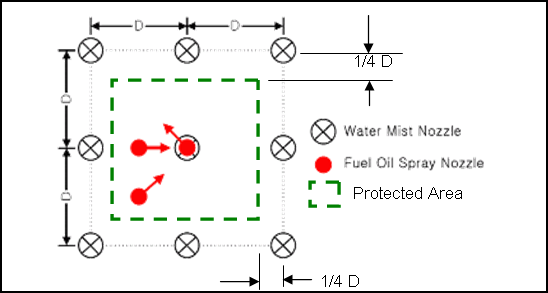
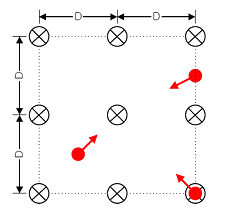
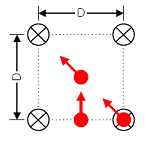
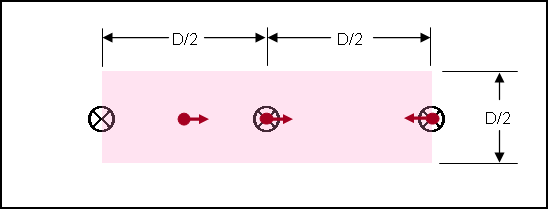
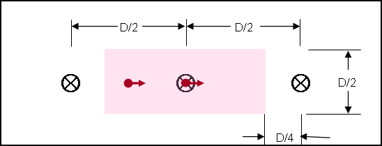

<!-- markdownlint-disable MD033 -->

# SC217 (Aug 2007) (Corr.1 Sept 2007) (Corr.2 Aug 2022) Nozzles installation for fixed water based local application fire-fighting systems for use in category A machinery spaces (MSC/Circ.913)

IMO MSC/Circ.913 paragraphs 3.4.2.1 and 3.4.2.2 in the Appendix of the Annex read:

3.4.2 The results of the tests should be interpreted as follows:

.1 Systems (utilizing a 3 x 3 nozzle grid) that extinguish fires referred to in 3.3.2.1 to 3.3.2.3 are considered to have successfully completed the protocol with the condition that the outer nozzles should be installed outside of the protected area a distance of at least 1/4 of the maximum nozzle spacing.

.2 Systems (utilizing either a 2 x 2 or 3 x 3 nozzle grid) that extinguish fires referred to in 3.3.2.3 to 3.3.2.5 are considered to have successfully completed the protocol and can be designed with the outer nozzles located at the edge of the protected area. This does not prohibit the location of the nozzles outside of the protected area.

**Paragraph 3.4.2.4 in the Appendix of the Annex reads:**

.4 For installations which may be adequately protected using individual nozzles or a single row of nozzles, the effective nozzle coverage (width and length) is defined as 1/2 the maximum nozzle spacing.

Note:

1. This Unified Interpretation is to be applied by all Members and Associate on ships contracted for construction on or after 1 April 2008. However, Members and Associate are not precluded from applying this UI before this date.

2. The "contracted for construction" date means the date on which the contract to build the vessel is signed between the prospective owner and the shipbuilder. For further details regarding the date of "contract for construction", refer to IACS Procedural Requirement (PR) No. 29.

3. This UI was originally developed to interpret IMO MSC/Circ.913 which is superseded by MSC.1/Circ.1387. According to paragraph 4 of MSC.1/Circ.1387, fire and component tests previously conducted in accordance with MSC/Circ.913 remain valid for the approval of new systems.

    Existing fixed water-based local application fire-fighting systems approved and installed based on MSC/Circ.913 should be permitted to remain in service as long as they are serviceable.

## Interpretation

The end nozzles of a single line of nozzles shall be positioned:

- i) outside the hazard where paragraph 3.4.2.1 is applicable, to the distance established in testing, and
- ii) at the edge or outside of the protected area where paragraph 3.4.2.2 is applicable.

A single nozzle shall be located above the fire source and at the centre of an area having dimensions D/2 x D/2.

Sketches of acceptable arrangements are shown in the Annex.

## ANNEX

### a. System (utilizing a 3 X 3 nozzle grid) that extinguishes fires referred to in 3.3.2.1 to 3.3.2.3 of Appendix of Annex of MSC/Circ.913

For this system, the outer nozzles should be installed outside of the protected area a distance of at least 1/4 of the maximum nozzle spacing.

### b. System (utilizing a 3 X 3 nozzle grid) that extinguishes fires referred to in 3.3.2.3 to 3.3.2.5

For this system, outer nozzles can be located either at the edge of the protected area or outside of the protected area.

### c. System (utilizing a 2 X 2 nozzle grid) that extinguishes fires referred to in 3.3.2.3 to 3.3.2.5

For this system, outer nozzles can be located either at the edge of the protected area or outside of the protected area.

### d. A single row of nozzles

#### i) System that extinguishes fires referred to in 3.3.2.3 to 3.3.2.5

For this system, outer nozzles should be placed at least at the edge of the protected area.

#### ii) System that extinguishes fires referred to in 3.3.2.1 to 3.3.2.3

For this system, the outer nozzles should be placed outside of the protected area a distance of at least 1/4 of the maximum nozzle spacing.

### e. Single nozzle

End of Document
