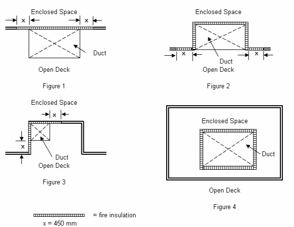

<!-- markdownlint-disable MD033 -->

# SC 301 (May 2024) SOLAS Regulations II-2/9.7.2 and 9.7.5.1 – Separation of ducts from spaces

**SOLAS Regulation Ch II-2/9.7.2 states as amended by IMO Res. MSC.365(93):**

## 7.2 Arrangement of ducts

7.2.1 The ventilation systems for machinery spaces of category A, vehicle spaces, ro-ro spaces, galleys, special category spaces and cargo spaces shall, in general, be separated from each other and from the ventilation systems serving other spaces. However, the galley ventilation systems on cargo ships of less than 4,000 gross tonnage and in passenger ships carrying not more than 36 passengers need not be completely separated from other ventilation systems, but may be served by separate ducts from a ventilation unit serving other spaces. In such a case, an automatic fire damper shall be fitted in the galley ventilation duct near the ventilation unit.

7.2.2 Ducts provided for the ventilation of machinery spaces of category A, galleys, vehicle spaces, ro-ro spaces or special category spaces shall not pass through accommodation spaces, service spaces, or control stations unless they comply with paragraph 7.2.4.

7.2.3 Ducts provided for the ventilation of accommodation spaces, service spaces or control stations shall not pass through machinery spaces of category A, galleys, vehicle spaces, ro-ro spaces or special category spaces unless they comply with paragraph 7.2.4.

7.2.4 As permitted by paragraphs 7.2.2 and 7.2.3 ducts shall be either:

.1.1 constructed of steel having a thickness of at least 3 mm for ducts with a free cross-sectional area of less than 0.075 m2, at least 4 mm for ducts with a free cross-sectional area of between 0.075 m2 and 0.45 m2, and at least 5 mm for ducts with a free cross-sectional area of over 0.45 m2;

.1.2 suitably supported and stiffened;

.1.3 fitted with automatic fire dampers close to the boundaries penetrated; and

.1.4 insulated to "A-60" class standard from the boundaries of the spaces they serve to a point at least 5 m beyond each fire damper;

or

.2.1 constructed of steel in accordance with paragraphs 7.2.4.1.1 and 7.2.4.1.2; and

.2.2 insulated to "A-60" class standard throughout the spaces they pass through, except for ducts that pass through spaces of category (9) or (10) as defined in paragraph 2.2.3.2.2.

7.2.5 For the purposes of paragraphs 7.2.4.1.4 and 7.2.4.2.2, ducts shall be insulated over their entire cross-sectional external surface. Ducts that are outside but adjacent to the specified space, and share one or more surfaces with it, shall be considered to pass through the specified space, and shall be insulated over the surface they share with the space for a distance of 450 mm past the duct*.

7.2.6 Where it is necessary that a ventilation duct passes through a main vertical zone division, an automatic fire damper shall be fitted adjacent to the division. The damper shall also be capable of being manually closed from each side of the division. The control location shall be readily accessible and be clearly and prominently marked. The duct between the division and the damper shall be constructed of steel in accordance with paragraphs 7.2.4.1.1 and 7.2.4.1.2 and insulated to at least the same fire integrity as the division penetrated. The damper shall be fitted on at least one side of the division with a visible indicator showing the operating position of the damper.

*Note: \* Sketches of such arrangements are contained in the Unified Interpretations of SOLAS chapter II-2 (MSC.1/Circ.1276/Rev.2).*

**SOLAS Regulation Ch II-2/9.7.5.1 states:**

## 7.5.1 Requirements for passenger ships carrying more than 36 passengers

7.5.1.1 In addition to the requirements in sections 7.1, 7.2 and 7.3, exhaust ducts from galley ranges shall be constructed in accordance with paragraphs 7.2.4.2.1 and 7.2.4.2.2 and insulated to "A-60" class standard throughout accommodation spaces, service spaces, or control stations they pass through. They shall also be fitted with:

.1 a grease trap readily removable for cleaning unless an alternative approved grease removal system is fitted;

.2 a fire damper located in the lower end of the duct at the junction between the duct and the galley range hood which is automatically and remotely operated and, in addition, a remotely operated fire damper located in the upper end of the duct close to the outlet of the duct;

.3 a fixed means for extinguishing a fire within the duct*;

.4 remote-control arrangements for shutting off the exhaust fans and supply fans, for operating the fire dampers mentioned in paragraph 7.5.1.1.2 and for operating the fire-extinguishing system, which shall be placed in a position outside the galley close to the entrance to the galley. Where a multi-branch system is installed, a remote means located with the above controls shall be provided to close all branches exhausting through the same main duct before an extinguishing medium is released into the system; and

.5 suitably located hatches for inspection and cleaning, including one provided close to the exhaust fan and one fitted in the lower end where grease accumulates.

7.5.1.2 Exhaust ducts from ranges for cooking equipment installed on open decks shall conform to paragraph 7.5.1.1, as applicable, when passing through accommodation spaces or spaces containing combustible materials.

## Interpretation

With respect to the application of SOLAS regulations II-2/9.7.2 and 9.7.5.1, for determining fire insulation for trunks and ducts which pass through an enclosed space, the term "pass through" pertains to the part of the trunk/duct contiguous to the enclosed space.

The following sketches are given as examples:

Examples of ducts contiguous to enclosed space

**Note:**

1. This UI is to be uniformly implemented by IACS Societies for vessels contracted for construction on or after 1 July 2025.
2. The "contracted for construction" date means the date on which the contract to build the vessel is signed between the prospective owner and the shipbuilder. For further details regarding the date of "contract for construction", refer to IACS Procedural Requirement (PR) No. 29.

End of Document
