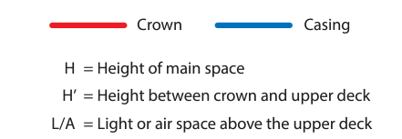
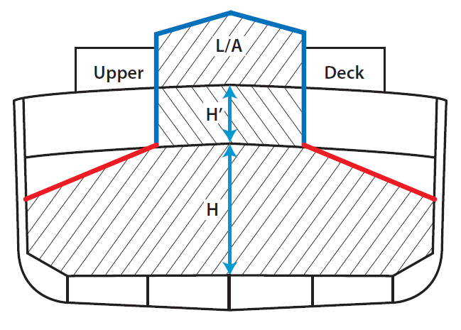
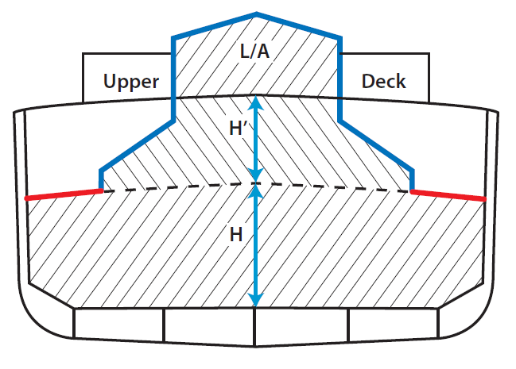

<!-- markdownlint-disable MD033 -->

# SC 302 (May 2024) Interpretation of SOLAS Regulation II-2/11.4.1 Pertaining to Crowns of Machinery Spaces of Category A

SOLAS regulation II-2/11.4.1 reads as follows:

"Crowns and casings

Crowns and casings of machinery spaces of category A shall be of steel construction and shall be insulated as required by tables 9.5 and 9.7, as appropriate.".

## Interpretation

The crown of a machinery space of category A should be understood to mean the underside of the deck and the uppermost horizontal part of the main space of the machinery space. If the upper side bulkheads are sloping, the sloping parts of the bulkheads should be included in the crown.

The following sketches are given as examples:

Note:

1. This Unified Interpretation is to be uniformly implemented by IACS member Societies for ships contracted for construction on or after 1 July 2025.

End of Document
