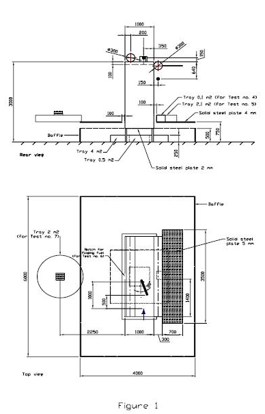

<!-- markdownlint-disable MD033 -->

# SC218 Fire Testing of Equivalent Water-Based Fire Extinguishing Systems

(Oct 2007)
(Rev.1 July 2022)

**Interpretation of IMO MSC/Circ.1165, Appendix B, 4.5.1, as amended by MSC.1/Circ.1237 and MSC.1/1269**

IMO MSC/Circ.1165, Appendix B, 4.5.1, as amended by MSC.1/Circ.1237 and MSC.1/Circ.1269 reads:

## 4.5 Procedure

4.5.1 Except for the flowing fire, the trays used in the test should be filled with at least 50 mm fuel on a water base. Freeboard should be 150 ± 10 mm. For the flowing fire, the fuel should be ignited when flowing down the side of the mock-up, approximately 1 m below the notch. The pre-burn time should be measured from the ignition of the fuel.

Figure 1

Note:

1. This Unified Interpretation is to be applied by all Members and Associate for systems approved on or after 1 July 2008.

2. Rev.1 of this UI shall be uniformly implemented by IACS Societies on or after 1 July 2023.

## Interpretation

It has been recognized that this cannot be achieved for the top tray as the total height of this particular tray is only 100 mm.

The freeboard requirement of 150 mm applies consequently only to the 0.1 m2, 0.5 m2, 2.1 m2 and 4 m2 tray (see IMO MSC.1/Circ.1237, Annex, Figure 1).

Freeboard in the top tray measured from heptane level (which is same as top of notch) to the top of this tray shall be 50 mm.

End of Document
