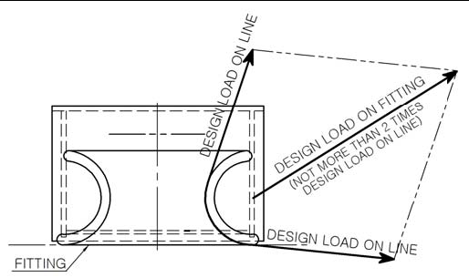
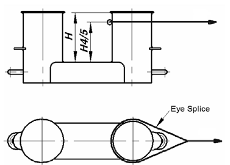
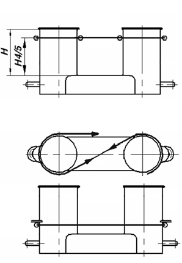

<!-- markdownlint-disable MD033 -->
# Shipboard fittings and supporting hull structures associated with towing and mooring on conventional ships

## A2.0 Application and definitions

Conventional ships are to be provided with arrangements, equipment and fittings of sufficient safe working load to enable the safe conduct of all towing and mooring operations associated with the normal operations of the ship.

This Unified Requirement is to apply to design and construction of shipboard fittings and supporting structures used for the normal towing and mooring operations. Normal towing means towing operations necessary for manoeuvring in ports and sheltered waters associated with the normal operations of the ship.

For ships, not subject to SOLAS Regulation II-1/3-4 Paragraph 1, but intended to be fitted with equipment for towing by another ship or a tug, e.g. such as to assist the ship in case of emergency as given in SOLAS Regulation II-1/3-4 Paragraph 2, the requirements designated as 'other towing' in this Unified Requirement are to be applied to design and construction of those shipboard fittings and supporting hull structures.

This Unified Requirement is not applicable to design and construction of shipboard fittings and supporting hull structures used for special towing services defined as:

- **Escort towing**: Towing service, in particular, for laden oil tankers or LNG carriers, required in specific estuaries. Its main purpose is to control the ship in case of failures of the propulsion or steering system. It should be referred to local escort requirements and guidance given by, e.g., the Oil Companies International Marine Forum (OCIMF).

- **Canal transit towing**: Towing service for ships transiting canals, e.g. the Panama Canal. It should be referred to local canal transit requirements.

- **Emergency towing for tankers**: Towing service to assist tankers in case of emergency. For the emergency towing arrangements, ships subject to SOLAS regulation II-1/3-4 Paragraph 1 are to comply with that regulation and resolution MSC.35(63) as may be amended.

Note:

1) Corr.1 Feb 2004 is to be applied by all Member Societies and Associates to ships contracted for construction after 1 Jan 2005.

2) The "contracted for construction" date means the date on which the contract to build the vessel is signed between the prospective owner and the shipbuilder. For further details regarding the date of "contract for construction", refer to IACS Procedural Requirement (PR) No. 29.

3) Revision 2 of this UR is to be applied by all IACS Members and Associates to ships contracted for construction from 1 January 2007.

4) Revision 3 of this UR is to be uniformly implemented by all IACS Members and Associates to ships contracted for construction from 1 January 2007.

5) Revision 4 of this UR is to be uniformly implemented by all IACS Societies to ships contracted for construction from 1 July 2018.

6) Revision 5 of this UR is to be uniformly implemented by all IACS Societies to ships contracted for construction from 1 January 2022.

IACS Recommendation No. 10 "Anchoring, Mooring and Towing Equipment" may be referred to for recommendations concerning mooring and towing.

The net minimum scantlings of the supporting hull structure are to comply with the requirements given in A2.1.5 and A2.2.5. The net thicknesses, tnet, are the member thicknesses necessary to obtain the above required minimum net scantlings. The required gross thicknesses are obtained by adding the corrosion addition, tc, given in A2.4, to tnet. Shipboard fittings are to comply with the requirements given in A2.1.4 and A2.2.4. For shipboard fittings not selected from an accepted industry standard the corrosion addition, tc, and the wear allowance, tw, given in A2.4 and A2.5, respectively, are to be considered.

For the purpose of this Unified Requirement the following is defined:

- **Conventional ships** means new displacement-type ships of 500 GT and above, excluding high speed craft, special purpose ships, and offshore units of all types. As per MSC.266(84), 'Special purpose ship' means a mechanically self-propelled ship which by reason of its function carries on board more than 12 special personnel.

- **Shipboard fittings** mean those components limited to the following: Bollards and bitts, fairleads, stand rollers, chocks used for normal mooring of the ship and the similar components used for normal or other towing of the ship. Other components such as capstans, winches, etc. are not covered by this Unified Requirement. Any weld or bolt or equivalent device connecting the shipboard fitting to the supporting structure is part of the shipboard fitting and if selected from an industry standard subject to that standard.

- **Supporting hull structures** means that part of the ship structure on/in which the shipboard fitting is placed and which is directly submitted to the forces exerted on the shipboard fitting. The supporting hull structure of capstans, winches, etc. used for normal or other towing and mooring operations mentioned above is also subject to this Unified Requirement.

- **Industry standard** means international standards (ISO, etc.) or standards issued by national association such as DIN or JMSA, etc. which are recognized in the country where the ship is built.

- **The nominal capacity condition** is defined as the theoretical condition where the maximum possible deck cargoes are included in the ship arrangement in their respective positions. For container ships the nominal capacity condition represents the theoretical condition where the maximum possible number of containers is included in the ship arrangement in their respective positions.

- **Ship Design Minimum Breaking Load (MBLSD)** means the minimum breaking load of new, dry mooring lines or tow line for which shipboard fittings and supporting hull structures are designed in order to meet mooring restraint requirements or the towing requirements of other towing service.

- **Line Design Break Force (LDBF)** means the minimum force that a new, dry, spliced, mooring line will break at. This is for all synthetic cordage materials.

## A2.1 Towing

### A2.1.1 Strength

The strength of shipboard fittings used for normal towing operations at bow, sides and stern and their supporting hull structures are to comply with the requirements of this Unified Requirement.

Where a ship is equipped with shipboard fittings intended to be used for other towing services, the strength of these fittings and their supporting hull structures are to comply with the requirements of this Unified Requirement.

For fittings intended to be used for, both, towing and mooring, A2.2 applies to mooring.

### A2.1.2 Arrangement

Shipboard fittings for towing are to be located on stiffeners and/or girders, which are part of the deck construction so as to facilitate efficient distribution of the towing load. Other arrangements may be accepted (for chocks in bulwarks, etc.) provided the strength is confirmed adequate for the intended service.

### A2.1.3 Load considerations

The minimum design load applied to supporting hull structures for shipboard fittings is to be:

(1) For normal towing operations, 1.25 times the intended maximum towing load (e.g. static bollard pull) as indicated on the towing and mooring arrangements plan,

(2) For other towing service, the ship design minimum breaking load according to IACS Recommendation No. 10 "Anchoring, Mooring and Towing Equipment" (see Notes),

(3) For fittings intended to be used for, both, normal and other towing operations, the greater of the design loads according to (1) and (2).

*Notes:*

1. *Side projected area including that of deck cargoes as given by the ship nominal capacity condition is to be taken into account for selection of towing lines and the loads applied to shipboard fittings and supporting hull structures. The nominal capacity condition is defined in A2.0.*

2. *The increase of the line design break force for synthetic ropes according to Recommendation No. 10 needs not to be taken into account for the loads applied to shipboard fittings and supporting hull structures.*

When a safe towing load TOW greater than that determined according to A2.1.6 is requested by the applicant, then the design load is to be increased in accordance with the appropriate TOW/design load relationship given by A2.1.3 and A2.1.6.

The design load is to be applied to fittings in all directions that may occur by taking into account the arrangement shown on the towing and mooring arrangements plan. Where the towing line takes a turn at a fitting the total design load applied to the fitting is equal to the resultant of the design loads acting on the line, see figure below. However, in no case does the design load applied to the fitting need to be greater than twice the design load on the line.

### A2.1.4 Shipboard fittings

Shipboard fittings may be selected from an industry standard accepted by the Society and at least based on the following loads.

(1) For normal towing operations, the intended maximum towing load (e.g. static bollard pull) as indicated on the towing and mooring arrangements plan,

(2) For other towing service, the ship design minimum breaking load of the tow line according to IACS Recommendation No. 10 "Anchoring, Mooring and Towing Equipment" (see Notes in A2.1.3),

(3) For fittings intended to be used for, both, normal and other towing operations, the greater of the loads according to (1) and (2).

Towing bitts (double bollards) may be chosen for the towing line attached with eye splice if the industry standard distinguishes between different methods to attach the line, i.e. figure-of-eight or eye splice attachment.

When the shipboard fitting is not selected from an accepted industry standard, the strength of the fitting and of its attachment to the ship is to be in accordance with A2.1.3 and A2.1.5. Towing bitts (double bollards) are required to resist the loads caused by the towing line attached with eye splice. For strength assessment beam theory or finite element analysis using net scantlings is to be applied, as appropriate. Corrosion additions are to be as defined in A2.4. A wear down allowance is to be included as defined in A2.5. At the discretion of the Society, load tests may be accepted as alternative to strength assessment by calculations.

### A2.1.5 Supporting hull structures

The design load applied to supporting hull structures is to be in accordance with A2.1.3.

The reinforced members beneath shipboard fittings are to be effectively arranged for any variation of direction (horizontally and vertically) of the towing forces acting upon the shipboard fittings, see figure below for a sample arrangement. Proper alignment of fitting and supporting hull structure is to be ensured.

The acting point of the towing force on shipboard fittings is to be taken at the attachment point of a towing line or at a change in its direction. For bollards and bitts the attachment point of the towing line is to be taken not less than 4/5 of the tube height above the base, see figure below.

Allowable stresses under the design load conditions as specified in A2.1.3 are as follows:

(1) For strength assessment by means of beam theory or grillage analysis:

Normal stress: 1.0 ReH;
Shearing stress: 0.6 ReH.

Normal stress is the sum of bending stress and axial stress No stress concentration factors being taken into account.

(2) For strength assessment by means of finite element analysis:

Von Mises stress: 1.0 ReH.

For strength assessment by means of finite element analysis the mesh is to be fine enough to represent the geometry as realistically as possible. The aspect ratios of elements are not to exceed 3. Girders are to be modelled using shell or plane stress elements. Symmetric girder flanges may be modelled by beam or truss elements. The element height of girder webs must not exceed one-third of the web height. In way of small openings in girder webs the web thickness is to be reduced to a mean thickness over the web height as per individual Class Society rules. Large openings are to be modelled. Stiffeners may be modelled by using shell, plane stress, or beam elements. The mesh size of stiffeners is to be fine enough to obtain proper bending stress. If flat bars are modeled using shell or plane stress elements, dummy rod elements are to be modelled at the free edge of the flat bars and the stresses of the dummy elements are to be evaluated. Stresses are to be read from the centre of the individual element. For shell elements the stresses are to be evaluated at the mid plane of the element.

ReH is the specified minimum yield stress of the material.

### A2.1.6 Safe Towing Load (TOW)

1) The safe towing load (TOW) is the safe load limit of shipboard fittings used for towing purpose.

2) TOW used for normal towing operations is not to exceed 80% of the design load per A2.1.3 (1).

3) TOW used for other towing operations is not to exceed 80% of the design load according to A2.1.3 (2).

4) For fittings used for both normal and other towing operations, the greater of the safe towing loads according to 2) and 3) is to be used.

5) TOW, in t, of each shipboard fitting is to be marked (by weld bead or equivalent) on the deck fittings used for towing. For fittings intended to be used for, both, towing and mooring, SWL, in t, according to A2.2.6 is to be marked in addition to TOW.

6) The above requirements on TOW apply for the use with no more than one line. If not otherwise chosen, for towing bitts (double bollards) TOW is the load limit for a towing line attached with eye-splice.

7) The towing and mooring arrangements plan mentioned in A2.3 is to define the method of use of towing lines.

## A2.2 Mooring

### A2.2.1 Strength

The strength of shipboard fittings used for mooring operations and of their supporting hull structures as well as the strength of supporting hull structures of winches and capstans is to comply with the requirements of this Unified Requirement.

For fittings intended to be used for, both, mooring and towing, A2.1 applies to towing.

### A2.2.2 Arrangement

Shipboard fittings, winches and capstans for mooring are to be located on stiffeners and/or girders, which are part of the deck construction so as to facilitate efficient distribution of the mooring load. Other arrangements may be accepted (for chocks in bulwarks, etc.) provided the strength is confirmed adequate for the service.

### A2.2.3 Load considerations

1) The minimum design load applied to supporting hull structures for shipboard fittings is to be 1.15 times the ship design minimum breaking load according to IACS Recommendation No. 10 "Anchoring, Mooring and Towing Equipment" (see Notes).

2) The minimum design load applied to supporting hull structures for winches is to be 1.25 times the intended maximum brake holding load, where the maximum brake holding load is to be assumed not less than 80% of the ship design minimum breaking load according to IACS Recommendation No. 10 "Anchoring, Mooring and Towing Equipment", see Notes. For supporting hull structures of capstans, 1.25 times the maximum hauling-in force is to be taken as the minimum design load.

3) When a safe working load SWL greater than that determined according to A2.2.6 is requested by the applicant, then the design load is to be increased in accordance with the appropriate SWL/design load relationship given by A2.2.3 and A2.2.6.

4) The design load is to be applied to fittings in all directions that may occur by taking into account the arrangement shown on the towing and mooring arrangements plan. Where the mooring line takes a turn at a fitting the total design load applied to the fitting is equal to the resultant of the design loads acting on the line, refer to the figure in A2.1.3. However, in no case does the design load applied to the fitting need to be greater than twice the design load on the line.

*Notes:*

1. *If not otherwise specified by Recommendation No. 10, side projected area including that of deck cargoes as given by the ship nominal capacity condition is to be taken into account for selection of mooring lines and the loads applied to shipboard fittings and supporting hull structures. The nominal capacity condition is defined in A2.0.*

2. *The increase of the line design break force for synthetic ropes according to Recommendation No. 10 needs not to be taken into account for the loads applied to shipboard fittings and supporting hull structures.*

### A2.2.4 Shipboard fittings

Shipboard fittings may be selected from an industry standard accepted by the Society and at least based on the ship design minimum breaking load according to IACS Recommendation No. 10 "Anchoring, Mooring and Towing Equipment" (see Notes in A2.2.3).

Mooring bitts (double bollards) are to be chosen for the mooring line attached in figure-of-eight fashion if the industry standard distinguishes between different methods to attach the line, i.e. figure-of-eight or eye splice attachment.

When the shipboard fitting is not selected from an accepted industry standard, the strength of the fitting and of its attachment to the ship is to be in accordance with A2.2.3 and A2.2.5. Mooring bitts (double bollards) are required to resist the loads caused by the mooring line attached in figure-of-eight fashion, see Note. For strength assessment beam theory or finite element analysis using net scantlings is to be applied, as appropriate. Corrosion additions are to be as defined in A2.4. A wear down allowance is to be included as defined in A2.5. At the discretion of the classification Society, load tests may be accepted as alternative to strength assessment by calculations.

*Note:*

*With the line attached to a mooring bitt in the usual way (figure-of-eight fashion), either of the two posts of the mooring bitt can be subjected to a force twice as large as that acting on the mooring line. Disregarding this effect, depending on the applied industry standard and fitting size, overload may occur.*

### A2.2.5 Supporting hull structures

The design load applied to supporting hull structures is to be in accordance with A2.2.3.

The arrangement of reinforced members beneath shipboard fittings, winches and capstans is to consider any variation of direction (horizontally and vertically) of the mooring forces acting upon the shipboard fittings, see figure in A2.1.5 for a sample arrangement. Proper alignment of fitting and supporting hull structure is to be ensured.

The acting point of the mooring force on shipboard fittings is to be taken at the attachment point of a mooring line or at a change in its direction. For bollards and bitts the attachment point of the mooring line is to be taken not less than 4/5 of the tube height above the base, see a) in figure below. However, if fins are fitted to the bollard tubes to keep the mooring line as low as possible, the attachment point of the mooring line may be taken at the location of the fins, see b) in figure below.

Allowable stresses under the design load conditions as specified in A2.2.3 are as follows:

(1) For strength assessment by means of beam theory or grillage analysis:

- Normal stress: 1.0 ReH
- Shear stress: 0.6 ReH

Normal stress is the sum of bending stress and axial stress. No stress concentration factors being taken into account.

(2) For strength assessment by means of finite element analysis:

Von Mises stress: 1.0 ReH.

For strength assessment by means of finite element analysis the mesh is to be fine enough to represent the geometry as realistically as possible. The aspect ratios of elements are not to exceed 3. Girders are to be modelled using shell or plane stress elements. Symmetric girder flanges may be modelled by beam or truss elements. The element height of girder webs must not exceed one-third of the web height. In way of small openings in girder webs the web thickness is to be reduced to a mean thickness over the web height as per individual Class Society rules. Large openings are to be modelled. Stiffeners may be modelled by using shell, plane stress, or beam elements. The mesh size of stiffeners is to be fine enough to obtain proper bending stress. If flat bars are modeled using shell or plane stress elements, dummy rod elements are to be modelled at the free edge of the flat bars and the stresses of the dummy elements are to be evaluated. Stresses are to be read from the centre of the individual element. For shell elements the stresses are to be evaluated at the mid plane of the element.

ReH is the specified minimum yield stress of the material.

### A2.2.6 Safe Working Load (SWL)

1) The Safe Working Load (SWL) is the safe load limit of shipboard fittings used for mooring purpose.

2) Unless a greater SWL is requested by the applicant according to A2.2.3 3), the SWL is not to exceed the ship design minimum breaking load according to IACS Recommendation No. 10 "Anchoring, Mooring and Towing Equipment", see Notes in A2.2.3.

3) The SWL, in t, of each shipboard fitting is to be marked (by weld bead or equivalent) on the deck fittings used for mooring. For fittings intended to be used for, both, mooring and towing, TOW, in t, according to A2.1.6 is to be marked in addition to SWL.

4) The above requirements on SWL apply for the use with no more than one mooring line.

5) The towing and mooring arrangements plan mentioned in A2.3 is to define the method of use of mooring lines.

## A2.3 Towing and mooring arrangements plan

1) The SWL and TOW for the intended use for each shipboard fitting is to be noted in the towing and mooring arrangements plan available on board for the guidance of the Master. It is to be noted that TOW is the load limit for towing purpose and SWL that for mooring purpose. If not otherwise chosen, for towing bitts it is to be noted that TOW is the load limit for a towing line attached with eye-splice.

2) Information provided on the plan is to include in respect of each shipboard fitting:

    1. location on the ship;
    2. fitting type;
    3. SWL/TOW;
    4. purpose (mooring/harbour towing/other towing);
    5. manner of applying towing or mooring line load including limiting fleet angle i.e. angle of change in direction of a line at the fitting.

Item 3 with respect to items 4 and 5, is subject to approval by the Society.

Furthermore, information provided on the plan is to include:

    1. the arrangement of mooring lines showing number of lines (N);
    2. the ship design minimum breaking load (MBLSD);
    3. the acceptable environmental conditions
       (refer for minimum conditions to IACS Recommendation No. 10 "Anchoring, Mooring and Towing Equipment" for the recommended ship design minimum breaking load for ships with Equipment Number EN > 2000:
       - 30 second mean wind speed from any direction (vw or vw* according to IACS Recommendation No. 10).
       - Maximum current speed acting on bow or stern (+/-10°)).

3) The information as given in 2) is to be incorporated into the pilot card in order to provide the pilot proper information on harbour and other towing operations.

## A2.4 Corrosion addition

The total corrosion addition, tc, is not to be less than the following values:

1) Ships covered by Common Structural Rules for Bulk Carriers and Oil Tankers: tc, total corrosion addition to be as defined in these rules.

2) Other ships:

- For the supporting hull structure, according to the Society's Rules for the surrounding structure (e.g. deck structures, bulwark structures).
- For pedestals and foundations on deck which are not part of a fitting according to an accepted industry standard, 2.0 mm.
- For shipboard fittings not selected from an accepted industry standard, 2.0 mm.

## A2.5 Wear allowance

In addition to the corrosion addition given in A2.4 the wear allowance, tw, for shipboard fittings not selected from an accepted industry standard is not to be less than 1.0 mm, added to surfaces which are intended to regularly contact the line.

## A2.6 Survey after construction

The condition of deck fittings, their pedestals or foundations, if any, and the hull structures in the vicinity of the fittings are to be examined in accordance with the Society's Rules.
