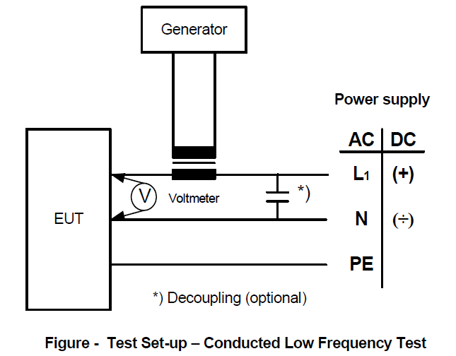

<!-- markdownlint-disable MD033 -->

# E10 Test Specification for Type Approval

## E10.1 General

This Test Specification is applicable, but not confined, to electrical, electronic and programmable equipment intended for control, monitoring, alarm and protection systems for use in ships.

## E10.2 Testing

These tests are to demonstrate the ability of the equipment to function as intended under the specified testing conditions.

The extent of the testing (i.e. the selection and sequence of carrying out tests and number of pieces to be tested) is to be determined upon examination and evaluation of the equipment or component subject to testing giving due regard to its intended usage.

Equipment is to be tested in its normal position if otherwise not specified in the test specification.

Relevant tests are as listed in the Table.

Note:

1. Rev.5 of this UR is to be uniformly implemented by IACS Societies from 1 January 2008.

2. Rev.6 of this UR is to be uniformly implemented by IACS Societies from 1 January 2016.

3. Rev.7 of this UR is to be uniformly implemented by IACS Societies for equipment for which the date of application for type approval certification is dated on or after 1 January 2020.

4. Equipment intended to be installed on ships contracted for construction on or after 1 January 2022 is to comply with Rev.7 of this UR.

5. The "contracted for construction" date means the date on which the contract to build the vessel is signed between the prospective owner and the shipbuilder. For further details regarding the date of "contract for construction", refer to IACS Procedural Requirement (PR) No. 29.

6. The "date of application for type approval" is the date of documents accepted by the Classification Society as request for type approval certification of a new equipment type or of an equipment type that has undergone substantive modifications in respect of the one previously type approved, or for renewal of an expired type approval certificate.

7. Rev.8 of this UR is to be uniformly implemented by IACS Societies for equipment for which the date of application for type approval certification is dated on or after 1 July 2022.

8. Rev.9 of this UR is to be uniformly implemented by IACS Societies for equipment for which the date of application for type approval certification is dated on or after 1 July 2024.

9. Rev.10 of this UR is to be uniformly implemented by IACS Societies for equipment for which the date of application for type approval certification is dated on or after 1 January 2026.

Note:

a) \* These test requirements are harmonised with IEC 60092-504:2016 "Electrical Installations in Ships -- Part 504: Special features -- Control and Instrumentation" and IEC 60533:2015 "Electrical and electronic installations in ships -- electromagnetic compatibility". Electrical and electronic equipment on board ships, required neither by classification rules nor by International Conventions, liable to cause electromagnetic disturbance shall be of type which fulfil the test requirements of test specification items 19 and 20.

b) As used in this document, and in contrast to a complete performance test, a functional test is a simplified test sufficient to verify that the equipment under test (EUT) has not suffered any deterioration caused by the individual environmental tests.

### Type testing condition for equipment covered by E10.1

| NO. | TEST | PROCEDURE ACC. TO:\* | TEST PARAMETERS | OTHER INFORMATION |
| :-- | :-- | :-- | :-- | :-- |

\* indicates the testing procedure which is normally to be applied. However, equivalent testing procedure may be accepted by the individual Society provided that the Unified Requirements stated in the other columns are fulfilled. Later versions (including revisions) of the international standards specified in this UR are acceptable for use, provided the Society determines them to be equivalent to the technical specifications of this UR.

| NO. | TEST | PROCEDURE ACC. TO:\* | TEST PARAMETERS | OTHER INFORMATION |
| :-- | :-- | :-- | :-- | :-- |
| 1. | Visual inspection | - | - | - conformance to drawings, design data |
| 2. | Performance test | Manufacturer performance test programme based upon specification and relevant Rule requirements. When the EUT is required to comply with an international performance standard, e.g. protection relays, verification of requirements in the standard are to be part of the performance testing required in this initial test and subsequent performance tests after environmental testing where required in the UR. | - standard atmosphere conditions - temperature: 25°C ± 10°C - relative humidity: 60% ± 30% - air pressure: 96 Kpa ± 10KPa | - confirmation that operation is in accordance with the requirements specified for particular system or equipment; - checking of self-monitoring features; - checking of specified protection against an access to the memory; - checking against effect of unerroneous use of control elements in the case of computer systems. |
| 3. | External power supply failure | - | - 3 interruptions during 5 minutes; - switching-off time 30 s each case | - The time of 5 minutes may be exceeded if the equipment under test needs a longer time for start-up, e.g. booting sequence - For equipment which requires booting, one additional power supply interruption during booting to be performed |
| 4. | Power supply variations a) electric | - | AC SUPPLY: Combination 1: Voltage variation permanent +6%, Frequency variation permanent +5%; Combination 2: +6%, -5%; Combination 3: -10%, -5%; Combination 4: -10%, +5%; voltage transient 1,5 s %, frequency transient 5 s %; Combination 5: +20, +10; Combination 6: -20, -10. DC SUPPLY: Voltage tolerance continuous ±10%; Voltage cyclic variation 5%; Voltage ripple 10%. Electric battery supply: - +30% to --25% for equipment connected to charging battery or as determined by the charging/discharging characteristics, including ripple voltage from the charging device; - +20% to --25% for equipment not connected to the battery during charging. | Verification of: - equipment behaviour upon loss and restoration of supply; - possible corruption of programme or data held in programmable electronic systems, where applicable. |
| 4. | b) pneumatic and hydraulic | - | Pressure: ±20% Duration: 15 minutes | |
| 5. | Dry heat (see note 1) | IEC 60068-2-2:2007 Test Bb for non-heat dissipating equipment | Temperature: 55° ± 2°C Duration: 16 hours or Temperature: 70°C ± 2°C Duration: 16 hours | - equipment operating during conditioning and testing; - functional test (b) during the last hour at the test temperature. - for equipment specified for increased temperature the dry heat test is to be conducted at the agreed test temperature and duration. |
| | | IEC 60068-2-2:2007 Test Be for heat dissipating equipment | Temperature: 55° ± 2°C Duration: 16 hours or Temperature: 70°C ± 2°C Duration: 16 hours | - equipment operating during conditioning and testing with cooling system on if provided; - functional test (b) during the last hour at the test temperature. - for equipment specified for increased temperature the dry heat test is to be conducted at the agreed test temperature and duration. |
| 6. | Damp heat | IEC 60068-2-30:2005 test Db | Temperature: 55°C Humidity: 95% Duration: 2 cycles 2 x (12 +12 hours) | - measurement of insulation resistance before test; - the test shall start with 25°C ± 3°C and at least 95% humidity; - equipment operating during the complete first cycle and switched off during second cycle except for functional test; - functional test during the first 2 hours of the first cycle at the test temperature and during the last 2 hours of the second cycle at the test temperature; Duration of the second cycle can be extended due to more convenient handling of the functional test. - recovery at standard atmosphere conditions; - insulation resistance measurements and performance test. |
| 7. | Vibration | IEC 60068-2-6:2007 Test Fc | 2+3-0 Hz to 13.2 Hz -- amplitude ±1mm 13.2 Hz to 100 Hz -- acceleration ± 0.7 g. For severe vibration conditions such as, e.g. on diesel engines, air compressors, etc.: 2.0 Hz to 25 Hz -- amplitude ±1.6 mm 25.0 Hz to 100 Hz -- acceleration ± 4.0 g. Note: More severe conditions may exist for example on exhaust manifolds or fuel oil injection systems of diesel engines. For equipment specified for increased vibration levels the vibration test is to be conducted at the agreed vibration level, frequency range and duration. Values may be required to be in these cases 40 Hz to 2000 Hz - acceleration ± 10.0g at 600°C, duration 90 min." | - duration in case of no resonance condition 90 minutes at 30 Hz; - duration at each resonance frequency at which Q≥ 2 is recorded - 90 minutes; - during the vibration test, functional tests are to be carried out; - tests to be carried out in three mutually perpendicular planes; - it is recommended as guidance that Q does not exceed 5. - where sweep test is to be carried out instead of the discrete frequency test and a number of resonant frequencies is detected close to each other, duration of the test is to be 120 min. Sweep over a restricted frequency range between 0.8 and 1.2 times the critical frequencies can be used where appropriate. Note: Critical frequency is a frequency at which the equipment being tested may exhibit: - malfunction and/or performance deterioration - mechanical resonances and/or other response effects occur, e.g. chatter |
| 8. | Inclination | IEC 60092-504:2016 | Static 22.5° | a) inclined to the vertical at an angle of at least 22.5° b) inclined to at least 22.5° on the other side of the vertical and in the same plane as in (a), c) inclined to the vertical at an angle of at least 22.5° in plane at right angles to that used in (a), d) inclined to at least 22.5° on the other side of the vertical and in the same plane as in (c). Note: The period of testing in each position should be sufficient to fully evaluate the behaviour of the equipment. |
| | | | Dynamic 22.5° | Using the directions defined in a) to d) above, the equipment is to be rolled to an angle of 22.5° each side of the vertical with a period of 10 seconds. The test in each direction is to be carried out for not less than 15 minutes. On ships for the carriage of liquified gases and chemicals, the emergency power supply is to remain operational with the ship flooded up to a maximum final athwart ship inclination of 30° (see 1983 IGC Code, clause 2.9.2.2, 2014 IGC Code, clause 2.7.2.2, IBC Code, clause 2.9.3.2). Note: These inclination tests are normally not required for equipment with no moving parts. |
| 9. | Insulation resistance | - | Rated supply voltage Un (V) / Test voltage (D.C. voltage) (V) / Min. insulation resistance before test M ohms / after test M ohms: Un ≤ 65 / 2 x Un min. 24V / 10 / 1,0; Un > 65 / 500 / 100 / 10 | - For high voltage equipment, reference is made to UR E11. - insulation resistance test is to be carried out before and after: damp heat test, cold test, salt mist test and high voltage test; - between all phases and earth; and where appropriate, between the phases. Note: Certain components e.g. for EMC protection may be required to be disconnected for this test. |
| 10. | High voltage | - | Rated voltage Un (V) / Test voltage (A.C. voltage 50 or 60Hz) (V): Up to 65 / 2 x Un + 500; 66 to 250 / 1500; 251 to 500 / 2000; 501 to 690 / 2500 | - For high voltage equipment, reference is made to UR E11. - separate circuits are to be tested against each other and all circuits connected with each other tested against earth; - printed circuits with electronic components may be removed during the test; - period of application of the test voltage: 1 minute |
| 11. | Cold | IEC 60068-2-1:2007 | Temperature: +5°C ± 3°C Duration: 2 hours or Temperature: --25°C ± 3°C Duration: 2 hours (see note 2) | - initial measurement of insulation resistance; - equipment not operating during conditioning and testing except for functional test; - functional test during the last hour at the test temperature; - insulation resistance measurement and the functional test after recovery |
| 12. | Salt mist | IEC 60068-2-52:2017 Test Kb | Four spraying periods with a storage of 7 days after each. | - initial measurement of insulation resistance and initial functional test; - equipment not operating during conditioning; - functional test on the 7th day of each storage period; - insulation resistance measurement and performance test 4 to 6h after recovery. (see Note 3) - on completion of exposure, the equipment shall be examined to verify that deterioration or corrosion (if any) is superficial in nature. |
| 13. | Electrostatic discharge | IEC 61000-4-2:2008 | Contact discharge: 6kV Air discharge: 2kV, 4kV, 8kV Interval between single discharges: 1 sec. No. of pulses: 10 per polarity According to test level 3. | - to simulate electrostatic discharge as may occur when persons touch the appliance; - the test is to be confined to the points and surfaces that can normally be reached by the operator; - Performance Criterion B (See Note 4). |
| 14. | Electromagnetic field | IEC 61000-4-3:2020 or IEC 61000-4-3:2006+AMD1:2007+AMD2:2010 | Frequency range: 80 MHz to 6 GHz Modulation\*\*: 80% AM at 1000Hz Field strength: 10V/m Frequency sweep rate: ≤1.5 x 10-3 decades/s (or 1%/3 sec) According to test level 3. | - to simulate electromagnetic fields radiated by different transmitters; - the test is to be confined to the appliances exposed to direct radiation by transmitters at their place of installation. - Performance criterion A (See Note 5) \*\*If for tests of equipment an input signal with a modulation frequency of 1000 Hz is necessary a modulation frequency of 400 Hz may be chosen. - If an equipment is intended to receive radio signals for the purpose of radio communication (e.g. wifi router, remote radio controller), then the immunity limits at its communication frequency do not apply, subject to the provisions "Specific requirements for wireless data links" in UR E22. |
| 15. | Conducted low Frequency | - | AC: Frequency range: rated frequency to 200th harmonic; Test voltage (rms): 10% of supply to 15th harmonic reducing to 1% at 100th harmonic and maintain this level to the 200th harmonic, min 3 V r.m.s, max 2 W. DC: Frequency range: 50 Hz - 10 kHz; Test voltage (rms): 10% of supply max. 2 W | - to stimulate distortions in the power supply system generated for instance, by electronic consumers and coupled in as harmonics; - performance criterion A (see Note 5). - See figure - "Test set-up" - for keeping max. 2W, the voltage of the test signal may be lower. |
| 16. | Conducted Radio Frequency | IEC 61000-4-6:2023 | AC, DC, I/O ports and signal/control lines: Frequency range: 150 kHz - 80 MHz Amplitude: 3 V rms (See Note 6) Modulation \*\*\*: 80% AM at 1000 Hz Frequency sweep range: ≤ 1.5 x 10-3 decades/s (or 1%/3sec.) According to test level 2. | - Equipment design and the choice of materials is to stimulate electromagnetic fields coupled as high frequency into the test specimen via the connecting lines. - performance criterion A (see Note 5). \*\*\* If for tests of equipment an input signal with a modulation frequency of 1000 Hz is necessary a modulation frequency of 400 Hz may be chosen. |
| 17. | Electrical Fast Transients / Burst | IEC 61000-4-4:2012 | Single pulse rise time: 5 ns (between 10% and 90% value) Single pulse width: 50 ns (50% value) Amplitude (peak): 2kV line on power supply port/earth; 1kV on I/O data control and communication ports (coupling clamp) Pulse period: 300 ms; Burst duration: 15 ms; Duration/polarity: 5 min According to test level 3. | - arcs generated when actuating electrical contacts; - interface effect occurring on the power supply, as well as at the external wiring of the test specimen; - performance criterion B (see Note 4). |
| 18. | Surge | IEC 61000-4-5:2014+AMD1:2017 | Test applicable to AC and DC power ports Open-circuit voltage: Pulse rise time: 1.2 µs (front time) Pulse width: 50 µs (time to half value) Amplitude (peak): 1kV line/earth; 0.5kV line/line Short-circuit current: Pulse rise time: 8 µs (front time) Pulse width: 20 µs (time to half value) Repetition rate: ≥ 1 pulse/min No of pulses: 5 per polarity Application: continuous According to test level 2. | - interference generated for instance, by switching "ON" or "OFF" high power inductive consumers; - test procedure in accordance with figure 10 of the standard for equipment where power and signal lines are identical; - performance criterion B (see Note 4). |
| 19. | Radiated Emission | CISPR 16-2-3:2016+AMD1:2019+AMD2:2023 IEC 60945:2002 for 156-165 MHz | Limits below 1000 MHz For equipment installed in the bridge and deck zone. Frequency range / Quasi peak limits: 0.15 - 0.3 MHz / 80 - 52 dBµV/m; 0.3 - 30 MHz / 52 - 34 dBµV/m; 30 - 1000 MHz / 54 dBµV/m; except for: 156 -165 MHz / 24 dBµV/m. For equipment installed in the general power distribution zone. Frequency range / Quasi peak limits: 0.15 - 30 MHz / 80 - 50 dBµV/m; 30 - 100 MHz / 60 - 54 dBµV/m; 100 - 1000 MHz / 54 dBµV/m. Limits above 1000 MHz Frequency range / Average limit: 1000 - 6000 MHz / 54 dBµV/m | - procedure in accordance with the standard (distance 3 m between equipment and antenna) -Equipment intended to transmit radio signals for the purpose of radio communication (e.g. wifi router, remote radio controller) may be exempted from limit, within its communication frequency range, subject to the provisions "Specific requirements for wireless data links" in UR E22. |
| 20. | Conducted Emission | CISPR 16-2-1:2014+AMD1:2017 | Test applicable to AC and DC power ports For equipment installed in the bridge and deck zone. Frequency range / Limits: 10 - 150 kHz / 96 - 50 dBµV; 150 - 350 kHz / 60 - 50 dBµV; 350 kHz - 30 MHz / 50 dBµV. except for: 156 -165 MHz / 24 dBµV/m. For equipment installed in the general power distribution zone. Frequency range / Limits: 10 - 150 kHz / 120 - 69 dBµV; 150 - 500 kHz / 79 dBµV; 0.5 - 30 MHz / 73 dBµV. | - procedure in accordance with the standard (distance 3 m between equipment and antenna) |
| 21. | Flame retardant | IEC 60092-101:2018 or IEC 60695-11-5:2016 | Flame application: 5 times 15 s each. Interval between each application: 15s or 1 time 30s. Test criteria based upon application. The test is performed with the EUT or housing of the EUT applying needle-flame test method. | - the burnt out or damaged part of the specimen by not more than 60 mm long. - no flame, no incandescence or - in the event of a flame or incandescence being present, it shall extinguish itself within 30 s of the removal of the needle flame without full combustion of the test specimen. - any dripping material shall extinguish itself in such a way as not to ignite a wrapping tissue. The drip height is 200 mm ± 5 mm. |

Notes:

1. Dry heat at 70 °C is to be carried out to automation, control and instrumentation equipment subject to high degree of heat, for example mounted in consoles, housings, etc. together with other heat dissipating power equipment.

2. For equipment installed in non-weather protected locations or cold locations test is to be carried out at --25°C.

3. Salt mist test is to be carried out for equipment installed in weather exposed areas.

4. Performance Criterion B: (For transient phenomena): The EUT shall continue to operate as intended after the tests. No degradation of performance or loss of function is allowed as defined in the technical specification published by the manufacturer. During the test, degradation or loss of function or performance which is self recoverable is however allowed but no change of actual operating state or stored data is allowed.

5. Performance Criterion A: (For continuous phenomena): The Equipment Under Test shall continue to operate as intended during and after the test. No degradation of performance or loss of function is allowed as defined in relevant equipment standard and the technical specification published by the manufacturer.

6. For equipment installed on the bridge and deck zone, the test levels shall be increased to 10V rms for spot frequencies in accordance with IEC 60945:2002 at 2, 3, 4, 6.2, 8.2, 12.6, 16.5, 18.8, 22, 25 MHz.

End of Document
