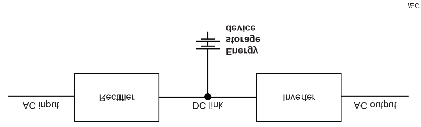
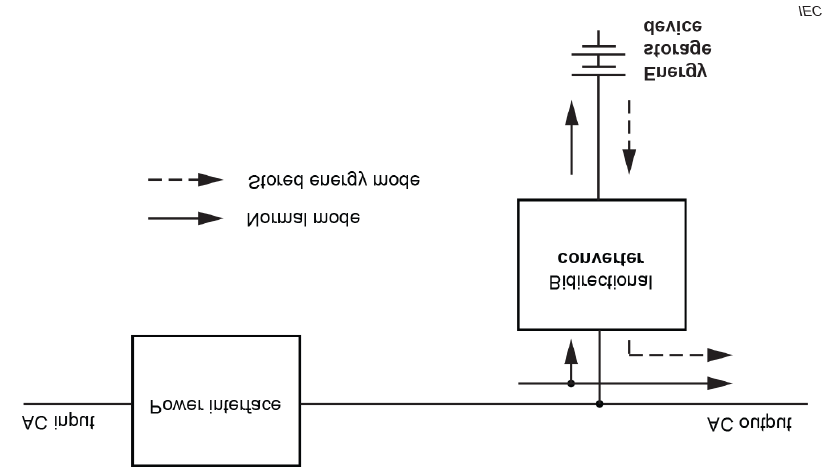
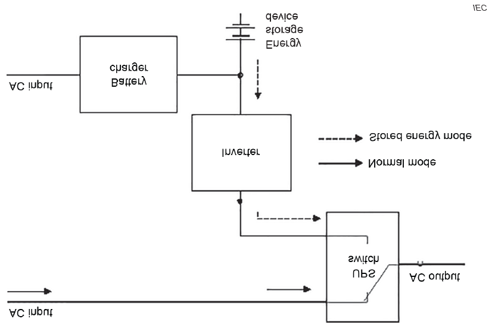

# Requirements for uninterruptible power system (UPS) units

E21
(Sep 2005)
(Rev.1 Feb 2021)
(Corr.1 June 2022)
(Rev.2 Feb 2024)

## 1. Application

1.1 These requirements apply to UPS units, for the following cases:

.1 when providing an alternative power supply as an accumulator battery in terms of being an independent power supply for the emergency services defined in SOLAS II-1/42.2.3 or SOLAS II-1/43.2.4,

.2 when providing an alternative power supply or transitional power supply to any other emergency services as defined in SOLAS II-1/42 and SOLAS II-1/43,

.3 where required, constituting a means of continuous and uninterruptible power supply to essential services as defined in IACS UI SC134 for SOLAS II-1/40 and SOLAS II-1/41, or

.4 when providing power supply in accordance with conditions specified and mandated by FSS Code Chapter 9, 2.2.2 to 2.2.4.

1.2 These requirements may be referenced to UPS units for other cases than above in 1.1, and the application of requirements is at the discretion of the Society.

Notes:

1. Rev.1 of this UR is to be uniformly implemented by IACS Societies:

    i) when an application for certification of UPS is dated on or after 1 July 2022; or

    ii) which are installed in new ships contracted for construction on or after 1 July 2022.

2. Rev.2 of this UR is to be uniformly implemented by IACS Societies:

    i) when an application for certification of UPS is dated on or after 1 July 2025 or

    ii) which are installed in new ships contracted for construction on or after 1 July 2025.

3. The "contracted for construction" date means the date on which the contract to build the vessel is signed between the prospective owner and shipbuilder. For further details regarding the date of "contract for construction", refer to IACS Procedural Requirement (PR) No. 29.

4. The "date of application for certification of UPS" is the date of whatever document the Classification Society requires/accepts as an application or request for certification of UPS.

## 2. Definitions

### Uninterruptible Power System (UPS)

Combination of converters, switches and energy storage devices (such as batteries), constituting a power system for maintaining continuity of load power in case of AC input power failure. [IEC 62040-3:2021]

### Double Conversion topology

A UPS topology comprises an AC to DC converter, generally a rectifier, and a DC to AC converter, generally an inverter. When the AC input power is out of UPS pre-set tolerances, the UPS enters stored energy mode. (Refer to Annex B to IEC 62040-3:2021)

### Line interactive topology

A UPS topology comprises bidirectional AC to DC power conversion, generally through a bidirectional converter and an AC power interface. When AC input power voltage or frequency is out of UPS pre-set tolerances, the UPS runs in stored energy mode. (Refer to Annex B to IEC 62040-3:2021)

### Standby topology

A UPS topology comprises a battery charger, a DC to AC converter, generally a unidirectional inverter and a UPS switch. When the AC input power is out of UPS pre-set tolerances, the UPS operates in stored energy mode. (Refer to Annex B to IEC 62040-3:2021)

### Energy storage device

System consisting of a single or multiple devices designed to provide power to the UPS inverter/converter. [IEC 62040-3:2021]

### AC input power failure

Variation in the AC input power which could cause the UPS to operate in stored energy mode. [IEC 62040-3:2021]

### Bidirectional converter

Converter which has the functions of both a rectifier and an inverter, and which can reverse the flow of power from AC to DC and vice-versa. [IEC 62040-3:2021]

## 3. Design and construction

3.1 UPS units are to be constructed in accordance with IEC 62040-1:2017+AMD1:2021+AMD2:2022, IEC 62040-2:2016, IEC 62040-3:2021, IEC 62040-4:2013 and/or IEC 62040-5-3:2016, as applicable, or an acceptable and relevant national or international standard.

3.2 The operation of the UPS is not to depend upon external services.

3.3 The configuration and topology of UPS unit employed is to be appropriate to the power supply requirements of the connected load equipment.

3.4 When external bypass is provided, bypass transfer switch is to be arranged to protect the load against power disturbances or interruption arising from inrush or fault current. (Refer to Annex C to IEC 62040-3:2021)

3.5 The UPS unit is to be monitored and audible and visual alarm is to be given in continuously manned station(s) for

- power supply failure (voltage and frequency) to the connected load,
- earth fault,
- operation of battery protective device,
- when the battery is being discharged,
- when the bypass is in operation in case an external bypass is provided, and
- any other fault and abnormal conditions of the UPS unit, as applicable.

## 4. Location

4.1 The UPS unit for emergency services in paragraphs 1.1.1 and 1.1.2 is to be suitably located for use in an emergency.

4.2 UPS units utilising valve regulated sealed batteries may be located in compartments with normal electrical equipment, provided the ventilation arrangements are in accordance with the requirements of IEC 62040-1:2017+AMD1:2021+AMD2:2022, IEC 62040-2:2016, IEC 62040-3:2021, IEC 62040-4:2013 and/or IEC 62040-5-3:2016, as applicable, or an acceptable and relevant national or international standard.

## 5. Performance

5.1 The output power is to be maintained for the duration required for the connected equipment as stated in SOLAS II-1/42 or SOLAS II-1/43.

5.2 No additional circuits are to be connected to the UPS unit without verification that the UPS unit has adequate capacity. The UPS battery capacity is, at all times, to be capable of supplying the designated loads for the time specified in the regulations.

5.3 On restoration of the input power, the rating of the charge unit shall be sufficient to recharge the batteries while maintaining the output supply to the load equipment.

## 6. Testing and survey

6.1 UPS units of 50 kVA and over are to be surveyed by the Society during manufacturing and testing, in accordance with paragraph 6.2.

6.2 Appropriate testing is to be carried out to demonstrate that the UPS unit is suitable for its intended environment. This is expected to include as a minimum the following tests:

- Functionality, including operation of alarms in paragraph 3.5;
- Temperature rise;
- Ventilation rate;
- Battery capacity.

6.3 Where the supply is to be maintained without a break following a power input failure, this is to be verified after installation by practical test.

End of Document
