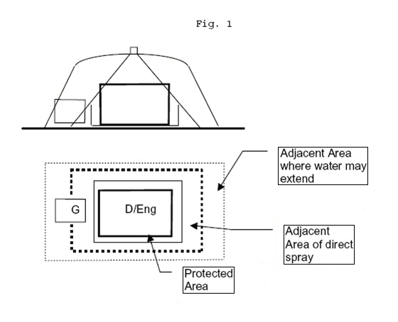

<!-- markdownlint-disable-file MD026 -->
# E20

## E20 Installation of electrical and electronic equipment in engine rooms protected by fixed water-based local application fire-fighting systems (FWBLAFFS)

(May 2004) (Rev.1 June 2009)

### Definitions:

Protected space:

- Is a machinery space where a FWBLAFFS is installed.

Protected areas:

- Areas within a protected space which is required to be protected by FWBLAFFS.

Adjacent areas:

- Areas, other than protected areas, exposed to direct spray.
- Areas, other than those defined above, where water may extend.

See also Fig. 1

Electrical and electronic equipment enclosures located within areas protected by FWBLAFFS and those within adjacent areas exposed to direct spray are to have a degree of protection not less than IP44, except where evidence of suitability is submitted to and approved by the Society.

The electrical and electronic equipment within adjacent areas not exposed to direct spray may have a lower degree of protection provided evidence of suitability for use in these areas is submitted taking into account the design and equipment layout, e.g. position of inlet ventilation openings, cooling airflow for the equipment is to be assured.

Note

1. Additional precautions may be required to be taken in respect of:
    a. tracking as the result of water entering the equipment
    b. potential damage as the result of residual salts from sea water systems
    c. high voltage installations
    d. personnel protection against electric shock

End of Document
