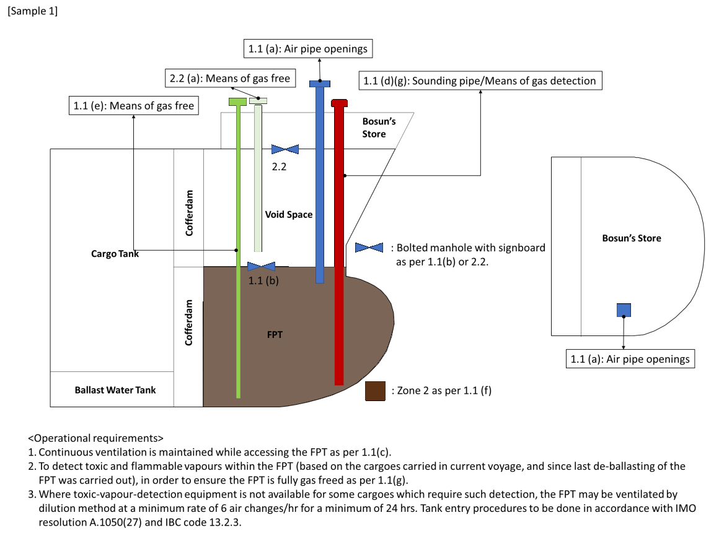
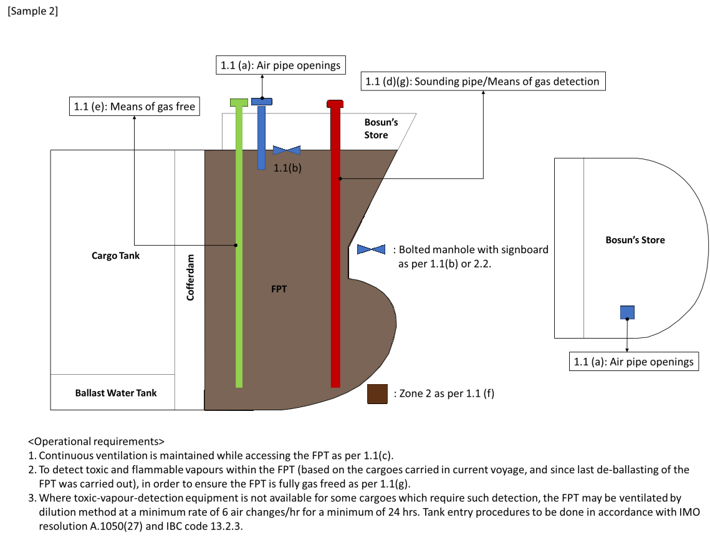
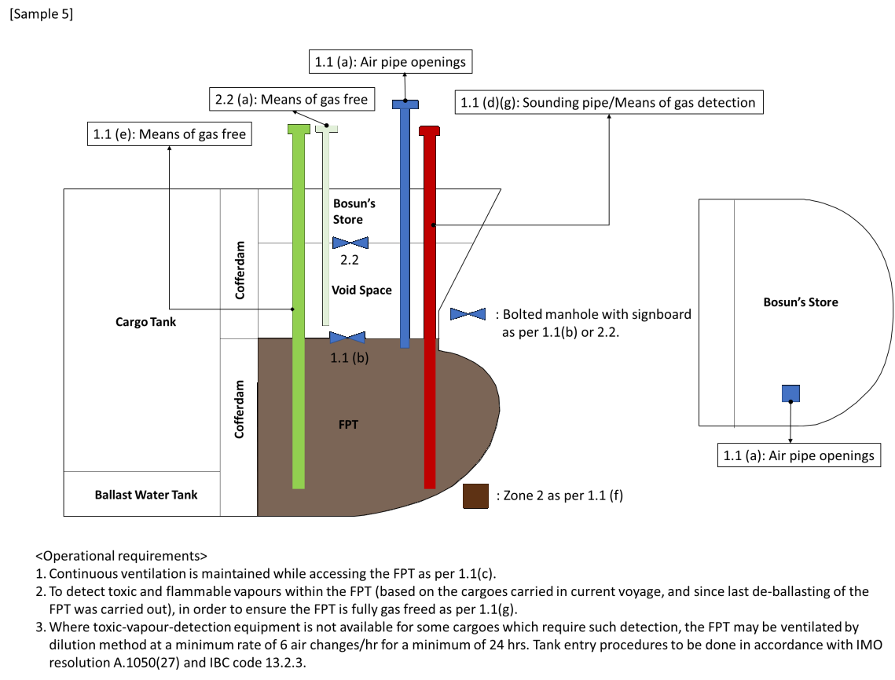
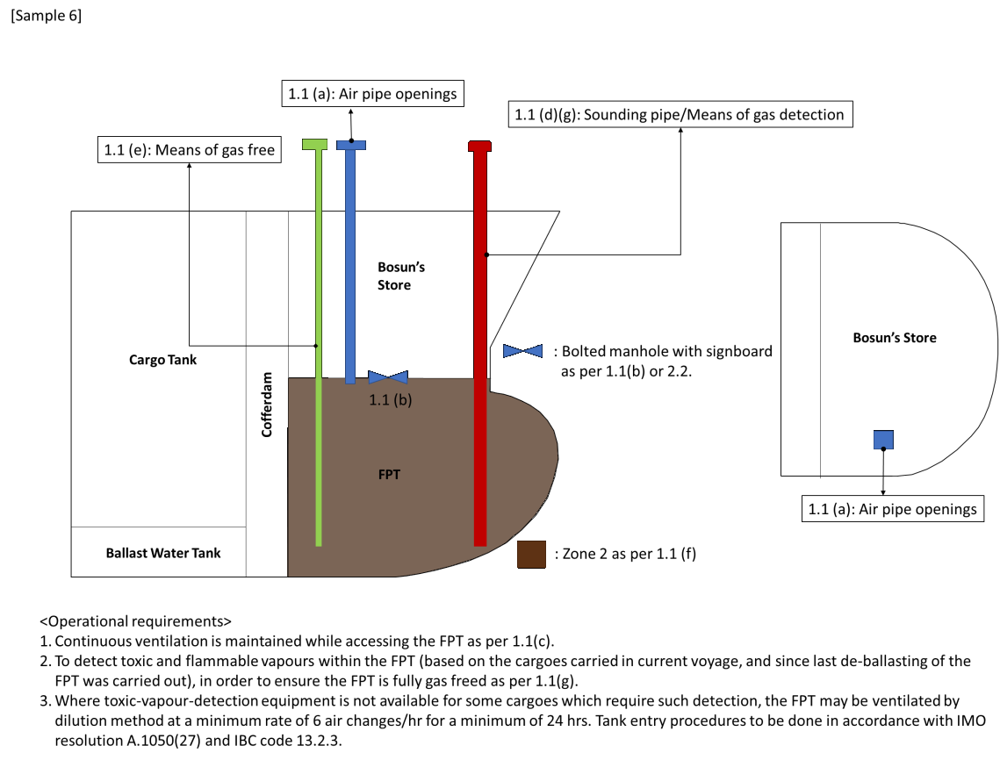
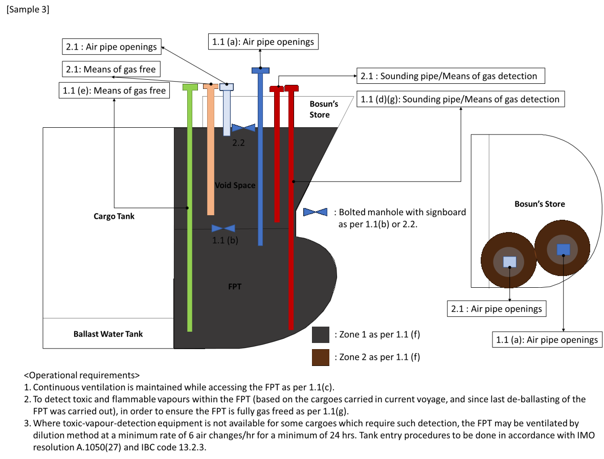
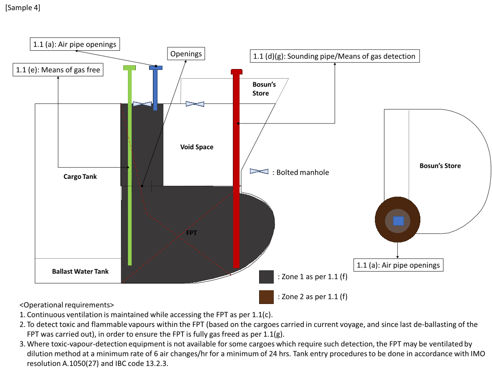

# F44 - Fore peak ballast tanks and space arrangements on oil & chemical tankers

F44
(June 2000)
(Rev.1 Aug 2008)
(Rev.2 Oct 2010)
(Rev.3 Sep 2024)
(Corr.1 Mar 2025)

## Definitions

The following definitions apply in this UR.

**Hazardous area** means an area in which an explosive gas atmosphere is present, or may be expected to be present, in quantities such as to require special precautions for the construction, installation and use of equipment.

**Non-hazardous area** means an area that is not a hazardous area.

**Cargo area of tankers** are defined in:

- for tankers to which regulation 1.6.1 of SOLAS Chapter II-2 as amended by IMO resolutions up to MSC.421(98) (hereinafter the same) applies, regulation 3.6 of SOLAS Chapter II-2:

- for chemical tankers, Paragraph 1.3.6 of the IBC Code as amended by IMO resolutions up to MSC.460(101):

## 1 Fore peak ballast tanks and space arrangements on tankers for oil and/or chemicals

1.1 The fore peak tank can be ballasted with the system serving other ballast tanks within the cargo area, provided:

a) The vent pipe openings are located on open deck at a distance from sources of ignition as required by IEC 60092-502:1999 Electrical installations in ships – Tankers – Special features; This requirement does not apply to sounding arrangements.

b) Access to the fore peak tank is direct from open deck. Alternatively, indirect access from the open deck to the forepeak tank may be from a pump-room, deep cofferdam, pipe tunnel, cargo hold, double hull space, bosun's store or similar compartment not intended for the carriage of oil or hazardous cargoes, conforming to the requirements of SOLAS II-1/3-6.3.1. Electrical equipment in such indirect access shall be of the certified safe type suitable for use in the hazardous area it opens into or shall be isolated before entry.

c) Continuous ventilation is maintained while accessing the forepeak tank

d) The sounding arrangement to the fore peak tank is direct from open deck.

e) The forepeak tank is gas freed direct from open deck, or through a dedicated trunk to open deck. Before the manhole and the entrance of the dedicated trunk are opened, the trunk and the forepeak tank shall be confirmed as made gas free. Means are to be provided to free the space of gas without opening manholes or the entrance to a dedicated trunk. Manholes on the open deck and away from sources of ignition at the top of the dedicated trunk which are used to gas-free the space are allowed to be opened.

f) The fore peak ballast tank is considered as a hazardous zone 2 if segregated from cargo area with a cofferdam, or as a hazardous zone 1 if located adjacent to a cargo tank. For tankers where a bow thruster space is provided, the piping passing through the non-hazardous bow thruster room shall be fully welded and it is required to have the collision bulkhead valve located within the forepeak tank.

g) Means are to be provided on the open deck by a suitable portable instrument, to allow detection of toxic and flammable vapours within the FPT (based on the cargoes carried in current voyage, and since last de-ballasting of FPT was carried out), in order to ensure the FPT is fully gas freed. In the case that sounding arrangements can be used as the means for the portable instrument additional means for the purpose is not required.

## 2 Additional requirements for forward spaces not being defined as a ballast tank

2.1 Any spaces, voids and/or indirect accesses from the open deck or intermediate space being located adjacent to cargo tanks, and/or are defined as hazardous area zone 1 or 2, shall follow the same requirements to openings and access as reflected for fore peak ballast tanks in section 1.

2.2 In case any spaces or voids are defined as non-hazardous spaces and have access to other non-hazardous spaces (such as bosun store), the following applies:

a) For any non-hazardous space with access to a hazardous space (example: fore peak ballast tank), the non-hazardous space must have access directly to open deck and shall be gas freed directly from open deck, and not through the non-hazardous space (example: bosun store).

b) Access from bosun store to a non-hazardous space (example: void) having access to hazardous space (example: fore peak ballast tank) may be accepted through a gas tight bolted manhole, with signboard stating that the non-hazardous space cannot be entered until the space is confirmed gas free. Separation of such spaces are described in IEC 60092-502:1999 section 4.1.4 and 4.1.5 as applicable.

The following figures illustrate the above points:

Arrangements shown in samples 1, 2, 5 and 6 are applicable to both oil tankers and chemical tankers

[Sample 1]

\<Operational requirements\>

1. Continuous ventilation is maintained while accessing the FPT as per 1.1(c).
2. To detect toxic and flammable vapours within the FPT (based on the cargoes carried in current voyage, and since last de-ballasting of the FPT was carried out), in order to ensure the FPT is fully gas freed as per 1.1(g).
3. Where toxic-vapour-detection equipment is not available for some cargoes which require such detection, the FPT may be ventilated by dilution method at a minimum rate of 6 air changes/hr for a minimum of 24 hrs. Tank entry procedures to be done in accordance with IMO resolution A.1050(27) and IBC code 13.2.3.

[Sample 2]

\<Operational requirements\>

1. Continuous ventilation is maintained while accessing the FPT as per 1.1(c).
2. To detect toxic and flammable vapours within the FPT (based on the cargoes carried in current voyage, and since last de-ballasting of the FPT was carried out), in order to ensure the FPT is fully gas freed as per 1.1(g).
3. Where toxic-vapour-detection equipment is not available for some cargoes which require such detection, the FPT may be ventilated by dilution method at a minimum rate of 6 air changes/hr for a minimum of 24 hrs. Tank entry procedures to be done in accordance with IMO resolution A.1050(27) and IBC code 13.2.3.

[Sample 5]

\<Operational requirements\>

1. Continuous ventilation is maintained while accessing the FPT as per 1.1(c).
2. To detect toxic and flammable vapours within the FPT (based on the cargoes carried in current voyage, and since last de-ballasting of the FPT was carried out), in order to ensure the FPT is fully gas freed as per 1.1(g).
3. Where toxic-vapour-detection equipment is not available for some cargoes which require such detection, the FPT may be ventilated by dilution method at a minimum rate of 6 air changes/hr for a minimum of 24 hrs. Tank entry procedures to be done in accordance with IMO resolution A.1050(27) and IBC code 13.2.3.

[Sample 6]

\<Operational requirements\>

1. Continuous ventilation is maintained while accessing the FPT as per 1.1(c).
2. To detect toxic and flammable vapours within the FPT (based on the cargoes carried in current voyage, and since last de-ballasting of the FPT was carried out), in order to ensure the FPT is fully gas freed as per 1.1(g).
3. Where toxic-vapour-detection equipment is not available for some cargoes which require such detection, the FPT may be ventilated by dilution method at a minimum rate of 6 air changes/hr for a minimum of 24 hrs. Tank entry procedures to be done in accordance with IMO resolution A.1050(27) and IBC code 13.2.3.

Arrangements shown in samples 3 and 4 are applicable to oil tankers only.

[Sample 3]

\<Operational requirements\>

1. Continuous ventilation is maintained while accessing the FPT as per 1.1(c).
2. To detect toxic and flammable vapours within the FPT (based on the cargoes carried in current voyage, and since last de-ballasting of the FPT was carried out), in order to ensure the FPT is fully gas freed as per 1.1(g).
3. Where toxic-vapour-detection equipment is not available for some cargoes which require such detection, the FPT may be ventilated by dilution method at a minimum rate of 6 air changes/hr for a minimum of 24 hrs. Tank entry procedures to be done in accordance with IMO resolution A.1050(27) and IBC code 13.2.3.

[Sample 4]

\<Operational requirements\>

1. Continuous ventilation is maintained while accessing the FPT as per 1.1(c).
2. To detect toxic and flammable vapours within the FPT (based on the cargoes carried in current voyage, and since last de-ballasting of the FPT was carried out), in order to ensure the FPT is fully gas freed as per 1.1(g).
3. Where toxic-vapour-detection equipment is not available for some cargoes which require such detection, the FPT may be ventilated by dilution method at a minimum rate of 6 air changes/hr for a minimum of 24 hrs. Tank entry procedures to be done in accordance with IMO resolution A.1050(27) and IBC code 13.2.3.

End of Document

Note:

1. Rev.2 of this UR is to be uniformly implemented by IACS Societies on ships contracted for construction on or after 1 January 2012.

2. Rev.3 of this Unified Requirement is to be uniformly implemented by IACS Societies on ships contracted for construction on or after 1 January 2026.

3. The "contracted for construction" date means the date on which the contract to build the vessel is signed between the prospective owner and the shipbuilder. For further details regarding the date of "contract for construction", refer to IACS Procedural Requirement (PR) No. 29.
