<!-- markdownlint-disable MD033 -->
# Machinery Requirements for Polar Class Ships

I3
(Aug 2006)
(Rev.1 Jan2007)
(Corr.1 Oct 2007)
(Rev.2 Jan 2023 Complete Revision)
(Corr.1 Dec 2024)

## 1 Application

The contents of this Chapter apply to main propulsion, steering gear, emergency and auxiliary systems essential for the safety of the ship and the crew.

The vessel operating conditions are defined in UR I1.

The requirements herein are additional to those applicable for the basic open water class of the vessel.

## 2 General

2.1 The following drawings and particulars are to be submitted.

2.1.1 Details of the intended environmental operational conditions and the required ice strengthening for the machinery, if different from ship's ice class

2.1.2 Detailed drawings and descriptions of the main propulsion, steering, emergency and auxiliary machinery and information on the essential main propulsion load control functions. The descriptions are to include operational limitations.

2.1.3 Description detailing where main, emergency and auxiliary systems are located and how they are protected to prevent problems from freezing, ice and snow accumulation and evidence of their capability to operate in the intended environmental conditions

2.1.4 Calculations and documentation indicating compliance with the requirements of this chapter

Note:

1. This UR is to be uniformly applied by IACS Societies on ships contracted for construction on and after 1 March 2008.

2. The "contracted for construction" date means the date on which the contract to build the vessel is signed between the prospective owner and the shipbuilder. For further details regarding the date of "contract for construction", refer to IACS Procedural Requirement (PR) No. 29.

3. Rev.2 of this UR is to be uniformly applied by IACS Societies on ships contracted for construction on or after 1 July 2024.

### 2.2 System Design

2.2.1 Systems subject to damage by freezing, shall be drainable.

2.2.2 Vessels classed PC1 to PC5 inclusive shall have means provided to ensure sufficient vessel operation in the case of propeller damage including the Controllable Pitch (CP) mechanism. Sufficient vessel operation means that the vessel should be able to reach safe haven (safe location) where repairs can be undertaken. This may be achieved either by a temporary repair at sea, or by towing, assuming assistance is available. This would lead however to a condition of approval.

2.2.3 Means shall be provided to free a stuck propeller by turning it in reverse direction. This shall also be possible for a propulsion plant intended for unidirectional rotation.

2.2.4 The propeller shall be fully submerged at the ships LIWL.

## 3 Materials

Materials shall be of an approved ductile material. Ferritic nodular cast iron may be used for parts other than bolts. For nodular cast iron an averaged impact energy value of 10 J at testing temperature is regarded as equivalent to the Charpy V test requirements defined below.

### 3.1 Materials exposed to sea water

Materials exposed to sea water, such as propeller blades, propeller hubs and cast thruster bodies shall have an elongation not less than 15% on a test specimen according to UR W2.

Charpy V-notch impact testing is to be carried out for materials other than bronze and austenitic steel. The tests shall be carried out on three specimens at minus 10 ºC, and the average energy value is to be not less than 20 J. However, Charpy V impact test requirements of UR W7 or UR W27 as applicable for ships with ice class notation, shall also be applied to ships covered by this UR.

### 3.2 Materials exposed to sea water temperature

Charpy V-notch impact testing is to be carried out for materials other than bronze and austenitic steel. The tests shall be carried out on three specimens at minus 10 ºC, and the average energy value is to be not less than 20 J. However, the Charpy V impact test requirements of UR W7 as applicable for ships with ice class notation, shall also be applied to ships covered by this UR.

This requirement applies to components such as but not limited to blade bolts, CP-mechanisms, shaft bolts, propeller shaft, strut-pod connecting bolts, etc. This requirement does not apply to surface hardened components, such as bearings and gear teeth or sea water cooling lines (heat exchangers, pipes, valves, fittings etc.). For a definition of structural boundaries exposed to sea water temperature see UR I2 Figure 6.

### 3.3 Material exposed to low air temperature

Materials of exposed machinery and foundations shall be manufactured from steel or other approved ductile material. An average impact energy value of 20 J taken from three Charpy V tests is to be obtained at 10 ºC below the lowest design temperature. Charpy V impact tests are not required for bronze and austenitic steel.

This requirement does not apply to surface hardened components, such as bearings and gear teeth. For a definition of structural boundaries exposed to air temperature see UR I2 Figure 6.

## 4 Definitions

### 4.1 Definition of Symbols

Table 1: Definition of symbols

| Symbol | Unit | Definition |
|---|---|---|
| c | m | chord length of blade section |
| c0.7 | m | chord length of blade section at 0.7R propeller radius |
| CP | - | controllable pitch |
| D | m | propeller diameter |
| d | m | external diameter of propeller hub (at propeller plane) |
| dpin | mm | diameter of shear pin |
| Dlimit | m | limit value for propeller diameter |
| EAR | - | expanded blade area ratio |
| Fb | kN | maximum backward blade force for the ship's service life (negative sign) |
| Fex | kN | ultimate blade load resulting from blade failure through plastic bending |
| Ff | kN | maximum forward blade force for the ship's service life (positive sign) |
| Fice | kN | ice load |
| (Fice)max | kN | maximum ice load for the ship's service life |
| FP | - | fixed pitch |
| h0 | m | depth of the propeller centreline from lower ice waterline (LIWL) |
| (Hice) | m | Ice block dimension for propeller load definition |
| I | kgm2 | equivalent mass moment of inertia of all parts on engine side of component under consideration |
| It | kgm2 | equivalent mass moment of inertia of the whole propulsion system |
| k | - | shape parameter for Weibull distribution |
| LIWL | m | lower ice waterline |
| m | - | slope for S-N curve in log/log scale |
| MBL | kNm | blade bending moment |
| MCR | - | maximum continuous rating |
| N | - | number of ice load cycles |
| n | rev/s | propeller rotational speed |
| nn | rev/s | nominal propeller rotational speed at MCR in free running condition |
| Nclass | - | reference number of ice impacts per propeller revolution per ice class |
| Nice | - | total number of ice load cycles on propeller blade for the ship's service life |
| NR | - | reference number of ice load cycles for equivalent fatigue stress (108 cycles) |
| NQ | - | number of propeller revolutions during a milling sequence |
| P0.7 | m | propeller pitch at 0.7R radius |
| P0.7n | m | propeller pitch at 0.7R radius at MCR in free running condition |
| P0.7b | m | propeller pitch at 0.7R radius at MCR in bollard condition |
| PCD | m | pitch circle diameter |
| Q(φ) | kNm | Torque |
| QAmax | kNm | maximum response torque amplitude as a simulation result |
| Qemax | kNm | maximum engine torque |
| QF(φ) | kNm | Ice torque excitation for frequency domain calculations |
| Qfr | kNm | friction torque in pitching mechanism; reduction of spindle torque |
| Qmax | kNm | maximum torque on the propeller resulting from propeller/ice interaction |
| Qmotor | kNm | electric motor peak torque |
| Qn | kNm | nominal torque at MCR in free running condition |
| Qr(t) | kNm | response torque along the propeller shaft line |
| Qpeak | kNm | maximum of the response torque Qr(t) |
| Qsmax | kNm | maximum spindle torque of the blade for the ship's service life |
| Qsex | kNm | extreme spindle torque corresponding to the blade failure load Fex |
| Qvib | kNm | Vibratory torque at considered component, taken from frequency domain open water TVC |
| R | m | propeller radius |
| S | - | Safety factor |
| Sfat | - | Safety factor for fatigue |
| Sice | - | Ice strength index for blade ice force |
| r | m | blade section radius |
| T | kN | Hydrodynamic propeller thrust in bollard condition |
| Tb | kN | maximum backward propeller ice thrust for the ship's service life |
| Tf | kN | maximum forward propeller ice thrust for the ship's service life |
| Tn | kN | propeller thrust at MCR in free running condition |
| Tr | kN | maximum response thrust along the shaft line |
| Tkmax | kNm | maximum torque capacity of flexible coupling |
| Tkmax1 | kNm | Tkmax at N = 1 load cycle |
| Tkmax2 | kNm | Tkmax at N = 5 × 104 load cycles |
| Tkv | kNm | vibratory torque amplitude at N = 106 load cycles |
| ΔTkmax | kNm | maximum range of Tkmax at N = 5 × 104 load cycles |
| t | m | maximum blade section thickness |
| Z | - | number of propeller blades |
| zpin | - | number of shear pins |
| αi | deg | duration of propeller blade/ice interaction expressed in rotation angle |
| γε | - | the reduction factor for fatigue; scatter and test specimen size effect |
| γv | - | the reduction factor for fatigue; variable amplitude loading effect |
| γm | - | the reduction factor for fatigue; mean stress effect |
| ρ | - | a reduction factor for fatigue correlating the maximum stress amplitude to the equivalent fatigue stress for 108 stress cycles |
| σ0.2 | MPa | proof yield strength (at 0.2% plastic strain) of material |
| σexp | MPa | mean fatigue strength of blade material at 108 cycles to failure in sea water |
| σfat | MPa | equivalent fatigue ice load stress amplitude for 108 stress cycles |
| σfl | MPa | characteristic fatigue strength for blade material |
| σref1 | MPa | reference stress σref1 = 0.6 σ0.2 + 0.4 σu |
| σref2 | MPa | reference stress   σref2 = 0.7 σu   or   σref2 = 0.6 σ0.2 + 0.4 σu   whichever is less |
| σst | MPa | maximum stress resulting from Fb or Ff |
| σu | MPa | ultimate tensile strength of blade material |
| (σice)bmax | MPa | principal stress caused by the maximum backward propeller ice load |
| (σice)fmax | MPa | principal stress caused by the maximum forward propeller ice load |
| (σice)Amax | MPa | maximum ice load stress amplitude at the considered location on the blade |
| σmean | MPa | mean stress |
| (σice)A(N) | MPa | blade stress amplitude distribution |

### 4.2 Definition of Loads

Table 2: Definitions of loads

| | Definition | Use of the load in design process |
|---|---|---|
| Fb | The maximum lifetime backward force on a propeller blade resulting from propeller/ice interaction, including hydrodynamic loads on that blade. The direction of the force is perpendicular to 0.7R chord line. See Figure 1. | Design force for strength calculation of the propeller blade. |
| Ff | The maximum lifetime forward force on a propeller blade resulting from propeller/ice interaction, including hydrodynamic loads on that blade. The direction of the force is perpendicular to 0.7R chord line. | Design force for calculation of strength of the propeller blade. |
| Qsmax | The maximum lifetime spindle torque on a propeller blade resulting from propeller/ice interaction, including hydrodynamic loads on that blade. | In designing the propeller strength, the spindle torque is automatically taken into account because the propeller load is acting as distributed pressure on the leading edge or tip area. |
| Tb | The maximum lifetime thrust on propeller (all blades) resulting from propeller/ice interaction. The direction of the thrust is the propeller shaft direction and the force is opposite to the hydrodynamic thrust. | Is used for estimation of the response thrust Tr. Tb can be used as an estimate of excitation for axial vibration calculations. However, axial vibration calculations are not required in the rules. |
| Tf | The maximum lifetime thrust on propeller (all blades) resulting from propeller/ice interaction. The direction of the thrust is the propeller shaft direction acting in the direction of hydrodynamic thrust. | Is used for estimation of the response thrust Tr. Tf can be used as an estimate of excitation for axial vibration calculations. However, axial vibration calculations are not required in the rules. |
| Qmax | The maximum ice-induced torque resulting from propeller/ice interaction on one propeller blade, including hydrodynamic loads on that blade. | Is used for estimation of the response torque Qr along the propulsion shaft line and as excitation for torsional vibration calculations. |
| Fex | Ultimate blade load resulting from blade loss through plastic bending. The force that is needed to cause total failure of the blade so that plastic hinge is caused to the root area. The force is acting on 0.8R. | Blade failure load is used to dimension the blade bolts, pitch control mechanism, propeller shaft, propeller shaft bearing and trust bearing. The objective is to guarantee that total propeller blade failure should not cause damage to other components. |
| Qsex | Maximum spindle torque resulting from blade failure load | Is used to ensure pyramid strength principle for the pitching mechanism |
| Qr | Maximum response torque along the propeller shaft line, taking into account the dynamic behaviour of the shaft line for ice excitation (torsional vibration) and hydrodynamic mean torque on propeller. | Design torque for propeller shaft line components. |
| Tr | Maximum response thrust along shaft line, taking into account the dynamic behaviour of the shaft line for ice excitation (axial vibration) and hydrodynamic mean thrust on propeller. | Design thrust for propeller shaft line components. |

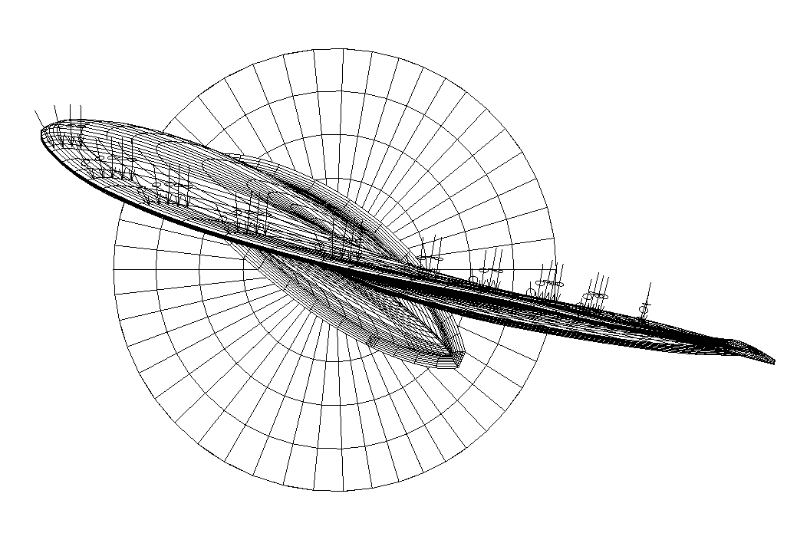

Figure 1 : Direction of the backward blade force resultant taken perpendicular to the chord line at radius 0.7R. Ice contact pressure at leading edge is shown with small arrows.

## 5 Design Ice Loads

### 5.1 General

These Rules cover open and ducted type propellers situated at the stern of a vessel having controllable pitch or fixed pitch blades. Ice loads on bow-mounted propellers shall receive special consideration at the discretion of each classification society. The given loads are expected, single occurrence, maximum values for the whole ship's service life for normal operational conditions, including loads resulting from directional change of rotation where applicable. These loads do not cover off-design operational conditions, for example when a stopped propeller is dragged through ice. These Rules also cover loads due to propeller ice interaction for azimuthing and fixed thrusters with geared transmission or an integrated electric motor ("geared and podded propulsors"). However, the load models of the regulations do not include propeller/ice interaction loads when ice enters the propeller of a turned azimuthing thruster from the side (radially) or loads when ice blocks hit on the propeller hub of a pulling propeller. Ice loads resulting from ice impacts on the body of thrusters shall be estimated on a case by case basis, however are not included within the following section.

The loads given in section 5.3 are total loads including ice-induced loads and hydrodynamic loads (unless otherwise stated) during ice interaction and are to be applied separately (unless otherwise stated) and are intended for component strength calculations only.

Fb is the maximum force experienced during the lifetime of the ship that bends a propeller blade backwards when the propeller mills an ice block while rotating ahead. Ff is the maximum force experienced during the lifetime of the ship that bends a propeller blade forwards when the propeller mills an ice block while rotating ahead. Fb and Ff originate from different propeller/ice interaction phenomena, which do not act simultaneously. Hence they are to be applied separately.

### 5.2 Ice Class Factors

The dimensions of the considered design ice block are Hice × 2Hice × 3Hice. The design ice block and ice strength index (Sice) are used for the estimation of propeller ice loads. Both Hice and Sice are defined for each Ice class in Table 3 below.

Table 3: Design Ice Class Factors

| Ice Class | Hice [m] | Sice [-] |
|---|---|---|
| PC1 | 4.0 | 1.2 |
| PC2 | 3.5 | 1.1 |
| PC3 | 3.0 | 1.1 |
| PC4 | 2.5 | 1.1 |
| PC5 | 2.0 | 1.1 |
| PC6 | 1.75 | 1 |
| PC7 | 1.5 | 1 |

### 5.3 Propeller Ice Interaction Loads

#### 5.3.1 Maximum backward blade force Fb for open propellers

when $D < D_{limit}$:

$$F_b = 27 \cdot S_{ice} \cdot (n \cdot D)^{0.7} \cdot \left(\frac{EAR}{Z}\right)^{0.3} \cdot D^2 \quad \text{[kN]} \quad \text{[Equation 1]}$$

when $D \geq D_{limit}$:

$$F_b = 23 \cdot S_{ice} \cdot (n \cdot D)^{0.7} \cdot \left(\frac{EAR}{Z}\right)^{0.3} \cdot (H_{ice})^{1.4} \cdot D \quad \text{[kN]} \quad \text{[Equation 2]}$$

where:

$$D_{limit} = 0.85 \cdot (H_{ice})^{1.4} \quad \text{[m]} \quad \text{[Equation 3]}$$

Here n is the nominal rotational speed at MCR in the free running open water condition for CP-propellers and 85% of the nominal rotational speed (at MCR free running condition) for a FP-propeller (regardless driving engine type) [rps].

For vessels with the additional notation Icebreaker, the above stated backward blade force Fb shall be multiplied by a factor of 1.1.

#### 5.3.2 Maximum forward blade force Ff for open propellers

when $D < D_{limit}$:

$$F_f = 250 \cdot \left(\frac{EAR}{Z}\right) \cdot D^2 \quad \text{[kN]} \quad \text{[Equation 4]}$$

when $D \geq D_{limit}$:

$$F_f = 500 \cdot \left(\frac{1}{1-\frac{d}{D}}\right) \cdot H_{ice} \cdot \left(\frac{EAR}{Z}\right) \cdot D \quad \text{[kN]} \quad \text{[Equation 5]}$$

where:

$$D_{limit} = \left(\frac{2}{1-\frac{d}{D}}\right) \cdot H_{ice} \quad \text{[m]} \quad \text{[Equation 6]}$$

#### 5.3.3 Loaded area on the blade for open propellers

Load cases 1-4 shall be covered, as given in Table 4, for CP and FP propellers. In order to obtain blade ice loads for a reversing propeller, load case 5 shall also be covered for propellers where reversing is possible.

Table 4: Loaded areas and load case definition for open propellers

| | Force | Loaded area | Right-handed propeller blade seen from behind |
|---|---|---|---|
| Load case 1 | Fb | Uniform pressure applied on the back of the blade (suction side) to an area from 0.6R to the tip and from the leading edge to 0.2 times the chord length. | 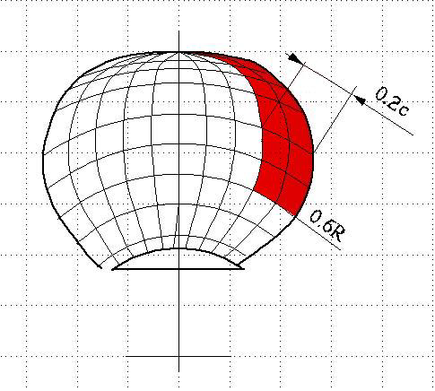 |
| Load case 2 | 50% of Fb | Uniform pressure applied on the back of the blade (suction side) on the propeller tip area outside 0.9R radius. | 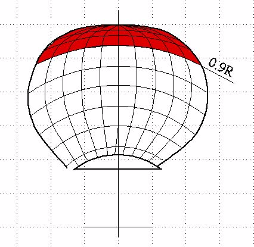 |
| Load case 3 | Ff | Uniform pressure applied on the blade face (pressure side) to an area from 0.6R to the tip and from the leading edge to 0.2 times the chord length. |  |
| Load case 4 | 50% of Ff | Uniform pressure applied on propeller face (pressure side) on the propeller tip area outside 0.9R radius. |  |
| Load case 5 | 60% of Ff or 60% of Fb, whichever is greater | Uniform pressure applied on propeller face (pressure side) to an area from 0.6R to the tip and from the trailing edge to 0.2 times the chord length | 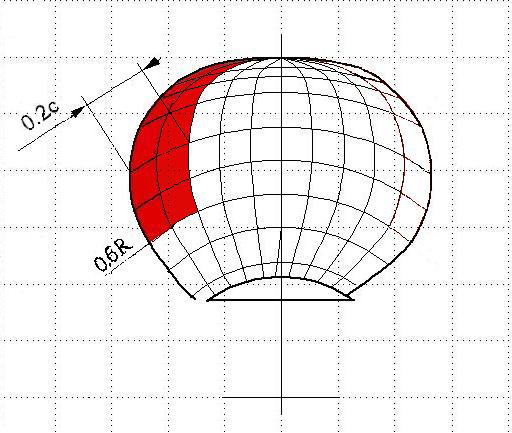 |

#### 5.3.4 Maximum backward blade ice force Fb for ducted propellers

when $D < D_{limit}$:

$$F_b = 9.5 \cdot S_{ice} \cdot (n \cdot D)^{0.7} \cdot \left(\frac{EAR}{Z}\right)^{0.3} \cdot D^2 \quad \text{[kN]} \quad \text{[Equation 7]}$$

when $D \geq D_{limit}$:

$$F_b = 66 \cdot S_{ice} \cdot (n \cdot D)^{0.7} \cdot \left(\frac{EAR}{Z}\right)^{0.3} \cdot (H_{ice})^{1.4} \cdot D^{0.6} \quad \text{[kN]} \quad \text{[Equation 8]}$$

where:

$$D_{limit} = 4 \cdot H_{ice} \quad \text{[m]} \quad \text{[Equation 9]}$$

n shall be taken as in 5.3.1

For vessels with the additional notation Icebreaker, the above stated backward blade force Fb shall be multiplied by a factor 1.1.

#### 5.3.5 Maximum forward blade ice force Ff for ducted propellers

when $D \leq D_{limit}$:

$$F_f = 250 \cdot \left(\frac{EAR}{Z}\right) \cdot D^2 \quad \text{[kN]} \quad \text{[Equation 10]}$$

when $D > D_{limit}$:

$$F_f = 500 \cdot \left(\frac{EAR}{Z}\right) \cdot D \cdot \frac{1}{\left(1-\frac{d}{D}\right)} \cdot H_{ice} \quad \text{[kN]} \quad \text{[Equation 11]}$$

where:

$$D_{limit} = \frac{2}{\left(1-\frac{d}{D}\right)} \cdot H_{ice} \quad \text{[m]} \quad \text{[Equation 12]}$$

#### 5.3.6 Loaded area on the blade for ducted propellers

Load cases 1 and 3 shall be covered as given in Table 5 for all propellers. In order to obtain blade ice loads for a reversing propeller, load case 5 shall also be covered for propellers, where reversing is possible.

Table 5: Loaded areas and load case definition for ducted propellers

| | Force | Loaded area | Right handed propeller blade seen from behind |
|---|---|---|---|
| Load case 1 | Fb | Uniform pressure applied on the back of the blade (suction side) to an area from 0.6R to the tip and from the leading edge to 0.2 times the chord length. | 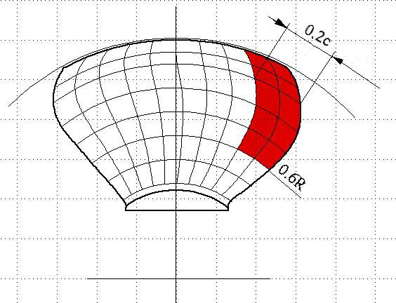 |
| Load case 3 | Ff | Uniform pressure applied on the blade face (pressure side) to an area from 0.6R to the tip and from the leading edge to 0.5 times the chord length. | 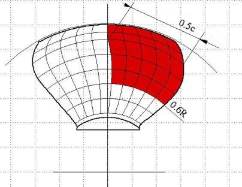 |
| Load case 5 | 60% of Ff or 60% of Fb, whichever is greater | Uniform pressure applied on propeller face (pressure side) to an area from 0.6R to the tip and from the trailing edge to 0.2 times the chord length. | 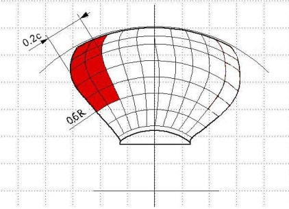 |

#### 5.3.7 Maximum blade spindle torque Qsmax for open and ducted propellers

The spindle torque Qsmax around the axis of the blade fitting shall be determined both for the maximum backward blade force Fb and forward blade force Ff, which are applied as per Table 4 and Table 5. If the above method gives a value which is less than the default value given by the formula below, the default value shall be used.

Default value $Q_{smax} = 0.25 \cdot F \cdot c_{0.7}$   [kNm]   [Equation 13]

where:

F is taken as either Fb or Ff, whichever has the greater absolute value.

The blade failure spindle torque Qsex is defined under 5.4.

#### 5.3.8 Load distributions (spectra) for blade loads

The Weibull-type distribution (probability that Fice exceeds (Fice)max, as given in Figure 2 is used for the fatigue design of the blade.

$$P\left(\frac{F_{ice}}{(F_{ice})_{max}} \geq \frac{F}{(F_{ice})_{max}}\right) = e^{\left(-\left(\frac{F}{(F_{ice})_{max}}\right)^k \cdot ln(N_{ice})\right)} \quad \text{[Equation 14]}$$

where:

k   = shape parameter of the spectrum

Nice   = number of load cycles in the spectrum, see 5.3.9

Fice   = random variable for ice loads on the blade, $0 \leq F_{ice} \leq (F_{ice})_{max}$.

This results in a blade stress amplitude distribution

$$(\sigma_{ice})_A(N) = (\sigma_{ice})_{Amax} \cdot \left(1 - \frac{\log(N)}{\log(N_{ice})}\right)^{\frac{1}{k}} \quad \text{[Equation 15]}$$

where:

$$(\sigma_{ice})_{Amax} = \frac{(\sigma_{ice})_{fmax} - (\sigma_{ice})_{bmax}}{2} \quad \text{[Equation 16]}$$

The shape parameter k = 0.75 shall be used for the ice force distribution of an open propeller and the shape parameter k = 1.0 for that of a ducted propeller blade.

Figure 2: The Weibull-type distribution (probability that Fice exceeds (Fice)max) that is used for fatigue design.

#### 5.3.9 Number of ice loads

Number of load cycles Nice in the load spectrum per blade is to be determined according to the formula:

$$N_{ice} = k_1 \cdot k_2 \cdot k_3 \cdot N_{class} \cdot n \quad \text{[Equation 17]}$$

where:

Nclass   = reference number of impacts per propeller revolution for each ice class (Table 6)

Table 6: Reference number of impacts

| Ice Class | PC1 | PC2 | PC3 | PC4 | PC5 | PC6 | PC7 |
|---|---|---|---|---|---|---|---|
| Nclass | 21 x 106 | 17 x 106 | 15 x 106 | 13 x 106 | 11 x 106 | 9 x 106 | 6 x 106 |

k1   = 1 for centre propeller

   = 2 for wing propeller

   = 3 for pulling propeller (wing and centre)

k2   = 0.8 - f       when   f < 0

   = 0.8 - 0.4·f    when   0 ≤ f ≤ 1

   = 0.6 - 0.2·f    when   1 < f ≤ 2.5

   = 0.1            when   f > 2.5

where the immersion function f is:

$$f = \frac{h_0 - H_{ice}}{D/2} - 1 \quad \text{[Equation 18]}$$

If h0 is not known, ho = D/2.

The propulsion machinery type factor, *k3*, is 1 for fixed propulsors and 1.2 for azimuthing propulsors.

For vessels with the additional notation Icebreaker, the above stated number of load cycles Nice shall be multiplied by a factor of 3.

For components that are subject to loads resulting from propeller/ice interaction with all the propeller blades, the number of load cycles (Nice) is to be multiplied by the number of propeller blades (Z).

### 5.4 Blade Failure Load for both Open and Ducted Propellers

#### 5.4.1 Bending Force, Fex

The minimum load required resulting in blade failure through plastic bending. This shall be calculated iteratively along the radius of the blade from blade root to 0.5R using below Equation 19 with the ultimate load assumed to be acting at 0.8R in the weakest direction.

The blade failure load is:

$$F_{ex} = \frac{0.3 \cdot c \cdot t^2 \cdot \sigma_{ref1}}{0.8 \cdot D - 2 \cdot r} \cdot 10^3 \quad \text{[kN]} \quad \text{[Equation 19]}$$

where:

$$\sigma_{ref1} = 0.6 \cdot \sigma_{0.2} + 0.4 \cdot \sigma_u \quad \text{[MPa]}$$

σu (minimum ultimate tensile strength to be specified on the drawing) and σ0.2 (minimum yield or 0.2% proof strength to be specified on the drawing) are representative values for the blade material

c, t and r are respectively the actual chord length, maximum thickness and radius of the cylindrical root section of the blade, which is the weakest section outside the root fillet located typically at the termination of the fillet into the blade profile.

The classification society may approve alternative means of failure load calculation by means of an appropriate stress analysis reflecting the non-linear plastic material behaviour of the actual blade. A blade is regarded as having failed, if the tip is bent by more than 10% of the propeller diameter.

#### 5.4.2 Spindle Torque, Qsex

The maximum spindle torque due to a blade failure load acting at 0.8R shall be determined. The force that causes blade failure typically reduces when moving from the propeller centre towards the leading and trailing edges. At a certain distance from the blade centre of rotation the maximum spindle torque will occur. This maximum spindle torque shall be defined by an appropriate stress analysis or using equation 20 below.

$$Q_{sex} = max(c_{LE0.8}; 0.8 \cdot c_{TE0.8}) \cdot C_{spex} \cdot F_{ex} \quad \text{[kNm]} \quad \text{[Equation 20]}$$

where :

$$C_{spex} = C_{sp} \cdot C_{fex} = 0.7 \cdot \left(1 - \left(4 \cdot \frac{EAR}{Z}\right)^3\right) \quad \text{[-]} \quad \text{[Equation 21]}$$

Csp is non-dimensional parameter taking into account the spindle arm

Cfex is non-dimensional parameter taking into account the reduction of blade failure force at the location of maximum spindle torque.

If Cspex is below 0.3, a value of 0.3 shall be used for Cspex.

cLE0.8c is the leading edge portion of the chord length at 0.8R

cTE0.8 is the trailing edge portion of the chord length at 0.8R

The figure below illustrates the spindle torque values due to blade failure loads across the whole chord length.

Figure 3: Schematic figure showing blade failure load and related spindle torque when the force acts at different location on the chord line at radius 0.8R.

### 5.5 Axial design loads acting on open and ducted propellers

#### 5.5.1 Maximum ice thrust on propeller Tf and Tb acting on open and ducted propellers

The maximum forward and backward ice thrusts are given by the following formula:

$$T_f = 1.1 \cdot F_f \quad \text{[kN]} \quad \text{[Equation 22]}$$

$$T_b = 1.1 \cdot F_b \quad \text{[kN]} \quad \text{[Equation 23]}$$

However, the load models within this UR do not include propeller/ice interaction loads where an ice block hits the propeller hub of a pulling propeller.

#### 5.5.2 Design thrust along the propulsion shaft line for open and ducted propellers

The design thrust along the propeller shaft line is to be calculated with the formulae below. The greater value of the forward and backward directional load shall be taken as the design load for both directions. The factors 2.2 and 1.5 take into account the dynamic magnification resulting from axial vibration.

In a forward direction

$$T_r = T + 2.2 \cdot T_f \quad \text{[kN]} \quad \text{[Equation 24]}$$

In a backward direction

$$T_r = 1.5 \cdot T_b \quad \text{[kN]} \quad \text{[Equation 25]}$$

If the hydrodynamic bollard thrust, T, is not known, T is to be taken as follows:

Table 7: Guidance for bollard thrust values

| Propeller type | T |
|---|---|
| CP propellers (open) | 1.25 Tn |
| CP propellers (ducted) | 1.1 Tn |
| FP propellers driven by turbine or electric motor | Tn |
| FP propellers driven by diesel engine (open) | 0.85 Tn |
| FP propellers driven by diesel engine (ducted) | 0.75 Tn |

Here, Tn is the nominal propeller thrust at MCR in the free running open water condition.

For pulling type propellers ice interaction loads on propeller hub must be considered in addition to the above. These will be specially considered by the Classification Society.

### 5.6 Torsional design loads acting on open and ducted propellers

#### 5.6.1 Design ice torque on propeller Qmax for open propellers

Qmax is the maximum torque on a propeller resulting from ice/propeller interaction.

when $D < D_{limit}$:

$$Q_{max} = k_{open} \cdot \left(1 - \frac{d}{D}\right) \cdot \left(\frac{P_{0.7}}{D}\right)^{0.16} \cdot (n \cdot D)^{0.17} \cdot D^3 \quad \text{[kNm]} \quad \text{[Equation 26]}$$

where:

kopen = 14.7 for PC1 – PC5; and

kopen = 10.9 for PC6 – PC7

when $D \geq D_{limit}$:

$$Q_{max} = 1.9 \cdot k_{open} \cdot \left(1 - \frac{d}{D}\right) \cdot (H_{ice})^{1.1} \cdot \left(\frac{P_{0.7}}{D}\right)^{0.16} \cdot (n \cdot D)^{0.17} \cdot D^{1.9} \quad \text{[kNm]} \quad \text{[Equation 27]}$$

where:

$$D_{limit} = 1.8 \cdot H_{ice} \quad \text{[m]} \quad \text{[Equation 28]}$$

n is the rotational propeller speed in rev/s in bollard condition. If not known, n is to be taken as follows:

Table 8: Guidance for rotational speeds to calculate torsional loads

| Propeller type | Rotational speed n |
|---|---|
| CP propellers | nn |
| FP propellers driven by turbine or electric motor | nn |
| FP propellers driven by diesel engine | 0.85 nn |

For CP propellers, the propeller pitch P0.7 shall correspond to MCR in bollard condition. If not known, P0.7 is to be taken as 0.7·P0.7n, where P0.7n is the propeller pitch at MCR in free running condition.

#### 5.6.2 Design ice torque on propeller Qmax for ducted propellers

when $D < D_{limit}$:

$$Q_{max} = k_{ducted} \cdot \left(1 - \frac{d}{D}\right) \cdot \left(\frac{P_{0.7}}{D}\right)^{0.16} \cdot (n \cdot D)^{0.17} \cdot D^3 \quad \text{[kNm]} \quad \text{[Equation 29]}$$

where:

kducted = 10.4 for PC1 – PC5; and

kducted = 7.7 for PC6 – PC7

when $D \geq D_{limit}$:

$$Q_{max} = 1.9 \cdot k_{ducted} \cdot \left(1 - \frac{d}{D}\right) \cdot (H_{ice})^{1.1} \cdot \left(\frac{P_{0.7}}{D}\right)^{0.16} \cdot (nD)^{0.17} \cdot D^{1.9} \quad \text{[kNm]} \quad \text{[Equation 30]}$$

where:

$$D_{limit} = 1.8 \cdot H_{ice} \quad \text{[m]} \quad \text{[Equation 31]}$$

n shall be taken as in 5.6.1.

For CP propellers, the propeller pitch P0.7 shall correspond to MCR in bollard condition. If not known, P0.7 is to be taken as 0.7·P0.7n, where P0.7n is the propeller pitch at MCR in free running condition.

#### 5.6.3 Ice torque excitation for open and ducted propellers

The given excitations are used to estimate the maximum torque likely to be experienced once during the service life of the ship. The following load cases are intended to reflect the operational loads on the propulsion system when the propeller interacts with ice and the corresponding reaction of the complete system. The ice impact and system response cause loads in the individual shaft line components. The ice torque Qmax may be taken as a constant value in the complete speed range. When considerations at specific shaft speeds are performed a relevant Qmax may be calculated using the relevant speed.

Diesel engine plants without an elastic coupling shall be calculated at the least favourable phase angle for ice versus engine excitation, when calculated in time domain. The engine firing pulses shall be included in the calculations and their standard steady state harmonics can be used. A phase angle between ice and gas force excitation does not need to be regarded in frequency domain analysis. Misfiring does not need to be considered.

If there is a blade order resonance just above MCR speed, calculations shall cover the rotational speeds up to 105% of MCR speed.

See also Guidelines for calculations given in 5.7

##### 5.6.3.1 Excitation for the time domain calculation

The propeller ice torque excitation for shaft line transient dynamic analysis (time domain) is defined as a sequence of blade impacts which are of half sine shape and occur at the blade. The torque due to a single blade ice impact as a function of the propeller rotation angle is then defined as:

$$Q(\varphi) = C_q \cdot Q_{max} \cdot \sin(\varphi(180/\alpha_i)) \quad \text{[Equation 32]}$$

when φ rotates from 0 to αi plus integer revolutions.

$$Q(\varphi) = 0$$

when φ rotates from αi to 360 plus integer revolutions.

Where

φ   = rotation angle starting when the first impact occurs

Cq and αi parameters are given in the Table 9 below. αi is the duration of propeller blade/ice interaction expressed in propeller rotation angle.

Table 9: Ice impact magnification and duration factors for different blade numbers

| Torque excitation | Propeller/ice interaction | Cq | αi [deg] Z=3 | αi [deg] Z=4 | αi [deg] Z=5 | αi [deg] Z=6 |
|---|---|---|---|---|---|---|
| Excitation case 1 | Single ice block | 0.75 | 90 | 90 | 72 | 60 |
| Excitation case 2 | Single ice block | 1.0 | 135 | 135 | 135 | 135 |
| Excitation case 3 | Two ice blocks (phase shift 360/(2·Z) deg.) | 0.5 | 45 | 45 | 36 | 30 |
| Excitation case 4 | Single ice block | 0.5 | 45 | 45 | 36 | 30 |

The total ice torque is obtained by summing the torque of single blades, taking into account the phase shift 360 deg./Z.

At the beginning and at the end of the milling sequence (within calculated duration) linear ramp functions shall be used to increase Cq to its maximum within one propeller revolution and vice versa to decrease it to zero (see examples for different Z numbers in the appendix).

The number of propeller revolutions during a milling sequence shall be obtained from the formula:

$$N_Q = 2 \cdot H_{ice} \quad \text{[Equation 33]}$$

The number of impacts is Z · NQ for blade order excitation.

An illustration of all excitation cases for different blade numbers is given in the Appendix.

The dynamic simulation shall be performed for all excitation cases starting at MCR nominal, MCR bollard condition and just above all resonance speeds (1st engine and 1st blade harmonic), so that the resonant vibration responses can be obtained. For a fixed pitch propeller plant the dynamic simulation shall also cover bollard pull condition with a corresponding speed assuming maximum possible output of the engine.

If a speed drop occurs down to stand still of the main engine, it indicates that the engine may not be sufficiently powered for the intended service task. For the consideration of loads, the maximum occurring torque during the speed drop process shall be applied. On these cases, the excitation shall follow the shaft speed.

##### 5.6.3.2 Frequency domain excitation

For frequency domain calculations the following torque excitation may be used. The excitation has been derived so that the time domain half sine impact sequences have been assumed to be continuous and the Fourier series components for blade order and twice the blade order components have been derived. The frequency domain analysis is generally considered as conservative compared to the time domain simulation provided there is a first blade order resonance in the considered speed range.

$$Q_{F(\varphi)} = Q_{max} \cdot \left(C_{q0} + C_{q1} \cdot \sin(Z \cdot E_0 \cdot \varphi + \alpha_1) + C_{q2} \cdot \sin(2 \cdot Z \cdot E_0 \cdot \varphi + \alpha_2)\right) \quad \text{[kNm]}$$

[Equation 34]

where :

Cq0   = mean torque component

Cq1   = first blade order excitation amplitude

Cq2   = second blade order excitation amplitude

E0   = number of ice blocks in contact

φ   = angle of rotation

α1,2   = phase angle of excitation component

Z   = number of blades

Table 10: Coefficients for simplified excitation torque estimation

| Torque excitation | Z=3 |   |   |   |   |   |
|---|---|---|---|---|---|---|
|   | Cq0 | Cq1 | α1 | Cq2 | α2 | E0 |
| Excitation case 1 | 0.375 | 0.375 | -90 | 0 | 0 | 1 |
| Excitation case 2 | 0.7 | 0.33 | -90 | 0.05 | -45 | 1 |
| Excitation case 3 | 0.25 | 0.25 | -90 | 0 | 0 | 2 |
| Excitation case 4 | 0.2 | 0.25 | 0 | 0.05 | -90 | 1 |

| Torque excitation | Z=4 |   |   |   |   |   |
|---|---|---|---|---|---|---|
|   | Cq0 | Cq1 | α1 | Cq2 | α2 | E0 |
| Excitation case 1 | 0.45 | 0.36 | -90 | 0.06 | -90 | 1 |
| Excitation case 2 | 0.9375 | 0 | -90 | 0.0625 | -90 | 1 |
| Excitation case 3 | 0.25 | 0.251 | -90 | 0 | 0 | 2 |
| Excitation case 4 | 0.2 | 0.25 | 0 | 0.05 | -90 | 1 |

| Torque excitation | Z=5 |   |   |   |   |   |
|---|---|---|---|---|---|---|
|   | Cq0 | Cq1 | α1 | Cq2 | α2 | E0 |
| Excitation case 1 | 0.45 | 0.36 | -90 | 0.06 | -90 | 1 |
| Excitation case 2 | 1.19 | 0.17 | -90 | 0.02 | -90 | 1 |
| Excitation case 3 | 0.3 | 0.25 | -90 | 0.048 | -90 | 2 |
| Excitation case 4 | 0.2 | 0.25 | 0 | 0.05 | -90 | 1 |

| Torque excitation | Z=6 |   |   |   |   |   |
|---|---|---|---|---|---|---|
|   | Cq0 | Cq1 | α1 | Cq2 | α2 | E0 |
| Excitation case 1 | 0.45 | 0.375 | -90 | 0.05 | -90 | 1 |
| Excitation case 2 | 1.435 | 0.1 | -90 | 0 | 0 | 1 |
| Excitation case 3 | 0.3 | 0.25 | -90 | 0.048 | -90 | 2 |
| Excitation case 4 | 0.2 | 0.25 | 0 | 0.05 | -90 | 1 |

Torsional vibration responses shall be calculated for all excitation cases.

The results of the relevant excitation cases at the most critical rotational speeds are to be used in the following way:

The highest response torque (between the various lumped masses in the system) is in the following referred to as peak torque Qpeak.

The highest torque amplitude during a sequence of impacts is to be determined as half of the range from max to min torque and is referred to as QAmax.

An illustration of QAmax is given in Figure 4. It can be determined by

$$Q_{Amax} = \left(\frac{max(Q_r(time)) - min(Q_r(time))}{2}\right) \quad \text{[kNm]} \quad \text{[Equation 35]}$$

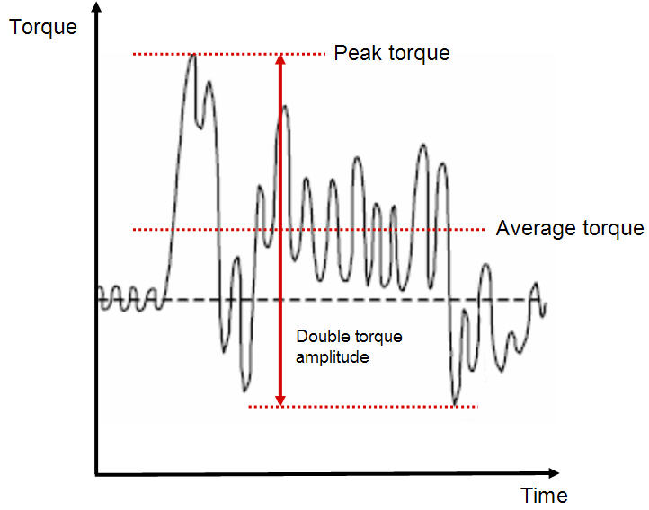

Figure 4: Interpretation of different torques in a measured curve, as example

#### 5.6.4 Design torque along shaft line

a) If there is no relevant first order propeller torsional resonance in the range 20% (of nn) above and 20% below the maximum operating speed in bollard condition (see Table 8), the following estimation ([Equation 36] and [Equation 37] respectively) of the maximum response torque can be used to calculate the design torque along the propeller shaft line.

$$Q_r = Q_{emax} + Q_{vib} + Q_{max} \cdot \frac{I}{I_t} \quad \text{[kNm]} \quad \text{[Equation 36]}$$

Equation 36 is to be applied for directly coupled two stroke Diesel engines without flexible coupling.

For all other plants:

$$Q_r = Q_{emax} + Q_{max} \cdot \frac{I}{I_t} \quad \text{[kNm]} \quad \text{[Equation 37]}$$

where:

- I = equivalent mass moment of inertia of all parts on engine side of component under consideration and

- It = equivalent mass moment of inertia of the whole propulsion system.

All the torques and the inertia moments shall be reduced to the rotation speed of the component being examined.

If the maximum torque, Qemax, is not known, it shall be taken as follows:

Table 11: Guideline for the determination of maximum motor torque

| Propeller type | Qemax |
|---|---|
| Propellers driven by electric motor | Qmotor |
| CP propellers not driven by electric motor | Qn |
| FP propellers driven by turbine | Qn |
| FP propellers driven by diesel engine | 0.75 Qn |

Here Qmotor is the electric motor peak torque.

b) If there is a first blade order torsional resonance in the range 20% (of nn) above and 20% below the maximum operating speed (bollard condition), the design torque (Qr) of the shaft component shall be determined by means of a dynamic torsional vibration analysis of the entire propulsion line in the time domain or alternatively in the frequency domain. It is then assumed that the plant is sufficiently designed to avoid harmful operation in barred speed range.

### 5.7  Guideline for torsional vibration calculation

The aim of torsional vibration calculations is to estimate the torsional loads for individual shaft line components over the life time in order to determine scantlings for safe operation. The model can be taken from the normal lumped mass elastic torsional vibration model (frequency domain) including the damping. Standard harmonics may be used to consider the gas forces. The engine torque - speed curve of the actual plant shall be applied.

For time domain analysis the model should include the ice excitation at propeller, the mean torques provided by the prime mover and the hydrodynamic mean torque produced by the propeller as well as any other relevant excitations. The calculations should cover the variation of phase between the ice excitation and prime mover excitation. This is extremely relevant for propulsion lines with direct driven combustion engines.

For frequency domain calculations the load should be estimated as a Fourier component analysis of the continuous sequence of half sine load peaks. The first and second order blade components should be used for excitation. The calculation should cover the whole relevant shaft speed range. The analysis of the responses at the relevant torsional vibration resonances may be performed for open water (without ice excitation) and ice excitation separately. The resulting maximum torque can be obtained for directly coupled plants by the following superposition:

$$Q_{peak} = Q_{emax} + Q_{opw} + Q_{ice} \quad \text{[kNm]} \quad \text{[Equation 38]}$$

where:

Qemax   is the maximum engine torque at considered rotational speed

Qopw   is the maximum open water response of engine excitation at considered shaft speed and determined by frequency domain analysis

Qice   is the calculated torque using frequency domain analysis for the relevant shaft speeds, ice excitation cases 1-4, resulting in the maximum response torque due to ice excitation

## 6 Design

### 6.1 Design Principle

The propulsion line shall be designed according to the pyramid strength principle in terms of its strength. This means that the loss of the propeller blade shall not cause any significant damage to other propeller shaft line components.

The propulsion line components shall withstand maximum and fatigue operational loads with the relevant safety margin. The loads do not need to be considered for shaft alignment or other calculations of normal operational loads.

### 6.2 Fatigue design in general

The design loads shall be based on the ice excitation and where necessary (shafting) dynamic analysis, described as a sequence of blade impacts (5.6.3.1). The shaft response torque shall be determined according 5.6.4.

The propulsion line components are to be designed so as to prevent accumulated fatigue failure when considering the relevant loads using the linear elastic Miner's rule as defined below.

$$D = \frac{n_1}{N_1} + \frac{n_2}{N_2} + \cdots + \frac{n_k}{N_k} \leq 1 \quad \text{[Equation 39]}$$

or

$$D = \sum_{j=1}^{j=k} \frac{n_j}{N_j} \leq 1 \quad \text{[Equation 40]}$$

Where:

k   is the number of stress levels

N1…k   is the number of load cycles to failure of the individual stress level class

n1…k   is the accumulated number of load cycles of the case under consideration, per class

D   Miners damage sum

Guidance:

The stress distribution should be divided into a frequency load spectrum having minimum 10 stress blocks (every 10 % of the load). Calculation with 5 stress blocks has been found to be too conservative. The maximum allowable load is limited by σref 2 for propeller blades and yield strength for all other components. The load distribution (spectrum) should be in accordance with the Weibull distribution.

### 6.3 Propeller blades

#### 6.3.1 Calculation of blade stresses due to static loads

The blade stresses (equivalent and principal stresses) shall be calculated for the design loads given in section 5.3. Finite element analysis (FEA) shall be used for stress analysis as part of the final approval for all propeller blades. The von Mises stresses, taken as σst, shall comply with Equation 42.

Alternatively, the following simplified [Equation 41] can be used in estimating the blade stresses for all propellers in the root area (r/R < 0.5) for final approval

$$\sigma_{st} = C_1 \frac{M_{BL}}{100 \cdot ct^2} \quad \text{[MPa]} \quad \text{[Equation 41]}$$

where:
constant C1 is the $\frac{actual\ stress}{stress\ obtained\ with\ beam\ equation}$.

If the actual value is not available, C1 should be taken as 1.6.

- $M_{BL} = (0.75 - r/R) \cdot R \cdot F$, for relative radius r/R < 0.5

- F is the maximum of Fb and Ff, whichever is greater.

#### 6.3.2 Acceptability criterion for static loads

The following criterion for calculated blade stresses shall be fulfilled:

$$\frac{\sigma_{ref 2}}{\sigma_{st}} \geq 1.3 \quad \text{[-]} \quad \text{[Equation 42]}$$

where:

σst   calculated stress for the design loads. If FE analysis is used in estimating the stresses, von Mises stresses shall be used.

#### 6.3.3 Fatigue design of propeller blade

##### 6.3.3.1 General

For materials with a two slope S-N curve (Figure 5) the fatigue calculations defined in this chapter are not required if the following criterion is fulfilled.

$$\sigma_{exp} \geq B_1 \cdot \sigma_{ref 2}^{B_2} \cdot log(N_{ice})^{B_3}$$

[Equation 43]

where:

B1, B2 and B3 are coefficients for open and ducted propellers, given in the Table 12 below.

Table 12: Coefficients to check a dispense from fatigue calculation

|   | Open propeller | Ducted propeller |
|---|---|---|
| B1 | 0.00328 | 0.00223 |
| B2 | 1.0076 | 1.0071 |
| B2 | 2.101 | 2.471 |

Where the above criterion is not fulfilled the fatigue requirements defined below shall be applied:

The fatigue design of the propeller blade is based on an estimated load distribution for the service life of the ship and the S-N curve for the blade material. An equivalent stress σfat that produces the same fatigue damage as the expected load distribution shall be calculated according to Miner's rule and the acceptability criterion for fatigue should be fulfilled as given in this section. The equivalent stress is normalised for 100 million cycles.

The blade stresses at various selected load levels for fatigue analysis are to be taken proportional to the stresses calculated for maximum loads given in section 5.3.
The peak principal stresses σf and σb are determined from Ff and Fb using FEA. The peak stress range Δσmax and the maximum stress amplitude σAmax are determined on the basis of load cases 1 and 3, 2 and 4.

$$\Delta\sigma_{max} = 2 \cdot \sigma_{Amax} = |(\sigma_{ice})_{f\ max}| + |(\sigma_{ice})_{b\ max}| \quad \text{[Equation 44]}$$

The load spectrum for backward loads is normally expected to have a lower number of cycles than the load spectrum for forward loads. Taking this into account in a fatigue analysis introduces complications that are not justified considering all uncertainties involved.
For the calculation of equivalent stress two types of S-N curves are available.

Two slope S-N curve (slopes 4.5 and 10), see Figure 5.

One slope S-N curve (the slope can be chosen), see Figure 6.

The type of the S-N-curve shall be selected to correspond with the material properties of the blade. If the S-N-curve is not known the two slope S-N curve shall be used.

Figure 5: Two-slope S-N curve

Figure 6: Constant-slope S-N curve

##### 6.3.3.2 Equivalent fatigue stress

Note: A more general method of determining the equivalent fatigue stress of propeller blades is described in 6.5, where the principal stresses are considered according to 5.3 using the Miner's rule. For a total number of load blocks nbl > 100, both methods deliver the same result. Therefore, they are regarded as equivalent.
The equivalent fatigue stress for 108 cycles which produces the same fatigue damage as the load distribution is:

$$\sigma_{fat} = \rho \cdot (\sigma_{ice})_{max} \quad \text{[Equation 45]}$$

where:

$$(\sigma_{ice})_{max} = 0.5 \cdot ((\sigma_{ice})_{f\ max} - (\sigma_{ice})_{b\ max}) \quad \text{[Equation 46]}$$

(σice)max   =   mean value of the principal stress amplitudes resulting from design forward and backward blade forces at the location being studied.

(σice)f max   =   principal stress resulting from forward load

(σice)b max   =   principal stress resulting from backward load

In the calculation of (σice)max, case 1 and case 3 or case 2 and case 4 are considered as pairs for (σice)f max, and (σice)b max calculations. Case 5 is excluded from the fatigue analysis.
Calculation of parameter ρ for two-slope S-N curve

The error of the following method to determine the parameter ρ is sufficiently small, if the number of load cycles Nice is in the range

$$5 \cdot 10^6 \leq N_{ice} \leq 10^8$$

The parameter ρ relates the maximum ice load to the distribution of ice loads according to the regression formula:

$$\rho = C_1 \cdot (\sigma_{ice})_{max}^{C_2} \cdot \sigma_{fl}^{C_3} \cdot log(N_{ice})^{C_4} \quad \text{[Equation 47]}$$

where:
$\sigma_{fl} = \gamma_{\varepsilon 1} \cdot \gamma_{\varepsilon 2} \cdot \gamma_v \cdot \gamma_m \cdot \sigma_{exp}$ is the blade material fatigue strength at 108 load cycles, see 6.3.3.3.

The coefficients C1, C2, C3, and C4 are given in Table 13

Table 13 Coefficients to evaluate material fatigue strength

|   | Open propeller | Ducted propeller |
|---|---|---|
| C1 | 0.000747 | 0.000534 |
| C2 | 0.0645 | 0.0533 |
| C3 | -0.0565 | -0.0459 |
| C4 | 2.22 | 2.584 |

Calculation of parameter ρ for constant-slope S-N curve

For materials with a constant-slope S-N curve, see Figure 6, - the factor ρ shall be calculated from the following formula:

$$\rho = \left(G \frac{N_{ice}}{N_R}\right)^{\frac{1}{m}} \left(ln(N_{ice})\right)^{-\frac{1}{k}} \quad \text{[Equation 48]}$$

where:

k = shape parameter of the Weibull distribution

k = 1.0 for ducted propellers and

k = 0.75 for open propellers

NR = reference number of load cycles (=108)

Values for the parameter G are given in Table 14 below. Linear interpolation may be used to calculate the value of G for m/k ratios other than those given in the Table 14.

Table 14: Value for the parameter G for different m/k ratios

| m/k | G | m/k | G | m/k | G |
|---|---|---|---|---|---|
| 3 | 6 | 6.5 | 1871 | 10 | 3.629×106 |
| 3.5 | 11.6 | 7 | 5040 | 10.5 | 11.899×106 |
| 4 | 24 | 7.5 | 14034 | 11 | 39.917×106 |
| 4.5 | 52.3 | 8 | 40320 | 11.5 | 136.843×106 |
| 5 | 120 | 8.5 | 119292 | 12 | 479.002×106 |
| 5.5 | 287.9 | 9 | 362880 |   |   |
| 6 | 720 | 9.5 | 1.133×106 |   |   |

##### 6.3.3.3 Acceptability criterion for fatigue

The equivalent fatigue stress σfat at all locations on the blade shall fulfil the following acceptability criterion:

$$\frac{\sigma_{fl}}{\sigma_{fat}} \geq 1.5 \quad \text{[Equation 49]}$$

where:

$$\sigma_{fl} = \gamma_{\varepsilon 1} \cdot \gamma_{\varepsilon 2} \cdot \gamma_v \cdot \gamma_m \cdot \sigma_{exp} \quad \text{[Equation 50]}$$

γε1   = reduction factor due to scatter (equal to one standard deviation)

γε2   = reduction factor for test specimen size effect

γv   = reduction factor for variable amplitude loading.

γm   = reduction factor for mean stress.

σexp   =   mean fatigue strength of the blade material at 108 cycles to failure in seawater

σexp in Table 15 has been defined from the results of constant amplitude loading fatigue tests at 107 load cycles and 50% survival probability and has been extended to 108 load cycles.

Fatigue strength values and correction factors other than those given in Table 15 may be used, provided the values are determined under conditions approved by the classification society.

The S-N curve characteristics are based on two slopes, the first slope 4.5 is from 1000 to 108 load cycles; the second slope 10 is above 108 load cycles.

The maximum allowable stress for one or low number of cycles is limited to σref2/S, with S=1.3 for static loads.

The fatigue strength σfat is the fatigue limit at 100 million load cycles.
The geometrical size factor (γε2) is:

$$\gamma_{\varepsilon 2} = 1 - a \cdot ln\left(\frac{t}{0.025}\right) \quad \text{[Equation 51]}$$

where:

"a" is as given in Table 15 below and "t" is the maximum blade thickness at the considered point

The mean stress effect (γm) is

$$\gamma_m = 1.0 - \left(\frac{1.4 \cdot \sigma_{mean}}{\sigma_u}\right)^{0.75} \quad \text{[Equation 52]}$$

The following values should be used for the reduction factors if actual values are not available: γε1 = 0.85, γv = 0.75, and γm = 0.75.

Table 15: Mean fatigue strength σexp for different material types at 108 load cycles and stress ratio R = -1 with a survival probability of 50%.

| Mean fatigue strength σexp for different material types at 108 load cycles | |  |  |
|---|---|---|---|
| Bronze and brass (a=0.10) | | Stainless steel (a=0.05) | |
| Mn-Bronze, CU1 (high tensile brass) | 84 MPa | Ferritic (12Cr 1Ni) | 144*) MPa |
| Mn-Ni-Bronze, CU2 (high tensile brass) | 84 MPa | Martensitic (13Cr 4Ni/13Cr 6Ni) | 156 MPa |
| Ni-Al-Bronze, CU3 | 120 MPa | Martensitic (16Cr 5Ni) | 168 MPa |
| Mn-Al-Bronze, CU4 | 113 MPa | Austenitic (19Cr 10Ni) | 132 MPa |

*) This value may be used, provided a perfect galvanic protection is active. Otherwise a reduction of about 30 MPa shall be applied.

### 6.4 Blade bolts, propeller hub and CP mechanism

#### 6.4.1 General

The blade bolts, CP mechanism, propeller boss and the fitting of the propeller to the propeller shaft shall be designed to withstand the maximum static and fatigue design loads (as applicable), as defined in 5.3 and 6.3. The safety factor S against yielding due to static loads and against fatigue shall be greater than 1.5, if not stated otherwise. The safety factor S for loads, resulting from propeller blade failure as defined in 5.4 shall be greater than 1.0 against yielding.

Provided that calculated stresses duly considering local stress concentrations are less than yield strength, or maximum of 70% of σu of respective materials, detailed fatigue analysis is not required. In all other cases components shall be analysed for cumulative fatigue. An approach similar to that used for shafting assessment may be applied (6.5).

#### 6.4.2 Blade bolts

Blade bolts shall withstand the following bending moment considered around a tangent on bolt pitch circle, or any other relevant axis for non-circular joints, parallel to considered root section:

$$M_{bolt} = S \cdot F_{ex}\left(0.8\frac{D}{2} - r_{bolt}\right) \quad \text{[kNm]} \quad \text{[Equation 53]}$$

where:

rbolt   = radius to the bolt plane [m]

S   = 1.0 safety factor

Blade bolt pre-tension shall be sufficient to avoid separation between mating surfaces when the maximum forward and backward ice loads defined in 5.3 (open and ducted propellers respectively) are applied. For conventional arrangements, the following formula may be applied:

$$d_{bb} = 41 \cdot \sqrt[2]{\frac{F_{ex} \cdot (0.8 \cdot D - d) \cdot S \cdot \alpha}{\sigma_{0.2} \cdot z_{bb} \cdot PCD}} \quad \text{[mm]} \quad \text{[Equation 54]}$$

where:

α   = 1.6 torque guided tightening

   = 1.3 elongation guided

   = 1.2 angle guided

   = 1.1 elongated by other additional means
   other factors may be used, if evidence is demonstrated

dbb   effective diameter of blade bolt in way of thread [mm]

Zbb   number of blade bolts

S   = 1.0 safety factor

#### 6.4.3 CP mechanism

Separate means, e.g. dowel pins, shall be provided in order to withstand the spindle torque resulting from blade failure Qsex (5.4.2) or ice interaction Qsmax (5.3.7), whichever is greater. Other components of the CP mechanism shall not be damaged by the maximum spindle torques (Qsmax, Qsex). One third of the spindle torque is assumed to be consumed by friction, if not otherwise documented trough further analysis.

The diameter of fitted pins dfp between the blade and blade carrier can be calculated using the formula:

$$d_{fp} = 66 \cdot \sqrt{\frac{(Q_s - Q_{fr})}{PCD \cdot z_{pin} \cdot \sigma_{0.2}}} \quad \text{[mm]} \quad \text{[Equation 55]}$$

where:

$$Q_s = max(S \cdot Q_{smax}; S \cdot Q_{sex}) \quad \text{[kNm]} \quad \text{[Equation 56]}$$

S   = 1.3 for Qsmax   and

   = 1.0 for Qsex

Qfr   = friction between connected surfaces = 0.33·Qs

The classification society may approve alternative Qfr calculation according to reaction forces due to Fex, or Ff, Fb whichever is relevant, utilising a friction coefficient = 0.15.
The stress in the actuating pin can be estimated by

$$\sigma_{vMises} = \sqrt{\left(\frac{\left(F \cdot \frac{h_{pin}}{2}\right)}{\frac{\pi d_{pin}^3}{32}}\right)^2 + 3 \cdot \left(\frac{F}{\frac{\pi}{4} d_{pin}^2}\right)^2} \quad \text{[MPa]} \quad \text{[Equation 57]}$$

where:

$$F = \frac{Q_s - Q_{fr}}{l_m} \quad \text{[kN]} \quad \text{[Equation 58]}$$

lm   distance pitching centre of blade – axis of pin [m]

hpin   height of actuating pin [mm]

dpin   diameter of actuating pin [mm]

Qfr   friction torque in blade bearings acting on the blade palm and caused by the reaction forces due to Fex, or Ff, Fb whichever is relevant; taken to one third of spindle torque Qs

The blade failure spindle torque Qsex shall not lead to any consequential damage.
Fatigue strength is to be considered for parts transmitting the spindle torque from the blade to a servo system considering the ice spindle torque acting on one blade. The maximum amplitude Qsamax is defined as:

$$Q_{samax} = \frac{Q_{sb} + Q_{sf}}{2} \quad \text{[kNm]} \quad \text{[Equation 59]}$$

where:

Qsb   spindle torque due to |Fb| [kNm]

Qsf   spindle torque due to |Ff| [kNm]

#### 6.4.4 Servo pressure

The design pressure for the servo system shall be taken as the pressure caused by Qsmax or, Qsex when not protected by relief valves on the hydraulic actuator side, reduced by relevant friction losses in bearings caused by the respective ice loads. The design pressure shall in any case not be less than relief valve set pressure.

### 6.5 Propulsion line components

The ultimate load resulting from total blade failure Fex as defined in 5.4 shall consist of combined axial and bending load components, wherever this is significant. The minimum safety factor against yielding is to be 1.0 for all shaft line components.

The shafts and shafting components, such as bearings, couplings and flanges shall be designed to withstand the operational propeller/ice interaction loads as given in 5.

The given loads are not intended to be used for shaft alignment calculation.
Cumulative fatigue calculations shall be conducted according to the Miner's rule. A fatigue calculation is not necessary, if the maximum stress is below fatigue strength at 108 load cycles.

The torque and thrust amplitude distribution (spectrum) in the propulsion line is to be taken as (because Weibull exponent k = 1):

$$Q_A(N) = Q_{Amax} \cdot \left(1 - \frac{log(N)}{log(Z \cdot N_{ice})}\right) \quad \text{[Equation 60]}$$

This is illustrated by the example in the Figure 7.

Figure 7: Cumulative torque distribution

The number of load cycles in the load spectrum is defined as Z · Nice.

The Weibull exponent should be considered as k = 1.0 for both open and ducted propeller torque and bending forces. The load distribution is an accumulated load spectrum, and the load spectrum should be divided into a minimum of ten load blocks when using the Miner summation method.

The load spectrum used counts the number of cycles for 100% load to be the number of cycles above the next step, e.g. 90 % load. This ensures that the calculation is on the conservative side. Consequently, the fewer stress blocks used the more conservative the calculated safety margin.

Figure 8: Example of ice load distribution (spectrum) for the shafting (k = 1)

The load spectrum is divided into nbl-number of load blocks for the Miner summation method.

The following formula can be used for calculation of the number of cycles for each load block.

$$n_i = N_{ice}^{1 - \left(1 - \frac{i}{n_{bl}}\right)^k} - \sum_{i=1}^{i} n_{i-1} \quad \text{[Equation 61]}$$

where:

i = single load block i and nbl is the number of load blocks

#### 6.5.1 Propeller fitting to the shaft

##### 6.5.1.1 Keyless cone mounting

The friction capacity (at 0° C) shall be at least S = 2.0 times the highest peak torque Qpeak as determined in 5.6 without exceeding the permissible hub stresses.

The necessary surface pressure P0°C can be determined as:

$$P_{0°C} = \frac{2 \cdot S \cdot Q_{peak}}{\pi \cdot \mu \cdot D_S^2 \cdot L \cdot 10^3} \quad \text{[MPa]} \quad \text{[Equation 62]}$$

where:

μ   = 0.15 for steel-steel,
   = 0.13 for steel-bronze

DS   = is the shrinkage diameter at the mid-length of the taper [m]

L   = is the effective length of taper [m]

Above friction coefficients may be increased by 0.04 if glycerine is used in wet mounting.

##### 6.5.1.2 Key mounting

Key mounting is not permitted.

##### 6.5.1.3 Flange mounting

The flange thickness is to be at least 25% of the required aft end shaft diameter (IACS UR M34).

Any additional stress raisers such as recesses for bolt heads shall not interfere with the flange fillet unless the flange thickness is increased correspondingly.

The flange fillet radius is to be at least 10% of the required shaft diameter.

The diameter of shear pins shall be calculated according to the following equation:

$$d_{pin} = 66 \cdot \sqrt[2]{\frac{Q_{peak} \cdot S}{PCD \cdot z_{pin} \cdot \sigma_{0.2}}} \quad \text{[mm]} \quad \text{[Equation 63]}$$

where

zpin   = number of shear pins

S   = 1.3 safety factor

The bolts are to be designed so that the blade failure load Fex (5.4) in backward direction does not cause yielding of the bolts. The following equation should be applied:

$$d_b = 41 \cdot \sqrt{\frac{F_{ex} \cdot \left(0.8 \cdot \frac{D}{PCD} + 1\right) \cdot \alpha}{\sigma_{0.2} \cdot z_b}} \quad \text{[mm]} \quad \text{[Equation 64]}$$

where:

α   = 1.6 torque guided tightening

   = 1.3 elongation guided

   = 1.2 angle guided

   = 1.1 elongated by other additional means
   other factors may be used, if evidence is demonstrated

db   diameter flange bolt [mm]

zb   number of flange bolts

#### 6.5.2 Propeller shaft

The propeller shaft is to be designed to fulfil the following:

6.5.2.1   The blade failure load Fex (5.4) applied parallel to the shaft (forward or backwards) shall not cause yielding. The bending moment need not to be combined with any other loads. The diameter dp in way of the aft stern tube bearing shall not be less than:

$$d_p = 160 \cdot \sqrt[3]{\frac{F_{ex} \cdot D}{\sigma_{0.2} \cdot \left(1 - \frac{d_i^4}{d_p^4}\right)}} \quad \text{[mm]} \quad \text{[Equation 65]}$$

where:

dp   =   propeller shaft diameter [mm]

di   =   propeller shaft inner diameter [mm]

Forward from the aft stern tube bearing the shaft diameter may be reduced based on direct calculation of the actual bending moment, or by the assumption that the bending moment caused by Fex is linearly reduced to 25% at the next bearing and in front of this linearly to zero at third bearing.

Bending due to maximum blade forces Fb and Ff have been disregarded since the resulting stress levels are much lower than the stresses caused by the blade failure load.

6.5.2.2   The stresses due to the peak torque Qpeak shall have a minimum safety factor of S=1.5 against yielding in plain sections and S=1.0 in way of stress concentrations in order to avoid bent shafts.

Minimum diameter of:

plain shaft:

$$d_p = 210 \cdot \sqrt[3]{\frac{Q_{peak} \cdot S}{\sigma_{0.2} \cdot \left(1 - \frac{d_i^4}{d^4}\right)}} \quad \text{[mm]} \quad \text{[Equation 66]}$$

notched shaft:

$$d_p = 210 \cdot \sqrt[3]{\frac{Q_{peak} \cdot S \cdot \alpha_t}{\sigma_{0.2} \cdot \left(1 - \frac{d_i^4}{d^4}\right)}} \quad \text{[mm]} \quad \text{[Equation 67]}$$

where:

αt =  local stress concentration factor in torsion.

Notched shaft diameter shall in any case not be less than the required plain shaft diameter.

6.5.2.3   The torque amplitudes (5.6.4) with the corresponding number of load cycles shall be used in an accumulated fatigue evaluation where the safety factor is Sfat=1.5. If the plant has high engine excited torsional vibrations (e.g. direct coupled 2-stroke engines), this shall also be considered.

6.5.2.4   The fatigue strengths σF and τF (3 million cycles) of shaft materials may be assessed on the basis of the material's yield or 0.2% proof strength as:

$$\sigma_F = 0.436 \cdot \sigma_{0.2} + 77 = \tau_F \cdot \sqrt{3} \quad \text{[MPa]} \quad \text{[Equation 68]}$$

This is valid for small polished specimens (no notch) and reversed stresses, see "VDEH 1983 Bericht Nr. ABF11 Berechnung von Wöhlerlinien für Bauteile aus Stahl".

The high cycle fatigue (HCF) is to be assessed based on the above fatigue strengths, notch factors (i.e. geometrical stress concentration factors and notch sensitivity), size factors, mean stress influence and the required safety factor of 1.6 at 3 million cycles increasing to 1.8 at 109 cycles.

The low cycle fatigue (LCF) representing 104 cycles is to be based on the smaller value of yield or 0.7 of tensile strength/√3. The criterion utilises a safety factor of 1.25.

The LCF and HCF as given above represent the upper and lower knees in a stress-cycle diagram. Since the required safety factors are included in these values, a Miner sum of unity is acceptable.

#### 6.5.3 Intermediate shafts

The intermediate shafts are to be designed to fulfil 6.5.2.2 to 6.5.2.4.

#### 6.5.4 Shaft connections

##### 6.5.4.1 Shrink fit couplings (keyless)

See 6.5.1.1. A safety factor of S = 1.8 shall be applied.

##### 6.5.4.2 Key mounting

Key mounting is not permitted.

##### 6.5.4.3 Flange mounting

The flange thickness is to be at least 20% of the required shaft diameter (IACS UR M34).

Any additional stress raisers such as recesses for bolt heads shall not interfere with the flange fillet unless the flange thickness is increased correspondingly.

The flange fillet radius is to be at least 8% of the shaft diameter (IACS UR M34).

The diameter of ream fitted (light press fit) bolts shall be chosen so that the peak torque is transmitted with a safety factor of 1.9. This accounts for a prestress. Pins shall transmit the peak torque with a safety factor of 1.5 against yielding ([Equation 63]).

The bolts are to be designed so that the blade failure load (5.4) in backward direction does not cause yielding.

##### 6.5.4.4 Splined shaft connections

Splined shaft connections can be applied where no axial or bending loads occur. A safety factor of S = 1.5 against allowable contact and shear stress resulting from Qpeak shall be applied.

#### 6.5.5 Gear transmissions

##### 6.5.5.1 Shafts

Shafts in gear transmissions shall meet the same safety level as intermediate shafts, but where relevant, bending stresses and torsional stresses shall be combined (e.g. by von Mises for static loads). Maximum permissible deflection in order to maintain sufficient tooth contact pattern shall be considered for the relevant parts of the gear shafts.

##### 6.5.5.2 Gearing

The gearing shall fulfil following three acceptance criteria:

- Tooth root stresses

- Pitting of flanks

- Scuffing

In addition to above 3 criteria subsurface fatigue may need to be considered.

Common for all criteria is the influence of load distribution over the face width. All relevant parameters are to be considered, such as elastic deflections (of mesh, shafts and gear bodies), accuracy tolerances, helix modifications, and working positions in bearings (especially for multiple input single output gears).

The load spectrum (see 6.5) may be applied in such a way that the numbers of load cycles for the output wheel are multiplied by a factor of (number of pinions on the wheel / number of propeller blades Z). For pinions and wheels operating at higher speeds the numbers of load cycles are found by multiplication with the gear ratios. The peak torque (Qpeak) is also to be considered during calculations.

Cylindrical gears can be assessed on the basis of the international standard ISO 6336 series (i.e. ISO 6336-1:2019, ISO 6336-2:2019, ISO 6336-3:2019, ISO 6336-4:2019, ISO 6336-5:2016 and ISO 6336-6:2019), provided that "method B" is used. Standards within the classification societies can also be applied provided that they are considered equivalent to the above mentioned ISO 6336.

For Bevel Gears the methods or standards used or acknowledged by the classification society can be applied provided that they are properly calibrated.

Tooth root safety shall be assessed against the peak torque, torque amplitudes (with the pertinent average torque) as well as the ordinary loads (open water free running) by means of accumulated fatigue analyses. The resulting factor of safety is to be at least 1.5. (Ref ISO 6336 Pt 1, 3 and 6 and IACS UR M56)

The safety against pitting shall be assessed in the same way as tooth root stresses, but with a minimum resulting safety factor of 1.2. (Ref ISO 6336-1:2019, ISO 6336-2:2019 and ISO 6336-6:2019 as well as IACS UR M56).

The scuffing safety (flash temperature method – ref. ISO/TR 13989-1:2000 and ISO/TR 13989-2:2000) based on the peak torque shall be at least 1.2 when the FZG class of the oil is assumed one stage below specification.

The safety against subsurface fatigue of flanks for surface hardened gears (oblique fracture from active flank to opposite root) is to be assessed at the discretion of each Classification Society. (It should be noted that high overloads can initiate subsurface fatigue cracks that may lead to a premature failure. In lieu of analyses UT inspection intervals may be used.)

##### 6.5.5.3 Bearings

See section 6.5.9.

##### 6.5.5.4 Gear wheel shaft connections

The torque capacity shall be at least 1.8 times the highest peak torque Qpeak (at considered rotational speed) as determined in 6.5 without exceeding the permissible hub stresses of 80% yield.

#### 6.5.6 Clutches

Clutches shall have a static friction torque of at least 1.3 times the peak torque Qpeak and dynamic friction torque 2/3 of the static.
Emergency operation of clutch after failure of e.g. operating pressure shall be made possible within reasonably short time. If this is arranged by bolts, it shall be on the engine side of the clutch in order to ensure access to all bolts by turning the engine.

#### 6.5.7 Elastic couplings

There shall be a separation margin of at least 20% between the peak torque and the torque where any twist limitation is reached.

$$Q_{peak} < 0.8 \cdot T_{kmax}\ (N = 1) \quad \text{[kNm]} \quad \text{[Equation 69]}$$

There shall be a separation margin of at least 20% between the maximum response torque Qpeak (see Figure 4) and the torque where any mechanical twist limitation and/or the permissible maximum torque of the elastic coupling, valid for at least a single load cycle (N=1), is reached.

A sufficient fatigue strength shall be demonstrated at design torque level Qr(N = x) and QA(N = x). This may be demonstrated by interpolation in a Weibull torque distribution (similar to Figure 7):

$$\frac{Q_r(N=x)}{Q_r(N=1)} = 1 - \frac{\log(x)}{\log(Z \cdot N_{ice})} \quad \text{[-]} \quad \text{[Equation 70]}$$

respectively

$$\frac{Q_A(N=x)}{Q_A(N=1)} = 1 - \frac{\log(x)}{\log(Z \cdot N_{ice})} \quad \text{[-]} \quad \text{[Equation 71]}$$

Where Qr (N=1) corresponds to Qpeak and QA (N=1) to QAmax.

$$Q_r\ (N=5E4) \cdot S < T_{Kmax}\ (N=5E4) \quad \text{[kNm]} \quad \text{[Equation 72]}$$
$$Q_r\ (N=1E6) \cdot S < T_{KV} \quad \text{[kNm]} \quad \text{[Equation 73]}$$

$$Q_A\ (N=5E4) \cdot S < \Delta T_{max}\ (N=5E4) \quad \text{[kNm]} \quad \text{[Equation 74]}$$

S is the general safety factor for fatigue, equal to 1.5.

See illustration in below Figure 9, Figure 10 and Figure 11.

The torque amplitude (or range Δ) shall not lead to fatigue cracking, i.e. exceeding the permissible vibratory torque. The permissible torque may be determined by interpolation in a Weibull torque distribution where TKmax1 respectively ΔTKmax refer to 50000 cycles and TKV refer to 106 cycles. See illustration in below Figure 9, Figure 10 and Figure 11.

$$T_{Kmax1} \geq Q_r\ at\ 5 \cdot 10^4\ load\ cycles \quad \text{[kNm]} \quad \text{[Equation 75]}$$

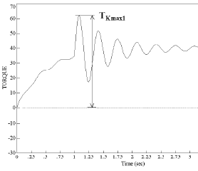

Figure 9

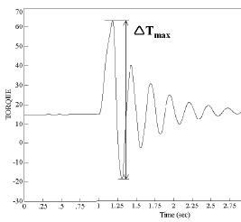

Figure 10

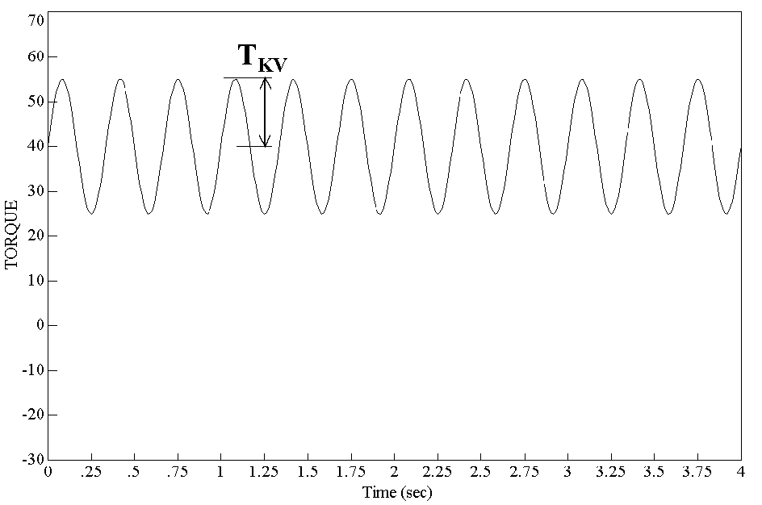

Figure 11

#### 6.5.8 Crankshafts

Special considerations apply for plants with large inertia (e.g. flywheel, tuning wheel or PTO) in the non-driving end front of the engine (opposite to main power take off).

#### 6.5.9 Bearings

The aft stern tube bearing as well as the next shaft line bearing are to withstand Fex as given in 5.4, in such a way that the ship can maintain operational capability. Rolling bearings are to have an L10a lifetime of at least 40 000 hours according to ISO 281:2007. Thrust bearings and their housings are to be designed to withstand with a safety factor S = 1.0 the maximum response thrust 5.5 and the axial force resulting from the blade failure load Fex in 5.4. For the purpose of calculation, except for Fex, the shafts are assumed to rotate at rated speed. For pulling propellers special consideration is to be given to loads from ice interaction on the propeller hub.

#### 6.5.10 Seals

Seals are to prevent egress of pollutants and be suitable for the operating temperatures. Contingency plans for preventing the egress of pollutants under failure conditions are to be documented.

Seals installed are to be suitable for the intended application. The manufacturer is to provide service experience in similar applications and/or testing results for consideration.

### 6.6 Azimuthing main propulsors

In addition to the above requirements, special consideration shall be given to those loading cases which are extraordinary for propulsion units when compared with conventional propellers. The estimation of load cases shall reflect the way the thrusters are intended to operate on the specific ship. In this respect, for example, the loads caused by the impacts of ice blocks on the propeller hub of a pulling propeller shall be considered. Furthermore, loads resulting from the thrusters operating at an oblique angle to the flow shall be considered. The steering mechanism, the fitting of the unit, and the body of the thruster shall be designed to withstand the loss of a blade without damage. The loss of a blade shall be considered for the propeller blade orientation which causes the maximum load on the component being studied. Typically, top-down blade orientation places the maximum bending loads on the thruster body.

Azimuth thrusters shall also be designed for estimated loads caused by thruster body/ice interaction. The thruster body shall withstand the loads obtained when the maximum ice blocks, which are given in section 5.2, strike the thruster body when the ship is at a typical ice operating speed. In addition, the design situation in which an ice sheet glides along the ship's hull and presses against the thruster body should be considered. The thickness of the sheet should be taken as the thickness of the maximum ice block entering the propeller, as defined in section 5.2.

## 7 Prime Movers

### 7.1 Propulsion engines

Engines are to be capable of being started and running the propeller in bollard condition.

Propulsion plants with CP propeller are to be capable being operated even when the CP system is at full pitch as limited by mechanical stoppers.

### 7.2 Starting arrangements

The capacity of the air receivers shall be sufficient to provide, without recharging, not less than 12 consecutive starts of the propulsion engine, if this has to be reversed for going astern or 6 consecutive starts if the propulsion engine does not have to be reversed for going astern.

If the air receivers serve any other purposes than starting the propulsion engine, they shall have additional capacity sufficient for these purposes.

The capacity of the air compressors shall be sufficient for charging the air receivers from atmospheric to full pressure in one (1) hour, except for a ship with the ice class PC6 to PC1, if its propulsion engine has to be reversed for going astern, in which case the compressor shall be able to charge the receivers in half an hour.

### 7.3 Emergency power units

Provisions shall be made for heating arrangements to ensure ready starting from cold of the emergency power units at an ambient temperature applicable to the Polar Class of the ship.

Emergency power units shall be equipped with starting devices with a stored energy capability of at least three consecutive starts at the above mentioned temperature. The source of stored energy shall be protected to preclude critical depletion by the automatic starting system, unless a second independent mean of starting is provided. A second source of energy shall be provided for an additional three starts within 30 min., unless manual starting can be demonstrated to be effective.

## 8 Equipment fastening loading accelerations

### 8.1 General

Essential equipment and supports shall be suitable for the accelerations as indicated in the following paragraphs. Accelerations are to be considered as acting independently.

### 8.2 Longitudinal Impact Accelerations, a1

Maximum longitudinal impact acceleration at any point along the hull girder,

$$a_1 = \frac{F_{IB}}{\Delta} \cdot \left(1.1 \cdot \tan(\gamma + \varphi) + \left(7 \cdot \frac{H}{L}\right)\right) \quad \text{[m/s}^2\text{]} \quad \text{[Equation 76]}$$

### 8.3 Vertical acceleration, av

Combined vertical impact acceleration at any point along the hull girder,

$$a_v = 2.5 \cdot \left(\frac{F_{IB}}{\Delta}\right) \cdot F_X \quad \text{[m/s}^2\text{]} \quad \text{[Equation 77]}$$

FX   = 1.3 at FP

   = 0.2 at midships

   = 0.4 at AP

   = 1.3 at AP for vessels conducting ice breaking astern

   Intermediate values to be interpolated linearly.

### 8.4 Transverse impact acceleration, at

Combined transverse impact acceleration at any point along hull girder,

$$a_t = 3F_i \frac{F_X}{\Delta} \quad \text{[m/s}^2\text{]} \quad \text{[Equation 78]}$$

FX   = 1.5 at FP

   = 0.25 at midships

   = 0.5 at AP

   = 1.5 at AP for vessels conducting ice breaking astern

   Intermediate values to be interpolated linearly.

where:

φ   = maximum friction angle between steel and ice, normally taken as 10 [degrees]

γ   = bow stem angle at waterline [degrees]

Δ   = displacement

L   = length between perpendiculars [m]

H   = distance in meters from the water line to the point being considered [m]

FIB   = vertical impact force, defined in UR I2.13.2.1

Fi   = total force normal to shell plating in the bow area due to oblique ice impact, defined in UR I2.3.2.1

## 9 Auxiliary Systems

9.1 Machinery shall be protected from the harmful effects of ingestion or accumulation of ice or snow. Where continuous operation is necessary, means should be provided to purge the system of accumulated ice or snow.

9.2 Means should be provided to prevent damage to tanks containing liquids due to freezing.

9.3 Vent pipes, intake and discharge pipes and associated systems shall be designed to prevent blockage due to freezing or ice and snow accumulation.

## 10 Sea Inlets and Cooling Water Systems

10.1   Cooling water systems for machinery that is essential for the propulsion and safety of the vessel, including sea chest inlets, shall be designed for the environmental conditions applicable to the ice class.

10.2   At least two sea chests are to be arranged as ice boxes (sea chests for water intake in severe ice conditions) for ice class PC1 to PC5 inclusive. The calculated volume for each of the ice boxes shall be at least 1m3 for every 750 kW of the totally installed power. For PC6 and PC7 there shall be at least one ice box located preferably near centre line.

10.3   Ice boxes are to be designed for an effective separation of ice and venting of air.

10.4   Sea inlet valves are to be secured directly to the ice boxes. The valve shall be a full bore type.

10.5   Ice boxes and sea bays are to have vent pipes and are to have shut off valves connected directly to the shell.

10.6   Means are to be provided to prevent freezing of sea bays, ice boxes, ship side valves and fittings above the load water line.

10.7   Efficient means are to be provided to re-circulate cooling seawater to the ice box. Total sectional area of the circulating pipes is not to be less than the area of the cooling water discharge pipe.

10.8   Detachable gratings or manholes are to be provided for ice boxes. Manholes are to be located above the deepest load line. Access is to be provided to the ice box from above.

10.9   Openings in ship sides for ice boxes are to be fitted with gratings, or holes or slots in shell plates. The net area through these openings is to be not less than 5 times the area of the inlet pipe. The diameter of holes and width of slot in shell plating is to be not less than 20 mm. Gratings of the ice boxes are to be provided with a means of clearing. The means of clearing is to be of a type using low pressure steam. Clearing pipes are to be provided with screw-down type non return valves.

## 11 Ballast Tanks

11.1   Efficient means are to be provided to prevent freezing in fore and after peak tanks and wing tanks located above the water line and where otherwise found necessary.

## 12 Ventilation Systems

12.1   The air intakes for machinery and accommodation ventilation are to be located on both sides of the ship at locations where manual de-icing is possible. Anti-icing protection of the air inlets may be accepted as an equivalent solution to location on both sides of the ship and manual de-icing at the Society's discretion. Notwithstanding the above, multiple air intakes are to be provided for the emergency generating set and are to be as far apart as possible.

12.2   The temperature of the inlet air shall be suitable for:

- the safe operation of the machinery; and

- the thermal comfort in the accommodation.

Accommodation and ventilation air intakes shall be provided with means of heating, if needed.

## 13 Steering Systems

13.1   Rudder stops are to be provided. The design ice force on rudder shall be transmitted to the rudder stops without damage to the steering system.

An ice knife shall in general be fitted to protect the rudder in centre position. The ice knife shall extend below BWL. Design forces shall be determined according to the I2.15.

13.2   The rudder actuator is to comply with the following requirements 13.2.1 and 13.2.2:

13.2.1   The rudder actuator is to be designed for a holding torque obtained by multiplying the open water torque resulting from the application of SOLAS Reg. II-1 /29.3.2 (considering however a maximum speed of 18 knots, by following factors:

| Ice Class | PC1 | PC2 | PC3 | PC4 | PC5 | PC6 | PC7 |
|---|---|---|---|---|---|---|---|
| Factor | 5 | 5 | 3 | 3 | 3 | 1.5 | 1.5 |

13.2.2   The design pressure for calculations to determine the scantlings of the rudder actuator is to be at least 1.25 times the maximum working pressure corresponding to the holding torque defined in 13.2.1 (Derived from SOLAS Reg. II-1 / 29.2.2).

13.3   The rudder actuator is to be protected by torque relief arrangements, assuming the following turning speeds [deg/s] without an undue pressure rise (ref UR M42 for undue pressure rise):

Table 17: Steering gear turning speeds

| Ice Class | PC1 and PC2 | PC3 to PC5 | PC6 and PC7 |
|---|---|---|---|
| Turning speeds [deg/s] | 10 | 7.5 | 6 |

If the rudder and actuator design can withstand such rapid loads, this special relief arrangement is not necessary and a conventional one may be used instead (UR M42).

13.4   Additionally for icebreakers, fast-acting torque relief arrangements are to be fitted in order to provide effective protection of the rudder actuator in case of the rudder being pushed rapidly hard over against the stops.

For hydraulically operated steering gear, the fast-acting torque relief arrangement is to be so designed that the pressure cannot exceed 115% of the set pressure of the safety valves when the rudder is being forced to move at the speed indicated in Table 18, also when taking into account the oil viscosity at the lowest expected ambient temperature in the steering gear compartment.

For alternative steering systems the fast-acting torque relief arrangement is to demonstrate an equivalent degree of protection to that required for hydraulically operated arrangements.

The turning speeds to be assumed for each ice class are shown in Table 18 below.

Table 18: Steering gear turning speeds for icebreakers

| Ice Class | PC1 and PC2 | PC3 to PC5 | PC6 and PC7 |
|---|---|---|---|
| Turning speeds [deg/s] | 40 | 20 | 15 |

The arrangement is to be designed such that steering capacity can be speedily regained.

## 14 Alternative Design

14.1   As an alternative to UR I3 – a comprehensive design study may be submitted and may be requested to be validated by an agreed test programme.

## APPENDIX

The following illustrations show the excitation torque for all torsional load cases given in this UR for different blade numbers (Z). The plots have been made using data for PC7 (Hice = 1.5)

End of Document
