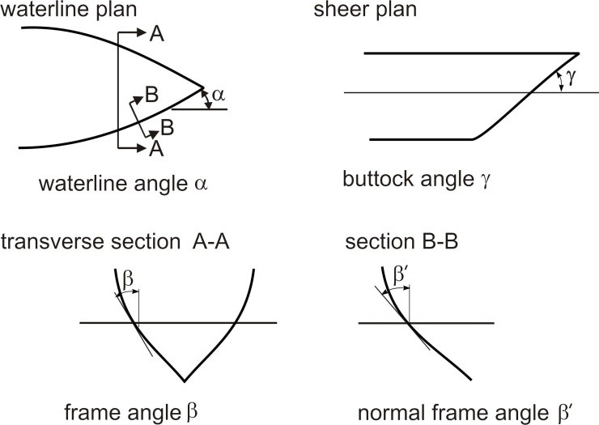

<!-- markdownlint-disable MD033 -->
# I2 Structural Requirements for Polar Class Ships

(August 2006)
(Rev.1 Jan 2007)
(Corr.1 Oct 2007)
(Rev.2 Nov 2010)
(Rev.3 Apr 2016)
(Rev.4 Dec 2019)

## I2.1 General

### I2.1.1 Application\*

This UR applies to Polar Class ships according to UR I1.

### I2.1.2 Definitions

I2.1.2.1 The length LUI is the distance, in m, measured horizontally from the fore side of the stem at the intersection with the upper ice waterline (UIWL) to the after side of the rudder post, or the centre of the rudder stock if there is no rudder post. LUI is not to be less than 96%, and need not be greater than 97%, of the extreme length of the upper ice waterline (UIWL) measured horizontally from the fore side of the stem. In ships with unusual stern and bow arrangement the length LUI will be specially considered.

I2.1.2.2 The ship displacement DUI is the displacement, in kt, of the ship corresponding to the upper ice waterline (UIWL). Where multiple waterlines are used for determining the UIWL, the displacement is to be determined from the waterline corresponding to the greatest displacement.

## I2.2 Hull areas

I2.2.1 The hull of Polar Class ships is divided into areas reflecting the magnitude of the loads that are expected to act upon them. In the longitudinal direction, there are four regions: Bow, Bow Intermediate, Midbody and Stern. The Bow Intermediate, Midbody and Stern regions are further divided in the vertical direction into the Bottom, Lower and Icebelt regions. The extent of each hull area is illustrated in Figure 1.

---

\* Note:

1. UR I2 applies to ships contracted for construction on or after 1 July 2007.

2. Rev.1 of this UR is to be uniformly applied by IACS Societies on ships contracted for construction on and after 1 March 2008.

3. Rev.2 of this UR is to be uniformly implemented by the IACS Societies on ships contracted for construction on or after 1 January 2012.

4. Rev.3 of this UR is to be uniformly implemented by the IACS Societies on ships contracted for construction on or after 1 July 2017.

5. The "contracted for construction" date means the date on which the contract to build the vessel is signed between the prospective owner and the shipbuilder. For further details regarding the date of "contract for construction", refer to IACS Procedural Requirement (PR) No. 29.

6. Rev.4 of this UR is to be uniformly implemented by the IACS Societies on ships contracted for construction on or after
1 Jan 2021.

### Figure 1 - Hull area extents

![Figure 1 - Hull area extents: Polar Class ship hull divided into Bow (B), Bow Intermediate (BIi/BIl), Midbody (Mi/Ml/Mb) and Stern (Si/Sl/Sb) regions, showing UIWL and LIWL waterlines, with geometric parameters including 0.04L_UI aft of WL angle = 0 degrees at UIWL, WL angle = 10 degrees at UIWL, 1.5 m and 2.0 m vertical dimensions, 0.7b => 0.15L_UI longitudinal boundary, and x dimensions for PC1-4 (x=1.5 m) and PC5-7 (x=1.0 m) measured at aft end of bow region; also includes plan view showing region boundaries and a midship cross-section showing Mi, Ml and Mb with UIWL/LIWL](assets/ur-i2rev4/part01-fig-000.png)

I2.2.2 The upper ice waterline (UIWL) and lower ice waterline (LIWL) are as defined in UR I1.3.

I2.2.3 Figure 1 notwithstanding, at no time is the boundary between the Bow and Bow Intermediate regions to be forward of the intersection point of the line of the stem and the ship baseline.

I2.2.4 Figure 1 notwithstanding, the aft boundary of the Bow region need not be more than 0.45 LUI aft of the fore side of the stem at the intersection with the upper ice waterline (UIWL).

I2.2.5 The boundary between the bottom and lower regions is to be taken at the point where the shell is inclined 7° from horizontal.

I2.2.6 If a ship is intended to operate astern in ice regions, the aft section of the ship is to be designed using the Bow and Bow Intermediate hull area requirements.

I2.2.7 Figure 1 notwithstanding, if the ship is assigned the additional notation "Icebreaker", the forward boundary of the stern region is to be at least 0.04 LUI forward of the section where the parallel ship side at the upper ice waterline (UIWL) ends.

## I2.3 Design ice loads

### I2.3.1 General

(i) A glancing impact on the bow is the design scenario for determining the scantlings required to resist ice loads.

(ii) The design ice load is characterized by an average pressure (Pavg) uniformly distributed over a rectangular load patch of height (b) and width (w).

(iii) Within the Bow area of all Polar Class ships, and within the Bow Intermediate Icebelt area of Polar Class ships PC6 and PC7, the ice load parameters are functions of the actual bow shape. To determine the ice load parameters (Pavg, b and w), it is required to calculate the following ice load characteristics for sub-regions of the bow area; shape coefficient (fai), total glancing impact force (Fi), line load (Qi) and pressure (Pi).

(iv) In other ice-strengthened areas, the ice load parameters (Pavg, bNonBow and wNonBow) are determined independently of the hull shape and based on a fixed load patch aspect ratio, AR = 3.6.

(v) Design ice forces calculated according to I2.3.2.1 (iii) are applicable for bow forms where the buttock angle γ at the stem is positive and less than 80 deg, and the normal frame angle β' at the centre of the foremost sub-region, as defined in I2.3.2.1 (i), is greater than 10 deg.

(vi) Design ice forces calculated according to I2.3.2.1 (iv) are applicable for ships which are assigned the Polar Class PC6 or PC7 and have a bow form with vertical sides. This includes bows where the normal frame angles β' at the considered sub-regions, as defined in I2.3.2.1 (i), are between 0 and 10 deg.

(vii) For ships which are assigned the Polar Class PC6 or PC7, and equipped with bulbous bows, the design ice forces on the bow are to be determined according to I2.3.2.1 (iv). In addition, the design forces are not to be taken less than those given in I2.3.2.1 (iii), assuming fa = 0.6 and AR = 1.3.

(viii) For ships with bow forms other than those defined in (v) to (vii), design forces are to be specially considered by the Classification Society.

(ix) Ship structures which are not directly subjected to ice loads may still experience inertial loads of stowed cargo and equipment resulting from ship/ice interaction. These inertial loads, based on accelerations determined by the Classification Society, are to be considered in the design of these structures.

I2.3.2 Glancing impact load characteristics

The parameters defining the glancing impact load characteristics are reflected in the Class Factors listed in Table 1 and Table 2.

### Table 1 - Class factors to be used in I2.3.2 (iii)

| Polar Class | Crushing failure Class Factor (CFC) | Flexural failure Class Factor (CFF) | Load patch dimensions Class Factor (CFD) | Displacement Class Factor (CFDIS) | Longitudinal strength Class Factor (CFL) |
|---|---|---|---|---|---|
| PC1 | 17.69 | 68.60 | 2.01 | 250 | 7.46 |
| PC2 | 9.89  | 46.80 | 1.75 | 210 | 5.46 |
| PC3 | 6.06  | 21.17 | 1.53 | 180 | 4.17 |
| PC4 | 4.50  | 13.48 | 1.42 | 130 | 3.15 |
| PC5 | 3.10  | 9.00  | 1.31 | 70  | 2.50 |
| PC6 | 2.40  | 5.49  | 1.17 | 40  | 2.37 |
| PC7 | 1.80  | 4.06  | 1.11 | 22  | 1.81 |

### Table 2 - Class factors to be used in I2.3.2.1 (iv)

| Polar Class | Crushing failure Class Factor (CFCV) | Line load Class Factor (CFQV) | Pressure Class Factor (CFPV) |
|---|---|---|---|
| PC6 | 3.43 | 2.82 | 0.65 |
| PC7 | 2.60 | 2.33 | 0.65 |

#### I2.3.2.1 Bow area

(i) In the Bow area, the force (F), line load (Q), pressure (P) and load patch aspect ratio (AR) associated with the glancing impact load scenario are functions of the hull angles measured at the upper ice waterline (UIWL). The influence of the hull angles is captured through calculation of a bow shape coefficient (fa). The hull angles are defined in Figure 2.

### Figure 2 - Definition of hull angles

Note: β' = normal frame angle at upper ice waterline [deg]
α = upper ice waterline angle [deg]
γ = buttock angle at upper ice waterline (angle of buttock line measured from horizontal) [deg]
tan(β) = tan(α)/tan(γ)
tan(β') = tan(β)·cos(α)

(ii) The waterline length of the bow region is generally to be divided into 4 sub-regions of equal length. The force (F), line load (Q), pressure (P) and load patch aspect ratio (AR) are to be calculated with respect to the mid-length position of each sub-region (each maximum of F, Q and P is to be used in the calculation of the ice load parameters Pavg, b and w).

(iii) The Bow area load characteristics for bow forms defined in I2.3.1 (v) are determined as follows:

(a) Shape coefficient, fai, is to be taken as

fai =   minimum (fai,1 ; fai,2 ; fai,3)

where fai,1 = (0.097 - 0.68 · (x/ LUI - 0.15)2) · αi  / (β'i)0.5
 fai,2 = 1.2 · CFF  /  ( sin (β'i) · CFC · DUI0.64)
 fai,3 = 0.60

(b) Force, Fi:

Fi  =  fai  · CFC · DUI0.64 [MN]

(c) Load patch aspect ratio, ARi:

ARi  = 7.46 · sin (β'i) ≥ 1.3

(d) Line load, Qi:

Qi  =  Fi 0.61 · CFD / ARi0.35 [MN/m]

(e) Pressure, Pi:

Pi  =  Fi0.22  · CFD2 · ARi0.3 [MPa]

where  i = sub-region considered
 LUI = length as defined in I2.1.2.1 [m]
 x =  distance from the fore side of the stem at the intersection with the upper ice waterline (UIWL) to station under consideration [m]
 α = waterline angle [deg], see Figure 2
 β' = normal frame angle [deg], see Figure 2
 DUI = displacement as defined in I2.1.2.2, not to be taken less than 5 [kt]
 CFC = Crushing failure Class Factor from Table 1
 CFF = Flexural failure Class Factor from Table 1
 CFD = Load patch dimensions Class Factor from Table 1

(iv) The Bow area load characteristics for bow forms defined in I2.3.1 (vi) are determined as follows:

(a) Shape coefficient, fai, is to be taken as

fai  = αi  / 30

(b) Force, Fi:

Fi  =  fai  · CFCV · DUI0.47 [MN]
