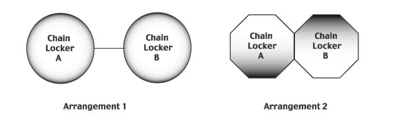

# L4 Closure of Chain Lockers

L4
(Nov 2002)
(Rev.1 July 2003)
(Rev.2 Nov 2005)
(Rev.3 Mar 2011)
(Corr.1 Aug 2011)
(Corr.2 Feb 2022)

This Unified Requirement is applicable to ships with a length of 24 m and above built in accordance with the 1966 Load Line Convention or the 1988 Protocol to the Load Line Convention and the keels of which are laid or which are at a similar stage of construction on or after 1 July 2003.

1. Spurling pipes and cable lockers are to be watertight up to the weather deck. Bulkheads between separate cable lockers (see Arrangement 1), or which form a common boundary of cable lockers (see Arrangement 2), need not however be watertight.

2. Where means of access is provided, it is to be closed by a substantial cover and secured by closely spaced bolts.

3. Where a means of access to spurling pipes or cable lockers is located below the weather deck, the access cover and its securing arrangements are to be in accordance with recognized standards\* or equivalent for watertight manhole covers. Butterfly nuts and/or hinged bolts are prohibited as the securing mechanism for the access cover.

4. Spurling pipes through which anchor cables are led are to be provided with permanently attached closing appliances\*\* to minimize water ingress.

\* Examples of the recognized standards are such as:
    i) ISO 5894:2018
    ii) China: CB/T4392-2014 "Marine manhole cover"
    iii) India: IS 15876-2009 "Ships and Marine Technology manholes with bolted covers"
    iv) Japan: JIS F2304:2015, "Ship's Manholes" and JIS F2329:1975, "Marine Small Size Manhole"
    v) Korea: KS V ISO 5894:2012
    vi) Norway: NS 6260:1985 "Manhole cover – overview"
    vii) Russia: GOST 2021-90 "Ship's steel manholes. Specifications"

\*\* Examples of acceptable arrangements are such as:
    i) steel plates with cutouts to accommodate chain links or
    ii) canvas hoods with a lashing arrangement that maintains the cover in the secured position.

Notes:

1. Changes introduced in Rev.3 of this UR are to be uniformly implemented by IACS Societies on ships contracted for construction on or after 1 January 2012.

2. The "contracted for construction" date means the date on which the contract to build the vessel is signed between the prospective owner and the shipbuilder. For further details regarding the date of "contract for construction", refer to IACS Procedural Requirement (PR) No. 29.

End of Document
