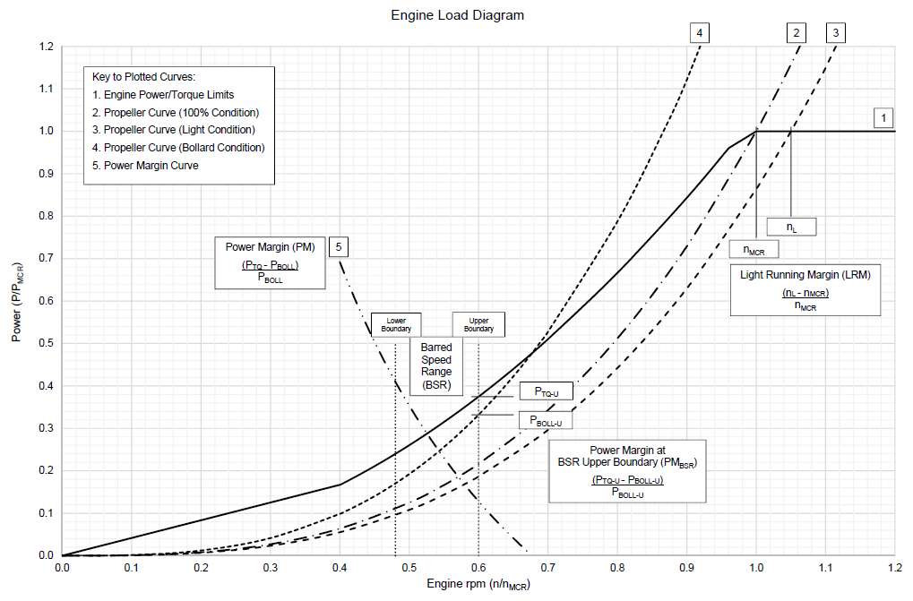

<!-- markdownlint-disable MD033 -->
# M88 (Apr 2025) Shipboard Trials of Reciprocating Internal Combustion Engines

## 1. General

Shipboard Trial is a part of the "Certification scheme for reciprocating internal combustion engines" (hereafter is referred to as "engine").

## 2. Scope

2.1 This UR is associated with IACS UR M87 and contains the requirements for shipboard trials of engines and sub-systems.

2.2 This UR describes shipboard trial requirements for engines in general. Further requirements of the following URs apply, as applicable,

- M78, Reciprocating Internal Combustion Engines Fuelled by Gases or Low-flashpoint Fuels

## 3. Objectives

The purpose of the shipboard testing is to verify compatibility with power transmission and driven machinery in the system, control systems and auxiliary systems necessary for the engine and integration of engine / shipboard control systems, as well as other items that had not been dealt with in the FAT (Factory Acceptance Testing).

## 4. Definitions

4.1 The definitions in M87 are applicable to this UR.

4.2 For the purpose of this UR, the following definition applies:

Shipboard trials contain dock testing, mooring testing and sea trials.

## 5. Shipboard trials

The tests listed below are to be carried out in the presence of a classification society's Surveyor.

Notes:

1. This Unified Requirement is to be uniformly implemented by IACS Societies for engines with a type approval certification application date on or after 1 January 2027, and or for ships contracted for construction on or after the same date.
2. The "date of application for type approval" refers to the date of the document accepted by the Classification Society as a request for type approval certification of a new engine type, an engine type that has undergone substantive modifications from a previously type-approved one, or for the renewal of an expired type approval certificate, while the "contracted for construction" date is the date the vessel's construction contract is signed between the prospective owner and the shipbuilder; for further details on the "contract for construction" date, refer to IACS Procedural Requirement (PR) No. 29.

### 5.1 Starting capacity

Starting manoeuvres are to be carried out to verify that the capacity of the starting system satisfies the required number of starts attempts as specified in UR M61.

### 5.2 Monitoring and alarm system

The monitoring and alarm systems are to be checked to the full extent for all engines to verify effectiveness of the actual installation. Items already verified during the FAT (Factory Acceptance Testing) may be omitted upon agreement with the Society.

### 5.3 Test loads

5.3.1 Test loads for various engine applications are given below. In addition, the scope of the trials may be expanded depending on the engine application, service experience, or other relevant reasons.

**5.3.2** The suitability of the engine to operate on fuels intended for use is to be demonstrated.

*Note:*
*Tests other than those listed below may be required by statutory instruments (e.g. EEDI verification).*

**5.3.3** Propulsion engines driving fixed pitch propeller or impeller.

| | | |
|---|---|---|
| A) | At rated engine speed n0: | at least 4 hours. |
| B) | At engine speed 1.032n0 (if engine load is not blocked at 1.032 n0): | 30 min. |
| C) | At approved intermittent overload (if applicable): | testing for duration as agreed with the Society. |
| D) | Minimum engine speed to be determined. | |
| E) | The ability of reversible engines to be operated in reverse direction is to be demonstrated. | |

*Note 1:*
*During stopping tests according to Resolution MSC.137(76), see 5.4.1 for additional requirements in the case of a barred speed range.*

*Note 2:*
*For the engine load to be applied for the reverse direction test E), refer to UR M25.1.*

**5.3.4** Propulsion engines driving controllable pitch propellers

A) At rated engine speed n0 with a propeller pitch leading to rated engine power (or to the maximum achievable power if 100% cannot be reached): at least 4 hours.

B) At approved intermittent overload (if applicable): testing for duration as agreed with the Society.

C) With reverse pitch suitable for manoeuvring, see. para. 5.4.1 of this UR for additional requirements in the case of a barred speed range.

**5.3.5** Engine(s) driving generator(s) for electrical propulsion and/or auxiliary purposes

A) At 100% power (rated electrical power of generator): at least 60 min.

B) At 110% power (rated electrical power of generator): at least 10 min.

*Note:*
*Each engine is to be tested 100% electrical power for at least 60 min and 110% of rated electrical power of the generator for at least 10 min. This may, if possible, be done during the electrical propulsion plant test, which is required to be tested with 100% propulsion power (i.e. total electric motor capacity for propulsion) by distributing the power on as few generators as possible. The duration of this test is to be sufficient to reach stable operating temperatures of all rotating machines or for at least 4 hours. When some of the gen. set(s) cannot be tested due to insufficient time during the propulsion system test mentioned above, those required tests are to be carried out separately.*

C) Integration test of generator(s) with power management system, demonstration of the generator prime movers' and governors' ability to handle load steps as described in UR M3.2.

**5.3.6** Propulsion engines also driving power take off (PTO) generator.

A) 100% engine power (MCR) at corresponding speed n0: at least 4 hours.

B) 100% propeller branch power at engine speed n0 (unless already covered in A): 2 hours.

C) 100% PTO branch power to at the designed engine speed (maximum possible engine speed): (unless already covered in A) at least 1 hour.

D) Tests specified in 5.3.3 B), C), D) and E) are also to be carried out if the specifications allow.

**5.3.7** Engines driving auxiliaries other than generators.

A) 100% power (MCR) at corresponding speed n0: at least 30 min.

B) Approved intermittent overload: testing for duration as approved,

### 5.4 Torsional vibrations

#### 5.4.1 Barred speed range

Where a barred speed range (bsr) is required in accordance with UR M68.5, the passages through this bsr is to be demonstrated. The time taken to transit the bsr is to be recorded and when accelerating ahead is not to exceed the time determined from the following formula:

$$T_{bsr} = 5 \cdot (\tau_{max} / \tau_T)^{-7.2}$$

where:

- Tbsr = Maximum allowable time, in seconds, to transit the bsr.
- τmax = Maximum stress amplitude, in N/mm2, of the steady state torsional vibration at the critical speed as per calculation or measurement.
- τT = Permissible stress amplitude, in N/mm2, due to steady state torsional vibration at the critical speed, as determined from UR M68.5.

The required value for Tbsr is to be included within the torsional vibration calculation submission.

The designer shall ensure that sufficient torque and/or power reserve exists within the main propulsion system such that the required bsr transit time is not exceeded.

A minimum Power Margin at the upper boundary of the bsr (PMbsr) of 10% against the bollard pull propeller curve and a minimum Light Running Margin (LRM) of 4% are recommended.

Power Margin is defined as the excess ratio of power which exists between the engine torque/power limiting curve and propeller bollard pull curve. Light Running Margin is defined as the ratio between the engine rpm value on the light propeller curve and the engine rpm value at the nominal (100%) propeller curve at the maximum continuous rating. Both parameters are shown in Figure 1.

Figure 1. Light Running Margin and Power Margin: Example Relationship to Engine Load Diagram

Alternatively, submissions may be made to the Classification Society for consideration as follows:

- When carried out in accordance with UR M68.2, alternative formulae for Tbsr may be presented. The submission is to demonstrate that the fatigue life is conservative with respect to the shafting material;

- Documented evidence of satisfying the bsr transit time requirement on similar propulsion systems in terms of power, rpm and mass-elastic properties for vessels of similar type, displacement and hull form.

#### 5.4.2 Shipboard trials

For cases where calculations carried out in accordance with UR M68.5 indicate the necessity for a bsr, measurements shall be taken and recorded to confirm that the torsional vibration response characteristics satisfy the requirements of the submitted torsional vibration calculations and bsr transit time calculation.

Measurements are to be taken at vessel draughts which are, as far as practicable, the maximum achievable during shipboard trials. The trials draughts are to be included in the measurement report.

Verification of the torsional response characteristics is to be demonstrated by, at least, measurement of the following:

- The mean torsional stress throughout the operating range of main engine revolutions (limited when strain gauges are used); and
- The stress amplitude of the steady state torsional vibration throughout the operating range of main engine revolutions under normal firing conditions.

The measurement procedures adopted to verify the torsional vibration response characteristics are to identify the maximum stress amplitude of the steady state torsional vibration at any resonant condition which exists within the operating range of main engine revolutions. For resonances at which the stress amplitude of the steady state torsional vibration exceeds that permissible for continuous operation, as defined in UR M68.5, the critical speeds are to be identified. Identification of any critical speed will, as defined in UR M68.5, determine the lower and upper boundaries of its associated bsr.

Verification of the bsr transit time is to begin at telegraph setting closest to the position below the lower border of the bsr. Allow the vessel to accelerate to a steady ship speed and then pass through the bsr as recommended for this operation. The time taken to pass through the bsr from lower to upper rpm limits shall be within the calculated maximum Tbsr.

The following are also to be satisfied for the bsr transit:

- Measurement and reporting of stable running of the main engine at the lower and upper boundaries of the bsr is to be carried out. Stable running is defined by an oscillation of the fuel index/metering which is less than 5% of the effective stroke or metered fuel quantity (from idle to mcr).
- The vessel speed, in knots, and main engine operating speed (rpm) are to be stable prior to commencement of the transit across the bsr. The main engine revolutions per minute are to be in accordance with the designed engine telegraph settings.
- For propulsion systems employing controllable pitch propellers, the pitch is to be recorded and included in the measurement report; and
- For main engines employing devices or control systems to improve the torque and/or power reserve to assist acceleration through the bsr, details of equipment and settings are to be included in the measurement report.

Measurement accuracy tolerances are, in general, recommended to be within the following:

- Mean torsional stress (applicable when strain gauges are used), ±5%;
- Vibratory torsional stress amplitude, ±5%;
- Transit time, ±3%;
- Main engine revolutions per minute, including that of tachometers located at main control positions, ±1%.

For installations where the calculated maximum vibratory stress amplitude is greater than 85% of the permissible vibratory stress (τmax > 0.85τT), the measurement of torsional stress shall be carried out using a strain gauge-based technique. The accuracy of the strain gauge measurement is expected to be within ±3%.

A measurement programme is to be provided by the shipyard or engine manufacturer and accepted by the Classification Society. On completion of the shipboard trials, a report detailing the trials measurements and results is to be presented to the Classification Society for acceptance. The report is to be received prior to vessel delivery and no later than three months after completion of the trials.

The measurement results obtained on the first ship in a series may be applied to the remaining ships in that series, provided that the main propulsion plant (including the main propulsion engine, shafting, clutches/couplings as applicable and propeller) are identical.

In cases where the measured bsr transit time exceeds the required allowable value (Tbsr), consideration may be given to the maximum stress amplitude, τmax, measured by a strain gauge based technique. The shipyard is to submit a detailed report of the impact this will have on the accumulation of fatigue cycles. In such cases, the measurement result will prevail.

*Note 1;*
*Only if determined as applicable by the manufacturer.*

*Note 2;*
*The fuel and operating mode used in the measurement should be selected based on the worst-case scenario (refer M53.2.2.2) and considering the fuel used during acceleration in the ship's actual operation.*

### 5.5 Extended test for engines with multi-operation mode or sub-systems

The scope of these tests shall take into account of multiple engine operational mode, FMEA reports, and the impact of the test on engine, and is to be agreed by the Society.
Typical examples of extended tests are, but not limited to the follows,

- Safety test of sub-system, when applicable;
- Functional test of sub-system;
- Changeover test;

Extended performance and load test for multiple engine operational modes may be required.

End of Document
