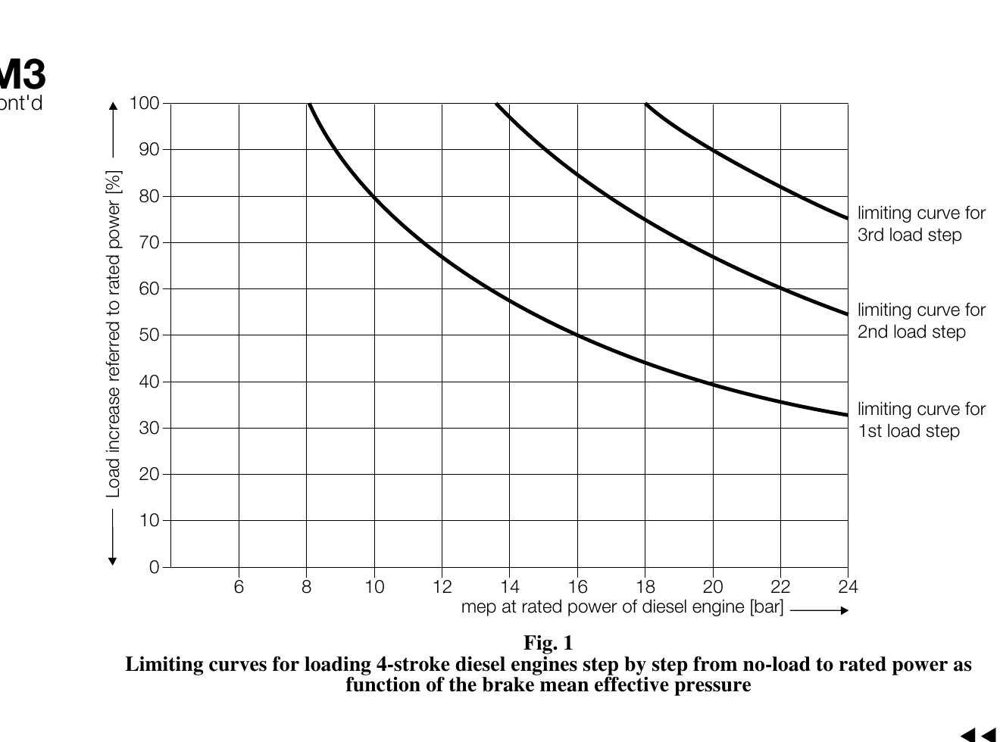

# M3–M4

## M3 cont'd

Fig. 1
**Limiting curves for loading 4-stroke diesel engines step by step from no-load to rated power as
function of the brake mean effective pressure**

## M4 Deleted

Limits of flash point of oil fuel are covered by F35 as revised and should be referred to.
