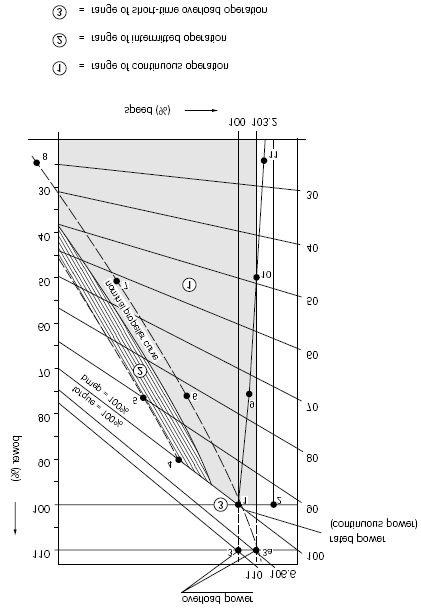

<!-- markdownlint-disable MD033 -->
# M71 Type Testing of I.C. Engines

(Feb 2015)
(Corr.1 June 2016)

## 1. General

1.1 Type approval of I.C. engine types consists of drawing approval, specification approval, conformity of production, approval of type testing programme, type testing of engines, review of the obtained results, and the issuance of the Type Approval Certificate. The maximum period of validity of a Type Approval Certificate is 5 years. The requirements for drawing approval and specification approval of engines and components are specified in separate URs.

1.2 For the purpose of this UR, the following definitions apply:

*Low-Speed Engines* means diesel engines having a rated speed of less than 300 rpm.

*Medium-Speed Engines* means diesel engines having a rated speed of 300 rpm and above, but less than 1400 rpm.

*High-Speed Engines* means diesel engines having a rated speed of 1400 rpm or above.

## 2. Objectives

2.1 The type testing, documented in this UR, is to be arranged to represent typical foreseen service load profiles, as specified by the engine builder, as well as to cover for required margins due to fatigue scatter and reasonably foreseen in-service deterioration.

2.2 This applies to:

- Parts subjected to high cycle fatigue (HCF) such as connecting rods, cams, rollers and spring tuned dampers where higher stresses may be provided by means of elevated injection pressure, cylinder maximum pressure, etc.

- Parts subjected to low cycle fatigue (LCF) such as "hot" parts when load profiles such as idle - full load - idle (with steep ramps) are frequently used.

- Operation of the engine at limits as defined by its specified alarm system, such as running at maximum permissible power with the lowest permissible oil pressure and/or highest permissible oil inlet temperature.

Notes:

1. The requirements of UR M71 are to be uniformly implemented by IACS Societies for engines for which the date of application for type approval certification is dated on or after 1 July 2016.

2. The "date of application for type approval" is the date of the document accepted by the Classification Society as request for type approval certification of a new engine type or of an engine type that has undergone substantive modifications in respect of the one previously type approved, or for renewal of an expired type approval certificate.

## 3. Validity

3.1 Type testing is required for every new engine type intended for installation onboard ships subject to classification.

3.2 A type test carried out for a particular type of engine at any place of manufacture will be accepted for all engines of the same type built by licensees or the licensor, subject to each place of manufacture being found to be acceptable to the Society.

3.3 A type of engine is defined by:

- bore and stroke

- injection method (direct or indirect)

- valve and injection operation (by cams or electronically controlled)

- kind of fuel (liquid, dual-fuel, gaseous)

- working cycle (4-stroke, 2-stroke)

- turbo-charging system (pulsating or constant pressure)

- the charging air cooling system (e.g. with or without intercooler)

- cylinder arrangement (in-line or V) 1)

- cylinder power, speed and cylinder pressures 2)

Notes:

1) One type test will be considered adequate to cover a range of different numbers of cylinders. However, a type test of an in-line engine may not always cover the V-version. Subject to the individual Societies' discretion, separate type tests may be required for the V-version. On the other hand, a type test of a V-engine covers the in-line engines, unless the bmep is higher.

Items such as axial crankshaft vibration, torsional vibration in camshaft drives, and crankshafts, etc. may vary considerably with the number of cylinders and may influence the choice of engine to be selected for type testing.

2) The engine is type approved up to the tested ratings and pressures (100% corresponding to MCR).

Provided documentary evidence of successful service experience with the classified rating of 100% is submitted, an increase (if design approved*) may be permitted without a new type test if the increase from the type tested engine is within:

- 5% of the maximum combustion pressure, or
- 5% of the mean effective pressure, or
- 5% of the rpm

Providing maximum power is not increased by more than 10%, an increase of maximum approved power may be permitted without a new type test provided engineering analysis and evidence of successful service experience in similar field applications (even if the application is not classified) or documentation of internal testing are submitted if the increase from the type tested engine is within:

- 10% of the maximum combustion pressure, or
- 10% of the mean effective pressure, or
- 10% of the rpm

\* Only crankshaft calculation and crankshaft drawings, if modified.

### De-rated engine

If an engine has been design approved, and internal testing per Stage A is documented to a rating higher than the one type tested, the Type Approval may be extended to the increased power/mep/rpm upon submission of an Extended Delivery Test Report at:

- Test at over speed (only if nominal speed has increased)
- Rated power, i.e. 100% output at 100% torque and 100% speed corresponding to load point 1., 2 measurements with one running hour in between
- Maximum permissible torque (normally 110%) at 100% speed corresponding to load point 3 or maximum permissible power (normally 110%) and speed according to nominal propeller curve corresponding to load point 3a., ½ hour
- 100% power at maximum permissible speed corresponding to load point 2, ½ hour

### Integration Test

An integration test demonstrating that the response of the complete mechanical, hydraulic and electronic system is as predicted maybe carried out for acceptance of sub-systems (Turbo Charger, Engine Control System, Dual Fuel, Exhaust Gas treatment…) separately approved. The scope of these tests shall be proposed by the designer/licensor taking into account of impact on engine.

## 4. Safety precautions

4.1 Before any test run is carried out, all relevant equipment for the safety of attending personnel is to be made available by the manufacturer/shipyard and is to be operational, and its correct functioning is to be verified.

4.2 This applies especially to crankcase explosive conditions protection, but also overspeed protection and any other shut down function.

4.3 The inspection for jacketing of high-pressure fuel oil lines and proper screening of pipe connections (as required in M71.8.9 fire measures) is also to be carried out before the test runs.

4.4 Interlock test of turning gear is to be performed when installed.

## 5. Test programme

5.1 The type testing is divided into 3 stages:

1. Stage A - internal tests.
    This includes some of the testing made during the engine development, function testing, and collection of measured parameters and records of testing hours. The results of testing required by the Society or stipulated by the designer are to be presented to the Society before starting stage B.

2. Stage B - witnessed tests.
    This is the testing made in the presence of Classification Society personnel.

3. Stage C - component inspection.
    This is the inspection of engine parts to the extent as required by the Society.

5.2 The complete type testing program is subject to approval by the Society. The extent the Surveyor's attendance is to be agreed in each case, but at least during stage B and C.

5.3 Testing prior to the witnessed type testing (stage B and C), is also considered as a part of the complete type testing program.

5.4 Upon completion of complete type testing (stage A through C), a type test report is to be submitted to the Society for review. The type test report is to contain:

- overall description of tests performed during stage A. Records are to be kept by the builders QA management for presentation to the Classification Society.

- detailed description of the load and functional tests conducted during stage B.

- inspection results from stage C.

5.5 As required in M71.2 the type testing is to substantiate the capability of the design and its suitability for the intended operation. Special testing such as LCF and endurance testing will normally be conducted during stage A.

5.6 High speed engines for marine use are normally to be subjected to an endurance test of 100 hours at full load. Omission or simplification of the type test may be considered for the type approval of engines with long service experience from non-marine fields or for the extension of type approval of engines of a well-known type, in excess of the limits given in M71.3.

Propulsion engines for high speed vessels that may be used for frequent load changes from idle to full are normally to be tested with at least 500 cycles (idle - full load - idle) using the steepest load ramp that the control system (or operation manual if not automatically controlled) permits. The duration at each end is to be sufficient for reaching stable temperatures of the hot parts.

## 6. Measurements and recordings

6.1 During all testing the ambient conditions (air temperature, air pressure and humidity) are to be recorded.

6.2 As a minimum, the following engine data are to be measured and recorded:

- Engine r.p.m.

- Torque

- Maximum combustion pressure for each cylinder 1)

- Mean indicated pressure for each cylinder 1)

- Charging air pressure and temperature

- Exhaust gas temperature

- Fuel rack position or similar parameter related to engine load

- Turbocharger speed

- All engine parameters that are required for control and monitoring for the intended use (propulsion, auxiliary, emergency).

Notes:

1) For engines where the standard production cylinder heads are not designed for such measurements, a special cylinder head made for this purpose may be used. In such a case, the measurements may be carried out as part of Stage A and are to be properly documented. Where deemed necessary e.g. for dual fuel engines, the measurement of maximum combustion pressure and mean indicated pressure may be carried out by indirect means, provided the reliability of the method is documented.

Calibration records for the instrumentation used to collect data as listed above are to be presented to - and reviewed by the attending Surveyor.

Additional measurements may be required in connection with the design assessment.

## 7. Stage A - internal tests

7.1 During the internal tests, the engine is to be operated at the load points important for the engine designer and the pertaining operating values are to be recorded. The load conditions to be tested are also to include the testing specified in the applicable type approval programme.

7.2 At least the following conditions are to be tested:

- Normal case:

    The load points 25%, 50%, 75%, 100% and 110% of the maximum rated power for continuous operation, to be made along the normal (theoretical) propeller curve and at constant speed for propulsion engines (if applicable mode of operation i.e. driving controllable pitch propellers), and at constant speed for engines intended for generator sets including a test at no load and rated speed.

- The limit points of the permissible operating range. These limit points are to be defined by the engine manufacturer.

- For high speed engines, the 100 hr full load test and the low cycle fatigue test apply as required in connection with the design assessment.

- Specific tests of parts of the engine, required by the Society or stipulated by the designer.

## 8. Stage B - witnessed tests

8.1 The tests listed below are to be carried out in the presence of a Surveyor. The achieved results are to be recorded and signed by the attending Surveyor after the type test is completed.

8.2 The over-speed test is to be carried out and is to demonstrate that the engine is not damaged by an actual engine overspeed within the overspeed shutdown system set-point. This test may be carried out at the manufacturer's choice either with or without load during the speed overshoot.

8.3 Load points

The engine is to be operated according to the power and speed diagram (see Figure 1). The data to be measured and recorded when testing the engine at the various load points have to include all engine parameters listed in M71.6. The operating time per load point depends on the engine size (achievement of steady state condition) and on the time for collection of the operating values. Normally, an operating time of 0.5 hour can be assumed per load point, however sufficient time should be allowed for visual inspection by the Surveyor.

8.4 The load points are:

- Rated power (MCR), i.e. 100% output at 100% torque and 100% speed corresponding to load point 1, normally for 2 hours with data collection with an interval of 1 hour. If operation of the engine at limits as defined by its specified alarm system (e.g. at alarm levels of lub oil pressure and inlet temperature) is required, the test should be made here.

- 100% power at maximum permissible speed corresponding to load point 2.

- Maximum permissible torque (at least and normally 110%) at 100% speed corresponding to load at point 3, or maximum permissible power (at least and normally 110%) and 103.2% speed according to the nominal propeller curve corresponding to load point 3a. Load point 3a applies to engines only driving fixed pitch propellers or water jets. Load point 3 applies to all other purposes.
    Load point 3 (or 3a as applicable) is to be replaced with a load that corresponds to the specified overload and duration approved for intermittent use. This applies where such overload rating exceeds 110% of MCR. Where the approved intermittent overload rating is less than 110% of MCR, subject overload rating has to replace the load point at 100% of MCR. In such case the load point at 110% of MCR remains.

- Minimum permissible speed at 100% torque, corresponding to load point 4.

- Minimum permissible speed at 90% torque corresponding to load point 5. (Applicable to propulsion engines only).

- Part loads e.g. 75%, 50% and 25% of rated power and speed according to nominal propeller curve (i.e. 90.8%, 79.3% and 62.9% speed) corresponding to points 6, 7 and 8 or at constant rated speed setting corresponding to points 9, 10 and 11, depending on the intended application of the engine.

- Crosshead engines not restricted for use with C.P. propellers are to be tested with no load at the associated maximum permissible engine speed.

8.5 During all these load points, engine parameters are to be within the specified and approved values.

Figure 1 Load points

① = range of continuous operation

② = range of intermitted operation

③ = range of short-time overload operation

8.6 Operation with damaged turbocharger

For 2-stroke propulsion engines, the achievable continuous output is to be determined in the case of turbocharger damage.

Engines intended for single propulsion with a fixed pitch propeller are to be able to run continuously at a speed (r.p.m.) of 40% of full speed along the theoretical propeller curve when one turbocharger is out of operation. (The test can be performed by either by-passing the turbocharger, fixing the turbocharger rotor shaft or removing the rotor.)

8.7 Functional tests

- Verification of the lowest specified propulsion engine speed according to the nominal propeller curve as specified by the engine designer (even though it works on a water-brake). During this operation, no alarm shall occur.

- Starting tests, for non-reversible engines and/or starting and reversing tests, for reversible engines, for the purpose of determining the minimum air pressure and the consumption for a start.

- Governor tests: tests for compliance with UR M3.1 and M3.2 are to be carried out.

8.8 Integration test

For electronically controlled diesel engines, integration tests are to verify that the response of the complete mechanical, hydraulic and electronic system is as predicted for all intended operational modes. The scope of these tests is to be agreed with the Society for selected cases based on the FMEA required in UR M44.

8.9 Fire protection measures

Verification of compliance with requirements for jacketing of high-pressure fuel oil lines, screening of pipe connections in piping containing flammable liquids and insulation of hot surfaces:

- The engine is to be inspected for jacketing of high-pressure fuel oil lines, including the system for the detection of leakage, and proper screening of pipe connections in piping containing flammable liquids.

- Proper insulation of hot surfaces is to be verified while running the engine at 100% load, alternatively at the overload approved for intermittent use. Readings of surface temperatures are to be done by use of Infrared Thermoscanning Equipment. Equivalent measurement equipment may be used when so approved by the Society. Readings obtained are to be randomly verified by use of contact thermometers.

## 9. Stage C - Opening up for Inspections

9.1 The crankshaft deflections are to be measured in the specified (by designer) condition (except for engines where no specification exists).

9.2 High speed engines for marine use are normally to be stripped down for a complete inspection after the type test.

9.3 For all the other engines, after the test run the components of one cylinder for in-line engines and two cylinders for V-engines are to be presented for inspection as follows (engines with long service experience from non-marine fields can have a reduced extent of opening):

- piston removed and dismantled

- crosshead bearing dismantled

- guide planes

- connecting rod bearings (big and small end) dismantled (special attention to serrations and fretting on contact surfaces with the bearing backsides)

- main bearing dismantled

- cylinder liner in the installed condition

- cylinder head, valves disassembled

- cam drive gear or chain, camshaft and crankcase with opened covers. (The engine must be turnable by turning gear for this inspection.)

9.4 For V-engines, the cylinder units are to be selected from both cylinder banks and different crank throws.

9.5 If deemed necessary by the surveyor, further dismantling of the engine may be required.

End of Document
