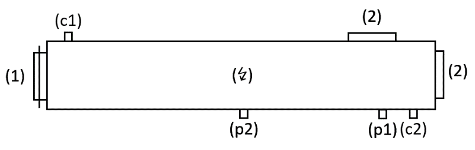
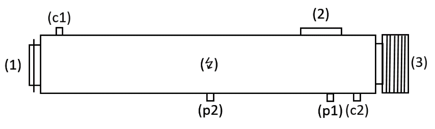
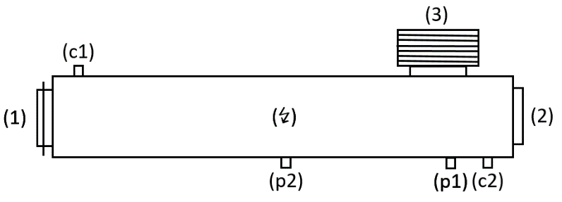

# M82 Type Testing Procedure of Explosion Relief Devices for Combustion Air Inlet and Exhaust Gas Manifolds of I.C. Engines Using Gas as Fuel

M82 (Mar 2023)

## 1 Scope

To specify testing procedure for explosion relief devices for combustion air inlet manifold and exhaust gas manifold of internal combustion engines using gas as fuel.

## 2 Definitions

Definitions addressing gas as fuel as given in the UR M78, Safety of Internal Combustion Engines Supplied with Low Pressure Gas, apply.

Explosion relief device (ERD) means a device to protect a component against a determined overpressure in the event of a gas explosion. The device is fitted with a flame arrester and may be a valve, a rupture disc or other, as applicable.

Note:

1. I.C. Engines using gas as fuel are to be fitted with components and arrangements complying with this UR when:

    i) an application for certification of an engine is dated on or after 1 July 2024; or

    ii) installed in new ships for which the date of contract for construction is on or after 1 July 2024.

2. The "contracted for construction" date means the date on which the contract to build the vessel is signed between the prospective owner and the shipbuilder. For further details regarding the date of "contract for construction", refer to IACS Procedural Requirement (PR) No. 29.

## 3 Documents

Prior to testing, the following documentation for the ERD shall be submitted for approval:

- drawings (sectional drawings, details, assembly etc.)
- specification data sheet including operating conditions and design limits such as:
  - maximum permissible operating pressure, resulting from maximum charging air or exhaust gas back pressure
  - maximum permissible operating temperature, resulting from maximum charging air or exhaust gas temperature
  - static opening pressure, resulting from maximum charging air or exhaust gas back pressure
  - maximum explosion pressure, i.e. maximum pressure that the device can withstand
  - geometric relief area
- product marking
- installation and operation manual
- test program
- specification of test vessel

## 4 Tests

### 4.1 Test specimens

The ERD used for the explosion test is to be selected from the manufacturer's production line by a representative of the Society:

- as a finished certified component itself, or
- on samples taken from earlier stages in the production of the component, when applicable.

If necessary, an additional ERD may need to be selected for the demonstration of the opening pressure. The selected ERD has to be clearly marked.

If applicable, the selected ERD shall be representative for the type range and operating conditions, for example:

- kind of ERD (valve, rupture disc, etc.),
- mounting orientation (vertical, horizontal)
- design of ERD (e.g., spring design, sealing)
- design of flame arrester
- ERD intended to be fitted to the air inlet or exhaust gas manifold of an engine having a turbocharger with characteristics as per the testing conditions in 4.3.2.

The selection of the representative ERD is subject to approval by the Society.

### 4.2 Demonstration of opening pressure

The ERD which has been selected is to be subjected to a pressure test at the manufacturer's works to demonstrate that the static opening pressure is kept within the manufacturer's specification and that the ERD is air tight at the maximum permissible operating pressure for at least 30 seconds.

### 4.3 Explosion test

#### 4.3.1 Test facility

The test facilities are to be accredited to a national or international standard, e.g. ISO/IEC 17025:2017, and are to be acceptable to the Society.

The test facilities are to be equipped so that they can perform and record explosion testing in accordance with this procedure.

The test facilities are to have equipment for controlling and measuring a methane gas concentration within a test vessel to an accuracy of ± 0.1%.

The test facilities are to be capable of effective point-located ignition of a methane/air mixture.

The test facility arrangements are to be capable of measuring and recording the pressure changes throughout an explosion test at a frequency recognizing the speed of the events during an explosion (10 kHz or above).

The explosion test (Para 4.3.5) is to be documented by high speed (250 frames/s or above) video recording. The video recording shall be provided with a time stamp.

#### 4.3.2 Test vessel

The test vessel is a simplified model of the air inlet or exhaust gas manifold. The free area of the connected turbo charger (compressor or turbine wheel) is to be considered.

The test vessel shall comply with the following requirements:

- The shape of the test vessel is to correspond to a pipe with L/D ≥ 10.
- The test vessel is to be equipped with a rupture disc at one front end to simulate the turbo charger. The relief area of the rupture disc shall be in relationship to the test vessel diameter based on turbocharger manufacturer data for an equivalent free area of compressor or turbine wheel. The opening pressure shall be ± 10% of the static opening pressure of the ERD.
- The volume of the test vessel is to comply with the specific relief area of the ERD of 700 cm²/m³ ± 15%.
- The test vessel is to be provided with all necessary flanges and connection to mount the ERD in the intended position, to mount a rupture disc as turbo charger simulation, to connect the Methane-air mixture supply and the measurement equipment.
- The ignition is to be made at the middle of the test vessel.
- The test vessel is to be designed to verify a homogeneous air / methane mixture inside the vessel.
- The test vessel is to have connections for measuring the pressure in the test vessel in at least two positions, one at the ERD and the other at the test vessel center.
- The test vessel is to have a design pressure of not less than the maximum explosion pressure of a stoichiometric air / methane mixture at test conditions in Para 4.3.6.
- The test vessel configuration is subject to approval by the Society.

Typical test vessel configurations:

All test vessel configurations to be equipped with a rupture disc (1) (turbo charger simulation) at one front end. The ignition is in the centre of the test vessel (↯). The pressure sensors are mounted at the valve flanges (p1) and at the test vessel centre (p2). The measuring of the methane concentration to verify a homogeneous air / methane mixture can be performed at both ends of the test vessel, e.g. (c1) and (c2).

Figure 1 Configuration without ERD (flanges for ERDs closed (2))

Figure 2 Configuration with ERD (3) mounted at the front end of the test vessel

Figure 3 Configuration with ERD (3) mounted on top of the test vessel

#### 4.3.3 Explosion test process

The explosion testing is to be performed in two stages according to 4.3.4 and 4.3.5 for each ERD that is required to be approved as type tested.

The explosion testing is to be witnessed by a Society surveyor.

Calibration records for the instrumentation used to collect data are to be presented to, and reviewed by, the attending surveyor.

#### 4.3.4 Reference test – Explosion test without ERD

Two explosion tests are to be carried out in the test vessel without ERD. The test vessel configuration is shown in Figure 1.

The aim of this test is to establish a reference pressure level in the test vessel which can be used for determination of the capability of a relief valve in terms of pressure relief.

#### 4.3.5 ERD test – Explosion test with ERD

Two explosion tests are to be carried out in the test vessel with the same ERD at the required position. If the ERD is a rupture disc with flame arrester, the rupture disc shall be replaced.

If shielding arrangements to deflect the emission of explosion combustion products at the ERD are intended, the ERD are to be tested with the shielding arrangements fitted.
The test vessel configuration is shown in Figure 2 or 3.

#### 4.3.6 Explosion test method

The test conditions shall comply with the intended use of the ERD, such as:

- pipe diameter
- operating pressure
- operating temperature
- installation orientation.

All explosion tests are to be carried out using an air and methane mixture with a volumetric methane concentration of 9.5% ± 0.5%. A homogeneous air / methane mixture inside the test vessel is to be verified. The concentration of methane shall not differ by more than 0.5%.

The initial pressure in the test vessel is to be the specified maximum operating pressure of the ERD.

The initial temperature in the test vessel is to be the specified maximum operating temperature of the ERD.

If the initial pressure and/or initial temperature deviate from the design limits, the ERD manufacturer shall prove the acceptability of this deviation either using standards or generally applicable calculation methods.

The ignition is to be made using an explosive charge of 50 - 100 Joule.

Successive explosion testing to establish an ERD functionality is to be carried out as quickly as possible during stable weather conditions.

The pressure rise and decay during all explosion testing is to be recorded.

The effect of an ERD in terms of pressure relief following an explosion is ascertained from maximum pressure recorded at the centre of the test vessel during the two stages. The pressure relief within the test vessel due to the installation of an ERD is the difference between average pressure of the two explosions of the reference test (4.3.4) and the average of the two explosions of the ERD test (4.3.5).

For acceptance of correct functioning of the flame arrester, there is to be no indication of flame or combustion outside of the ERD during its testing (4.3.5). This is to be monitored by a high-speed video camera (4.3.1), for which ambient light conditions are to be considered to maximise the potential for flame/combustion detection. The use of a dark, ideally matt finish, background and an avoidance of direct light onto the video camera monitored area are recommended.

After each ERD test (4.3.5), the external condition of the flame arrester to be examined for signs of damage and/or deformation that may affect the operation of the ERD.

### 4.4 Check of ERD components

After completing the explosion tests, the ERDs are to be dismantled and the condition of all components are to be ascertained and documented.

## 5 Test report

A complete test report has to be submitted to the Society for

- the demonstration of opening pressure (4.2) and
- the explosion test (4.3).

The reports shall include respective information according to the requirements in 4, as applicable:

- test specimens
- test facility, including measuring equipment and test vessel
- measuring results (pressures, temperatures, flame velocities, volumetric methane concentration, ambient conditions etc.)
- video documentation of explosion tests
- photo documentation of ERD components

## 6 Assessment

To verify compliance with this requirement the assessment has to address the following:

- Function and mechanical integrity of the ERD.
  - After dismantling of the ERD, the flame arrester shall not show signs of damage or any deformation that may affect the operation of the ERD.
  - If a valve is used any indication of valve sticking or uneven opening during the explosion that may affect subsequent operation of the valve has to be considered.
  - The mechanical integrity of the ERD is proven up to a maximum explosion pressure (as average of the two explosions) of the ERD tests in 4.3.5.
- The functioning of the flame arresters is considered satisfactory if there is no indication of flame or combustion outside the ERD during the explosion tests.

## 7 Approval

The approval of an ERD is at the discretion of individual classification societies based on the appraisal of plans and particulars and the test report of type testing.

The type approval is valid only for an ERD fitted to the air inlet or exhaust gas manifold of an engine having a turbocharger with compressor or turbine wheel characteristics corresponding to those required in 4.3.2 for the test vessel rupture disc in terms of free area.

End of Document
