<!-- markdownlint-disable MD033 -->
<!-- markdownlint-disable MD056 -->
# S11A Longitudinal Strength Standard for Container Ships

(June 2015)

## S11A.1 General

### S11A.1.1 Application

S11A.1.1.1 Application

This UR applies to the following types of steel ships with a length L of 90 m and greater and operated in unrestricted service:

1. Container ships
2. Ships dedicated primarily to carry their load in containers.

S11A.1.1.2 Load limitations

The wave induced load requirements apply to monohull displacement ships in unrestricted service and are limited to ships meeting the following criteria:

| | | |
|---|---|---|
| (i) | Length | 90 m ≤ L ≤ 500 m |
| (ii) | Proportion | 5 ≤ L/B ≤ 9;    2 ≤ B/T ≤ 6 |
| (iii) | Block coefficient at scantling draught | 0.55 ≤ CB ≤ 0.9 |

For ships that do not meet all of the aforementioned criteria, special considerations such as direct calculations of wave induced loads may be required by the Classification Society.

S11A.1.1.3 Longitudinal extent of strength assessment

The stiffness, yield strength, buckling strength and hull girder ultimate strength assessment are to be carried out in way of 0.2L to 0.75L with due consideration given to locations where there are significant changes in hull cross section, e.g. changing of framing system and the fore and aft end of the forward bridge block in case of two-island designs.

In addition, strength assessments are to be carried out outside this area. As a minimum assessments are to be carried out at forward end of the foremost cargo hold and the aft end of the aft most cargo hold. Evaluation criteria used for these assessments are determined by the Classification Society.

Note:

1. This UR is to be uniformly implemented by IACS Societies for ships contracted for construction on or after 1 July 2016.

2. The "contracted for construction" date means the date on which the contract to build the vessel is signed between the prospective owner and the shipbuilder. For further details regarding the date of "contract for construction", refer to IACS Procedural Requirement (PR) No. 29.

### S11A.1.2 Symbols and definitions

S11A.1.2.1 Symbols

| | |
|---|---|
| L | Rule length, in m, as defined in UR S2 |
| B | Moulded breadth, in m |
| C | Wave parameter, see 2.3.1 |
| T | Scantling draught in m |
| CB | Block coefficient at scantling draught |
| Cw | Waterplane coefficient at scantling draught, to be taken as: |

$$C_w = \frac{A_w}{L B_s}$$

| | |
|---|---|
| Aw | Waterplane area at scantling draught, in m2 |
| ReH | Specified minimum yield stress of the material, in N/mm2 |
| k | Material factor as defined in UR S4 for higher tensile steels, k=1.0 for mild steel having a minimum yield strength equal to 235 N/mm2 |
| E | Young's modulus in N/mm2 to be taken as E = 2.06·105 N/mm2 |
| MS | Vertical still water bending moment in seagoing condition, in kNm, at the cross section under consideration |
| MSmax, MSmin | Permissible maximum and minimum vertical still water bending moments in seagoing condition, in kNm, at the cross section under consideration, see 2.2.2 |
| MW | Vertical wave induced bending moment, in kNm, at the cross section under consideration |
| FS | Vertical still water shear force in seagoing condition, in kN, at the cross section under consideration |
| FSmax, FSmin | Permissible maximum and minimum vertical still water shear forces in seagoing condition, in kN, at the cross section under consideration, see 2.2.2 |
| FW | Vertical wave induced shear force, in kN, at the cross section under consideration |
| qv | Shear flow along the cross section under consideration, to be determined according to Annex 1 |
| fNL-Hog | Non-linear correction factor for hogging, see 2.3.2 |
| fNL-Sag | Non-linear correction factor for sagging, see 2.3.2 |
| fT | Factor related to the operational profile, see 2.3.2 |
| fnet | Net thickness, in mm, see 1.3.1 |
| fset | Reserve thickness, to be taken as 0.5mm |
| fref | Net vertical hull girder moment of inertia at the cross section under consideration, to be determined using net scantlings as defined in 1.3, in m4 |
| (F,w) | Hull girder bending stress, in N/mm2, as defined in 2.5 |
| z, Zn | Hull girder shear stress, in N/mm2, as defined in 2.5 |
| x | Longitudinal co-ordinate of a location under consideration, in m |
| Z | Vertical co-ordinate of a location under consideration, in m |
| Zn | Distance from the baseline to the horizontal neutral axis, in m |

S11A.1.2.2 Fore end and aft end

The fore end (FE) of the rule length L, see Figure 1, is the perpendicular to the scantling draught waterline at the forward side of the stem.

The aft end (AE) of the rule length L, see Figure 1, is the perpendicular to the scantling draught waterline at a distance L aft of the fore end (FE).

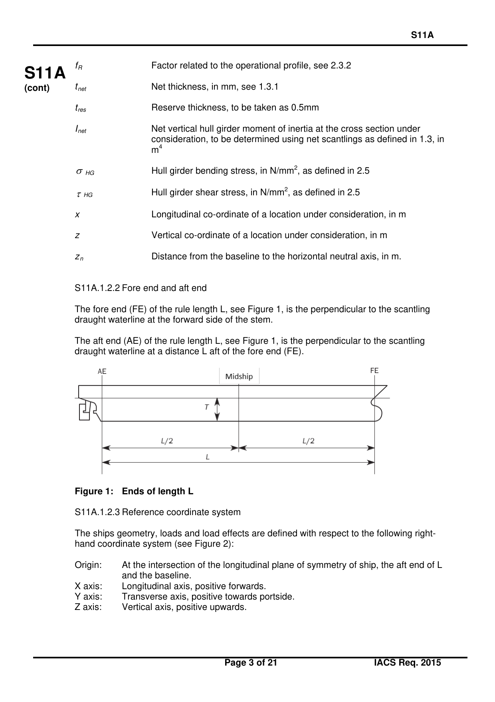

Figure 1: Ends of length L

S11A.1.2.3 Reference coordinate system

The ships geometry, loads and load effects are defined with respect to the following right-hand coordinate system (see Figure 2):

| | |
|---|---|
| Origin: | At the intersection of the longitudinal plane of symmetry of ship, the aft end of L and the baseline. |
| X axis: | Longitudinal axis, positive forwards. |
| Y axis: | Transverse axis, positive towards portside. |
| Z axis: | Vertical axis, positive upwards. |

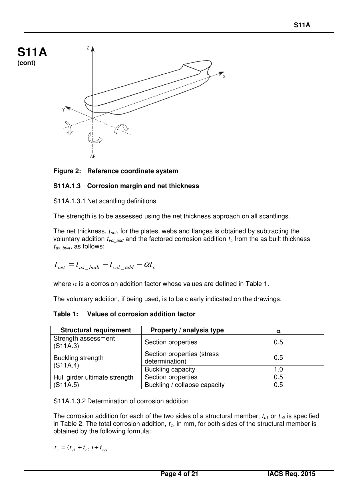

Figure 2: Reference coordinate system

S11A.1.3 Net thickness approach

S11A.1.3.1 Net thickness approach

The strength is to be assessed using the net thickness approach on all scantlings.

The net thickness, tnet, for the plates, webs and flanges is obtained by subtracting the voluntary addition tvol_add and the factored corrosion addition tc, from the as built thickness tas_built, as follows:

$$t_{net} = t_{as\_built} - t_{vol\_add} - \alpha t_c$$

where α is a corrosion addition factor whose values are defined in Table 1.

The voluntary addition, if being used, is to be clearly indicated on the drawings.

Table 1: Values of corrosion addition factor α

| Structural requirement | Property / analysis type | α |
|---|---|---|
| Strength assessment (S11A.3) | Section properties | 0.5 |
| Buckling strength (S11A.4) | Section properties (stress analysis) | 0.5 |
| | Buckling capacity | 1.0 |
| Hull girder ultimate strength (S11A.5) | Section properties | 0.5 |
| | Buckling / collapse capacity | 1.0 |

S11A.1.3.2 Determination of corrosion addition

The corrosion addition for each of the two sides of a structural member, tc1 or tc2 is specified in Table 2. The total corrosion addition, tc, in mm, for both sides of the structural member is obtained by the following formula:

$$t_c = (t_{c1} + t_{c2}) + t_{res}$$

For an internal member within a given compartment, the total corrosion addition, tc, is obtained from the following formula:

$$t_c = (2t_{c1}) + t_{res}$$

Table 2: Corrosion addition for one side of a structural member

| Compartment type | One side corrosion addition tc1 or tc2 [mm] |
|---|---|
| Sea water | 1.0 |
| Exposed to atmosphere | 1.0 |
| Fuel and lube oil tank | 0.5 |
| Fresh water, fuel oil and lube oil tank | 0.5 |
| Accommodation spaces | 0.0 |
| Container holds | 1.0 |
| Compartment types not mentioned above | 0.5 |

S11A.1.3.3 Determination of net section properties

The net section modulus, moment of inertia and other area properties of a supporting member are to be calculated using the net dimensions of the attached plate, web and flange, as defined in Figure 3. The cross-sectional area, the moment of inertia about the axis parallel to the attached plate and the associated neutral axis position are to be determined through applying a corrosion magnitude of 0.5 αtc, deducted from the surface of the profile cross-section.

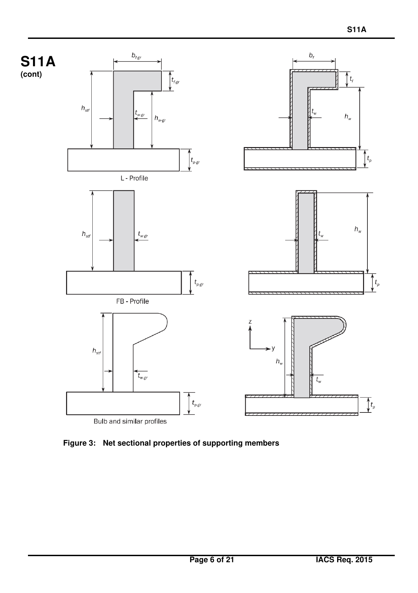

Figure 3: Net sectional properties of supporting members

## S11A.2 Loads

### S11A.2.1 Sign convention for hull girder loads

The sign conventions of vertical bending moments and vertical shear forces at any ship transverse section are as shown in Figure 4, namely:

- The vertical bending moments MS and MW are positive when they induce tensile stresses in the strength deck (hogging bending moment) and negative when they induce tensile stresses in the bottom (sagging bending moment).

- The vertical shear forces FS, FW are positive in the case of downward resulting forces acting aft of the transverse section and upward resulting forces acting forward of the transverse section under consideration. The shear forces in the directions opposite to above are negative.

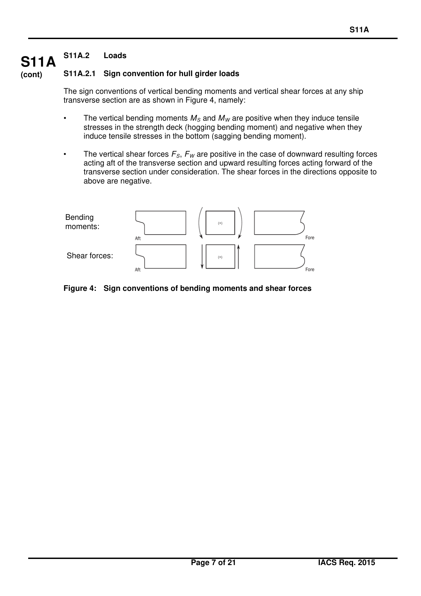

Figure 4: Sign conventions of bending moments and shear forces

### S11A.2.2 Still water bending moments and shear forces

S11A.2.2.1 General

Still water bending moments, MS in kNm, and still water shear forces, FS in kN, are to be calculated at each section along the ship length for design loading conditions as specified in 2.2.2.

S11A.2.2.2 Design loading conditions

In general, the design cargo and ballast loading conditions, based on amount of bunker, fresh water and stores at departure and arrival, are to be considered for the MS and FS calculations. Where the amount and disposition of consumables at any intermediate stage of the voyage are considered more severe, calculations for such intermediate conditions are to be submitted in addition to those for departure and arrival conditions. Also, where any ballasting and/or deballasting is intended during voyage, calculations of the intermediate condition just before and just after ballasting and/or de-ballasting are to be submitted and where approved included in the loading manual for guidance.

The permissible vertical still water bending moment, MSmax and MSmin, and the permissible vertical still water shear force, FSmax and FSmin, in seagoing conditions at any longitudinal position are to envelop:

- The maximum and minimum still water bending moments and shear forces for the seagoing loading conditions defined in the Loading Manual;

- The maximum and minimum still water bending moments and shear forces specified by the designer

The Loading Manual should include the relevant loading conditions, which envelop the still water hull girder loads for seagoing conditions, including those specified in UR S1 Annex 1.

### S11A.2.3 Wave loads

S11A.2.3.1 Wave parameter

The wave parameter is defined as follows:

$$C = 10.75 - \left(\frac{300-L}{100}\right)^{1.5} \quad \text{for } L \leq L_{ref}$$

$$C = 10.75 - 0.45 \left(\frac{L-L_{ref}}{100}\right)^{1.5} \quad \text{for } L > L_{ref}$$

where:

Lref: Reference length, in m, taken as:

Lref = 315Cw-1.3 for the determination of vertical wave bending moments according to 2.3.2

Lref = 330Cw-1.3 for the determination of vertical wave shear forces according to 2.3.3

S11A.2.3.2 Vertical wave bending moments

The distribution of the vertical wave bending moments, MW in kNm, along the ship length is given in Figure 6, where:

$$M_{W-Hog} = +1.5 f_R L^2 C C_W \left(\frac{B}{L}\right)^{0.8} f_{NL-Hog}$$

$$M_{W-Sag} = -1.5 f_R L^2 C C_W \left(\frac{B}{L}\right)^{0.8} f_{NL-Sag}$$

where:

fR: Factor related to the operational profile, to be taken as:

fR = 0.85

fNL-Hog: Non-linear correction for hogging, to be taken as:

$$f_{NL-Hog} = \max\left(\frac{1+0.2 f_{Bow}}{C_w}, 1.0\right), \text{not to be taken less than 1.1}$$

fNL-Sag: Non-linear correction for sagging, to be taken as:

$$f_{NL-Sag} = 4 \frac{1+0.2 f_{Bow}}{C_W \sqrt{L} + 0.7}, \text{not to be taken less than 1.0}$$

fBow: Bow flare shape coefficient, to be taken as:

$$f_{Bow} = \frac{A_{DK} - A_{WL}}{0.2 L z_f}$$

ADK: Projected area in horizontal plane of uppermost deck, in m2 including the forecastle deck, if any, extending from 0.8L forward (see Figure 5). Any other structures, e.g. plated bulwark, are to be excluded.

AWL: Waterplane area, in m2, at draught T, extending from 0.8L forward

zf: Vertical distance, in m, from the waterline at draught T to the uppermost deck (or forecastle deck), measured at FE (see Figure 5). Any other structures, e.g. plated bulwark, are to be excluded.

Figure 5:   Projected area ADK and vertical distance zf

Figure 6:   Distribution of vertical wave bending moment MW along the ship length

S11A.2.3.3 Vertical wave shear force

The distribution of the vertical wave induced shear forces, FW in kN, along the ship length is given in Figure 7, where,

$$F_{W\,Hog}^{Aft} = +5.2 f_R L^2 C C_W \left(\frac{B}{L}\right)^{0.8} (0.3 + 0.7 f_{NL-Hog})$$

$$F_{W\,Hog}^{Fore} = -5.7 f_R L^2 C C_W \left(\frac{B}{L}\right)^{0.8} f_{NL-Hog}$$

$$F_{W\,Sag}^{Aft} = -5.2 f_R L^2 C C_W \left(\frac{B}{L}\right)^{0.8} (0.3 + 0.7 f_{NL-Sag})$$

$$F_{W\,Sag}^{Fore} = +5.7 f_R L^2 C C_W \left(\frac{B}{L}\right)^{0.8} (0.25 + 0.75 f_{NL-Sag})$$

$$F_{W}^{Mid} = +4.0 f_R L^2 C C_W \left(\frac{B}{L}\right)^{0.8}$$

Figure 7:   Distribution of vertical wave shear force FW along the ship length

### S11A.2.4 Load cases

For the strength assessment, the maximum hogging and sagging load cases given in Table 3 are to be checked. For each load case the still water condition at each section as defined in 2.2 is to be combined with the wave condition as defined in 2.3, refer also to Figure 8.

Table 3: Combination of still water and wave bending moments and shear forces

| Load case | Bending moment | | Shear force | |
|---|---|---|---|---|
| | MS | MW | FS | FW |
| Hogging | MSmax | MWH | FSmax for x ≤ 0.5L FSmin  for x > 0.5L | FWmax for x ≤ 0.5L FWmin  for x > 0.5L |
| Sagging | MSmin | MWS | FSmin  for x ≤ 0.5L FSmax for x > 0.5L | FWmin  for x ≤ 0.5L FWmax for x > 0.5L |

MWH: Wave bending moment in hogging at the cross section under consideration, to be taken as the positive value of MW as defined in Figure 6.

MWS: Wave bending moment in sagging at the cross section under consideration, to be taken as the negative value of MW as defined Figure 6.

FWmax: Maximum value of the wave shear force at the cross section under consideration, to be taken as the positive value of FW as defined Figure 7.

FWmin: Minimum value of the wave shear force at the cross section under consideration, to be taken as the negative value of FW as defined Figure 7.

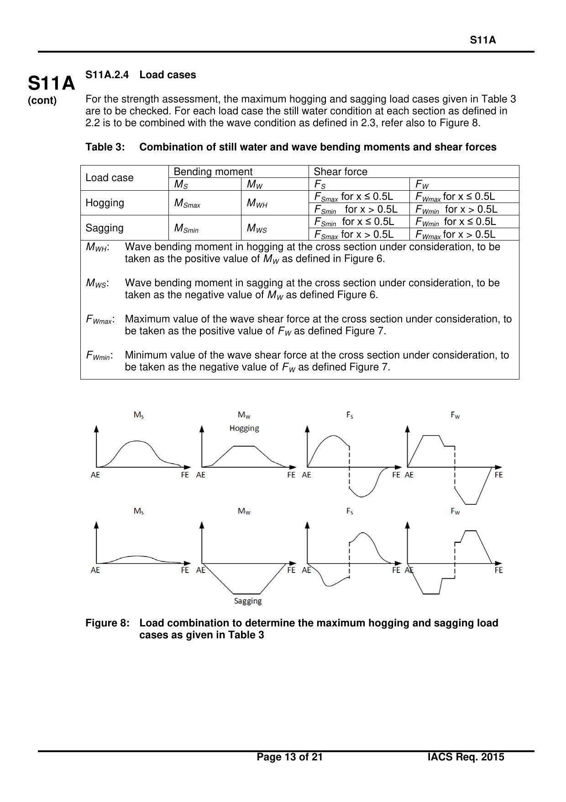

Figure 8:   Load combination to determine the maximum hogging and sagging load cases as given in Table 3

### S11A.2.5 Hull girder stress

The hull girder stresses in N/mm2 are to be determined at the load calculation point under consideration, for the "hogging" and "sagging" load cases defined in 2.4 as follows:

Bending stress:

$$\sigma_{HG} = \frac{\gamma_s M_s + \gamma_W M_W}{I_{net}} (Z - Z_n) 10^{-3}$$

Shear stress:

$$\tau_{HG} = \frac{\gamma_s F_s + \gamma_W F_W}{t_{net}/q_v} 10^{3}$$

where:

γs, γW : Partial safety factors, to be taken as:

γs = 1.0

γW = 1.0

## S11A.3 Strength Assessment

### S11A.3.1 General

Continuity of structure is to be maintained throughout the length of the ship. Where significant changes in structural arrangement occur adequate transitional structure is to be provided.

### S11A.3.2 Stiffness criterion

The two load cases "hogging" and "sagging" as listed in 2.4 are to be checked.

The net moment of inertia, in m4, is not to be less than:

$$I_{net} \geq 1.55 L |M_s + M_W| 10^{-7}$$

### S11A.3.3 Yield strength assessment

S11A.3.3.1 General acceptance criteria

The yield strength assessment is to check, for each of the load cases "hogging" and "sagging" as defined in 2.4, that the equivalent hull girder stress σeq, in N/mm2, is less than the permissible stress σperm, in N/mm2, as follows:

$$\sigma_{eq} < \sigma_{perm}$$

where:

$$\sigma_{eq} = \sqrt{\sigma_x^2 + 3\tau^2}$$

$$\sigma_{perm} = \frac{R_{eH}}{\gamma_1 \gamma_2}$$

γ1 : Partial safety factor for material, to be taken as: $\gamma_1 = k \frac{R_{eH}}{235}$

γ2 : Partial safety factor for load combinations and permissible stress, to be taken as:

- γ2 = 1.24, for bending strength assessment according to 3.3.2.

- γ2 = 1.13, for shear stress assessment according to 3.3.3.

S11A.3.3.2 Bending strength assessment

The assessment of the bending stresses is to be carried out according to 3.3.1 at the following locations of the cross section:

- At bottom

- At deck

- At top of hatch coaming

- At any point where there is a change of steel yield strength

The following combination of hull girder stress as defined in 2.5 is to be considered:

$$\sigma_x = \sigma_{HG}$$

$$\tau = 0$$

S11A.3.3.3 Shear strength assessment

The assessment of shear stress is to be carried out according to 3.3.1 for all structural elements that contribute to the shear strength capability.

The following combination of hull girder stress as defined in 2.5 is to be considered:

$$\sigma_x = 0$$

$$\tau = \tau_{HG}$$

## S11A.4 Buckling strength

### S11A.4.1 Application

These requirements apply to plate panels and longitudinal stiffeners subject to hull girder bending and shear stresses.

Definitions of symbols used in the present article S11A.4 are given in Annex 2 "Buckling Capacity".

### S11A.4.2 Buckling criteria

The acceptance criterion for the buckling assessment is defined as follows:

$$\eta_{act} \leq 1$$

where:

ηact : Maximum utilisation factor as defined in S11A 4.3.

### S11A.4.3 Buckling utilisation factor

The utilisation factor, ηact, is defined as the inverse of the stress multiplication factor at failure γc, see figure 9.

$$\eta_{act} = \frac{1}{\gamma_c}$$

Failure limit states are defined in:

- Annex 2, 2 for elementary plate panels,

- Annex 2, 3 for overall stiffened panels,

- Annex 2, 4 for longitudinal stiffeners.

Each failure limit state is defined by an equation, and γc is to be determined such that it satisfies the equation.

Figure 9 illustrates how the stress multiplication factor at failure γc, of a structural member is determined for any combination of longitudinal and shear stress. Where:

σx, τ : Applied stress combination for buckling given in S11A.4.4.1

σc, τc : Critical buckling stresses to be obtained according to Annex 2 for the stress combination for buckling σx and τ.

Figure 9:   Example of failure limit state curve and stress multiplication factor at failure

### S11A.4.4 Stress determination

S11A.4.4.1 Stress combinations for buckling assessment

The following two stress combinations are to be considered for each of the load cases "hogging" and "sagging" as defined in S11A.2.4. The stresses are to be derived at the load calculation points defined in S11A.4.4.2

a) Longitudinal stiffening arrangement:

Stress combination 1 with:

$$\sigma_x = \sigma_{HG}$$
$$\sigma_y = 0$$
$$\tau = 0.7 \tau_{HG}$$

Stress combination 2 with:

$$\sigma_x = 0.7 \sigma_{HG}$$
$$\sigma_y = 0$$
$$\tau = \tau_{HG}$$

b) Transverse stiffening arrangement:

Stress combination 1 with:

$$\sigma_x = 0$$
$$\sigma_y = \sigma_{HG}$$
$$\tau = 0.7 \tau_{HG}$$

Stress combination 2 with:

$$\sigma_x = 0$$
$$\sigma_y = 0.7 \sigma_{HG}$$
$$\tau = \tau_{HG}$$

S11A.4.4.2 Load calculation points

The hull girder stresses for elementary plate panels (EPP) are to be calculated at the load calculation points defined in Table 4.

Table 4: Load calculation points (LCP) coordinates for plate buckling assessment

| LCP coordinates | Hull girder bending stress | | Hull girder shear stress |
|---|---|---|---|
| | Non horizontal plating | Horizontal plating | |
| x coordinate | Mid-length of the EPP | | |
| y coordinate | Both upper and lower ends of the EPP (points A1 and A2 in Figure 10) | Outboard and inboard ends of the EPP (points A1 and A2 in Figure 10) | Mid-point of EPP (point B in Figure 10) |
| z coordinate | Corresponding to x and y values | | |

Figure 10: LCP for plate buckling – assessment, PSM stands for primary supporting members

The hull girder stresses for longitudinal stiffeners are to be calculated at the following load calculation point:

- at the mid length of the considered stiffener.

- at the intersection point between the stiffener and its attached plate.

## S11A.5 Hull girder ultimate strength

### S11A.5.1 General

The hull girder ultimate strength is to be assessed for ships with length L equal or greater than 150m.

The acceptance criteria, given in 5.4 are applicable to intact structure.

The hull girder ultimate bending capacity is to be checked for the load cases "hogging" and "sagging" as defined in 2.4.

### S11A.5.2 Hull girder ultimate bending moments

The vertical hull girder bending moment, M in hogging and sagging conditions, to be considered in the ultimate strength check is to be taken as:

$$M = \gamma_s M_s + \gamma_W M_W$$

where:

Ms = Permissible still water bending moment, in kNm, defined in 2.4

MW = Vertical wave bending moment, in kNm, defined in 2.4

γs = Partial safety factor for the still water bending moment, to be taken as: γs = 1.0

γW = Partial safety factor for the vertical wave bending moment, to be taken as: γW = 1.2

### S11A.5.3 Hull girder ultimate bending capacity

S11A.5.3.1 General

The hull girder ultimate bending moment capacity, MU, is to be defined as the maximum bending moment capacity of the hull girder beyond which the hull structure collapses.

S11A.5.3.2 Determination of hull girder ultimate bending moment capacity

The ultimate bending moment capacities of a hull girder transverse section, in hogging and sagging conditions, are defined as the maximum values of the curve of bending moment capacity M versus the curvature χ of the transverse section considered (MUH for hogging condition and MUS for sagging condition, see Figure 11). The curvature χ is positive for hogging condition and negative for sagging condition.

The hull girder ultimate bending moment capacity MU is to be calculated according to the incremental-iterative method described in Annex 3 or using an alternative method as indicated in 3 of Annex 3.

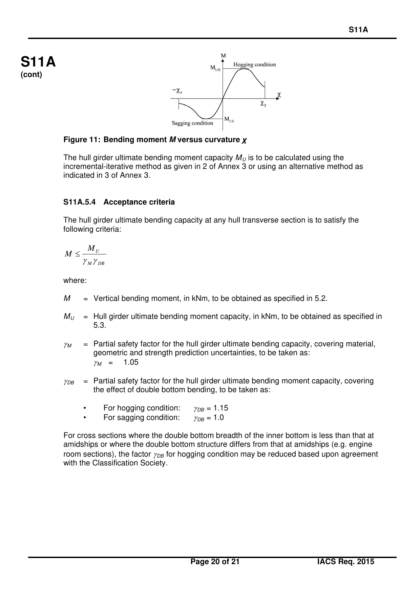

Figure 11: Bending moment M versus curvature χ

### S11A.5.4 Acceptance criteria

The hull girder ultimate bending capacity is to satisfy the following criteria:

$$M \leq \frac{M_U}{\gamma_R \gamma_{DB}}$$

where:

M : Vertical bending moment, in kNm, to be obtained as specified in 5.2.

MU : Hull girder ultimate bending moment capacity, in kNm, to be obtained as specified in 5.3.

γR : Partial safety factor for the hull girder ultimate bending moment capacity, covering material, geometric and strength prediction uncertainties, to be taken as:

γR = 1.05

γDB : Partial safety factor for the hull girder ultimate bending moment capacity, covering the effect of double bottom bending, to be taken as:

- For hogging condition: γDB = 1.15

- For sagging condition: γDB = 1.0

For cross sections where the double bottom breadth is smaller than that of amidships or where the double bottom structure differs from that at amidships (e.g. engine room sections), the factor γDB for hogging condition may be reduced based upon agreement with the Classification Society.

## S11A.6 Additional requirements for large container ships

### S11A.6.1 General

The requirements in S11A.6.2 and S11A.6.3 are applicable, in addition to requirements in S11A.3 to S11A.5, to container ships with a breadth B greater than 32.26 m.

### S11A.6.2 Yielding and buckling assessment

Yielding and buckling assessments are to be carried out in accordance with the Rules of the Classification Society, taking into consideration additional hull girder loads (wave torsion, wave horizontal bending and static cargo torque), as well as local loads. All in-plane stress components (i.e. bi-axial and shear stresses) induced by the hull girder loads and local loads are to be considered.

### S11A.6.3 Whipping

Hull girder ultimate strength assessment is to take into consideration the whipping contribution to the vertical bending moment according to the Classification Society procedures.

## Annex 1 – Calculation of shear flow

## 1. General

This annex describes the procedures of direct calculation of shear flow around a ship's cross section due to hull girder vertical shear force. The shear flow qv, at each location in the cross section, is calculated by considering the cross section is subjected to a unit vertical shear force of 1 N.

The unit shear flow per mm, qv, in N/mm, is to be taken as:

$$q_v = q_D + q_I$$

where:

qD: Determinate shear flow, as defined in 2.

qI: Indeterminate shear flow which circulates around the closed cells, as defined in 3.

In the calculation of the unit shear flow, qv, the longitudinal stiffeners are to be taken into account.

## 2. Determinate shear flow

The determinate shear flow, qD, in N/mm, at each location in the cross section is to be obtained from the following line integration:

$$q_D(s) = -\frac{1}{10^6 I_{y-net}} \int_0^s (z - z_n) t_{net} ds$$

where:

s : Coordinate value of running coordinate along the cross section, in m.

Iy-net : Net moment of inertia of the cross section, in m4.

tnet : Net thickness of plating, in mm.

zn : Z coordinate of horizontal neutral axis from baseline, in m.

It is assumed that the cross section is composed of line segments as shown in Figure 1, where each line segment has a constant plate net thickness. The determinate shear flow is obtained by the following equation:

$$q_{Dk} = \frac{t_{net}}{2 \cdot 10^6 I_{y-net}} \{(y_e - y_s)(z_e + z_s - 2z_n) + q_{Dk-start}\}$$

where:

qDk, qDk-start : Determinate shear flow at node k and node k-1 respectively, in N/mm.

ℓ : Length of line segments, in m.

ys, ye : Y coordinate of the end points s and i of line segment, in m, as defined in Figure 1.

zs, ze : Z coordinate of the end points s and i of line segment, in m, as defined in Figure 1.

Where the cross section includes closed cells, the closed cells are to be cut with virtual slits, as shown in Figure 2, in order to obtain the determinate shear flow. These virtual slits must not be located in walls which form part of another closed cell.

Determinate shear flow at bifurcation points is to be calculated by water flow calculations, or similar, as shown in Figure 2.

Figure 1: Definition of line segment

Figure 2: Placement of virtual slits and calculation of determinate shear flow at bifurcation points

## 3. Indeterminate shear flow

The indeterminate shear flow around closed cells of a cross section is considered as a constant value within the same closed cell. The following system of equation for determination of indeterminate shear flows can be developed. In the equations, consideration of torque free warping conditions of closed cells and integration of shear strains around closed cells are performed.

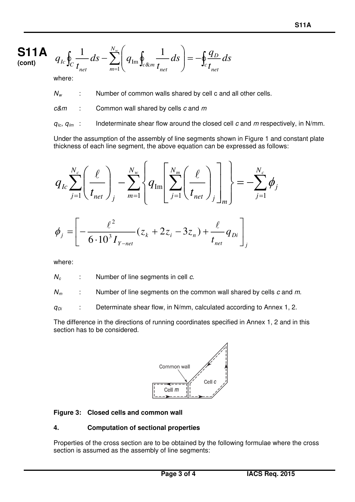

$$q_{I_c} \int_c \frac{1}{t_{net}} ds - \sum_{m=1}^{N_{cm}} \left(q_{I_m} \int_{cm} \frac{1}{t_{net}} ds\right) = -\oint_c \frac{q_D}{t_{net}} ds$$

where:

Ncm : Number of common walls shared by cell c and other cells.

c,m : Common wall shared by cells c and m.

qI_c, qI_m : Indeterminate shear flow around the closed cell c and m respectively, in N/mm.

Under the assumption of the assembly of line segments shown in Figure 1 and constant plate thickness of each line segment, the above equation can be expressed as follows:

$$q_{I_c} \sum_{j=1}^{N_c} \left(\frac{\ell}{t_{net}}\right)_j - \sum_{m=1}^{N_{cm}} \left(q_{I_m} \sum_{j=1}^{N_{cm}} \left(\frac{\ell}{t_{net}}\right)_j\right) = -\sum_{j=1}^{N_c} \phi_j$$

$$\phi_j = -\left[\frac{\ell^2}{6 \cdot 10^7 I_{y-net}} \{z_s + 2z_e - 3z_n\} + \frac{\ell}{t_{net}} q_{Dk}\right]_j$$

where:

Nc : Number of line segments in cell c.

Ncm : Number of line segments on the common wall shared by cells c and m.

qDk : Determinate shear flow, in N/mm, calculated according to Annex 1, 2.

The difference in the directions of running coordinates specified in Annex 1, 2 and in this section has to be considered.

## 4. Computation of sectional properties

Properties of the cross section are to be obtained by the following formulae where the cross section is assumed as the assembly of line segments.

$$\ell = \sqrt{(y_e - y_s)^2 + (z_e - z_s)^2}$$

$$a_{net} = 10^{-3} \ell t_{net} \quad A_{net} = \sum a_{net}$$

$$s_{y-net} = \frac{a_{net}}{2}(z_s + z_e) \quad S_{y-net} = \sum s_{y-net}$$

$$i_{y-net} = \frac{a_{net}}{3}(z_s^2 + z_s z_e + z_e^2) \quad I_{y0-net} = \sum i_{y-net}$$

where:

anet, Anet : Area of the line segment and the cross section respectively, in m2.

sy-net, Sy-net : First moment of the line segment and the cross section about the baseline, in m3.

iy-net, Iy0-net : Moment of inertia of the line segment and the cross section about the baseline, in m4.

The height of horizontal neutral axis, zn, in m, is to be obtained as follows:

$$z_n = \frac{S_{y-net}}{A_{net}}$$

Inertia moment about the horizontal neutral axis, in m4, is to be obtained as follows:

$$I_{y-net} = I_{y0-net} - z_n^2 A_{net}$$

## Annex 2 – Buckling Capacity

## Symbols

| | |
|---|---|
| x axis | : Local axis of a rectangular buckling panel parallel to its long edge. |
| y axis | : Local axis of a rectangular buckling panel perpendicular to its long edge. |
| σx | : Membrane stress applied in x direction, in N/mm2. |
| σy | : Membrane stress applied in y direction, in N/mm2. |
| τ | : Membrane shear stress applied in xy plane, in N/mm2. |
| σa | : Axial stress in the stiffener, in N/mm2 |
| σb | : Bending stress in the stiffener, in N/mm2 |
| σw | : Warping stress in the stiffener, in N/mm2 |
| σcx, σcy, τc | : Critical stress, in N/mm2, defined in [2.1.1] for plates. |
| ReH_S | : Specified minimum yield stress of the stiffener, in N/mm2 |
| ReH_P | : Specified minimum yield stress of the plate, in N/mm2 |
| a | : Length of the longer side of the plate panel as shown in Table 2, in mm. |
| b | : Length of the shorter side of the plate panel as shown in Table 2, in mm. |
| d | : Length of the side parallel to the axis of the cylinder corresponding to the curved plate panel as shown in Table 3, in mm. |
| σE | : Elastic buckling reference stress, in N/mm2 to be taken as: |

- For the application of plate limit state according to [2.1.2]:

$$\sigma_E = \frac{\pi^2 E}{12(1-\nu^2)} \left(\frac{t_p}{b}\right)^2$$

- For the application of curved plate panels according to [2.2]:

$$\sigma_E = \frac{\pi^2 E}{12(1-\nu^2)} \left(\frac{t_p}{d}\right)^2$$

| | |
|---|---|
| ν | : Poisson's ratio to be taken equal to 0.3 |
| tp | : Net thickness of plate panel, in mm |
| tw | : Net stiffener web thickness, in mm |
| tf | : Net flange thickness, in mm |
| bf | : Breadth of the stiffener flange, in mm |
| hw | : Stiffener web height, in mm |
| ef | : Distance from attached plating to centre of flange, in mm, to be taken as: |

- ef = hw for flat bar profile.

- ef = hw – 0.5 tf for bulb profile.

- ef = hw + 0.5 tf for angle and Tee profiles.

| | |
|---|---|
| α | : Aspect ratio of the plate panel, to be taken as $\alpha = \frac{a}{b}$ |
| β | : Coefficient taken as $\beta = \frac{1-\psi}{\alpha}$ |
| ψ | : Edge stress ratio to be taken as $\psi = \frac{\sigma_2}{\sigma_1}$ |
| σ1 | : Maximum stress, in N/mm2 |
| σ2 | : Minimum stress, in N/mm2 |
| R | : Radius of curved plate panel, in mm |
| ℓ | : Span, in mm, of stiffener equal to the spacing between primary supporting members |
| s | : Spacing of stiffener, in mm, to be taken as the mean spacing between the stiffeners of the considered stiffened panel. |

## 1. Elementary Plate Panel (EPP)

### 1.1 Definition

An Elementary Plate Panel (EPP) is the unstiffened part of the plating between stiffeners and/or primary supporting members.
All the edges of the elementary plate panel are forced to remain straight (but free to move in the in-plane directions) due to the surrounding structure/neighbouring plates (usually longitudinal stiffened panels in deck, bottom and inner-bottom plating, shell and longitudinal bulkheads).

### 1.2 EPP with different thicknesses

1.2.1 Longitudinally stiffened EPP with different thicknesses

In longitudinal stiffening arrangement, when the plate thickness varies over the width, b, in mm, of a plate panel, the buckling capacity is calculated on an equivalent plate panel width, having a thickness equal to the smaller plate thickness, t1. The width of this equivalent plate panel, beq, in mm, is defined by the following formula:

$$b_{eq} = \ell_1 + \ell_2 \left(\frac{t_1}{t_2}\right)^{1.5}$$

where:

ℓ1 : Width of the part of the plate panel with the smaller plate thickness, t1, in mm, as defined in Figure 1.

ℓ2 : Width of the part of the plate panel with the greater plate thickness, t2, in mm, as defined in Figure 1.

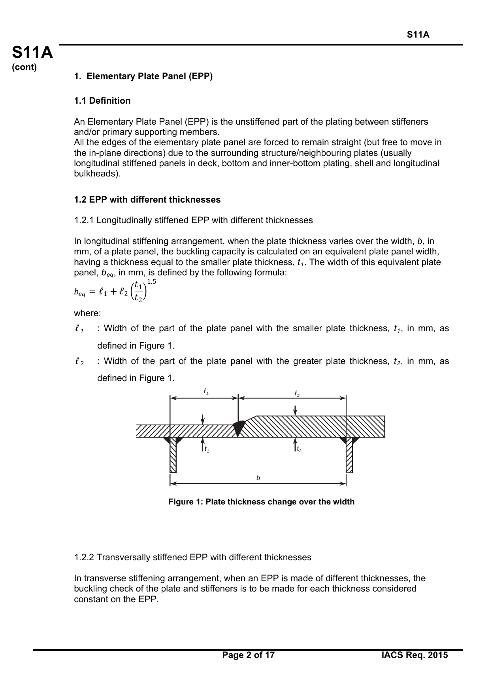

Figure 1: Plate thickness change over the width

1.2.2 Transversally stiffened EPP with different thicknesses

In transverse stiffening arrangement, when an EPP is made of different thicknesses, the buckling check of the plate and stiffeners is to be made for each thickness considered constant on the EPP.

## 2. Buckling capacity of plates

### 2.1 Plate panel

2.1.1 Plate limit state

The plate limit state is based on the following interaction formulae:

$$\left(\frac{\gamma_c \sigma_{x}}{C_{xa} R_{eH\_P}}\right)^{e_0} + \left(\frac{\gamma_c \sigma_{y}}{C_{ya} R_{eH\_P}}\right)^{e_0} = 1$$

b) Transverse stiffening arrangement:

$$\left(\frac{\gamma_c \sigma_{x}}{C_{xb} R_{eH\_P}}\right)^{e_0} + \left(\frac{\gamma_c \sigma_{y}}{C_{yb} R_{eH\_P}}\right)^{e_0} = 1$$

where:

σx, σy : Applied normal stress to the plate panel as defined in S11A.4.4, in N/mm2, at load calculation points defined in elementary elementary plate panel.

σxa : Applied normal stress to be considered for the longer edge of the buckling plate panel, in N/mm2, defined in S11A.4.4 at load calculation points of the elementary plate panel.

σy : Ultimate buckling stress, in N/mm2 in direction parallel to the shorter edge of the buckling panel as defined in 2.1.3.

γc : Ultimate buckling shear stress, in N/mm2 as defined in 2.1.3.

βp : Plate slenderness parameter taken as:

$$\beta_p = \frac{b}{t_p}\sqrt{\frac{R_{eH\_P}}{E}}$$

2.1.2 Reference degree of slenderness

The reference degree of slenderness is to be taken as:

$$\lambda = \sqrt{\frac{R_{eH\_P}}{K \sigma_E}}$$

where:

K : Buckling factor, as defined in Table 2 and Table 3.

2.1.3 Ultimate buckling stresses

The ultimate buckling stress of plate panels, in N/mm2, is to be taken as:

$$\sigma_{cx} = C_x R_{eH\_P}$$

$$\sigma_{cy} = C_y R_{eH\_P}$$

Cx, Cy, Cτ : Reduction factors, as defined in Table 2.

The boundary conditions for plates are to be considered as simply supported (see cases 1, 2 and 15 of Table 2). If the boundary conditions differ significantly from simple support, a more appropriate boundary condition can be applied according to the different cases of Table 2 subject to the agreement of the Classification Society.

2.1.4 Correction Factor Flong

The correction factor Flong, depending on the edge stiffener types on the longer side of the buckling panel is defined in Table 1. An average value of Flong, is to be used for plate panels having different edge stiffeners. For stiffener types other than those mentioned in Table 1, the value of c is to be agreed by the Society. In such a case, value of c higher than those mentioned in Table 1 can be used, provided it is verified by buckling strength check of panel using non-linear FE analysis and deemed appropriate by the Classification Society.

Table 1: Correction Factor Flong

| Structural element types | | Flong | c |
|---|---|---|---|
| Unstiffened Panel | | 1.0 | N/A |
| Stiffened Panel | Stiffener not fixed at both ends | 1.0 | N/A |
| | Stiffener fixed at both ends | Flat bar (1) | $F_{long} = c \left(\frac{t_w}{t_p}\right)^3 + 1$ for $\frac{t_w}{t_p} \leq 1$ | 0.10 |
| | | Bulb profile | | 0.30 |
| | | Angle profile | | 0.40 |
| | | T profile | | 0.30 |
| | | Girder of high rigidity (e.g. bottom transverse) | 1.4 | N/A |
| (1) tw is the net web thickness, in mm, without the correction defined in 4.3.5 | | | |

### 2.1.5 Reference Stress

Cx, Cy, Cτ : Reduction factors, as defined in Table 2

The boundary conditions for plates are to be considered as simply supported (cases 1, 2 and 15 of Table 2). If the boundary conditions differ significantly from simple support, a more appropriate boundary condition can be applied according to the different cases of Table 2 subject to the agreement of the Classification Society.

Table 2: Buckling Factor and reduction factor for plane plate panels

(Table 2 continues over several pages and defines buckling factor K and reduction factor C for multiple loading cases (cases 1 to 17) of plane plate panels with various stress distributions and boundary conditions. Due to the complex tabular layout of the original table with nested formulas, the full table content is preserved in the page-rendered figures below.)

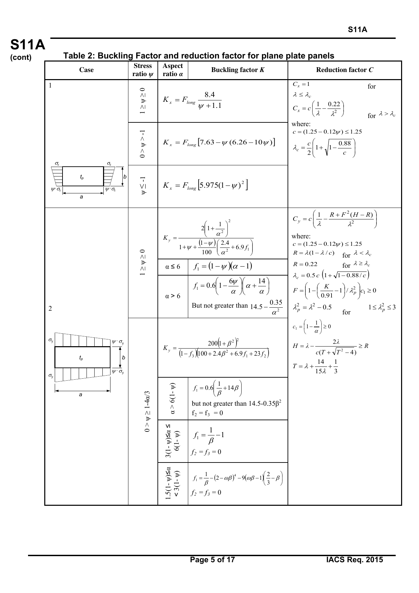

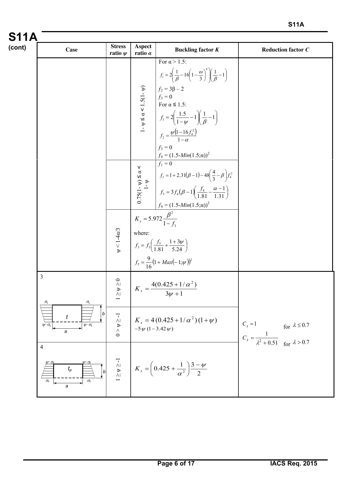

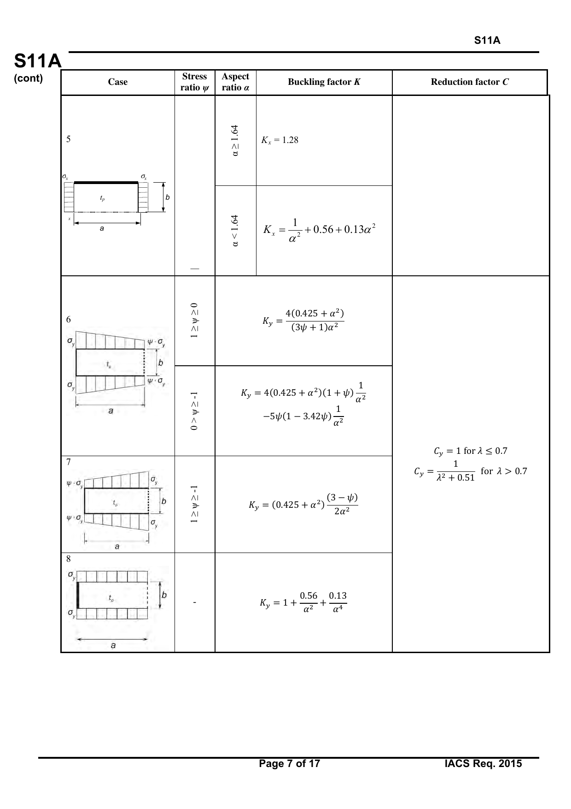

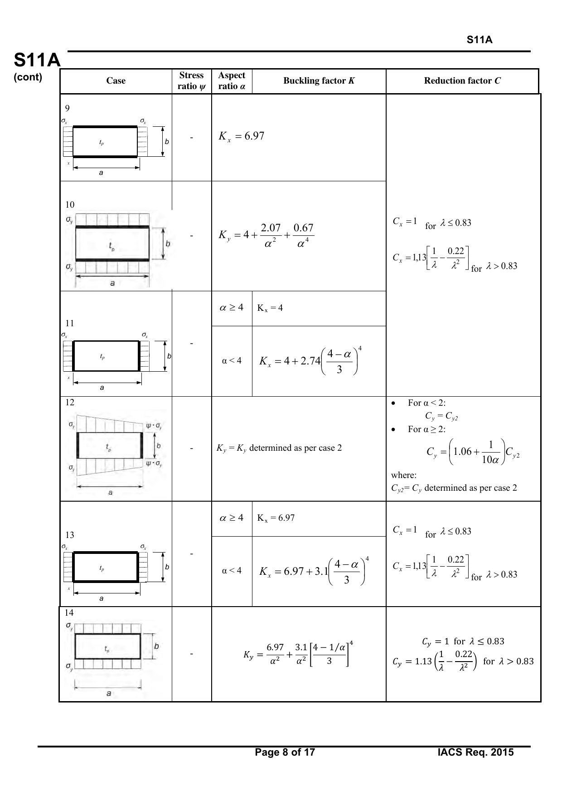

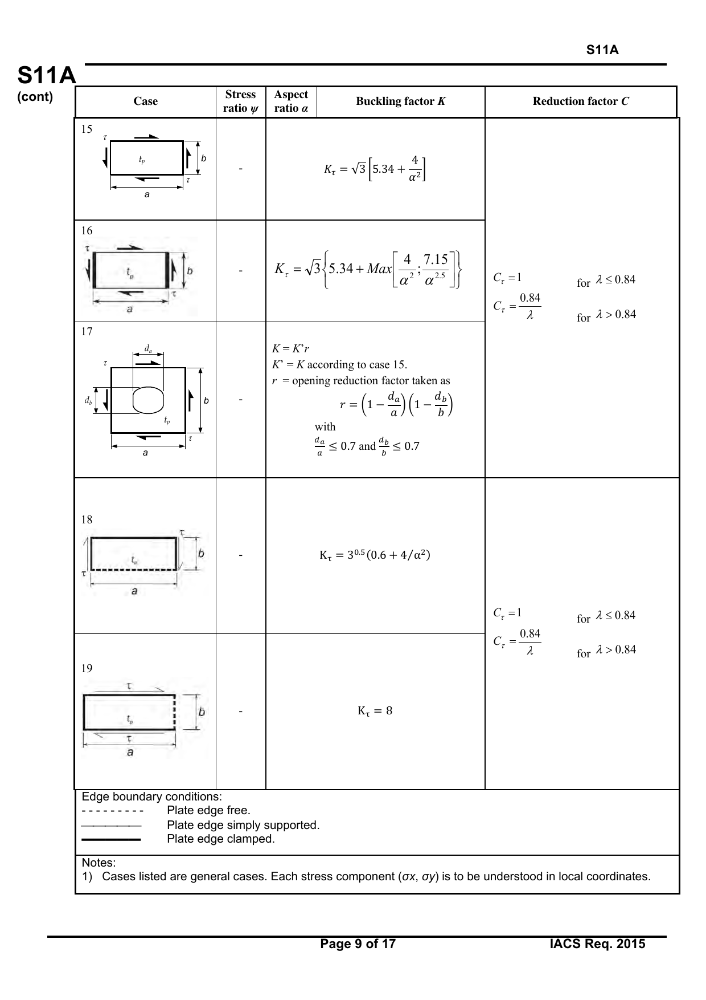

### 2.2 Curved plate panels

This requirement for curved plate limit state is applicable when R/tp ≤ 2500. Otherwise, the requirement for plate limit state given in 2.1.1 is to be applied.

The curved plate limit state is based on the following interaction formula:

$$\left(\frac{\gamma_c \sigma_{ax}}{C_{ax} R_{eH\_P}}\right)^{1.25} + \left(\frac{\gamma_c \sqrt{3}}{C_\tau R_{eH\_P}}\right)^2 = 1.0$$

where:

σax : Applied axial stress to the cylinder corresponding to the curved plate panel, in N/mm2. In case of tensile axial stresses, σax=0.

Cax, Cτ : Buckling reduction factor of the curved plate panel, as defined in Table 3.

The stress multiplier factor γc of the curved plate panel needs not be taken less than the stress multiplier factor γc for the expanded plane panel according to 2.1.1.

Table 3: Buckling Factor and reduction factor for curved plate panel with R/tp ≤ 2500

| Case | Aspect ratio | Buckling factor K | Reduction factor C |
|---|---|---|---|
| 1 | $\frac{d}{R}\leq 0.5\sqrt{\frac{R}{t_p}}$ | $K = 1 + \frac{2}{3} \frac{d^2}{R t_p}$ | For general application: Cax = 1 for λ ≤ 0.25 Cax = 1.233 - 0.933λ for 0.25 ≤ λ ≤ 1 |
| | $\frac{d}{R}>0.5\sqrt{\frac{R}{t_p}}$ | $K = 0.267 \frac{d^2}{R t_p}\left[3 - \frac{d}{R}\sqrt{\frac{t_p}{R}}\right]$ $\geq 0.4 \frac{d^2}{R t_p}$ | Cax = 0.3/λ3 for 1 ≤ λ ≤ 1.5 Cax = 0.2/λ2 for λ > 1.5 For curved single fields, e.g. bilge strake, which are bounded by plane panels: Cax = 0.65/λ2 ≤ 1.0 |
| 2 | $\frac{d}{R}\leq 8.7\sqrt{\frac{R}{t_p}}$ | $K = \sqrt{3}\left[28.3 + \frac{0.67 d^3}{R^{1.5} t_p^{1.5}}\right]$ | Cτ = 1 for λ ≤ 0.4 Cτ = 1.274 - 0.686λ for 0.4 ≤ λ ≤ 1.2 Cτ = 0.65/λ2 for λ > 1.2 |
| | $\frac{d}{R}>8.7\sqrt{\frac{R}{t_p}}$ | $K = \sqrt{3}\frac{0.28 d^2}{R\sqrt{R t_p}}$ | |

Explanations for boundary conditions: Plate edge simply supported.

## 3 Buckling capacity of overall stiffened panel

The elastic stiffened plate limit state is based on the following interaction formula:

$$\frac{P_z}{c_f} = 1$$

where Pz and cf are defined in 4.4.3.

## 4 Buckling capacity of longitudinal stiffeners

### 4.1 Stiffeners limit states

The buckling capacity of longitudinal stiffeners is to be checked for the following limit states:

- Stiffener induced failure (SI).

- Associated plate induced failure (PI).

### 4.2 Lateral pressure

The lateral pressure is to be considered as constant in the buckling strength assessment of longitudinal stiffeners.

### 4.3 Stiffener idealisation

4.3.1 Effective length of the stiffener ℓeff

The effective length of the stiffener ℓeff, in mm, is to be taken equal to:

$$\ell_{eff} = \frac{\ell}{\sqrt{3}} \text{ for stiffener fixed at both ends}$$

$$\ell_{eff} = 0.75 \ell \text{ for stiffener simply supported at one end and fixed at the other}$$

$$\ell_{eff} = \ell \text{ for stiffener simply supported at both ends}$$

4.3.2 Effective width of the attached plating beff

The effective width of the attached plating of a stiffener beff, in mm, without the shear lag effect is to be taken equal to:

$$b_{eff1} = \frac{C_{x1} b_1 + C_{x2} b_2}{2}$$

where:

Cx1, Cx2 : Reduction factor defined in Table 2 calculated for the EPP1 and EPP2 on each side of the considered stiffener according to case 1.

b1, b2 : Width of plate panel on each side of the considered stiffener, in mm.

4.3.3 Effective width of attached plating beff

The effective width of attached plating of stiffeners, beff, in mm, is to be taken as:

$$b_{eff} = \min(b_{eff1}, b_1)$$

where:

χs : Effective width coefficient to be taken as:

$$\chi_s = \min\left(\frac{1.12}{1 + \frac{1.75}{(L/s)^{1.6}}}, 1\right) \text{ for } \frac{L}{s} \geq 1$$

$$\chi_s = 0.407 \frac{L}{s} \text{ for } \frac{L}{s} < 1$$

4.3.4 Net thickness of attached plating tp

The net thickness of plate tp, in mm, is to be taken as the mean thickness of the two attached plating panels.

4.3.5 Effective web thickness of flat bar

For accounting the decrease of stiffness due to local lateral deformation, the effective web thickness of flat bar stiffener, in mm, is to be used for the calculation of the net sectional area, As, the net section modulus, Z, and the moment of inertia, I, of the stiffener and is taken as:

$$t_{w\_red} = t_w \left(1 - \frac{2\pi^2}{3}\left(\frac{h_w}{\ell}\right)^2 \left(1 - \frac{b_{eff1}}{s}\right)\right)$$

4.3.6 Net section modulus Z of a stiffener

The net section modulus Z of a stiffener, in cm3, including effective width of plating beff1, is to be taken equal to:

- the section modulus calculated at the top of stiffener flange for stiffener induced failure (SI).

- the section modulus calculated at the attached plating for plate induced failure (PI).

4.3.7 Net moment of inertia I of a stiffener

The net moment of inertia I, in cm4, of a stiffener including effective width of attached plating beff1 is to comply with the following requirement:

$$I \geq \frac{s t_p^3}{12 \cdot 10^4}$$

4.3.8 Idealisation of bulb profile

Bulb profiles may be considered as equivalent angle profiles. The net dimensions of the equivalent built-up section are to be obtained, in mm, from the following formulas:

$$h_w = h'_w - \frac{h'_w}{9.2} + 2$$

$$b_f = \alpha \left(t'_w + \frac{h'_w}{6.7} - 2\right)$$

$$t_f = \frac{h'_w}{9.2} - 2$$

$$t_w = t'_w$$

where:

h'w, t'w : Net height and thickness of a bulb section, in mm, as shown in Figure 2.

α : Coefficient equal to:

α = 1.1 + $\frac{(120-h'_w)^2}{3000}$ for h'w ≤ 120

α = 1.0 for h'w > 120

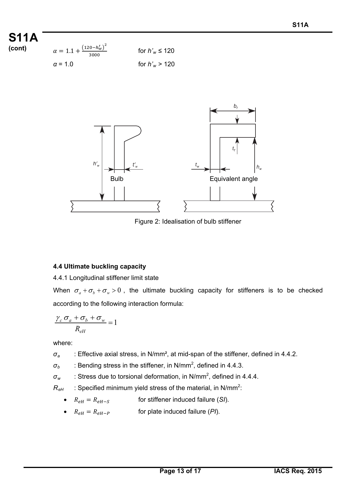

Figure 2: Idealisation of bulb stiffener

### 4.4 Ultimate buckling capacity

4.4.1 Longitudinal stiffener limit state

When σa + σb + σw > 0, the ultimate buckling capacity for stiffeners is to be checked according to the following interaction formula:

$$\frac{\gamma_c (\sigma_a + \sigma_b + \sigma_w)}{R_{eH}} = 1$$

where:

σa : Effective axial stress, in N/mm2, at mid-span of the stiffener, defined in 4.4.2.

σb : Bending stress in the stiffener, in N/mm2, defined in 4.4.3.

σw : Stress due to torsional deformation, in N/mm2, defined in 4.4.4.

ReH : Specified minimum yield stress of the material, in N/mm2:

- ReH = ReH\_S for stiffener induced failure (SI).

- ReH = ReH\_P for plate induced failure (PI).

4.4.2 Effective axial stress σa

The effective axial stress σa, in N/mm2, at mid-span of the stiffener, acting on the stiffener with its attached plating is to be taken equal to:

$$\sigma_a = \sigma_x \frac{s t_p + A_s}{b_{eff1} t_p + A_s}$$

where:

σx : Nominal axial stress, in N/mm2, acting on the stiffener with its attached plating, calculated according to S11A. 4.4.1 a) at load calculation point of the stiffener.

As : Net sectional area, in mm2, of the considered stiffener.

4.4.3 Bending stress σb

The bending stress in the stiffener σb, in N/mm2, is to be taken equal to:

$$\sigma_b = \frac{M_0 + M_1}{Z} 10^{-3}$$

where:

M1 : Bending moment, in Nmm, due to the lateral load P:

$$M_1 = C_i \frac{|P|s\ell^2}{24} 10^{-3} \text{ for continuous stiffener}$$

$$M_1 = C_i \frac{|P|s\ell^2}{8} 10^{-3} \text{ for sniped stiffener}$$

P : Lateral load, in kN/m2, to be taken equal to the static pressure at the load calculation point of the stiffener.

Ci : Pressure coefficient:

Ci=CSl for stiffener induced failure (SI).

Ci=CPl for plate induced failure (PI).

CPl : Plate induced failure pressure coefficient:

CPl = 1 if the lateral pressure is applied on the side opposite to the stiffener.

CPl = -1 if the lateral pressure is applied on the same side as the stiffener.

CSl : Stiffener induced failure pressure coefficient:

CSl = 1 if the lateral pressure is applied on the same side as the stiffener.

CSl = -1 if the lateral pressure is applied on the side opposite to the stiffener.

M0 : Bending moment, in Nmm, due to the lateral deformation w of stiffener:

$$M_0 = F_E \left(\frac{P_z w}{c_f - P_z}\right) \text{ with } c_f - P_z > 0$$

FE : Ideal elastic buckling force of the stiffener, in N:

$$F_E = \left(\frac{\pi}{\ell}\right)^2 E I \cdot 10^4$$

Pz : Nominal lateral load, in N/mm2, acting on the stiffener due to stresses σx and τ, in the attached plating in way of the stiffener mid span:

$$P_z = \frac{t_p}{s}\left(\sigma_{xl}\left(\frac{\pi s}{\ell}\right)^2 + \sqrt{2}\tau_1\right)$$

$$\sigma_{xl} = \sigma_x \left(1 + \frac{A_s}{s t_p}\right) \text{ but not less than 0 if } \sigma_x > 0$$

$$\tau_1 = \left|\tau - t_p \sqrt{\frac{R_{eH\_P}}{\sqrt{3}} - \tau_e}\right| \text{ but not less than 0 if } \tau > 0$$

$$\tau_e = 0.8 \frac{E}{(s/t_p)^2}\left(\frac{\pi s}{\ell}\right)^2 \cdot 10^{-3}$$

w : Deformation of stiffener, in mm, taken equal to:

w = w0 + w1

w0 : Assumed imperfection, in mm, taken as:

w0 = ℓ/103 in general

w0 = $\min\left(\frac{b_{eff1}}{250}, \frac{s}{250}, \frac{\ell}{250}\right)$ for stiffeners sniped at both ends, considering stiffener induced failure (SI)

w0 = $\min\left(\frac{b_{eff1}}{250}, \frac{s}{250}, \frac{\ell}{250}\right)$ for stiffeners sniped at both ends, considering plate induced failure (PI)

w1 : Deformation of stiffener, in mm, at midpoint of stiffener span due to lateral load P. In case of uniformly distributed load, w1 is to be taken as:

$$w_1 = \frac{C_i |P| s \ell^4}{384 E I} 10^{-7} \text{ for continuous stiffener}$$

$$w_1 = \frac{5 C_i |P| s \ell^4}{384 E I} 10^{-7} \text{ for sniped stiffener}$$

cf : Elastic support provided by the stiffener, in N/mm2, to be taken equal to:

$$c_f = F_E \left(\frac{\pi}{\ell}\right)^2 (1 + c_{pp})$$

cpp : Coefficient to be taken as:

$$c_{pp} = \left[\frac{0.91}{1 + \frac{0.91}{c_{px0}}} \frac{(s\pi)^4}{(\ell\pi)^4} - 1\right]\left(\frac{s\pi}{\ell}\right)^2$$

$$c_{px0} = \left(1 + \left(\frac{s\pi}{\ell}\right)^2\right)^2 \text{ for } \ell \geq 2s$$

4.4.4 Stress due to torsional deformation σw

The stress due to torsional deformation σw, in N/mm2, is to be taken equal to:

$$\sigma_w = E \gamma_w \left(\frac{y_w}{I} + h_w\right) \Phi_0 \left(\frac{1}{1 - \frac{\sigma_a}{\sigma_{ET}}}\right) \text{ for stiffener induced failure (SI)}$$

σw = 0 for plate induced failure (PI).

where:

yw : Distance, in mm, from centroid of stiffener cross-section to the free edge of stiffener flange, to be taken as:

$$y_w = \frac{t_w}{2} \text{ for flat bar.}$$

$$y_w = b_f - \frac{b_f^2 t_f + 0.5 b_f^2 t_f}{2 A_s} \text{ for angle and bulb profiles.}$$

$$y_w = \frac{b_f}{2} \text{ for Tee profile.}$$

Φ0 = $\frac{\ell}{10^3}$

σET : Reference stress for torsional buckling, in N/mm2:

$$\sigma_{ET} = \frac{E}{10^4}\left\{\frac{I_w}{I_p}\left(\frac{\pi}{\ell}\right)^2 + 0.385 I_t\right\}$$

Ip : Net polar moment of inertia of the stiffener, as defined in Table 4, in cm4.

It : Net moment of inertia of the stiffener about point C as defined in Figure 3, in cm4.

Iw : Net sectional moment of inertia of the stiffener about point C as defined in Figure 3, in cm6.

ε : Degree of fixation.

$$\epsilon = 1 + \left[\frac{\left(\frac{\pi}{\ell}\right)^2}{\left(\frac{s\pi}{\ell}\right)^2 - 1} + \frac{4 h_w^3}{3 t_w^3 + s t_p^3}\right]$$

Table 4: Moments of inertia

| | Flat bars | Bulb, angle and Tee profiles |
|---|---|---|
| Ip | $\frac{h_w^3 t_w}{3 \cdot 10^4}$ | $\left(\frac{A_w h_w^2}{3} + A_f e_f^2\right) 10^{-4}$ |
| It | $\frac{h_w t_w^3}{3 \cdot 10^4}\left(1 - 0.63 \frac{t_w}{h_w}\right)$ | $\frac{h_w t_w^3}{3 \cdot 10^4}\left(1 - 0.63 \frac{t_w}{h_w}\right) +$ $\frac{b_f t_f^3}{3 \cdot 10^4}\left(1 - 0.63 \frac{t_f}{b_f}\right)$ |
| Iw | $\frac{h_w^3 t_w^3}{36 \cdot 10^6}$ | $\frac{A_f e_f^2 b_f^2}{12 \cdot 10^6}\frac{A_f + 2.6 A_w}{A_f + A_w}$ for bulb and angle profiles. $\frac{b_f^3 t_f e_f^2}{12 \cdot 10^6}$ for Tee profile. |

Aw : Net web area, in mm2.

Af : Net flange area, in mm2.

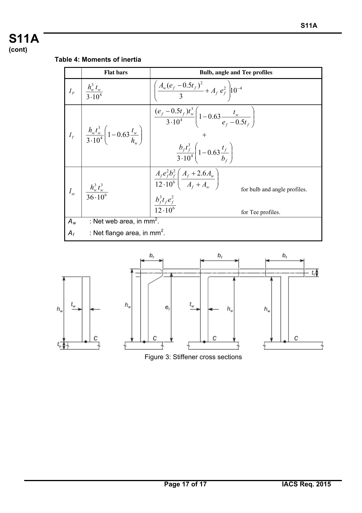

Figure 3: Stiffener cross sections

## Annex 3 - Hull girder ultimate bending capacity

## Symbols (2)

| | |
|---|---|
| Iy-net | Net moment of inertia, in m4, of the hull transverse section around its horizontal neutral axis |
| ZB-net, ZD-net | Section moduli, in m3, at bottom and deck, respectively. |
| ReH_S | Minimum yield stress, in N/mm2, of the material of the considered stiffener. |
| ReH_P | Minimum yield stress, in N/mm2, of the material of the considered plate. |
| As-net | Net sectional area, in cm2, of stiffener, without attached plating. |
| Ap-net | Net sectional area, in cm2, of attached plating. |

## 1. General Assumptions

### 1.1

The method for calculating the ultimate hull girder capacity is to identify the critical failure modes of all main longitudinal structural elements.

### 1.2

Structures compressed beyond their buckling limit have reduced load carrying capacity. All relevant failure modes for individual structural elements, such as plate buckling, torsional stiffener buckling, stiffener web buckling, lateral or global stiffener buckling and their interactions, are to be considered in order to identify the weakest inter-frame failure mode.

## 2. Incremental-iterative method

### 2.1 Assumptions

In applying the incremental-iterative method, the following assumptions are generally to be made:

- The ultimate strength is calculated at hull transverse sections between two adjacent transverse webs.

- The hull girder transverse section remains plane during each curvature increment.

- The hull material has an elasto-plastic behaviour.

- The hull girder transverse section is divided into a set of elements, see 2.2.2, which are considered to act independently.

According to the iterative procedure, the bending moment Mi acting on the transverse section at each curvature value χi is obtained by summing the contribution given by the stress σ acting on each element. The stress σ corresponding to the element strain, ε is to be obtained from the load-end curvature increment from the non-linear load-end shortening curves σ-ε of the element.

These curves are to be calculated, for the failure mechanisms of the element, from the formulae specified in 2.3. The stress σ is selected as the lowest among the values obtained from each of the considered load-end shortening curves σ-ε.

The procedure is to be repeated until the value of the imposed curvature reaches the value χF in m-1, in hogging and sagging condition, obtained from the following formula:

$$\chi_F = \pm 0.003 \frac{M_y}{E I_{y-net}}$$

where:

My: Lesser of the values MY1 and MY2, in kNm.

MY1 = 103 ReH ZB-net

MY2 = 103 ReH ZD-net

If the value χF is not sufficient to evaluate the peaks of the curve MU, the procedure is to be repeated until the value of the imposed curvature permits the calculation of the maximum bending moments of the curve.

### 2.2 Procedure

2.2.1 General

The curve M-χ is to be obtained by means of an incremental-iterative approach, summarised in the flow chart in Figure 1.

In this procedure, the ultimate hull girder bending moment capacity, MU is defined as the peak value of the curve with vertical bending moment M versus the curvature χ of the ship cross section as shown in Figure 1. The curve is to be obtained through an incremental-iterative approach.

Each step of the incremental procedure is represented by the calculation of the bending moment Mi which acts on the hull transverse section as the effect of an imposed curvature χi.

For each step, the value χi is to be obtained by summing an increment of curvature, Δχ to the value relevant to the previous step χi-1. This increment of curvature corresponds to an increment of the rotation angle of the hull girder transverse section around its horizontal neutral axis.

This rotation increment induces axial strains ε in each hull structural element, whose value depends on the position of the element. In hogging condition, the structural elements above the neutral axis are lengthened, while the elements below the neutral axis are shortened, and viceversa in sagging condition.

The stress σ induced in each structural element by the strain ε is to be obtained from the load-end curve σ-ε of the element, which takes into account the behaviour of the element in the non-linear elasto-plastic domain.

The distribution of the stresses induced in all the elements composing the hull transverse section determines, for each step, a variation of the neutral axis position due to the nonlinear σ-ε relationship. The new position of the neutral axis relevant to the step considered is to be obtained by means of an iterative process, imposing the equilibrium among the stresses acting in all the hull elements on the transverse section.

Once the position of the neutral axis is known and the relevant element stress distribution in the section is obtained, the bending moment of the section Mi around the new position of the neutral axis, which corresponds to the curvature χi imposed in the step considered, is obtained by summing the contribution given by each element stress.

The main steps of the incremental-iterative approach described above are summarised as follows (see Figure 1):

a) Step 1: Divide the transverse section of the hull into stiffened plate elements.

b) Step 2: Define stress-strain relationships for all elements as shown in Table 1.

c) Step 3: Initialise curvature χ1 and neutral axis for the first incremental step with the value of incremental curvature (i.e. curvature that induces a stress equal to 1% of yield strength in strength deck) as:

$$\chi_1 = \Delta \chi = 0.01 \frac{R_{eH}}{E} \frac{1}{z_D - z_n}$$

where:

zD: Z coordinate, in m, of strength deck at side.

zn: Z coordinate, in m, of horizontal neutral axis of the hull transverse section with respect to the reference coordinate system defined in S11A.1.2.3.

d) Step 4: Calculate for each element the corresponding strain, εi = χ(zi − zn) and the corresponding stress σi.

e) Step 5: Determine the neutral axis zNA_cur at each incremental step by establishing force equilibrium over the whole transverse section as:

ΣAi-net σi = ΣAj-net σj (i-th element under compression, j-th element under tension).

f) Step 6: Calculate the corresponding moment by summing the contributions of all elements as:

$$M_U = \sum \sigma_{U_i} A_{i-net} |z_i - z_{NA\_cur}|$$

g) Step 7: Compare the moment in the current incremental step with the moment in the previous incremental step. If the slope in MU-relationship is less than a negative fixed value, terminate the process and define the peak value of MU. Otherwise, increase the curvature by the amount of Δχ and go to Step 4.

![Figure 1: Flow chart of the procedure for the evaluation of the curve M chi showing Start, initial step with chi_1 equals zero, calculation of neutral axis at chi_i, increment of curvature chi_i plus 1 equals chi_i plus delta chi, calculation of strain induced on structural elements by chi_i plus 1, calculation of stress, calculation of new position of neutral axis by imposing equilibrium on the cross section, decision whether F_i is less than the specified tolerance or zero, loops back or proceeds to calculation of the bending moment M_i by summing contributions of each structural element stress, curve M-chi output, and End](assets/ur-s11a/part01-fig-annex3-p04-41.png)

Figure 1: Flow chart of the procedure for the evaluation of the curve MU

2.2.2 Modelling of the hull girder cross section

Hull girder transverse sections are to be considered as being constituted by the members contributing to the hull girder ultimate strength.

Sniped stiffeners are also to be modelled, taking account that they do not contribute to the hull girder strength.

The structural members are categorised into a stiffener element, a stiffened plate element or a hard corner element.

The plate panel including web plate of girder or side stringer is idealised into a stiffened plate element, an attached plate of a stiffener element or a hard corner element.

The plate panel is categorised into the following two kinds:

- Longitudinally stiffened panel of which the longer side is in ship's longitudinal direction, and

- Transversely stiffened panel of which the longer side is in the perpendicular direction to ship's longitudinal direction.

a) Hard corner element:

Hard corner elements are sturdier elements composing the hull girder transverse section, which collapse mainly according to an elasto-plastic mode of failure (material yielding); they are generally constituted by two plates not lying in the same plane.

The extent of a hard corner element from the point of intersection of the plates is taken equal to 20 tnet on a transversely stiffened panel and to 0.5 s on a longitudinally stiffened panel, see Figure 2.

where:

tnet : Net thickness of the plate, in mm.

s : Spacing of the adjacent longitudinal stiffener, in m.

Bilge, sheer strake-deck stringer elements, girder-deck connections and face plate-web connections on large girders are typical hard corners.

b) Stiffener element:

The stiffener constitutes a stiffener element together with the attached plate.

The attached plate width is in principle:

- Equal to the mean spacing of the stiffener when the panels on both sides of the stiffener are longitudinally stiffened, or

- Equal to the width of the longitudinally stiffened panel when the panel on one side of the stiffener is longitudinally stiffened and the other panel is of the transversely stiffened, see Figure 2.

c) Stiffened plate element:

The plate between stiffener elements, between a stiffener element and a hard corner element or between hard corner elements is to be treated as a stiffened plate element, see Figure 2.

The typical examples of modelling of hull girder section are illustrated in Figure 3. Notwithstanding the foregoing principle, these figures are to be applied to the modelling in the vicinity of upper deck, sheer strake and hatch coaming.

Figure 2: Extension of the breadth of the attached plating and hard corner element

Figure 3: Examples of the configuration of stiffened plate elements, stiffener elements and hard corner elements on a hull section

- In case of the knuckle point as shown in Figure 4, the plating area adjacent to knuckles in the plating with an angle greater than 30 degrees is defined as a hard corner. The extent of one side of the corner is taken equal to 20 tnet on transversely framed panels and to 0.5 s on longitudinally framed panels from the knuckle point.

- Where the plate members are stiffened by non-continuous longitudinal stiffeners, the non- continuous stiffeners are considered only as dividing a plate into various elementary plate panels.

- Where the opening is provided in the stiffened plate element, the openings are to be considered in accordance with the requirements of the Classification Society.

- Where attached plating is made of steels having different thicknesses and/or yield stresses, an average thickness and/or average yield stress obtained from the following formula is to be used for the calculation.

$$t_{ave} = \frac{t_1 s_1 + t_2 s_2}{s} \quad R_{eHP-ave} = \frac{R_{eHP1} t_1 s_1 + R_{eHP2} t_2 s_2}{t_{ave} s}$$

where ReHP1, ReHP2, t1, t2, s1 and s2 are shown in Figure 5

Figure 4: Plating with knuckle point

Figure 5: Element with different thickness and yield strength

### 2.3 Load-end shortening curves

#### 2.3.1 Stiffened plate element and stiffener element

Stiffened plate element and stiffener element composing the hull girder transverse sections may collapse following one of the modes of failure specified in Table 1.

- Where the plate members are stiffened by non-continuous longitudinal stiffeners, the stress of the element is to be obtained in accordance with 2.3.2 to 2.3.7, taking into account the non-continuous longitudinal stiffener.

In calculating the total forces for checking the hull girder ultimate strength, the area of non-continuous longitudinal stiffener is to be assumed as zero.

- Where the opening is provided in the stiffened plate element, the considered area of the stiffened plate element is to be obtained by deducting the opening area from the plating in calculating the total forces for checking the hull girder ultimate strength.

- For stiffened plate element, the effective width of plate for the load shortening portion of the stress-strain curve is to be taken as full plate width, i.e. to the intersection of other plate or longitudinal stiffener – neither from the end of the hard corner element nor from the attached plating of stiffener element, if any. In calculating the total forces for checking the hull girder ultimate strength, the area of the stiffened plate element is to be taken between the hard corner element and the stiffener element or between the hard corner elements, as applicable.

Table 1: Modes of failure of stiffened plate element and stiffener element

| Element | Mode of failure | Curve σ-ε defined in |
|---|---|---|
| Lengthened stiffened plate element or stiffener element | Elasto-plastic collapse | 2.3.2 |
| Shortened stiffener element | Beam column buckling Torsional buckling Web local buckling of flanged profiles Web local buckling of flat bars | 2.3.3, 2.3.4, 2.3.5, 2.3.6 |
| Shortened stiffened plate element | Plate buckling | 2.3.7 |

#### 2.3.2 Elasto-plastic collapse of structural elements (Hard corner element)

The equation describing the load-end shortening curve σ-ε for the elasto-plastic collapse of structural elements composing the hull girder transverse section is to be obtained from the following formula.

$$\sigma = \Phi R_{eHA}$$

where:

ReHA: Equivalent minimum yield stress, in N/mm2, of the considered element, obtained by the following formula:

$$R_{eHA} = \frac{R_{eH\_P} A_{p-net} + R_{eH\_S} A_{s-net}}{A_{p-net} + A_{s-net}}$$

Φ: Edge function, equal to:

Φ = -1 for ε < -1
Φ = ε for -1 ≤ ε ≤ 1
Φ = 1 for ε > 1

ε: Relative strain, equal to:

$$\varepsilon = \frac{\varepsilon_E}{\varepsilon_Y}$$

εE: Element strain.

εY: Strain at yield stress in the element, equal to:

$$\varepsilon_y = \frac{R_{eHA}}{E}$$

#### 2.3.3 Beam column buckling

The positive strain portion of the average stress – average strain curve σCR1 - ε based on beam column buckling of plate-stiffener combinations is described according to the following:

$$\sigma_{CR1} = \phi \sigma_{C1} \frac{A_{s-net} + A_{pE-net}}{A_{s-net} + A_{p-net}}$$

where:

Φ: Edge function, as defined in 2.3.2.

σC1: Critical stress, in N/mm2, equal to:

$$\sigma_{C1} = \frac{\sigma_{E1}}{\varepsilon} \quad \text{for} \quad \sigma_{E1} \leq \frac{R_{eHB}}{2} \varepsilon$$

$$\sigma_{C1} = R_{eHB}\left(1 - \frac{R_{eHB} \varepsilon}{4 \sigma_{E1}}\right) \quad \text{for} \quad \sigma_{E1} > \frac{R_{eHB}}{2} \varepsilon$$

ReHB: Equivalent minimum yield stress, in N/mm2, of the considered element, obtained by the following formula:

$$R_{eHB} = \frac{R_{eH\_P} A_{pEI-net} \ell_{pE} + R_{eH\_S} A_{s-net} \ell_{sE}}{A_{pEI-net} \ell_{pE} + A_{s-net} \ell_{sE}}$$

ApEI-net: Effective area, in cm2, equal to:

$$A_{pEI-net} = 10 b_{E1} t_{net}$$

ℓpE: Distance, in mm, measured from the neutral axis of the stiffener with attached plate of width bE1 to the bottom of the attached plate

ℓsE: Distance, in mm, measured from the neutral axis of the stiffener with attached plate of width bE1 to the top of the stiffener

ε: Relative strain, as defined in 2.3.2

σE1: Euler column buckling stress, in N/mm2, equal to:

$$\sigma_{E1} = \pi^2 E \frac{I_{E-net}}{A_{E-net} \ell^2} 10^{-4}$$

IE-net: Net moment of inertia of stiffeners, in cm4, with attached plate of width bE1

AE-net: Net area, in cm2, of stiffeners with attached plating of width bE

bE1: Effective width corrected for relative strain, in m, of the attached plating, equal to:

$$b_{E1} = \frac{s}{\beta_E} \quad \text{for} \quad \beta_E > 1.0$$

$$b_{E1} = s \quad \text{for} \quad \beta_E \leq 1.0$$

βE:

$$\beta_E = 10^3 \frac{s}{t_{net}} \sqrt{\frac{\varepsilon R_{eH\_P}}{E}}$$

ApE-net: Net area, in cm2, of attached plating of width bE, equal to:

$$A_{pE-net} = 10 b_E t_{net}$$

bE: Effective width, in m, of the attached plating, equal to:

$$b_E = \left(\frac{2.25}{\beta_E} - \frac{1.25}{\beta_E^2}\right) s \quad \text{for} \quad \beta_E > 1.25$$

$$b_E = s \quad \text{for} \quad \beta_E \leq 1.25$$

#### 2.3.4 Torsional buckling

The load-end shortening curve σCR2-ε for the flexural-torsional buckling of stiffeners composing the hull girder transverse section is to be obtained according to the following formula:

$$\sigma_{CR2} = \phi \frac{A_{s-net} \sigma_{C2} + A_{p-net} \sigma_{CP}}{A_{s-net} + A_{p-net}}$$

where:

Φ: Edge function, as defined in 2.3.2

σC2: Critical stress, in N/mm2, equal to:

$$\sigma_{C2} = \frac{\sigma_{E2}}{\varepsilon} \quad \text{for} \quad \sigma_{E2} \leq \frac{R_{eH\_S}}{2} \varepsilon$$

$$\sigma_{C2} = R_{eH\_S}\left(1 - \frac{R_{eH\_S} \varepsilon}{4 \sigma_{E2}}\right) \quad \text{for} \quad \sigma_{E2} > \frac{R_{eH\_S}}{2} \varepsilon$$

ε: Relative strain, as defined in 2.3.2

σE2: Euler column buckling stress, in N/mm2, taken as σET defined in Annex 2 4.4.4

σCP: Buckling stress of the attached plating, in N/mm2, equal to:

$$\sigma_{CP} = \left(\frac{2.25}{\beta_E} - \frac{1.25}{\beta_E^2}\right) R_{eH\_P} \quad \text{for} \quad \beta_E > 1.25$$

$$\sigma_{CP} = R_{eH\_P} \quad \text{for} \quad \beta_E \leq 1.25$$

βE: Coefficient, as defined in 2.3.3

#### 2.3.5 Web local buckling of stiffeners made of flanged profiles

The load-end shortening curve σCR3 - ε for the web local buckling of flanged stiffeners composing the hull girder transverse section is to be obtained from the following formula:

$$\sigma_{CR3} = \phi \frac{10^3 b_E t_{net} R_{eH\_P} + (h_{we} t_{w-net} + b_f t_{f-net}) R_{eH\_s}}{10^3 s t_{net} + h_w t_{w-net} + b_f t_{f-net}}$$

where:

Φ: Edge function, as defined in 2.3.2

bE: Effective width, in m, of the attached plating, as defined in 2.3.3

hwe: Effective height, in mm, of the web, equal to:

$$h_{we} = \left(\frac{2.25}{\beta_w} - \frac{1.25}{\beta_w^2}\right) h_w \quad \text{for} \quad \beta_w \geq 1.25$$

$$h_{we} = h_w \quad \text{for} \quad \beta_w < 1.25$$

βw:

$$\beta_w = \frac{h_w}{t_{w-net}} \sqrt{\frac{\varepsilon R_{eH\_s}}{E}}$$

ε: Relative strain, as defined in 2.3.2

#### 2.3.6 Web local buckling of stiffeners made of flat bars

The load-end shortening curve σCR4-ε for the web local buckling of flat bar stiffeners composing the hull girder transverse section is to be obtained from the following formula:

$$\sigma_{CR4} = \phi \frac{A_{p-net} \sigma_{CP} + A_{s-net} \sigma_{C4}}{A_{p-net} + A_{s-net}}$$

where:

Φ: Edge function, as defined in 2.3.2.

σCP: Buckling stress of the attached plating, in N/mm2, as defined in 2.3.4.

σC4: Critical stress, in N/mm2, equal to:

$$\sigma_{C4} = \frac{\sigma_{E4}}{\varepsilon} \quad \text{for} \quad \sigma_{E4} \leq \frac{R_{eH\_S}}{2} \varepsilon$$

$$\sigma_{C4} = R_{eH\_S}\left(1 - \frac{R_{eH\_S} \varepsilon}{4 \sigma_{E4}}\right) \quad \text{for} \quad \sigma_{E4} > \frac{R_{eH\_S}}{2} \varepsilon$$

σE4: Local Euler buckling stress, in N/mm2, equal to:

$$\sigma_{E4} = 160000 \left(\frac{t_{w-net}}{h_w}\right)^2$$

ε: Relative strain, as defined in 2.3.2.

#### 2.3.7 Plate buckling

The load-end shortening curve σCR5-ε for the buckling of transversely stiffened panels composing the hull girder transverse section is to be obtained from the following formula:

$$\sigma_{CR5} = \min\left\{\Phi R_{eH\_P} \left[\frac{s}{\ell}\left(\frac{2.25}{\beta_E} - \frac{1.25}{\beta_E^2}\right)^{R_{eH\_P} \Phi} + 0.1\left(1 - \frac{s}{\ell}\right)\left(1 + \frac{1}{\beta_E^2}\right)^2\right]\right\}$$

where:

Φ: Edge function, as defined in 2.3.2.

βE: Coefficient as defined in 2.3.3.

s: Plate breadth, in m, taken as the spacing between the stiffeners.

ℓ: Longer side of the plate, in m.

### 3. Alternative methods

#### 3.1 General

3.1.1

Application of alternative methods is to be agreed by the Society prior to commencement. Documentation of the analysis methodology and detailed comparison of its results are to be submitted for review and acceptance. The use of such methods may require the partial safety factors to be recalibrated.

3.1.2

The bending moment-curvature relationship, M-χ, may be established by alternative methods. Such models are to consider all the relevant effects important to the non-linear response with due considerations of:

- a) Non-linear geometrical behaviour.

- b) Inelastic material behaviour.

- c) Geometrical imperfections and residual stresses (geometrical out-of-flatness of plate and stiffeners).

- d) Simultaneously acting loads:
  - Bi-axial compression.
  - Bi-axial tension.
  - Shear and lateral pressure.

- e) Boundary conditions.

- f) Interactions between buckling modes.

- g) Interactions between structural elements such as plates, stiffeners, girders, etc.

- h) Post-buckling capacity.

- i) Overstressed elements on the compression side of hull girder cross section possibly leading to local permanent sets/buckle damages in plating, stiffeners etc. (double bottom effects or similar).

#### 3.2 Non-linear finite element analysis

3.2.1

Advanced non-linear finite element analyses models may be used for the assessment of the hull girder ultimate capacity. Such models are to consider the relevant effects important to the non-linear responses with due consideration of the items listed in 3.1.2.

3.2.2

Particular attention is to be given to modelling the shape and size of geometrical imperfections. It is to be ensured that the shape and size of geometrical imperfections trigger the most critical failure modes.

End of Document
