<!-- markdownlint-disable MD033 -->
# S11 Longitudinal Strength Standard

(1989)
(Rev.1 1993)
(Rev.2 Nov 2001)
(Rev.3 Jun 2003)
(Rev.4 July 2004)
(Rev.5 Jan 2006)
(Rev.6 May 2010)
(Rev.7 Nov 2010)
(Rev.8 Jun 2015)
(Rev.9 June 2019)
(Rev.10 Dec 2020)

## S11.1 Application

This requirement applies only to steel ships of length 90 m and greater in unrestricted service. For ships having one or more of the following characteristics, special additional considerations may be applied by each Classification Society.

| | | | |
|---|---|---|---|
| (i) | Proportion | L/B ≤ 5 | B/D ≥ 2.5 |
| (ii) | Length | L ≥ 500 m | |
| (iii) | Block coefficient | Cb < 0.6 | |
| (iv) | Large deck opening | | |
| (v) | Ships with large flare | | |
| (vi) | Carriage of heated cargoes | | |
| (vii) | Unusual type or design | | |

For ships other than bulk carriers, this UR is to be complied with by ships contracted for construction on or after 1 July 2004.

This UR does not apply to CSR Bulk Carriers and Oil Tankers or to container ships, except otherwise mentioned, to which UR S11A is applicable.

## S11.2 Loads

### S11.2.1 Still water bending moment and shear force

#### S11.2.1.1 General

Still water bending moments, *Ms* (kNm), and still water shear forces, *Fs* (kN), are to be calculated at each section along the ship length for design cargo and ballast loading conditions as specified in S11.2.1.2.

Notes:

1. The "contracted for construction" date means the date on which the contract to build the vessel is signed between the prospective owner and the shipbuilder. For further details regarding the date of "contract for construction", refer to IACS Procedural Requirement (PR) No. 29.

2. Changes introduced in Rev.5 of this UR are to be uniformly applied by IACS Societies on ships contracted for construction on or after 1 July 2006.

3. Changes introduced in Rev.7 of this UR are to be uniformly implemented by IACS Members on ships contracted for construction on or after 1 July 2011.

4. Changes introduced in Rev.8 of this UR are to be uniformly implemented by IACS Members on ships contracted for construction on or after 1 July 2016.

5. Changes introduced in Rev.9 of this UR are to be uniformly implemented by IACS Members on ships contracted for construction on or after 1 July 2020.

6. Changes introduced in Rev.10 of this UR are to be uniformly implemented by IACS Members on ships contracted for construction on or after 1 January 2022.

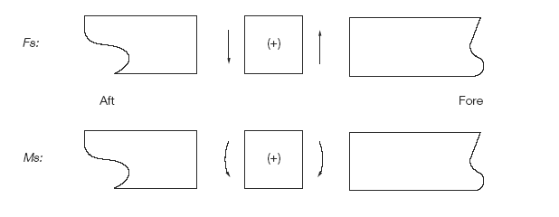

Fig.1  Sign Conventions of *Ms* and *Fs*

For these calculations, downward loads are assumed to be taken as positive values, and are to be integrated in the forward direction from the aft end of *L*. The sign conventions of *Ms* and *Fs* are as shown in Fig. 1.

#### S11.2.1.2 Design loading conditions

In general, the following design cargo and ballast loading conditions, based on amount of bunker, fresh water and stores at departure and arrival, are to be considered for the *Ms* and *Fs* calculations. Where the amount and disposition of consumables at any intermediate stage of the voyage are considered more severe, calculations for such intermediate conditions are to be submitted in addition to those for departure and arrival conditions. Also, where any ballasting and/or deballasting is intended during voyage, calculations of the intermediate condition just before and just after ballasting and/or deballasting any ballast tank are to be submitted and where approved included in the loading manual for guidance.

General cargo ships, roll-on/roll-off and refrigerated cargo carriers, bulk carriers, ore carriers:

- Homogeneous loading conditions at maximum draught;
- Ballast conditions;
- Special loading conditions e.g., light load conditions at less than the maximum draught, heavy cargo, empty holds or non-homogeneous cargo conditions, deck cargo conditions, etc., where applicable;

Oil tankers:

- Homogeneous loading conditions (excluding dry and clean ballast tanks) and ballast or part loaded conditions;
- Any specified non-uniform distribution of loading;
- Mid-voyage conditions relating to tank cleaning or other operations where these differ significantly from the ballast conditions.

Chemical tankers:

- Conditions as specified for oil tankers;
- Conditions for high density or segregated cargo.

Liquefied gas carriers:

- Homogeneous loading conditions for all approved cargoes;
- Ballast conditions;
- Cargo conditions where one or more tanks are empty or partially filled or where more than one type of cargo having significantly different densities are carried.

Combination Carriers:

- Conditions as specified for oil tankers and cargo ships.

#### S11.2.1.3 Partially filled ballast tanks in ballast loading conditions

Ballast loading conditions involving partially filled peak and/or other ballast tanks at departure, arrival or during intermediate conditions are not permitted to be used as design conditions unless:

- design stress limits are satisfied for all filling levels between empty and full, and
- for bulk carriers, UR S17, as applicable, is complied with for all filling levels between empty and full.

To demonstrate compliance with all filling levels between empty and full, it will be acceptable if, in each condition at departure, arrival and where required by S11.2.1.2 any intermediate condition, the tanks intended to be partially filled are assumed to be:

- empty
- full
- partially filled at intended level

Where multiple tanks are intended to be partially filled, all combinations of empty, full or partially filled at intended level for those tanks are to be investigated.

However, for conventional ore carriers with large wing water ballast tanks in cargo area, where empty or full ballast water filling levels of one or maximum two pairs of these tanks lead to the ship's trim exceeding one of the following conditions, it is sufficient to demonstrate compliance with maximum, minimum and intended partial filling levels of these one or maximum two pairs of ballast tanks such that the ship's condition does not exceed any of these trim limits. Filling levels of all other wing ballast tanks are to be considered between empty and full. The trim conditions mentioned above are:

- trim by stern of 3% of the ship's length, or
- trim by bow of 1.5% of ship's length, or
- any trim that cannot maintain propeller immersion *(I/D)* not less than 25%, where,
   *I* =  the distance from propeller centreline to the waterline
   *D* =  propeller diameter
   (see the following figure)

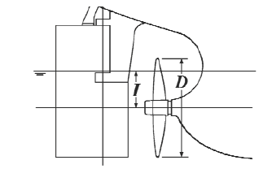

The maximum and minimum filling levels of the above mentioned pairs of side ballast tanks are to be indicated in the loading manual.

Annex 1 contains the guidance for partially filled ballast tanks in ballast loading conditions.

#### S11.2.1.4 Partially filled ballast tanks in cargo loading conditions

In cargo loading conditions, the requirement in S11.2.1.3 applies to the peak tanks only.

#### S11.2.1.5 Sequential ballast water exchange

Requirements of S11.2.1.3 and S11.2.1.4 are not applicable to ballast water exchange using the sequential method. However, bending moment and shear force calculations for each de-ballasting or ballasting stage in the ballast water exchange sequence are to be included in the loading manual or ballast water management plan of any vessel that intends to employ the sequential ballast water exchange method.

### S11.2.2 Wave loads

#### S11.2.2.1 Wave bending moment

The wave bending moments, *Mw*, at each section along the ship length are given by the following formulae:

$$M_W(+) = +190 M C L^2 B C_b \times 10^{-3} \quad \text{(kNm)  For positive moment}$$

$$M_W(-) = -110 M C L^2 B (C_b + 0.7) \times 10^{-3} \quad \text{(kNm)  For negative moment}$$

Where,

*M* = Distribution factor given in Fig. 2

$$C = 10.75 - \left[\frac{300 - L}{100}\right]^{1.5} \quad \text{for } 90 \leq L \leq 300$$

$$\text{or } 10.75 \quad \text{for } 300 \leq L \leq 350$$

$$\text{or } 10.75 - \left[\frac{L - 350}{150}\right]^{1.5} \quad \text{for } 350 \leq L \leq 500$$

*L* = Length of the ships in metres, defined by S2
*B* = Greatest moulded breadth in metres
*Cb* = Block coefficient, defined by S2, but not to be taken less than 0.6

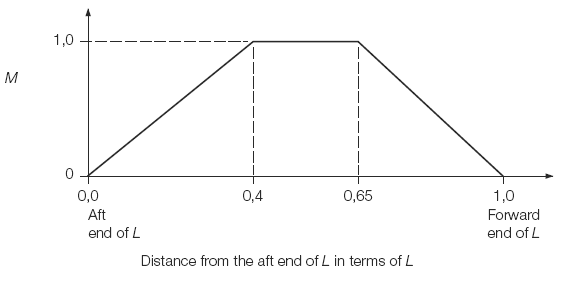

Fig.2  Distribution factor *M*

#### S11.2.2.2 Wave shear force

The wave shear forces, *Fw*, at each section along the length of the ship are given by the following formulae:

$$F_W(+) = +30 F1 C L B (C_b + 0.7) \times 10^{-2} \quad \text{(kN)  For positive shear force}$$

$$F_W(-) = -30 F2 C L B (C_b + 0.7) \times 10^{-2} \quad \text{(kN)  For negative shear force}$$

where,

*F*1, *F*2 = Distribution factors given in Figs. 3 and 4
*C*, *L*, *B*, *Cb* = As specified in S11.2.2.1

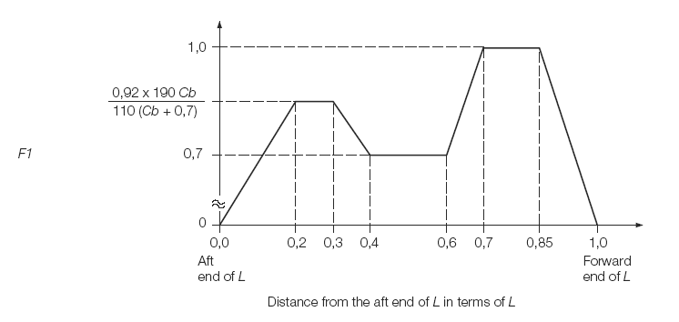

Fig.3  Distribution factor *F*1

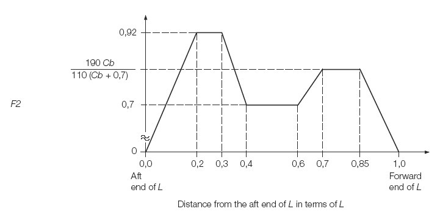

Fig.4  Distribution factor *F*2

## S11.3 Bending strength

### S11.3.1 Bending strength amidships

#### S11.3.1.1 Section modulus

(i) Hull section modulus, Z, calculated in accordance with S5, is not to be less than the values given by the following formula in way of 0.4 *L* midships for the still water bending moments *Ms* given in S11.2.1.1 and the wave bending moments *Mw* given in S11.2.2.1, respectively:

$$\frac{|Ms + Mw|}{\sigma} \times 10^3 \quad \text{(cm}^3\text{)}$$

where,

*σ* =  permissible bending stress = 175/*k* (N/mm2)
*k* =  1.0 for ordinary hull structural steel
*k* <  1.0 for higher tensile steel according to S4.

(ii) In any case, the longitudinal strength of the ship is to be in compliance with S7.

#### S11.3.1.2 Moment of inertia

Moment of inertia of hull section at the midship point is not to be less than

$$I_{min} = 3 C L^3 B (C_b + 0.7) \quad \text{(cm}^4\text{)}$$

where,

*C, L, B, Cb* = As specified in S11.2.2.1.

### S11.3.2 Bending strength outside amidships

The required bending strength outside 0.4*L* amidships is to be determined at the discretion of each Classification Society.

As a minimum, hull girder bending strength checks are to be carried out at the following locations:

- In way of the forward end of the engine room.
- In way of the forward end of the foremost cargo hold.
- At any locations where there are significant changes in hull cross-section.
- At any locations where there are changes in the framing system.

Buckling strength of members contributing to the longitudinal strength and subjected to compressive and shear stresses is to be checked, in particular in regions where changes in the framing system or significant changes in the hull cross-section occur. The buckling evaluation criteria used for this check is determined by each Classification Society.

Continuity of structure is be maintained throughout the length of the ship. Where significant changes in structural arrangement occur adequate transitional structure is to be provided.

For ships with large deck openings, sections at or near to the aft and forward quarter length positions are to be checked. For such ships with cargo holds aft of the superstructure, deckhouse or engine room, strength checks of sections in way of the aft end of the aft-most holds, and the aft end of the deckhouse or engine room are to be performed.

## S11.4 Shearing strength

### S11.4.1 General

The thickness requirements given in S11.4.2 or S11.4.3 apply unless smaller values are proved satisfactory by a method of direct stress calculation approved by each Classification Society, where the calculated shear stress is not to exceed 110/*k* (N/mm2).

### S11.4.2 Shearing strength for ships without effective longitudinal bulkheads

(i) The thickness of side shell is not to be less than the values given by the following formula for the still water shear forces *Fs* given in S11.2.1.1 and the wave shear forces *Fw* given in S11.2.2, respectively:

$$t = \frac{0.5 |Fs + Fw|}{\tau} \frac{S}{I} \times 10^2 \quad \text{(mm)}$$

where,

*I* =  Moment of inertia in cm4 about the horizontal neutral axis at the section under consideration
*S* =  First moment in cm3, about the neutral axis, of the area of the effective longitudinal members between the vertical level at which the shear stress is being determined and the vertical extremity of effective longitudinal members, taken at the section under consideration
*τ* =  permissible shear stress = 110/*k* (N/mm2)
*k* =  As specified in S11.3.1.1 (i)

(ii) The value of *Fs* may be corrected for the direct transmission of forces to the transverse bulkheads at the discretion of each Classification Society.

### S11.4.3 Shearing strength for ships with two effective longitudinal bulkheads

The thickness of side shell and longitudinal bulkheads are not to be less than the values given by the following formulae:

For side shell:

$$t = \frac{|(0.5 - \phi)(F_s + F_w) + \Delta F_{sh}|}{\tau} \frac{S}{I} \times 10^2 \quad \text{(mm)}$$

For longitudinal bulkheads:

$$t = \frac{|\phi (F_s + F_w) + \Delta F_{bl}|}{\tau} \frac{S}{I} \times 10^2 \quad \text{(mm)}$$

where,

*Φ* =  ratio of shear force shared by the longitudinal bulkhead to the total shear force, and given by each Classification Society.
Δ*Fsh*, Δ*Fbl* =  shear force acting upon the side shell plating and longitudinal bulkhead plating, respectively, due to local loads, and given by each Classification Society, subject to the sign convention specified in S11.2.1.1
*S, I, τ* =  As specified in S11.4.2 (i)

## S11.5 Buckling strength

### S11.5.1 Application

These requirements apply to plate panels and longitudinals subject to hull girder bending and shear stresses.

### S11.5.2 Elastic buckling stresses

#### S11.5.2.1 Elastic buckling of plates

1. Compression

The ideal elastic buckling stress is given by:

$$\sigma_E = 0.9 m E \left(\frac{t_b}{1000 s}\right)^2 \quad \text{(N/mm}^2\text{)}$$

For plating with longitudinal stiffeners (parallel to compressive stress):

$$m = \frac{8.4}{\psi + 1.1} \quad \text{for } 0 \leq \psi \leq 1$$

For plating with transverse stiffeners (perpendicular to compressive stress)

$$m = c \left[1 + \left(\frac{s}{\ell}\right)^2\right]^2 \frac{2.1}{\psi + 1.1} \quad \text{for } 0 \leq \psi \leq 1$$

where,

E =  modulus of elasticity of material
  =  2.06 × 105 N/mm2 for steel
tb =  net thickness, in mm, of plating, considering standard deductions equal to the values given in the table here after:

| Structure | Standard deduction (mm) | Limit values min-max (mm) |
|---|---|---|
| - Compartments carrying dry bulk cargoes  - One side exposure to ballast and/or liquid cargo Vertical surfaces and surfaces sloped at an angle greater than 250 to the horizontal line | 0.05 t | 0.5 - 1 |
| - One side exposure to ballast and/or liquid cargo Horizontal surfaces and surfaces sloped at an angle less than 250 to the horizontal line  - Two side exposure to ballast and/or liquid cargo Vertical surfaces and surfaces sloped at an angle greater than 250 to the horizontal line | 0.10 t | 2 - 3 |
| - Two side exposure to ballast and/or liquid cargo Horizontal surfaces and surfaces sloped at an angle less than 250 to the horizontal line | 0.15 t | 2 - 4 |

s =  shorter side of plate panel, in m
ℓ =  longer side of plate panel, in m
c =  1.3 when plating stiffened by floors or deep girders
  =  1.21 when stiffeners are angles or T-sections
  =  1.10 when stiffeners are bulb flats
  =  1.05 when stiffeners are flat bars
ψ =  ratio between smallest and largest compressive σa stress when linear variation across panel.

2. Shear

The ideal elastic buckling stress is given by:

$$\tau_E = 0.9 k_t E \left(\frac{t_b}{1000 s}\right)^2 \quad \text{(N/mm}^2\text{)}$$

$$k_t = 5.34 + 4 \left(\frac{s}{\ell}\right)^2$$

E, tb, s and ℓ are given in 1.

#### S11.5.2.2 Elastic buckling of longitudinals

1. Column buckling without rotation of the cross section

For the column buckling mode (perpendicular to plane of plating) the ideal elastic buckling stress is given by:

$$\sigma_E = 0.001 E \frac{I_a}{A \ell^2} \quad \text{(N/mm}^2\text{)}$$

where:

Ia =  moment of inertia, in cm4, of longitudinal, including plate flange and calculated with thickness as specified in S11.5.2.1.1
A =  cross-sectional area, in cm2, of longitudinal, including plate flange and calculated with thickness as specified in S11.5.2.1.1
ℓ =  span, in m, of longitudinal

A plate flange equal to the frame spacing may be included.

2. Torsional buckling mode

The ideal elastic buckling stress for the torsional mode is given by:

$$\sigma_E = \frac{\pi^2 E I_w}{10^4 I_p \ell^2} \left(m^2 + \frac{K}{m^2}\right) + 0.385 E \frac{I_t}{I_p} \quad \text{(N/mm}^2\text{)}$$

where:

$$K = \frac{C \ell^4}{\pi^4 E I_w} 10^6$$

m =  number of half waves, given by the following table:

| | 0 < K < 4 | 4 < K < 36 | 36 < K < 144 | (m-1)2m2 < K ≤ m2(m+1)2 |
|---|---|---|---|---|
| m | 1 | 2 | 3 | m |

It =  St Venant's moment of inertia, in cm4, of profile (without plate flange)

$$= \frac{h_w t_w^3}{3} 10^{-4} \quad \text{for flat bars (slabs)}$$

$$= \frac{1}{3} \left[h_w t_w^3 + b_f t_f^3 \left(1 - 0.63 \frac{t_f}{b_f}\right)\right] 10^{-4} \quad \text{for flanged profiles}$$

Ip =  polar moment of inertia, in cm4, of profile about connection of stiffener to plate

$$= \frac{h_w^3 t_w}{3} 10^{-4} \quad \text{for flat bars (slabs)}$$

$$= \left(\frac{h_w^3 t_w}{3} + h_w^2 b_f t_f\right) 10^{-4} \quad \text{for flanged profiles}$$

Iw =  sectorial moment of inertia, in cm6, of profile about connection of stiffener to plate

$$= \frac{h_w^3 t_w^3}{36} 10^{-6} \quad \text{for flat bars (slabs)}$$

$$= \frac{t_f b_f^3 h_w^2}{12} 10^{-6} \quad \text{for "Tee" profiles}$$

$$= \frac{b_f^3 h_w^2}{12 (b_f + h_w)^2} \left[t_f (b_f^2 + 2 b_f h_w + 4 h_w^2) + 3 t_w b_f h_w\right] 10^{-6} \quad \text{for angles and bulb profiles}$$

hw =  web height, in mm
tw =  web thickness, in mm, considering standard deductions as specified in S11.5.2.1.1
bf =  flange width, in mm
tf =  flange thickness, in mm, considering standard deductions as specified in S11.5.2.1.1. For bulb profiles the mean thickness of the bulb may be used.
ℓ =  span of profile, in m
s =  spacing of profiles, in m
C =  spring stiffness exerted by supporting plate p

$$= \frac{k_p E t_p^3}{3 s \left(1 + \frac{1.33 k_p h_w t_p^3}{1000 s t_w^3}\right)} 10^{-3}$$

$$k_p = 1 - \eta_p \quad \text{not to be taken less than zero}$$

tp =  plate thickness, in mm, considering standard deductions as specified in S11.5.2.1.1

$$\eta_p = \frac{\sigma_a}{\sigma_{Ep}}$$

σa =  calculated compressive stress. For longitudinals, see S11.5.4.1
σEp =  elastic buckling stress of supporting plate as calculated in S11.5.2.1

For flanged profiles, kp need not be taken less than 0.1.

3. Web and flange buckling

For web plate of longitudinals the ideal elastic buckling stress is given by:

$$\sigma_E = 3.8 E \left(\frac{t_w}{h_w}\right)^2 \quad \text{(N/mm}^2\text{)}$$

For flanges on angles and T-sections of longitudinals, buckling is taken care of by the following requirement:

$$\frac{b_f}{t_f} \leq 15$$

bf =  flange width, in mm, for angles, half the flange width for T-sections.
tf =  as built flange thickness.

### S11.5.3 Critical buckling stresses

#### S11.5.3.1 Compression

The critical buckling stress in compression σc is determined as follows:

$$\sigma_c = \sigma_E \quad \text{when } \sigma_E \leq \frac{\sigma_F}{2}$$

$$= \sigma_F \left(1 - \frac{\sigma_F}{4 \sigma_E}\right) \quad \text{when } \sigma_E > \frac{\sigma_F}{2}$$

σF =  yield stress of material, in N/mm2. σF may be taken as 235 N/mm2 for mild steel.
σE =  ideal elastic buckling stress calculated according to S11.5.2.

#### S11.5.3.2 Shear

The critical buckling stress in shear τc is determined as follows:

$$\tau_c = \tau_E \quad \text{when } \tau_E \leq \frac{\tau_F}{2}$$

$$= \tau_F \left(1 - \frac{\tau_F}{4 \tau_E}\right) \quad \text{when } \tau_E > \frac{\tau_F}{2}$$

where:

$$\tau_F = \frac{\sigma_F}{\sqrt{3}}$$

σF =  as given in S11.5.3.1.
τE =  ideal elastic buckling stress in shear calculated according to S11.5.2.1.2.

### S11.5.4 Working stress

#### S11.5.4.1 Longitudinal compressive stresses

The compressive stresses are given in the following formula:

$$\sigma_a = \frac{M_s + M_w}{I_n} y \times 10^5 \quad \text{N/mm}^2$$

$$= \text{minimum } \frac{30}{k}$$

where:
*Ms* =  still water bending moment (kNm), as given in S11.2.1
*Mw* =  wave bending moment (kNm) as given in S11.2.2.1
*In* =  moment of inertia, in cm4, of the hull girder
y =  vertical distance, in m, from neutral axis to considered point
*k* =  as specified in S11.3.1.1 (i)

*Ms* and *Mw* are to be taken as sagging or hogging bending moments, respectively, for members above or below the neutral axis.

Where the ship is always in hogging condition in still water, the sagging bending moment (*Ms* + *Mw*) is to be specially considered.

#### S11.5.4.2 Shear stresses

1. Ships without effective longitudinal bulkheads

For side shell

$$\tau_a = \frac{0.5 |F_s + F_w|}{t} \frac{S}{I} 10^2 \quad \text{N/mm}^2$$

where:
Fs, Fw, t, S, I as specified in S11.4.2.

2. Ships with two effective longitudinal bulkheads

For side shell

$$\tau_a = \frac{|(0.5 - \phi)(F_s + F_w) + \Delta F_{sh}|}{t} \frac{S}{I} 10^2 \quad \text{N/mm}^2$$

For longitudinal bulkheads

$$\tau_a = \frac{|\phi (F_s + F_w) + \Delta F_{bl}|}{t} \frac{S}{I} 10^2 \quad \text{N/mm}^2$$

where:
Fs, Fw, ΔFsh, ΔFbl, t, S, I as specified in S11.4.3.

### S11.5.5 Scantling criteria

#### S11.5.5.1 Buckling Stress

The design buckling stress σc of plate panels and longitudinals (as calculated in S11.5.3.1) is not to be less than:

$$\sigma_c \geq \beta \sigma_a$$

where:

β =  1 for plating and for web plating of stiffeners (local buckling)
β =  1.1 for stiffeners

The critical buckling stress τc of plate panels (as calculated in S11.5.3.2) is not to be less than:

$$\tau_c \geq \tau_a$$

## Annex 1 - Guidelines for UR S11.2.1.3 for ballast loading conditions of cargo vessels involving partially filled ballast tanks

### 1. General guidance note regarding the use of UR S11.2.1.3

1.1 This document is intended for guidance and interpretation of UR S11.2.1.3 "Partially filled ballast tanks in ballast loading conditions".

1.2 Case A and B are generally applicable for ballast loading conditions for any cargo vessel which might have one Ballast Water (BW) Tank (or one pair of BW Tanks) partially filled.

1.3 Case C is showing the conditions necessary for checking longitudinal strength for a conventional ore carrier with two pairs of large wing water ballast tanks partly filled during the ballast voyage.

1.4 Where applicable, similar considerations are to be given to other cargo vessels covered by UR S11 where ballast loading conditions involving partially filled ballast tanks may cause concerns for the longitudinal strength of the vessels.

1.5 This Annex does not apply to CSR Bulk Carriers and Oil Tankers or to container ships to which UR S11A is applicable.

1.6 In the Figures, the conditions only intended for strength verification (not operational) are marked with a star (\*).

### 2. Case A and B

#### 2.1 Case A

Fig. 1 shows Case A, with a cargo vessel where partial filling of BW Tank no. 6 (P/S) is permitted and may take place at any time during the ballast voyage. Intermediate condition(s) should be specified as shown in the Figure, however filling/partial filling of BW Tank no. 6 (P/S) may be done at any step to keep acceptable trim and propeller immersion during the ballast voyage.

To obtain full operational flexibility regarding the filling level of BW Tank no. 6 (P/S), loading conditions A2 (full at departure)\* and A8 (empty at arrival)\* shall be added for strength verification. Additional conditions (full and empty BW Tank no. 6 (P/S)) related to the intermediate conditions A3-A6 are not necessary as A2\* and A8\* will be the most critical one.

#### 2.2 Case B

Fig. 2 shows Case B, with a cargo vessel where partial filling of BW Tank no. 6 (P/S) to a given level (f6-int%) will be done after a specified % consumables is reached, see conditions B2 and B3. Before this % consumables (shown as 50% in this Figure) is reached, BW Tank no. 6 (P/S) shall be kept empty. When reaching a given level of consumables (shown as 20% in Figure 2), BW Tank no. 6 (P/S) shall be kept full, see conditions B5 and B6. Two additional intermediate conditions (B4\* and B7\*) shall be added for longitudinal strength verification.

In order to categorize a vessel according to Case B, clear operational guidance for partial filling of ballast tanks, in association with the consumption level as shown in Figure 2, is to be given in the loading manual. If such operational guidance is not given, Case A is to be applied.

Case A has no limitation of consumables, whereas Case B has limitation of consumables.

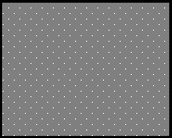

**Figure 1**     Case A, Partial filling of ballast tank no. 6 (P/S) is permitted at any stage during voyage.  The intermediate conditions are specified, however other partial filling of BW Tank no. 6 (P/S) may be applied to keep acceptable trim and propeller immersion during the ballast voyage. Conditions only intended for strength verification (not operational) are marked: \*

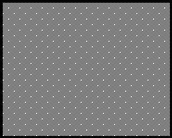

Notes
(1) For peak tanks intended to be partially filled, all combinations of full or partially filled at intended level for those tanks are to be investigated.
(2) The intermediate condition(s) to be specified incl. % consumables.
(3) For bulk carriers carrying ore and with large wing water ballast tanks full/empty may be replaced with maximum/minimum filling levels according to trim limitations given in S11.2.1.3.

**Figure 1**     (Continued)
Case A, Partial filling of ballast tank no. 6 (P/S) is permitted at any stage during voyage.  The intermediate condition is specified, however other partial filling of BW Tank no. 6 (P/S) may be applied to keep acceptable trim and propeller immersion during the ballast voyage.  Conditions only intended for strength verification (not operational) are marked: \*

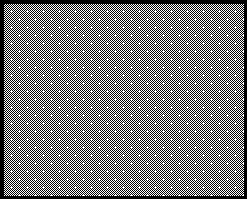

**Figure 2**     Case B, Partial filling of BW Tank no. 6 (P/S) only allowed during intermediate conditions, in this example between 50-20% consumables. Conditions only intended for strength verification (not operational) are marked: \*

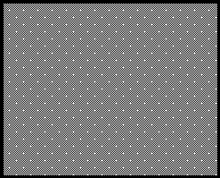

Notes
(1) For peak tanks intended to be partially filled, all combinations of full or partially filled at intended level for those tanks are to be investigated.
(2) The intermediate condition(s) to be specified incl. % consumables.
(3) For bulk carriers carrying ore and with large wing water ballast tanks full/empty may be replaced with maximum/minimum filling levels according to trim limitations given in S11.2.1.3.

**Figure 2**     (Continued)
Case B, Partial filling of BW Tank no. 6 (P/S) only allowed during intermediate conditions, in this example between 50-20% consumables. Conditions only intended for strength verification (not operational) are marked: \*

### 3. Case C – Conventional (with usual arrangement of WBT) ore carrier with two pairs of partially filled ballast water tanks

Fig. 3(a) show the operational loading conditions, departure condition (C1), four intermediate conditions (C2-C5) and arrival condition (C6), for a conventional (with usual arrangement of WBT) ore carrier with partial filling of both BW tank no.1 (P/S) and 7 (P/S) during voyage.

| Loading cond. | Consumables | Filling level, WBT 1 (P/S) | Filling level, WBT 7 (P/S) |
|---|---|---|---|
| C1 - Departure | 100% | f1dep% | f7dep% |
| C2 – Intermediate  1 | 50% (i) | f1int% | f7int% |
| C3 – Intermediate  2 | 50% (i) | f1int% | f7int% |
| C4 – Intermediate  3 | 20% (i) | f1int% | f7int% |
| C5 – Intermediate  4 | 20% (i) | f1arr% | f7arr% |
| C6 - Arrival | 10% | f1arr% | f7arr% |

Note:
(i) % consumables to be specified, indicated to 50% and 20 %

**Table 1**     Filling level in partially filled BW tanks nos.1 (P/S) and 7 (P/S) for the operational conditions during ballast voyage.

Fig. 3(b) and Fig. 3(c) show the additional twelve loading conditions (C1-1 ~ C1-12) which shall be added for longitudinal strength verification of the departure condition (C1).

Fig. 3(d) and Fig. 3(i) show the additional 32 loading conditions (C2-1 ~ C2-12, C3-1 ~ C3-4, C4-1 ~ C4-12 and C5-1 ~ C5-4) which shall be added for longitudinal strength verification of the intermediate conditions (C2 ~ C5).

Fig. 3(j) and Fig. 3(k) show the additional twelve loading conditions (C6-1 ~ C6-12) which shall be added for longitudinal strength verification of the arrival condition (C6).

For the additional loading conditions, the maximum and minimum filling level of BW tank are according to trim and propeller immersion limitations given in S11.2.1.3:

However, for conventional ore carriers with large wing water ballast tanks in cargo area, where empty or full ballast water filling levels of one or maximum two pairs of these tanks lead to the ship's trim exceeding one of the following conditions, it is sufficient to demonstrate compliance with maximum, minimum and intended partial filling levels of these one or maximum two pairs of ballast tanks such that the ship's condition does not exceed any of these trim limits. Filling levels of all other wing ballast tanks are to be considered between empty and full. The trim conditions mentioned above are:

- *trim by stern of 3% of the ship's length, or*
- *trim by bow of 1.5% of ship's length, or*
- *any trim that cannot maintain propeller immersion (I/D) not less than 25%, where;*
   *I = the distance from propeller centerline to the waterline*
   *D = propeller diameter*
   *(see the following figure)*

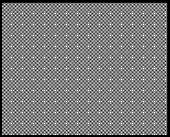

Notes
(1) The intermediate condition(s) to be specified incl. % consumables.
(2) Figures 3(b)-3(k): Maximum and minimum filling level of BW tank according to trim and propeller immersion limitations given in S11.2.1.3.

**Figure 3(a)**     Case C, Ore Carrier. Partial filling of BW Tank no.1 (P/S) and 7 (P/S) during ballast voyage, operational conditions C1-C6.

**Figure 3(b)**     Case C, Ore Carrier. Partial filling of BW Tank no.1 (P/S) and 7 (P/S) during voyage. Departure conditions C1-1~C1-6, only intended for strength verification (not operational) are marked: \*

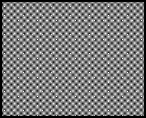

**Figure 3(c)**     Case C, Ore Carrier. Partial filling of BW Tank no.1 (P/S) and 7 (P/S) during voyage. Departure conditions CD1-7~C1-12, only intended for strength verification (not operational) are marked: \*

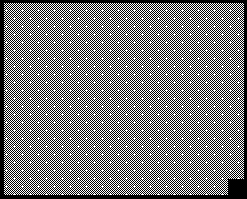

**Figure 3(d)**     Case C, Ore Carrier. Partial filling of BW Tank no.1 (P/S) and 7 (P/S) during voyage. Intermediate conditions C2-1~C2-6, only intended for strength verification (not operational) are marked: \*

**Figure 3(e)**     Case C, Ore Carrier. Partial filling of BW Tank no.1 (P/S) and 7 (P/S) during voyage. Intermediate conditions C2-7~C2-12, only intended for strength verification (not operational) are marked: \*

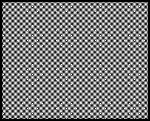

**Figure 3(f)**     Case C, Ore Carrier. Partial filling of BW Tank no.1 (P/S) and 7 (P/S) during voyage. Intermediate conditions C3-1~C3-4, only intended for strength verification (not operational) are marked: \*

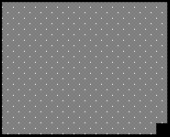

**Figure 3(g)**     Case C, Ore Carrier. Partial filling of BW Tank no.1 (P/S) and 7 (P/S) during voyage. Intermediate conditions C4-1~C4-6, only intended for strength verification (not operational) are marked: \*

**Figure 3(h)**     Case C, Ore Carrier. Partial filling of BW Tank no.1 (P/S) and 7 (P/S) during voyage. Intermediate conditions C4-7~C4-12, only intended for strength verification (not operational) are marked: \*

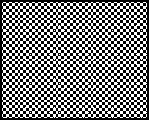

**Figure 3(i)**     Case C, Ore Carrier. Partial filling of BW Tank no.1 (P/S) and 7 (P/S) during voyage. Intermediate conditions C5-1~C5-4, only intended for strength verification (not operational) are marked: \*

**Figure 3(j)**     Case C, Ore Carrier. Partial filling of BW Tank no.1 (P/S) and 7 (P/S) during voyage. Arrival conditions C6-1~C6-6, only intended for strength verification (not operational) are marked: \*

**Figure 3(k)**     Case C, Ore Carrier. Partial filling of BW Tank no.1 (P/S) and 5 (P/S) during voyage. Arrival conditions C6-7~C6-12, only intended for strength verification (not operational) are marked: \*

End of Document
