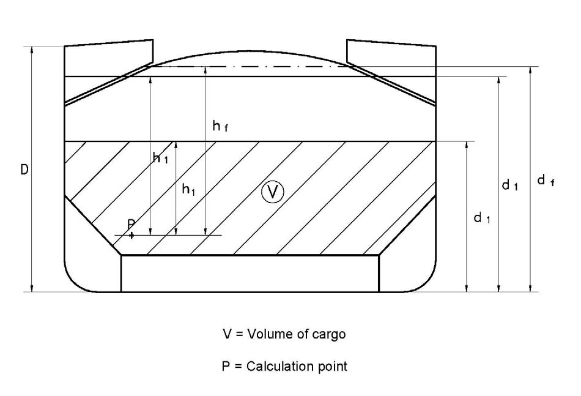
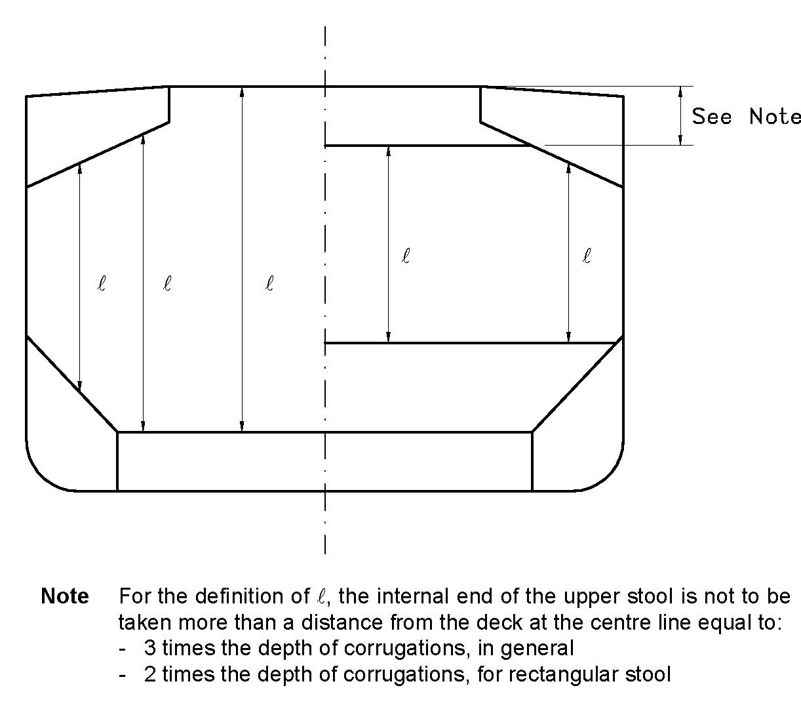
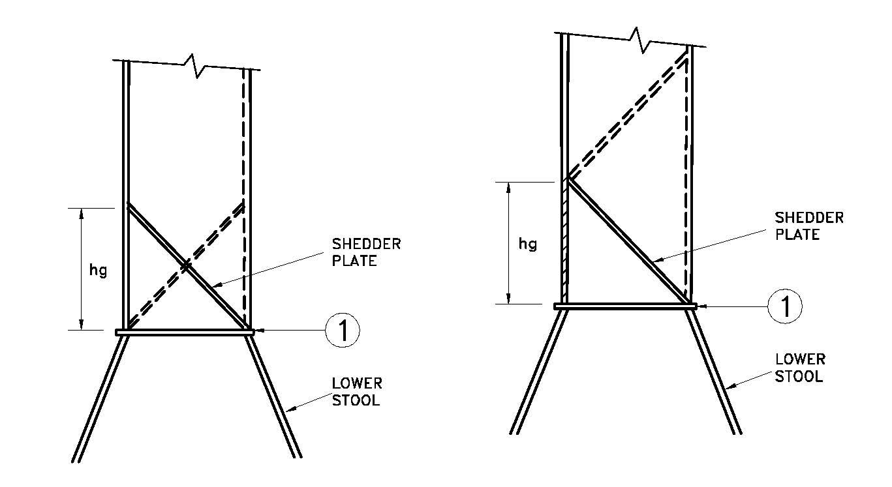
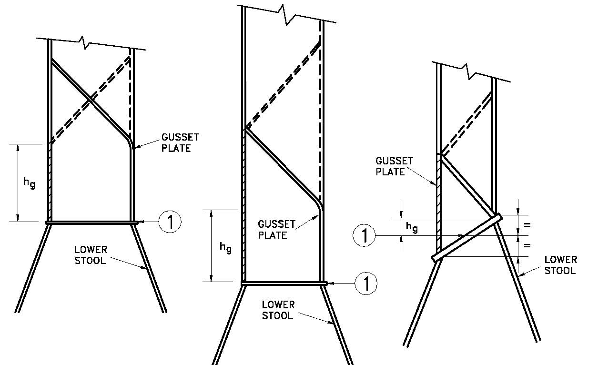
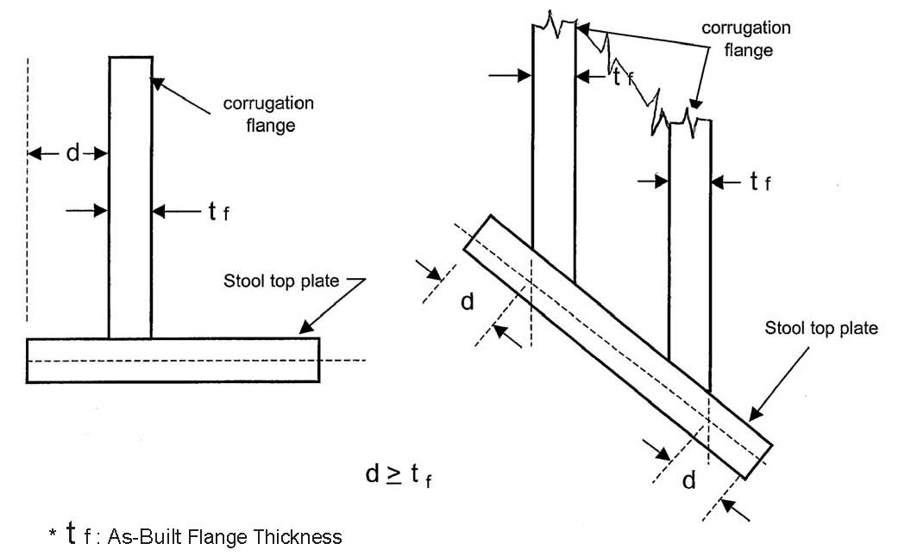
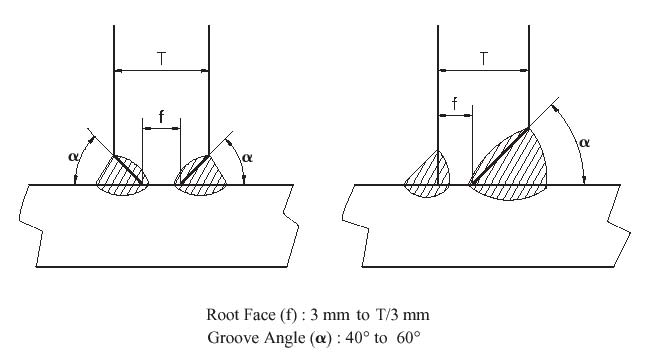

<!-- markdownlint-disable MD033 -->
# S18 - Evaluation of Scantlings of Corrugated Transverse Watertight Bulkheads in Non-CSR Bulk Carriers Considering Hold Flooding

S18
(1997)
(Rev.1 1997)
(Rev.1.1 Mar 1998 /Corr.1)
(Rev.2 Sep 2000)
(Rev.3 Feb 2001)
(Rev.4 Nov 2001)
(Rev.5 July 2003)
(Rev.6 July 2004)
(Rev.7 Feb 2006)
(Corr.1 Oct 2009)
(Rev.8 May 2010)
(Rev.9 Apr 2014)
(Rev.10 Mar 2019)

## S18.1 - Application and definitions

Revision 7 or subsequent revisions or corrigenda as applicable of this UR is to be applied to non-CSR bulk carriers of 150 m in length and upwards, intending to carry solid bulk cargoes having a density of 1.0 t/m3 or above, with vertically corrugated transverse watertight bulkheads, and with,

a) Single side skin construction, or

b) Double side skin construction in which any part of longitudinal bulkhead is located within B/5 or 11.5 m, whichever is less, inboard from the ship's side at right angle to the centreline at the assigned summer load line

in accordance with Note 2.

The net thickness tnet is the thickness obtained by applying the strength criteria given in S18.4.

The required thickness is obtained by adding the corrosion addition ts, given in S18.6, to the net thickness tnet.

In this requirement, homogeneous loading condition means a loading condition in which the ratio between the highest and the lowest filling ratio, evaluated for each hold, does not exceed 1.20, to be corrected for different cargo densities.

This UR does not apply to CSR Bulk Carriers.

Notes:

1. The "contracted for construction" date means the date on which the contract to build the vessel is signed between the prospective owner and the shipbuilder. For further details regarding the date of "contract for construction", refer to IACS Procedural Requirement (PR) No. 29.

2. Revision 7 or subsequent revisions or corrigenda as applicable of this UR is to be applied by IACS Societies to ships contracted for construction on or after 1 July 2006.

3. Revision 10 or subsequent revisions or corrigenda as applicable of this UR is to be applied by IACS Societies to ships contracted for construction on or after 1 July 2020.

## S18.2 - Load model

### S18.2.1 - General

The loads to be considered as acting on the bulkheads are those given by the combination of the cargo loads with those induced by the flooding of one hold adjacent to the bulkhead under examination. In any case, the pressure due to the flooding water alone is to be considered. This application is to be applied to self-unloading bulk carriers (SUBC) where the unloading system maintains the watertightness during seagoing operations. In SUBCs with unloading systems that do not maintain watertightness, the combination loads acting on the bulkheads in the flooded conditions are to be considered using the extent to which the flooding may occur.

The most severe combinations of cargo induced loads and flooding loads are to be used for the check of the scantlings of each bulkhead, depending on the loading conditions included in the loading manual:

- homogeneous loading conditions;

- non homogeneous loading conditions;

considering the individual flooding of both loaded and empty holds.

The specified design load limits for the cargo holds are to be represented by loading conditions defined by the Designer in the loading manual.

Non homogeneous part loading conditions associated with multiport loading and unloading operations for homogeneous loading conditions need not to be considered according to these requirements.

Holds carrying packed cargoes are to be considered as empty holds for this application.

Unless the ship is intended to carry, in non homogeneous conditions, only iron ore or cargo having bulk density equal or greater than 1.78 t/m3, the maximum mass of cargo which may be carried in the hold shall also be considered to fill that hold up to the upper deck level ***at centreline***.

### S18.2.2 - Bulkhead corrugation flooding head

The flooding head hf (see Figure 1) is the distance, in m, measured vertically with the ship in the upright position, from the calculation point to a level located at a distance df, in m, from the baseline equal to:

a) in general:

- D for the foremost transverse corrugated bulkhead

- 0.9D for the other bulkheads

Where the ship is to carry cargoes having bulk density less than 1.78 t/m3 in non homogeneous loading conditions, the following values can be assumed:

- 0.95D for the foremost transverse corrugated bulkhead

- 0.85D for the other bulkheads

b) for ships less than 50,000 tonnes deadweight with Type B freeboard:

- 0.95D for the foremost transverse corrugated bulkhead

- 0.85D for the other bulkheads

Where the ship is to carry cargoes having bulk density less than 1.78 t/m3 in non homogeneous loading conditions, the following values can be assumed:

- 0.9D for the foremost transverse corrugated bulkhead

- 0.8D for the other bulkheads

D being the distance, in m, from the baseline to the freeboard deck at side amidship (see Figure 1).

### S18.2.3 - Pressure in the non-flooded bulk cargo loaded holds

At each point of the bulkhead, the pressure pc, in kN/m2, is given by:

$$p_c = \rho_c g h_1 \tan^2 \gamma$$

where:

ρc = bulk cargo density, in t/m3

g = 9.81 m/s2, gravity acceleration

h1 = vertical distance, in m, from the calculation point to horizontal plane corresponding to the level height of the cargo (see Figure 1), located at a distance d1, in m, from the baseline.

γ = 45° - (φ/2)

φ = angle of repose of the cargo, in degrees, that may generally be taken as 35° for iron ore and 25° for cement

The force Fc, in kN, acting on a corrugation is given by:

$$F_c = \rho_c g s_1 \frac{(d_1 - h_{DB} - h_{LS})^2}{2} \tan^2 \gamma$$

where:

ρc, g, d1, γ = as given above

s1 = spacing of corrugations, in m (see Figure 2a)

hLS = mean height of the lower stool, in m, from the inner bottom

hDB = height of the double bottom, in m

### S18.2.4 - Pressure in the flooded holds

#### S18.2.4.1 - Bulk cargo holds

Two cases are to be considered, depending on the values of d1 and df.

a) df ≥ d1

At each point of the bulkhead located at a distance between d1 and df from the baseline, the pressure pc,f, in kN/m2, is given by:

$$p_{c,f} = \rho g h_f$$

where:

ρ = sea water density, in t/m3

g = as given in S18.2.3

hf = flooding head as defined in S18.2.2

At each point of the bulkhead located at a distance lower than d1 from the baseline, the pressure pc,f, in kN/m2, is given by:

$$p_{c,f} = \rho g h_f + [\rho_c - \rho(1 - perm)] g h_1 \tan^2 \gamma$$

where:

ρ, hf = as given above

ρc, g, h1, γ = as given in S18.2.3

perm = permeability of cargo, to be taken as 0.3 for ore (corresponding bulk cargo density for iron ore may generally be taken as 3.0 t/m3), coal cargoes and for cement (corresponding bulk cargo density for cement may generally be taken as 1.3 t/m3)

The force Fc,f, in kN, acting on a corrugation is given by:

$$F_{c,f} = s_1 \left[ \rho g \frac{(d_f - d_1)^2}{2} + \frac{\rho g (d_f - d_1) + (p_{c,f})_{le}}{2} (d_1 - h_{DB} - h_{LS}) \right]$$

where:

ρ = as given above

s1, g, d1, hDB, hLS = as given in S18.2.3

df = as given in S18.2.2

(pc,f)le = pressure, in kN/m2, at the lower end of the corrugation

b) df < d1

At each point of the bulkhead located at a distance between df and d1 from the baseline, the pressure pc,f, in kN/m2, is given by:

$$p_{c,f} = \rho_c g h_1 \tan^2 \gamma$$

where:

ρc, g, h1, γ = as given in S18.2.3

At each point of the bulkhead located at a distance lower than df from the baseline, the pressure pc,f, in kN/m2, is given by:

$$p_{c,f} = \rho g h_f + [\rho_c h_1 - \rho(1 - perm) h_f] g \tan^2 \gamma$$

where:

ρ, hf, perm = as given in a) above

ρc, g, h1, γ = as given in S18.2.3

The force Fc,f, in kN, acting on a corrugation is given by:

$$F_{c,f} = s_1 \left[ \rho_c g \frac{(d_1 - d_f)^2}{2} \tan^2 \gamma + \frac{\rho_c g (d_1 - d_f) \tan^2 \gamma + (p_{c,f})_{le}}{2} (d_f - h_{DB} - h_{LS}) \right]$$

where:

s1, ρc, g, d1, γ, hDB, hLS = as given in S18.2.3

df = as given in S18.2.2

(pc,f)le = pressure, in kN/m2, at the lower end of the corrugation

#### S18.2.4.2 - Pressure in empty holds due to flooding water alone

At each point of the bulkhead, the hydrostatic pressure pf induced by the flooding head hf is to be considered.

The force Ff, in kN, acting on a corrugation is given by:

$$F_f = s_1 \rho g \frac{(d_f - h_{DB} - h_{LS})^2}{2}$$

where:

s1, g, hDB, hLS = as given in S18.2.3

ρ = as given in S18.2.4.1 a)

df = as given in S18.2.2

### S18.2.5 - Resultant pressure and force

#### S18.2.5.1 - Homogeneous loading conditions

At each point of the bulkhead structures, the resultant pressure p, in kN/m2, to be considered for the scantlings of the bulkhead is given by:

$$p = p_{c,f} - 0.8 p_c$$

The resultant force F, in kN, acting on a corrugation is given by:

$$F = F_{c,f} - 0.8 F_c$$

#### S18.2.5.2 - Non homogeneous loading conditions

At each point of the bulkhead structures, the resultant pressure p, in kN/m2, to be considered for the scantlings of the bulkhead is given by:

$$p = p_{c,f}$$

The resultant force F, in kN, acting on a corrugation is given by:

$$F = F_{c,f}$$

## S18.3 - Bending moment and shear force in the bulkhead corrugations

The bending moment M and the shear force Q in the bulkhead corrugations are obtained using the formulae given in S18.3.1 and S18.3.2. The M and Q values are to be used for the checks in S18.4.5.

### S18.3.1 - Bending moment

The design bending moment M, in kNm, for the bulkhead corrugations is given by:

$$M = \frac{F \ell}{8}$$

where:

F = resultant force, in kN, as given in S18.2.5

ℓ = span of the corrugation, in m, to be taken according to Figures 2a and 2b

### S18.3.2 - Shear force

The shear force Q, in kN, at the lower end of the bulkhead corrugations is given by:

$$Q = 0.8 F$$

where:

F = as given in S18.2.5

## S18.4 - Strength criteria

### S18.4.1 - General

The following criteria are applicable to transverse bulkheads with vertical corrugations (see Figure 2). For ships of 190 m of length and above, these bulkheads are to be fitted with a lower stool, and generally with an upper stool below deck. For smaller ships, corrugations may extend from inner bottom to deck; if the stool is fitted, it is to comply with the requirements in S18.4.1.

The corrugation angle φ shown in Figure 2a is not to be less than 55°.

Requirements for local net plate thickness are given in S18.4.7.

In addition, the criteria as given in S18.4.2 and S18.4.5 are to be complied with.

The thicknesses of the lower part of corrugations considered in the application of S18.4.2 and S18.4.3 are to be maintained for a distance from the inner bottom (if no lower stool is fitted) or the top of the lower stool not less than 0.15ℓ.

The thicknesses of the middle part of corrugations as considered in the application of S18.4.2 and S18.4.4 are to be maintained to a distance from the deck (if no upper stool is fitted) or the bottom of the upper stool not greater than 0.3ℓ.

The section modulus of the corrugation in the remaining upper part of the bulkhead is not to be less than 75% of that required for the middle part, corrected for different yield stresses.

(a) - Lower stool

The height of the lower stool is generally to be not less than 3 times the depth of the corrugations. The thickness and material of the stool top plate is not to be less than those required for the bulkhead plating above. The thickness and material of the upper portion of vertical or sloping stool side plating within the depth equal to the corrugation flange width from the stool top is not to be less than the required flange plate thickness and material to meet the bulkhead stiffness requirement at lower end of corrugation. The thickness of the stool side plating and the section modulus of the stool side stiffeners is not to be less than those required by each Society on the basis of the load model in S18.2. The ends of stool side vertical stiffeners are to be attached to brackets at the upper and lower ends of the stool.

The distance from the edge of the stool top plate to the surface of the corrugation flange is to be in accordance with Figure 5. The stool bottom is to be installed in line with double bottom floors and is to have a width not less than 2.5 times the mean depth of the corrugation. The stool is to be fitted with diaphragms in line with the longitudinal double bottom girders for effective support of the corrugated bulkhead. Scallops in the brackets and diaphragms in way of the connections to the stool top plate are to be avoided.

Where corrugations are cut at the lower stool, corrugated bulkhead plating is to be connected to the stool top plate by full penetration welds. The stool side plating is to be connected to the stool top plate and the inner bottom plating by either full penetration or deep penetration welds (see Figure 6). The supporting floors are to be connected to the inner bottom by either full penetration or deep penetration welds (see Figure 6).

(b) - Upper stool

The upper stool, where fitted, is to have a height generally between 2 and 3 times the depth of corrugations. Rectangular stools are to have a height generally equal to 2 times the depth of corrugations, measured from the deck level and at hatch side girder. The upper stool is to be properly supported by girders or deep brackets between the adjacent hatch-end beams.

The width of the stool bottom plate is generally to be the same as that of the lower stool top plate. The stool top of non rectangular stools is to have a width not less then 2 times the depth of corrugations. The thickness and material of the stool bottom plate are to be the same as those of the bulkhead plating below. The thickness of the lower portion of stool side plating is not to be less than 80% of that required for the upper part of the bulkhead plating where the same material is used. The thickness of the stool side plating and the section modulus of the stool side stiffeners is not to be less than those required by each Society on the basis of the load model in S18.2. The ends of stool side stiffeners are to be attached to brackets at upper and lower end of the stool. Diaphragms are to be fitted inside the stool in line with and effectively attached to longitudinal deck girders extending to the hatch end coaming girders for effective support of the corrugated bulkhead. Scallops in the brackets and diaphragms in way of the connection to the stool bottom plate are to be avoided.

(c) - Alignment

At deck, if no stool is fitted, two transverse reinforced beams are to be fitted in line with the corrugation flanges.

At bottom, if no stool is fitted, the corrugation flanges are to be in line with the supporting floors.

Corrugated bulkhead plating is to be connected to the inner bottom plating by full penetration welds. The plating of supporting floors is to be connected to the inner bottom by either full penetration or deep penetration welds (see Figure 6).

The thickness and material properties of the supporting floors are to be at least equal to those provided for the corrugation flanges. Moreover, the cut-outs for connections of the inner bottom longitudinals to double bottom floors are to be closed by collar plates. The supporting floors are to be connected to each other by suitably designed shear plates, as deemed appropriate by the Classification Society.

Stool side plating is to align with the corrugation flanges and stool side vertical stiffeners and their brackets in lower stool are to align with the inner bottom longitudinals to provide appropriate load transmission between these stiffening members. Stool side plating is not to be knuckled anywhere between the inner bottom plating and the stool top.

### S18.4.2 - Bending capacity and shear stress τ

The bending capacity is to comply with the following relationship:

$$10^3 \cdot \frac{M}{0.5 Z_{le} \sigma_{a,le} + Z_m \sigma_{a,m}} \leq 0.95$$

where:

M = bending moment, in kNm, as given in S18.3.1

Zle = section modulus of one half pitch corrugation, in cm3, at the lower end of corrugations, to be calculated according to S18.4.3.

Zm = section modulus of one half pitch corrugation, in cm3, at the mid-span of corrugations, to be calculated according to S18.4.4.

σa,le = allowable stress, in N/mm2, as given in S18.4.5, for the lower end of corrugations

σa,m = allowable stress, in N/mm2, as given in S18.4.5, for the mid-span of corrugations

In no case Zm is to be taken greater than the lesser of 1.15Zle and 1.15Z'le for calculation of the bending capacity, Z'le being defined below.

In case shedders plates are fitted which:

- are not knuckled;

- are welded to the corrugations and the top of the lower stool by one side penetration welds or equivalent;

- are fitted with a minimum slope of 45° and their lower edge is in line with the stool side plating;

- have thicknesses not less than 75% of that provided by the corrugation flange;

- and material properties at least equal to those provided by the flanges.

or gusset plates are fitted which:

- are in combination with shedder plates having thickness, material properties and welded connections in accordance with the above requirements;

- have a height not less than half of the flange width;

- are fitted in line with the stool side plating;

- are generally welded to the top of the lower stool by full penetration welds, and to the corrugations and shedder plates by one side penetration welds or equivalent.

- have thickness and material properties at least equal to those provided for the flanges.

the section modulus Zle, in cm3, is to be taken not larger than the value Z'le, in cm3, given by:

$$Z'_{le} = Z_g + 10^3 \cdot \frac{Q h_g - 0.5 h_g^2 s_1 p_g}{\sigma_a}$$

where:

Zg = section modulus of one half pitch corrugation, in cm3, of the corrugations calculated, according to S18.4.4, in way of the upper end of shedder or gusset plates, as applicable

Q = shear force, in kN, as given in S18.3.2

hg = height, in m, of shedders or gusset plates, as applicable (see Figures 3a, 3b, 4a and 4b)

s1 = as given in S18.2.3

pg = resultant pressure, in kN/m2, as defined in S18.2.5, calculated in way of the middle of the shedders or gusset plates, as applicable

σa = allowable stress, in N/mm2, as given in S18.4.5.

Stresses τ are obtained by dividing the shear force Q by the shear area. The shear area is to be reduced in order to account for possible non-perpendicularity between the corrugation webs and flanges. In general, the reduced shear area may be obtained by multiplying the web sectional area by (sin φ), φ being the angle between the web and the flange.

When calculating the section modulus and the shear area, the net plate thicknesses are to be used.
The section modulus of corrugations are to be calculated on the basis of the following requirements given in S18.4.3 and S18.4.4.

### S18.4.3 - Section modulus at the lower end of corrugations

The section modulus is to be calculated with the compression flange having an effective flange width, bef, not larger than as given in S18.4.6.

If the corrugation webs are not supported by local brackets below the stool top (or below the inner bottom) in the lower part, the section modulus of the corrugations is to be calculated considering the corrugation webs 30% effective.

a) Provided that effective shedder plates, as defined in S18.4.2, are fitted (see Figures 3a and 3b), when calculating the section modulus of corrugations at the lower end (cross-section ① in Figures 3a and 3b), the area of flange plates, in cm2, may be increased by:

$$\left(2.5 a \sqrt{t_f t_{sh}}\right) \quad \text{(not to be taken greater than } 2.5 a t_f\text{)}$$

where:

a = width, in m, of the corrugation flange (see Figure 2a)

tsh = net shedder plate thickness, in mm

tf = net flange thickness, in mm

b) Provided that effective gusset plates, as defined in S18.4.2, are fitted (see Figures 4a and 4b), when calculating the section modulus of corrugations at the lower end (cross-section ① in Figures 4a and 4b), the area of flange plates, in cm2, may be increased by (7hgtf) where:

hg = height of gusset plate in m, see Figures 4a and 4b, not to be taken greater than $\left(\frac{10}{7} s_{gu}\right)$

sgu = width of the gusset plates, in m

tf = net flange thickness, in mm, based on the as built condition.

c) If the corrugation webs are welded to a sloping stool top plate which have an angle not less than 45º with the horizontal plane, the section modulus of the corrugations may be calculated considering the corrugation webs fully effective. In case effective gusset plates are fitted, when calculating the section modulus of corrugations the area of flange plates may be increased as specified in b) above. No credit can be given to shedder plates only.

For angles less than 45º, the effectiveness of the web may be obtained by linear interporation between 30% for 0º and 100% for 45º.

### S18.4.4 - Section modulus of corrugations at cross-sections other than the lower end

The section modulus is to be calculated with the corrugation webs considered effective and the compression flange having an effective flange width, bef, not larger than as given in S18.4.6.1.

### S18.4.5 - Allowable stress check

The normal and shear stresses σ and τ are not to exceed the allowable values σa and τa, in N/mm2, given by:

*σa = σF*

*τa = 0.5 σF*

σF = the minimum upper yield stress, in N/mm2, of the material.

### S18.4.6 - Effective compression flange width and shear buckling check

#### S18.4.6.1 - Effective width of the compression flange of corrugations

The effective width bef, in m, of the corrugation flange is given by:

*bef = Cea*

where:

$$C_e = \frac{2.25}{\beta} - \frac{1.25}{\beta^2} \quad \text{for } \beta > 1.25$$

$$C_e = 1.0 \quad \text{for } \beta \leq 1.25$$

$$\beta = 10^3 \frac{a}{t_f} \sqrt{\frac{\sigma_f}{E}}$$

tf = net flange thickness, in mm

a = width, in m, of the corrugation flange (see Figure 2a)

σF = minimum upper yield stress, in N/mm2, of the material

E = modulus of elasticity of the material, in N/mm2, to be assumed equal to 2.06 × 105 for steel

#### S18.4.6.2 - Shear

The buckling check is to be performed for the web plates at the corrugation ends.

The shear stress τ is not to exceed the critical value τc, in N/mm2 obtained by the following:

$$\tau_c = \tau_E \quad \text{when } \tau_E \leq \frac{\tau_F}{2}$$

$$= \tau_F \left(1 - \frac{\tau_F}{4 \tau_E}\right) \quad \text{when } \tau_E > \frac{\tau_F}{2}$$

where:

$$\tau_F = \frac{\sigma_F}{\sqrt{3}}$$

σF = minimum upper yield stress, in N/mm2, of the material

$$\tau_E = 0.9 k_t E \left(\frac{t}{1000 c}\right)^2 \quad (\text{N/mm}^2)$$

kt, E, t and c are given by:

kt = 6.34

E = modulus of elasticity of material as given in S18.4.6.1

t = net thickness, in mm, of corrugation web

c = width, in m, of corrugation web (See Figure 2a)

### S18.4.7 - Local net plate thickness

The bulkhead local net plate thickness t, in mm, is given by:

$$t = 14.9 s_w \sqrt{\frac{1.05 p}{\sigma_F}}$$

where:

sw = plate width, in m, to be taken equal to the width of the corrugation flange or web, whichever is the greater (see Figure 2a)

p = resultant pressure, in kN/m2, as defined in S18.2.5, at the bottom of each strake of plating; in all cases, the net thickness of the lowest strake is to be determined using the resultant pressure at the top of the lower stool, or at the inner bottom, if no lower stool is fitted or at the top of shedders, if shedder or gusset/shedder plates are fitted.

σF = minimum upper yield stress, in N/mm2, of the material.

For built-up corrugation bulkheads, when the thicknesses of the flange and web are different, the net thickness of the narrower plating is to be not less than tn, in mm, given by:

$$t_n = 14.9 s_n \sqrt{\frac{1.05 p}{\sigma_F}}$$

sn being the width, in m, of the narrower plating.

The net thickness of the wider plating, in mm, is not to be taken less than the maximum of the following

$$t_w = 14.9 s_w \sqrt{\frac{1.05 p}{\sigma_F}}$$

and

$$t_w = \sqrt{\frac{440 s_w^2 1.05 p}{\sigma_F} - t_{np}^2}$$

where tnp ≤ actual net thickness of the narrower plating and not to be greater than

$$14.9 s_w \sqrt{\frac{1.05 p}{\sigma_F}}$$

## S18.5 - Local details

As applicable, the design of local details is to comply with the Society requirements for the purpose of transferring the corrugated bulkhead forces and moments to the boundary structures, in particular to the double bottom and cross-deck structures.

In particular, the thickness and stiffening of effective gusset and shedder plates, as defined in S18.4.3, is to comply with the Society requirements, on the basis of the load model in S18.2.

Unless otherwise stated, weld connections and materials are to be dimensioned and selected in accordance with the Society requirements.

## S18.6 - Corrosion addition and steel renewal

The corrosion addition ts is to be taken equal to 3.5 mm.

Steel renewal is required where the gauged thickness is less than tnet + 0.5 mm.

Where the gauged thickness is within the range tnet + 0.5 mm and tnet + 1.0 mm, coating (applied in accordance with the coating manufacturer's requirements) or annual gauging may be adopted as an alternative to steel renewal.

Figure 1

V = Volume of cargo

P = Calculation point

Figure 2a

![Figure 2a - Corrugation geometry showing the span ℓ of the corrugation, neutral axis n, corrugation angle φ ≥ 55°, flange width a, web length c, spacing s_1, flange thickness t_f, web thickness t_web, and S = max [a;c]](assets/ur-s18rev10/part01-fig-001.jpg)

Figure 2b

Figure 3a
Symmetric shedder plates

Figure 3b
Asymmetric shedder plates

Figure 4a
Symmetric gusset / shedder plates

Figure 4b
Asymmetric gusset / shedder plates

Figure 5
Permitted distance, d, from edge of stool top plate to surface of corrugation flange

Figure 6

End of Document
