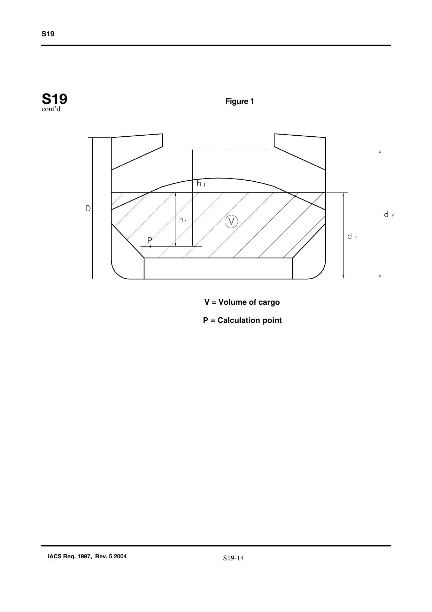
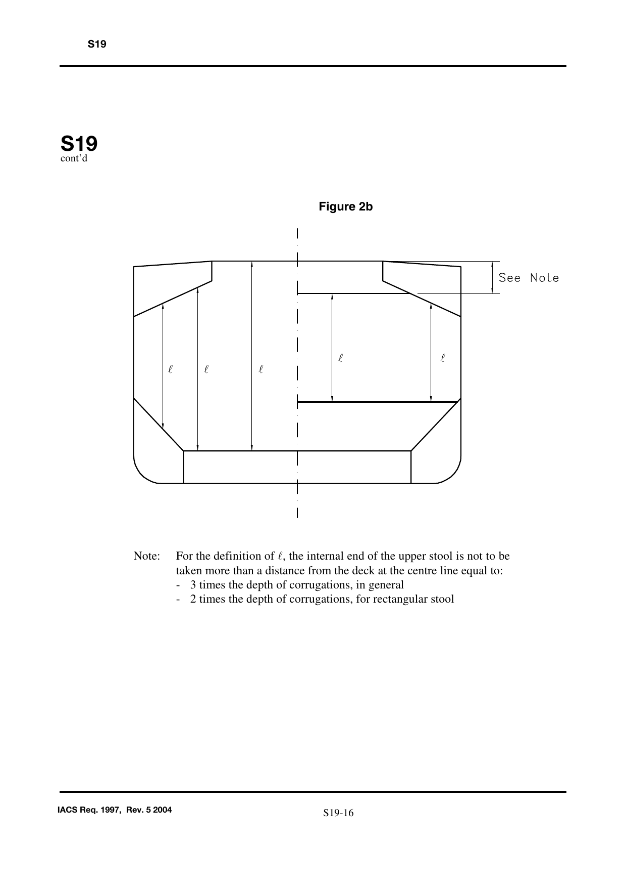
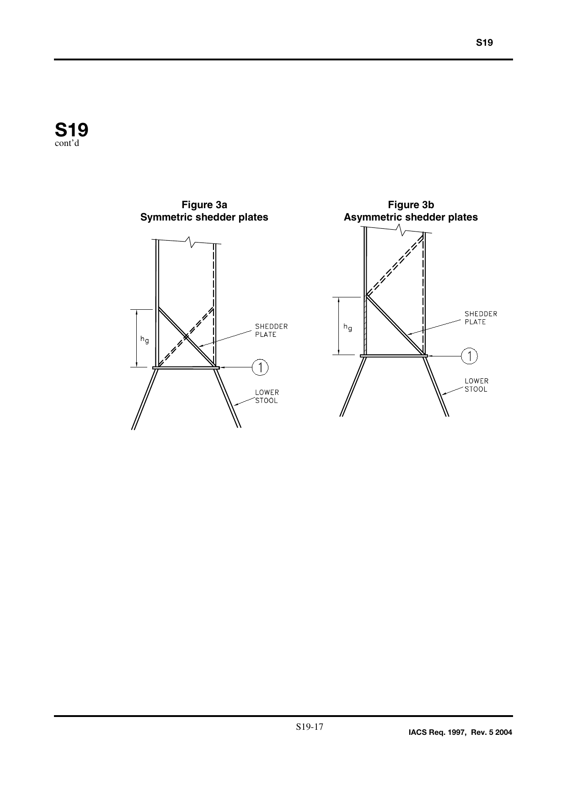
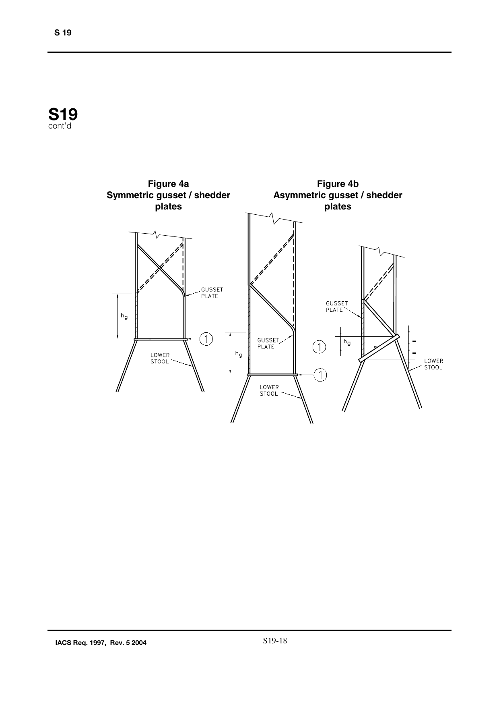
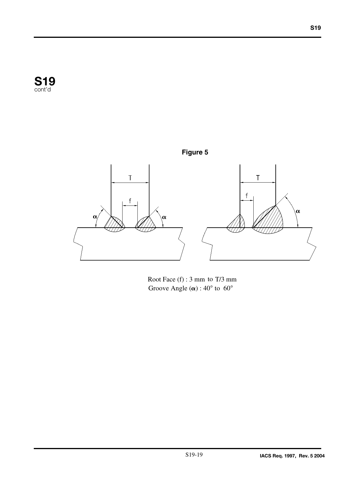

<!-- markdownlint-disable MD033 -->
# S19

S19
(1997)
(Rev. 1 1997)
(Rev. 2 Feb. 1998)
(Rev.3 Jun. 1998)
(Rev.4 Sept. 2000)
(Rev.5 July 2004)

## Evaluation of Scantlings of the Transverse Watertight Corrugated Bulkhead between Cargo Holds Nos. 1 and 2, with Cargo Hold No. 1 Flooded, for Existing Bulk Carriers

### S19.1 - Application and definitions

These requirements apply to all bulk carriers of 150 m in length and above, in the foremost hold, intending to carry solid bulk cargoes having a density of 1,78 t/m3, or above, with single deck, topside tanks and hopper tanks, fitted with vertically corrugated transverse watertight bulkheads between cargo holds No. 1 and 2 where:

(i) the foremost hold is bounded by the side shell only for ships which were contracted for construction prior to 1 July 1998, and have not been constructed in compliance with IACS Unified Requirement S18,

(ii) the foremost hold is double side skin construction of less than 760 mm breadth measured perpendicular to the side shell in ships, the keels of which were laid, or which were at a similar stage of construction, before 1 July 1999 and have not been constructed in compliance with IACS Unified Requirement S18 (Rev. 2, Sept. 2000).

The net scantlings of the transverse bulkhead between cargo holds Nos. 1 and 2 are to be calculated using the loads given in S19.2, the bending moment and shear force given in S19.3 and the strength criteria given in S19.4.

Where necessary, steel renewal and/or reinforcements are required as per S19.6.

In these requirements, homogeneous loading condition means a loading condition in which the ratio between the highest and the lowest filling ratio, evaluated for the two foremost cargo holds, does not exceed 1,20, to be corrected for different cargo densities.

### S19.2 - Load model

#### S19.2.1 - General

The loads to be considered as acting on the bulkhead are those given by the combination of the cargo loads with those induced by the flooding of cargo hold No.1.

The most severe combinations of cargo induced loads and flooding loads are to be used for the check of the scantlings of the bulkhead, depending on the loading conditions included in the loading manual:

- homogeneous loading conditions;
- non homogeneous loading conditions.

Non homogeneous part loading conditions associated with multiport loading and unloading operations for homogeneous loading conditions need not to be considered according to these requirements.

Notes:

1. Changes introduced in Revision 2 to UR S19, i.e. the introduction of the first sentence of S19.6 as well as the Annex are to be applied by all Member societies and Associates not later than 1 July 1998.
2. Annex 2 contains, for guidance only, a flow chart entitled "Guidance to assess capability of Carriage of High Density Cargoes on Existing Bulk Carriers according to the Strength of Transverse Bulkhead between Cargo Holds Nos. 1 and 2".
3. Changes introduced in Rev.4 are to be uniformly implemented by IACS Members and Associates from 1 July 2001.
4. The "contracted for construction" date means the date on which the contract to build the vessel is signed between the prospective owner and the shipbuilder. For further details regarding the date of "contract for construction", refer to IACS Procedural Requirement (PR) No. 29.

#### S19.2.2 - Bulkhead corrugation flooding head

The flooding head hf (see Figure 1) is the distance, in m, measured vertically with the ship in the upright position, from the calculation point to a level located at a distance df, in m, from the baseline equal to:

a) in general:

- D

b) for ships less than 50,000 tonnes deadweight with Type B freeboard:

- 0,95 · D

D being the distance, in m, from the baseline to the freeboard deck at side amidship (see Figure 1).

c) for ships to be operated at an assigned load line draught Tr less than the permissible load line draught T, the flooding head defined in a) and b) above may be reduced by T - Tr.

#### S19.2.3 - Pressure in the flooded hold

##### S19.2.3.1 - Bulk cargo loaded hold

Two cases are to be considered, depending on the values of d1 and df, d1 (see Figure 1) being a distance from the baseline given, in m, by:

$$d_1 = \frac{M_c}{\rho_c \cdot l_c \cdot B} + \frac{V_{LS}}{l_c \cdot B} + \left(h_{HT} - h_{DB}\right) \cdot \frac{b_{HT}}{B} + h_{DB}$$

where:

Mc = mass of cargo, in tonnes, in hold No. 1

ρc = bulk cargo density, in t/m3

lc = length of hold No. 1, in m

B = ship's breadth amidship, in m

vLS = volume, in m3, of the bottom stool above the inner bottom

hHT = height of the hopper tanks amidship, in m, from the baseline

hDB = height of the double bottom, in m

bHT = breadth of the hopper tanks amidship, in m.

a) df ≥ d1

At each point of the bulkhead located at a distance between d1 and df from the baseline, the pressure pc,f, in kN/m2, is given by:

$$p_{c,f} = \rho \cdot g \cdot h_f$$

where:

ρ = sea water density, in t/m3

g = 9,81 m/s2, gravity acceleration

hf = flooding head as defined in S19.2.2.

At each point of the bulkhead located at a distance lower than d1 from the baseline, the pressure pc,f, in kN/m2, is given by:

$$p_{c,f} = \rho \cdot g \cdot h_f + [\rho_c - \rho \cdot (1 - \text{perm})] \cdot g \cdot h_1 \cdot \tan^2 \gamma$$

where:

ρ, g, hf = as given above

ρc = bulk cargo density, in t/m3

perm = permeability of cargo, to be taken as 0,3 for ore (corresponding bulk cargo density for iron ore may generally be taken as 3,0 t/m3),

h1 = vertical distance, in m, from the calculation point to a level located at a distance d1, as defined above, from the base line (see Figure 1)

γ = 45° -(φ/2)

φ = angle of repose of the cargo, in degrees, and may generally be taken as 35° for iron ore.

The force Fc,f, in kN, acting on a corrugation is given by:

$$F_{c,f} = s_1 \cdot \left( \rho \cdot g \cdot \frac{(d_f - d_1)^2}{2} + \frac{\rho \cdot g \cdot (d_f - d_1) + (p_{c,f})_{le}}{2} \cdot (d_1 - h_{DB} - h_{LS}) \right)$$

where:

s1 = spacing of corrugations, in m (see Figure 2a)

ρ, g, d1, hDB = as given above

df = as given in S19.2.2

(pc,f)le = pressure, in kN/m2, at the lower end of the corrugation

hLS = height of the lower stool, in m, from the inner bottom.

b) df < d1

At each point of the bulkhead located at a distance between df and d1 from the baseline, the pressure pc,f, in kN/m2, is given by:

$$p_{c,f} = \rho_c \cdot g \cdot h_1 \cdot \tan^2 \gamma$$

where:

ρc, g, h1, γ = as given in a) above

At each point of the bulkhead located at a distance lower than df from the baseline, the pressure pc,f, in kN/m2, is given by:

$$p_{c,f} = \rho \cdot g \cdot h_f + [\rho_c \cdot h_1 - \rho \cdot (1 - \text{perm}) \cdot h_f] \cdot g \cdot \tan^2 \gamma$$

where:

ρ, g, hf, ρc, h1, perm, γ = as given in a) above

The force Fc,f, in kN, acting on a corrugation is given by:

$$F_{c,f} = s_1 \cdot \left( \rho_c \cdot g \cdot \frac{(d_1 - d_f)^2}{2} \cdot \tan^2 \gamma + \frac{\rho_c \cdot g \cdot (d_1 - d_f) \cdot \tan^2 \gamma + (p_{c,f})_{le}}{2} \cdot (d_f - h_{DB} - h_{LS}) \right)$$

where:

s1, ρc, g, γ, (pc,f)le, hLS = as given in a) above

d1, hDB = as given in S19.2.3.1

df = as given in S19.2.2.

##### S19.2.3.2 - Empty hold

At each point of the bulkhead, the hydrostatic pressure pf induced by the flooding head hf is to be considered.

The force Ff, in kN, acting on a corrugation is given by:

$$F_f = s_1 \cdot \rho \cdot g \cdot \frac{(d_f - h_{DB} - h_{LS})^2}{2}$$

where:

s1, ρ, g, hLS = as given in S19.2.3.1 a)

hDB = as given in S19.2.3.1

df = as given in S19.2.2.

#### S19.2.4 - Pressure in the non-flooded bulk cargo loaded hold

At each point of the bulkhead, the pressure pc, in kN/m2, is given by:

$$p_c = \rho_c \cdot g \cdot h_1 \cdot \tan^2 \gamma$$

where:

ρc, g, h1, γ = as given in S19.2.3.1 a)

The force Fc, in kN, acting on a corrugation is given by:

$$F_c = \rho_c \cdot g \cdot s_1 \cdot \frac{(d_1 - h_{DB} - h_{LS})^2}{2} \cdot \tan^2 \gamma$$

where:

ρc, g, s1, hLS, γ = as given in S19.2.3.1 a)

d1, hDB = as given in S19.2.3.1

#### S19.2.5 - Resultant pressure

##### S19.2.5.1 - Homogeneous loading conditions

At each point of the bulkhead structures, the resultant pressure p, in kN/m2, to be considered for the scantlings of the bulkhead is given by:

$$p = p_{c,f} - 0{,}8 \cdot p_c$$

The resultant force F, in kN, acting on a corrugation is given by:

$$F = F_{c,f} - 0{,}8 \cdot F_c$$

##### S19.2.5.2 - Non homogeneous loading conditions

At each point of the bulkhead structures, the resultant pressure p, in kN/m2, to be considered for the scantlings of the bulkhead is given by:

$$p = p_{c,f}$$

The resultant force F, in kN, acting on a corrugation is given by:

$$F = F_{c,f}$$

In case hold No.1, in non homogeneous loading conditions, is not allowed to be loaded, the resultant pressure p, in kN/m2, to be considered for the scantlings of the bulkhead is given by:

$$p = p_f$$

and the resultant force F, in kN, acting on a corrugation is given by:

$$F = F_f$$

### S19.3 - Bending moment and shear force in the bulkhead corrugations

The bending moment M and the shear force Q in the bulkhead corrugations are obtained using the formulae given in S19.3.1 and S19.3.2. The M and Q values are to be used for the checks in S19.4.

#### S19.3.1 - Bending moment

The design bending moment M, in kN·m, for the bulkhead corrugations is given by:

$$M = \frac{F \cdot l}{8}$$

where:

F = resultant force, in kN, as given in S19.2.5

l = span of the corrugation, in m, to be taken according to Figures 2a and 2b

#### S19.3.2 - Shear force

The shear force Q, in kN, at the lower end of the bulkhead corrugations is given by:

$$Q = 0{,}8 \cdot F$$

where:

F = as given in S19.2.5

### S19.4 - Strength criteria

#### S19.4.1 - General

The following criteria are applicable to transverse bulkheads with vertical corrugations (see Figure 2a).

Requirements for local net plate thickness are given in S19.4.7.

In addition, the criteria given in S19.4.2 and S19.4.5 are to be complied with.

Where the corrugation angle φ shown in Figure 2a if less than 50°, an horizontal row of staggered shedder plates is to be fitted at approximately mid depth of the corrugations (see Figure 2a) to help preserve dimensional stability of the bulkhead under flooding loads. The shedder plates are to be welded to the corrugations by double continuous welding, but they are not to be welded to the side shell.

The thicknesses of the lower part of corrugations considered in the application of S19.4.2 and S19.4.3 are to be maintained for a distance from the inner bottom (if no lower stool is fitted) or the top of the lower stool not less than 0,15·l.

The thicknesses of the middle part of corrugations considered in the application of S19.4.2 and S19.4.4 are to be maintained to a distance from the deck (if no upper stool is fitted) or the bottom of the upper stool not greater than 0,3·l.

#### S19.4.2 - Bending capacity and shear stress τ

The bending capacity is to comply with the following relationship:

$$10^3 \cdot \frac{M}{0{,}5 \cdot Z_{le} \cdot \sigma_{a,le} + Z_m \cdot \sigma_{a,m}} \leq 1{,}0$$

where:

M = bending moment, in kN·m, as given in S19.3.1.

Zle = section modulus of one half pitch corrugation, in cm3, at the lower end of corrugations, to be calculated according to S19.4.3.

Zm = section modulus of one half pitch corrugation, in cm3, at the mid-span of corrugations, to be calculated according to S19.4.4.

σa,le = allowable stress, in N/mm2, as given in S19.4.5, for the lower end of corrugations

σa,m = allowable stress, in N/mm2, as given in S19.4.5, for the mid-span of corrugations.

In no case Zm is to be taken greater than the lesser of 1,15·Zle and 1,15·Z'le for calculation of the bending capacity, Z'le being defined below.

In case effective shedders plates are fitted which:

- are not knuckled;
- are welded to the corrugations and the top of the lower stool by one side penetration welds or equivalent;
- are fitted with a minimum slope of 45° and their lower edge is in line with the stool side plating;

or effective gusset plates are fitted which:

- are fitted in line with the stool side plating;
- have material properties at least equal to those provided for the flanges,

the section modulus Zle, in cm3, is to be taken not larger than the value Z'le, in cm3, given by:

$$Z'_{le} = Z_g + 10^3 \cdot \frac{Q \cdot h_g - 0{,}5 \cdot h_g^2 \cdot s_1 \cdot p_g}{\sigma_a}$$

where:

Zg = section modulus of one half pitch corrugation, in cm3, according to S19.4.4, in way of the upper end of shedder or gusset plates, as applicable

Q = shear force, in kN, as given in S19.3.2

hg = height, in m, of shedders or gusset plates, as applicable (see Figures 3a, 3b, 4a and 4b)

s1 = as given in S19.2.3.1 a)

pg = resultant pressure, in kN/m2, as defined in S19.2.5, calculated in way of the middle of the shedders or gusset plates, as applicable

σa = allowable stress, in N/mm2, as given in S19.4.5.

Stresses τ are obtained by dividing the shear force Q by the shear area. The shear area is to be reduced in order to account for possible non-perpendicularity between the corrugation webs and flanges. In general, the reduced shear area may be obtained by multiplying the web sectional area by (sin φ), φ being the angle between the web and the flange.

When calculating the section moduli and the shear area, the net plate thicknesses are to be used.

The section moduli of corrugations are to be calculated on the basis of the requirements given in S19.4.3 and S19.4.4.

#### S19.4.3 - Section modulus at the lower end of corrugations

The section modulus is to be calculated with the compression flange having an effective flange width, bef, not larger than as given in S19.4.6.1.

If the corrugation webs are not supported by local brackets below the stool top (or below the inner bottom) in the lower part, the section modulus of the corrugations is to be calculated considering the corrugation webs 30% effective.

a) Provided that effective shedder plates, as defined in S19.4.2, are fitted (see Figures 3a and 3b), when calculating the section modulus of corrugations at the lower end (cross-section ① in Figures 3a and 3b), the area of flange plates, in cm2, may be increased by

$$\left(2{,}5 \cdot a \cdot \sqrt{t_f \cdot t_{sh}} \cdot \sqrt{\frac{\sigma_{Fsh}}{\sigma_{Ffl}}}\right)$$

(not to be taken greater than 2,5·a·tf) where:

a = width, in m, of the corrugation flange (see Figure 2a)

tsh = net shedder plate thickness, in mm

tf = net flange thickness, in mm

σFsh = minimum upper yield stress, in N/mm2, of the material used for the shedder plates

σFfl = minimum upper yield stress, in N/mm2, of the material used for the corrugation flanges.

b) Provided that effective gusset plates, as defined in S19.4.2, are fitted (see Figures 4a and 4b), when calculating the section modulus of corrugations at the lower end (cross-section ① in Figures 4a and 4b), the area of flange plates, in cm2, may be increased by (7·hg·tgu) where:

hg = height of gusset plate in m, see Figures 4a and 4b, not to be taken greater than :

$$\left(\frac{10}{7} \cdot s_{gu}\right)$$

sgu = width of the gusset plates, in m

tgu = net gusset plate thickness, in mm, not to be taken greater than tf

tf = net flange thickness, in mm, based on the as built condition.

c) If the corrugation webs are welded to a sloping stool top plate, which is at an angle not less than 45° with the horizontal plane, the section modulus of the corrugations may be calculated considering the corrugation webs fully effective. In case effective gusset plates are fitted, when calculating the section modulus of corrugations the area of flange plates may be increased as specified in b) above. No credit can be given to shedder plates only.

For angles less than 45°, the effectiveness of the web may be obtained by linear interporation between 30% for 0° and 100% for 45°.

#### S19.4.4 - Section modulus of corrugations at cross-sections other than the lower end

The section modulus is to be calculated with the corrugation webs considered effective and the compression flange having an effective flange width, bef, not larger than as given in S19.4.6.1.

#### S19.4.5 - Allowable stress check

The normal and shear stresses σ and τ are not to exceed the allowable values σa and τa, in N/mm2, given by:

$$\sigma_a = \sigma F$$

$$\tau_a = 0{,}5 \bullet \sigma F$$

σF = minimum upper yield stress, in N/mm2, of the material.

#### S19.4.6 - Effective compression flange width and shear buckling check

##### S19.4.6.1 - Effective width of the compression flange of corrugations

The effective width bef, in m, of the corrugation flange is given by:

$$b_{ef} = C_e \cdot a$$

where:

$$C_e = \frac{2{,}25}{\beta} - \frac{1{,}25}{\beta^2} \quad \text{for } \beta > 1{,}25$$

$$C_e = 1{,}0 \quad \text{for } \beta \leq 1{,}25$$

$$\beta = 10^3 \cdot \frac{a}{t_f} \cdot \sqrt{\frac{\sigma_F}{E}}$$

tf = net flange thickness, in mm

a = width, in m, of the corrugation flange (see Figure 2a)

σF = minimum upper yield stress, in N/mm2, of the material

E = modulus of elasticity, in N/mm2, to be assumed equal to 2,06•105 N/mm2 for steel

##### S19.4.6.2 - Shear

The buckling check is to be performed for the web plates at the corrugation ends.

The shear stress τ is not to exceed the critical value τC, in N/mm2 obtained by the following:

$$\tau_C = \tau_E \quad \text{when } \tau_E \leq \frac{\tau_F}{2}$$

$$= \tau_F \left(1 - \frac{\tau_F}{4\tau_E}\right) \quad \text{when } \tau_E > \frac{\tau_F}{2}$$

$$\tau_F = \frac{\sigma_F}{\sqrt{3}}$$

where:

σF = minimum upper yield stress, in N/mm2, of the material

$$\tau_E = 0{,}9 k_t E \left(\frac{t}{1000 c}\right)^2 \quad (\text{N/mm}^2)$$

kt, E, t and c are given by:

kt = 6,34

E = modulus of elasticity of material as given in S19.4.6.1

t = net thickness, in mm, of corrugation web

c = width, in m, of corrugation web (See Figure 2a)

#### S19.4.7 - Local net plate thickness

The bulkhead local net plate thickness t, in mm, is given by:

$$t = 14{,}9 \cdot s_w \cdot \sqrt{\frac{p}{\sigma_F}}$$

where:

sw = plate width, in m, to be taken equal to the width of the corrugation flange or web, whichever is the greater (see Figure 2a)

p = resultant pressure, in kN/m2, as defined in S19.2.5, at the bottom of each strake of plating; in all cases, the net thickness of the lowest strake is to be determined using the resultant pressure at the top of the lower stool, or at the inner bottom, if no lower stool is fitted or at the top of shedders, if shedder or gusset/shedder plates are fitted.

σF = minimum upper yield stress, in N/mm2, of the material.

For built-up corrugation bulkheads, when the thicknesses of the flange and web are different, the net thickness of the narrower plating is to be not less than tn, in mm, given by:

$$t_n = 14{,}9 \cdot s_n \cdot \sqrt{\frac{p}{\sigma_F}}$$

sn being the width, in m, of the narrower plating.

The net thickness of the wider plating, in mm, is not to be taken less than the maximum of the following values:

$$t_w = 14{,}9 \cdot s_w \cdot \sqrt{\frac{p}{\sigma_F}}$$

$$t_w = \sqrt{\frac{440 \cdot s_w^2 \cdot p}{\sigma_F} - t_{np}^2}$$

where tnp ≤ actual net thickness of the narrower plating and not to be greater than:

$$14{,}9 \cdot s_w \cdot \sqrt{\frac{p}{\sigma_F}}$$

### S19.5 - Local details

As applicable, the design of local details is to comply with the Society's requirements for the purpose of transferring the corrugated bulkhead forces and moments to the boundary structures, in particular to the double bottom and cross-deck structures.

In particular, the thickness and stiffening of gusset and shedder plates, installed for strengthening purposes, is to comply with the Society's requirements, on the basis of the load model in S19.2.

Unless otherwise stated, weld connections and materials are to be dimensioned and selected in accordance with the Society's requirements.

### S19.6 - Corrosion addition and steel renewal

Renewal/reinforcement shall be done in accordance with the following requirements and the guidelines contained in the Annex.

a) Steel renewal is required where the gauged thickness is less than tnet + 0,5 mm, tnet being the thickness used for the calculation of bending capacity and shear stresses as given in S19.4.2. or the local net plate thickness as given in S19.4.7. Alternatively, reinforcing doubling strips may be used providing the net thickness is not dictated by shear strength requirements for web plates (see S19.4.5 and S19.4.6.2) or by local pressure requirements for web and flange plates (see S19.4.7).

Where the gauged thickness is within the range tnet + 0,5 mm and tnet + 1,0 mm, coating (applied in accordance with the coating manufacturer's requirements) or annual gauging may be adopted as an alternative to steel renewal.

b) Where steel renewal or reinforcement is required, a minimum thickness of tnet + 2,5 mm is to be replenished for the renewed or reinforced parts.

c) When:

$$0{,}8 \cdot \left(\sigma_{Ffl} \cdot t_{fl}\right) \geq \sigma_{Fs} \cdot t_{st}$$

where:

σFfl = minimum upper yield stress, in N/mm2, of the material used for the corrugation flanges

σFs = minimum upper yield stress, in N/mm2, of the material used for the lower stool side plating or floors (if no stool is fitted)

tfl = flange thickness, in mm, which is found to be acceptable on the basis of the criteria specified in a) above or, when steel renewal is required, the replenished thickness according to the criteria specified in b) above. The above flange thickness dictated by local pressure requirements (see S19.4.7) need not be considered for this purpose

tst = as built thickness, in mm, of the lower stool side plating or floors (if no stool is fitted)

gussets with shedder plates, extending from the lower end of corrugations up to 0,1·l, or reinforcing doubling strips (on bulkhead corrugations and stool side plating) are to be fitted.

If gusset plates are fitted, the material of such gusset plates is to be the same as that of the corrugation flanges. The gusset plates are to be connected to the lower stool shelf plate or inner bottom (if no stool is fitted) by deep penetration welds (see Figure 5).

d) Where steel renewal is required, the bulkhead connections to the lower stool shelf plate or inner bottom (if no stool is fitted) are to be at least made by deep penetration welds (see Figure 5).

e) Where gusset plates are to be fitted or renewed, their connections with the corrugations and the lower stool shelf plate or inner bottom (if no stool is fitted) are to be at least made by deep penetration welds (see Figure 5).

Figure 1

V = Volume of cargo

P = Calculation point

Figure 2a

n=neutral axis of the corrugations

s =max [a;c]

Figure 2b

Note: For the definition of l, the internal end of the upper stool is not to be taken more than a distance from the deck at the centre line equal to:

- 3 times the depth of corrugations, in general
- 2 times the depth of corrugations, for rectangular stool

Figure 3a - Symmetric shedder plates / Figure 3b - Asymmetric shedder plates

Figure 4a - Symmetric gusset / shedder plates / Figure 4b - Asymmetric gusset / shedder plates

Figure 5

Root Face (f) : 3 mm to T/3 mm

Groove Angle (α) : 40° to 60°

## ANNEX 1

### Guidance on renewal/reinforcement of vertically corrugated transverse watertight bulkhead between cargo holds Nos. 1 and 2

1. The need for renewal or reinforcement of the vertically corrugated transverse watertight bulkhead between cargo holds Nos. 1 and 2 will be determined by the classification society on a case by case basis using the criteria given in S19 in association with the most recent gaugings and findings from survey.

2. In addition to class requirements, the S19 assessment of the transverse corrugated bulkhead will take into account the scantlings of the following:-

    (a) Scantlings of individual vertical corrugations will be assessed for reinforcement/renewal based on thickness measurements obtained in accordance with Annex III to UR Z10.2 at their lower end, at mid-depth and in way of plate thickness changes in the lower 70%. These considerations will take into account the provision of gussets and shedder plates and the benefits they offer, provided that they comply with S19.4.2 and S19.6.

    (b) Taking into account the scantlings and arrangements for each case, permissible levels of diminution will be determined and appropriate measures taken in accordance with S19.6.

3. Where renewal is required, the extent of renewal is to be shown clearly in plans. The vertical distance of each renewal zone is to be determined by considering S19 and in general is to be not less than 15% of the vertical distance between the upper and lower end of the corrugation - measured at the ship's centreline.

4. Where the reinforcement is accepted by adding strips, the length of the reinforcing strips is to be sufficient to allow it to extend over the whole depth of the diminished plating. In general, the width and thickness of strips should be sufficient to comply with the S19 requirements. The material of the strips is to be the same as that of the corrugation plating. The strips are to be attached to the existing bulkhead plating by continuous fillet welds. The strips are to be suitably tapered or connected at ends in accordance with Class Society practice.

5. Where reinforcing strips are connected to the inner bottom or lower stool shelf plates, one side full penetration welding is to be used. When reinforcing strips are fitted to the corrugation flange and are connected to the lower stool shelf plate, they are normally to be aligned with strips of the same scantlings welded to the stool side plating and having a minimum length equal to the breadth of the corrugation flange.

6. Figure 1 gives a general arrangement of structural reinforcement.

Figure 1

Notes to Figure 1 on reinforcement:-

1. Square or trapezoidal corrugations are to be reinforced with plate strips fitted to each corrugation flange sufficient to meet the requirements of S19.
2. The number of strips fitted to each corrugation flange is to be sufficient to meet the requirements of S19.
3. The shedder plate may be fitted in one piece or prefabricated with a welded knuckle (gusset plate).
4. Gusset plates, where fitted, are to be welded to the shelf plate in line with the flange of the corrugation, to reduce the stress concentrations at the corrugation corners. Ensure good alignment between gusset plate, corrugation flange and lower stool sloping plate. Use deep penetration welding at all connections. Ensure start and stop of welding is as far away as practically possible from corners of corrugation.
5. Shedder plates are to be attached by one side full penetration welds onto backing bars.
6. Shedder and gusset plates are to have a thickness equal to or greater than the original bulkhead thickness. Gusset plate is to have a minimum height (on the vertical part) equal to half of the width of the corrugation flange. Shedders and gussets are to be same material as flange material.

## ANNEX 2

### Guidance to Assess Capability of Carriage of High Density Cargoes on Existing Bulk Carriers according to the Strength of Transverse Bulkhead between Cargo Holds Nos. 1 and 2

![Annex 2 flowchart: Decision flow chart for assessing capability of carriage of high density cargoes. Starts with 'Carriage of cargoes having rho_c >= 1.78 t/m^3', branches through checks for rho_c = 1.78 t/m^3 and rho_c > 1.78 t/m^3, reinforcement decisions, allowable density calculations rho_c1 and rho_c2, leading to outcomes 'No need for further assessment', 'All cargoes can be carried', 'Cargoes having rho_c <= rho_c1 can be carried', 'Only cargoes having rho_c <= 1.78 t/m^3 can be carried', and 'Cargoes having rho_c <= rho_c2 can be carried'](assets/ur-s19rev5/part01-fig-008-23.png)

NOTES:

(1) ρc typical of cargoes to be carried; in any case a value of 3,0 t/m3, corresponding to ore cargo, is to be considered.

(2) In deciding the reinforcement needed, consideration will be given to the effects of restricting the cargo distribution (homogeneous loading condition or reduction in the ship deadweight).

END
