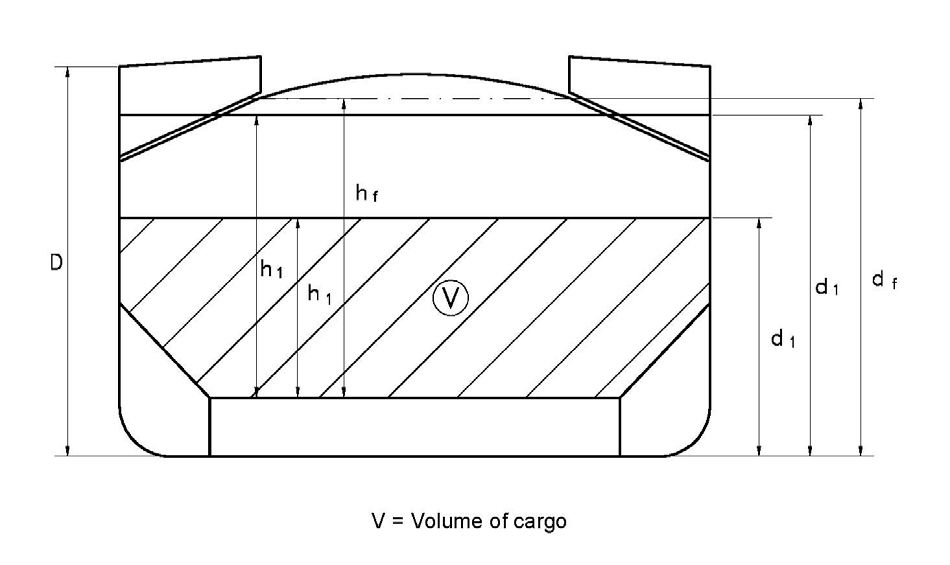
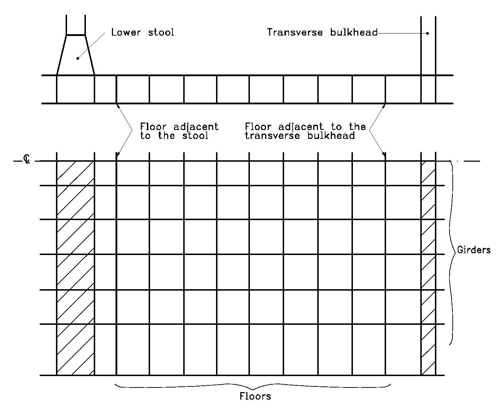
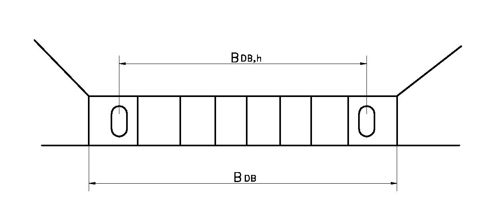

<!-- markdownlint-disable MD033 -->
# S20 - Evaluation of Allowable Hold Loading for Non-CSR Bulk Carriers Considering Hold Flooding

S20
(1997)
(Rev.1 1997)
(Rev.2 Sept 2000)
(Rev.3 July 2004)
(Rev.4 Feb 2006)
(Corr.1 Oct 2009)
(Rev.5 May 2010)
(Rev.6 Apr 2014)

## S20.1 - Application and definitions

Revision 4 or subsequent revisions or corrigenda as applicable of this UR is to be applied to non-CSR bulk carriers of 150 m in length and upwards, intending to carry solid bulk cargoes having a density of 1.0 t/m3 or above, and with,

a) Single side skin construction, or

b) Double side skin construction in which any part of longitudinal bulkhead is located within B/5 or 11.5 m, whichever is less, inboard from the ship's side at right angle to the centreline at the assigned summer load line

in accordance with Note 2.

The loading in each hold is not to exceed the allowable hold loading in flooded condition, calculated as per S20.4, using the loads given in S20.2 and the shear capacity of the double bottom given in S20.3.

In no case is the allowable hold loading, considering flooding, to be greater than the design hold loading in the intact condition.

This UR does not apply to CSR Bulk Carriers.

## S20.2 - Loading model

### S20.2.1 - General

The loads to be considered as acting on the double bottom are those given by the external sea pressures and the combination of the cargo loads with those induced by the flooding of the hold which the double bottom belongs to.

The most severe combinations of cargo induced loads and flooding loads are to be used, depending on the loading conditions included in the loading manual:

- homogeneous loading conditions;
- non homogeneous loading conditions;
- packed cargo conditions (such as steel mill products).

For each loading condition, the maximum bulk cargo density to be carried is to be considered in calculating the allowable hold loading limit.

Note:

1. The "contracted for construction" date means the date on which the contract to build the vessel is signed between the prospective owner and the shipbuilder. For further details regarding the date of "contract for construction", refer to IACS Procedural Requirement (PR) No. 29.

2. Revision 4 or subsequent revisions or corrigenda as applicable of this UR is to be applied by IACS Societies to ships contracted for construction on or after 1 July 2006.

### S20.2.2 - Inner bottom flooding head

The flooding head hf (see Figure 1) is the distance, in m, measured vertically with the ship in the upright position, from the inner bottom to a level located at a distance df, in m, from the baseline equal to:

a) in general:

- D for the foremost hold
- 0.9D for the other holds

b) for ships less than 50,000 tonnes deadweight with Type B freeboard:

- 0.95D for the foremost hold
- 0.85D for the other holds

D being the distance, in m, from the baseline to the freeboard deck at side amidship (see Figure 1).

## S20.3 - Shear capacity of the double bottom

The shear capacity C of the double bottom is defined as the sum of the shear strength at each end of:

- all floors adjacent to both hoppers, less one half of the strength of the two floors adjacent to each stool, or transverse bulkhead if no stool is fitted (see Figure 2).

- all double bottom girders adjacent to both stools, or transverse bulkheads if no stool is fitted.

Where in the end holds, girders or floors run out and are not directly attached to the boundary stool or hopper girder, their strength is to be evaluated for the one end only.

Note that the floors and girders to be considered are those inside the hold boundaries formed by the hoppers and stools (or transverse bulkheads if no stool is fitted). The hopper side girders and the floors directly below the connection of the bulkhead stools (or transverse bulkheads if no stool is fitted) to the inner bottom are not to be included.

When the geometry and/or the structural arrangement of the double bottom are such to make the above assumptions inadequate, to the Society's discretion, the shear capacity C of double bottom is to be calculated according to the Society's criteria.

In calculating the shear strength, the net thickness of floors and girders is to be used. The net thickness tnet, in mm, is given by:

$$t_{net} = t - 2.5$$

where:

t = thickness, in mm, of floors and girders.

### S20.3.1 - Floor shear strength

The floor shear strength in way of the floor panel adjacent to hoppers Sf1, in kN, and the floor shear strength in way of the openings in the outmost bay (i.e. that bay which is closer to hopper) Sf2, in kN, are given by the following expressions:

$$S_{f1} = 10^{-3} A_f \frac{\tau_a}{\eta_1}$$

$$S_{f2} = 10^{-3} A_{f,h} \frac{\tau_a}{\eta_2}$$

where:

Af = sectional area, in mm2, of the floor panel adjacent to hoppers

Af,h = net sectional area, in mm2, of the floor panels in way of the openings in the outmost bay (i.e. that bay which is closer to hopper)

τa = allowable shear stress, in N/mm2, to be taken equal to the lesser of

$$\tau_a = \frac{162 \sigma_F^{0.6}}{(s/t_{net})^{0.8}} \quad \text{and} \quad \frac{\sigma_F}{\sqrt{3}}$$

For floors adjacent to the stools or transverse bulkheads, as identified in S20.3 τa may be taken $\sigma_F / \sqrt{3}$

σF = minimum upper yield stress, in N/mm2, of the material

s = spacing of stiffening members, in mm, of panel under consideration

η1 = 1.10

η2 = 1.20

η2 may be reduced, to the Society's discretion, down to 1.10 where appropriate reinforcements are fitted to the Society's satisfaction

### S20.3.2 - Girder shear strength

The girder shear strength in way of the girder panel adjacent to stools (or transverse bulkheads, if no stool is fitted) Sg1, in kN, and the girder shear strength in way of the largest opening in the outmost bay (i.e. that bay which is closer to stool, or transverse bulkhead, if no stool is fitted) Sg2, in kN, are given by the following expressions:

$$S_{g1} = 10^{-3} A_g \frac{\tau_a}{\eta_1}$$

$$S_{g2} = 10^{-3} A_{g,h} \frac{\tau_a}{\eta_2}$$

where:

Ag = minimum sectional area, in mm2, of the girder panel adjacent to stools (or transverse bulkheads, if no stool is fitted)

Ag,h = net sectional area, in mm2, of the girder panel in way of the largest opening in the outmost bay (i.e. that bay which is closer to stool, or transverse bulkhead, if no stool is fitted)

τa = allowable shear stress, in N/mm2, as given in S20.3.1

η1 = 1.10

η2 = 1.15

η2 may be reduced, to the Society's discretion, down to 1.10 where appropriate reinforcements are fitted to the Society's satisfaction

## S20.4 - Allowable hold loading

The allowable hold loading W, in tonnes, is given by:

$$W = \rho_c V \frac{1}{F}$$

where:

F = 1.1 in general
1.05 for steel mill products

ρc = cargo density, in t/m3; for bulk cargoes see S20.2.1; for steel products, ρc is to be taken as the density of steel

V = volume, in m3, occupied by cargo at a level h1

$$h_1 = \frac{X}{\rho_c g}$$

X = *for bulk cargoes* the lesser of X1 and X2 given by:

$$X_1 = \frac{Z + \rho g (E - h_f)}{1 + \frac{\rho}{\rho_c}(perm - 1)}$$

$$X_2 = Z + \rho g (E - h_f \, perm)$$

X = for steel products, X may be taken as X1, using perm = 0

ρ = sea water density, in t/m3

g = 9.81 m/s2, gravity acceleration

E = ship immersion in m for flooded hold condition = df – 0.1D

df,D = as given in S20.2.2

hf = flooding head, in m, as defined in S20.2.2

perm = cargo permeability, (i.e. the ratio between the voids within the cargo mass and the volume occupied by the cargo); it needs not be taken greater than 0.3.

Z = the lesser of Z1 and Z2 given by:

$$Z_1 = \frac{C_h}{A_{DB,h}}$$

$$Z_2 = \frac{C_e}{A_{DB,e}}$$

Ch = shear capacity of the double bottom, in kN, as defined in S20.3, considering, for each floor, the lesser of the shear strengths Sf1 and Sf2 (see S20.3.1) and, for each girder, the lesser of the shear strengths Sg1 and Sg2 (see S20.3.2)

Ce = shear capacity of the double bottom, in kN, as defined in S20.3, considering, for each floor, the shear strength Sf1 (see S20.3.1) and, for each girder, the lesser of the shear strengths Sg1 and Sg2 (see S20.3.2)

$$A_{DB,h} = \sum_{i=1}^{i=n} S_i B_{DB,i}$$

$$A_{DB,e} = \sum_{i=1}^{i=n} S_i (B_{DB} - s_1)$$

n = number of floors between stools (or transverse bulkheads, if no stool is fitted)

Si = space of ith-floor, in m

BDB,i = BDB – s1 for floors whose shear strength is given by Sf1 (see S20.3.1)

BDB,i = BDB,h for floors whose shear strength is given by Sf2 (see S20.3.1)

BDB = breadth of double bottom, in m, between hoppers (see Figure 3)

BDB,h = distance, in m, between the two considered opening (see Figure 3)

s1 = spacing, in m, of double bottom longitudinals adjacent to hoppers

V = Volume of cargo

End of Document
