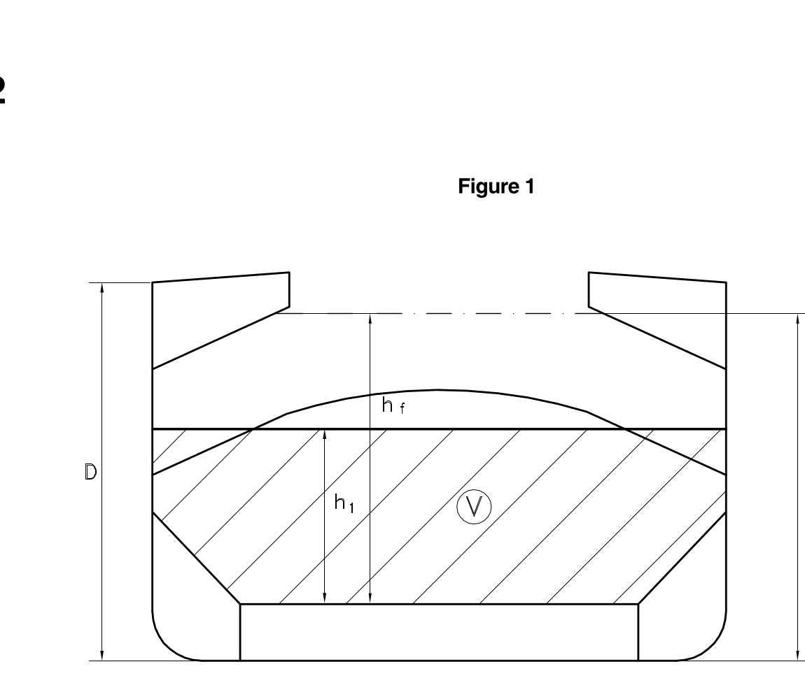
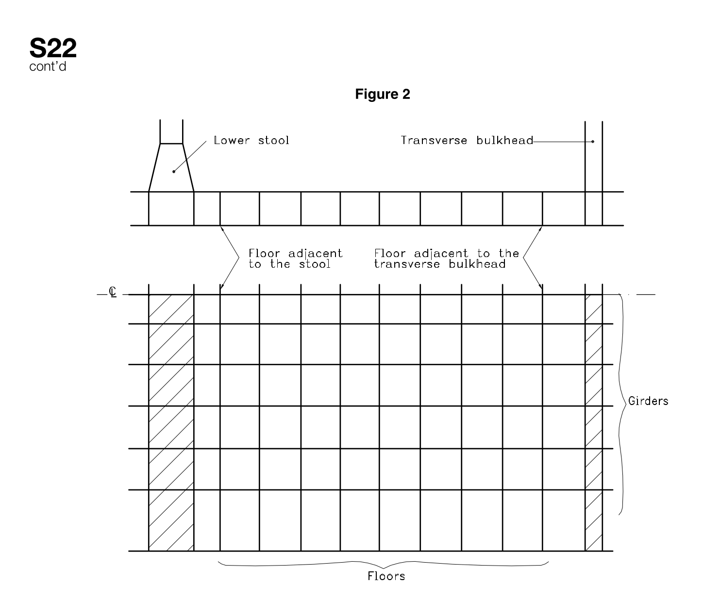
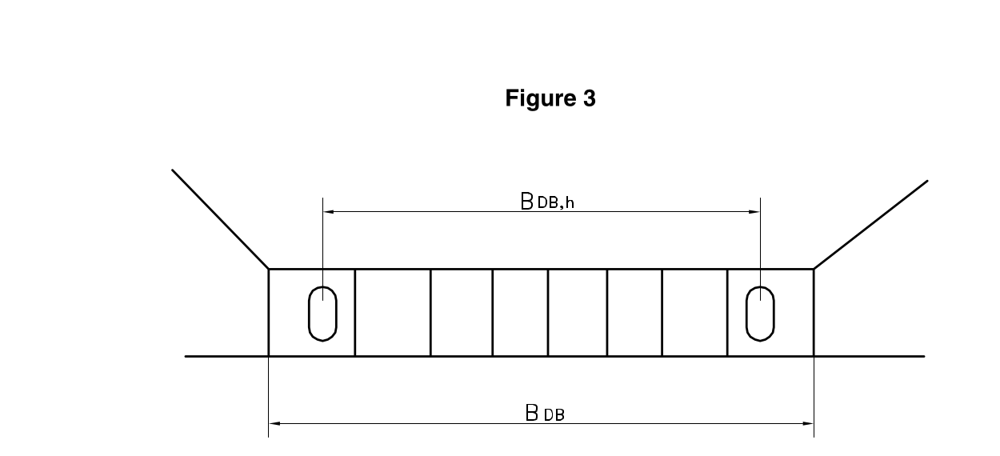

<!-- markdownlint-disable MD033 -->
# S22 Evaluation of Allowable Hold Loading of Cargo Hold No. 1 with Cargo Hold No. 1 Flooded, for Existing Bulk Carriers

S22
(1997)
(Rev. 1 1997)
(Rev.2 Sept. 2000)
(Rev.3 July 2004)

## S22.1 - Application and definitions

These requirements apply to all bulk carriers of 150 m in length and above, in the foremost hold, intending to carry solid bulk cargoes having a density of 1,78 t/m3, or above, with single deck, topside tanks and hopper tanks, where:

(i) the foremost hold is bounded by the side shell only for ships which were contracted for construction prior to 1 July 1998, and have not been constructed in compliance with IACS Unified Requirement S20,

(ii) the foremost hold is double side skin construction less than 760 mm breadth measured perpendicular to the side shell in ships, the keels of which were laid, or which were at a similar stage of construction, before 1 July 1999 and have not been constructed in compliance with IACS Unified Requirement S20 (Rev. 2, Sept. 2000).

Early completion of a special survey coming due after 1 July 1998 to postpone compliance is not allowed.

The loading in cargo hold No. 1 is not to exceed the allowable hold loading in the flooded condition, calculated as per S22.4, using the loads given in S22.2 and the shear capacity of the double bottom given in S22.3.

In no case, the allowable hold loading in flooding condition is to be taken greater than the design hold loading in intact condition.

## S22.2 - Load model

### S22.2.1 - General

The loads to be considered as acting on the double bottom of hold No. 1 are those given by the external sea pressures and the combination of the cargo loads with those induced by the flooding of hold No. 1.

The most severe combinations of cargo induced loads and flooding loads are to be used, depending on the loading conditions included in the loading manual:

- homogeneous loading conditions;
- non homogeneous loading conditions;
- packed cargo conditions (such as steel mill products).

For each loading condition, the maximum bulk cargo density to be carried is to be considered in calculating the allowable hold limit.

### S22.2.2 - Inner bottom flooding head

The flooding head hf (see Figure 1) is the distance, in m, measured vertically with the ship in the upright position, from the inner bottom to a level located at a distance df, in m, from the baseline equal to:

- D in general
- 0,95 · D for ships less than 50,000 tonnes deadweight with Type B freeboard.

D being the distance, in m, from the baseline to the freeboard deck at side amidship (see Figure 1).

Note:

1 Changes introduced in Rev.2 are to be uniformly implemented by IACS Members and Assoiciates from 1 July 2001.

2 The "contracted for construction" date means the date on which the contract to build the vessel is signed between the prospective owner and the shipbuilder. For further details regarding the date of "contract for construction", refer to IACS Procedural Requirement (PR) No. 29.

## S22.3 - Shear capacity of the double bottom of hold No. 1

The shear capacity C of the double bottom of hold No. 1 is defined as the sum of the shear strength at each end of:

- all floors adjacent to both hoppers, less one half of the strength of the two floors adjacent to each stool, or transverse bulkhead if no stool is fitted (see Figure 2),
- all double bottom girders adjacent to both stools, or transverse bulkheads if no stool is fitted.

The strength of girders or floors which run out and are not directly attached to the boundary stool or hopper girder is to be evaluated for the one end only.

Note that the floors and girders to be considered are those inside the hold boundaries formed by the hoppers and stools (or transverse bulkheads if no stool is fitted). The hopper side girders and the floors directly below the connection of the bulkhead stools (or transverse bulkheads if no stool is fitted) to the inner bottom are not to be included.

When the geometry and/or the structural arrangement of the double bottom are such to make the above assumptions inadequate, to the Society's discretion, the shear capacity C of the double bottom is to be calculated according to the Society's criteria.

In calculating the shear strength, the net thicknesses of floors and girders are to be used. The net thickness tnet, in mm, is given by:

$$t_{net} = t - t_c$$

where:

t = as built thickness, in mm, of floors and girders

tc = corrosion diminution, equal to 2 mm, in general; a lower value of tc may be adopted, provided that measures are taken, to the Society's satisfaction, to justify the assumption made.

### S22.3.1 - Floor shear strength

The floor shear strength in way of the floor panel adjacent to hoppers Sf1, in kN, and the floor shear strength in way of the openings in the "outermost" bay (i.e. that bay which is closest to hopper) Sf2, in kN, are given by the following expressions:

$$S_{f1} = 10^{-3} \cdot A_f \cdot \frac{\tau_a}{\eta_1}$$

$$S_{f2} = 10^{-3} \cdot A_{f,h} \cdot \frac{\tau_a}{\eta_2}$$

where:

Af = sectional area, in mm2, of the floor panel adjacent to hoppers

Af,h = net sectional area, in mm2, of the floor panels in way of the openings in the "outermost" bay (i.e. that bay which is closest to hopper)

τa = allowable shear stress, in N/mm2, to be taken equal to : $\sigma_F / \sqrt{3}$

σF = minimum upper yield stress, in N/mm2, of the material

η1 = 1,10

η2 = 1,20
η2 may be reduced, at the Society's discretion, down to 1,10 where appropriate reinforcements are fitted to the Society's satisfaction

### S22.3.2 - Girder shear strength

The girder shear strength in way of the girder panel adjacent to stools (or transverse bulkheads, if no stool is fitted) Sg1, in kN, and the girder shear strength in way of the largest opening in the "outermost" bay (i.e. that bay which is closest to stool, or transverse bulkhead, if no stool is fitted) Sg2, in kN, are given by the following expressions:

$$S_{g1} = 10^{-3} \cdot A_g \cdot \frac{\tau_a}{\eta_1}$$

$$S_{g2} = 10^{-3} \cdot A_{g,h} \cdot \frac{\tau_a}{\eta_2}$$

where:

Ag = minimum sectional area, in mm2, of the girder panel adjacent to stools (or transverse bulkheads, if no stool is fitted)

Ag,h = net sectional area, in mm2, of the girder panel in way of the largest opening in the "outermost" bay (i.e. that bay which is closest to stool, or transverse bulkhead, if no stool is fitted)

τa = allowable shear stress, in N/mm2, as given in S22.3.1

η1 = 1,10

η2 = 1,15
η2 may be reduced, at the Society's discretion, down to 1,10 where appropriate reinforcements are fitted to the Society's satisfaction

## S22.4 - Allowable hold loading

The allowable hold loading W, in t, is given by:

$$W = \rho_c \cdot V \cdot \frac{1}{F}$$

where:

F = 1,05 in general
1,00 for steel mill products

ρc = cargo density, in t/m3; for bulk cargoes see S22.2.1; for steel products, ρc is to be taken as the density of steel

V = volume, in m3, occupied by cargo at a level h1

$$h_1 = \frac{X}{\rho_c \cdot g}$$

X = for bulk cargoes, the lesser of X1 and X2 given by

$$X_1 = \frac{Z + \rho \cdot g \cdot (E - h_f)}{1 + \frac{\rho}{\rho_c}(perm - 1)}$$

$$X_2 = Z + \rho \cdot g \cdot (E - h_f \cdot perm)$$

X = for steel products, X may be taken as X1, using perm = 0

ρ = sea water density, in t/m3

g = 9,81 m/s2, gravity acceleration

E = df - 0,1 · D

df, D = as given in S22.2.2

hf = flooding head, in m, as defined in S22.2.2

perm = permeability of cargo, to be taken as 0,3 for ore (corresponding bulk cargo density for iron ore may generally be taken as 3,0 t/m3).

Z = the lesser of Z1 and Z2 given by:

$$Z_1 = \frac{C_h}{A_{DB,h}}$$

$$Z_2 = \frac{C_e}{A_{DB,e}}$$

Ch = shear capacity of the double bottom, in kN, as defined in S22.3, considering, for each floor, the lesser of the shear strengths Sf1 and Sf2 (see S22.3.1) and, for each girder, the lesser of the shear strengths Sg1 and Sg2 (see S22.3.2)

Ce = shear capacity of the double bottom, in kN, as defined in S22.3, considering, for each floor, the shear strength Sf1 (see S22.3.1) and, for each girder, the lesser of the shear strengths Sg1 and Sg2 (see S22.3.2)

$$A_{DB,h} = \sum_{i=1}^{i=n} S_i \cdot B_{DB,i}$$

$$A_{DB,e} = \sum_{i=1}^{i=n} S_i \cdot B_{DB} - s$$

n = number of floors between stools (or transverse bulkheads, if no stool is fitted)

Si = space of ith-floor, in m

BDB,i = BDB - s for floors whose shear strength is given by Sf1 (see S22.3.1)

BDB,i = BDB,h for floors whose shear strength is given by Sf2 (see S22.3.1)

BDB = breadth of double bottom, in m, between hoppers (see Figure 3)

BDB,h = distance, in m, between the two considered opening (see Figure 3)

s = spacing, in m, of double bottom longitudinals adjacent to hoppers

V = Volume of cargo

END
