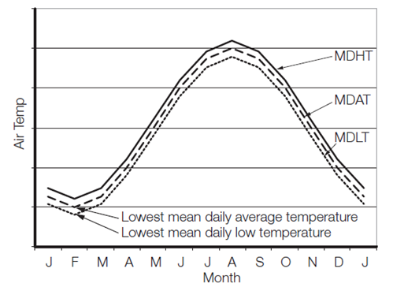

<!-- markdownlint-disable MD033 -->
# Use of Steel Grades for Various Hull Members - Ships of 90 m in Length and Above

S6
(1978)
(Rev.1 1980)
(Rev.2 1996)
(Rev.3 May 2002)
Rev.4 July 2003)
(Rev.5 Sept 2007)
(Rev.6 May 2010)
(Rev.7 Apr 2013)
(Rev.8 Dec 2015)
(Rev.9 July 2018)
(Corr.1 Mar 2021)
(Corr.2 Nov 2021)

## S6.0 Application

This UR does not apply to CSR Bulk Carriers and Oil Tankers.

## S6.1 Ships in normal worldwide service

Materials in the various strength members are not to be of lower grade than those corresponding to the material classes and grades specified in Table 1 to Table 7. General requirements are given in Table 1, while additional minimum requirements are given in the following:

- Table 2: for ships, excluding liquefied gas carriers covered in Table 3, with length exceeding 150 m and single strength deck,
- Table 3: for membrane type liquefied gas carriers with length exceeding 150 m,
- Table 4: for ships with length exceeding 250 m,
- Table 5: for single side bulk carriers subjected to SOLAS regulation XII/6.4,
- Table 6: for ships with ice strengthening.

The material grade requirements for hull members of each class depending on the thickness are defined in Table 7.

For strength members not mentioned in Tables 1 to 6, Grade A/AH may generally be used. The steel grade is to correspond to the as-built plate thickness and material class.

Plating materials for sternframes supporting the rudder and propeller boss, rudders, rudder horns and shaft brackets are in general not to be of lower grades than corresponding to Class II. For rudder and rudder body plates subjected to stress concentrations (e.g. in way of lower support of semi-spade rudders or at upper part of spade rudders) Class III is to be applied.

Notes:

1. Changes introduced in Rev.5 are to be uniformly implemented by IACS Members and Associates from 1 July 2008.
2. Changes introduced in Rev.7 are to be uniformly implemented by IACS Members from 1 July 2014.
3. Changes introduced in Rev.8 are to be uniformly implemented by IACS Members from 1 January 2017.
4. Changes introduced in Rev.9 are to be uniformly implemented by IACS Members from 1 July 2019.

### Table 1 - Material Classes and Grades for ships in general

| Structural member category | Material class/grade |
|---|---|
| **SECONDARY:** A1. Longitudinal bulkhead strakes, other than that belonging to the Primary category A2. Deck plating exposed to weather, other than that belonging to the Primary or Special category A3. Side plating | - Class I within 0.4L amidships - Grade A/AH outside 0.4L amidships |
| **PRIMARY:** B1. Bottom plating, including keel plate B2. Strength deck plating, excluding that belonging to the Special category B3. Continuous longitudinal plating of strength members above strength deck, excluding hatch coamings B4. Uppermost strake in longitudinal bulkhead B5. Vertical strake (hatch side girder) and uppermost sloped strake in top wing tank | - Class II within 0.4L amidships - Grade A/AH outside 0.4L amidships |
| **SPECIAL:** C1. Sheer strake at strength deck (\*) C2. Stringer plate in strength deck (\*) C3. Deck strake at longitudinal bulkhead, excluding deck plating in way of inner-skin bulkhead of double-hull ships (\*) | - Class III within 0.4L amidships - Class II outside 0.4L amidships - Class I outside 0.6L amidships |
| C4. Strength deck plating at outboard corners of cargo hatch openings in container carriers and other ships with similar hatch opening configurations | - Class III within 0.4L amidships - Class II outside 0.4L amidships - Class I outside 0.6L amidships - Min. Class III within cargo region |
| C5. Strength deck plating at corners of cargo hatch openings in bulk carriers, ore carriers combination carriers and other ships with similar hatch opening configurations C5.1 Trunk deck and inner deck plating at corners of openings for liquid and gas domes in membrane type liquefied gas carriers | - Class III within 0.6L amidships - Class II within rest of cargo region |
| C6. Bilge strake in ships with double bottom over the full breadth and length less than 150 m | - Class II within 0.6L amidships - Class I outside 0.6L amidships |
| C7. Bilge strake in other ships (\*) | - Class III within 0.4L amidships - Class II outside 0.4L amidships - Class I outside 0.6L amidships |
| C8. Longitudinal hatch coamings of length greater than 0.15L including coaming top plate and flange | - Class III within 0.4L amidships - Class II outside 0.4L amidships - Class I outside 0.6L amidships |
| C9. End brackets and deck house transition of longitudinal cargo hatch coamings | - Not to be less than Grade D/DH |

(\*) Single strakes required to be of Class III within 0.4L amidships are to have breadths not less than 800+5L (mm), need not be greater than 1800 (mm), unless limited by the geometry of the ship's design.

### Table 2 - Minimum Material Grades for ships, excluding liquefied gas carriers covered in Table 3, with length exceeding 150 m and single strength deck

| Structural member category | Material grade |
|---|---|
| - Longitudinal plating of strength deck where contributing to the longitudinal strength - Continuous longitudinal plating of strength members above strength deck | Grade B/AH within 0.4L amidships |
| Single side strakes for ships without inner continuous longitudinal bulkhead(s) between bottom and the strength deck | Grade B/AH within cargo region |

### Table 3 - Minimum Material Grades for membrane type liquefied gas carriers with length exceeding 150 m \*

| Structural member category | | Material grade |
|---|---|---|
| Longitudinal plating of strength deck where contributing to the longitudinal strength | | Grade B/AH within 0.4L amidships |
| Continuous longitudinal plating of strength members above the strength deck | Trunk deck plating | Class II within 0.4L amidships |
| | - Inner deck plating - Longitudinal strength member plating between the trunk deck and inner deck | Grade B/AH within 0.4L amidships |

(\*) Table 3 is applicable to membrane type liquefied gas carriers with deck arrangements as shown in Fig. 1. Table 3 may apply to similar ship types with a "double deck" arrangement above the strength deck.

Fig. 1 Typical deck arrangement for membrane type Liquefied Natural Gas Carriers

### Table 4 - Minimum Material Grades for ships with length exceeding 250 m

| Structural member category | Material grade |
|---|---|
| Sheer strake at strength deck (\*) | Grade E/EH within 0.4L amidships |
| Stringer plate in strength deck (\*) | Grade E/EH within 0.4L amidships |
| Bilge strake (\*) | Grade D/DH within 0.4L amidships |

(\*) Single strakes required to be of Grade D/DH or Grade E/EH as shown in the above table and within 0.4L amidships are to have breadths not less than 800+5L (mm), need not be greater than 1800 (mm), unless limited by the geometry of the ship's design.

### Table 5 - Minimum Material Grades for single-side skin bulk carriers subjected to SOLAS regulation XII/6.4

| Structural member category | Material grade |
|---|---|
| Lower bracket of ordinary side frame (\*), (\*\*) | Grade D/DH |
| Side shell strakes included totally or partially between the two points located to 0.125$\ell$ above and below the intersection of side shell and bilge hopper sloping plate or inner bottom plate (\*\*) | Grade D/DH |

(\*) The term "lower bracket" means webs of lower brackets and webs of the lower part of side frames up to the point of 0.125$\ell$ above the intersection of side shell and bilge hopper sloping plate or inner bottom plate.

(\*\*) The span of the side frame, $\ell$, is defined as the distance between the supporting structures.

### Table 6 - Minimum Material Grades for ships with ice strengthening

| Structural member category | Material grade |
|---|---|
| Shell strakes in way of ice strengthening area for plates | Grade B/AH |

### Table 7 - Material Grade Requirements for Classes I, II and III

| Class | I | | II | | III | |
|---|---|---|---|---|---|---|
| Thickness, in mm | MS | HT | MS | HT | MS | HT |
| t ≤ 15 | A | AH | A | AH | A | AH |
| 15 < t ≤ 20 | A | AH | A | AH | B | AH |
| 20 < t ≤ 25 | A | AH | B | AH | D | DH |
| 25 < t ≤ 30 | A | AH | D | DH | D | DH |
| 30 < t ≤ 35 | B | AH | D | DH | E | EH |
| 35 < t ≤ 40 | B | AH | D | DH | E | EH |
| 40 < t ≤ 50 | D | DH | E | EH | E | EH |

## S6.2 Ships exposed to low air temperatures

For ships intended to operate in areas with low air temperatures (below -10ºC), e.g. regular service during winter seasons to Arctic or Antarctic waters, the materials in exposed structures are to be selected based on the design temperature tD, to be taken as defined in S6.3.

Materials in the various strength members above the lowest ballast water line (BWL) exposed to air (including the structural members covered by the Note [5] of Table 8) and materials of cargo tank boundary plating for which S6.4 is applicable are not to be of lower grades than those corresponding to Classes I, II and III, as given in Table 8, depending on the categories of structural members (SECONDARY, PRIMARY and SPECIAL). For non-exposed structures (except as indicated in Note [5] of Table 8) and structures below the lowest ballast water line, S6.1 applies.

### Table 8 - Application of Material Classes and Grades – Structures Exposed at Low Temperatures

| Structural member category | Material class within 0.4L amidships | Material class outside 0.4L amidships |
|---|---|---|
| **SECONDARY:** Deck plating exposed to weather, in general Side plating above BWL Transverse bulkheads above BWL[5] Cargo tank boundary plating exposed to cold cargo [6] | I | I |
| **PRIMARY:** Strength deck plating [1] Continuous longitudinal members above strength deck, excluding longitudinal hatch coamings Longitudinal bulkhead above BWL[5] Top wing tank bulkhead above BWL[5] | II | I |
| **SPECIAL:** Sheer strake at strength deck [2] Stringer plate in strength deck [2] Deck strake at longitudinal bulkhead [3] Continuous longitudinal hatch coamings [4] | III | II |

Notes:

- [1] Plating at corners of large hatch openings to be specially considered. Class III or Grade E/EH to be applied in positions where high local stresses may occur.
- [2] Not to be less than Grade E/EH within 0.4L amidships in ships with length exceeding 250 metres.
- [3] In ships with breadth exceeding 70 metres at least three deck strakes to be Class III.
- [4] Not to be less than Grade D/DH.
- [5] Applicable to plating attached to hull envelope plating exposed to low air temperature. At least one strake is to be considered in the same way as exposed plating and the strake width is to be at least 600 mm.
- [6] For cargo tank boundary plating exposed to cold cargo for ships other than liquefied gas carriers, see S6.4.

The material grade requirements for hull members of each class depending on thickness and design temperature are defined in Table 9. For design temperatures tD < -55ºC, materials are to be specially considered by each Classification Society.

### Table 9 - Material Grade Requirements for Classes I, II and III at Low Temperatures

#### Class I

| Plate thickness, in mm | -11/-15°C MS | -11/-15°C HT | -16/-25°C MS | -16/-25°C HT | -26/-35°C MS | -26/-35°C HT | -36/-45°C MS | -36/-45°C HT | -46/-55°C MS | -46/-55°C HT |
|---|---|---|---|---|---|---|---|---|---|---|
| t ≤ 10 | A | AH | A | AH | B | AH | D | DH | D | DH |
| 10 < t ≤ 15 | A | AH | B | AH | D | DH | D | DH | D | DH |
| 15 < t ≤ 20 | A | AH | B | AH | D | DH | D | DH | E | EH |
| 20 < t ≤ 25 | B | AH | D | DH | D | DH | D | DH | E | EH |
| 25 < t ≤ 30 | B | AH | D | DH | D | DH | E | EH | E | EH |
| 30 < t ≤ 35 | D | DH | D | DH | D | DH | E | EH | E | EH |
| 35 < t ≤ 45 | D | DH | D | DH | E | EH | E | EH | ∅ | FH |
| 45 < t ≤ 50 | D | DH | E | EH | E | EH | ∅ | FH | ∅ | FH |

∅ = Not applicable

#### Class II

| Plate thickness, in mm | -11/-15°C MS | -11/-15°C HT | -16/-25°C MS | -16/-25°C HT | -26/-35°C MS | -26/-35°C HT | -36/-45°C MS | -36/-45°C HT | -46/-55°C MS | -46/-55°C HT |
|---|---|---|---|---|---|---|---|---|---|---|
| t ≤ 10 | A | AH | B | AH | D | DH | D | DH | E | EH |
| 10 < t ≤ 20 | B | AH | D | DH | D | DH | E | EH | E | EH |
| 20 < t ≤ 30 | D | DH | D | DH | E | EH | E | EH | ∅ | FH |
| 30 < t ≤ 40 | D | DH | E | EH | E | EH | ∅ | FH | ∅ | FH |
| 40 < t ≤ 45 | E | EH | E | EH | ∅ | FH | ∅ | FH | ∅ | ∅ |
| 45 < t ≤ 50 | E | EH | E | EH | ∅ | FH | ∅ | FH | ∅ | ∅ |

∅ = Not applicable

#### Class III

| Plate thickness, in mm | -11/-15°C MS | -11/-15°C HT | -16/-25°C MS | -16/-25°C HT | -26/-35°C MS | -26/-35°C HT | -36/-45°C MS | -36/-45°C HT | -46/-55°C MS | -46/-55°C HT |
|---|---|---|---|---|---|---|---|---|---|---|
| t ≤ 10 | B | AH | D | DH | D | DH | E | EH | E | EH |
| 10 < t ≤ 20 | D | DH | D | DH | E | EH | E | EH | ∅ | FH |
| 20 < t ≤ 25 | D | DH | E | EH | E | EH | E | FH | ∅ | FH |
| 25 < t ≤ 30 | D | DH | E | EH | E | EH | ∅ | FH | ∅ | FH |
| 30 < t ≤ 35 | E | EH | E | EH | ∅ | FH | ∅ | FH | ∅ | ∅ |
| 35 < t ≤ 40 | E | EH | E | EH | ∅ | FH | ∅ | FH | ∅ | ∅ |
| 40 < t ≤ 50 | E | EH | ∅ | FH | ∅ | FH | ∅ | ∅ | ∅ | ∅ |

∅ = Not applicable

Single strakes required to be of Class III or of Grade E/EH or FH are to have breadths not less than 800+ 5L mm, maximum 1800 mm.

Plating materials for sternframes, rudder horns, rudders and shaft brackets are not to be of lower grades than those corresponding to the material classes given in 6.1.

## S6.3 Design temperature tD

The design temperature tD is to be taken as the lowest mean daily average air temperature in the area of operation.

- **Mean:** Statistical mean over observation period
- **Average:** Average during one day and night
- **Lowest:** Lowest during year

For seasonally restricted service the lowest value within the period of operation applies.

For the purpose of issuing a Polar Ship Certificate in accordance with the Polar Code, the design temperature tD shall be no more than 13ºC higher than the Polar Service Temperature (PST) of the ship.

In the Polar Regions, the statistical mean over observation period is to be determined for a period of at least 10 years.

Fig. 2 illustrates the temperature definition.

Fig. 2 Commonly used definitions of temperatures

MDHT = Mean Daily High (or maximum) Temperature
MDAT = Mean Daily Average Temperature
MDLT = Mean Daily Low (or minimum) Temperature

## S6.4 Cold cargo for ships other than liquefied gas carriers

For ships other than liquefied gas carriers, intended to be loaded with liquid cargo having a temperature below -10ºC, e.g. loading from cold onshore storage tanks during winter conditions, the material grade of cargo tank boundary plating is defined in Table 9 based on the following:

- *tc* design minimum cargo temperature in ºC
- steel grade corresponding to Class I as given in Table 8

The design minimum cargo temperature, *tc* is to be specified in the loading manual.

End of Document
