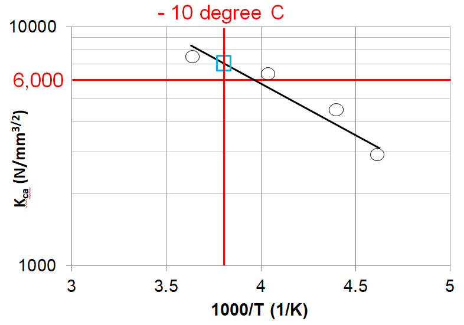
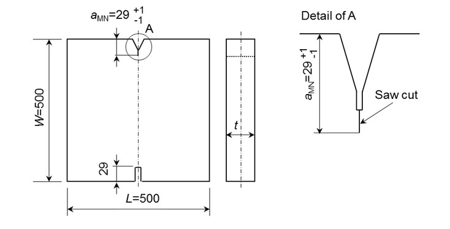

<!-- markdownlint-disable MD033 -->
# W31 YP47 Steels and Brittle Crack Arrest Steels

(Jan 2013)
(Rev.1 Sept 2015)
(Rev.2 Dec 2019 Complete Revision)
(Rev.3 Mar 2023)

## 1. Scope

### 1.1 General

1.1.1 This UR defines the requirements on YP47 steels and brittle crack arrest steels as required by UR S33.

1.1.2 Unless otherwise specified in this UR, UR W11 is to be followed.

### 1.2 YP47 steels

1.2.1 Steels designated as YP47 refer to steels with a specified minimum yield point of 460 N/mm2.

1.2.2 The YP47 steels can be applied to longitudinal structural members in the upper deck region of container carriers (such as hatch side coaming, hatch coaming top and the attached longitudinals, etc.). Special consideration is to be given to the application of YP47 steels for other hull structures.

1.2.3 This UR gives the requirements for YP47 steels in thickness greater than 50mm and not greater than 100mm intended for the upper deck region of container carriers. For YP47 steels outside scope of the said thickness range, special consideration is to be given by the Classification Society.

---

Notes:

1. This UR is to be applied by IACS Societies on ships contracted for construction on or after 1 January 2014.

2. Revision 1 of this UR is to be applied by IACS Societies to ships contracted for construction on or after 1 January 2017.

3. The "contracted for construction" date means the date on which the contract to build the vessel is signed between the prospective owner and the shipbuilder. For further details regarding the date of "contract for construction", refer to IACS Procedural Requirement (PR) No. 29.

4. Revision 2 of this UR is to be uniformly implemented by IACS Societies on ships contracted for construction on or after 01 January 2021.

5. Revision 3 of this UR is to be uniformly implemented by IACS Societies when the application for certification of manufacturer approval is dated on or after 01 July 2024.

### 1.3 Brittle crack arrest steels

1.3.1 The brittle crack designation can be assigned to YP36 and YP40 steels specified in UR W11 and YP47 steels specified in this UR, which meet the additional brittle crack arrest requirements and properties defined in this UR.

1.3.2 The application of brittle crack arrest steels is to comply with UR S33, which covers longitudinal structural members in the upper deck region of container carriers (such as hatch side coaming, upper deck, hatch coaming top and the attached longitudinals, etc.).

1.3.3 The thickness range of brittle crack arrest steels is over 50mm and not greater than 100mm as specified in Table 3 of this UR.

## 2 Material specifications

### 2.1 YP47 steels

Material specifications for YP47 steels are specified in Table 1 and Table 2.

Table 1 Chemical composition and deoxidation practice for YP47 steels without specified brittle crack arrest properties

| Grade | EH47 |
|---|---|
| Deoxidation Practice | Killed and fine grain treated |
| Chemical Composition % (ladle samples)(6)(7) | |
| C max. | 0.18 |
| Mn | 0.90 – 2.00 |
| Si max. | 0.55 |
| P max. | 0.020 |
| S max. | 0.020 |
| Al (acid soluble min) | 0.015 (1)(2) |
| Nb | 0.02 – 0.05 (2)(3) |
| V | 0.05 – 0.10 (2)(3) |
| Ti max. | 0.02(3) |
| Cu max. | 0.35 |
| Cr max. | 0.25 |
| Ni max. | 1.0 |
| Mo max. | 0.08 |
| Ceq max.(4) | 0.49 |
| Pcm max.(5) | 0.22 |

Notes:

1. The total aluminium content may be determined instead of the acid soluble content. In such cases the total aluminium content is to be not less than 0.020%.

2. The steel is to contain aluminium, niobium, vanadium or other suitable grain refining elements, either singly or in any combination. When used singly the steel is to contain the specified minimum content of the grain refining element. When used in combination, the specified minimum content of a fine graining element is not applicable.

3. The total niobium, vanadium and titanium content is not to exceed 0.12%.

4. The carbon equivalent Ceq value is to be calculated from the ladle analysis using the following formula:

    $$C_{eq} = C + \frac{Mn}{6} + \frac{Cr + Mo + V}{5} + \frac{Ni + Cu}{15} (\%)$$

5. Cold cracking susceptibility Pcm value is to be calculated using the following formula:

    $$P_{cm} = C + \frac{Si}{30} + \frac{Mn}{20} + \frac{Cu}{20} + \frac{Ni}{60} + \frac{Cr}{20} + \frac{Mo}{15} + \frac{V}{10} + 5B (\%)$$

6. Where additions of any other element have been made as part of the steelmaking practice subject to approval by the Classification Society, the content is to be indicated on product inspection certificate.

7. Variations in the specified chemical composition may be allowed subject to approval of Classification Society.

Table 2 Conditions of supply, grade and mechanical properties for YP47 steels without specified brittle crack arrest properties (1)

| Supply condition | Grade | Tensile test - Yield Strength (N/mm2) min. | Tensile test - Tensile Strength (N/mm2) | Tensile test - Elongation (%) min. | Impact test - Test Temp. (°C) | Impact test - Average Impact Energy (J) min. 50 < t ≤ 70 Longitudinal | Impact test - Average Impact Energy (J) min. 70 < t ≤ 85 Longitudinal | Impact test - Average Impact Energy (J) min. 85 < t ≤ 100 Longitudinal |
|---|---|---|---|---|---|---|---|---|
| TMCP(2) | EH47 | 460 | 570 - 720 | 17 | -40 | 53 | 64 | 75 |

t thickness (mm)

Notes:

1. The additional requirements for YP47 steel with brittle crack arrest properties is specified in 2.2 of this UR.

2. Other conditions of supply are to be in accordance with the Classification Society's procedures.

### 2.2 Brittle crack arrest steels

2.2.1 Brittle crack arrest steels are defined as steel plate with the specified brittle crack arrest properties measured by either the brittle crack arrest toughness Kca or Crack Arrest Temperature (CAT).

2.2.2 In addition to the required mechanical properties of UR W11 for YP36 and YP40 and Table 2 of this UR for YP47, brittle crack arrest steels are to comply with the requirements specified in Table 3 and Table 4 of this UR.

2.2.3 The brittle crack arrest properties specified in Table 3 are to be evaluated for the products in accordance with the procedure approved by the Classification Society. Test specimens are to be taken from each piece (means "the rolled product from a single slab or ingot if this is rolled directly into plates" as defined in UR W11), unless otherwise agreed by the Classification Society.

Table 3 Requirement of brittle crack arrest properties for brittle crack arrest steels

| Suffix to the steel grade(1) | Thickness range (mm) | Brittle crack arrest properties(2)(6) - Brittle Crack Arrest Toughness Kca at -10 °C (N/mm3/2) (3) | Brittle crack arrest properties(2)(6) - Crack Arrest Temperature CAT (°C) (4) |
|---|---|---|---|
| BCA1 | 50 < t ≤ 100 | 6,000 min. | -10 or below |
| BCA2 | 80 < t ≤ 100(7) | 8,000 min. | (5) |

t: thickness (mm)

Notes:

1. Suffix "BCA1" or "BCA2" is to be affixed to the steel grade designation (e.g. EH40-BCA1, EH47-BCA1, EH47-BCA2, etc.).

2. Brittle crack arrest properties for brittle crack arrest steels are to be verified by either the brittle crack arrest toughness Kca or Crack Arrest Temperature (CAT).

3. Kca value is to be obtained by the brittle crack arrest test specified in Annex 3 of this UR.

4. CAT is to be obtained by the test method specified in Annex 4 of this UR.

5. Criterion of CAT for brittle crack arrest steels corresponding to Kca=8,000 N/mm3/2 is to be approved by the Classification Society

6. Where small-scale tests are used for product testing (batch release testing), these test methods are to be approved by the Classification Society in accordance with Annex 5 of this UR.

7. Lower thicknesses may be approved at the discretion of the Classification Society.

Table 4 Chemical composition and deoxidation practice for brittle crack arrest steels

| Grade | EH36-BCA | EH40-BCA | EH47-BCA |
|---|---|---|---|
| Deoxidation Practice | Killed and fine grain treated | Killed and fine grain treated | Killed and fine grain treated |
| Chemical Composition % (1)(7)(8) (ladle samples) | | | |
| C max. | 0.18 | 0.18 | 0.18 |
| Mn | 0.90 – 2.00 | 0.90 – 2.00 | 0.90 – 2.00 |
| Si max. | 0.50 | 0.50 | 0.55 |
| P max. | 0.020 | 0.020 | 0.020 |
| S max. | 0.020 | 0.020 | 0.020 |
| Al (acid soluble min) | 0.015 (2)(3) | 0.015 (2)(3) | 0.015 (2)(3) |
| Nb | 0.02 – 0.05 (3)(4) | 0.02 – 0.05 (3)(4) | 0.02 – 0.05 (3)(4) |
| V | 0.05 – 0.10 (3)(4) | 0.05 – 0.10 (3)(4) | 0.05 – 0.10 (3)(4) |
| Ti max. | 0.02(4) | 0.02(4) | 0.02(4) |
| Cu max. | 0.50 | 0.50 | 0.50 |
| Cr max. | 0.25 | 0.25 | 0.50 |
| Ni max. | 2.0 | 2.0 | 2.0 |
| Mo max. | 0.08 | 0.08 | 0.08 |
| Ceq max.(5) | 0.47 | 0.49 | 0.55 |
| Pcm max.(6) | - | - | 0.24 |

Notes:

1. Chemical composition of brittle crack arrest steels shall comply with Table 4 of this UR, regardless of chemical composition specified in UR W11 and Table 1 of this UR.

2. The total aluminium content may be determined instead of the acid soluble content. In such cases the total aluminium content is to be not less than 0.020%.

3. The steel is to contain aluminium, niobium, vanadium or other suitable grain refining elements, either singly or in any combination. When used singly the steel is to contain the specified minimum content of the grain refining element. When used in combination, the specified minimum content of a fine graining element is not applicable.

4. The total niobium, vanadium and titanium content is not to exceed 0.12%.

5. The carbon equivalent Ceq value is to be calculated from the ladle analysis using the following formula:

    $$C_{eq} = C + \frac{Mn}{6} + \frac{Cr + Mo + V}{5} + \frac{Ni + Cu}{15} (\%)$$

6. Cold cracking susceptibility Pcm value is to be calculated using the following formula:

    $$P_{cm} = C + \frac{Si}{30} + \frac{Mn}{20} + \frac{Cu}{20} + \frac{Ni}{60} + \frac{Cr}{20} + \frac{Mo}{15} + \frac{V}{10} + 5B (\%)$$

7. Where additions of any other element have been made as part of the steelmaking practice subject to approval by the Classification Society, the content is to be indicated on product inspection certificate.

8. Variations in the specified chemical composition may be allowed subject to approval of Classification Society.

## 3 Manufacturing approval scheme

### 3.1 YP47 steels

Manufacturing approval scheme for YP47 steels is to be in accordance with Annex 1 of this UR.

### 3.2 Brittle crack arrest steels

Manufacturing approval scheme for brittle crack arrest steels is to be in accordance with Annex 2 of this UR.

## 4 Welding procedure qualification test

### 4.1 YP47 steels

#### 4.1.1 General

Approval test items, test methods and acceptance criteria not specified in this UR are to be in accordance with the Classification Society's procedures.

#### 4.1.2 Approval range

UR W28 is to be followed for approval range.

#### 4.1.3 Impact test

UR W28 is to be followed for impact test. 64J at -20°C is to be satisfied.

#### 4.1.4 Hardness

HV10, as defined in UR W28, is to be not more than 350. Measurement points are to include mid-thickness position in addition to the points required by UR W28.

#### 4.1.5 Tensile test

Tensile strength in transverse tensile test is to be not less than 570N/mm2.

#### 4.1.6 Brittle fracture initiation test

Deep notch test or CTOD test may be required.

Test method and acceptance criteria are to be considered appropriate by the Classification Society.

### 4.2 Brittle crack arrest steels

#### 4.2.1 General

Where Welding Procedure Specification (WPS) for the non-BCA steels has been approved by the Classification Society, the said WPS is applicable to the same welding procedure applied to the same grade with suffix "BCA1" or "BCA2" specified in Table 3 of this UR except high heat input processes over 50kJ/cm.

The requirements for welding procedure qualification test for brittle crack arrest steels is to be in accordance with the relevant requirements for each steel grade excluding suffix "BCA1" or "BCA2" specified in Table 3 of this UR, except for 4.2.2 below.

#### 4.2.2 Hardness

For YP47 steels with brittle crack arrest properties, HV10, as defined in UR W28, is to be not more than 380, and measurement points are to include mid-thickness position in addition to the points required by UR W28.

## 5 Production welding

### 5.1 YP47 steels

#### 5.1.1 Welder

Welders engaged in YP47 welding work are to possess welder's qualifications specified in UR W32.

#### 5.1.2 Short bead

Short bead length for tack and repairs of welds by welding are not to be less than 50mm.

In the case where Pcm is less than or equal to 0.19, 25mm of short bead length may be adopted with approval of the Classification Society.

#### 5.1.3 Preheating

Preheating is to be 50°C or over when air temperature is 5°C or below.

In the case where Pcm is less than or equal to 0.19 and the air temperature is below 5°C but above 0°C, alternative preheating requirements may be adopted with approval of the Classification Society.

#### 5.1.4 Welding consumables

Approval procedure, approval test items, test methods and acceptance criteria not specified in this UR are to be in accordance with UR W17.

Specifications of welding consumables for YP47 steel plates are to be in accordance with Table 5.

Table 5 Mechanical properties for deposited metal tests for welding consumables

| Mechanical Properties - Yield Strength (N/mm2) min. | Mechanical Properties - Tensile Strength (N/mm2) | Mechanical Properties - Elongation (%) min. | Impact test - Test Temp. (°C) | Impact test - Average Impact Energy (J) min. |
|---|---|---|---|---|
| 460 | 570 - 720 | 19 | -20 | 64 |

Consumables tests for butt weld assemblies are to be in accordance with Table 6.

Table 6 Mechanical properties for butt weld tests for welding consumables

| Tensile strength (N/mm2) | Bend test ratio: $\frac{D}{t}$ | Charpy V-notch impact tests - Test temperature (°C) | Charpy V-notch impact tests - Average absorbed energy (J) min. |
|---|---|---|---|
| 570 - 720 | 4 | - 20 | 64 |

#### 5.1.5 Others

Special care is to be paid to the final welding so that harmful defects do not remain.

Jig mountings are to be completely removed with no defects in general, otherwise the treatment of the mounting is to be accepted by the Classification Society.

### 5.2 Brittle crack arrest steels

Welding work (such as relevant welder's qualification, short bead, preheating, selection of welding consumables, etc.) for brittle crack arrest steels is to be in accordance with the relevant requirements for each steel grade excluding suffix "BCA1" or "BCA2" specified in Table 3 of this UR.

## Annex 1 Manufacturing Approval Scheme for YP47 Steels

### A1.1. Scope

A1.1.1 This Annex specifies, as given in 3.1 of this UR, the manufacturing approval scheme for YP47 steels of grade EH47.

A1.1.2 Unless otherwise specified in this Annex, Appendix A2 of UR W11 is to be followed.

### A1.2. Approval tests

#### A1.2.1 Extent of the approval tests

A1.2.1.1   3.1 (c) and (d), Appendix A2 of UR W11 are not applied to manufacturing approval of YP47 steels.

A1.2.1.2 The products for testing are to represent the maximum thickness for approval. If the target chemical composition changes with the thickness, the maximum thickness for each specified chemical composition specification shall be tested.

#### A1.2.2 Type of tests

A1.2.2.1 Brittle fracture initiation test

Deep notch test or Crack Tip Opening Displacement (CTOD) test is to be carried out. Test method is to be in accordance with the Classification Society's practice.

A1.2.2.2 Weldability test

(a) Y-groove weld cracking test (Hydrogen crack test)

The test method is to be in accordance with recognized national standards such as ISO 17642-2:2005. Acceptance criteria are to be in accordance with the Classification Society's practice.

(b) Brittle fracture initiation test

Deep notch test or CTOD test is to be carried out. Test method and results are to be considered appropriate by the Classification Society.

A1.2.2.3 Other tests

In addition to the requirement specified in A1.2.2.1 and A1.2.2.2 above, the approval tests required for steels specified in Appendix A2 of UR W11 are to be carried out. Additional tests may be required when deemed necessary by the Classification Society.

## Annex 2 Manufacturing Approval Scheme for Brittle Crack Arrest Steels

### A2.1. Scope

A2.1.1 This Annex specifies, as given in 3.2 of this UR, the manufacturing approval scheme for brittle crack arrest steels.

A2.1.2 Unless otherwise specified in this Annex, Appendix A2 of UR W11 and/or Annex1 of this UR are to be followed.

### A2.2. Approval Application

#### A2.2.1 Documents to be submitted

The manufacturer is to submit to the Classification Society the following documents together with those required in 2.1, Appendix A2 of UR W11:

a) In-house test reports of the brittle crack arrest properties of the steels intended for approval
b) Approval test program for the brittle crack arrest properties (see A2.3.1 below)
c) Production test procedure for the brittle crack arrest properties.

### A2.3. Approval tests

#### A2.3.1 Extent of the approval tests

A2.3.1.1 The extent of the test program is specified in A2.3.2, A2.3.3 and A2.3.4 of this Annex. If the manufacturing process and mechanism to ensure the brittle crack arrest properties for the steels intended for approval are same, 3.1, Appendix A2 of UR W11 is to be followed for the extent of the approval tests. For YP47 steels with brittle crack arrest properties, 3.1 (c) and (d), Appendix A2 of UR W11 are not applied.

A2.3.1.2 The products for testing are to represent the maximum thickness for approval. If the target chemical composition changes with the thickness, the maximum thickness for each specified chemical composition specification shall be tested.

A2.3.1.3 The number of test samples and test specimens may be increased when deemed necessary by the Classification Society, based on the in-house test reports of the brittle crack arrest properties of the steels intended for approval specified in A2.2.1 a).

#### A2.3.2 Type of tests

A2.3.2.1 Brittle crack arrest tests are to be carried out in accordance with A2.3.3 of this Annex in addition to the approval tests specified in Appendix A2 of UR W11 and/or Annex 1 of this UR.

A2.3.2.2 In the case of applying for addition of the specified brittle crack arrest properties for YP36, YP40 and YP47 steels of which, manufacturing process has been approved by the Classification Society (i.e. the aim analyses and method of manufacture are similar and the steelmaking process, deoxidation and fine grain practice, casting method and condition of supply are the same), brittle crack arrest tests, chemical analyses, tensile test and Charpy V-notch impact test are to be carried out in accordance with Annex 2 of this UR and Appendix A2 of UR W11.

#### A2.3.3 Test specimens and testing procedure of brittle crack arrest tests

A2.3.3.1 The test specimens of the brittle crack arrest tests are to be taken with their longitudinal axis parallel to the final rolling direction of the test plates.

A2.3.3.2 The loading direction of brittle crack tests is to be parallel to the final rolling direction of the test plates.

A2.3.3.3 The thickness of the test specimens of the brittle crack arrest tests is to be the full thickness of the test plates.

A2.3.3.4 The test specimens and repeat test specimens are to be taken from the same steel plate. Where the brittle crack arrest properties are evaluated by Kca, and the brittle crack arrest test result fails to meet the requirement, further brittle crack arrest tests may be carried out. In this case, the judgment of acceptance is to be made on the arrest toughness value Kca of all test specimens (results of the initial test, failed tests and additional tests shall be included in the testing report.).

A2.3.3.5 The thickness of the test specimen is to be the maximum thickness of the steel plate requested for approval.

A2.3.3.6 In the case where the brittle crack arrest properties are evaluated by Kca, the brittle crack arrest test method is to be in accordance with Annex 3 of this UR. In the case where the brittle crack arrest properties are evaluated by CAT, the test method is to be in accordance with Annex 4 of this UR.

#### A2.3.4 Other tests

Additional tests may be required when deemed necessary by the Classification Society in addition to the tests specified in A2.3.3.

### A2.4. Results

Appendix A2 of UR W11 is to be followed for the results. Additionally, results of test items and the procedures shall comply with the test program approved by the Classification Society. In the case where the brittle crack arrest properties are evaluated by Kca or CAT, the manufacturer also is to submit to the Classification Society the brittle crack arrest test reports in accordance with Annex 3 for Kca and Annex 4 for CAT of this UR.

### A2.5. Approval and Certification

Upon satisfactory completion of the survey and tests, approval is granted by the Classification Society with the grade designation having the suffix "BCA1" or "BCA2" (e.g. EH40-BCA1, EH47-BCA1, EH47-BCA2, etc.).

### A2.6. Renewal of approval

The manufacturer is also to submit to the Classification Society actual manufacturing records of the approved brittle crack arrest steels within the term of validity of the manufacturing approval certificate.

Note: Chemical composition, mechanical properties, brittle crack arrest properties (e.g. brittle crack arrest test results or small-scale test results) and nominal thickness are to be described in the form of histogram or statistics.

## Annex 3 Test Method for Brittle Crack Arrest Toughness, Kca

### A3.1. Scope

ISO20064: 2019 provides a test method for the determination of brittle crack arrest toughness of steel by using wide plates with a temperature gradient.
This Annex 3 specifies the test procedures for brittle crack arrest toughness (i.e. Kca) of steel using fracture mechanics parameter and determination method of Kca at a specific temperature which are specified in ISO 20064:2019. Additionally, this Annex 3 specifies the evaluation method of Kca of test plate. This Annex 3 is applicable to hull structural steels with the thickness over 50mm and not greater than 100mm specified in UR W11 or this UR.

### A3.2. Test Procedures

The test procedures including testing equipment, test specimens, test methods, determination of arrest toughness, reporting of test results, etc. are to be in accordance with ISO 20064: 2019. As a method for initiating a brittle crack, a secondary loading mechanism can be used in accordance with Annex D of ISO 20064: 2019, except that the first sentence in Annex B.2.4 of ISO 20064: 2019 is revised to "Obtain the value {Kca /[K0 *exp(−c/TcaK)]} for each data point".

### A3.3. Determination of Kca at a specific temperature and the evaluation

#### A3.3.1 Method

The method for conducting multiple tests to obtain Kca value at a specific temperature is to be in accordance with Annex B of ISO 20064: 2019.

#### A3.3.2 Evaluation

The straight-line approximation of Arrhenius plot for valid *Kca* data by interpolation method are to comply with either the following (1) or (2):

(1) The evaluation temperature of *Kca* (i.e. - 10 degree C) is located between the upper and lower limits of the arrest temperature, with the *Kca* corresponding to the evaluation temperature not lower than the required *Kca* (e.g. 6,000 N/mm3/2 or 8,000 N/mm3/2), as shown in Fig. A3-1.

**Fig. A3-1 Example for evaluation of *Kca* at - 10 degree C**

(2) The temperature corresponding to the required *Kca* (e.g. 6,000 N/mm3/2 or 8,000 N/mm3/2) is located between the upper and lower limits of the arrest temperature, with the temperature corresponding to the required *Kca* not higher than the evaluation temperature (i.e. -10 degree C), as shown in Fig. A3-2.

**Fig. A3-2 Example for evaluation of temperature corresponding to the required *Kca***

If both of (1) and (2) above are not satisfied, conduct additional tests to satisfy this condition.

## Annex 4 Outline of requirements for undertaking isothermal Crack Arrest Temperature (CAT) test

### A4.1 Scope of application

A4.1.1 Annex 4 is to be applied according to the scope defined in UR W31.

A4.1.2 Annex 4 specifies the requirements for test procedures and test conditions when using the isothermal crack arrest test to determine a valid test result under isothermal conditions and in order to establish the crack arrest temperature (CAT). Annex 4 is applicable to steels with thickness over 50mm and not greater than 100mm.

A4.1.3 This method uses an isothermal temperature in the test specimen being evaluated. Unless otherwise specified in this Annex 4, the other test parameters are to be in accordance with ISO 20064: 2019.

A4.1.4 Table 3 of UR W31 gives the relevant requirements for the brittle crack arrest property described by the crack arrest temperature (CAT).

A4.1.5 The manufacturer is to submit the test procedure to the Classification Society for review prior to testing.

### A4.2 Symbols and their significance

A4.2.1 Table A4-1 supplements Table 1 in ISO 20064: 2019 with specific symbols for the isothermal test.

Table A4-1 Nomenclature supplementary to Table 1 in ISO 20064: 2019

| Symbol | Unit | Significance |
|---|---|---|
| *t* | mm | Test specimen thickness |
| *L* | mm | Test specimen length |
| *W* | mm | Test specimen width |
| *aMN* | mm | Machined notch length on specimen edge |
| *LSG* | mm | Side groove length on side surface from the specimen edge. LSG is defined as a groove length with constant depth except a curved section in depth at side groove end. |
| *dSG* | mm | Side groove depth in section with constant depth |
| *LEB - min* | mm | Minimum length between specimen edge and electron beam re-melting zone front |
| *LEB-s1, -s2* | mm | Length between specimen edge and electron beam re-melting zone front appeared on both specimen side surfaces |
| *LLTG* | mm | Local temperature gradient zone length for brittle crack runway |
| *aarrest* | mm | Arrested crack length |
| *Ttarget* | °C | Target test temperature |
| *Ttest* | °C | Defined test temperature |
| *Tarrest* | °C | Target test temperature at which valid brittle crack arrest behaviour is observed |
| σ | N/mm2 | Applied test stress at cross section of *W* x *t* |
| SMYS | N/mm2 | Specified minimum yield strength of the tested steel grade to be approved |
| CAT | °C | Crack arrest temperature, the lowest temperature, *Tarrest*, at which running brittle crack is arrested |

### A4.3 Testing equipment

A4.3.1 The test equipment to be used is to be of the hydraulic type of sufficient capacity to provide a tensile load equivalent to ⅔ of SMYS of the steel grade to be approved.

A4.3.2 The temperature control system is to be equipped to maintain the temperature in the specified region of the specimen within ±2°C from *Ttarget*.

A4.3.3 Methods for initiating the brittle crack may be of drop weight type, air gun type or double tension tab plate type.

A4.3.4 The detailed requirements for testing equipment are to be in accordance with ISO 20064: 2019.

### A4.4 Test specimens

#### A4.4.1 Impact type crack initiation

A4.4.1.1 Test specimens are to be in accordance with ISO 20064: 2019, unless otherwise specified in this Annex.

A4.4.1.2 Specimen dimensions are shown in Figure A4-1. The test specimen width, *W* shall be 500mm. The test specimen length, *L* shall be equal to or greater than 500mm.

A4.4.1.3 V-shape notch for brittle crack initiation is machined on the specimen edge of the impact side. The whole machined notch length shall be equal to 29mm with a tolerance range of ±1mm.

A4.4.1.4 Requirements for side grooves are described in A4.4.4.

Figure A4-1 Test specimen dimensions for an impact type specimen

NOTE: Saw cut notch radius may be machined in the range 0.1mmR and 1mmR in order to control a brittle crack initiation at test.

#### A4.4.2 Double tension type crack initiation

A4.4.2.1 Reference shall be made to Annex D in ISO 20064: 2019 for the shape and sizes in secondary loading tab and secondary loading method for brittle crack initiation.

A4.4.2.2 In a double tension type test, the secondary loading tab plate may be subject to further cooling to enhance an easy brittle crack initiation.

#### A4.4.3 Embrittled zone setting

A4.4.3.1 An embrittled zone shall be applied to ensure the initiation of a running brittle crack. Either Electron Beam Welding (EBW) or Local Temperature Gradient (LTG) may be adopted to facilitate the embrittled zone.

A4.4.3.2 In EBW embrittlement, electron beam welding is applied along the expected initial crack propagation path, which is the centre line of the specimen in front of the machined V-notch.

A4.4.3.3 The complete penetration through the specimen thickness is required along the embrittled zone. One side EBW penetration is preferable, but dual sides EB penetration may be also adopted when the EBW power is not enough to achieve the complete penetration by one side EBW.

A4.4.3.4 The EBW embrittlement is recommended to be prepared before specimen contour machining.

A4.4.3.5 In EBW embrittlement, zone shall be of an appropriate quality.

Note: EBW occasionally behaves in an un-stable manner at start and end points. EBW line is recommended to start from the embrittled zone tip side to the specimen edge with an increasing power control or go/return manner at start point to keep the stable EBW.

A4.4.3.6 In LTG system, the specified local temperature gradient between machined notch tip and isothermal test region is regulated after isothermal temperature control. LTG temperature control is to be achieved just before brittle crack initiation, nevertheless the steady temperature gradient through the thickness shall be ensured.

#### A4.4.4 Side grooves

A4.4.4.1 Side grooves on side surface can be machined along the embrittled zone to keep brittle crack propagation straight. Side grooves shall be machined in the specified cases as specified in this section.

A4.4.4.2 In EBW embrittlement, side grooves are not necessarily mandatory. Use of EBW avoids the shear lips. However, when shear lips are evident on the fractured specimen, e.g. shear lips over 1mm in thickness in either side then side grooves should be machined to suppress the shear lips.

A4.4.4.3 In LTG embrittlement, side grooves are mandatory. Side grooves with the same shape and size shall be machined on both side surfaces.

A4.4.4.4 The length of side groove, *LSG* shall be no shorter than the sum of the required embrittled zone length.

A4.4.4.5 When side grooves would be introduced, the side groove depth, the tip radius and the open angle are not regulated, but are adequately selected in order to avoid any shear lips over 1mm thickness in either side. An example of side groove dimensions are shown in Figure A4-2.

A4.4.4.6 Side groove end shall be machined to make a groove depth gradually shallow with a curvature larger than or equal to groove depth, *dSG*. Side groove length, *LSG* is defined as a groove length with constant depth except a curved section in depth at side groove end.

Figure A4-2 Side groove configuration and dimensions

#### A4.4.5 Nominal length of embrittled zone

A4.4.5.1 The length of embrittled zone shall be at least 150mm.

Figure A4-3 Definition of EBW length

A4.4.5.2 EBW zone length is regulated by three measurements on the fracture surface after test as shown in Figure A4-3, *LEB-min* between specimen edge and EBW front line, and *LEB-s1* and *LEB-s2*.

A4.4.5.3 The minimum length between specimen edge and EBW front line, *LEB-min* should be no smaller than 150mm. However, it can be acceptable even if *LEB-min* is no smaller than 150mm-0.2*t*, where *t* is specimen thickness. When *LEB-min* is smaller than 150mm, a temperature safety margin shall be considered into *Ttest* (See A4.8.1.2).
A4.4.5.4 Another two are the lengths between specimen edge and EBW front appeared on both side surfaces, as denoted with *LEB-s1* and *LEB-s2*. Both of *LEB-s1* and *LEB-s2* shall be no smaller than 150mm.

A4.4.5.5 In LTG system, *LLTG* is set as 150mm.

#### A4.4.6 Tab plate / pin chuck details and welding of test specimen to tab plates

A4.4.6.1 The configuration and size of tab plates and pin chucks shall be referred to ISO 20064: 2019. The welding distortion in the integrated specimen, which is welded with specimen, tab plates and pin chucks, shall be also within the requirement in ISO 20064: 2019.

### A4.5 Test method

#### A4.5.1 Preloading

A4.5.1.1   Preloading at room temperature can be applied to avoid unexpected brittle crack initiation at test. The applied load value shall be no greater than the test stress. Preloading can be applied at higher temperature than ambient temperature when brittle crack initiation is expected at preloading process. However, the specimen shall not be subjected to temperature higher than 100°C.

#### A4.5.2 Temperature measurement and control

A4.5.2.1   Temperature control plan showing the number and position of thermocouples is to be in accordance with this section.

A4.5.2.2   Thermocouples are to be attached to both sides of the test specimen at a maximum interval of 50mm in the whole width and in the longitudinal direction at the test specimen centre position (0.5 *W*) within the range of ±100mm from the centreline in the longitudinal direction, refer to Figure A4-4.

Figure A4-4 Locations of temperature measurement

A4.5.2.3 For EBW embrittlement

A4.5.2.3.1 The temperatures of the thermocouples across the range of 0.3*W*~0.7*W* in both width and longitudinal directions are to be controlled within ± 2°C of the target test temperature, *Ttarget*.
A4.5.2.3.2 When all measured temperatures across the range of 0.3*W*~0.7*W* have reached *Ttarget*, steady temperature control shall be kept at least for 10 + 0.1 x *t* [mm] minutes to ensure a uniform temperature distribution into mid-thickness prior to applying test load.

A4.5.2.3.3 The machined notch tip can be locally cooled to easily initiate brittle crack. Nevertheless, the local cooling shall not disturb the steady temperature control across the range of 0.3*W*~0.7*W*.

A4.5.2.4 For LTG embrittlement:

A4.5.2.4.1 In LTG system, in addition to the temperature measurements shown in Figure A4-4, the additional temperature measurement at the machine notch tip, A0 and B0 is required. Thermocouples positions within LTG zone are shown in Figure A4-5.

Figure A4-5 Detail of LTG zone and additional thermocouple A0

A4.5.2.4.2 The temperatures of the thermocouples across the range of 0.3*W*~0.7*W* in both width and longitudinal directions are to be controlled within ± 2°C of the target test temperature, *Ttarget*. However, the temperature measurement at 0.3*W* (location of A3 and B3) shall be in accordance with A4.5.2.4.6 below.

A4.5.2.4.3 Once the all measured temperatures across the range of 0.3*W*~0.7*W* have reached *Ttarget*, steady temperature control shall be kept for 10 + 0.1 x *t* [mm] minutes to ensure a uniform temperature distribution into mid-thickness, then the test load is applied.

A4.5.2.4.4 LTG is controlled by local cooling around the machined notch tip. LTG profile shall be recorded by the temperature measurements from A0 to A3 shown in Figure A4-6.

A4.5.2.4.5 LTG zone is established by temperature gradients in three zones, Zone I, Zone II and Zone III. The acceptable range for each temperature gradient is listed Table A4-2.

A4.5.2.4.6 Temperature measurements at A2, B2 and A3, B3 shall be satisfied the following requirements:

$$T \text{ at } A_3,\ T \text{ at } B_3 < T_{target} - 2\,°C$$

$$T \text{ at } A_2 < T \text{ at } A_3 - 5\,°C$$

$$T \text{ at } B_2 < T \text{ at } B_3 - 5\,°C$$

A4.5.2.4.7 No requirements for *T* at A0 and *T* at A1 temperatures when *T* at A3 and *T* at A2 satisfy the requirements above. Face B is the same.

A4.5.2.4.8 The temperatures from A0, B0 to A3, B3 should be decided at test planning stage refer to Table A4-2 which gives the recommended temperature gradients in three zones, Zone I, Zone II and Zone III in LTG zone.

Figure A4-6 Schematic temperature gradient profile in LTG zone

Table A4-2 Acceptable LTG range

| Zone | Location from edge | Acceptable range of temperature gradient |
|---|---|---|
| Zone I | 29mm – 50mm | 2.00 °C/mm – 2.30 °C/mm |
| Zone II | 50mm – 100mm | 0.25 °C/mm – 0.60 °C/mm |
| Zone III1) | 100mm – 150mm | 0.10 °C/mm – 0.20 °C/mm |

Note 1: The Zone III arrangement is mandatory

A4.5.2.4.9 The temperature profile in LTG zone mentioned above shall be ensured after holding time at least for 10 + 0.1 x *t* [mm] minutes to ensure a uniform temperature distribution into mid-thickness before brittle crack initiation.

A4.5.2.4.10 The acceptance of LTG in the test shall be decided from Table A4-2 based on the measured temperatures from A0 to A3.

A4.5.2.5 For double tension type crack initiation specimen:

A4.5.2.5.1 Temperature control and holding time at steady state shall be the same as the case of EBW embrittlement specified in 5.2.3 or the case of LTG embrittlement specified in Section A4.5.2.4.

#### A4.5.3 Loading and brittle crack initiation

A4.5.3.1   Prior to testing, a target test temperature (*Ttarget*) shall be selected.

A4.5.3.2   Test procedures are to be in accordance with ISO 20064: 2019 except that the applied stress is to be ⅔ of SMYS of the steel grade tested.

A4.5.3.3   The test load shall be held at the test target load or higher for a minimum of 30 seconds prior to crack initiation.

A4.5.3.4   Brittle crack can be initiated by impact or secondary tab plate tension after all of the temperature measurements and the applied force are recorded.

### A4.6 Measurements after test and test validation judgement

#### A4.6.1 Brittle crack initiation and validation

A4.6.1.1   If brittle crack spontaneously initiates before the test force is achieved or the specified hold time at the test force is not achieved, the test shall be invalid.

A4.6.1.2   If brittle crack spontaneously initiates without impact or secondary tab tension but after the specified time at the test force is achieved, the test is considered as a valid initiation. The following validation judgments of crack path and fracture appearance shall be examined.

#### A4.6.2 Crack path examination and validation

A4.6.2.1   When brittle crack path in embrittled zone deviates from EBW line or side groove in LTG system due to crack deflection and/or crack branching, the test shall be considered as invalid.

A4.6.2.2   All of the crack path from embrittled zone end shall be within the range shown in Figure A4-7. If not, the test shall be considered as invalid.

Figure A4-7 Allowable range of main crack propagation path

#### A4.6.3 Fracture surface examination, crack length measurement and their validation

A4.6.3.1   Fracture surface shall be observed and examined. The crack "initiation" and "propagation" are to be checked for validity and judgements recorded. The crack "arrest" positions are to be measured and recorded.

A.4.6.3.2   When crack initiation trigger point is clearly detected at side groove root, other than the V-notch tip, the test shall be invalid.

A4.6.3.3   In EBW embrittlement setting, EBW zone length is quantified by three measurements of *LEB-s1*, *LEB-s2* and *LEB-min*, which are defined in A4.4.5. When either or both of *LEB-s1* and *LEB-s2* are smaller than 150mm, the test shall be invalid. When *LEB-min* is smaller than 150mm-0.2*t*, the test shall be invalid.

A4.6.3.4   When the shear lip with thickness over 1mm in either side near side surfaces of embrittled zone are visibly observed independent of the specimens with or without side grooves, the test shall be invalid.

A4.6.3.5   In EBW embrittlement setting, the penetration of brittle crack beyond the EBW front line shall be visually examined. When any brittle fracture appearance area continued from the EB front line is not detected, the test shall be invalid.

A4.6.3.6   The weld defects in EBW embrittled zone shall be visually examined. If detected, it shall be quantified. A projecting length of defect on the thickness line through EB weld region along brittle crack path shall be measured, and the total occupation ratio of the projected defect part to the total thickness is defined as defect line fraction (See Figure A4-8). When the defects line fraction is larger than 10 %, the test shall be invalid.

Fig. A4-8 Counting procedure of defect line fraction

A4.6.3.7   In EBW embrittlement by dual sides' penetration, a gap on embrittled zone fracture surface which is induced by miss meeting of dual fusion lines is visibly detected at an overlapped line of dual side penetration, the test shall be invalid.

#### A4.7 Judgement of "arrest" or "propagate"

A4.7.1 The final test judgment of "arrest", "propagate" or "invalid" is decided by the following requirements of A4.7.2 through A4.7.6.

A4.7.2 If initiated brittle crack is arrested and the tested specimen is not broken into two pieces, the fracture surfaces should be exposed with the procedures specified in ISO 20064: 2019.

A4.7.3 When the specimen was not broken into two pieces during testing, the arrested crack length, *aarrest* shall be measured on the fractured surfaces. The length from the specimen edge of impact side to the arrested crack tip (the longest position) is defined as *aarrest*.

A4.7.4 For LTG and EBW, *aarrest* shall be greater than *LLTG* and *LEB-s1*, *LEB-s2* or *LEB-min*. If not, the test shall be considered as invalid.

A4.7.5 Even when the specimen was broken into two pieces during testing, it can be considered as "arrest" when brittle crack re-initiation is clearly evident. Even in the fracture surface all occupied by brittle fracture, when a part of brittle crack surface from embrittled zone is continuously surrounded by thin ductile tear line, the test can be judged as re-initiation behaviour. If so, the maximum crack length of the part surrounded tear line can be measured as *aarrest*. If re-initiation is not visibly evident, the test is judged as "propagate".

A4.7.6 The test is judged as "arrest" when the value of *aarrest* is no greater than 0.7*W*. If not, the test is judged as "propagate".

### A4.8 *Ttest*, *Tarrest* and CAT determination

#### A4.8.1 *Ttest* determination

A4.8.1.1   It shall be ensured on the thermocouple measured record that all temperature measurements across the range of 0.3*W* ~ 0.7*W* in both width and longitudinal direction are in the range of *Ttarget* ±2°C at brittle crack initiation. If not, the test shall be invalid. However, the temperature measurement at 0.3*W* (location of A3 and B3) in LTG system shall be exempted from this requirement.

A4.8.1.2   If *LEB-min* in EBW embrittlement is no smaller than 150mm, *Ttest* can be defined to equal with *Ttarget*. If not, *Ttest* shall be equaled with *Ttarget* + 5°C.

A4.8.1.3   In LTG embrittlement, *Ttest* can be equaled with *Ttarget*.

A4.8.1.4   The final arrest judgment at *Ttest* is concluded by at least two tests at the same test condition which are judged as "arrest".

#### A4.8.2 *Tarrest* determination

A4.8.2.1   When at least repeated two "arrest" tests appear at the same Ttarget, brittle crack arrest behaviour at *Ttarget* will be decided (*Tarrest* = *Ttarget*).When a "propagate" test result is included in the multiple test results at the same Ttarget, the *Ttarget* cannot to be decided as *Tarrest*.

#### A4.8.3 CAT determination

A4.8.3.1   When CAT is determined, one "propagate" test is needed in addition to two "arrest" tests. The target test temperature, *Ttarget* for "propagate" test is recommended to select 5°C lower than *Tarrest*. The minimum temperature of *Tarrest* is determined as CAT.

A4.8.3.2   With only the "arrest" tests, without "propagation" test, it is decided only that CAT is lower than *Ttest* in the two "arrest" tests, i.e. not deterministic CAT.

### A4.9 Reporting

The following items are to be reported:

(i) Test material: grade and thickness

(ii) Test machine capacity

(iii) Test specimen dimensions: thickness *t*; width *W* and length *L*; notch details and length *aMN*, side groove details if machined;

(iv) Embrittled zone type: EBW or LTG embrittlement

(v) Integrated specimen dimensions: Tab plate thickness, tab plate width, integrated specimen unit length including the tab plates, and distance between the loading pins, angular distortion and linear misalignment

(vi) Brittle crack trigger information: impact type or double tension. If impact type, drop weight type or air gun type, and applied impact energy.

(vii) Test conditions; Applied load; preload stress, test stress
    - Judgements for preload stress limit, hold time requirement under steady test stress.

(viii) Test temperature: complete temperature records with thermocouple positions for measured temperatures (figure and/or table) and target test temperature.

    - Judgements for temperature scatter limit in isothermal region.

    - Judgement for local temperature gradient requirements and holding time requirement after steady local temperature gradient before brittle crack trigger, if LTG system is used.

(ix) Crack path and fracture surface: tested specimen photos showing fracture surfaces on both sides and crack path side view; Mark at "embrittled zone tip" and "arrest" positions.

    - Judgment for crack path requirement.

    - Judgment for cleavage trigger location (whether side groove edge or V-notch edge).

(x) Embrittled zone information:

    When EBW is used: *LEB-s1*, *LEB-s2* and *LEB-min*

    - Judgement for shear lip thickness requirement

    - Judgment whether brittle fracture appearance area continues from the EBW front line

    - Judgement for EBW defects requirement

    - Judgement for EBW lengths, *LEB-s1*, *LEB-s2* and *LEB-min* requirements

    When LTG is used: *LLTG*

    - Judgment for shear lip thickness requirement

  Test results:

  When the specimen did not break into two pieces after brittle crack trigger, arrested crack length *aarrest*

  When the specimen broke into two pieces after brittle crack trigger,

    - judgement whether brittle crack re-initiation or not.

    If so, arrested crack length *aarrest*:

    - Judgement for *aarrest* in the valid range (0.3*W* < *aarrest* ≤ 0.7*W*)

    - Final judgement either "arrest", "propagate" or "invalid"

(xi) Dynamic measurement results: History of crack propagation velocity, and strain change at pin chucks, if needed

### A4.10 Use of test for material qualification testing

Where required, the method can also be used for determining the lowest temperature at which a steel can arrest a running brittle crack (the determined CAT) as the material property characteristic in accordance with A4.8.3.

## Annex 5 Approval Scheme of Small-scale Test Methods for Brittle Crack Arrest Steels

### A5.1. Scope

A5.1.1 This Annex specifies the approval scheme of small-scale test methods which are used for product testing (batch release testing) of brittle crack arrest steels specified as Table 3 of this UR.

A5.1.2 Unless otherwise specified in this Annex, Annex 1 of this UR and/or Annex 2 of this UR are to be followed.

### A5.2. Approval Application

A5.2.1 The manufacturer is to submit to the Classification Society the following documents:

a) Application for approval of small-scale test procedure specification
b) Small-scale test procedure specification including the following items at least:
    - Applicable material grades, thickness range, deoxidation practice, heat treatment, etc.
    - Types and methods of small-scale tests
    - Sampling positions in plate thickness direction and final rolling direction of test specimens
    - Size and dimension of test specimens
    - Number of test specimens
    - Test conditions, such as test temperature
    - Acceptance criterion
    - Example of format of test report
    - Example of product inspection certificate including small-scale test results
    - Handling of the products when small-scale test results do not satisfy the criterion
c) Mechanism of achieving the brittle crack arrest properties of brittle crack arrest steels
d) Technical background for enabling the evaluation of brittle crack arrest properties by small-scale test methods considering the mechanism specified in above c).
e) Procedure of the evaluation for the brittle crack arrest properties of brittle crack arrest steels by small-scale test results.
f) Data records which validate the correlation between small-scale test results and the large brittle crack arrest test results of brittle crack arrest steels whose number can satisfy the requirement for minimum data number given in A5.3.3.
g) Proposed test plan for approval

A5.2.2 Small-scale test procedure specification is to be prepared in accordance with A5.3 of this Annex.

A5.2.3 Where the manufacturer proposes to change any part of the approved small-scale test procedure specification, then the manufacturer is to submit to the Classification Society the documents which can cover all items specified in Annex A5.2.1 of this UR.

A5.2.4 The documents confirming the reason for the change shall be submitted to identify the impact of those changes on the existing procedure, and the proposed actions to address any such impacts.

### A5.3. Establishment of Procedure Specification for Small-scale Testing

#### A5.3.1 General

A5.3.1.1 Small-scale test methods are to be determined based on the manufacturer's own technical philosophy with regard to achieving the brittle crack arrest properties of brittle crack arrest steels. Furthermore, description of an appropriate correlation between large scale brittle crack arrest properties and small-scale test results is to be required, and the acceptance criterion of the small-scale test are to be determined, based on the followings:

- Mechanism of achieving the suitable brittle crack arrest properties
- Sampling position and direction
- Frequency of sampling
- Small-scale test methodology
- Demonstrated correlation between brittle crack arrest test results and small-scale test results
- Derivation of small scale testing acceptance criterion based on the statistical analysis

A5.3.1.2 The manufacturer shall prepare the small-scale test procedure specification in accordance with the following A5.3.2 through A5.3.5.

#### A5.3.2 Types and Methods of Testing

A5.3.2.1 Types, methods, dimension and positions as well as direction of test specimens, etc. of small-scale tests are to be specified by the manufacturer, and approved in accordance with this UR.

A5.3.2.2 In general, the test method should reproduce the crack initiation, propagation and arrest feature by such as the following test method.

- Combination of test methods, e.g. NRL drop weight test and V-notch Charpy impact test
- One test method, e.g. press-notch Charpy impact test or side-section drop weight test

A5.3.2.3 In general, brittle crack arrest properties of brittle crack arrest steels are to be predicted using a regression equation on the relationship between small scale test result (e.g. transition temperature obtained by small scale tests) and large scale brittle crack arrest test result (e.g. Kca or temperature corresponding to the specific brittle crack arrest properties).

Other approaches can be used subject to the approval of the Classification Society.

    NOTE: Table A5-1, Table A5-2 and Table A5-3 give the examples of small scale test methods.

A5.3.2.4 For determination of test methods, the manufacturer should confirm the applicability of these test methods to their brittle crack arrest steels theoretically taking into account the methodology of test methods, their own mechanism of achieving the brittle crack arrest properties, and sampling positions of test specimens (See A5.3.1.1). Then, the manufacturer should also submit the technical background for determination of small-scale test methods to the Classification Society as given in A5.2.1.

#### A5.3.3 Testing Data

A5.3.3.1 Selection of test plates

A5.3.3.1.1 Brittle crack arrest tests and small-scale tests are to be conducted for each material grade (including all suffixes) of brittle crack arrest steels in accordance with A5.3.3 of this Annex.

A5.3.3.1.2 Brittle crack arrest tests and small-scale tests are to be carried out on at least 12 test plates, in accordance with A5.3.3.1.3, by which these test results can reliably estimate brittle crack arrest properties of brittle crack arrest steels.

    NOTE: "One test plate" means "the rolled product from a single slab or ingot if this is rolled directly into plates" as defined in URW11.

A5.3.3.1.3 In order to ensure appropriate correlation between small-scale test results and brittle crack arrest properties with various manufacturing conditions of steel plates, the steel plates should be representative for each combination of thickness range and heat sample to include:

- The intended maximum and minimum plate thickness;
- Different heats are to be chosen for each thickness.

Furthermore, the above test plates are to include a fixed number of steel plate(s) whose brittle crack arrest properties (i.e. brittle crack arrest test results) do not comply with the requirements specified in Table 3 of this UR. Such a number should be at least one, but not exceeding one quarter of all test plates. Manufacturing process of these steel plates can be different (or intentionally altered from the approved manufacturing process) from that of the brittle crack arrest steels to which the small-scale test method is applied. It is recommended that the strength grade of these test plates (non-compliant with the relevant requirements of brittle crack arrest properties) are similar to that of the brittle crack arrest steels.

Where the manufacturer has requested approval for only a single thickness, the thickness of test plates can be only a single thickness. In this case, at least four steel plates for each combination of thickness (single thickness) and heats (three different heats) should be used, and the applicable thickness of the small scale test is only that single thickness condition.

A5.3.3.1.4 Brittle crack arrest steels used for the approval test of manufacturing process of these steels (and its approval test results) can also be used as the test plates specified in A5.3.3.1.3

A5.3.3.1.5 Brittle crack arrest test specimens and small-scale test specimens are to be taken from the same test plate.

A5.3.3.1.6 A decrease of the total of the indicated number of test plates may be accepted by the Classification Society in the following (a) or (b) cases:
(a) When the manufacturer applies a small-scale test procedure specification to multiple material grades, and the manufacturing process and mechanism to ensure the brittle crack arrest properties of these different material grades are the same.
(b) When a small-scale test procedure specification is already approved by the Classification Society for one or some material grade(s), and the manufacturer applies similar small-scale test procedure specification to the other material grade(s), and the manufacturing process and mechanism to ensure the brittle crack arrest properties of these different material grades are same.

A5.3.3.2 Brittle crack arrest tests

A5.3.3.2.1 Brittle crack arrest tests are to be carried out for each test plate in accordance with A2.3.3, Annex 2 of this UR.

A5.3.3.2.2 Where brittle crack arrest tests are carried out for evaluation of Kca, Kca at a specific temperature is to be obtained in accordance with A3.3 of Annex 3.

A5.3.3.2.3 Where brittle crack arrest tests are carried out for evaluation of CAT, deterministic (actual) CAT is to be obtained in accordance with A4.8.3 of Annex 4.

A5.3.3.3 Small-scale tests

A5.3.3.3.1 Small-scale tests are to be carried out in accordance with small-scale test procedure specification to be approved for each test plate.

A5.3.3.3.2 In general, the test specimens of small-scale tests are to be taken with their longitudinal axis parallel to the final rolling direction of the test plates.

A5.3.3.3.3 The test specimens of small-scale tests are to be taken from the specified positions in plate thickness direction of the test plates, as given in A5.3.2.3.

#### A5.3.4 Validation of Correlation

A5.3.4.1 A regression equation on the relationship between brittle crack arrest property obtained from brittle crack arrest test and single or multiple small-scale test results is to be established. For brittle crack arrest properties, a specific temperature (e.g. TKca6000, TKca8000 in BCA2 or CAT) or the Kca value at -10°C may be used.

A5.3.4.2 The validity of the regression equation shall be examined to predict brittle crack arrest properties with enough accuracy. The correlation in brittle crack arrest properties between the calculated values from small scale tests and the brittle crack arrest test results shall be assured by using the value of twice the standard deviation (2σ). When using temperature for brittle crack arrest property, 2σ shall not be greater than 20°C. In other cases (e.g. Kca value at -10°C), an upper limit of 2σ shall be established with the agreement of the Classification Society.

NOTE:
Calculation procedure of the standard deviation (σ) is given as follows:

$$\sigma = \sqrt{\frac{1}{(n-1)} \sum_{i=1}^{n} (y_i - x_i)^2}$$

n: number of test plates
yi: brittle crack arrest property obtained from brittle crack arrest test for one test plate
xi: brittle crack arrest property estimated from small scale tests for one test plate

#### A5.3.5 Acceptance Criterion

A5.3.5.1 Acceptance criterion of brittle crack arrest steels by the small-scale tests is to be proposed by the manufacturer based on the regression equation which is assured in the correlation with brittle crack arrest properties in A5.3.4 above. The criterion is to be determined so that regression equation can predict brittle crack arrest properties on safety side, considering the scatter of brittle crack arrest properties from the predicted value by the regression equation.

A5.3.5.2   Unless otherwise agreed by the Classification Society, an acceptance criterion of small-scale tests is to be determined by following procedures:
(a) For correlation by means of temperature
    (i) The required temperature (see Fig A5-1) is obtained by subtracting 2σ (°C) from the brittle crack arrest steel specification in Table 3 of this UR, that is -10-2σ (°C), where 2σ is given in A5.3.4.2.
TKca6000 and TKca8000 in Fig. A5-1 are the temperatures at which the Kca value of steel plates equals 6,000N/mm3/2 and 8,000N/mm3/2, respectively.

    (ii) The temperature predicted from the small-scale test results through the regression equation shall be no higher than the value of -10-2σ(°C).

![Fig. A5-1 Example for determination of acceptance criterion of small-scale test for correlation by means of temperature: scatter plot of T_Kca6000, T_Kca8000 or CAT obtained from brittle crack arrest test results (°C) on the vertical axis versus T_Kca6000, T_Kca8000 or CAT calculated from small-scale test results (°C) on the horizontal axis, showing circles for Thickness A mm and squares for Thickness B mm along a central regression line with dashed ±2σ bands, and red arrows indicating the -10-2σ acceptance criterion](assets/ur-w31rev3/part01-fig-013-merged.png)

Fig. A5-1 Example for determination of acceptance criterion of small-scale test for correlation by means of temperature

(Note: This is only a schematic and may not represent the actual data obtained)

(b) For correlation by means of brittle crack arrest toughness (Kca):
    (i) The required Kca (see Fig. A5-2) is obtained by adding 2σ (N/mm3/2) to the brittle crack arrest steel specification in Table 3 of this UR, that is either 6,000+2σ(N/mm3/2) in BCA1 or 8,000+2σ(N/mm3/2) in BCA2, where 2σ is given in A5.3.4.2.

    (ii) The Kca value predicted from the small-scale test results through the regression equation shall be no smaller than the value of 6000+2σ(N/mm3/2) for BCA1, or 8000+2σ(N/mm3/2) for BCA2.

![Fig. A5-2 Example for determination of acceptance criteria of small-scale test for correlation by means of brittle crack arrest toughness (Kca): scatter plot of K_ca at -10 °C obtained from brittle crack arrest test results (N/mm^3/2) on the vertical axis versus K_ca at -10 °C calculated from small-scale test results (N/mm^3/2) on the horizontal axis, showing triangles for Thickness X mm and diamonds for Thickness Y mm along a central regression line with dashed ±2σ bands, and arrows indicating the 6000+2σ and 8000+2σ acceptance criteria](assets/ur-w31rev3/part01-fig-015-merged.png)

Fig. A5-2 Example for determination of acceptance criteria of small-scale test for correlation by means of brittle crack arrest toughness (Kca)
(Note: This is only a schematic and may not represent the actual data obtained)

### A5.4. Approval Tests

#### A5.4.1 General

A5.4.1.1   In order to confirm the validity of the submitted technical documents specified in A5.2.1, approval tests are to be carried out.

A5.4.1.2   Approval test plan is to be approved by the Classification Society prior to testing.

A5.4.1.3   Considering the contents of the submitted technical documents specified in A5.2.1, the Classification Society may require additional tests in the following cases:

a) When the Classification Society determines that the number of brittle crack arrest tests or small-scale tests is too few to adequately confirm the validity of the acceptance criterion of small-scale tests (See A5.3.3.1);
b) When the Classification Society determines that the testing data obtained for setting the acceptance criterion of small-scale tests varies too widely (See A5.3.4.2), or that the data is clustered producing a biased correlation curve;
c) When the Classification Society determines that the validity of brittle crack arrest test results or small-scale test results for setting the acceptance criterion of small-scale tests is insufficient, or has some flaws during tests and/or for test results (See A5.3.3.2 and A5.3.3.3); and
d) Others as deemed necessary by the Classification Society.

#### A5.4.2 Extent of the approval tests

A5.4.2.1   Extent of the approval tests is to be in accordance with 2.1, Annex 1 and 3.1, Annex 2 of this UR.

#### A5.4.3 Type of tests

A5.4.3.1     Brittle crack arrest tests

A5.4.3.1.1 Brittle crack arrest tests are to be carried out in accordance with A2.3.3, Annex 2 of this UR.

A5.4.3.1.2 Where brittle crack arrest tests are carried out for evaluation of Kca, Kca at a specific temperature (TKca6000 or TKca8000) is to be obtained in accordance with A3.3 of Annex 3.

A5.4.3.1.3 Where brittle crack arrest tests are carried out for evaluation of CAT, deterministic CAT is to be obtained in accordance with A4.8.3 of Annex 4.

A5.4.3.2     Small-scale tests

A5.4.3.2.1 Small-scale tests are to be carried out in accordance with A5.3.3.3.

### A5.5. Results

A5.5.1     Results of test items and the procedures shall comply with the test program approved by the Classification Society.

A5.5.2     For the brittle crack arrest test results, the manufacturer is to submit to the Classification Society the brittle crack arrest test reports in accordance with Annex 3 of this UR for Kca and Annex 4 of this UR for CAT.

A5.5.3     For small-scale test results, the manufacturer is to submit to the Classification Society the small-scale test reports in accordance with the example of format of test reports submitted as specified in A5.2.1 b) of this Annex.

### A5.6. Approval

Upon satisfactory completion of the survey and tests, and satisfactory confirmation of the submitted technical documents, the approval for small scale test procedure specification is granted by the Classification Society.

Table A5-1 Example of small-scale test method using NRL drop weight test and V-notch Charpy impact test (Informative)

| Item | Description |
|---|---|
| Test type: | NRL drop weight test and V-notch Charpy impact test |
| Standard: | ASTM E208:2020 and ISO 148-1:2016 |
| Sampling positions of test specimens: | NRL drop weight test: at surface V-notch charpy impact test: 1/4 of thickness |
| Length direction of test specimen: | Parallel to the final rolling direction of test plate |
| Regression equation: | $$T_{Kca} = \alpha \cdot (NDTT + 10) + \beta \cdot {}_v Trs + 153(t-5)^{1/13} - 170.5$$  *TKca*: Temperature at Kca of 6,000N/mm3/2 or Kca of 8,000N/mm3/2, (°C) *NDTT*: Nil-ductility transition temperature (°C) *vTrs*: Transition temperature of the absorbed energy (°C) *t*: thickness α, β(1): constant |
| Notes: | (1) α and β are determined by comparing small-scale test results with brittle crack arrest test results. |

Table A5-2 Example of small-scale test method using pressed-notch Charpy impact test (Informative)

| Item | Description |
|---|---|
| Test type: | Pressed-notch Charpy impact test |
| Standard: | Dimension, shape, introducing method of notch: Manufacturer's proposal Others: ISO148-1:2016 |
| Sampling position of test specimen: | 1/2 of thickness |
| Length direction of test specimen: | Parallel to the final rolling direction of test plate |
| Regression equation: | $$T_{Kca} = \alpha\, {}_p T_{E\gamma J} + \beta$$  *TKca*: Temperature at Kca of 6,000N/mm3/2 or Kca of 8,000N/mm3/2, (°C) *pTEγJ*: Test temperature at absorbed energy of γ (J), (°C) α and β: Constant γ: Absorbed energy at brittle fracture surface ratio of δ (%),(J) |
| Notes: | (1) α, β, γ and δ are determined by comparing small-scale test results with brittle crack arrest test results. |

Table A5-3 Example of small-scale test method using Side-section drop weight test (Informative)

| Item | Description |
|---|---|
| Test type: | Side-section drop weight test |
| Standard: | Dimension: P-2 type of ASTM E 208 2020 |
| Sampling positions of test specimens: | 1/2 of thickness and side-section   |
| Length direction of test specimen: | Parallel to the final rolling direction of test plate |
| Regression equation: | $$T_{Kca} = \alpha + \beta \cdot T_{NDT}^{side} + \gamma \cdot t^{1.5}$$  *TKca*: Temperature at Kca of 6,000N/mm3/2 or Kca of 8,000N/mm3/2, (°C) *TNDTside*: Nil-ductility transition temperature obtained by side-section drop weight test, (°C) *t*: thickness α, β, γ(1): constant |
| Notes: | (1) α, β and γ are to be determined by comparing small-scale test results with brittle crack arrest test results. |

End of Document
