<!-- markdownlint-disable MD033 MD003 MD022 MD012 MD009 -->
<!-- markdownlint-disable MD007 MD032 MD024 MD056 MD046 MD036 MD037 MD026 MD025 -->
# Z10.2 Hull Surveys of Bulk Carriers

1992
(Rev.1 1994)
(Rev.2 1994)
(Rev.3 1995)
(Rev.4 1996)
(Rev.5 1996)
(Rev.6 1996)
(Rev.7 1997)
(Rev.8 April 1998)
(Rev.9 July 1999)
(Rev.10 Sept. 2000)
(Rev.10.1 Sept. 2000)
(Rev.11 Nov. 2000)
(Rev.11.1 June 2001)
(Rev.12 Mar. 2002)
(Rev.13 Oct.2002)
(Rev.14 August 2003)
(Rev.15 Dec 2003)
(Corr.1 Feb 2004)
(Rev.16 Feb 2004)
(Rev.17 June 2005)
(Rev.18 Jan. 2006)
(Corr.1 Jan 2006)
(Rev.19 Jan 2006)
(Rev.20 Feb 2006)
(Rev.21 May 2006)
(Rev.22 June 2006)
(Rev.23 Feb 2007)
(Rev.24 April 2007)
(Rev.25 July 2007)
(Rev.26 Nov 2007)
(Rev.27 Mar 2009)
(Rev.28 Mar 2011)
(Rev.29 July 2011)
(Rev.30 June 2013)
(Rev.31 Jan 2014)
(Rev.32 Feb 2015)
(Rev.33 Nov 2016)
(Rev.34 Aug 2017)
(Rev.35 Jan 2018)
(Rev.36 May 2019)
(Rev.37 Feb 2023)

## CONTENTS

1. General

1.1 Application

1.2 Definitions

1.3 Repairs

1.4 Thickness measurements and close-up surveys

2. Special Survey

2.1 Schedule

2.2 Scope

2.2.1 General

2.2.2 Dry Dock Survey

2.2.3 Space Protection

2.2.4 Hatch Covers and Coamings

2.3 Extent of Overall and Close-up Survey

2.4 Extent of Thickness Measurement

2.5 Extent of Tank Testing

2.6 Additional special survey requirements after determining compliance with SOLAS XII/12 and XII/13

3. Annual Survey

3.1 Schedule

3.2 Scope

3.2.1 General

3.2.2 Examination of the Hull

3.2.3 Examination of weather decks, Hatch Covers and Coamings

3.2.4 Examination of Cargo hold

3.2.5 Examination of Ballast Tanks

3.3 Additional annual survey requirements for the foremost cargo hold of ships subject to SOLAS XII/9.1

3.4 Additional annual survey requirements after determining compliance with SOLAS XII/12 and XII/13

4. Intermediate Survey

4.1 Schedule

4.2 Scope

4.2.1 General

4.2.2 Bulk Carriers 5-10 Years of Age

4.2.3 Bulk Carriers 10-15 Years of Age

4.2.4 Bulk Carriers exceeding 15 Years of Age

5. Preparation for Survey

5.1 Survey Programme

5.2 Conditions for Survey

5.3 Access to Structures

5.4 Equipment for Survey

5.5 Rescue and emergency response equipment

5.6 Survey at Sea or at Anchorage

5.7 Survey Planning Meeting

6. Documentation On Board

6.1 General

6.2 Survey Report File

6.3 Supporting Documents

6.4 Review of Documentation on board

7. Procedures for Thickness Measurement

7.1 General

7.2 Certification of Thickness Measurement Firm

7.3 Number and Locations of Measurements

7.4 Reporting

8. Acceptance Criteria

8.1 General

8.2 Acceptance criteria for pitting corrosion of CSR ships

8.3 Acceptance criteria for edge corrosion of CSR ships

8.4 Acceptance criteria for grooving corrosion of CSR ships

9. Reporting and Evaluation of Survey

9.1 Evaluation of Survey Report

9.2 Reporting

ENCLOSURES:

Table I: Minimum Requirement for Close-up Survey at Special Hull Surveys of Bulk Carriers

Table II: Minimum Requirements of Thickness Measurement at Special Hull Surveys of Bulk Carriers

Table III: Owners Inspection Report

Table IV: (Superseded by Annex 1)

Table V: Procedures for certification of Firms Engaged in Thickness Measurement of Hull Structures

Table VI: Survey Reporting Principles

Table VII: Executive Hull Summary

Table VIII: Requirements of extent of thickness measurements at those areas of substantial corrosion

**Annex I:** IACS Guidelines for Technical Assessment in conjunction with planning for Enhanced Survey for Bulk Carriers

**Annex II:** IACS Recommended Procedures for Thickness Measurements of Bulk Carriers

IACS Recommended Procedures for Thickness Measurements of Bulk Carriers Built Under IACS Common Structural Rules

**Annex III:** Guidelines for the Gauging of the Vertically Corrugated Transverse Watertight Bulkhead between Holds Nos. 1 and 2

**Annex IV:** Additional annual survey requirements for the foremost cargo hold of ships subject to SOLAS XII/9.1

**Annex V:** Guidelines for the Gauging of the Side Shell Frames and Brackets in Single Side Skin Bulk Carriers

**Annex VIA:** Survey Programme

Appendix 1 List of Plans

Appendix 2 Survey Planning Questionnaire

Appendix 3 Other Documentation

**Annex VIB:** Survey Planning Questionnaire

Notes:

1. Revisions 4, 5 & 6 1996 of Unified Requirements Z10.2 have been approved by Council for application as soon as possible but not later than 1 January 1997.

2. Changes introduced in Revision 8, 1998 of UR Z10.2, i.e. 1.1.4 and 2.4.1 and columns for Special Surveys Nos. 3 and 4 of Table II as well as Annex III should be applied by all Member societies and Associates not later than 1 July 1998.

3. Changes introduced in Rev.9 to UR Z10.2 are to be applied by all Member Societies and Associates from 1 September 1999.

4. Changes introduced in Rev.10 to UR Z10.2 are to be applied by all Member Societies and Associates from 1 July 2001.

5. The introduction of Annex IV in Rev.10.2 is to maintain the intermediate survey requirements invoked in SOLAS XII/9.1 to those of A.744(18) as amended as they existed in September 2000 and to preclude the inadvertent extension of changes to intermediate survey introduced in Chapter 4 of Rev.10 of this UR from being applied to ships subject to SOLAS XII/9.1.

6. Changes introduced in Rev.11 & Rev.11.1 to UR Z10.2 are to be applied by all Member Societies and Associates from 1 July 2001.

7. The amendments to Table I and 4.2.3 introduced in Rev.12 are to further increase the requirements for close-up survey at Special Survey No.2 and to require the scope of the Intermediate Survey therafter to have the scope of Special Survey No.2. These requirements are to be implemented for any Special Survey No.2 or the Intermediate Survey subsequent to Special Survey No.2 commenced after **1 January 2003**.
Paragraph 4.2.4.3 is newly introduced in Rev.12 in accordance with Res.MSC 105(73) and is to be implemented from **1 July 2002**.
The other changes introduced in Rev.12 are to be implemented within one year of the adoption by Council.

8. Changes introduced in Rev.15 Corr.1 to UR Z10.2 are to be applied by all Member Societies and Associates from 1 January 2004 in conjunction with UR S31.

9. Changes introduced in Rev.16 are in para 1.1.4 and SS3 in Table 1 and are to be applied by all Member Societies and Associates from 1 January 2005.

10. Changes introduced in Rev.17 are to be uniformly implemented from 1 July 2006.

11. Changes introduced in Rev.18 (para. 1.4, 5.5.4, 5.5.6 and 7.1.3) are to be uniformly applied by IACS Societies on surveys commenced on or after 1 January 2007.

12. Changes introduced in Rev.19 (para. 2.6 and 3.4) are to be uniformly applied by IACS Societies on surveys commenced on or after 1 January 2007.

13. Changes introduced in Rev. 20 (i.e. in para. 5.3.2 through 5.3.4) are to be uniformly applied by IACS Societies on surveys commenced on or after 1 January 2007.

14. Changes introduced in Rev.21 (Table 1) are to be uniformly applied by IACS Societies on surveys commenced on or after 1 July 2007.

15. Changes introduced in Rev.22 are to be uniformly applied by IACS Societies on surveys commenced on or after 1 July 2007.

16. Changes introduced in Rev. 23 are to be uniformly implemented for surveys commenced on or after 1 January 2008, whereas statutory requirements of IMO Res. MSC197(80) apply on 1 January 2007.

17. Changes introduced in Rev.24 are to be uniformly implemented by IACS Societies for surveys commenced on or after 1 July 2008.

18. Changes introduced in Rev.25 are to be uniformly implemented by IACS Societies for surveys commenced on or after 1 July 2008.

19. Changes introduced in Rev.26 are to be uniformly applied by IACS Societies for surveys commenced on or after the 1 January 2009.

20. Changes introduced in Rev.27 are to be uniformly applied by IACS Societies for surveys commenced on or after 1 July 2010.

As for the requirements regarding semi-hard coatings, these coatings, if already applied, will not be accepted from the next special or intermediate survey commenced on or after 1 July 2010, whichever comes first, with respect to waiving the annual internal examination of the ballast tanks.

21. Changes introduced in Rev.28 are to be uniformly applied by IACS Societies for surveys commenced on or after 1 July 2012.

22. Changes introduced in Rev.29 are to be uniformly applied by IACS Societies for surveys commenced on or after 1 July 2012.

23. The changes to section 6 introduced in Rev.30 are to be uniformly applied by IACS Societies for surveys commenced on or after 1 July 2016.
The other changes introduced in Rev.30 are to be uniformly applied by IACS Societies for surveys commenced on or after 1 July 2014.

24. Changes introduced in Rev.31 are to be uniformly applied by IACS Societies for surveys commenced on or after 1 January 2015.

25. Changes introduced in Rev.32 are to be uniformly applied by IACS Societies for surveys commenced on or after 1 July 2016.

26. Changes introduced in Rev.33 are to be uniformly applied by IACS Societies for surveys commenced on or after 1 January 2018.

27. Changes introduced in Rev.34 are to be uniformly applied by IACS Societies for surveys commenced on or after 1 January 2019.

28. Changes introduced in Rev.35 are to be uniformly applied by IACS Societies for surveys commenced on or after 1 January 2019.

29. Changes introduced in Rev.36 are to be uniformly applied by IACS Societies for surveys commenced on or after 1 July 2020.

30. Changes introduced in Rev.37 are to be uniformly applied by IACS Societies for surveys conmmended on or after 1 July 2024.

## 1. GENERAL

### 1.1 Application

1.1.1 The requirements apply to all self-propelled Bulk Carriers other than Double Skin Bulk Carriers as defined in 1.1.1 of UR Z10.5.

1.1.2 The Requirements apply to surveys of hull structure and piping systems in way of the cargo holds, cofferdams, pipe tunnels, void spaces, fuel oil tanks within the cargo length area and all ballast tanks. The requirements are additional to the classification requirements applicable to the remainder of the ship. Refer to Z7.

1.1.3 The requirements contain the minimum extent of examination, thickness measurement and tank testing. The survey is to be extended when Substantial Corrosion and/or structural defects are found and include additional Close-Up Survey when necessary.

1.1.4 Ships which are required to comply with UR S19 are subject to the additional thickness measurement guidance contained in Annex III with respect to the vertically corrugated transverse watertight bulkhead between cargo holds Nos. 1 and 2 for determining compliance with UR S19 prior to the relevant compliance deadline stipulated in UR S23 and at subsequent intermediate surveys (for ships over 10 years of age) and special surveys for purposes of verifying continuing compliance with UR S19.

1.1.5 Ships which are required to comply with UR S31 are subject to the additional thickness measurement guidance contained in Annex V with respect to the side shell frames and brackets for the purposes of determining compliance with UR S31 prior to the relevant compliance deadline stipulated in UR S31 and at subsequent intermediate and special surveys for purposes of verifying continuing compliance with UR S31.

1.1.6 For bulk carriers with hybrid cargo hold arrangements, e.g. with some cargo holds of single side skin and others of double side skin, the requirements of UR Z10.5 are to apply to cargo holds of double side skin and associated wing spaces.

### 1.2 Definitions

1.2.1 Bulk Carrier
A Bulk Carrier is a ship which is constructed generally with single deck, double bottom, topside tanks and hopper side tanks in cargo spaces, and is intended primarily to carry dry cargo in bulk. Combination carriers are included.1 Ore and combination carriers are not covered by the IACS Common Structural Rules.

---
1. For single skin combination carriers additional requirements are specified in UR Z10.1.
---

1.2.2 Ballast Tank
A Ballast Tank is a tank which is used primarily for salt water ballast, or, where applicable, a space which is used for both cargo and salt water ballast will be treated as a Ballast tank when substantial corrosion has been found in that space.

1.2.3 Spaces
Spaces are separate compartments including holds, tanks, cofferdams and void spaces bounding cargo holds, decks and the outer hull.

1.2.4 Overall Survey
An Overall Survey is a survey intended to report on the overall conditions of the hull structure and determine the extent of additional Close-Up Surveys.

1.2.5 Close-Up Survey
A Close-Up Survey is a survey where the details of structural components are within the close visual inspection range of the surveyor i.e. normally within reach of hand.

1.2.6 Transverse Section
A Transverse Section includes all longitudinal members such as plating, longitudinals and girders at the deck, sides, bottom; inner bottom hopper sides, longitudinal bulkheads and bottom in top wing tanks. For transversely framed vessels, a transverse section includes adjacent frames and their end connections in way of transverse sections.

1.2.7 Representative Spaces
Representative Spaces are those which are expected to reflect the condition of other Spaces of similar type and service and with similar corrosion prevention systems. When selecting Representative Spaces account is to be taken of the service and repair history on board and identifiable Critical Structural Areas and/or Suspect Areas.

1.2.8 Suspect Areas
Suspect Areas are locations showing Substantial Corrosion and/or are considered by the Surveyor to be prone to rapid wastage.

1.2.9 Critical Structural Area
Critical Structural Areas are locations which have been identified from calculations to require monitoring or from the service history of the subject ship or from similar or sister ships (if available) to be sensitive to cracking, buckling or corrosion which would impair the structural integrity of the ship.

1.2.10 Renewal Thickness
Renewal thickness (tren) is the minimum allowable thickness, in mm, below which renewal of structural members is to be carried out.

1.2.11 Substantial Corrosion
Substantial Corrosion is an extent of corrosion such that assessment of corrosion pattern indicates a wastage in excess of 75% of allowable margins, but within acceptable limits. For vessels built under the IACS Common Structural Rules, substantial corrosion is an extent of corrosion such that the assessment of the corrosion pattern indicates a measured thickness between tren + 0.5mm and tren.

1.2.12 Corrosion Prevention System
A Corrosion Prevention System is normally considered a full hard protective coating.

Hard Protective Coating is usually to be epoxy coating or equivalent. Other coating systems, which are neither soft nor semi-hard coatings, may be considered acceptable as alternatives provided that they are applied and maintained in compliance with the manufacturer's specifications.

1.2.13 Coating Condition

Coating Condition is defined as follows:

**GOOD** condition with only minor spot rusting.

**FAIR** condition with local breakdown at edges of stiffeners and weld connection and/or light rusting over 20% or more of areas under consideration, but less than as defined for POOR condition.

**POOR** condition with general breakdown of coating over 20% or more, or hard scale at 10% or more, of areas under consideration.

1.2.14 Cargo Length Area
Cargo Length Area is that part of the ship which includes cargo holds and adjacent areas including fuel tanks, cofferdams, ballast tanks and void spaces.

1.2.15 Special consideration
Special consideration or specially considered (in connection with close-up surveys and thickness measurements) means sufficient close-up inspection and thickness measurements are to be taken to confirm the actual average condition of the structure under the coating.

1.2.16 Prompt and Thorough Repair
A Prompt and Thorough Repair is a permanent repair completed at the time of survey to the satisfaction of the Surveyor, therein removing the need for the imposition of any associated condition of class.

1.2.17 Pitting Corrosion
Pitting corrosion is defined as scattered corrosion spots/areas with local material reductions which are greater than the general corrosion in the surrounding area. Pitting intensity is defined in Figure 1.

1.2.18 Edge Corrosion
Edge corrosion is defined as local corrosion at the free edges of plates, stiffeners, primary support members and around openings. An example of edge corrosion is shown in Figure 2.

1.2.19 Grooving Corrosion
Grooving corrosion is typically local material loss adjacent to weld joints along abutting stiffeners and at stiffener or plate butts or seams. An example of groove corrosion is shown in Figure 3.

Figure 1 - Pitting intensity diagrams

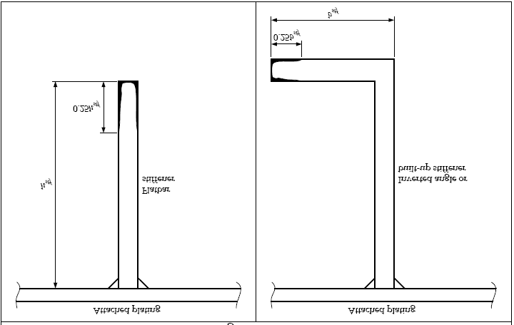

Figure 2 - Edge corrosion

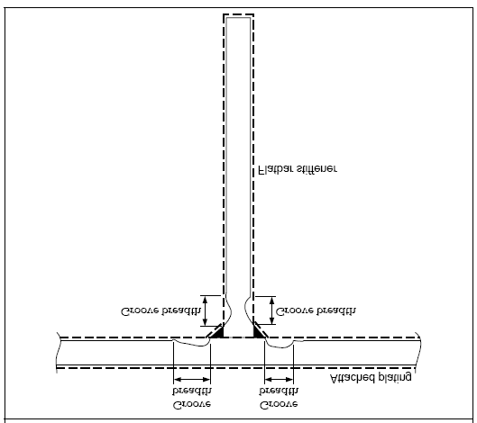

Figure 3 - Grooving corrosion

### 1.3 Repairs

1.3.1 Any damage in association with wastage over the allowable limits (including buckling, grooving, detachment or fracture), or extensive areas of wastage over the allowable limits, which affects or, in the opinion of the Surveyor, **will** affect the vessel's structural, watertight or weathertight integrity, is to be **promptly and thoroughly** (see 1.2.16) repaired. Areas to be considered include:

- bottom structure and bottom plating

- side structure and side plating

- deck structure and deck plating

- inner bottom structure and inner bottom plating

- inner side structure and inner side plating

- watertight or oiltight bulkheads

- hatch covers or hatch coamings

- items in 3.2.3.10.

For locations where adequate repair facilities are not available, consideration may be given to allow the vessel to proceed directly to a repair facility. This may require discharging the cargo and/or temporary repairs for the intended voyage.

1.3.2 Additionally, when a survey results in the identification of structural defects or corrosion, either of which, in the opinion of the Surveyor, will impair the vessel's fitness for continued service, remedial measures are to be implemented before the ship continues in service.

1.3.3 Where the damage found on structure mentioned in Para. 1.3.1 is isolated and of a localised nature which does not affect the ship's structural integrity, consideration may be given by the surveyor to allow an appropriate temporary repair to restore watertight or weather tight integrity and impose a condition of class in accordance with IACS PR 35, with a specific time limit.

### 1.4 Thickness measurements and close-up surveys

In any kind of survey, i.e. special, intermediate, annual or other surveys having the scope of the foregoing ones, thickness measurements, when required by Table II, of structures in areas where close-up surveys are required shall be carried out simultaneously with close-up surveys.

## 2. SPECIAL SURVEY1

### 2.1 Schedule

2.1.1 Special Surveys are to be carried out at a 5 year intervals to renew the Classification certificate.

2.1.2 The first Special Survey is to be completed within 5 years from the date of the initial classification survey and thereafter within 5 years from the credited date of the previous Special Survey. However, an extension of class of 3 months maximum beyond the 5th year can be granted in exceptional circumstances. In this case, the next period of class will start from the expiry date of the Special Survey before the extension was granted.

2.1.3 For surveys completed within 3 months before the expiry date of the Special Survey, the next period of class will start from the expiry date of the Special Survey. For surveys completed more than 3 months before the expiry date of the Special Survey, the period of class will start from the survey completion date. In cases where the vessel has been laid up or has been out of service for a considerable period because of a major repair or modification and the owner elects to only carry out the overdue surveys, the next period of class will start from the expiry date of the special survey. If the owner elects to carry out the next due special survey, the period of class will start from the survey completion date.

2.1.4 The Special Survey may be commenced at the 4th Annual Survey and be progressed with a view to completion by the 5th anniversary date. When the Special Survey is commenced prior to the 4th Annual Survey, the entire survey is to be completed within 15 months if such work is to be credited to the Special Survey.

2.1.5 Concurrent crediting to both Intermediate Survey (IS) and Special Survey (SS) for surveys and thickness measurements of spaces are not acceptable.

### 2.2 Scope

#### 2.2.1 General

2.2.1.1 The Special Survey is to include, in addition to the requirements of the Annual Survey, examination, tests, and checks of sufficient extent to ensure that the hull and related piping as required in 2.2.1.3, is in a satisfactory condition and is fit for its intended purpose for the new period of class of 5 years to be assigned subject to proper maintenance and operation and to periodical surveys being carried out at the due dates.

2.2.1.2 All cargo holds, Ballast Tanks, including double bottom tanks, pipe tunnels, cofferdams and void spaces bounding cargo holds, decks and outer hull are to be examined, and this examination is to be supplemented by thickness measurement and testing as required in 2.4 and 2.5, to ensure that the structural integrity remains effective. The aim of the examination is to discover Substantial Corrosion, significant deformation, fractures, damages or other structural deterioration, that may be present.

2.2.1.3 All piping systems within the above Spaces are to be examined and operationally tested to working pressure to attending Surveyor's satisfaction to ensure that tightness and condition remain satisfactory.

---
1. Some member Societies use the term "Special Periodical Survey" others use the term "Class Renewal Survey" instead of the term "Special Survey".
---

2.2.1.4 The survey extent of ballast tanks converted to void spaces is to be specially considered in relation to the requirements for ballast tanks.

#### 2.2.2 Dry dock Survey

2.2.2.1 A survey in dry dock is to be a part of the Special Survey. The overall and close-up surveys and thickness measurements, as applicable, of the lower portions of the cargo holds and ballast tanks are to be carried out in accordance with the applicable requirements for special surveys, if not already performed.

Note: Lower portions of the cargo holds and ballast tanks are considered to be the parts below light ballast water line.

#### 2.2.3 Space Protection

2.2.3.1 Where provided, the condition of the corrosion prevention system of Ballast Tanks is to be examined. For ballast tanks, excluding double bottom tanks, where a hard protective coating is found to be in less than GOOD condition and it is not renewed, or where soft or semi-hard coating has been applied, or where a hard protective coating has not been applied from the time of construction, the tanks in question are to be examined at annual intervals. Thickness measurements are to be carried out as deemed necessary by the surveyor.

When such breakdown of hard protective coating is found in water ballast double bottom tanks and it is not renewed, where a soft or semi-hard coating has been applied, or where a hard protective coating has not been applied from the time of construction, the tanks in question may be examined at annual intervals. When considered necessary by the surveyor, or where extensive corrosion exists, thickness measurements are to be carried out.

2.2.3.2 Where a hard protective coating is provided in cargo holds, as defined by Z9 and is found in GOOD condition, the extent of close-up surveys and thickness measurements may be specially considered.

#### 2.2.4 Hatch Covers and Coamings

The hatch covers and coamings are to be surveyed as follows:

2.2.4.1 A thorough inspection of the items listed in 3.2.3 is to be carried out, in addition to all hatch covers and coamings.

2.2.4.2 Checking of the satisfactory operation of all mechanically operated hatch covers is to be made, including:

- stowage and securing in open condition;
- proper fit and efficiency of sealing in closed condition;
- operational testing of hydraulic and power components, wires, chains, and link drives.

2.2.4.3 Checking the effectiveness of sealing arrangements of all hatch covers by hose testing or equivalent.

2.2.4.4 Close-up survey and thickness measurement2 of the hatch cover and coaming plating and stiffeners is to be carried out as given in Table I and Table II.

---
2. Subject to cargo hold hatch covers of approved design which structurally have no access to the internals, close-up survey/thickness measurement shall be done of accessible parts of hatch covers structures.
---

### 2.3 Extent of Overall and Close-up Survey

2.3.1 An Overall Survey of all tanks and spaces is to be carried out at each Special Survey. Fuel oil tanks in the cargo length area are to be surveyed as follows:

| Special Survey No.1 Age ≤ 5 | Special Survey No.2 5 < Age ≤ 10 | Special Survey No.3 10 < Age ≤ 15 | Special Survey No.4 and Subsequent 15 < Age |
|---|---|---|---|
| None | One | Two | Half, minimum two |

Notes

1. These requirements apply to tanks of integral (structural) type.
2. If a selection of tanks is accepted to be examined, then different tanks are to be examined at each special survey, on a rotational basis.
3. Peak tanks (all uses) are subject to internal examination at each special survey.
4. At special survey No.3 and subsequent special surveys, one deep tank for fuel oil in the cargo area is to be included, if fitted.

2.3.2 The minimum requirements for close-up surveys at special survey are given in Table I.

2.3.3 The Surveyor may extend the close-up survey as deemed necessary taking into account the maintenance of the spaces under survey, the condition of the corrosion prevention system and where spaces have structural arrangements or details which have suffered defects in similar spaces or on similar ships according to available information.

2.3.4 For areas in spaces where hard protective coatings are found to be in a GOOD condition, the extent of close-up surveys according to Table I may be specially considered. Refer also to 2.2.3.2.

### 2.4 Extent of Thickness Measurement

2.4.1 The minimum requirements for thickness measurement at Special Survey are given in Table II.
For additional thickness measurement guidelines applicable to the vertically corrugated transverse watertight bulkhead between cargo hold Nos. 1 and 2 on ships subject to compliance with URs S19 and S23, reference is to be made to 1.1.4 and Annex III.
For additional thickness measurement guidelines applicable to the side shell frames and brackets on ships subject to compliance with UR S31, reference is to be made to 1.1.5 and Annex V.

2.4.2 Provisions for extended measurements for areas with Substantial Corrosion are given in Table VIII and as may be additionally specified in the Survey Programme as required by 5.1. These extended thickness measurements are to be carried out before the survey is credited as completed. Suspect Areas identified at previous surveys are to be examined. Areas of substantial corrosion identified at previous surveys are to have thickness measurements taken.

For vessels built under IACS Common Structural Rules, the identified substantial corrosion areas may be:

a) protected by coating applied in accordance with the coating manufacturer's requirements and examined at annual intervals to confirm the coating in way is still in good condition, or alternatively

b) required to be measured at annual intervals.

2.4.3 The Surveyor may further extend the thickness measurements as deemed necessary.

2.4.4 For areas in tanks where hard protective coatings are found to be in a GOOD condition, the extent of thickness measurement according to Table II may be specially considered. Refer also to 2.2.3.2

2.4.5 Transverse sections are to be chosen where largest reductions are suspected to occur or are revealed from deck plating measurements, one of which is to be in the amidships area.

2.4.6 Representative thickness measurement to determine both general and local levels of corrosion in the shell frames and their end attachments in all cargo holds and water ballast tanks is to be carried out. Thickness measurement is also to be carried out to determine the corrosion levels on the transverse bulkhead plating. The extent of thickness measurements may be specially considered provided the Surveyor is satisfied by the close-up survey, that there is no structural diminution, and the hard protective coating where applied remains efficient.

### 2.5 Extent of Tank Testing

2.5.1 All boundaries of water ballast tanks, deep tanks and cargo holds used for water ballast within the cargo length area are to be pressure tested. For Fuel Oil Tanks, only representative tanks are to be pressure tested.

2.5.2 The Surveyor may extend the tank testing as deemed necessary

2.5.3 Boundaries of ballast tanks are to be tested with a head of liquid to the top of air pipes.

2.5.4 Boundaries of ballast holds are to be tested with a head of liquid to near to the top of hatches.

2.5.5 Boundaries of fuel oil tanks are to be tested with a head of liquid to the highest point that liquid will rise under service conditions. Tank testing of fuel oil tanks may be specially considered based on a satisfactory external examination of the tank boundaries, and a confirmation from the Master stating that the pressure testing has been carried out according to the requirements with satisfactory results.

2.5.6 The testing of double bottom tanks and other spaces not designed for the carriage of liquid may be omitted, provided a satisfactory internal examination together with an examination of the tanktop is carried out.

### 2.6 Additional special survey requirements after determining compliance with SOLAS XII/12 and XII/13

2.6.1 For ships complying with the requirements of SOLAS XII/12 for hold, ballast and dry space water level detectors, the special survey is to include an examination and a test of the water ingress detection systems and of their alarms.

2.6.2 For ships complying with the requirements of SOLAS XII/13 for the availability of pumping systems, the special survey is to include an examination and a test of the means for draining and pumping ballast tanks forward of the collision bulkhead and bilges of dry spaces any part of which extends forward of the foremost cargo hold, and of their controls.

## 3. ANNUAL SURVEY

### 3.1 Schedule

3.1.1 Annual Surveys are to be held within 3 months before or after anniversary date from the date of the initial classification survey or of the date credited for the last Special Survey.

### 3.2 Scope

#### 3.2.1 General

3.2.1.1 The survey is to consist of an examination for the purpose of ensuring, as far as practicable, that the hull, weather decks, hatch covers, coamings and piping are maintained in a satisfactory condition and should take into account the service history, condition and extent of the corrosion prevention system of ballast tanks and areas identified in the survey report file.

#### 3.2.2 Examination of the Hull

3.2.2.1 Examination of the hull plating and its closing appliances as far as can be seen.

3.2.2.2 Examination of watertight penetrations as far as practicable.

#### 3.2.3 Examination of weather decks, Hatch covers and coamings

3.2.3.1 Confirmation is to be obtained that no unapproved changes have been made to the hatch covers, hatch coamings and their securing and sealing devices since the last survey.

3.2.3.2 A thorough survey of cargo hatch covers and coamings is only possible by examination in the open as well as closed positions and should include verification of proper opening and closing operation. As a result, the hatch cover sets within the forward 25% of the ship's length and at least one additional set, such that all sets on the ship are assessed at least once in every 5-year period, are to be surveyed open, closed and in operation to the full extent on each direction at each annual survey, including:

.1 stowage and securing in open condition;

.2 proper fit and efficiency of sealing in closed condition; and

.3 operational testing of hydraulic and power components, wires, chains, and link drives.

The closing of the covers is to include the fastening of all peripheral, and cross joint cleats or other securing devices. Particular attention is to be paid to the condition of the hatch covers in the forward 25% of the ship's length, where sea loads are normally greatest.

3.2.3.3 If there are indications of difficulty in operating and securing hatch covers, additional sets above those required by 3.2.3.2, at the discretion of the surveyor, are to be tested in operation.

3.2.3.4 Where the cargo hatch securing system does not function properly, repairs are to be carried out under the supervision of the Classification Society. Where hatch covers or coamings undergo substantial repairs, the strength of securing devices should be upgraded to comply with S21.5 of UR S21

3.2.3.5 For each cargo hatch cover set, at each annual survey, the following items are to be surveyed:

1. Cover panels, including side plates, and stiffener attachments that may be accessible in the open position by close-up survey (for corrosion, cracks, deformation);

2. sealing arrangements of perimeter and cross joints (gaskets for condition and permanent deformation, flexible seals on combination carriers, gasket lips, compression bars, drainage channels and non return valves);

3. clamping devices, retaining bars, cleating (for wastage, adjustment, and condition of rubber components);

4. closed cover locating devices (for distortion and attachment);

5. chain or rope pulleys;

6. guides;

7. guide rails and track wheels;

8. stoppers;

9. wires, chains, tensioners, and gypsies;

10. hydraulic system, electrical safety devices and interlocks; and

11. end and interpanel hinges, pins and stools where fitted.

3.2.3.6 At each hatchway, at each annual survey, the coamings, with plating, stiffeners and brackets are to be checked for corrosion, cracks and deformation, especially of the coaming tops, including close-up survey.

3.2.3.7 Where considered necessary, the effectiveness of sealing arrangements may be proved by hose or chalk testing supplemented by dimensional measurements of seal compressing components.

3.2.3.8 Where portable covers, wooden or steel pontoons are fitted, checking the satisfactory condition, where applicable, of:

- wooden covers and portable beams, carriers or sockets for the portable beam, and their securing devices;

- steel pontoons, including close-up survey of hatchcover plating.

- tarpaulins;

- cleats, battens and wedges;

- hatch securing bars and their securing devices;

- loading pads/bars and the side plate edge;

- guide plates and chocks;

- compression bars, drainage channels and drain pipes (if any).

3.2.3.9 Examination of flame screens on vents to all bunker tanks.

3.2.3.10 Examination of bunker and vent piping systems, including ventilators.

#### 3.2.4 Examination of Cargo Holds

3.2.4.1 Bulk Carriers 10-15 years of age, the following is to apply:

a) Overall Survey of all cargo holds.

b) Close-up survey of sufficient extent, minimum 25% of frames, to establish the condition of the lower region of the shell frames including approx. lower one third length of side frame at side shell and side frame end attachment and the adjacent shell plating in the forward cargo hold. Where this level of survey reveals the need for remedial measures, the survey is to be extended to include a Close-up Survey of all of the shell frames and adjacent shell plating of that cargo hold as well as a Close-up survey of sufficient extent of all remaining cargo holds.

c) When considered necessary by the surveyor, or where extensive corrosion exists, thickness measurement is to be carried out. If the results of these thickness measurements indicate that Substantial Corrosion is found, the extent of thickness measurements is to be increased in accordance with Table VIII. These thickness measurements are to be carried out before the annual survey is credited as completed. Suspect Areas identified at previous surveys are to be examined. Areas of substantial corrosion identified at previous surveys are to have thickness measurements taken.

For vessels built under the IACS Common Structural Rules, the annual thickness gauging may be omitted where a protective coating has been applied in accordance with the coating manufacturer's requirements and is maintained in good condition.

d) Where the protective coating in cargo holds, as defined by Z9 is found to be in GOOD condition, the extent of close-up surveys and thickness measurements may be specially considered.

e) All piping and penetrations in cargo holds, including overboard piping, are to be examined.

3.2.4.2 Bulk Carriers over 15 years of age, the following is to apply:

a) Overall Survey of all cargo holds.

b) Close-up survey of sufficient extent, minimum 25% of frames, to establish the condition of the lower region of the shell frames including approx. lower one third length of side frame at side shell and side frame end attachment and the adjacent shell plating in the forward cargo hold and one other selected cargo hold. Where this level of survey reveals the need for remedial measures, the survey is to be extended to include a Close-up Survey of all of the shell frames and adjacent shell plating of that cargo hold as well as a Close-up Survey of sufficient extent of all remaining cargo holds.

c) When considered necessary by the surveyor, or where extensive corrosion exists, thickness measurement is to be carried out. If the results of these thickness measurements indicate that Substantial Corrosion is found, the extent of thickness measurements is to be increased in accordance with Table VIII. These extended thickness measurements are to be carried out before the annual survey is credited as completed. Suspect Areas identified at previous surveys are to be examined. Areas of substantial corrosion identified at previous surveys are to have thickness measurements taken.

For vessels built under the IACS Common Structural Rules, the annual thickness gauging may be omitted where a protective coating has been applied in accordance with the coating manufacturer's requirements and is maintained in good condition.

d) Where a hard protective coating is fitted in cargo holds, as defined by Z.9 and is found in GOOD condition, the extent of close-up surveys and thickness measurements may be specially considered.

e) All piping and penetrations in cargo holds, including overboard piping, are to be examined.

#### 3.2.5 Examination of Ballast Tanks

3.2.5.1 Examination of Ballast Tanks when required as a consequence of the results of the Special Survey and Intermediate Survey is to be carried out. When considered necessary by the surveyor, or where extensive corrosion exists, thickness measurements are to be carried out. If the results of these thickness measurements indicate that Substantial Corrosion is found, the extent of thickness measurements is to be increased in accordance with Table VIII. These extended thickness measurements are to be carried out before the survey is credited as completed. Suspect Areas identified at previous surveys are to be examined. Areas of substantial corrosion identified at previous survey are to have thickness measurements taken.

For vessels built under the IACS Common Structural Rules, the annual thickness gauging may be omitted where a protective coating has been applied in accordance with the coating manufacturer's requirements and is maintained in good condition.

### 3.3 Additional annual survey requirements for the foremost cargo hold of ships subject to SOLAS XII/9.1

3.3.1 Ships subject to SOLAS XII/9.1 are those meeting all the following conditions:

- Bulk Carriers of 150m in length and upwards of single side skin construction,
- carrying solid bulk cargoes having a density of 1780 kg/m3 and above,
- contracted for construction (see Note 1) before 1 July 1999, and
- constructed with an insufficient number of transverse watertight bulkheads to enable them to withstand flooding of the foremost cargo hold in all loading conditions and remain afloat in a satisfactory condition of equilibrium as specified in SOLAS XII/4.3.

3.3.2 In accordance with SOLAS XII/9.1, for the foremost cargo hold of such ships, the additional survey requirements listed in Annex IV shall apply.

### 3.4 Additional annual survey requirements after determining compliance with SOLAS XII/12 and XII/13

3.4.1 For ships complying with the requirements of SOLAS XII/12 for hold, ballast and dry space water level detectors, the annual survey is to include an examination and a test, at random, of the water ingress detection systems and of their alarms.

3.4.2 For ships complying with the requirements of SOLAS XII/13 for the availability of pumping systems, the annual survey is to include an examination and a test, of the means for draining and pumping ballast tanks forward of the collision bulkhead and bilges of dry spaces any part of which extends forward of the foremost cargo hold, and of their controls.

---
Note 1: "The "contracted for construction" date means the date on which the contract to build the vessel is signed between the prospective owner and the shipbuilder. For further details regarding the date of "contract for construction", refer to IACS Procedural Requirement (PR) No.29."
---

## 4. INTERMEDIATE SURVEY

### 4.1 Schedule

4.1.1 The intermediate Survey is to be held at or between either the 2nd or 3rd Annual Survey.

4.1.2 Those items which are additional to the requirements of the Annual Survey may be surveyed either at or between the 2nd and 3rd Annual Survey.

4.1.3 Concurrent crediting to both Intermediate Survey (IS) and Special Survey (SS) for surveys and thickness measurements of spaces are not acceptable.

### 4.2 Scope

#### 4.2.1 General

4.2.1.1 The survey extent is dependent on the age of the vessel as specified in 4.2.2 to 4.2.4.

#### 4.2.2 Bulk Carriers 5 -10 years of age. The following is to apply

4.2.2.1 Ballast Tanks

a) For tanks used for water ballast, an overall survey of representative spaces selected by the Surveyor is to be carried out. The selection is to include fore and aft peak tanks and a number of other tanks, taking into account the total number and type of ballast tanks. If such overall survey reveals no visible structural defects, the examination may be limited to verification that the corrosion prevention system remains efficient.

b) Where a hard coating is found to be in less than GOOD condition, corrosion or other defects are found in water Ballast tanks, or where a hard Protective Coating was not applied from the time of construction, the examination is to be extended to other Ballast tanks of the same type.

c) In ballast tanks other than double bottom tanks, where a hard Protective Coating is found to be in less than GOOD condition, and it is not renewed, or where soft or semi-hard coating has been applied, or where a hard protective coating was not applied from the time of construction, the tanks in question are to be examined and thickness measurements carried out as considered necessary at annual intervals. When such breakdown of hard protective coating is found in ballast double bottom tanks, or where a soft or semi-hard coating has been applied, or where a hard protective coating has not been applied, the tanks in question may be examined at annual intervals. When considered necessary by the Surveyor, or where extensive corrosion exists, thickness measurements are to be carried out.

d) In addition to the requirements above, suspect areas identified at previous surveys are to be overall and close-up surveyed.

4.2.2.2 Cargo Holds

a) An overall survey of all cargo holds, including close-up survey of sufficient extent, minimum 25 % of frames, is to be carried out to establish the condition of:

- Shell frames including their upper and lower end attachments, adjacent shell plating, and transverse bulkheads in the forward cargo hold and one other selected cargo hold;

- Areas found suspect at previous surveys.

b) Where considered necessary by the surveyor as a result of the overall and close-up survey as described in 4.2.2.2a, the survey is to be extended to include a close-up survey of all of the shell frames and adjacent shell plating of that cargo hold as well as a close-up survey of sufficient extent of all remaining cargo holds.

4.2.2.3 Extent of Thickness Measurements

a) Thickness measurements are to be carried out to an extent sufficient to determine both general and local corrosion levels at areas subject to close-up survey as described in 4.2.2.2a. The minimum requirement for thickness measurements at the Intermediate Survey are areas found to be Suspect Areas at previous surveys.

b) The extent of thickness measurement may be specially considered provided the Surveyor is satisfied by the close-up survey, that there is no structural diminution and the hard protective coatings are found to be in a GOOD condition.

c) Where Substantial Corrosion is found, the extent of thickness measurements is to increased in accordance with the requirements of Table VIII. These extended thickness measurements are to be carried out before the survey is credited as completed. Suspect Areas identified at previous surveys are to be examined. Areas of substantial corrosion identified at previous surveys are to have thickness measurements taken.

For vessels built under IACS Common Structural Rules, the identified substantial corrosion areas may be:

a) protected by coating applied in accordance with the coating manufacturer's requirements and examined at annual intervals to confirm the coating in way is still in good condition, or alternatively

b) required to be measured at annual intervals.

d) Where the hard protective coating in cargo holds, as defined by Z9 is found to be in GOOD condition, the extent of close-up surveys and thickness measurements may be specially considered.

Explanatory note:
For existing bulk carriers, where owners may elect to coat or recoat cargo holds as noted above, consideration may be given to the extent of the close-up and thickness measurement surveys. Prior to the coating of cargo holds of existing ships, scantlings should be ascertained in the presence of a surveyor.

#### 4.2.3 Bulk Carriers 10 - 15 years of age. The following is to apply

4.2.3.1 The requirements of the Intermediate Survey are to be to the same extent to the previous Special Survey as required in 2 and 5.1. However, internal examination of fuel tanks and pressure testing of all tanks are not required unless deemed necessary by the attending surveyor.

4.2.3.2 In application of 4.2.3.1, the intermediate survey may be commenced at the second annual survey and be progressed during the succeeding year with a view to completion at the third annual survey in lieu of the application of 2.1.4.

4.2.3.3 In application of 4.2.3.1, an under water survey may be considered in lieu of the requirements of 2.2.2.

#### 4.2.4. Bulk Carriers over 15 years of age. The following is to apply

4.2.4.1 The requirements of the Intermediate Survey are to be to the same extent to the previous Special Survey as required in 2 and 5.1. However, internal examination of fuel tanks and pressure testing of all tanks are not required unless deemed necessary by the attending surveyor.

4.2.4.2 In application of 4.2.4.1, the intermediate survey may be commenced at the second annual survey and be progressed during the succeeding year with a view to completion at the third annual survey in lieu of the application of 2.1.4.

4.2.4.3 In application of 4.2.4.1, a survey in dry dock is to be part of the intermediate survey. The overall and close-up surveys and thickness measurements, as applicable, of the lower portions of the cargo holds and water ballast tanks are to be carried out in accordance with the applicable requirements for intermediate surveys, if not already performed.

Note: Lower portions of the cargo holds and ballast tanks are considered to be the parts below light ballast water line.

## 5 PREPARATION FOR SURVEY

### 5.1 Survey Programme

5.1.1 The Owner in cooperation with the Classification Society is to work out a specific Survey Programme prior to the commencement of any part of:

- the Special Survey

- the Intermediate Survey for bulk carriers over 10 years of age.

The Survey Programme is to be in a written format based on the information in Annex VIA. The survey is not to commence until the Survey programme has been agreed.

5.1.1.1 Prior to the development of the survey programme, the survey planning questionnaire is to be completed by the owner based on the information set out in Annex VIB, and forwarded to the Classification Society.

5.1.1.2 The Survey Programme at Intermediate Survey may consist of the Survey Programme at the previous Special Survey supplemented by the Executive Hull Summary of that Special Survey and later relevant survey reports.

The Survey Programme is to be worked out taking into account any amendments to the survey requirements after the last Special Survey carried out.

5.1.2 In developing the Survey Programme, the following documentation is to be collected and consulted with a view to selecting tanks, holds, areas, and structural elements to be examined:

- Survey status and basic ship information,

- Documentation on-board, as described in 6.2 and 6.3,

- Main structural plans (scantlings drawings), including information regarding use of high tensile steels (HTS),

- Relevant previous survey and inspection reports from both Classification Society and the Owner,

- Information regarding the use of the ship's holds and tanks, typical cargoes and other relevant data,

- Information regarding corrosion prevention level on the newbuilding,

- Information regarding the relevant maintenance level during operation.

5.1.3 The submitted Survey Programme is to account for and comply, as a minimum, with the requirements of Tables I, II and paragraph 2.5 for close-up survey, thickness measurement and tank testing, respectively, and is to include relevant information including at least :

- Basic ship information and particulars,

- Main structural plans (scantling drawings), including information regarding use of high tensile steels (HTS)

- Plan of holds and tanks,

- List of holds and tanks with information on use, protection and condition of coating,

- Conditions for survey (e.g., information regarding hold and tank cleaning, gas freeing, ventilation, lighting, etc.),

- Provisions and methods for access to structures,

- Equipment for surveys,

- Nomination of holds and tanks and areas for close-up survey (per 2.3),

- Nominations of sections for thickness measurement (per 2.4),

- Nomination of tanks for tank testing (per 2.5),

- Damage experience related to the ship in question.

5.1.4 The Classification Society will advise the Owner of the maximum acceptable structural corrosion diminution levels applicable to the vessel.

5.1.5 Use may also be made of the Guidelines for Technical Assessment in Conjunction with Planning for Enhanced Surveys of Bulk Carriers Special Survey - Hull, contained in Annex I. These guidelines are a recommended tool which may be invoked at the discretion of the Classification Society, when considered necessary and appropriate, in conjunction with the preparation of the required Survey Programme.

### 5.2 Conditions for Survey

5.2.1 The owner is to provide the necessary facilities for a safe execution of the survey.

5.2.1.1 In order to enable the attending surveyors to carry out the survey, provisions for proper and safe access, are to be agreed between the owner and the Classification society are to be in accordance with IACS PR 37.

5.2.1.2 Details of the means of access are to be provided in the survey planning questionnaire.

5.2.1.3 In cases where the provisions of safety and required access are judged by the attending surveyor(s) not to be adequate, the survey of the spaces involved is not to proceed.

5.2.2 Cargo holds, tanks and spaces are to be safe for access. Cargo holds, tanks and spaces are to be gas free and properly ventilated. Prior to entering a tank, void or enclosed space, it is to be verified that the atmosphere in the tank is free from hazardous gas and contains sufficient oxygen.

5.2.3 In preparation for survey and thickness measurements and to allow for a thorough examination, all spaces are to be cleaned including removal from surfaces of all loose accumulated corrosion scale. Spaces are to be sufficiently clean and free from water, scale, dirt, oil residues etc. to reveal corrosion, deformation, fractures, damages, or other structural deterioration as well as the condition of the coating. However, those areas of structure whose renewal has already been decided by the owner need only be cleaned and descaled to the extent necessary to determine the limits of the areas to be renewed.

5.2.4 Sufficient illumination is to be provided to reveal corrosion, deformation, fractures, damages or other structural deterioration as well as the condition of the coating.

5.2.5 Where soft or semi-hard coatings have been applied, safe access is to be provided for the surveyor to verify the effectiveness of the coating and to carry out an assessment of the conditions of internal structures which may include spot removal of the coating. When safe access cannot be provided, the soft or semi-hard coating is to be removed.

### 5.3 Access to Structures

5.3.1 For overall surveys, means are to be provided to enable the surveyor to examine the hull structure in a safe and practical way.

5.3.2 For close-up surveys of the hull structure, other than cargo hold shell frames, one or more of the following means for access, acceptable to the Surveyor, is to be provided:

- permanent staging and passages through structures;

- temporary staging and passages through structures;

- hydraulic arm vehicles such as conventional cherry pickers, lifts and movable platforms;

- portable ladders;

- boats or rafts;

- other equivalent means.

5.3.3 For close-up surveys of the cargo hold shell frames of bulk carriers less than 100,000 dwt, one or more of the following means for access, acceptable to the Surveyor, is to be provided:

- permanent staging and passages through structures;

- temporary staging and passages through structures;

- portable ladder restricted to not more than 5 m in length may be accepted for surveys of lower section of a shell frame including bracket;

- hydraulic arm vehicles such as conventional cherry pickers, lifts and movable platforms;

- boats or rafts provided the structural capacity of the hold is sufficient to withstand static loads at all levels of water;

- other equivalent means.

5.3.4 For close-up surveys of the cargo hold shell frames of bulk carriers 100,000 dwt and above, the use of portable ladders is not accepted, and one or more of the following means for access, acceptable to the surveyor, is to be provided:

Annual Surveys, Intermediate Survey under 10 years of age and Special Survey No. 1

- permanent staging and passages through structures;

- temporary staging and passages through structures;

- hydraulic arm vehicles such as conventional cherry pickers, lifts and movable platforms;

- boats or rafts provided the structural capacity of the hold is sufficient to withstand static loads at all levels of water;

- other equivalent means.

Subsequent Intermediate Surveys and Special Surveys:

- Either permanent or temporary staging and passage through structures for close-up survey of at least the upper part of hold frames;

- Hydraulic arm vehicles such as conventional cherry pickers for surveys of lower and middle part of shell frames as alternative to staging;

- lifts and movable platforms;

- boats or rafts provided the structural capacity of the hold is sufficient to withstand static loads at all levels of water;

- other equivalent means.

Notwithstanding the above requirements:
a) The use of a portable ladder fitted with a mechanical device to secure the upper end of the ladder is acceptable for the "close-up examination of sufficient extent, minimum 25% of frames, to establish the condition of the lower region of the shell frames including approx. lower one third length of side frame at side shell and side frame end attachment and the adjacent shell plating of the forward cargo hold" at Annual Survey, required in 3.2.4.1.b, and the "one other selected cargo hold" required in 3.2.4.2.b.
b) The use of hydraulic arm vehicles or aerial lifts ("Cherry picker") may be accepted by the attending surveyor for the close-up survey of the upper part of side shell frames or other structures in all cases where the maximum working height is not more than 17 m.

### 5.4 Equipment for Survey

5.4.1 Thickness measurement is normally to be carried out by means of ultrasonic test equipment. The accuracy of the equipment is to be proven to the Surveyor as required.

5.4.2 One or more of the following fracture detection procedures may be required if deemed necessary by the Surveyor:

- radiographic equipment

- ultrasonic equipment

- magnetic particle equipment

- dye penetrant

5.4.3 Explosimeter, oxygen-meter, breathing apparatus, lifelines, riding belts with rope and hook and whistles together with instructions and guidance on their use are to be made available during the survey. A safety check-list should be provided.

5.4.4 Adequate and safe lighting is to be provided for the safe and efficient conduct of the survey.

5.4.5 Adequate protective clothing is to be made available and used (e.g. safety helmet, gloves, safety shoes, etc.) during the survey.

### 5.5 Rescue and emergency response equipment

If breathing apparatus and/or other equipment is used as 'Rescue and emergency response equipment' then it is recommended that the equipment should be suitable for the configuration of the space being surveyed.

### 5.6 Survey at Sea or at Anchorage

5.6.1 Surveys at sea or at anchorage may be accepted provided the Surveyor is given the necessary assistance from the personnel on board. Necessary precautions and procedures for carrying out the survey are to be in accordance with 5.1, 5.2, 5.3, and 5.4.

5.6.2 A communication system is to be arranged between the survey party in the spaces under examination and the responsible officer on deck. This system is to also include the personnel in charge of ballast pump handling if boats or rafts are used.

5.6.3 Surveys of tanks or applicable holds by means of boats or rafts may only be undertaken with the agreement of the Surveyor, who is to take into account the safety arrangements provided, including weather forecasting and ship response under foreseeable conditions and provided the expected rise of water within the tank does not exceed 0.25m.

5.6.4 When rafts or boats will be used for close-up survey the following conditions are to be observed:

.1 only rough duty, inflatable rafts or boats, having satisfactory residual buoyancy and stability even if one chamber is ruptured, are to be used;

.2 the boat or raft is to be tethered to the access ladder and an additional person is to be stationed down the access ladder with a clear view of the boat or raft;

.3 appropriate lifejackets are to be available for all participants;

.4 the surface of water in the tank or hold is to be calm (under all foreseeable conditions the expected rise of water within the tank is to not exceed 0.25 m) and the water level stationary. On no account is the level of the water to be rising while the boat or raft is in use;

.5 the tank, hold or space must contain clean ballast water only. Even a thin sheen of oil on the water is not acceptable;

.6 at no time is the water level to be allowed to be within 1 m of the deepest under deck web face flat so that the survey team is not isolated from a direct escape route to the tank hatch. Filling to levels above the deck transverses is only to be contemplated if a deck access manhole is fitted and open in the bay being examined, so that an escape route for the survey party is available at all times. Other effective means of escape to the deck may be considered.

5.6.5 Rafts or boats alone may be allowed for inspection of the under deck areas for tanks or spaces, if the depth of the webs is 1.5 m or less.

5.6.6 If the depth of the webs is more than 1.5 m, rafts or boats alone may be allowed only:

.1 when the coating of the under deck structure is in GOOD condition and there is no evidence of wastage; or
.2 if a permanent means of access is provided in each bay to allow safe entry and exit.

This means:

i. access direct from the deck via a vertical ladder and a small platform fitted approximately 2 m below the deck in each bay; or

ii. access to deck from a longitudinal permanent platform having ladders to deck in each end of the tank. The platform shall, for the full length of the tank, be arranged in level with, or above, the maximum water level needed for rafting of under deck structure. For this purpose, the ullage corresponding to the maximum water level is to be assumed not more than 3m from the deck plate measured at the midspan of deck transverses and in the middle length of the tank.

If neither of the above conditions are met, then staging or an "other equivalent means" is to be provided for the survey of the under deck areas.

5.6.7 The use of rafts or boats alone in paragraphs 5.6.5 and 5.6.6 does not preclude the use of boats or rafts to move about within a tank during a survey.

*Reference is made to IACS Recommendation 39 - Guidelines for the use of Boats or Rafts for Close-up surveys.*

### 5.7 Survey Planning Meeting

5.7.1 The establishment of proper preparation and the close co-operation between the attending surveyor(s) and the owner's representatives onboard prior to and during the survey are an essential part in the safe and efficient conduct of the survey. During the survey on board safety meetings are to be held regularly.

5.7.2 Prior to commencement of any part of the renewal and intermediate survey, a survey planning meeting is to be held between the attending surveyor(s), the owner's representative in attendance, the TM firm representative, where involved, and the master of the ship or an appropriately qualified representative appointed by the master or Company for the purpose to ascertain that all the arrangements envisaged in the survey programme are in place, so as to ensure the safe and efficient conduct of the survey work to be carried out. See also 7.1.2.

5.7.3 The following is an indicative list of items that are to be addressed in the meeting:

.1 schedule of the vessel (i.e. the voyage, docking and undocking manoeuvres, periods alongside, cargo and ballast operations, etc.)

.2 provisions and arrangements for thickness measurements (i.e. access, cleaning/de-scaling, illumination, ventilation, personal safety);

.3 extent of the thickness measurements;

.4 acceptance criteria (refer to the list of minimum thicknesses);

.5 extent of close-up survey and thickness measurement considering the coating condition and suspect areas/areas of substantial corrosion;

.6 execution of thickness measurements;

.7 taking representative readings in general and where uneven corrosion/pitting is found;

.8 mapping of areas of substantial corrosion; and

.9 communication between attending surveyor(s) the thickness measurement firm operator(s) and owner representative(s) concerning findings.

4. **Information of any alteration to the Certified Thickness Measurement Operation System**

    In case where any alteration to the certified thickness measurement operation system of the firm is made, such an alteration is to be immediately informed to the Society. Re-audit is made where deemed necessary by the Society.

5. **Cancellation of Approval**

    Approval may be cancelled in the following cases:

(1) Where the measurements were improperly carried out or the results were improperly reported.

(2) Where the Society's surveyor found any deficiencies in the approved thickness measurement operation systems of the firm.

(3) Where the firm failed to inform of any alteration in 4 above to the Society.

## TABLE VI

### SURVEY REPORTING PRINCIPLES

As a principle, for bulk carriers subject to ESP, the surveyor is to include the following content in his report for survey of hull structure and piping systems, as relevant for the survey.

The structure of the reporting content may be different, depending on the report system for the respective Societies.

### 1. General

1.1 A survey report is to be generated in the following cases:

- In connection with commencement, continuation and / or completion of periodical hull surveys, i.e. annual, intermediate and special surveys, as relevant

- When structural damages / defects have been found
- When repairs, renewals or modifications have been carried out
- When condition of class has been imposed or deleted

1.2 The purpose of reporting is to provide:

- Evidence that prescribed surveys have been carried out in accordance with applicable classification rules
- Documentation of surveys carried out with findings, repairs carried out and condition of class imposed or deleted
- Survey records, including actions taken, which shall form an auditable documentary trail. Survey reports are to be kept in the survey report file required to be on board
- Information for planning of future surveys
- Information which may be used as input for maintenance of classification rules and instructions

1.3 When a survey is split between different survey stations, a report is to be made for each portion of the survey. A list of items surveyed, relevant findings and an indication of whether the item has been credited, are to be made available to the next attending surveyor, prior to continuing or completing the survey. Thickness measurement and tank testing carried out is also to be listed for the next surveyor.

### 2. Extent of the survey

2.1 Identification of compartments where an overall survey has been carried out.

2.2 Identification of locations, in each ballast tank and cargo hold including hatch covers and coamings, where a close-up survey has been carried out, together with information of the means of access used.

2.3 Identification of locations, in each ballast tank and cargo hold including hatch covers and coamings, where thickness measurement has been carried out.

*Note: As a minimum, the identification of location of close-up survey and thickness measurement is to include a confirmation with description of individual structural members corresponding to the extent of requirements stipulated in UR Z10.2 based on type of periodical survey and the ship's age.*

*Where only partial survey is required, i.e. 25% of shell frames, one transverse web, two selected cargo hold transverse bulkheads, the identification is to include location within each ballast tank and cargo hold by reference to frame numbers.*

2.4 For areas in ballast tanks and cargo holds where protective coating is found to be in GOOD condition and the extent of close-up survey and / or thickness measurement has been specially considered, structures subject to special consideration are to be identified.

2.5 Identification of tanks subject to tank testing.

2.6 Identification of piping systems on deck and within cargo holds, ballast tanks, pipe tunnels, cofferdams and void spaces where:

- Examination including internal examination of piping with valves and fittings and thickness measurement, as relevant, has been carried out

- Operational test to working pressure has been carried out

### 3. Result of the survey

3.1 Type, extent and condition of protective coating in each tank, as relevant (rated GOOD, FAIR or POOR).

3.2 Structural condition of each compartment with information on the following, as relevant:

- Identification of findings, such as:

    - Corrosion with description of location, type and extent
    - Areas with substantial corrosion
    - Cracks / fractures with description of location and extent
    - Buckling with description of location and extent
    - Indents with description of location and extent

- Identification of compartments where no structural damages / defects are found

The report may be supplemented by sketches / photos.

3.3 Thickness measurement report is to be verified and signed by the surveyor controlling the measurements on board.

### 4. Actions taken with respect to findings

4.1 Whenever the attending surveyor is of the opinion that repairs are required, each item to be repaired is to be identified in the survey report. Whenever repairs are carried out, details of the repairs effected are to be reported by making specific reference to relevant items in the survey report.

4.2 Repairs carried out are to be reported with identification of:

- Compartment
- Structural member
- Repair method (i.e. renewal or modification) including:
    - steel grades and scantlings (if different from the original);
    - sketches/photos, as appropriate;
- Repair extent
- NDT / Tests

4.3 For repairs not completed at the time of survey, condition of class is to be imposed with a specific time limit for the repairs. In order to provide correct and proper information to the surveyor attending for survey of the repairs, condition of class is to be sufficiently detailed with identification of each item to be repaired. For identification of extensive repairs, reference may be given to the survey report.

## TABLE VII (i)

### IACS UNIFIED REQUIREMENTS FOR ENHANCED SURVEYS EXECUTIVE HULL SUMMARY

Issued upon Completion of Special Survey

GENERAL PARTICULARS

SHIP'S NAME:

CLASS IDENTIFY NUMBER:

IMO IDENTIFY NUMBER:

PORT OF REGISTRY:

NATIONAL FLAG:

DEADWEIGHT (M. TONNES):

GROSS TONNAGE:
NATIONAL:
ITC (69):

DATE OF BUILD:

CLASSIFICATION NOTATION:

DATE OF MAJOR CONVERSION:

TYPE OF CONVERSION:

a) The survey reports and documents listed below have been reviewed by the undersigned and found to be satisfactory

b) A summary of the survey is attached herewith on sheet 2

c) The hull special survey has been completed in accordance with the Regulations on [date]

| Executive Summary Report completed by: | Name | Title |
|---|---|---|
|  | Signature |  |
| OFFICE | DATE |  |
| Executive Summary Report verified by: | Name | Title |
|  | Signature |  |
| OFFICE | DATE |  |

Attached reports and documents:
1)
2)
3)
4)
5)
6)

## TABLE VII (ii)

### EXECUTIVE HULL SUMMARY

| | | | |
|---|---|---|---|
| A) | General Particulars: | - | Ref.Table VII (i) |
| B) | Report Review: | - | Where and how survey was done |
| C) | Close-up Survey: | - | Extent (Which tanks) |
| D) | Thickness measurements: | - | Reference to Thickness Measurement report |
|  |  | - | Summary of where measured |
|  |  | - | Separate form indicating the tanks/areas with Substantial Corrosion, and corresponding |
|  |  | - | Thickness diminution |
|  |  | - | Corrosion pattern |
| E) | Tank Protection: | - | Separate form indicating: |
|  |  | - | Location of coating |
|  |  | - | Condition of coating (if applicable) |
| F) | Repairs: | - | Identification of tanks/areas |
| G) | Conditions of Class: |  |  |
| H) | Memoranda: | - | Acceptable defects |
|  |  | - | Any points of attention for future surveys, e.g. for Suspect Areas. |
|  |  | - | Examination of ballast tanks at annual surveys due to coating breakdown |
| I) | Conclusion: | - | Statement on evaluation/verification of survey report |

## TABLE VII (iii) A – non CSR vessels

### EXTRACT OF THICKNESS MEASUREMENT

Reference is made to the thickness measurements report:

| 1) Position of substantially corroded Tanks/Areas or Areas with deep pitting | Thickness diminution[%] | 2) Corrosion pattern | Remarks: e.g. Ref. attached sketches |
|---|---|---|---|
|  |  |  |  |

Remarks

1) Substantial corrosion, i.e. 75 – 100% of acceptable margins wasted.

2) P = Pitting
C = Corrosion in General
Any bottom plating with a pitting intensity of 20% or more, with wastage in the substantial corrosion range or having an average depth of pitting of 1/3 or more of actual plate thickness is to be noted.

## TABLE VII (iii) B – CSR vessels

### EXTRACT OF THICKNESS MEASUREMENTS

Reference is made to the thickness measurements report:

| 1) Position of substantially corroded Tanks/Areas or Areas with deep pitting | tm – tren (mm) | 2) Corrosion pattern | Remarks: e.g. Ref. Attached sketches |
|---|---|---|---|
|  |  |  |  |

Remarks

1) Substantial corrosion, an extent of corrosion such that the assessment of the corrosion pattern indicates a measured thickness between tren + 0.5mm and tren.

2) P = Pitting
C = Corrosion in General
Areas with deep pitting assessed according to 8.2 are to be recorded in this column.

## TABLE VII (iv)

### SPACE PROTECTION

| 1) Tank/hold Nos. | 2) Tank/hold protection | 3) Coating condition | Remarks |
|---|---|---|---|
|  |  |  |  |

Remarks:

1) All ballast tanks and cargo holds to be listed.

2) C = Coating    NP = No Protection

3) Coating condition according to the following standard

**GOOD** condition with only minor spot rusting.

**FAIR** condition with local breakdown at edges of stiffeners and weld connections and/or light rusting over 20% or more of areas under consideration, but less than as defined for POOR condition.

**POOR** condition with general breakdown of coating over 20% or more of areas or hard scale at 10% or more of areas under consideration.

For ballast tanks, if coating condition less than **"GOOD"** is given, tanks are to be examined at annual surveys. This is to be noted in part H) of the Executive Hull Summary.

## TABLE VIII

### Sheet 1

### REQUIREMENTS FOR EXTENT OF THICKNESS MEASUREMENT AT THOSE AREAS OF SUBSTANTIAL CORROSION SPECIAL SURVEY OF BULK CARRIERS WITHIN THE CARGO AREA

#### SHELL STRUCTURES

| STRUCTURAL MEMBER | EXTENT OF MEASUREMENT | PATTERN OF MEASUREMENT |
|---|---|---|
| 1. Bottom and Side Shell plating | a. Suspect plate, plus four adjacent plates b. See other tables for particulars on gauging in way of tanks and cargo holds | a. 5 point pattern for each panel between longitudinals |
| 2. Bottom/Side Shell longitudinals | Minimum of three longitudinals in way of suspect areas | 3 measurements in line across web 3 measurements on flange |

### Sheet 2

### REQUIREMENTS FOR EXTENT OF THICKNESS MEASUREMENT AT THOSE AREAS OF SUBSTANTIAL CORROSION SPECIAL SURVEY OF BULK CARRIERS WITHIN THE CARGO AREA

#### TRANSVERSE BULKHEADS IN CARGO HOLDS

| STRUCTURAL MEMBER | EXTENT OF MEASUREMENT | PATTERN OF MEASUREMENT |
|---|---|---|
| 1. Lower Stool | a. Transverse band within 25mm of welded connection to inner bottom b. Transverse band within 25 mm of welded connection to shelf plate | a. 5 point between stiffeners over 1 metre length b. Ditto |
| 2. Transverse Bulkhead | a. Transverse band at approximately mid height b. Transverse band at part of bulkhead adjacent to upper deck or below upper stool shelf plate (for those ships fitted with upper stools) | a. 5 point pattern over 1 sq. metre of plating b. 5 point pattern over 1 sq. metre of plating |

### Sheet 3

### REQUIREMENTS FOR EXTENT OF THICKNESS MEASUREMENT AT THOSE AREAS OF SUBSTANTIAL CORROSION SPECIAL SURVEY OF BULK CARRIERS WITHIN THE CARGO AREA

#### DECK STRUCTURE INCLUDING CROSS STRIPS, MAIN CARGO HATCHWAYS, HATCH COVERS, COAMINGS AND TOPSIDE TANKS

| STRUCTURAL MEMBER | EXTENT OF MEASUREMENT | PATTERN OF MEASUREMENT |
|---|---|---|
| 1. Cross Deck Strip plating | Suspect cross deck strip plating | a. 5 point pattern between underdeck stiffeners over 1 metre length |
| 2. Underdeck Stiffeners | a. Transverse members b. Longitudinal member | a. 5 point pattern at each end and mid span b. 5 point pattern on both web and flange |
| 3. Hatch Covers | a. Side and end skirts, each 3 locations b. 3 longitudinal bands outboard strakes (2) and centreline strake (1) | a. 5 point pattern at each location b. 5 point measurement each band |
| 4. Hatch Coamings | Each side and end coaming, one band lower 1/3, one band upper 2/3 of coaming | 5 point measurement each band i.e. end or side coaming |
| 5. Topside Water Ballast Tanks | a. Watertight transverse bulkheads |  |
|  | i. lower 1/3 of bulkhead | i. 5 point pattern over 1 sq. metre of plating |
|  | ii. upper 2/3 of bulkhead | ii. 5 point pattern over 1 sq. metre of plating |
|  | iii. stiffeners | iii 5 point pattern over 1 metre length |
|  | b. 2 representative swash transverse bulkheads |  |
|  | i. lower 1/3 of bulkhead | i. 5 point pattern over 1 sq. metre of plating |
|  | ii. upper 2/3 of bulkhead | ii. 5 point pattern over 1 sq. metre of plating |
|  | iii. stiffeners | iii 5 point pattern over 1 metre length |
|  | c. 3 representative bays of slope plating |  |
|  | i. lower 1/3 of tank | i. 5 point pattern over 1 sq. metre of plating |
|  | ii. upper 2/3 of tank | ii. 5 point pattern over 1 sq. metre of plating |
|  | d. Longitudinals, suspect and adjacent | d. 5 point pattern both web and flange over 1 metre length |
| 6. Main Deck Plating | Suspect plates and adjacent (4) | 5 point pattern over 1 sq. metre of plating |
| 7. Main Deck Longitudinals | Minimum of 3 longitudinals where plating measured | 5 point pattern on both web and flange over 1 metre length |
| 8. Web frames/Transverses | Suspect plates | 5 point pattern over 1 sq. metre |

### Sheet 4

### REQUIREMENTS FOR EXTENT OF THICKNESS MEASUREMENT AT THOSE AREAS OF SUBSTANTIAL CORROSION SPECIAL SURVEY OF BULK CARRIERS WITHIN THE CARGO AREA

#### DOUBLE BOTTOM AND HOPPER STRUCTURE

| STRUCTURAL MEMBER | EXTENT OF MEASUREMENT | PATTERN OF MEASUREMENT |
|---|---|---|
| 1. Inner/Double Bottom Plating | Suspect plate plus all adjacent plates | 5 point pattern for each panel between longitudinals over 1 metre length |
| 2. Inner/Double Bottom Longitudinals | Three longitudinals where plates measured | +3 measurements in line across web and 3 measurements on flange |
| 3. Longitudinal Girders or Transverse floors | b. Suspect plates | b. 5 point pattern over about 1 sq. metre |
| 4. Watertight Bulkheads (WT Floors) | a. lower 1/3 of tank b. upper 2/3 of tank | a. 5 point pattern over 1 sq. metre of plating b. 5 point pattern alternate plates over 1 sq. metre of plating |
| 5. Web Frames | Suspect plate | 5 point pattern over 1 sq. metre of plating |
| 6. Bottom/side shell longitudinals | Minimum of three longitudinals in way of suspect areas | 3 measurements in line across web 3 measurements on flange |

### Sheet 5

### REQUIREMENTS FOR EXTENT OF THICKNESS MEASUREMENT AT THOSE AREAS OF SUBSTANTIAL CORROSION SPECIAL SURVEY OF BULK CARRIERS WITHIN THE CARGO AREA

#### CARGO HOLDS

| STRUCTURAL MEMBER | EXTENT OF MEASUREMENT | PATTERN OF MEASUREMENT |
|---|---|---|
| 1. Side Shell frames | Suspect frame and each adjacent | a. At each end and mid span: 5 point pattern of both web and flange b. 5 point pattern within 25 mm of welded attachment to both shell and lower slope plate |

End of Main Section

## ANNEX I

### GUIDELINES FOR TECHNICAL ASSESSMENT IN CONJUNCTION WITH PLANNING FOR ENHANCED SURVEYS OF BULK CARRIERS SPECIAL SURVEY - HULL

Contents:

1. INTRODUCTION

2. PURPOSE AND PRINCIPLES

    2.1 Purpose

    2.2 Minimum Requirements

    2.3 Timing

    2.4 Aspects to be Considered

3. TECHNICAL ASSESSMENT

    3.1 General

    3.2 Methods

    3.2.1 Design Details

    3.2.2 Corrosion

    3.2.3 Locations for Close-up Survey and Thickness Measurement

REFERENCES

1.TSCF, "Guidance Manual for the Inspection and Condition Assessment of Tanker Structures, 1986."

2.TSCF, "Condition Evaluation and Maintenance of Tanker Structures, 1992."

3. IACS Recommendation 76, Guidelines for Surveys, Assessment and Repair of Hull Structures – Bulk Carriers, 2007.

### 1. INTRODUCTION

These guidelines contain information and suggestions concerning technical assessments which may be of use in conjunction with the planning of enhanced special surveys of bulk carriers. As indicated in section 5.1.5 of IACS Unified Requirement Z10.2, "Hull Surveys of Bulk Carriers,", the guidelines are a recommended tool which may be invoked at the discretion of an IACS Member Society, when considered necessary and appropriate, in conjunction with the preparation of the required Survey Programme.

### 2. PURPOSE AND PRINCIPLES

#### 2.1 Purpose

The purpose of the technical assessments described in these guidelines is to assist in identifying critical structural areas, nominating suspect areas and in focusing attention on structural elements or areas of structural elements which may be particularly susceptible to, or evidence a history of, wastage or damage. This information may be useful in nominating locations, areas, holds and tanks for thickness measurement, close-up survey and tank testing.

Critical Structural Areas are locations which have been identified from calculations to require monitoring or from the service of the subject ship or from similar or sister ships (if available) to be sensitive to cracking, buckling or corrosion which would impair the structural integrity of the ship.

#### 2.2 Minimum Requirements

However, these guidelines may not be used to reduce the requirements pertaining to thickness measurement, close-up survey and tank testing contained in Tables I, II and paragraph 2.5, respectively, of Z10.2; which are, in all cases, to be complied with as a minimum.

#### 2.3 Timing

As with other aspects of survey planning, the technical assessments described in these guidelines should be worked out by the Owner or operator in cooperation with the Classification Society well in advance of the commencement of the Special Survey, i.e., prior to commencing the survey and normally at least 12 to 15 months before the survey's completion due date.

#### 2.4 Aspects to be Considered

Technical assessments, which may include quantitative or qualitative evaluation of relative risks of possible deterioration, of the following aspects of a particular ship may be used as a basis for the nomination of holds, tanks and areas for survey:

\*Design features such as stress levels on various structural elements, design details and extent of use of high tensile steel.

\*Former history with respect to corrosion, cracking, buckling, indents and repairs for the particular ship as well as similar vessels, where available.

\*Information with respect to types of cargo carried, protection of tanks, and condition of coating, if any, of holds and tanks.

Technical assessments of the relative risks of susceptibility to damage or deterioration of various structural elements and areas are to be judged and decided on the basis of recognized principles and practices, such as may be found in the IACS publication "Bulk Carriers: Guidelines for Surveys, Assessment and Repair of Hull Structure," (Ref. 3).

### 3. TECHNICAL ASSESSMENT

#### 3.1 General

There are three basic types of possible failure which may be the subject of technical assessment in connection with planning of surveys; corrosion, cracks and buckling. Contact damages are not normally covered by the survey plan since indents are usually noted in memoranda and assumed to be dealt with as a normal routine by Surveyors.

Technical assessments performed in conjunction with the survey planning process are, in principle, to be as shown schematically in Figure 1 depicts, schematically, how technical assessments can be carried out in conjunction with the survey planning process.

The approach is basically an evaluation of the risk based on the knowledge and experience related to design and corrosion.

The design is to be considered with respect to structural details which may be susceptible to buckling or cracking as a result of vibration, high stress levels or fatigue.
Corrosion is related to the ageing process, and is closely connected with the quality of corrosion protection at newbuilding, and subsequent maintenance during the service life. Corrosion may also lead to cracking and/or buckling.

#### 3.2 Methods

#### 3.2.1 Design Details

Damage experience related to the ship in question and similar ships, where available, is the main source of information to be used in the process of planning. In addition, a selection of structural details from the design drawings is to be included.

Typical damage experience to be considered will consist of:

- Number, extent, location and frequency of cracks.

- Location of buckles.

This information may be found in the survey reports and/or the Owner's files, including the results of the Owner's own inspections. The defects are to be analyzed, noted and marked on sketches.

In addition, general experience is to be utilized. For example, Figure 2 shows typical locations in bulk carriers which experience has shown may be susceptible to structural damage. Also, reference is to be made to IACS's "Bulk Carriers: Guidelines for Survey, Assessment and Repair," (Ref. 3) which contains a catalogue of typical damages and proposed repair methods for various bulk carrier structural details.

Such figures are to be used together with a review of the main drawings, in order to compare with the actual structure and search for similar details which may be susceptible to damage. An example is shown in Figure 3.

The review of the main structural drawings, in addition to using the above mentioned figures, is to include checking for typical design details where cracking has been experienced. The factors contributing to damage are to be carefully considered.

The use of high tensile steel (HTS) is an important factor. Details showing good service experience where ordinary, mild steel has been used may be more susceptible to damage when HTS, and its higher associated stresses are utilized. There is extensive and, in general, good experience, with the use of HTS for longitudinal material in deck and bottom structures. Experience in other locations, where the dynamic stresses may be higher, is less favorable, e.g. side structures.

In this respect, stress calculations of typical and important components and details, in accordance with the latest Rules or other relevant methods, may prove useful and are to be considered.

The selected areas of the structure identified during this process are to be recorded and marked on the structural drawings to be included in the Survey Programme.

#### 3.2.2 Corrosion

In order to evaluate relative corrosion risks, the following information is generally to be considered:

- Usage of Tanks, Holds and Spaces

- Condition of Coatings

- Cleaning Procedures

- Previous Corrosion Damage

- Ballast use and time for Cargo Holds

- Risk of Corrosion in Cargo Holds and Ballast Tanks

- Location of Ballast Tanks Adjacent to Heated Fuel Oil Tanks

Ref. 2 gives definitive examples which can be used for judging and describing coating condition, using typical pictures of conditions.
For bulk carriers, Ref. 3 is to be used as the basis for the evaluation, together with relevant information on the anticipated condition of the ship as derived from the information collected in order to prepare the Survey Programme and the age of the ship.

The various tanks, holds and spaces are to be listed with the corrosion risks nominated accordingly.

#### 3.2.3 Locations for Close-up Survey and Thickness Measurement

On the basis of the table of corrosion risks and the evaluation of design experience, the locations for initial close-up survey and thickness measurement (sections) may be nominated.

The sections subject to thickness measurement are to normally be nominated in tanks, holds and spaces where corrosion risk is judged to be the highest.

The nomination of tanks, holds and spaces for close-up survey is to, initially, be based on highest corrosion risk, and is to always include ballast tanks. The principle for the selection should be that the extent is increased by age or where information is insufficient or unreliable.

Figure 1: Technical Assessment & the Survey Planning Process

Figure 2: Typical Locations Susceptible to Structural Damage or Corrosion

Figure 3: Typical Damage and Repair Example (Reproduced from Ref: 3)

End of Annex I

## ANNEX II

### Sheet 1

### IACS RECOMMENDED PROCEDURES FOR THICKNESS MEASUREMENTS OF BULK CARRIERS\*

\*

Note: Annex II is recomendatory.

1. This document is to be used for recording thickness measurements as required by the IACS Unified Requirement Z10.2.

2. Reporting forms TM1-BC, TM2-BC, TM3-BC, TM4-BC, TM5-BC, TM6-BC and TM7-BC (sheets 4-11) are to be used for recording thickness measurements and the maximum allowable diminution is to be stated.
    The maximum allowable diminution could be stated in an attached document.

3. The remaining sheets 12-14 are guidance diagrams and notes relating to the reporting forms and the IACS Unified Requirements for thickness measurement.

4. The reporting forms shall where appropriate, be supplemented by data presented on structural sketches.

### Sheet 2

#### CONTENTS

| | | |
|---|---|---|
| Sheet 1 | - | Front cover |
| Sheet 2 | - | Contents |
| Sheet 3 | - | General particulars |

REPORTS

| | | |
|---|---|---|
| Sheet 4 | - | Report TM1-BC for recording the thickness measurement of all deck plating, all bottom shell plating and side shell plating. |
| Sheet 5 | - | Report TM2-BC (i) for recording the thickness measurement of shell and deck plating at transverse sections - strength deck and sheerstrake plating. |
| Sheet 6 | - | Report TM2-BC (ii) for recording the thickness measurement of shell and deck plating at transverse sections - shell plating. |
| Sheet 7 | - | Report TM3-BC for recording the thickness measurement of longitudinal members at transverse sections. |
| Sheet 8 | - | Report TM4-BC for recording the thickness measurement of transverse structural members. |
| Sheet 9 | - | Report TM5-BC for recording the thickness measurement of cargo hold transverse bulkheads. |
| Sheet 10 | - | Report TM6-BC for recording the thickness measurement of miscellaneous structural members. |
| Sheet 11 | - | Report TM7-BC for recording the thickness measurement of cargo hold transverse frames. |
| Sheet 11 bis | - | Report TM7-BC S31 for recording thickness measurement of cargo hold side shell frames under UR S31. |

GUIDANCE

| | | |
|---|---|---|
| Sheet 12 | - | Bulk Carrier typical transverse section. The diagram includes details of the items to be measured and the report forms to be used. |
| Sheet 13 | - | Transverse section outline. This diagram may be used for those ships where the diagram on sheet 12 is not suitable. |
| Sheet 14 | - | Sketches of bulk carrier showing typical areas for thickness measurement of cargo hold frames, structural members and transverse bulkheads in association with close-up survey requirements. |

### Sheet 3

#### GENERAL PARTICULARS

Ships name:-

IMO number:-

Class identity number:-

Port of registry:-

Gross tons:-

Deadweight:-

Date of build:-

Classification Society:-

Name of Firm performing thickness measurement:-

Thickness measurement firm certified by:-

Certificate No:-

Certificate valid from..................to................

Place of measurement:-

First date of measurement:-

Last date of measurement:-

Special survey/intermediate survey due:-\*

Details of measurement equipment:-

Qualification of operators:-

| Report Number:- | consisting of | Sheets |
|---|---|---|
| Names of operator:-....................... | Name of surveyor:-....................... |  |
| Signature of operator:-....................... | Signature of surveyor:-....................... |  |
| Firm official stamp:- | Classification Society Official Stamp:- |  |

\* Delete as appropriate

### Sheet 4

#### TM1-BC — Report on THICKNESS MEASUREMENT of ALL DECK PLATING, ALL BOTTOM SHELL PLATING or SIDE SHELL PLATING\*   (\* - delete as appropriate)

Ship's name........................   Class Identity No. ........................   Report No. ........................

| STRAKE POSITION |  |  |  |  |  |  |  |  |  |  |  |  |  |  |  |
|---|---|---|---|---|---|---|---|---|---|---|---|---|---|---|---|
| PLATE POSITION | No. or Letter | Org. Thk. mm | Forward Reading |  |  |  |  | Aft Reading |  |  |  |  | Mean Diminution % |  | Maximum Allowable Diminution |
|  |  |  | Gauged |  | Diminution P |  | Diminution S |  | Gauged |  | Diminution P |  | Diminution S |  |  |  |
|  |  |  | P | S | mm | % | mm | % | P | S | mm | % | mm | % | P | S | mm |
| 12th forward |  |  |  |  |  |  |  |  |  |  |  |  |  |  |  |  |
| 11th |  |  |  |  |  |  |  |  |  |  |  |  |  |  |  |  |
| 10th |  |  |  |  |  |  |  |  |  |  |  |  |  |  |  |  |
| 9th |  |  |  |  |  |  |  |  |  |  |  |  |  |  |  |  |
| 8th |  |  |  |  |  |  |  |  |  |  |  |  |  |  |  |  |
| 7th |  |  |  |  |  |  |  |  |  |  |  |  |  |  |  |  |
| 6th |  |  |  |  |  |  |  |  |  |  |  |  |  |  |  |  |
| 5th |  |  |  |  |  |  |  |  |  |  |  |  |  |  |  |  |
| 4th |  |  |  |  |  |  |  |  |  |  |  |  |  |  |  |  |
| 3rd |  |  |  |  |  |  |  |  |  |  |  |  |  |  |  |  |
| 2nd |  |  |  |  |  |  |  |  |  |  |  |  |  |  |  |  |
| 1st |  |  |  |  |  |  |  |  |  |  |  |  |  |  |  |  |
| Amidships |  |  |  |  |  |  |  |  |  |  |  |  |  |  |  |  |
| 1st aft |  |  |  |  |  |  |  |  |  |  |  |  |  |  |  |  |
| 2nd |  |  |  |  |  |  |  |  |  |  |  |  |  |  |  |  |
| 3rd |  |  |  |  |  |  |  |  |  |  |  |  |  |  |  |  |
| 4th |  |  |  |  |  |  |  |  |  |  |  |  |  |  |  |  |
| 5th |  |  |  |  |  |  |  |  |  |  |  |  |  |  |  |  |
| 6th |  |  |  |  |  |  |  |  |  |  |  |  |  |  |  |  |
| 7th |  |  |  |  |  |  |  |  |  |  |  |  |  |  |  |  |
| 8th |  |  |  |  |  |  |  |  |  |  |  |  |  |  |  |  |
| 9th |  |  |  |  |  |  |  |  |  |  |  |  |  |  |  |  |
| 10th |  |  |  |  |  |  |  |  |  |  |  |  |  |  |  |  |
| 11th |  |  |  |  |  |  |  |  |  |  |  |  |  |  |  |  |
| 12th |  |  |  |  |  |  |  |  |  |  |  |  |  |  |  |  |

Operators Signature.............................................   NOTES – See Reverse

#### NOTES

1. This report is to be used for recording the thickness measurement of:-

    A - All strength deck plating within cargo length area.

    B - Keel, bottom shell plating and bilge plating within the cargo length area.

    C - Side shell plating that is all wind and water strakes within the cargo length area.

    D - Side shell plating that is selected wind and water strakes outside the cargo length area.

2. The strake position is to be cleared indicates as follows:-

    2.1 For strength deck indicate the number of the strake of plating inboard from the stringer plate.

    2.2 For bottom plating indicate the number of the strake of plating outboard from the keel plate.

    2.3 For side shell plating give number of the strake of plating sheerstrake and letter as shown on shell expansion.

3. Only the deck plating strakes outside line of openings are to be recorded.

4. Measurements are to be taken at the forward and aft areas of all plates and the single measurements recorded are to represent the average of multiple measurements.

5. The maximum allowable diminution could be stated in an attached document.

### Sheet 5

#### TM2-BC (I) — Report on THICKNESS MEASUREMENT OF SHELL AND DECK PLATING (one, two or three transverse sections)

Ship's name........................   Class Identity No. ........................   Report No. ........................

| STRENGTH DECK AND SHEERSTRAKE PLATING |
|---|

|  | FIRST TRANSVERSE SECTION AT FRAME NUMBER |  |  |  |  |  |  |  | SECOND TRANSVERSE SECTION AT FRAME NUMBER |  |  |  |  |  |  |  | THIRD TRANSVERSE SECTION AT FRAME NUMBER |  |  |  |  |  |  |  |
|---|---|---|---|---|---|---|---|---|---|---|---|---|---|---|---|---|---|---|---|---|---|---|---|---|
| STRAKE POSITION | No. or Letter | Org. Thk. | Max. Alwb. Dim. | Gauged |  | Diminution P |  | Diminution S |  | No. or Letter | Org. Thk. | Max. Alwb. Dim. | Gauged |  | Diminution P |  | Diminution S |  | No. or Letter | Org. Thk. | Max. Alwb. Dim. | Gauged |  | Diminution P |  | Diminution S |  |
|  |  | mm | mm | P | S | mm | % | mm | % |  | mm | mm | P | S | mm | % | mm | % |  | mm | mm | P | S | mm | % | mm | % |
| Stringer Plate |  |  |  |  |  |  |  |  |  |  |  |  |  |  |  |  |  |  |  |  |  |  |  |  |  |  |  |
| 1st strake inboard |  |  |  |  |  |  |  |  |  |  |  |  |  |  |  |  |  |  |  |  |  |  |  |  |  |  |  |
| 2nd |  |  |  |  |  |  |  |  |  |  |  |  |  |  |  |  |  |  |  |  |  |  |  |  |  |  |  |
| 3rd |  |  |  |  |  |  |  |  |  |  |  |  |  |  |  |  |  |  |  |  |  |  |  |  |  |  |  |
| 4th |  |  |  |  |  |  |  |  |  |  |  |  |  |  |  |  |  |  |  |  |  |  |  |  |  |  |  |
| 5th |  |  |  |  |  |  |  |  |  |  |  |  |  |  |  |  |  |  |  |  |  |  |  |  |  |  |  |
| 6th |  |  |  |  |  |  |  |  |  |  |  |  |  |  |  |  |  |  |  |  |  |  |  |  |  |  |  |
| 7th |  |  |  |  |  |  |  |  |  |  |  |  |  |  |  |  |  |  |  |  |  |  |  |  |  |  |  |
| 8th |  |  |  |  |  |  |  |  |  |  |  |  |  |  |  |  |  |  |  |  |  |  |  |  |  |  |  |
| 9th |  |  |  |  |  |  |  |  |  |  |  |  |  |  |  |  |  |  |  |  |  |  |  |  |  |  |  |
| 10th |  |  |  |  |  |  |  |  |  |  |  |  |  |  |  |  |  |  |  |  |  |  |  |  |  |  |  |
| 11th |  |  |  |  |  |  |  |  |  |  |  |  |  |  |  |  |  |  |  |  |  |  |  |  |  |  |  |
| 12th |  |  |  |  |  |  |  |  |  |  |  |  |  |  |  |  |  |  |  |  |  |  |  |  |  |  |  |
| 13th |  |  |  |  |  |  |  |  |  |  |  |  |  |  |  |  |  |  |  |  |  |  |  |  |  |  |  |
| 14th |  |  |  |  |  |  |  |  |  |  |  |  |  |  |  |  |  |  |  |  |  |  |  |  |  |  |  |
| centre strake |  |  |  |  |  |  |  |  |  |  |  |  |  |  |  |  |  |  |  |  |  |  |  |  |  |  |  |
| sheer strake |  |  |  |  |  |  |  |  |  |  |  |  |  |  |  |  |  |  |  |  |  |  |  |  |  |  |  |
| TOPSIDE TOTAL |  |  |  |  |  |  |  |  |  |  |  |  |  |  |  |  |  |  |  |  |  |  |  |  |  |  |  |

Operators Signature.............................................   NOTES – See Reverse

#### NOTES

1. This report is to be used for recording the thickness measurement of:-

    Strength deck plating and sheerstrake plating transverse sections:-

    Two or three section within the cargo length area, comprising of the structural items (1), (2) and (3) as shown on the diagram of typical transverse section.

2. Only the deck plating strakes outside the line of openings are to be recorded.

3. The topside area comprises deck plating, stringer plate and sheerstrake (including rounded gunwales).

4. The exact frame station of measurement is to be stated.

5. The single measurements recorded are to represent the average of multiple measurements.

6. The maximum allowable diminution could be stated in an attached document.

### Sheet 6

#### TM2-BC (II) — Report on THICKNESS MEASUREMENT OF SHELL AND DECK PLATING (one, two or three transverse sections)

Ship's name........................   Class Identity No. ........................   Report No. ........................

| SHELL PLATING |
|---|

|  | FIRST TRANSVERSE SECTION AT FRAME NUMBER |  |  |  |  |  |  |  | SECOND TRANSVERSE SECTION AT FRAME NUMBER |  |  |  |  |  |  |  | THIRD TRANSVERSE SECTION AT FRAME NUMBER |  |  |  |  |  |  |  |
|---|---|---|---|---|---|---|---|---|---|---|---|---|---|---|---|---|---|---|---|---|---|---|---|---|
| STRAKE POSITION | No. or Letter | Org. Thk. | Max. Alwb. Dim. | Gauged |  | Diminution P |  | Diminution S |  | No. or Letter | Org. Thk. | Max. Alwb. Dim. | Gauged |  | Diminution P |  | Diminution S |  | No. or Letter | Org. Thk. | Max. Alwb. Dim. | Gauged |  | Diminution P |  | Diminution S |  |
|  |  | mm | mm | P | S | mm | % | mm | % |  | mm | mm | P | S | mm | % | mm | % |  | mm | mm | P | S | mm | % | mm | % |
| 1st below sheer strake |  |  |  |  |  |  |  |  |  |  |  |  |  |  |  |  |  |  |  |  |  |  |  |  |  |  |  |
| 2nd |  |  |  |  |  |  |  |  |  |  |  |  |  |  |  |  |  |  |  |  |  |  |  |  |  |  |  |
| 3rd |  |  |  |  |  |  |  |  |  |  |  |  |  |  |  |  |  |  |  |  |  |  |  |  |  |  |  |
| 4th |  |  |  |  |  |  |  |  |  |  |  |  |  |  |  |  |  |  |  |  |  |  |  |  |  |  |  |
| 5th |  |  |  |  |  |  |  |  |  |  |  |  |  |  |  |  |  |  |  |  |  |  |  |  |  |  |  |
| 6th |  |  |  |  |  |  |  |  |  |  |  |  |  |  |  |  |  |  |  |  |  |  |  |  |  |  |  |
| 7th |  |  |  |  |  |  |  |  |  |  |  |  |  |  |  |  |  |  |  |  |  |  |  |  |  |  |  |
| 8th |  |  |  |  |  |  |  |  |  |  |  |  |  |  |  |  |  |  |  |  |  |  |  |  |  |  |  |
| 9th |  |  |  |  |  |  |  |  |  |  |  |  |  |  |  |  |  |  |  |  |  |  |  |  |  |  |  |
| 10th |  |  |  |  |  |  |  |  |  |  |  |  |  |  |  |  |  |  |  |  |  |  |  |  |  |  |  |
| 11th |  |  |  |  |  |  |  |  |  |  |  |  |  |  |  |  |  |  |  |  |  |  |  |  |  |  |  |
| 12th |  |  |  |  |  |  |  |  |  |  |  |  |  |  |  |  |  |  |  |  |  |  |  |  |  |  |  |
| 13th |  |  |  |  |  |  |  |  |  |  |  |  |  |  |  |  |  |  |  |  |  |  |  |  |  |  |  |
| 14th |  |  |  |  |  |  |  |  |  |  |  |  |  |  |  |  |  |  |  |  |  |  |  |  |  |  |  |
| 15th |  |  |  |  |  |  |  |  |  |  |  |  |  |  |  |  |  |  |  |  |  |  |  |  |  |  |  |
| 16th |  |  |  |  |  |  |  |  |  |  |  |  |  |  |  |  |  |  |  |  |  |  |  |  |  |  |  |
| 17th |  |  |  |  |  |  |  |  |  |  |  |  |  |  |  |  |  |  |  |  |  |  |  |  |  |  |  |
| 18th |  |  |  |  |  |  |  |  |  |  |  |  |  |  |  |  |  |  |  |  |  |  |  |  |  |  |  |
| 19th |  |  |  |  |  |  |  |  |  |  |  |  |  |  |  |  |  |  |  |  |  |  |  |  |  |  |  |
| 20th |  |  |  |  |  |  |  |  |  |  |  |  |  |  |  |  |  |  |  |  |  |  |  |  |  |  |  |
| keel strake |  |  |  |  |  |  |  |  |  |  |  |  |  |  |  |  |  |  |  |  |  |  |  |  |  |  |  |
| BOTTOM TOTAL |  |  |  |  |  |  |  |  |  |  |  |  |  |  |  |  |  |  |  |  |  |  |  |  |  |  |  |

Operators Signature.............................................   NOTES – See Reverse

#### NOTES

1. This report is to be used for recording the thickness measurement of:-

    Shell plating transverse sections:-

    Two or three sections within cargo length area comprising of the structural items (4), (5), (6) and (7) as shown on the diagram of typical transverse section.

2. The bottom area comprises keel, bottom and bilge plating.

3. The exact frame station of measurement is to be stated.

4. The single measurements recorded are to represent the average of multiple measurements.

5. The maximum allowable diminution could be stated in an attached document.

### Sheet 7

#### TM3-BC — Report on THICKNESS MEASUREMENT OF LONGITUDINAL MEMBERS (one, two or three transverse sections)

Ship's name........................   Class Identity No. ........................   Report No. ........................

|  | FIRST TRANSVERSE SECTION AT FRAME NUMBER |  |  |  |  |  |  |  | SECOND TRANSVERSE SECTION AT FRAME NUMBER |  |  |  |  |  |  |  | THIRD TRANSVERSE SECTION AT FRAME NUMBER |  |  |  |  |  |  |  |
|---|---|---|---|---|---|---|---|---|---|---|---|---|---|---|---|---|---|---|---|---|---|---|---|---|
| STRUCTURAL MEMBER | Item No. | Org. Thk. | Max. Alwb. Dim. | Gauged |  | Diminution P |  | Diminution S |  | Item No. | Org. Thk. | Max. Alwb. Dim. | Gauged |  | Diminution P |  | Diminution S |  | Item No. | Org. Thk. | Max. Alwb. Dim. | Gauged |  | Diminution P |  | Diminution S |  |
|  |  | mm | mm | P | S | mm | % | mm | % |  | mm | mm | P | S | mm | % | mm | % |  | mm | mm | P | S | mm | % | mm | % |
|  |  |  |  |  |  |  |  |  |  |  |  |  |  |  |  |  |  |  |  |  |  |  |  |  |  |  |

Operators Signature.............................................   NOTES – See Reverse

#### NOTES

1. This report is to be used for recording the thickness measurement of:-

    Longitudinal Members at transverse sections:-

    Two, or three sections within the cargo length area, comprising of the appropriate structural items (8) to (20) as shown on diagram of typical transverse section.

2. The exact frame station of measurement is to be stated.

3. The single measurements recorded are to represent the average of multiple measurements.

4. The maximum allowable diminution could be stated in an attached document.

### Sheet 8

#### TM4-BC — Report on THICKNESS MEASUREMENT OF TRANSVERSE STRUCTURAL MEMBERS In the double bottom, hopper side and topside water ballast tanks

Ship's name........................   Class Identity No. ........................   Report No. ........................

| TANK DESCRIPTION: |
|---|
| LOCATION OF STRUCTURE: |

| STRUCTURAL MEMBER | ITEM | Original Thickness mm | Max. Alwb. Dim. mm | Gauged |  | Diminution P |  | Diminution S |  |
|---|---|---|---|---|---|---|---|---|---|
|  |  |  |  | P | S | mm | % | mm | % |
|  |  |  |  |  |  |  |  |  |  |

Operators Signature.............................................   NOTES – See Reverse

#### NOTES

1. This report is to be used for recording the thickness measurement of transverse structural members, comprising of the appropriate structural items (23) to (25) as shown on diagram of typical transverse section, sheet 12 of this document.

2. Guidance for areas if measurement is indicated on the diagrams shown on sheet 14 of this document.

3. The single measurements recorded are to represent the average of multiple measurements.

4. The maximum allowable diminution could be stated in an attached document.

### Sheet 9

#### TM5-BC — Report on THICKNESS OF CARGO HOLD TRANSVERSE BULKHEADS

Ship's name........................   Class Identity No. ........................   Report No. ........................

| LOCATION OF STRUCTURE: |  | FRAME NO.: |
|---|---|---|
| STRUCTURAL COMPONENT (PLATING/STIFFENER) |  |  |

|  | Original Thickness mm | Max. Alwb. Dim. mm | Gauged |  | Diminution P |  | Diminution S |  |
|---|---|---|---|---|---|---|---|---|
|  |  |  | Port | Starboard | mm | % | mm | % |
|  |  |  |  |  |  |  |  |  |

Operators Signature.............................................   NOTES – See Reverse

#### NOTES

1. This report form is to be used for recording the thickness measurement of cargo hold transverse bulkheads.

2. Guidance for areas of measurement is indicated on the diagrams shown on sheet 14 of this document.

3. The single measurements recorded are to represent the average of multiple measurements.

4. The maximum allowable diminution could be stated in an attached document.

### Sheet 10

#### TM6-BC — Report on THICKNESS MEASUREMENT OF MISCELLANEOUS STRUCTURAL MEMBERS

Ship's name........................   Class Identity No. ........................   Report No. ........................

| STRUCTURAL MEMBER: | SKETCH |
|---|---|
| LOCATION OF STRUCTURE: |  |

| Description | Org. Thk. mm | Max. Alwb. Dim. mm | Gauged |  | Diminution P |  | Diminution S |  |
|---|---|---|---|---|---|---|---|---|
|  |  |  | P | S | mm | % | mm | % |
|  |  |  |  |  |  |  |  |  |

Operators Signature.............................................   NOTES – See Reverse

#### NOTES

1. This report is to be used for recording the thickness measurement of miscellaneous structural members including the structural items (28), (29) and (30) as shown on diagram of typical transverse section, sheet 12 of this document.

2. Guidance for areas of measurement is indicated on sheet 14 of this document.

3. The single measurements recorded are to represent the average of multiple measurements.

4. The maximum allowable diminution could be stated in an attached document.

### Sheet 11

#### TM7-BC — Report on THICKNESS MEASUREMENT OF CARGO HOLD TRANSVERSE FRAMES

Ship's name........................   Class Identity No. ........................   Report No. ........................

| CARGO HOLD NO. |
|---|

|  | UPPER PART |  |  |  |  |  |  |  | MID PART |  |  |  |  |  |  |  | LOWER PART |  |  |  |  |  |  |  |
|---|---|---|---|---|---|---|---|---|---|---|---|---|---|---|---|---|---|---|---|---|---|---|---|---|
| FRAME NUMBER | Org. Thk. | Max. Alwb. Dim. | Gauged |  | Diminution P |  | Diminution S |  | Org. Thk. | Max. Alwb. Dim. | Gauged |  | Diminution P |  | Diminution S |  | Org. Thk. | Max. Alwb. Dim. | Gauged |  | Diminution P |  | Diminution S |  |
| mm | mm | P | S | mm | % | mm | % | mm | mm | P | S | mm | % | mm | % | mm | mm | P | S | mm | % | mm | % |
|  |  |  |  |  |  |  |  |  |  |  |  |  |  |  |  |  |  |  |  |  |  |  |  |  |

Operators Signature.............................................   NOTES – See Reverse

#### NOTES

1. This report is to be used for recording the thickness measurement of:-

    Cargo Hold Transverse Frames

    Structural item number 34 as shown on the diagram of typical transverse section, sheet 12 of this document.

2. Guidance for areas of measurement is indicated on the diagrams shown on sheet 14 of this document.
    The single measurements recorded are to represent the average of multiple measurements.

3. The location and pattern of measurements is to be indicated on the sketches of hold frames shown below.

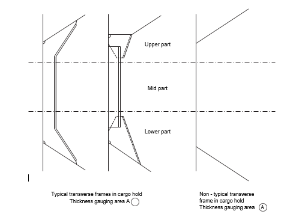

Typical transverse frames in cargo hold
Thickness gauging area A ○

Non - typical transverse frame in cargo hold
Thickness gauging area Ⓐ

4. The maximum allowable diminution could be stated in an attached document.

### Sheet 11 bis

#### TM7-BC S31 — Report on THICKNESS MEASUREMENT OF CARGO HOLD SIDE SHELL FRAMES

Ship's name........................   Class Identity No. ........................   Report No. ........................

| CARGO HOLD NO.: | Side: | (Port / stb.) |
|---|---|---|

|  | ZONE A |  |  |  |  |  | ZONE B |  |  |  |  |  | ZONE C |  |  |  |  |  | ZONE D |  |  |  |  |  |
|---|---|---|---|---|---|---|---|---|---|---|---|---|---|---|---|---|---|---|---|---|---|---|---|---|
| FRAME NO | Org. Thk. | tREN | tCOAT | tM | Diminution |  | Org. Thk. | tREN | tCOAT | tM | Diminution |  | Org. Thk. | tREN | tCOAT | tM | Diminution |  | Org. Thk. | tREN | tCOAT | tM | Diminution |  |
|  | mm | mm | mm | mm | mm | % | mm | mm | mm | mm | mm | % | mm | mm | mm | mm | mm | % | mm | mm | mm | mm | mm | % |
|  |  |  |  |  |  |  |  |  |  |  |  |  |  |  |  |  |  |  |  |  |  |  |  |  |

Operators Signature.............................................   NOTES – See Reverse

#### NOTES

1. This report is to be used for recording the thickness measurement of:-

    Cargo Hold Transverse Frames for application of UR S31

2. Guidance for areas of measurement is provided in Annex V.

3. The maximum allowable diminution could be stated in an attached document.

### Sheet 12

#### THICKNESS MEASUREMENT - BULK CARRIERS

Typical transverse section indicating longitudinal and transverse members

![Bulk carrier typical transverse section diagram showing a single or double skin vessel with numbered structural members (1 through 34 including items for strength deck plating, stringer plate, sheerstrake, side shell plating, bilge plating, bottom shell plating, keel plate, deck longitudinals, deck girders, sheerstrake longitudinals, topside tank sloping plating and longitudinals, bottom longitudinals, bottom girders, bilge longitudinals, side shell longitudinals, inner bottom plating and longitudinals, hopper side plating and longitudinals, double bottom tank floors, topside tank transverses, hopper side tank transverses, hatch coamings, deck plating between hatches, hatch covers, inner bulkhead plating, and hold frames or diaphragms) with legend boxes mapping each numbered item to Reports TM2, TM3-BC, TM4, TM6-BC and TM7-BC](assets/ur-z102rev37/part02-fig-012-merged.png)

| Report on TM2 |  |
|---|---|
| (1) | Strength deck plating |
| (2) | Stringer plate |
| (3) | Sheerstrake |
| (4) | Side shell plating |
| (5) | Bilge plating |
| (6) | Bottom shell plating |
| (7) | Keel plate |

| Report on TM3-BC |  |  |  |
|---|---|---|---|
| (8) | Deck longitudinals | (16) | Side shell longitudinals |
| (9) | Deck girders | (17) | Inner bottom plating |
| (10) | Sheerstrake longitudinals | (18) | Inner bottom longitudinals |
| (11) | Topside tank sloping plating | (19) | Hopper side plating |
| (12) | Topside tank sloping plating longitudinals | (20) | Hopper side longitudinals |
| (13) | Bottom longitudinals | (21) |  |
| (14) | Bottom girders | (22) |  |
| (15) | Bilge Longitudinals |  |  |

| Report on TM4 |
|---|
| (23) Double bottom tank floors |
| (24) Topside tank transverses |
| (25) Hopper side tank transverses |
| (26) |
| (27) |

| Report on TM6-BC |
|---|
| (28) Hatch coamings |
| (29) Deck plating between hatches |
| (30) Hatch covers |
| (31) Inner bulkhead plating |
| (32) |
| (33) |

| Report on TM7-BC |
|---|
| (34) Hold frames or diaphragms |

### Sheet 13

#### THICKNESS MEASUREMENT - BULK CARRIERS

Bulk Carriers : Typical transverse section outline

To be used for longitudinal and transverse members where the typical Bulk Carrier section is not applicable

| Report on TM2 |  |
|---|---|
| (1) | Strength deck plating |
| (2) | Stringer plate |
| (3) | Sheerstrake |
| (4) | Side shell plating |
| (5) | Bilge plating |
| (6) | Bottom shell plating |
| (7) | Keel plate |

| Report on TM3-BC |  |  |  |
|---|---|---|---|
| (8) | Deck longitudinals | (16) | Side shell longitudinals |
| (9) | Deck girders | (17) | Inner bottom plating |
| (10) | Sheerstrake longitudinals | (18) | Inner bottom longitudinals |
| (11) | Topside tank sloping plating | (19) | Hopper side plating |
| (12) | Topside tank sloping plating longitudinals | (20) | Hopper side longitudinals |
| (13) | Bottom longitudinals | (21) |  |
| (14) | Bottom girders | (22) |  |
| (15) | Bilge Longitudinals |  |  |

| Report on TM4 |
|---|
| (23) Double bottom tank floors |
| (24) Topside tank transverses |
| (25) Hopper side tank transverses |
| (26) |
| (27) |

| Report on TM6-BC |
|---|
| (28) Hatch coamings |
| (29) Deck plating between hatches |
| (30) Hatch covers |
| (31) Inner bulkhead plating |
| (32) |
| (33) |

| Report on TM7-BC |
|---|
| (34) Hold frames or diaphragms |

### Sheet 14

#### Close-up Survey and Thickness Measurement Areas

![Three sketches for close-up survey and thickness measurement areas of bulk carriers: (1) a typical transverse section marking Areas A, B and D with thickness to be reported on TM3-BC, TM4-BC, TM6-BC and TM7-BC as appropriate; (2) a cargo hold transverse bulkhead with upper stool, lower stool, topside tank, double bottom tank and hopper side tank marking Area C with thickness to be reported on TM5-BC; and (3) typical areas of deck plating inside line of hatch openings between cargo hold hatches marking Area E with thickness to be reported on TM6-BC](assets/ur-z102rev37/part02-fig-014-merged.png)

Typical transverse section

Areas Ⓐ, Ⓑ and Ⓓ

Thickness to be reported on TM3-BC, TM4-BC, TM6-BC and TM7-BC as appropriate

A cargo hold, transverse bulkhead

Area Ⓒ

Thickness to be reported on TM5-BC

Typical areas of deck plating inside line of hatch openings between cargo hold hatches

Area Ⓔ

Thickness to be reported on TM6-BC

## ANNEX II (CSR)

### Sheet 1

### IACS RECOMMENDED PROCEDURES FOR THICKNESS MEASUREMENTS OF BULK CARRIERS BUILT UNDER IACS COMMON STRUCTURAL RULES\*

\*

Note: Annex II (CSR) is recomendatory.

1. This document is to be used for recording thickness measurements of bulk carriers built under IACS Common Structural Rules as required by the IACS Unified Requirement Z10.2.

2. Reporting forms TM1-BC(CSR), TM2-BC(CSR) (i) and (ii), TM3-BC(CSR), TM4-BC(CSR), TM5-BC(CSR), TM6-BC(CSR) and TM7-BC(CSR) (sheets 4-11) are to be used for recording thickness measurements. The as-built thickness and the voluntary thickness addition and renewal thickness (minimum allowable thickness) are to be stated in the said forms.

3. The remaining sheets 12-14 are guidance diagrams and notes relating to the reporting forms and the IACS Unified Requirements for thickness measurement.

### Sheet 2

#### CONTENTS

| | | |
|---|---|---|
| Sheet 1 | - | Front cover |
| Sheet 2 | - | Contents |
| Sheet 3 | - | General particulars |

REPORTS

| | | |
|---|---|---|
| Sheet 4 | - | Report TM1-BC(CSR) for recording the thickness measurement of all deck plating, all bottom plating and side shell plating. |
| Sheet 5 | - | Report TM2-BC(CSR) (i) for recording the thickness measurement of shell and deck plating at transverse sections - strength deck and sheerstrake plating. |
| Sheet 6 | - | Report TM2-BC(CSR) (ii) for recording the thickness measurement of shell plating at transverse sections. |
| Sheet 7 | - | Report TM3-BC(CSR) for recording the thickness measurement of longitudinal members at transverse sections. |
| Sheet 8 | - | Report TM4-BC(CSR) for recording the thickness measurement of transverse structural members. |
| Sheet 9 | - | Report TM5-BC(CSR) for recording the thickness measurement of cargo hold transverse bulkheads. |
| Sheet 10 | - | Report TM6-BC(CSR) for recording the thickness measurement of miscellaneous structural members. |
| Sheet 11 | - | Report TM7-BC(CSR) for recording the thickness measurement of cargo hold transverse frames. |

GUIDANCE

| | | |
|---|---|---|
| Sheet 12 | - | Bulk Carrier typical transverse section. The diagram includes details of the items to be measured and the report forms to be used. |
| Sheet 13 | - | Transverse section outline. This diagram may be used for those ships where the diagram on sheet 12 is not suitable. |
| Sheet 14 | - | Sketches of bulk carrier showing typical areas for thickness measurement of cargo hold frames, structural members and transverse bulkheads in association with close-up survey requirements. |

### Sheet 3

#### GENERAL PARTICULARS

Ships name:-

IMO number:-

Class identity number:-

Port of registry:-

Gross tons:-

Deadweight:-

Date of build:-

Classification Society:-

Name of Firm performing thickness measurement:-

Thickness measurement firm certified by:-

Certificate No:-

Certificate valid from..................to................

Place of measurement:-

First date of measurement:-

Last date of measurement:-

Special survey/intermediate survey due:-\*

Details of measurement equipment:-

Qualification of operators:-

| Report Number:- | consisting of | Sheets |
|---|---|---|
| Names of operator:-....................... | Name of surveyor:-....................... |  |
| Signature of operator:-....................... | Signature of surveyor:-....................... |  |
| Firm official stamp:- | Classification Society Official Stamp:- |  |

\* Delete as appropriate

## TM1-BC(CSR) — Report on THICKNESS MEASUREMENT of ALL DECK PLATING, ALL BOTTOM PLATING or SIDE SHELL PLATING* (Sheet 4)

(* - delete as appropriate)

Ship's name........................   Class Identity No.........................   Report No........................

| STRAKE POSITION / PLATE POSITION | No. or Letter | As Built Thk. mm | Voluntary Thickness Addition mm | Renewal Thickness mm (a) | Forward Reading — Gauged Thk. mm (b1) P | Forward Reading — Gauged Thk. mm (b1) S | Forward Reading — Remaining Corr. Addition, mm (c1)=(b1)-(a) P | Forward Reading — Remaining Corr. Addition, mm (c1)=(b1)-(a) S | Aft Reading — Gauged Thk. mm (b2) P | Aft Reading — Gauged Thk. mm (b2) S | Aft Reading — Remaining Corr. Addition, mm (c2)=(b2)-(a) P | Aft Reading — Remaining Corr. Addition, mm (c2)=(b2)-(a) S | Mean Remaining Corr. Addition, mm [(c1)+(c2)]/2 P | Mean Remaining Corr. Addition, mm [(c1)+(c2)]/2 S |
|---|---|---|---|---|---|---|---|---|---|---|---|---|---|---|
| 12th forward |   |   |   |   |   |   |   |   |   |   |   |   |   |   |
| 11th |   |   |   |   |   |   |   |   |   |   |   |   |   |   |
| 10th |   |   |   |   |   |   |   |   |   |   |   |   |   |   |
| 9th |   |   |   |   |   |   |   |   |   |   |   |   |   |   |
| 8th |   |   |   |   |   |   |   |   |   |   |   |   |   |   |
| 7th |   |   |   |   |   |   |   |   |   |   |   |   |   |   |
| 6th |   |   |   |   |   |   |   |   |   |   |   |   |   |   |
| 5th |   |   |   |   |   |   |   |   |   |   |   |   |   |   |
| 4th |   |   |   |   |   |   |   |   |   |   |   |   |   |   |
| 3rd |   |   |   |   |   |   |   |   |   |   |   |   |   |   |
| 2nd |   |   |   |   |   |   |   |   |   |   |   |   |   |   |
| 1st |   |   |   |   |   |   |   |   |   |   |   |   |   |   |
| Amidships |   |   |   |   |   |   |   |   |   |   |   |   |   |   |
| 1st aft |   |   |   |   |   |   |   |   |   |   |   |   |   |   |
| 2nd |   |   |   |   |   |   |   |   |   |   |   |   |   |   |
| 3rd |   |   |   |   |   |   |   |   |   |   |   |   |   |   |
| 4th |   |   |   |   |   |   |   |   |   |   |   |   |   |   |
| 5th |   |   |   |   |   |   |   |   |   |   |   |   |   |   |
| 6th |   |   |   |   |   |   |   |   |   |   |   |   |   |   |
| 7th |   |   |   |   |   |   |   |   |   |   |   |   |   |   |
| 8th |   |   |   |   |   |   |   |   |   |   |   |   |   |   |
| 9th |   |   |   |   |   |   |   |   |   |   |   |   |   |   |
| 10th |   |   |   |   |   |   |   |   |   |   |   |   |   |   |
| 11th |   |   |   |   |   |   |   |   |   |   |   |   |   |   |
| 12th |   |   |   |   |   |   |   |   |   |   |   |   |   |   |

Operators Signature..............................................   NOTES – See Reverse

### NOTES TO REPORT TM1-BC(CSR)

1. This report is to be used for recording the thickness measurement of:-

    A -     All strength deck plating within cargo length area.

    B -     Keel, bottom shell plating and bilge plating within the cargo length area.

    C -     Side shell plating that is all wind and water strakes within the cargo length area.

    D -     Side shell plating that is selected wind and water strakes outside the cargo length area.

2. The strake position is to be clearly indicated as follows:-

    2.1     For strength deck indicate the number of the strake of plating inboard from the stringer plate.

    2.2     For bottom plating indicate the number of the strake of plating outboard from the keel plate.

    2.3     For side shell plating give number of the strake of plating sheerstrake and letter as shown on shell expansion.

3. Only the deck plating strakes outside line of openings are to be recorded.

4. Measurements are to be taken at the forward and aft areas of all plates and the single measurements recorded are to represent the average of multiple measurements.

5. The remaining corrosion addition is to be recorded with result of gauged thickness minus renewal thickness. If the result is negative, the structure in way shall be renewed, and the mark "R" is to be indicated in the right-hand column. If the result is between 0 and 0.5 mm (0 included), the structure in way shall be additional gauged, and the mark "S" is to be indicated in the right-hand column.

## TM2-BC(CSR) (i) — Report on THICKNESS MEASUREMENT OF SHELL AND DECK PLATING (one, two or three transverse sections) (Sheet 5)

Ship's name........................   Class Identity No. ........................   Report No. ........................

STRENGTH DECK AND SHEERSTRAKE PLATING

| STRAKE POSITION | First Transverse Section at Frame Number — No. or Letter | First Transverse Section — As Built Thk. mm | First Transverse Section — Vol. Thk. Add. mm | First Transverse Section — Ren. Thk. mm (a) | First Transverse Section — Gauged Thk. mm (b) P | First Transverse Section — Gauged Thk. mm (b) S | First Transverse Section — Remaining Corr. Addition, mm (b)-(a) P | First Transverse Section — Remaining Corr. Addition, mm (b)-(a) S | Second Transverse Section at Frame Number — No. or Letter | Second Transverse Section — As Built Thk. mm | Second Transverse Section — Vol. Thk. Add. mm | Second Transverse Section — Ren. Thk. mm (a) | Second Transverse Section — Gauged Thk. mm (b) P | Second Transverse Section — Gauged Thk. mm (b) S | Second Transverse Section — Remaining Corr. Addition, mm (b)-(a) P | Second Transverse Section — Remaining Corr. Addition, mm (b)-(a) S | Third Transverse Section at Frame Number — No. or Letter | Third Transverse Section — As Built Thk. mm | Third Transverse Section — Vol. Thk. Add. mm | Third Transverse Section — Ren. Thk. mm (a) | Third Transverse Section — Gauged Thk. mm (b) P | Third Transverse Section — Gauged Thk. mm (b) S | Third Transverse Section — Remaining Corr. Addition, mm (b)-(a) P | Third Transverse Section — Remaining Corr. Addition, mm (b)-(a) S |
|---|---|---|---|---|---|---|---|---|---|---|---|---|---|---|---|---|---|---|---|---|---|---|---|---|
| Stringer Plate |   |   |   |   |   |   |   |   |   |   |   |   |   |   |   |   |   |   |   |   |   |   |   |   |
| 1st strake inboard |   |   |   |   |   |   |   |   |   |   |   |   |   |   |   |   |   |   |   |   |   |   |   |   |
| 2nd |   |   |   |   |   |   |   |   |   |   |   |   |   |   |   |   |   |   |   |   |   |   |   |   |
| 3rd |   |   |   |   |   |   |   |   |   |   |   |   |   |   |   |   |   |   |   |   |   |   |   |   |
| 4th |   |   |   |   |   |   |   |   |   |   |   |   |   |   |   |   |   |   |   |   |   |   |   |   |
| 5th |   |   |   |   |   |   |   |   |   |   |   |   |   |   |   |   |   |   |   |   |   |   |   |   |
| 6th |   |   |   |   |   |   |   |   |   |   |   |   |   |   |   |   |   |   |   |   |   |   |   |   |
| 7th |   |   |   |   |   |   |   |   |   |   |   |   |   |   |   |   |   |   |   |   |   |   |   |   |
| 8th |   |   |   |   |   |   |   |   |   |   |   |   |   |   |   |   |   |   |   |   |   |   |   |   |
| 9th |   |   |   |   |   |   |   |   |   |   |   |   |   |   |   |   |   |   |   |   |   |   |   |   |
| 10th |   |   |   |   |   |   |   |   |   |   |   |   |   |   |   |   |   |   |   |   |   |   |   |   |
| 11th |   |   |   |   |   |   |   |   |   |   |   |   |   |   |   |   |   |   |   |   |   |   |   |   |
| 12th |   |   |   |   |   |   |   |   |   |   |   |   |   |   |   |   |   |   |   |   |   |   |   |   |
| 13th |   |   |   |   |   |   |   |   |   |   |   |   |   |   |   |   |   |   |   |   |   |   |   |   |
| 14th |   |   |   |   |   |   |   |   |   |   |   |   |   |   |   |   |   |   |   |   |   |   |   |   |
| centre strake |   |   |   |   |   |   |   |   |   |   |   |   |   |   |   |   |   |   |   |   |   |   |   |   |
| sheer strake |   |   |   |   |   |   |   |   |   |   |   |   |   |   |   |   |   |   |   |   |   |   |   |   |
| TOPSIDE TOTAL |   |   |   |   |   |   |   |   |   |   |   |   |   |   |   |   |   |   |   |   |   |   |   |   |

Operators Signature..............................................   NOTES – See Reverse

### NOTES TO REPORT TM2-BC(CSR) (i)

1. This report is to be used for recording the thickness measurement of:-

    Strength deck plating and sheerstrake plating transverse sections:-

    One, two or three sections within the cargo length area, comprising of the structural items (1), (2) and (3) as shown on the diagram of typical transverse section.

2. Only the deck plating strakes outside the line of openings are to be recorded.

3. The topside area comprises deck plating, stringer plate and sheerstrake (including rounded gunwales).

4. The exact frame station of measurement is to be stated.

5. The single measurements recorded are to represent the average of multiple measurements.

6. The remaining corrosion addition is to be recorded with result of gauged thickness minus renewal thickness. If the result is negative, the structure in way shall be renewed, and the mark "R" is to be indicated in the right-hand column. If the result is between 0 and 0.5 mm (0 included), the structure in way shall be additional gauged, and the mark "S" is to be indicated in the right-hand column.

## TM2-BC(CSR) (ii) — Report on THICKNESS MEASUREMENT OF SHELL PLATING (one, two or three transverse sections) (Sheet 6)

Ship's name........................   Class Identity No. ........................   Report No. ........................

SHELL PLATING

| STRAKE POSITION | First Transverse Section at Frame Number — No. or Letter | First Transverse Section — As Built Thk. mm | First Transverse Section — Vol. Thk. Add. mm | First Transverse Section — Ren. Thk. mm (a) | First Transverse Section — Gauged Thk. mm (b) P | First Transverse Section — Gauged Thk. mm (b) S | First Transverse Section — Remaining Corr. Addition, mm (b)-(a) P | First Transverse Section — Remaining Corr. Addition, mm (b)-(a) S | Second Transverse Section at Frame Number — No. or Letter | Second Transverse Section — As Built Thk. mm | Second Transverse Section — Vol. Thk. Add. mm | Second Transverse Section — Ren. Thk. mm (a) | Second Transverse Section — Gauged Thk. mm (b) P | Second Transverse Section — Gauged Thk. mm (b) S | Second Transverse Section — Remaining Corr. Addition, mm (b)-(a) P | Second Transverse Section — Remaining Corr. Addition, mm (b)-(a) S | Third Transverse Section at Frame Number — No. or Letter | Third Transverse Section — As Built Thk. mm | Third Transverse Section — Vol. Thk. Add. mm | Third Transverse Section — Ren. Thk. mm (a) | Third Transverse Section — Gauged Thk. mm (b) P | Third Transverse Section — Gauged Thk. mm (b) S | Third Transverse Section — Remaining Corr. Addition, mm (b)-(a) P | Third Transverse Section — Remaining Corr. Addition, mm (b)-(a) S |
|---|---|---|---|---|---|---|---|---|---|---|---|---|---|---|---|---|---|---|---|---|---|---|---|---|
| 1st below sheer strake |   |   |   |   |   |   |   |   |   |   |   |   |   |   |   |   |   |   |   |   |   |   |   |   |
| 2nd |   |   |   |   |   |   |   |   |   |   |   |   |   |   |   |   |   |   |   |   |   |   |   |   |
| 3rd |   |   |   |   |   |   |   |   |   |   |   |   |   |   |   |   |   |   |   |   |   |   |   |   |
| 4th |   |   |   |   |   |   |   |   |   |   |   |   |   |   |   |   |   |   |   |   |   |   |   |   |
| 5th |   |   |   |   |   |   |   |   |   |   |   |   |   |   |   |   |   |   |   |   |   |   |   |   |
| 6th |   |   |   |   |   |   |   |   |   |   |   |   |   |   |   |   |   |   |   |   |   |   |   |   |
| 7th |   |   |   |   |   |   |   |   |   |   |   |   |   |   |   |   |   |   |   |   |   |   |   |   |
| 8th |   |   |   |   |   |   |   |   |   |   |   |   |   |   |   |   |   |   |   |   |   |   |   |   |
| 9th |   |   |   |   |   |   |   |   |   |   |   |   |   |   |   |   |   |   |   |   |   |   |   |   |
| 10th |   |   |   |   |   |   |   |   |   |   |   |   |   |   |   |   |   |   |   |   |   |   |   |   |
| 11th |   |   |   |   |   |   |   |   |   |   |   |   |   |   |   |   |   |   |   |   |   |   |   |   |
| 12th |   |   |   |   |   |   |   |   |   |   |   |   |   |   |   |   |   |   |   |   |   |   |   |   |
| 13th |   |   |   |   |   |   |   |   |   |   |   |   |   |   |   |   |   |   |   |   |   |   |   |   |
| 14th |   |   |   |   |   |   |   |   |   |   |   |   |   |   |   |   |   |   |   |   |   |   |   |   |
| 15th |   |   |   |   |   |   |   |   |   |   |   |   |   |   |   |   |   |   |   |   |   |   |   |   |
| 16th |   |   |   |   |   |   |   |   |   |   |   |   |   |   |   |   |   |   |   |   |   |   |   |   |
| 17th |   |   |   |   |   |   |   |   |   |   |   |   |   |   |   |   |   |   |   |   |   |   |   |   |
| 18th |   |   |   |   |   |   |   |   |   |   |   |   |   |   |   |   |   |   |   |   |   |   |   |   |
| 19th |   |   |   |   |   |   |   |   |   |   |   |   |   |   |   |   |   |   |   |   |   |   |   |   |
| 20th |   |   |   |   |   |   |   |   |   |   |   |   |   |   |   |   |   |   |   |   |   |   |   |   |
| Keel strake |   |   |   |   |   |   |   |   |   |   |   |   |   |   |   |   |   |   |   |   |   |   |   |   |
| BOTTOM TOTAL |   |   |   |   |   |   |   |   |   |   |   |   |   |   |   |   |   |   |   |   |   |   |   |   |

Operators Signature..............................................   NOTES – See Reverse

### NOTES TO REPORT TM2-BC(CSR) (ii)

1. This report is to be used for recording the thickness measurement of:-

    Shell plating transverse sections:-

    One, two or three sections within cargo length area comprising of the structural items (4), (5), (6) and (7) as shown on the diagram of typical transverse section.

2. The bottom area comprises keel, bottom and bilge plating.

3. The exact frame station of measurement is to be stated.

4. The single measurements recorded are to represent the average of multiple measurements.

5. The remaining corrosion addition is to be recorded with result of gauged thickness minus renewal thickness. If the result is negative, the structure in way shall be renewed, and the mark "R" is to be indicated in the right-hand column. If the result is between 0 and 0.5 mm (0 included), the structure in way shall be additional gauged, and the mark "S" is to be indicated in the right-hand column.

## TM3-BC(CSR) — Report on THICKNESS MEASUREMENT OF LONGITUDINAL MEMBERS (one, two or three transverse sections) (Sheet 7)

Ship's name........................   Class Identity No. ........................   Report No. ........................

| STRUCTURAL MEMBER | First Transverse Section at Frame Number — Item No. | First Transverse Section — As Built Thk. mm | First Transverse Section — Vol. Thk. Add. mm | First Transverse Section — Ren. Thk. mm (a) | First Transverse Section — Gauged Thk. mm (b) P | First Transverse Section — Gauged Thk. mm (b) S | First Transverse Section — Remaining Corr. Addition, mm (b)-(a) P | First Transverse Section — Remaining Corr. Addition, mm (b)-(a) S | Second Transverse Section at Frame Number — Item No. | Second Transverse Section — As Built Thk. mm | Second Transverse Section — Vol. Thk. Add. mm | Second Transverse Section — Ren. Thk. mm (a) | Second Transverse Section — Gauged Thk. mm (b) P | Second Transverse Section — Gauged Thk. mm (b) S | Second Transverse Section — Remaining Corr. Addition, mm (b)-(a) P | Second Transverse Section — Remaining Corr. Addition, mm (b)-(a) S | Third Transverse Section at Frame Number — Item No. | Third Transverse Section — As Built Thk. mm | Third Transverse Section — Vol. Thk. Add. mm | Third Transverse Section — Ren. Thk. mm (a) | Third Transverse Section — Gauged Thk. mm (b) P | Third Transverse Section — Gauged Thk. mm (b) S | Third Transverse Section — Remaining Corr. Addition, mm (b)-(a) P | Third Transverse Section — Remaining Corr. Addition, mm (b)-(a) S |
|---|---|---|---|---|---|---|---|---|---|---|---|---|---|---|---|---|---|---|---|---|---|---|---|---|
|   |   |   |   |   |   |   |   |   |   |   |   |   |   |   |   |   |   |   |   |   |   |   |   |   |

Operators Signature..............................................   NOTES – See Reverse

### NOTES TO REPORT TM3-BC(CSR)

1. This report is to be used for recording the thickness measurement of:-

    Longitudinal Members at transverse sections:-

    One, two, or three sections within the cargo length area, comprising of the appropriate structural items (8) to (20) as shown on diagram of typical transverse section.

2. The exact frame station of measurement is to be stated.

3. The single measurements recorded are to represent the average of multiple measurements.

4. The remaining corrosion addition is to be recorded with result of gauged thickness minus renewal thickness. If the result is negative, the structure in way shall be renewed, and the mark "R" is to be indicated in the right-hand column. If the result is between 0 and 0.5 mm (0 included), the structure in way shall be additional gauged, and the mark "S" is to be indicated in the right-hand column.

## TM4-BC(CSR) — Report on THICKNESS MEASUREMENT OF TRANSVERSE STRUCTURAL MEMBERS In the double bottom, hopper side and topside water ballast tanks (Sheet 8)

Ship's name........................   Class Identity No. ........................   Report No. ........................

TANK DESCRIPTION:

LOCATION OF STRUCTURE

| STRUCTURAL MEMBER | ITEM | As Built Thickness mm | Voluntary Thickness Addition mm | Renewal Thickness mm (a) | Gauged Thickness mm (b) P | Gauged Thickness mm (b) S | Remaining Corr. Addition mm (b)-(a) P | Remaining Corr. Addition mm (b)-(a) S |
|---|---|---|---|---|---|---|---|---|
|   |   |   |   |   |   |   |   |   |

Operators Signature..............................................   NOTES – See Reverse

### NOTES TO REPORT TM4-BC(CSR)

1. This report is to be used for recording the thickness measurement of transverse structural members, comprising of the appropriate structural items (23) to (25) as shown on diagram of typical transverse section.

2. Guidance for areas if measurement is indicated on the diagrams shown on sheet 14 of this document.

3. The single measurements recorded are to represent the average of multiple measurements.

4. The remaining corrosion addition is to be recorded with result of gauged thickness minus renewal thickness. If the result is negative, the structure in way shall be renewed, and the mark "R" is to be indicated in the right-hand column. If the result is between 0 and 0.5 mm (0 included), the structure in way shall be additional gauged, and the mark "S" is to be indicated in the right-hand column.

## TM5-BC(CSR) — Report on THICKNESS OF CARGO HOLD TRANSVERSE BULKHEADS (Sheet 9)

Ship's name........................   Class Identity No. ........................   Report No. ........................

HOLD DESCRIPTION:

LOCATION OF STRUCTURE:                       FRAME NO.:

| STRUCTURAL COMPONENT (PLATING/STIFFENER) | As Built Thickness mm | Voluntary Thickness Addition mm | Renewal Thickness mm (a) | Gauged Thickness mm (b) P | Gauged Thickness mm (b) S | Remaining Corr. Addition mm (b)-(a) P | Remaining Corr. Addition mm (b)-(a) S |
|---|---|---|---|---|---|---|---|
|   |   |   |   |   |   |   |   |

Operators Signature..............................................   NOTES – See Reverse

### NOTES TO REPORT TM5-BC(CSR)

1. This report form is to be used for recording the thickness measurement of cargo hold transverse bulkheads.

2. Guidance for areas of measurement is indicated on the diagrams shown on sheet 14 of this document.

3. The single measurements recorded are to represent the average of multiple measurements.

4. The remaining corrosion addition is to be recorded with result of gauged thickness minus renewal thickness. If the result is negative, the structure in way shall be renewed, and the mark "R" is to be indicated in the right-hand column. If the result is between 0 and 0.5 mm (0 included), the structure in way shall be additional gauged, and the mark "S" is to be indicated in the right-hand column.

## TM6-BC(CSR) — Report on THICKNESS MEASUREMENT OF MISCELLANEOUS STRUCTURAL MEMBERS (Sheet 10)

Ship's name........................   Class Identity No. ........................   Report No. ........................

STRUCTURAL MEMBER:                                           SKETCH

LOCATION OF STRUCTURE:

| Description | As Built Thk. mm | Voluntary Thickness Addition mm | Renewal Thickness mm (a) | Gauged Thickness mm (b) P | Gauged Thickness mm (b) S | Remaining Corr. Addition mm (b)-(a) P | Remaining Corr. Addition mm (b)-(a) S |
|---|---|---|---|---|---|---|---|
|   |   |   |   |   |   |   |   |

Operators Signature..............................................   NOTES – See Reverse

### NOTES TO REPORT TM6-BC(CSR)

1. This report is to be used for recording the thickness measurement of miscellaneous structural members including the structural items (28), (29) and (30) as shown on diagram of typical transverse section, sheet 12 of this document.

2. Guidance for areas of measurement is indicated on sheet 14 of this document.

3. The single measurements recorded are to represent the average of multiple measurements.

4. The remaining corrosion addition is to be recorded with result of gauged thickness minus renewal thickness. If the result is negative, the structure in way shall be renewed, and the mark "R" is to be indicated in the right-hand column. If the result is between 0 and 0.5 mm (0 included), the structure in way shall be additional gauged, and the mark "S" is to be indicated in the right-hand column.

## TM7-BC(CSR) — Report on THICKNESS MEASUREMENT OF CARGO HOLD TRANSVERSE FRAMES (Sheet 11)

Ship's name........................   Class Identity No. ........................   Report No. ........................

CARGO HOLD NO.

| FRAME NUMBER | Upper Part — As Built Thk mm | Upper Part — Volun. Thk. Add. mm | Upper Part — Renewal Thickness mm (a) | Upper Part — Gauged Thickness mm (b) | Upper Part — Remaining Corr. Addition mm (b)-(a) P | Upper Part — Remaining Corr. Addition mm (b)-(a) S | Mid Part — As Built Thk mm | Mid Part — Volun. Thk. Add. mm | Mid Part — Renewal Thickness mm (a) | Mid Part — Gauged Thickness mm (b) | Mid Part — Remaining Corr. Addition mm (b)-(a) P | Mid Part — Remaining Corr. Addition mm (b)-(a) S | Lower Part — As Built Thk mm | Lower Part — Volun. Thk. Add. mm | Lower Part — Renewal Thickness mm (a) | Lower Part — Gauged Thickness mm (b) | Lower Part — Remaining Corr. Addition mm (b)-(a) P | Lower Part — Remaining Corr. Addition mm (b)-(a) S |
|---|---|---|---|---|---|---|---|---|---|---|---|---|---|---|---|---|---|---|
|   |   |   |   |   |   |   |   |   |   |   |   |   |   |   |   |   |   |   |

Operators Signature..............................................   NOTES – See Reverse

### NOTES TO REPORT TM7-BC(CSR) (Sheet 11 bis)

1. This report is to be used for recording the thickness measurement of:-

    Cargo Hold Transverse Frames

    Structural item number 34 as shown on the diagram of typical transverse section.

2. Guidance for areas of measurement is indicated on the diagrams shown on sheet 14 of this document.
    The single measurement recorded are to represent the average of multiple measurements.

3. The location and pattern of measurements is to be indicated on the sketches of hold frames shown below.

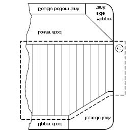

Typical transverse frames in cargo hold Thickness gauging area Ⓐ          Non - typical transverse frames in cargo hold Thickness gauging area Ⓐ

4. The remaining corrosion addition is to be recorded with result of gauged thickness minus renewal thickness. If the result is negative, the structure in way shall be renewed, and the mark "R" is to be indicated in the right-hand column. If the result is between 0 and 0.5 mm (0 included), the structure in way shall be additional gauged, and the mark "S" is to be indicated in the right-hand column.

## Thickness Measurement - Bulk Carriers — Typical transverse section including longitudinal and transverse members (Sheet 12)

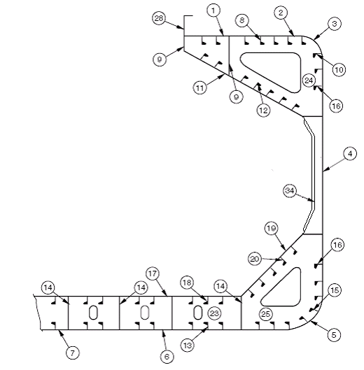

| Report on TM2-BC(CSR) (i) & (ii) | Report on TM3-BC(CSR) |   | Report on TM6-BC(CSR) |
|---|---|---|---|
| 1. Strength deck plating | 8. Deck longitudinals | 17. Inner bottom plating | 28. Hatch coamings |
| 2. Stringer plate | 9. Deck girders | 18. Inner bottom longitudinals | 29. Deck plating between hatches |
| 3. Sheerstrake | 10. Sheerstrake longitudinals | 19. Hopper plating | 30. Hatch covers |
| 4. Side shell plating | 11. Topside tank sloping plating | 20. Hopper longitudinals | 31. |
| 5. Bilge plating | 12. Topside tank sloping plating longitudinals | 21. | 32. |
| 6. Bottom plating | 13. Bottom longitudinals | 22. | 33. |
| 7. Keel plate | 14. Bottom girders | **Report on TM4-BC(CSR)** |   |
|   | 15. Bilge longitudinals | 23. Double bottom tank floors |   |
|   | 16. Side shell longitudinals, if any | 24. Top side tank transverses |   |
|   |   | 25. Hopper side tank transverses | **Report on TM7-BC(CSR)** |
|   |   | 26. | 34.Cargo hold frames |
|   |   | 27. |   |

## Thickness Measurement - Bulk Carriers — Transverse section outline (Sheet 13)

Transverse section outline: The diagram may be used for those ships where the diagrams on sheet 12 are not suitable.

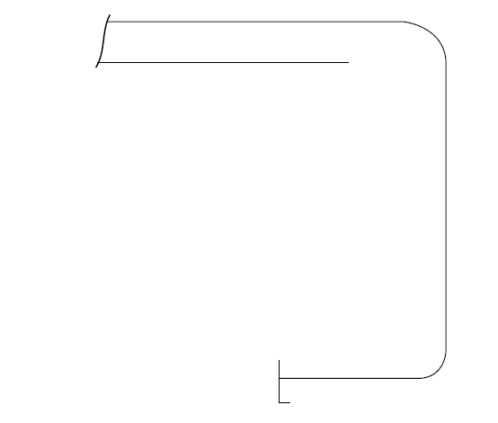

| Report on TM2-BC(CSR) (i) & (ii) | Report on TM3-BC(CSR) |   | Report on TM6-BC(CSR) |
|---|---|---|---|
| 1. Strength deck plating | 8. Deck longitudinals | 17. Inner bottom plating | 28. Hatch coamings |
| 2. Stringer plate | 9. Deck girders | 18. Inner bottom longitudinals | 29. Deck plating between hatches |
| 3. Sheerstrake | 10. Sheerstrake longitudinals | 19. Hopper plating | 30. Hatch covers |
| 4. Side shell plating | 11. Topside tank sloping plating | 20. Hopper longitudinals | 31. |
| 5. Bilge plating | 12. Topside tank sloping plating longitudinals | 21. | 32. |
| 6. Bottom plating | 13. Bottom longitudinals | 22. | 33. |
| 7. Keel plate | 14. Bottom girders | **Report on TM4-BC(CSR)** |   |
|   | 15. Bilge longitudinals | 23. Double bottom tank floors |   |
|   | 16. Side  shell  longitudinals,  if any | 24. Top side tank transverses |   |
|   |   | 25. Hopper side tank transverses | **Report on TM7-BC(CSR)** |
|   |   | 26. | 34.Cargo hold frames |
|   |   | 27. |   |

## Close-up Survey and Thickness Measurement Areas (Sheet 14)

Typical transverse section

Areas A, B and D

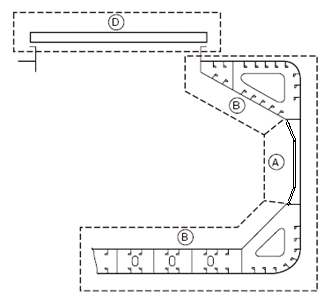

Thickness to be reported on TM3-BC(CSR), TM4-BC(CSR), TM6-BC(CSR) and TM7-BC(CSR) as appropriate

A cargo hold, transverse bulkhead

Area C

Thickness to be reported on TM5-BC(CSR)

Typical areas of deck plating inside line of hatch openings between cargo hold hatches

Area E

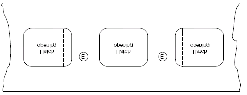

Thickness to be reported on TM6-BC(CSR)

End of Annex II

## ANNEX III — GUIDELINES FOR THE GAUGING OF THE VERTICALLY CORRUGATED TRANSVERSE WATERTIGHT BULKHEAD BETWEEN HOLDS NOS. 1 AND 2

1. Gauging is necessary to determine the general condition of the structure and to define the extent of possible repairs and/or reinforcements of the vertically corrugated transverse watertight bulkhead for verification of the compliance with UR S19.

2. Taking into account the buckling model applied in UR S19 in the evaluation of strength of the bulkhead, it is essential to determine the thickness diminution at the critical levels shown in Figures 1 and 2.

3. The gauging is to be carried out at the levels as described below. To adequately assess the scantlings of each individual vertical corrugation, each corrugation flange, web, shedder plate and gusset plate within each of the levels given below are to be gauged.

    **Level (a)     Ships without lower stool (see Figure 1):**

    Locations:
    - The mid-breadth of the corrugation flanges at approximately 200 mm above the line of shedder plates;
    - The middle of gusset plates between corrugation flanges, where fitted;
    - The middle of the shedder plates;
    - The mid-breadth of the corrugation webs at approximately 200 mm above the line of shedder plates.

    **Level (b)     Ships with lower stool (see Figure 2):**

    Locations:
    - The mid-breadth of the corrugation flanges at approximately 200 mm above the line of shedder plates;
    - The middle of gusset plates between corrugation flanges, where fitted;
    - The middle of the shedder plates;
    - The mid-breadth of the corrugation webs at approximately 200 mm above the line of shedder plates.

    **Level (c)     Ships with or without lower stool (see Figures 1 and 2):**

    Locations:
    - The mid-breadth of the corrugation flanges and webs at about the mid-height of the corrugation.

4. Where the thickness changes within the horizontal levels, the thinner plate is to be gauged.

5. Steel renewal and/or reinforcement is to comply with S19.

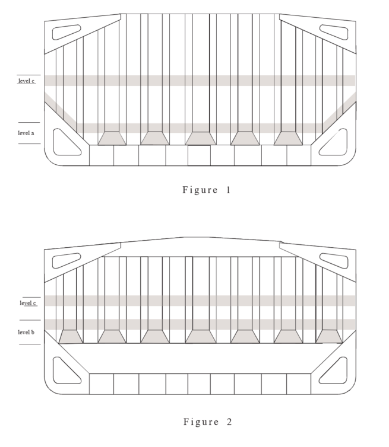

Figure 1

Figure 2

End of Annex III

## ANNEX IV — ADDITIONAL ANNUAL SURVEY REQUIREMENTS FOR THE FOREMOST CARGO HOLD OF SHIPS SUBJECT TO SOLAS XII/9.1

### 1 General

1.1 In the case of Bulk Carrier over 5 years of age, the Annual Survey is to include, in addition to the requirements of the Annual Surveys prescribed in chapter 3, an examination of the following items:

1.2 Extent of Survey

1.2.1 For bulk carriers of 5 - 15 years of age:

a) An Overall Survey of the foremost cargo hold, including Close-up Survey of sufficient extent, minimum 25% of frames, is to be carried out to establish the condition of:

- Shell frames including their upper and lower end attachments, adjacent shell plating, and transverse bulkheads.

- Suspect areas identified at previous surveys (see 1.2.9 of UR Z10.2).

b) Where considered necessary by the surveyor as a result of the Overall and Close-up Survey as described in a) above, the survey is to be extended to include a Close-up Survey of all of the shell frames and adjacent shell plating of the cargo hold.

1.2.2 For bulk carriers exceeding 15 years of age:

a) An Overall Survey of the foremost cargo hold, including Close-up Survey is to be carried out to establish the condition of:

- All shell frames including their upper and lower end attachments, adjacent shell plating, and transverse bulkheads.

- Suspect areas identified at previous surveys (see 1.2.9 of UR Z10.2).

1.3 Extent of Thickness Measurement

1.3.1 Thickness measurement is to be carried out to an extent sufficient to determine both general and local corrosion levels at areas subject to Close-up Survey, as described in 1.2.1 a) and 1.2.2. a) above.
The minimum requirement for thickness measurements are suspect areas identified at previous surveys (see 1.2.9 of UR Z10.2).

Where Substantial Corrosion as defined in chapter 1.2.9 is found, the extent of thickness measurements should be increased with the requirements of Table VIII.

1.3.2 The thickness measurement may be dispensed with provided the surveyor is satisfied by the Close-up Survey, that there is no structural diminution and the Protective Coating where fitted remains effective.

1.4 Special Consideration

1.4.1 Where the protective coating in the foremost cargo hold, as defined by Z.9 is found to be in GOOD condition, the extent of close-up surveys and thickness measurements may be specially considered.

Explanatory note:

For existing bulk carriers, where owners may elect to coat or recoat cargo holds as noted above, consideration may be given to the extent of the close-up and thickness measurement surveys. Prior to the coating of cargo holds of existing ships, scantlings should be ascertained in the presence of a surveyor.

End of Annex IV

## ANNEX V — GUIDELINES FOR THE GAUGING OF SIDE SHELL FRAMES AND BRACKETS IN SINGLE SIDE SKIN BULK CARRIERS REQUIRED TO COMPLY WITH UR S31

### 1. General

Gauging is necessary to determine the general condition of the structure and to define the extent of possible steel renewals or other measures for the webs and flanges of side shell frames and brackets for verification of the compliance with UR S31.

### 2. Zones of Side Shell Frames and Brackets

For the purpose of steel renewal, sand blasting and coating, four zones A, B, C and D are defined, as shown in Figure 1.
Zones A & B are considered to be the most critical zones.

Figure 1     Zones of Side Shell Frames and Brackets

### 3. Pitting and grooving

Pits can grow in a variety of shapes, some of which would need to be ground before assessment.

Pitting corrosion may be found under coating blisters, which must be removed before inspection.

To measure the remaining thickness of pits or grooving the normal ultrasonic transducer (generally 10mm diameter) will not suffice. A miniature transducer (3 to 5 mm diameter) must be used. Alternatively the gauging firm must use a pit gauge to measure the depth of the pits and grooving and calculate the remaining thickness.

#### 3.1     Assessment based upon Area

This is the method specified in S31.2.5 and is based upon the intensity determined from Figure 2 below.

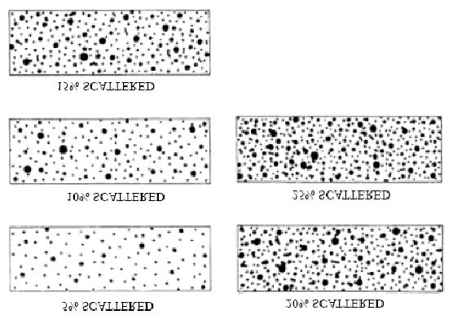

Figure 2         Pitting intensity diagrams (from 5% to 25% intensity)

If pitting intensity is higher than 15% in an area (see Figure 2), then thickness measurements are to be taken to check the extent of the pitting corrosion. The 15% is based upon pitting or grooving on only one side of the plate.

In cases where pitting is evident as defined above (exceeding 15 %) then an area of 300mm diameter or more (or, where this is impracticable on the frame flange or the side shell, hopper tank plating or topside tank plating attached to the side frame, an equivalent rectangular area), at the most pitted part, is to be cleaned to bare metal, and the thickness measured in way of the five deepest pits within the cleaned area. The least thickness measured in way of any of these pits is to be taken as the thickness to be recorded.

The minimum acceptable remaining thickness in any pit or groove is equal to:

- 75% of the as built thickness, for pitting or grooving in the cargo hold side frame webs and flanges.
- 70% of the as built thickness, for pitting or grooving in the side shell, hopper tank and topside tank plating attached to the cargo hold side frame, over a width up to 30mm from each side of it.

### 4. Gauging methodology

Numbers of side frames to be measured are equivalent to those of Special Survey or Intermediate Survey corresponding to the ship's age. Representative thickness measurements are to be taken for each zone as specified below.

Special consideration to the extent of the thickness measurements may be given by the Classification Society, if the structural members show no thickness diminution with respect to the as built thicknesses and the coating is found in "as-new" condition (i.e., without breakdown or rusting).

Where gauging readings close to the criteria are found, the number of hold frames to be measured is to be increased.

If renewal or other measures according to S31 are to be applied on individual frames in a hold, then all frames in that hold are to be gauged.

There is a variety of construction methods used for side shell frames in bulk carriers. Some have faceplates (T sections) on the side shell frames, some have flanged plates and some have bulb plates. The use of faceplates and flanged sections is considered similar for gauging purposes in that both the web and faceplate or web and flange plate are to be gauged. If bulb plate has been used, then web of the bulb plate is to be gauged in the normal manner and the sectional modulus has to be specially considered if required.

#### 4.1     Gaugings for Zones A, B & D

Web plating

The gauging pattern for Zones A, B & D are to be a five point pattern. See Figure 3. The 5 point pattern is to be over the depth of the web and the same area vertically. The gauging report is to reflect the average reading.

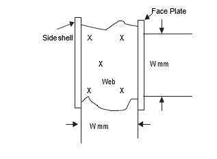

Figure 3         Typical 5 point pattern on the web plate

#### 4.2     Gaugings for Zone C

Web plating

Depending upon the condition of the web in way of Zone C, the web may be measured by taking 3 readings over the length of Zone C and averaging them. The average reading is to be compared with the allowable thickness. If the web plating has general corrosion then this pattern should be expanded to a five point pattern as noted above.

#### 4.3     Gaugings for section a) and b) (flanges and side shell plating)

Where the lower bracket length or depth does not meet the requirements in UR S12(Rev.3), gaugings are to be taken at sections a) and b) to calculate the actual section modulus required in UR S31.3.4. See Figure 4. At least 2 readings on the flange/faceplate are to be taken in way of each section. At least one reading of the attached shell plating is to be taken on each side of the frame (i.e. fore and aft) in way of section a) and section b).

Figure 4         Sections a) and b)

### 5 Report on Thickness Measurement of Cargo Hold Frames

See form TM7-BC S31 (sheet 11 bis).

End of Annex V

## ANNEX VI

### ANNEX VIA — SURVEY PROGRAMME

Basic information and particulars

| Field | Value |
|---|---|
| Name of ship: |   |
| IMO number: |   |
| Flag State: |   |
| Port of registry: |   |
| Gross tonnage: |   |
| Deadweight (metric tonnes): |   |
| Length between perpendiculars (m): |   |
| Shipbuilder: |   |
| Hull number: |   |
| Classification Society: |   |
| Class ID: |   |
| Date of build of the ship: |   |
| Owner: |   |
| Thickness measurement firm: |   |

### 1     Preamble

#### 1.1     Scope

1.1.1 The present survey programme covers the minimum extent of overall surveys, close-up surveys, thickness measurements and pressure testing within the cargo length area, cargo holds, ballast tanks, including fore and aft peak tanks, required by UR Z10.2.

1.1.2 The arrangements and safety aspects of the survey are to be acceptable to the attending surveyor(s).

#### 1.2     Documentation

All documents used in the development of the survey programme are to be available onboard during the survey as required by section 6.

### 2     Arrangement of cargo holds, tanks and spaces

This section of the survey programme is to provide information (either in the form of plans or text) on the arrangement of cargo holds, tanks and spaces that fall within the scope of the survey.

### 3     List of cargo holds, tanks and spaces with information on their use, extent of coatings and corrosion prevention system

This section of the survey programme is to indicate any changes relating to (and is to update) the information on the use of the holds and tanks of the ship, the extent of coatings and the corrosion prevention system provided in the Survey Planning Questionnaire.

### 4     Conditions for survey

This section of the survey programme is to provide information on the conditions for survey, e.g. information regarding cargo hold and tank cleaning, gas freeing, ventilation, lighting, etc.

### 5     Provisions and method of access to structures

This section of the survey programme is to indicate any changes relating to (and is to update) the information on the provisions and methods of access to structures provided in the Survey Planning Questionnaire.

### 6     List of equipment for survey

This section of the survey programme is to identify and list the equipment that will be made available for carrying out the survey and the required thickness measurements.

### 7     Survey requirements

#### 7.1     Overall survey

This section of the survey programme is to identify and list the spaces that should undergo an overall survey for this ship in accordance with 2.3.1.

#### 7.2     Close-up survey

This section of the survey programme is to identify and list the hull structures that are to undergo a close-up survey for this ship in accordance with 2.3.2.

### 8     Identification of tanks for tank testing

This section of the survey programme is to identify and list the cargo holds and tanks that are to undergo tank testing for this ship in accordance with 2.5.

### 9     Identification of areas and sections for thickness measurements

This section of the survey programme is to identify and list the areas and sections where thickness measurements are to be taken in accordance with 2.2.4.4 and 2.4.1.

### 10     Minimum thickness of hull structures

This section of the survey programme is to specify the minimum thickness for hull structures of this ship that are subject to survey, (indicate either (a) or preferably (b), if such information is available):

(a)             Determined from the attached wastage allowance table and the original thickness to the hull structure plans of the ship;

(b)             Given in the following table(s):

| Area or location | Original as-built thickness (mm) | Minimum thickness (mm) | Substantial corrosion thickness (mm) |
|---|---|---|---|
| **Deck** |   |   |   |
| Plating |   |   |   |
| Longitudinals |   |   |   |
| Longitudinal girders |   |   |   |
| Cross deck plating |   |   |   |
| Cross deck stiffeners |   |   |   |
| **Bottom** |   |   |   |
| Plating |   |   |   |
| Longitudinals |   |   |   |
| Longitudinal girders |   |   |   |
| **Inner bottom** |   |   |   |
| Plating |   |   |   |
| Longitudinals |   |   |   |
| Longitudinal girders |   |   |   |
| Floors |   |   |   |
| **Ship side in way of topside tanks** |   |   |   |
| Plating |   |   |   |
| Longitudinals |   |   |   |
| **Ship side in way of hopper side tanks** |   |   |   |
| Plating |   |   |   |
| Longitudinals |   |   |   |
| **Ship side in way of tanks (if applicable)** |   |   |   |
| Plating |   |   |   |
| Longitudinals |   |   |   |
| Longitudinal stringers |   |   |   |
| **Ship side in way of cargo holds** |   |   |   |
| Plating |   |   |   |
| Side frames webs |   |   |   |
| Side frames flanges |   |   |   |
| Upper brackets webs |   |   |   |
| Upper brackets flanges |   |   |   |
| Lower brackets webs |   |   |   |
| Lower brackets flanges |   |   |   |
| **Longitudinal bulkhead (if applicable)** |   |   |   |
| Plating |   |   |   |
| Longitudinals (if applicable) |   |   |   |
| Longitudinal girders (if applicable) |   |   |   |
| **Transverse bulkheads** |   |   |   |
| Plating |   |   |   |
| Stiffeners (if applicable) |   |   |   |
| Upper stool plating |   |   |   |
| Upper stool stiffeners |   |   |   |
| Lower stool plating |   |   |   |
| Lower stool stiffeners |   |   |   |
| **Transverse web frames in topside tanks** |   |   |   |
| Plating |   |   |   |
| Flanges |   |   |   |
| Stiffeners |   |   |   |
| Transverse web frames in hopper tanks |   |   |   |
| Plating |   |   |   |
| Flanges |   |   |   |
| Stiffeners |   |   |   |
| *Hatch Covers* |   |   |   |
| Plating |   |   |   |
| Stiffeners |   |   |   |
| *Hatch Coamings* |   |   |   |
| Plating |   |   |   |
| Stiffeners |   |   |   |

Note: The wastage allowance tables are to be attached to the survey programme.

For vessels built under IACS Common Structural Rules, the renewal thickness of the hull structure elements is indicated in the appropriate drawings.

### 11     Thickness Measurement Firm

This section of the survey programme is to identify changes, if any, relating to the information on the thickness measurement firm provided in the Survey Planning Questionnaire.

### 12     Damage experience related to the ship

This section of the survey programme is to, using the tables provided below, provide details of the hull damages for at least the last three years in way of the cargo holds, ballast tanks and void spaces within the cargo length area. These damages are subject to survey.

Hull damages sorted by location for this ship

| Cargo hold, tank or space number or area | Possible cause, if known | Description of the damages | Location | Repair | Date of repair |
|---|---|---|---|---|---|
|   |   |   |   |   |   |

Hull damages for sister or similar ships (if available) in the case of design related damage

| Cargo hold, tank or space number or area | Possible cause, if known | Description of the damages | Location | Repair | Date of repair |
|---|---|---|---|---|---|
|   |   |   |   |   |   |

### 13     Areas identified with substantial corrosion from previous surveys

This section of the survey programme is to identify and list the areas of substantial corrosion from previous surveys.

### 14     Critical structural areas and suspect areas

This section of the survey programme is to identify and list the critical structural areas and the suspect areas, when such information is available.

### 15     Other relevant comments and information

This section of the survey programme is to provide any other comments and information relevant to the survey.

Appendices

Appendix 1 - List of plans

Paragraph 5.1.3 requires that main structural plans of cargo holds and ballast tanks (scantling drawings), including information regarding use of high tensile steel (HTS) are to be available. This Appendix of the survey programme is to identify and list the main structural plans which form part of the survey programme.

Appendix 2 - Survey Planning Questionnaire

The Survey Planning Questionnaire (annex VIB), which has been submitted by the owner, is to be appended to the survey programme.

Appendix 3 - Other documentation

This part of the survey programme is to identify and list any other documentation that forms part of the plan.

Prepared by the owner in co-operation with the Classification Society for compliance with 5.1.3:

Date:………………………………….(name and signature of authorized owner's representative)
Date:………………………………….(name and signature of authorized representative of the Classification Society)

### ANNEX VIB — SURVEY PLANNING QUESTIONNAIRE

1 The following information will enable the owner in co-operation with the Classification Society to develop a Survey Programme complying with the requirements of UR Z10.2. It is essential that the owner provides, when completing the present questionnaire, up-to-date information. The present questionnaire, when completed, shall provide all information and material required by UR Z10.2.

Particulars

Ship's name:
IMO number:
Flag State:
Port of registry:
Owner:
Classification Society:
Class ID:
Gross tonnage:
Deadweight (metric tonnes):
Date of build:

Information on access provision for close-up surveys and thickness measurement

2 The owner is to indicate, in the table below, the means of access to the structures subject to close-up survey and thickness measurement. A close-up survey is an examination where the details of structural components are within the close visual inspection range of the attending surveyor, i.e. preferably within reach of hand.

| Hold/Tank No. | Structure | Permanent Means of Access | Temporary staging | Rafts | Ladders | Direct access | Other means (please specify) |
|---|---|---|---|---|---|---|---|
| F.P. | Fore Peak |   |   |   |   |   |   |
| A.P. | Aft Peak |   |   |   |   |   |   |
| CARGO HOLDS | Hatch side coamings |   |   |   |   |   |   |
|   | Topside sloping plate |   |   |   |   |   |   |
|   | Upper stool plating |   |   |   |   |   |   |
|   | Cross deck |   |   |   |   |   |   |
|   | Side shell, frames & brackets |   |   |   |   |   |   |
|   | Transverse bulkhead |   |   |   |   |   |   |
|   | Hopper tank plating |   |   |   |   |   |   |
|   | Lower stool plating |   |   |   |   |   |   |
|   | Tank top |   |   |   |   |   |   |
| TOPSIDE TANKS | Underdeck structure |   |   |   |   |   |   |
|   | Side shell & structure |   |   |   |   |   |   |
|   | Sloping plate & structure |   |   |   |   |   |   |
|   | Webs & bulkheads |   |   |   |   |   |   |
| HOPPER TANKS | Hopper sloping plate & structure |   |   |   |   |   |   |
|   | Side shell & structure |   |   |   |   |   |   |
|   | Bottom structure |   |   |   |   |   |   |
|   | Webs & bulkheads |   |   |   |   |   |   |
|   | Double bottom structure |   |   |   |   |   |   |
|   | Upper stool internal structure |   |   |   |   |   |   |
|   | Lower stool internal structure |   |   |   |   |   |   |

History of bulk cargoes of a corrosive nature (e.g. high sulphur content)

Owner's inspections

3 Using a format similar to that of the table below (which is given as an example), the owner is to provide details of the results of their inspections, for the last 3 years - in accordance with the Guidelines - on all CARGO holds and BALLAST tanks and VOID spaces within the cargo area.

| Tank/Hold No. | Corrosion protection (1) | Coating extent (2) | Coating condition (3) | Structural deterioration (4) | Hold and tank history (5) |
|---|---|---|---|---|---|
| Cargo holds |   |   |   |   |   |
| Topside tanks |   |   |   |   |   |
| Hopper tanks |   |   |   |   |   |
| Double bottom tanks |   |   |   |   |   |
| Upper stools |   |   |   |   |   |
| Lower stools |   |   |   |   |   |
| Fore peak |   |   |   |   |   |
| Aft peak |   |   |   |   |   |
| Miscellaneous other spaces: |   |   |   |   |   |

Note: Indicate tanks which are used for oil/ballast

1) HC=hard coating; SC=soft coating;
    SH=semi-hard coating; NP=no protection

2) U=upper part; M=middle part;
    L=lower part; C=complete

3) G=good; F=fair; P=poor;
    RC=recoated (during the last 3 years)

4) N=no findings recorded; Y=findings recorded, description of findings is to be attached to this questionnaire

5) DR=Damage & Repair; L=Leakages;
    CV= Conversion
    (Description to be attached to this questionnaire)

Name of owner's representative:

Signature:

Date:

Reports of Port State Control inspections

List the reports of Port State Control inspections containing hull structural related deficiencies, relevant information on rectification of the deficiencies:

Safety Management System

List non-conformities related to hull maintenance, including the associated corrective actions:

**Name and address of the approved thickness measurement firm**:

Annex VI end
Document end
