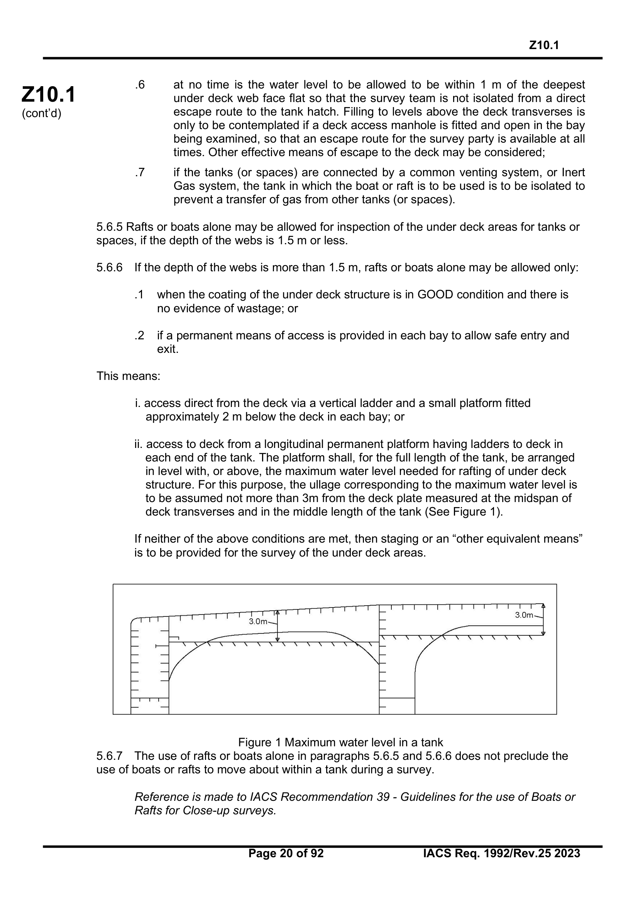
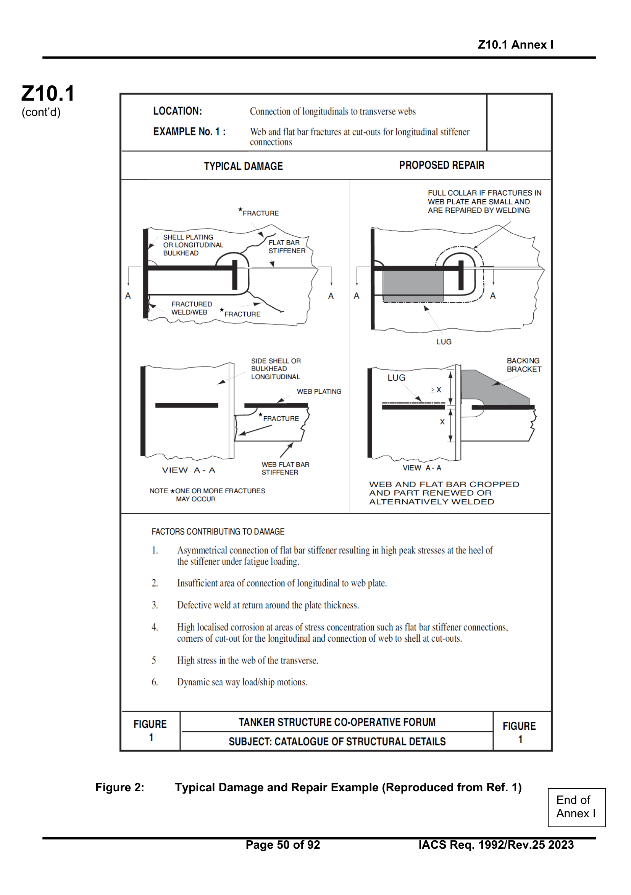
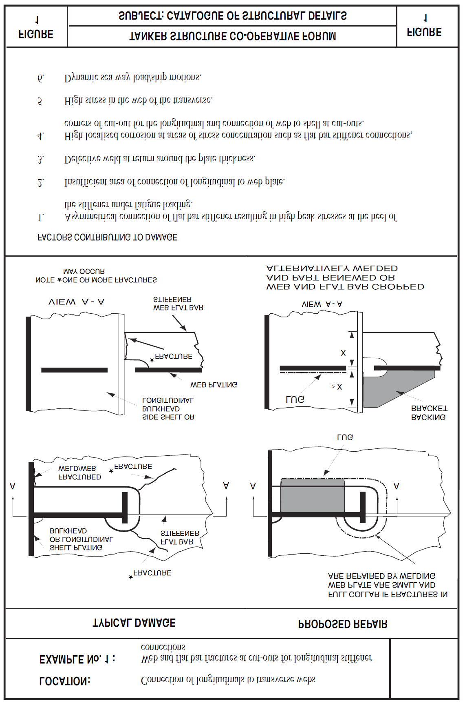
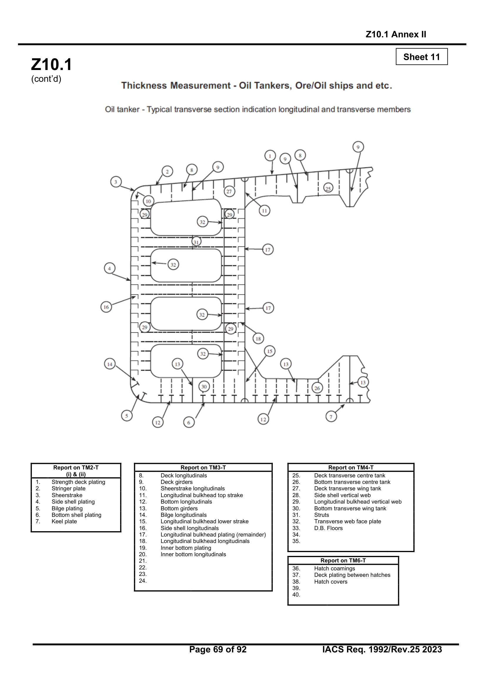
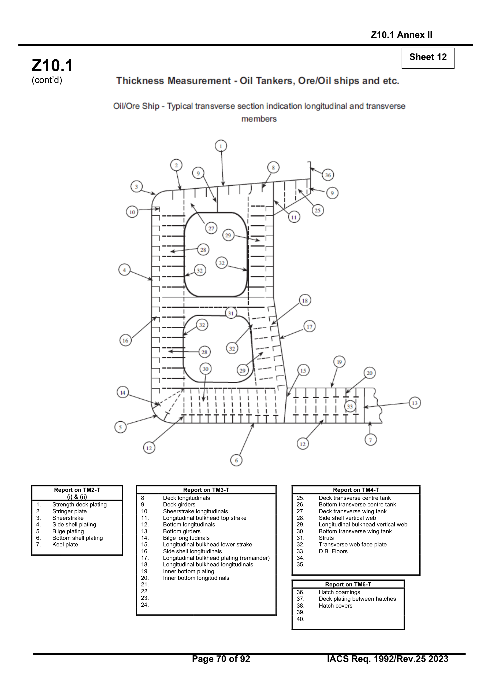
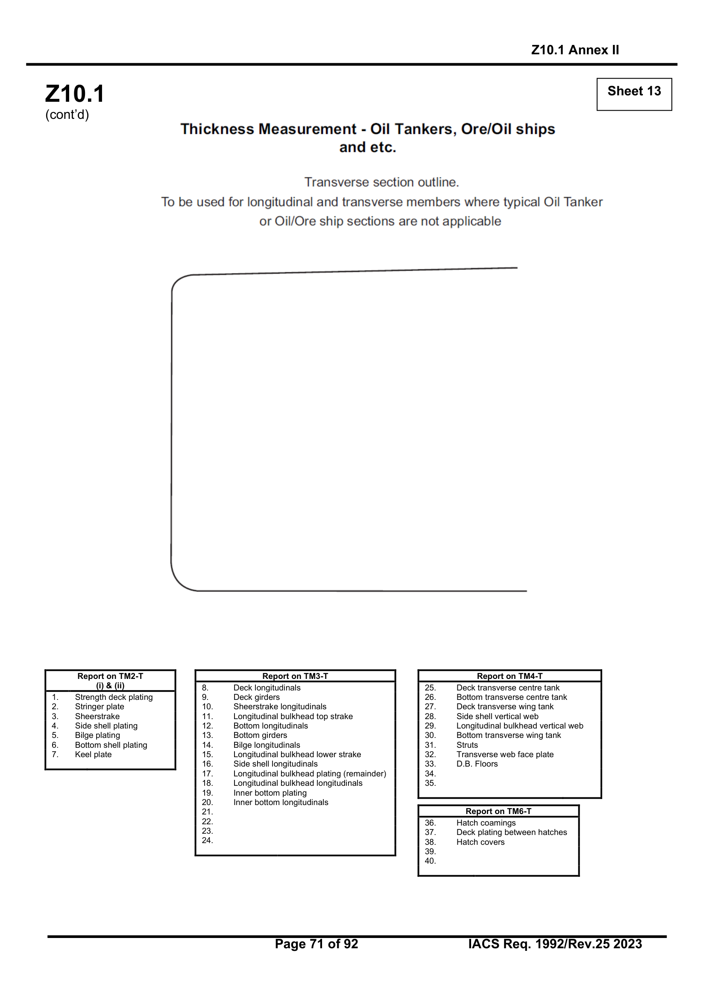
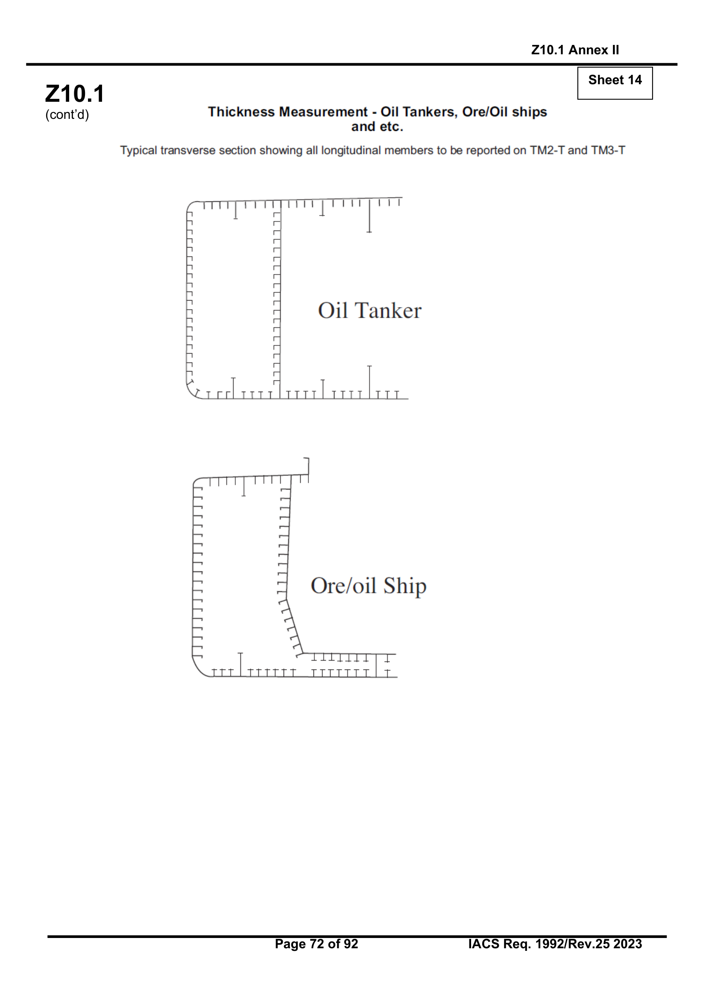
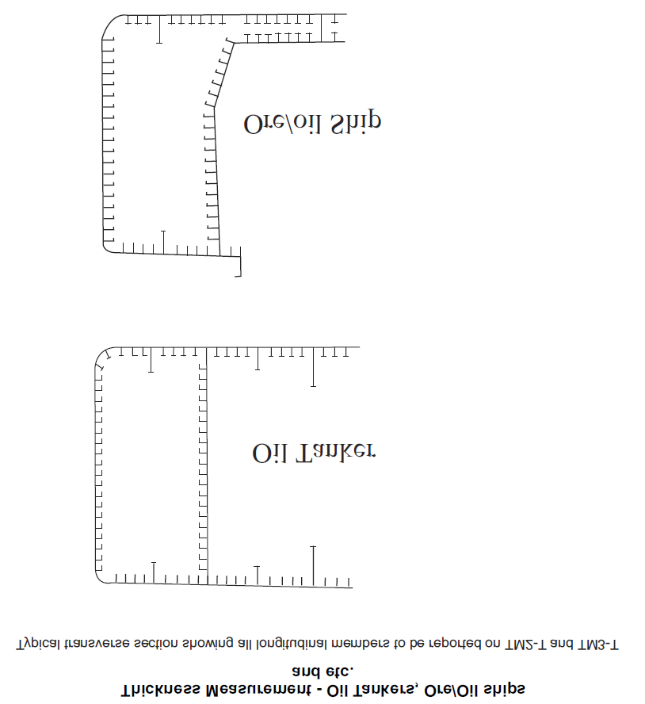
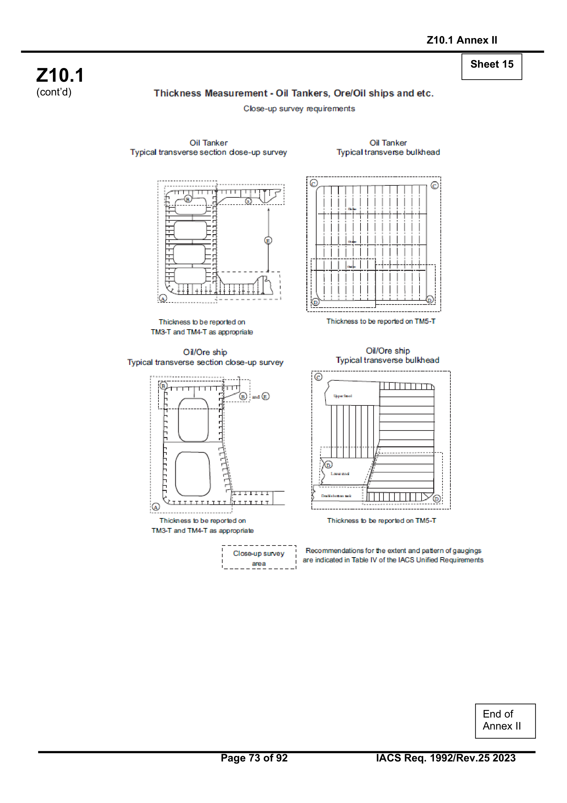
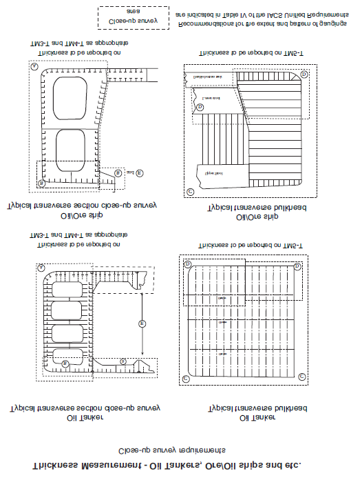

# Z10.1 Hull Surveys of Oil Tankers

(1992)
(Rev.1 1994)
(Rev. 2 1994)
(Rev. 3 1995)
(Rev. 4 1996)
Rev 5 1997)
(Rev. 6 July 1999)
(Rev.6.1 Dec. 1999)
(Rev.7 Sept.2000)
(Rev.8 Nov. 2000)
(Rev.8.1 June 2001)
(Rev.9 Mar. 2002)
(Rev.10 Oct.2002)
(Rev.11 August 2003)
(Rev.12 June 2005)
(Rev.13 Jan. 2006)
(Corr.1 Sept 2006)
(Rev.14 Feb 2007)
(Rev.15 Nov 2007)
(Rev.16 Mar 2009)
(Rev.17 Feb 2010)
(Rev.18 Mar 2011)
(Rev.19 July 2011)
(Rev.20 May 2013)
(Rev.21 Jan 2014)
(Rev.22 Feb 2015)
(Rev.23 Jan 2018)
(Rev.24 May 2019)
(Rev.25 Feb 2023)

## CONTENTS

### 1. General
1.1 Application
1.2 Definitions
1.3 Repairs
1.4 Thickness measurements and close-up surveys

### 2. Special Survey
2.1 Schedule
2.2 Scope
2.2.1 General
2.2.2 Dry Dock Survey
2.2.3 Tank Protection
2.3 Extent of Overall and Close-up Survey
2.4 Extent of Thickness Measurement
2.5 Extent of Tank Testing

### 3. Annual Survey
3.1 Schedule
3.2 Scope
3.2.1 General
3.2.2 Examination of the Hull
3.2.3 Examination of Weather decks
3.2.4 Examination of Cargo pump rooms
3.2.5 Examination of Ballast Tanks

### 4. Intermediate Survey
4.1 Schedule
4.2 Scope
4.2.1 General
4.2.2 Oil Tankers 5 - 10 years of Age
4.2.3 Oil Tankers 10 - 15 years of Age
4.2.4 Oil Tankers Exceeding 15 years of Age

### 5. Preparation for Survey
5.1 Survey Programme
5.2 Conditions for Survey
5.3 Access to Structures
5.4 Equipment for Survey
5.5 Rescue and emergency response equipment
5.6 Survey at Sea or at Anchorage
5.7 Survey Planning Meeting

### 6. Documentation On Board
6.1 General
6.2 Survey Report File
6.3 Supporting Documents
6.4 Review of Documentation On Board

### 7. Procedures for Thickness Measurements
7.1 General
7.2 Certification of Thickness Measurement Firm
7.3 Reporting

### 8. Reporting and Evaluation of Survey
8.1 Evaluation of Survey Report
8.2 Reporting

---
Page 1 of 92 | IACS Req. 1992/Rev.25 2023

---

## ENCLOSURES

| Table | Title |
| :--- | :--- |
| Table I: | Minimum requirements to Close-up Surveys at Special Survey of Oil Tankers, Ore/Oil Ships and etc. |
| Table II: | Minimum requirements to thickness measurements at Special Survey of Oil Tankers, Ore/Oil Ships and etc. |
| Table III: | Minimum requirements to tank testing at Special Survey of Oil Tankers, Ore/Oil Ships etc. |
| Table IV: | Requirements for extent of thickness measurements at those areas of substantial corrosion. |
| Table V: | Owners Inspection Report |
| Table VI: | Superseded by Annex 1 |
| Table VII: | Procedures for Certification of Firms Engaged in Thickness Gauging of Hull Structures |
| Table VIII: | Survey Reporting Principles |
| Table IX: | Executive Hull Summary |

| Annex | Title |
| :--- | :--- |
| Annex I: | Guidelines for Technical Assessment in conjunction with planning for Enhanced Surveys of Oil Tankers Special Survey - Hull |
| Annex II: | Recommended Procedures for Thickness Measurements of Oil Tankers Ore/Oil Ships and etc. |
| Annex III: | Criteria for Longitudinal Strength of Hull Girder for Oil Tankers |
| | Appendix 1: Calculation criteria of section modulus of midship section of hull girder |
| | Appendix II: Diminution limit of minimum longitudinal strength of ships in service |
| | Appendix III: Sampling method of thickness measurements for longitudinal strength evaluation and repair methods |
| Annex IVA: | Survey Programme |
| | Appendix 1 List of Plans |
| | Appendix 2 Survey Planning Questionnaire |
| | Appendix 3 Other Documentation |
| Annex IVB: | Survey Planning Questionnaire |

---
Page 3 of 92 | IACS Req. 1992/Rev.25 2023

---

### Notes:

1. Revision 4, 1996 of Unified Requirements Z10.1 have been approved by Council for uniform application from 1 January 1997.

2. Changes introduced in Rev.6 to UR Z10.1 are to be applied by all Member Societies and Associates from 1 September 1999.

3. Changes introduced in Rev.6.1 to UR Z10.1, i.e. 2.2.1.3 are to be applied by all Member Societies and Associates from 1 July 2000.

4. Changes introduced in Rev.7 to UR Z10.1 are to be applied by all Member Societies and Associates from 1 July 2001.

5. Changes introduced in Rev.8 and Rev.8.1 to UR Z10.1 are to be applied by all Member Societies and Associates from 1 July 2001.

6. Changes introduced in Rev.9 to UR Z10.1, which come from Res MSC.105(73) and MSC.108(73), i.e. 4.2.4.3(dry-dock in intermediate survey for ships over 15 years), 8(evaluation of longitudinal strength), Table VIII, Table IX(ii), Table (IX(v) and Annex III, are to be applied by all Member Societies and Associates from 1 July 2002.

   Changes introduced in Rev.9 to UR Z10.1, other than the above, are to be implemented by all Member Societies and Associates within one year of the adoption by Council.

7. Changes introduced in Rev.12 are to be uniformly implemented from **1 July 2006**. The amendments to paragraphs 2.2.3.1 and 4.2.2.2 related to the protective coating condition are to apply to the ballast tanks of which the coating condition will be assessed at the forthcoming Special Survey and Intermediate Survey on or after 1 July 2006.

8. Changes introduced in Rev.13 (para. 1.4, 5.5.4, 5.5.6 and 7.1.3) are to be uniformly applied by IACS Societies on surveys commenced on or after 1 January 2007.

9. Changes introduced in Rev.14 are to be uniformly implemented for surveys commenced on or after 1 January 2008, whereas statutory requirements of IMO Res. MSC 197(80) apply on 1 January 2007.

10. Changes introduced in Rev.15 are to be uniformly applied by IACS Societies for surveys commenced on or after the 1 January 2009.

11. Changes introduced in Rev.16 are to be uniformly applied by IACS Societies for surveys commenced on or after 1 July 2010.

    As for the requirements regarding semi-hard coatings, these coatings, if already applied, will not be accepted from the next special or intermediate survey commenced on or after 1 July 2010, whichever comes first, with respect to waiving the annual internal examination of the ballast tanks.

12. Changes introduced in Rev.18 are to be uniformly applied by IACS Societies for surveys commenced on or after 1 July 2012.

13. Changes introduced in Rev.19 are to be uniformly applied by IACS Societies for surveys commenced on or after 1 July 2012.

14. Changes introduced in Rev.20 are to be uniformly applied by IACS Societies for surveys commenced on or after 1 July 2014.

15. Changes introduced in Rev.21 are to be uniformly applied by IACS Societies for surveys commenced on or after 1 January 2015.

16. Changes introduced in Rev.22 are to be uniformly applied by IACS Societies for surveys commenced on or after 1 July 2016.

17. Changes introduced in Rev.23 are to be uniformly applied by IACS Societies for surveys commenced on or after 1 January 2019.

18. Changes introduced in Rev.24 are to be uniformly applied by IACS Societies for surveys commenced on or after 1 July 2020.

19. Changes introduced in Rev.25 are to be uniformly applied by IACS Societies for surveys commenced on or after 1 July 2024.

---
Page 4 & 5 of 92 | IACS Req. 1992/Rev.25 2023

---

## 1. GENERAL

### 1.1 Application

1.1.1 The requirements apply to all self-propelled Oil Tankers other than Double Hull Oil Tankers, as defined in 1.1.1 of UR Z 10.4.

1.1.2 The requirements apply to surveys of hull structure and piping systems in way of cargo tanks, pump rooms, cofferdams, pipe tunnels, void spaces within the cargo area and all ballast tanks. The requirements are additional to the classification requirements applicable to the remainder of the ship. Refer to Z7.

1.1.3 The requirements contain the minimum extent of examination, thickness measurements and tank testing. The survey is to be extended when Substantial Corrosion and/or structural defects are found and include additional Close-up Survey when necessary.

### 1.2 Definitions

1.2.1 **Oil Tanker:** An Oil Tanker is a ship which is constructed primarily to carry oil in bulk in cargo tanks forming an integral part of the ship's hull, including ship types such as combination carriers (Ore/Oil ships etc.) but excluding ships carrying oil in independent tanks not part of the ship's hull such as asphalt carriers.

1.2.2 **Ballast Tank:** A Ballast Tank is a tank which is used primarily for the carriage of salt water ballast.

1.2.2 bis **A Combined Cargo/Ballast Tank** is a tank which is used for the carriage of cargo or ballast water as a routine part of the vessel's operation and will be treated as a Ballast Tank. Cargo tanks in which water ballast might be carried only in exceptional cases per MARPOL I/18(3) are to be treated as cargo tanks.

1.2.3 **Overall Survey:** An Overall Survey is a survey intended to report on the overall condition of the hull structure and determine the extent of additional Close-up Surveys.

1.2.4 **Close-up Survey:** A Close-up Survey is a survey where the details of structural components are within the close visual inspection range of the surveyor, i.e. normally within reach of hand.

1.2.5 **Transverse Section:** A Transverse Section includes all longitudinal members such as plating, longitudinals and girders at the deck, side, bottom, inner bottom and longitudinal bulkheads. For transversely framed vessels, a transverse section includes adjacent frames and their end connections in way of transverse sections.

1.2.6 **Representative Tank:** Representative Tanks are those which are expected to reflect the condition of other tanks of similar type and service and with similar corrosion prevention systems. When selecting Representative Tanks account is to be taken of the service and repair history onboard and identifiable Critical Structural Areas and/or Suspect Areas.

1.2.7 **Suspect Area:** Suspect Areas are locations showing Substantial Corrosion and/or are considered by the Surveyor to be prone to rapid wastage.

1.2.8 **Critical Structural Area:** Critical Structural Areas are locations which have been identified from calculations to require monitoring or from the service history of the subject ship or from similar or sister ships (if available) to be sensitive to cracking, buckling or corrosion which would impair the structural integrity of the ship.

1.2.9 **Substantial Corrosion:** Substantial Corrosion is an extent of corrosion such that assessment of corrosion pattern indicate a wastage in excess of $75\%$ of allowable margins, but within acceptable limits.

1.2.10 **Corrosion Prevention System:** A Corrosion Prevention System is normally considered a full hard protective coating.

Hard Protective Coating is usually to be epoxy coating or equivalent. Other coating systems, which are neither soft nor semi-hard coatings, may be considered acceptable as alternatives provided that they are applied and maintained in compliance with the manufacturer's specifications.

1.2.11 **Coating Condition:** Coating condition is defined as follows:

*   **GOOD** condition with only minor spot rusting.
*   **FAIR** condition with local breakdown at edges of stiffeners and weld connections and/or light rusting over $20\%$ or more of areas under consideration, but less than as defined for POOR condition
*   **POOR** condition with general breakdown of coating over $20\%$ or more, or hard scale at $10\%$ or more, of areas under consideration.

Reference is made to IACS Recommendation No.87 "Guidelines for Coating Maintenance & Repairs for Ballast Tanks and Combined Cargo / Ballast Tanks on Oil Tankers".

1.2.12 **Cargo Area:** Cargo Area is that part of the ship which contains cargo tanks, slop tanks and cargo/ballast pump-rooms, cofferdams, ballast tanks and void spaces adjacent to cargo tanks and also deck areas throughout the entire length and breadth of the part of the ship over the above mentioned spaces.

1.2.13 **Special consideration:** Special consideration or specially considered (in connection with close-up surveys and thickness measurements) means sufficient close-up inspection and thickness measurements are to be taken to confirm the actual average condition of the structure under the coating.

1.2.14 **Prompt and Thorough Repair:** A Prompt and Thorough Repair is a permanent repair completed at the time of survey to the satisfaction of the Surveyor, therein removing the need for the imposition of any associated condition of class.

### 1.3 Repairs

1.3.1 Any damage in association with wastage over the allowable limits (including buckling, grooving, detachment or fracture), or extensive areas of wastage over the allowable limits, which affects or, in the opinion of the Surveyor, will affect the vessel's structural, watertight or weathertight integrity, is to be **promptly and thoroughly** (see 1.2.14) repaired. Areas to be considered include:

*   bottom structure and bottom plating;
*   side structure and side plating;
*   deck structure and deck plating;
*   watertight or oiltight bulkheads;
*   hatch covers or hatch coamings, where fitted (combination carriers).

For locations where adequate repair facilities are not available, consideration may be given to allow the vessel to proceed directly to a repair facility. This may require discharging the cargo and/or temporary repairs for the intended voyage.

1.3.2 Additionally, when a survey results in the identification of structural defects or corrosion, either of which, in the opinion of the Surveyor, will impair the vessel's fitness for continued service, remedial measures are to be implemented before the ship continues in service.

1.3.3 Where the damage found on structure mentioned in Para. 1.3.1 is isolated and of a localised nature which does not affect the ship's structural integrity, consideration may be given by the surveyor to allow an appropriate temporary repair to restore watertight or weather tight integrity and impose a condition of class in accordance with IACS PR 35, with a specific time limit.

### 1.4 Thickness measurements and close-up surveys

In any kind of survey, i.e. special, intermediate, annual or other surveys having the scope of the foregoing ones, thickness measurements, when required by Table II, of structures in areas where close-up surveys are required shall be carried out simultaneously with close-up surveys.

---
Page 6 - 8 of 92 | IACS Req. 1992/Rev.25 2023

---

## 2. SPECIAL SURVEY[^1]

### 2.1 Schedule

2.1.1 Special Surveys are to be carried out at 5 years intervals to renew the Classification Certificate.

2.1.2 The first Special Survey is to be completed within 5 years from the date of the initial classification survey and thereafter within 5 years from the credited date of the previous Special Survey. However, an extension of class of 3 months maximum beyond the 5th year can be granted in exceptional circumstances. In this case, the next period of class will start from the expiry date of the Special Survey before the extension was granted.

2.1.3 For surveys completed within 3 months before the expiry date of the Special Survey, the next period of class will start from the expiry date of the Special Survey. For surveys completed more than 3 months before the expiry date of the Special Survey, the period of class will start from the survey completion date. In cases where the vessel has been laid up or has been out of service for a considerable period because of a major repair or modification and the owner elects to only carry out the overdue surveys, the next period of class will start from the expiry date of the special survey. If the owner elects to carry out the next due special survey, the period of class will start from the survey completion date.

2.1.4 The Special Survey may be commenced at the 4th Annual Survey and be progressed with a view to completion by the 5th anniversary date. When the Special Survey is commenced prior to the 4th Annual Survey, the entire survey is to be completed within 15 months if such work is to be credited to the Special Survey.

2.1.5 Concurrent crediting to both Intermediate Survey (IS) and Special Survey (SS) for surveys and thickness measurements of spaces are not acceptable.

### 2.2 Scope

#### 2.2.1 General

2.2.1.1 The Special Survey is to include, in addition to the requirements of the Annual Survey, examination, tests and checks of sufficient extent to ensure that the hull and related piping, as required in 2.2.1.3, is in a satisfactory condition and is fit for its intended purpose for the new period of class of 5 years to be assigned, subject to proper maintenance and operation and to periodical surveys being carried out at the due dates.

2.2.1.2 All cargo tanks, Ballast Tanks, including double bottom tanks, pumprooms, pipe tunnels, cofferdams and void spaces bounding cargo tanks, decks and outer hull are to be examined, and this examination is to be supplemented by thickness measurement and testing required in 2.4 and 2.5, to ensure that the structural integrity remains effective. The aim of the examination is to discover Substantial Corrosion, significant deformation, fractures, damages or other structural deterioration, that may be present.

2.2.1.3 Cargo piping on deck, including Crude Oil Washing (COW) piping, Cargo and Ballast piping within the above tanks and spaces are to be examined and operationally tested to working pressure to attending Surveyor's satisfaction to ensure that tightness and condition remain satisfactory. Special attention is to be given to any ballast piping in cargo tanks and cargo piping in ballast tanks and void spaces, and Surveyors are to be advised on all occasions when this piping, including valves and fittings are open during repair periods and can be examined internally.

#### 2.2.2 Dry Dock Survey

2.2.2.1 A survey in dry dock is to be a part of the Special Survey. The overall and close-up surveys and thickness measurements, as applicable, of the lower portions of the cargo tanks and ballast tanks are to be carried out in accordance with the applicable requirements for special surveys, if not already performed.

**Note:** Lower portions of the cargo and ballast tanks are considered to be the parts below light ballast water line.

#### 2.2.3 Tank Protection

2.2.3.1 Where provided, the condition of the corrosion prevention system of cargo tanks is to be examined.

A Ballast Tank is to be examined at subsequent annual intervals where:

a. a **hard** protective coating has not been applied from the time of construction, or
b. a soft or semi-hard coating has been applied, or
c. substantial corrosion is found within the tank, or
d. the **hard** protective coating is found to be in less than GOOD condition and the **hard** protective coating is not repaired to the satisfaction of the Surveyor.

Thickness measurements are to be carried out as deemed necessary by the surveyor.

### 2.3 Extent of Overall and Close-up Survey

2.3.1 An Overall Survey of all tanks and spaces is to be carried out at each Special Survey.

2.3.2 The minimum requirements for Close-up Surveys at Special Survey are given in Table I.

2.3.3 The Surveyor may extend the Close-up Survey as deemed necessary taking into account the maintenance of the tanks under survey, the condition of the corrosion prevention system and also in the following cases:

a) In particular, tanks having structural arrangements or details which have suffered defects in similar tanks or on similar ships according to available information.
b) In tanks which have structures approved with reduced scantlings due to an approved corrosion control system.

2.3.4 For areas in tanks where hard protective coatings are found to be in a GOOD condition as defined in 1.2.11, the extent of Close-up Surveys according to Table I may be specially considered.

### 2.4 Extent of Thickness Measurement

2.4.1 The minimum requirements for thickness measurements at Special Survey are given in Table II.

2.4.2 Provisions for extended measurements for areas with Substantial Corrosion are given in Table IV, and as may be additionally specified in the Survey Programme as required by 5.1. These extended thickness measurements are to be carried out before the survey is credited as completed. Suspect Areas identified at previous surveys are to be examined. Areas of substantial corrosion identified at previous surveys are to have thickness measurements taken.

2.4.3 The Surveyor may further extend the thickness measurements as deemed necessary.

2.4.4 For areas in tanks where hard protective coating are found to be in a GOOD condition as defined in 1.2.11, the extent of thickness measurements according to Table II may be specially considered.

2.4.5 Transverse sections are to be chosen where the largest reductions are suspected to occur or are revealed from deck plating measurements.

2.4.6 In cases where two or three sections are to be measured, at least one is to include a Ballast Tank within 0.5L amidships.

In case of oil tankers of $130\text{m}$ in length and upwards (as defined in the International Convention on Load Lines in force) and more than 10 years of age, for the evaluation of the ship's longitudinal strength as required in 8.1.1.1, the sampling method of thickness measurements is given in Annex III Appendix 3.

### 2.5 Extent of Tank Testing

2.5.1 The minimum requirements for ballast tank testing at Special Survey are given in 2.5.3 and Table III.

The minimum requirements for cargo tank testing at Special Survey are given in 2.5.4 and Table III.

Cargo tank testing carried out by the ship's crew under the direction of the Master may be accepted by the surveyor provided the following conditions are complied with:

a) a tank testing procedure, specifying fill heights, tanks being filled and bulkheads being tested, has been submitted by the owner and reviewed by the Society prior to the testing being carried out;
b) the tank testing is carried out prior to overall survey or close-up survey;
c) the tank testing is carried out within the special survey window and not more than 3 months prior to the date on which the overall or close up survey is completed;
d) the tank testing has been satisfactorily carried out and there is no record of leakage, distortion or substantial corrosion that would affect the structural integrity of the tank;
e) the satisfactory results of the testing is recorded in the vessel's logbook; and
f) the internal and external condition of the tanks and associated structure are found satisfactory by the surveyor at the time of the overall and close up survey.

2.5.2 The Surveyor may extend the tank testing as deemed necessary.

2.5.3 Boundaries of ballast tanks are to be tested with a head of liquid to the top of air pipes.

2.5.4 Boundaries of cargo tanks are to be tested to the highest point that liquid will rise under service conditions.

---
Page 9 - 12 of 92 | IACS Req. 1992/Rev.25 2023

---

## 3. ANNUAL SURVEY

### 3.1 Schedule

3.1.1 Annual Surveys are to be held within 3 months before or after anniversary date from the date of the initial classification survey or of the date credited for the last Special Survey.

### 3.2 Scope

#### 3.2.1 General

3.2.1.1 The survey is to consist of an examination for the purpose of ensuring, as far as practicable, that the hull and piping are maintained in a satisfactory condition and should take into account the service history, condition and extent of the corrosion prevention system of ballast tanks and areas identified in the survey report file.

#### 3.2.2 Examination of the Hull

3.2.2.1 Examination of the hull plating and its closing appliances as far as can be seen.

3.2.2.2 Examination of watertight penetrations as far as practicable.

#### 3.2.3 Examination of weather decks

3.2.3.1 Examination of cargo tank openings including gaskets, covers, coamings and flame screens.

3.2.3.2 Examination of cargo tanks pressure/vacuum valves and flame screens.

3.2.3.3 Examination of flame screens on vents to all bunker tanks.

3.2.3.4 Examination of cargo, crude oil washing, bunker and vent piping systems, including vent masts and headers.

#### 3.2.4 Examination of Cargo pump rooms and pipe tunnels if fitted.

3.2.4.1 Examination of all pumproom bulkheads for signs of oil leakage or fractures and, in particular, the sealing arrangements of all penetrations of pumproom bulkheads.

3.2.4.2 Examination of the condition of all piping systems.

#### 3.2.5 Examination of Ballast Tanks

3.2.5.1 Examination of Ballast Tanks where required as a consequence of the results of the Special Survey (see 2.2.3) and Intermediate Survey (see 4.2.2.1 and 4.2.2.2) is to be carried out. When considered necessary by the surveyor, or when extensive corrosion exists, thickness measurements are to be carried out and if the results of these thickness measurements indicate that Substantial Corrosion is found, the extent of thickness measurements is to be increased in accordance with Table IV. These extended thickness measurements are to be carried out before the survey is credited as completed. Suspect Areas identified at previous surveys are to be examined. Areas of substantial corrosion identified at previous surveys are to have thickness measurements taken.

---
Page 13 of 92 | IACS Req. 1992/Rev.25 2023

---

## 4. INTERMEDIATE SURVEY

### 4.1 Schedule

4.1.1 The Intermediate Survey is to be held at or between either the 2nd or 3rd Annual Survey.

4.1.2 Those items which are additional to the requirements of the Annual Surveys may be surveyed either at or between the 2nd and 3rd Annual Survey.

4.1.3 Concurrent crediting to both Intermediate Survey (IS) and Special Survey (SS) for surveys and thickness measurements of spaces are not acceptable.

### 4.2 Scope

#### 4.2.1 General

4.2.1.1 The survey extent is dependent on the age of the vessel as specified in 4.2.2 to 4.2.4.

4.2.1.2 For weather decks, an examination as far as applicable of cargo, crude oil washing, bunker, ballast, steam and vent piping systems as well as vent masts and headers is to be carried out. If upon examination there is any doubt as to the condition of the piping, the piping may be required to be pressure tested, thickness measured or both.

#### 4.2.2 Oil Tankers 5 – 10 Years of Age, the following is to apply:

4.2.2.1 All Ballast Tanks are to be examined. When considered necessary by the surveyor, thickness measurement and testing are to be carried out to ensure that the structural integrity remains effective.

4.2.2.2 A Ballast Tank is to be examined at subsequent annual intervals where:

a. a **hard** protective coating has not been applied from the time of construction, or
b. a soft or semi-hard coating has been applied, or
c. substantial corrosion is found within the tank, or
d. the **hard** protective coating is found to be in less than GOOD condition and the **hard** protective coating is not repaired to the satisfaction of the Surveyor.

4.2.2.3 In addition to the requirements above, suspect areas identified at previous surveys are to be examined.

#### 4.2.3 Oil Tankers 10 - 15 years of Age, the following is to apply:

4.2.3.1 The requirements of the Intermediate Survey are to be to the same extent as the previous Special Survey as required in 2 and 5.1. However, pressure testing of cargo and ballast tanks **and the requirements for longitudinal strength evaluation of Hull Girder as required in 8.1.1.1 are** not required unless deemed necessary by the attending Surveyor.

4.2.3.2 In application of 4.2.3.1, the intermediate survey may be commenced at the second annual survey and be progressed during the succeeding year with a view to completion at the third annual survey in lieu of the application of 2.1.4.

4.2.3.3 In application of 4.2.3.1, an under water survey may be considered in lieu of the requirements of 2.2.2.

#### 4.2.4 Oil Tankers over 15 years of Age, the following is to apply:

4.2.4.1 The requirements of the Intermediate Survey are to be to the same extent as the previous Special Survey as required in 2 and 5.1. However, pressure testing of cargo and ballast tanks **and the requirements for longitudinal strength evaluation of Hull Girder as required in 8.1.1.1 are** not required unless deemed necessary by the attending Surveyor.

4.2.4.2 In application of 4.2.4.1, the intermediate survey may be commenced at the second annual survey and be progressed during the succeeding year with a view to completion at the third annual survey in lieu of the application of 2.1.4.

4.2.4.3 In application of 4.2.4.1, a survey in dry dock is to be part of the intermediate survey. The overall and close-up surveys and thickness measurements, as applicable, of the lower portions of the cargo tanks and water ballast tanks are to be carried out in accordance with the applicable requirements for intermediate surveys, if not already performed.

**Note:** Lower portions of the cargo and ballast tanks are considered to be the parts below light ballast water line.

---
Page 14 - 15 of 92 | IACS Req. 1992/Rev.25 2023

---

## 5. PREPARATIONS FOR SURVEY

### 5.1 Survey Programme

5.1.1 The Owner in co-operation with the Classification Society is to work out a specific Survey Programme prior to the commencement of any part of:

*   the Special Survey
*   the Intermediate Survey for oil tanker over **10** years of age

The Survey Programme is to be in a written format, based on the information in Annex IVA. The survey is not to commence until the survey programme has been agreed. The Survey Programme at Intermediate Survey may consist of the Survey Programme at the previous Special Survey supplemented by the Executive Hull Summary of that Special Survey and later relevant survey reports.

5.1.1.1 Prior to the development of the survey programme, the survey planning questionnaire is to be completed by the owner based on the information set out in Annex IVB, and forwarded to the Classification Society.

The Survey Programme is to be worked out taking into account any amendments to the survey requirements implemented after the last Special Survey carried out.

5.1.2 In developing the survey programme, the following documentation is to be collected and consulted with a view to selecting tanks, areas, and structural elements to be examined:

.1 survey status and basic ship information;
.2 documentation on board, as described in 6.2 and 6.3;
.3 main structural plans of cargo and ballast tanks (scantlings drawings), including information regarding use of high-tensile steels (HTS);
.4 Executive Hull Summary;
.5 relevant previous damage and repair history;
.6 relevant previous survey and inspection reports from both the recognized organization and the owner;
.7 cargo and ballast history for the last 3 years, including carriage of cargo under heated conditions;
.8 details of the inert gas plant and tank cleaning procedures;
.9 information and other relevant data regarding conversion or modification of the ship's cargo and ballast tanks since the time of construction;
.10 description and history of the coating and corrosion protection system (including previous class notations), if any;
.11 inspections by the Owner's personnel during the last 3 years with reference to structural deterioration in general, leakages in tank boundaries and piping and condition of the coating and corrosion protection system if any. Guidance for reporting is shown in Table V;
.12 information regarding the relevant maintenance level during operation including port state control reports of inspection containing hull related deficiencies, Safety Management System non-conformities relating to hull maintenance, including the associated corrective action(s); and
.13 any other information that will help identify suspect areas and critical structural areas

5.1.3 The submitted survey programme is to account for and comply, as a minimum, with the requirements of Tables I, II and III for close-up survey, thickness measurement and tank testing, respectively, and is to include relevant information including at least:

.1 basic ship information and particulars;
.2 main structural plans of cargo and ballast tanks (scantling drawings), including information regarding use of high tensile steels (HTS);
.3 arrangement of tanks;
.4 list of tanks with information on their use, extent of coatings and corrosion protection systems;
.5 conditions for survey (e.g., information regarding tank cleaning, gas freeing, ventilation, lighting, etc.);
.6 provisions and methods for access to structures;
.7 equipment for surveys;
.8 identification of tanks and areas for close-up survey (see 2.3);
.9 identification of areas and sections for thickness measurement (see 2.4);
.10 identification of tanks for tank testing (see 2.5);
.11 identification of the thickness measurement firm;
.12 damage experience related to the ship in question; and
.13 critical structural areas and suspect areas, where relevant.

5.1.4 The Classification Society will advise the Owner of the maximum acceptable structural corrosion diminution levels applicable to the vessel.

5.1.5 Use may also be made of the Guidelines for Technical Assessment in Conjunction with Planning for Enhanced Surveys of Oil Tankers Special Survey - Hull, contained in Annex I. These guidelines are a recommended tool which may be invoked at the discretion of the Classification Society, when considered necessary and appropriate, in conjunction with the preparation of the required Survey Programme.

### 5.2 Conditions For Survey

5.2.1 The Owner is to provide the necessary facilities for a safe execution of the survey.

5.2.1.1 In order to enable the attending surveyors to carry out the survey, provisions for proper and safe access are to be agreed between the owner and the Classification Society and are to be in accordance with IACS PR 37.

5.2.1.2 Details of the means of access are to be provided in the survey planning questionnaire.

5.2.1.3 In cases where the provisions of safety and required access are judged by the attending surveyors not to be adequate, the survey of the spaces involved is not to proceed.

5.2.2 Tanks and spaces are to be safe for access. Tanks and spaces are to be gas free and properly ventilated. Prior to entering a tank, void or enclosed space, it is to be verified that the atmosphere in that space is free from hazardous gas and contains sufficient oxygen.

5.2.3 In preparation for survey and thickness measurements and to allow for a thorough examination, all spaces are to be cleaned including removal from surfaces of all loose accumulated corrosion scale. Spaces are to be sufficiently clean and free from water, scale, dirt, oil residues etc. to reveal corrosion, deformation, fractures, damages, or other structural deterioration as well as the condition of the coating. However, those areas of structure whose renewal has already been decided by the owner need only be cleaned and descaled to the extent necessary to determine the limits of the areas to be renewed.

5.2.4 Sufficient illumination is to be provided to reveal corrosion, deformation, fractures, damages or other structural deterioration.

5.2.5 Where Soft or Semi-hard Coatings have been applied, safe access is to be provided for the surveyor to verify the effectiveness of the coating and to carry out an assessment of the conditions of internal structures which may include spot removal of the coating. When safe access cannot be provided, the soft or semi-hard coating is to be removed.

### 5.3 Access to Structures

5.3.1 For overall survey, means are to be provided to enable the surveyor to examine the hull structure in a safe and practical way.

5.3.2 For close-up survey, one or more of the following means for access, acceptable to the Surveyor, is to be provided:

*   permanent staging and passages through structures
*   temporary staging and passages through structures
*   hydraulic arm vehicles such as conventional cherry pickers, lifts and movable platforms
*   boats or rafts
*   portable ladders
*   other equivalent means

### 5.4 Equipment for Survey

5.4.1 Thickness measurement is normally to be carried out by means of ultrasonic test equipment. The accuracy of the equipment is to be proven to the Surveyor as required.

5.4.2 One or more of the following fracture detection procedures may be required if deemed necessary by the Surveyor:

*   radiographic equipment
*   ultrasonic equipment
*   magnetic particle equipment
*   dye penetrant.

5.4.3 Explosimeter, oxygen-meter, breathing apparatus, lifelines, riding belts with rope and hook and whistles together with instructions and guidance on their use are to be made available during the survey. A safety check-list is to be provided.

5.4.4 Adequate and safe lighting is to be provided for the safe and efficient conduct of the survey.

5.4.5 Adequate protective clothing is to be made available and used (e.g. safety helmet, gloves, safety shoes, etc) during the survey.

### 5.5 Rescue and emergency response equipment

If breathing apparatus and/or other equipment is used as 'Rescue and emergency response equipment' then it is recommended that the equipment should be suitable for the configuration of the space being surveyed.

### 5.6 Survey at Sea or at Anchorage

5.6.1 Survey at sea or at anchorage may be accepted provided the Surveyor is given the necessary assistance from the personnel onboard. Necessary precautions and procedures for carrying out the survey are to be in accordance with 5.1, 5.2, 5.3 and 5.4.

5.6.2 A communication system is to be arranged between the survey party in the tank and the responsible officer on deck. This system is also to include the personnel in charge of Ballast pump handling if boats or rafts are used.

5.6.3 Surveys of tanks by means of boats or rafts may only be undertaken with the agreement of the Surveyor, who is to take into account the safety arrangements provided, including weather forecasting and ship response under foreseeable conditions and provided the expected rise of water within the tank does not exceed $0.25\text{m}$.

5.6.4 When rafts or boats will be used for close-up survey the following conditions are to be observed:

.1 only rough duty, inflatable rafts or boats, having satisfactory residual buoyancy and stability even if one chamber is ruptured, are to be used;
.2 the boat or raft is to be tethered to the access ladder and an additional person is to be stationed down the access ladder with a clear view of the boat or raft;
.3 appropriate lifejackets are to be available for all participants;
.4 the surface of water in the tank is to be calm (under all foreseeable conditions the expected rise of water within the tank is to not exceed $0.25\text{ m}$) and the water level stationary. On no account is the level of the water to be rising while the boat or raft is in use;
.5 the tank or space must contain clean ballast water only. Even a thin sheen of oil on the water is not acceptable;
.6 at no time is the water level to be allowed to be within $1\text{ m}$ of the deepest under deck web face flat so that the survey team is not isolated from a direct escape route to the tank hatch. Filling to levels above the deck transverses is only to be contemplated if a deck access manhole is fitted and open in the bay being examined, so that an escape route for the survey party is available at all times. Other effective means of escape to the deck may be considered;
.7 if the tanks (or spaces) are connected by a common venting system, or Inert Gas system, the tank in which the boat or raft is to be used is to be isolated to prevent a transfer of gas from other tanks (or spaces).

5.6.5 Rafts or boats alone may be allowed for inspection of the under deck areas for tanks or spaces, if the depth of the webs is $1.5\text{ m}$ or less.

5.6.6 If the depth of the webs is more than $1.5\text{ m}$, rafts or boats alone may be allowed only:

.1 when the coating of the under deck structure is in GOOD condition and there is no evidence of wastage; or
.2 if a permanent means of access is provided in each bay to allow safe entry and exit.

This means:

i. access direct from the deck via a vertical ladder and a small platform fitted approximately $2\text{ m}$ below the deck in each bay; or
ii. access to deck from a longitudinal permanent platform having ladders to deck in each end of the tank. The platform shall, for the full length of the tank, be arranged in level with, or above, the maximum water level needed for rafting of under deck structure. For this purpose, the ullage corresponding to the maximum water level is to be assumed not more than $3\text{m}$ from the deck plate measured at the midspan of deck transverses and in the middle length of the tank (See Figure 1).

If neither of the above conditions are met, then staging or an "other equivalent means" is to be provided for the survey of the under deck areas.

5.6.7 The use of rafts or boats alone in paragraphs 5.6.5 and 5.6.6 does not preclude the use of boats or rafts to move about within a tank during a survey.

Reference is made to IACS Recommendation 39 - Guidelines for the use of Boats or Rafts for Close-up surveys.

---
Page 16 - 20 of 92 | IACS Req. 1992/Rev.25 2023

[^1]: Some member Societies use the term "Special Periodical Survey" others use the term "Class Renewal Survey" instead of the term "Special Survey".

Z10.1
(cont'd)

## 5.7 Survey Planning Meeting

5.7.1 Proper preparation and close co-operation between the attending surveyor(s) and the owner's representatives onboard prior to and during the survey are an essential part in the safe and efficient conduct of the survey. During the survey on board safety meetings are to be held regularly.

5.7.2 Prior to commencement of any part of the renewal and intermediate survey, a survey planning meeting is to be held between the attending surveyor(s), the owner's representative in attendance, the thickness measurement firm operator (as applicable) and the master of the ship or an appropriately qualified representative appointed by the master or Company for the purpose to ascertain that all the arrangements envisaged in the survey programme are in place, so as to ensure the safe and efficient conduct of the survey work to be carried out. See also 7.1.2.

5.7.3 The following is an indicative list of items that are to be addressed in the meeting:

.1 schedule of the vessel (i.e. the voyage, docking and undocking manoeuvres, periods alongside, cargo and ballast operations, etc.);
.2 provisions and arrangements for thickness measurements (i.e. access, cleaning/de-scaling, illumination, ventilation, personal safety);
.3 extent of the thickness measurements;
.4 acceptance criteria (refer to the list of minimum thicknesses);
.5 extent of close-up survey and thickness measurement considering the coating condition and suspect areas/areas of substantial corrosion;
.6 execution of thickness measurements;
.7 taking representative readings in general and where uneven corrosion/pitting is found;
.8 mapping of areas of substantial corrosion;
.9 communication between attending surveyor(s) the thickness measurement firm operator(s) and owner representative(s) concerning findings.

Page 21 of 92
IACS Req. 1992/Rev.25 2023

---

Z10.1
(cont'd)

## 6. DOCUMENTATION ON BOARD

### 6.1 General

6.1.1 The owner is to obtain, supply and maintain on board documentation as specified in 6.2 and 6.3, which is to be readily available for the Surveyor.

6.1.2 The documentation is to be kept on board for the life time of the ship.

### 6.2 Survey Report File

6.2.1 A Survey Report File is to be a part of the documentation on board consisting of
- Reports of structural surveys
- Executive Hull Summary
- Thickness measurement reports

6.2.2 The Survey Report File is to be available also in the Owner's and the Classification Society's management offices.

### 6.3 Supporting Documents

6.3.1 The following additional documentation is to be available onboard:
- Survey Programme as required by 5.1 until such time as the Special Survey or Intermediate Survey, as applicable, has been completed.
- Main structural plans of cargo and ballast tanks
- Previous repair history
- Cargo and ballast history
- Extent of use of inert gas plant and tank cleaning procedures
- Inspections by ship's personnel with reference to
    - structural deterioration in general
    - leakages in bulkheads and piping
    - condition of corrosion prevention system, if any
    - A guidance for reporting is shown in Table V.
- Any other information that will help identify Critical Structural Areas and/or Suspect Areas requiring inspection.

### 6.4 Review of Documentation On Board

6.4.1 Prior to survey, the Surveyor is to examine the completeness of the documentation onboard, and its contents as a basis for the survey.

Page 22 of 92
IACS Req. 1992/Rev.25 2023

---

Z10.1
(cont'd)

## 7. PROCEDURES FOR THICKNESS MEASUREMENTS

### 7.1 General

7.1.1 The required thickness measurements, if not carried out by the Society itself, are to be witnessed by a Surveyor of the Society. The Surveyor is to be on board to the extent necessary to control the process.

7.1.2 The thickness measurement firm is to be part of the survey planning meeting to be held prior to commencing the survey.

7.1.3 Thickness measurements of structures in areas where close-up surveys are required shall be carried out simultaneously with close-up surveys.

7.1.4 In all cases the extent of the thickness measurements is to be sufficient as to represent the actual average condition.

### 7.2 Certification of Thickness Measurement Firm

7.2.1 The thickness measurements are to be carried out by a qualified firm certified by the Classification Society according to principles stated in Table VII.

### 7.3 Reporting

7.3.1 A thickness measurement report is to be prepared. The report is to give the location of measurements, the thickness measured as well as corresponding original thickness. Furthermore, the report is to give the date when the measurements were carried out, type of measurement equipment, names of personnel and their qualifications and has to be signed by the operator. The thickness measurement report is to follow the principles as specified in the Recommended Procedures for Thickness Measurements for Oil Tankers, Ore/Oil Ships and etc., contained in Annex II.

7.3.2 The Surveyor is to review the final thickness measurement report and countersign the cover page.

Page 23 of 92
IACS Req. 1992/Rev.25 2023

---

Z10.1
(cont'd)

## 8. REPORTING AND EVALUATION OF SURVEY

### 8.1 Evaluation of Survey Report

8.1.1 The data and information on the structural condition of the vessel collected during the survey is to be evaluated for acceptability and continued structural integrity of the vessel.

8.1.1.1 In case of oil tankers of 130 m in length and upwards (as defined in the International Convention on Load Lines in force), the ship's longitudinal strength is to be evaluated by using the thickness of structural members measured, renewed and reinforced, as appropriate, during the special survey carried out after the ship reached 10 years of age in accordance with the criteria for longitudinal strength of the ship's hull girder for oil tankers specified in Annex III.

8.1.1.2 The final result of evaluation of the ship's longitudinal strength required in 8.1.1.1, after renewal or reinforcement work of structural members, if carried out as a result of initial evaluation, is to be reported as a part of the **Executive Hull Summary**.

### 8.2 Reporting

8.2.1 Principles for survey reporting are shown in Table VIII.

8.2.2 When a survey is split between different survey stations, a report is to be made for each portion of the survey. A list of items examined and / or tested (pressure testing, thickness measurements etc.) and an indication of whether the item has been credited, are to be made available to the next attending Surveyor(s), prior to continuing or completing the survey.

8.2.3 An Executive Hull Summary of the survey and results is to be issued to the Owner as shown in Table IX and placed on board the vessel for reference at future surveys. The Executive Hull Summary is to be endorsed by the Classification Society's head office or regional managerial office.

Page 24 of 92
IACS Req. 1992/Rev.25 2023

---

Z10.1
(cont'd)

## TABLE I

**Table of Minimum Requirements to Close-up Surveys at Special Survey of Oil Tankers, Ore/Oil Ships and etc.**

| Special Survey No.1 age $\le 5$ | Special Survey No.2 $5 < \text{age} \le 10$ | Special Survey No.3 $10 < \text{age} \le 15$ | Special Survey No.4 and Subsequent age $> 15$ |
| :--- | :--- | :--- | :--- |
| A) ONE WEB FRAME RING - in a ballast wing tank, if any, or a cargo wing tank used primarily for water ballast | A) ALL WEB FRAME RINGS - in a ballast wing tank, if any, or a cargo wing tank, used primarily for water ballast | A) ALL WEB FRAME RINGS - in all ballast tanks | As special survey No.3 |
| B) ONE DECK TRANSVERSE - in a cargo oil tank | B) ONE DECK TRANSVERSE - in each of the remaining ballast tanks, if any | A) ALL WEB FRAME RINGS - in a cargo wing tank | Additional transverses included as deemed necessary by the Classification Society |
| D) ONE TRANSVERSE BULKHEAD - in a ballast tank | B) ONE DECK TRANSVERSE - in a cargo wing tank | A) A minimum of $30\%$ of all web frame rings in each remaining cargo wing tank (see Note 1) | |
| D) ONE TRANSVERSE BULKHEAD - in a cargo oil wing tank | B) ONE DECK TRANSVERSE - in two cargo centre tanks | C) ALL TRANSVERSE BULKHEADS - in all cargo and ballast tanks | |
| D) ONE TRANSVERSE BULKHEAD - in a cargo oil centre tank | C) BOTH TRANSVERSE BULKHEADS - in a wing ballast tank, if any, or a cargo wing tank used primarily for water ballast | E) A minimum of $30\%$ of deck and bottom transverses including adjacent structural members in each cargo centre tank | |
| | D) ONE TRANSVERSE BULKHEAD - in each remaining ballast tank | F) As considered necessary by the surveyor | |
| | D) ONE TRANSVERSE BULKHEAD - in a cargo oil wing tank | | |
| | D) ONE TRANSVERSE BULKHEAD - in two cargo centre tanks | | |

A) Complete transverse web frame ring including adjacent structural members
B) Deck transverse including adjacent deck structural members
C) Transverse bulkhead complete - including girder system and adjacent structural members
D) Transverse bulkhead lower part - including girder system and adjacent structural members
E) Deck and bottom transverse including adjacent structural members
F) Additional complete transverse web frame ring

See sketches in Sheet 15.

**Note 1: The $30\%$ is to be rounded up to the next whole integer.**

Page 25 of 92
IACS Req. 1992/Rev.25 2023

---

Z10.1
(cont'd)

## TABLE II

**Minimum Requirements to Thickness Measurements at Special Survey of Oil Tankers, Ore/Oil Ships and etc.**

| Special Survey No.1 age $\le 5$ | Special Survey No.2 $5 < \text{age} \le 10$ | Special Survey No.3 $10 < \text{age} \le 15$ | Special Survey No.4 and Subsequent age $> 15$ |
| :--- | :--- | :--- | :--- |
| 1. Suspect areas | 1. Suspect areas | 1. Suspect areas | 1. Suspect areas |
| 2. One section of deck plating for the full beam of the ship within the cargo area (in way of a ballast tank, if any, or a cargo tank used primarily for water ballast) | 2. Within the cargo area: | 2. Within the cargo area: | 2. Within the cargo area: |
| | .1 Each deck plate | .1 Each deck plate | .1 Each deck plate |
| | .2 One transverse section | .2 Two transverse sections $^{(1)}$ | .2 Three transverse sections $^{(1)}$ |
| | | .3 All wind and water strakes | .3 Each bottom plate |
| | 3. Selected wind and water strakes outside the cargo area | 3. Selected wind and water strakes outside the cargo area | 3. All wind and water strakes, full length |
| 4. Measurements, for general assessment and recording of corrosion pattern, of those structural members subject to close-up survey according to Table I. | 4. Measurements, for general assessment and recording of corrosion pattern, of those structural members subject to close-up survey according to Table I. | 4. Measurements, for general assessment and recording of corrosion pattern, of those structural members subject to close-up survey according to Table I. | 4. Measurements, for general assessment and recording of corrosion pattern, of those structural members subject to close-up survey according to Table I. |

**(1): at least one section is to include a ballast tank within $0.5L$ amidships.**

Page 26 of 92
IACS Req. 1992/Rev.25 2023

---

Z10.1
(cont'd)

## TABLE III

**Minimum Requirements to Tank Testing at Special Survey of Oil Tankers, Ore/Oil Ships and etc.**

| Special Survey No.1 age $\le 5$ | Special Survey No.2 and Subsequent age $> 5$ |
| :--- | :--- |
| All ballast tank boundaries | All ballast tank boundaries |
| Cargo tank boundaries facing ballast tanks, void spaces, pipe tunnels, pump-rooms or cofferdams | All cargo tank bulkheads |

Page 27 of 92
IACS Req. 1992/Rev.25 2023

---

Z10.1
(cont'd)

## TABLE IV / Sheet 1

**Requirements for extent of thickness measurement at those areas of substantial corrosion.**
**Special Survey of Oil Tankers, Ore/Oil Ships and etc. within the cargo tank length.**

**BOTTOM STRUCTURE**

| STRUCTURAL MEMBER | EXTENT OF MEASUREMENT | PATTERN OF MEASUREMENT |
| :--- | :--- | :--- |
| 1. Bottom plating | Minimum of 3 bays across tank aft bay. Measurements around and under all bell mouths | 5 point pattern for each panel between longitudinals and webs |
| 2. Bottom Longitudinals | Minimum of 3 longitudinals in each bay where bottom plating measured | 3 measurements in line across flange and 3 measurements on vertically web |
| 3. Bottom girders and brackets | At fore and aft transverse bulkhead bracket toes and in centre of tanks | Vertical line of single measurements on web plating with one measurement between each panel stiffener, or a minimum of three measurements. Two measurements across face flat. 5 point pattern on girder/bhd brackets. |
| 4. Bottom transverse webs | 3 webs in bays where bottom plating measured, with measurements at both ends and middle | 5 point pattern over 2 square metre area. Single measurements on face flat. |
| 5. Panel stiffening | Where provided | Single measurements |

Page 28 of 92
IACS Req. 1992/Rev.25 2023

---

Z10.1
(cont'd)

## TABLE IV / Sheet 2

**Requirements for extent of thickness measurement at those areas of substantial corrosion.**
**Special Survey of Oil Tankers, Ore/Oil Ships and etc. within the cargo tank length.**

**DECK STRUCTURE**

| STRUCTURAL MEMBER | EXTENT OF MEASUREMENT | PATTERN OF MEASUREMENT |
| :--- | :--- | :--- |
| 1. Deck plating | Two bands across tank | Minimum of three measurements per plate per band |
| 2. Deck Longitudinals | Minimum of 3 longitudinals in each of two bays | 3 measurements in line vertically on webs, and 2 measurements on flange (if fitted) |
| 3. Deck girders and brackets | At fore and aft transverse bulkhead, bracket toes and in centre of tanks | Vertical line of single measurements on web plating with one measurement between each panel stiffener, or a minimum of three measurements. Two measurements across face flat. 5 point pattern on girder/bhd brackets. |
| 4. Deck transverse webs | Minimum of two webs with measurements at middle and both ends of span | 5 point pattern over about 2 square metre areas. Single measurements on face flat. |
| 5. Panel stiffening | Where provided | Single measurements |

Page 29 of 92
IACS Req. 1992/Rev.25 2023

---

Z10.1
(cont'd)

## TABLE IV / Sheet 3

**Requirements for extent of thickness measurement at those areas of substantial corrosion.**
**Special Survey of Oil Tankers, Ore/Oil Ships etc. within the cargo tank length.**

**SIDE SHELL AND LONGITUDINAL BULKHEADS**

| STRUCTURAL MEMBER | EXTENT OF MEASUREMENT | PATTERN OF MEASUREMENT |
| :--- | :--- | :--- |
| 1. Deckhead and bottom strakes, and strakes in way of stringer platforms | Plating between each pair of longitudinals in a minimum of 3 bays | Single measurement |
| 2. All other strakes | Plating between every 3rd pair of longitudinals in same 3 bays | Single measurement |
| 3. Longitudinals - deckhead and bottom strakes | Each longitudinal in same 3 bays | 3 measurements across web and 1 measurement on flange |
| 4. Longitudinals - all others | Every third longitudinal in same 3 bays | 3 measurements across web and 1 measurement on flange |
| 5. Longitudinals - bracket | Minimum of three at top, middle and bottom of tank in same 3 bays | 5 point pattern over area of bracket |
| 6. Web frames and cross ties | 3 webs with minimum of three locations on each web, including in way of cross tie connections | 5 point pattern over about 2 square metre area, plus single measurements on web frame and cross tie face flats |

Page 30 of 92
IACS Req. 1992/Rev.25 2023

---

Z10.1
(cont'd)

## TABLE IV / Sheet 4

**Requirements for extent of thickness measurement at those areas of substantial corrosion.**
**Special Survey of Oil Tankers, Ore/Oil Ships and etc. within the cargo tank length.**

**TRANSVERSE BULKHEADS AND SWASH BULKHEADS**

| STRUCTURAL MEMBER | EXTENT OF MEASUREMENT | PATTERN OF MEASUREMENT |
| :--- | :--- | :--- |
| 1. Deckhead and bottom strakes, and strakes in way of stringer platforms | Plating between pair of stiffeners at three locations - approx. $1/4$, $1/2$ and $3/4$ width of tank | 5 points pattern between stiffeners over 1 metre length |
| 2. All other strakes | Plating between pair of stiffeners at middle location | Single measurement |
| 3. Strakes in corrugated bulkheads | Plating for each change of scantling at centre of panel and at flange or fabricated connection | 5 point pattern over about 1 square metre of plating |
| 4. Stiffeners | Minimum of three typical stiffeners | For web, 5 point pattern over span between bracket connections (2 measurements across web at each bracket connection, and one at centre of span). For flange, single measurements at each bracket toe and at centre of span |
| 5. Brackets | Minimum of three at top, middle and bottom of tank | 5 point pattern over areas of bracket |
| 6. Deep webs and girders | Measurements at toe of bracket and at centre of span | For web, 5 point pattern over about 1 square metre. 3 measurements across face flat. |
| 7. Stringer platforms | All stringers with measurements at both ends and middle | 5 point pattern over 1 square metre of area plus single measurements near bracket toes and on face flats |

Page 31 of 92
IACS Req. 1992/Rev.25 2023

---

Z10.1
(cont'd)

## TABLE V

Ship Name: ................................

**OWNERS INSPECTION REPORT - Structural Condition**
For Tank No: .......................

Grade of Steel:
Deck : .................  Side : .................
Bottom : .................  Long. Bhd : .................

| Elements | Cracks | Buckles | Corrosion | Coating cond. | Pitting | Mod. /Rep. |
| :--- | :---: | :---: | :---: | :---: | :---: | :---: |
| **Deck:** | | | | | | |
| **Bottom:** | | | | | | |
| **Side:** | | | | | | |
| **Long. Bulkheads:** | | | | | | |
| **Transv. Bulkheads:** | | | | | | |
| **Frames/Stiffeners:** | | | | | | |
| **Web Frames:** | | | | | | |
| **Brackets:** | | | | | | |
| **Cross ties/Strutting:** | | | | | | |
| **Piping in tanks:** | | | | | | |
| **Valves:** | | | | | | |
| **Anodes (if fitted):** | | | | | | |
| **Coatings:** | | | | | | |
| **Other:** | | | | | | |

Repairs carried out due to:

Thickness measurements carried out, dates:
Results in General:

Overdue Surveys:

Outstanding Conditions of class:

Comments:

| Inspector: | Name: | Date: |
| :--- | :--- | :--- |
| | Signature: | |

Page 32 of 92
IACS Req. 1992/Rev.25 2023

---

Z10.1
(cont'd)

## TABLE VI

**Note: Table VI is superseded by Annex I: Guidelines for Technical Assessment in conjunction with planning for Enhanced Surveys of Oil Tankers Special Survey - Hull.**

Page 33 of 92
IACS Req. 1992/Rev.25 2023

---

Z10.1
(cont'd)

## TABLE VII

## PROCEDURES FOR THE CERTIFICATION OF FIRMS ENGAGED IN THICKNESS MEASUREMENT OF HULL STRUCTURE

### 1. Application

This guidance applies for certification of the firms which intend to engage in the thickness measurement of hull structures of the vessels.

### 2. Procedures for Certification

**(1) Submission of Documents:**
Following documents are to be submitted to the society for approval:

a) Outline of firms, e.g. organization and management structure.
b) Experience of the firms on thickness measurement inter alia of hull structures of the vessels.
c) Technicians' careers, i.e. experience of technicians as thickness measurement operators, technical knowledge of hull structure etc. Operators, are to be qualified according to a recognized industrial NDT Standard.
d) Equipment used for thickness measurement such as ultra-sonic testing machines and its maintenance/calibration procedures.
e) A guide for thickness measurement operators.
f) Training programmes of technicians for thickness measurement.
g) Measurement record format in accordance with the Recommended Procedures for Thickness Measurements for Oil Tankers, Ore/Oil Ships and etc., contained in Annex II.

**(2) Auditing of the firms:**
Upon reviewing the documents submitted with satisfactory results, the firm is audited in order to ascertain that the firm is duly organised and managed in accordance with the documents submitted, and eventually is capable of conducting thickness measurement of the hull construction of the ships.

**(3) Certification is conditional on an onboard demonstration at thickness measurements as well as satisfactory reporting.**

### 3. Certification

**(1)** Upon satisfactory results of both the audit of the firm in 2(2) and the demonstration tests in 2(3) above, the Society will issue a Certificate of Approval as well as a notice to the effect that the thickness measurement operation system of the firm has been certified by the Society.

**(2)** Renewal/endorsement of the Certificate is to be made at intervals not exceeding 3 years by verification that original conditions are maintained.

### 4. Information of any alteration to the Certified Thickness Measurement Operation System

In case where any alteration to the certified thickness measurement operation system of the firm is made, such an alteration is to be immediately informed to the Society. Re-audit is made where deemed necessary by the Society.

Page 34 of 92
IACS Req. 1992/Rev.25 2023

---

Z10.1
(cont'd)

### 5. Cancellation of Approval

Approval may be cancelled in the following cases:

(1) Where the measurements were improperly carried out or the results were improperly reported.

(2) Where the Society's surveyor found any deficiencies in the approved thickness measurement operation systems of the firm.

(3) Where the firm failed to inform of any alteration in 4 above to the Society.

Page 35 of 92
IACS Req. 1992/Rev.25 2023

---

Z10.1
(cont'd)

## TABLE VIII

## SURVEY REPORTING PRINCIPLES

As a principle, for oil tankers subject to ESP, the surveyor is to include the following content in his report for survey of hull structure and piping systems, as relevant for the survey.

The structure of the reporting content may be different, depending on the report system for the respective Societies.

### 1. General

1.1 A survey report is to be generated in the following cases:

- In connection with commencement, continuation and / or completion of periodical hull surveys, i.e. annual, intermediate and special surveys, as relevant
- When structural damages / defects have been found
- When repairs, renewals or modifications have been carried out
- When condition of class has been imposed or deleted

1.2 The purpose of reporting is to provide:

- Evidence that prescribed surveys have been carried out in accordance with applicable classification rules
- Documentation of surveys carried out with findings, repairs carried out and condition of class imposed or deleted
- Survey records, including actions taken, which shall form an auditable documentary trail. Survey reports are to be kept in the survey report file required to be on board
- Information for planning of future surveys
- Information which may be used as input for maintenance of classification rules and instructions

1.3 When a survey is split between different survey stations, a report is to be made for each portion of the survey. A list of items surveyed, relevant findings and an indication of whether the item has been credited, is to be made available to the next attending surveyor, prior to continuing or completing the survey. Thickness measurement and tank testing carried out is also to be listed for the next surveyor.

### 2. Extent of the survey

2.1 Identification of compartments where an overall survey has been carried out.

2.2 Identification of locations, in each tank, where a close-up survey has been carried out, together with information of the means of access used.

2.3 Identification of locations, in each tank, where thickness measurement has been carried out.

**Note:** As a minimum, the identification of location of close-up survey and thickness measurement is to include a confirmation with description of individual structural members corresponding to the extent of requirements stipulated in Z10.1 based on type of periodical survey and the ship's age.
Where only partial survey is required, i.e. one web frame ring / one deck transverse, the identification is to include location within each tank by reference to frame numbers.

Page 36 of 92
IACS Req. 1992/Rev.25 2023

---

Z10.1
(cont'd)

2.4 For areas in tanks where protective coating is found to be in GOOD condition and the extent of close-up survey and / or thickness measurement has been specially considered, structures subject to special consideration are to be identified.

2.5 Identification of tanks subject to tank testing.

2.6 Identification of cargo piping on deck, including crude oil washing (COW) piping, and cargo and ballast piping within cargo and ballast tanks, pump rooms, pipe tunnels and void spaces, where:

- Examination including internal examination of piping with valves and fittings and thickness measurement, as relevant, has been carried out
- Operational test to working pressure has been carried out

### 3. Result of the survey

3.1 Type, extent and condition of protective coating in each tank, as relevant (rated GOOD, FAIR or POOR).

3.2 Structural condition of each compartment with information on the following, as relevant:

- Identification of findings, such as:
    - Corrosion with description of location, type and extent
    - Areas with substantial corrosion
    - Cracks / fractures with description of location and extent
    - Buckling with description of location and extent
    - Indents with description of location and extent
- Identification of compartments where no structural damages / defects are found

The report may be supplemented by sketches / photos.

3.3 Thickness measurement report is to be verified and signed by the surveyor controlling the measurements on board.

3.4 Evaluation result of longitudinal strength of the hull girder of oil tankers of 130 m in length and upwards and over 10 years of age. The following data is to be included, as relevant:

- Measured and as-built transverse sectional areas of deck and bottom flanges
- Diminution of transverse sectional areas of deck and bottom flanges
- Details of renewals or reinforcements carried out, as relevant (as per 4.2)

### 4. Actions taken with respect to findings

4.1 Whenever the attending surveyor is of the opinion that repairs are required, each item to be repaired is to be identified in the survey report. Whenever repairs are carried out, details of the repairs effected are to be reported by making specific reference to relevant items in the survey report.

4.2 Repairs carried out are to be reported with identification of:

- Compartment
- Structural member
- Repair method (i.e. renewal or modification) including:
    - Steel grades and scantlings (if different from the original)
    - Sketches/photos, as appropriate

Page 37 of 92
IACS Req. 1992/Rev.25 2023

---

Z10.1
(cont'd)

- Repair extent
- NDT / Tests

4.3 For repairs not completed at the time of survey, condition of class is to be imposed with a specific time limit for the repairs. In order to provide correct and proper information to the surveyor attending for survey of the repairs, condition of class is to be sufficiently detailed with identification of each item to be repaired. For identification of extensive repairs, reference may be given to the survey report.

Page 38 of 92
IACS Req. 1992/Rev.25 2023

---

Z10.1
(cont'd)

## TABLE IX (i)

**IACS UNIFIED REQUIREMENTS FOR ENHANCED SURVEYS**
**EXECUTIVE HULL SUMMARY**

Issued upon Completion of Special Survey

---

**GENERAL PARTICULARS**

**SHIP'S NAME:** ____________________  **CLASS IDENTIFY NUMBER:** ____________________

**IMO IDENTIFY NUMBER:** ____________________

**PORT OF REGISTRY:** ____________________  **NATIONAL FLAG:** ____________________

**DEADWEIGHT (M. TONNES):** ____________  **GROSS TONNAGE:**
**NATIONAL:** ____________________
**ITC (69):** ____________________

**DATE OF BUILD:** ____________________  **CLASSIFICATION NOTATION:** ____________________

**DATE OF MAJOR CONVERSION:** ____________________

**TYPE OF CONVERSION:** ____________________

---

a) The survey reports and documents listed below have been reviewed by the undersigned and found to be satisfactory

b) A summary of the survey is attached herewith on sheet 2

c) The hull special survey has been completed in accordance with the Regulations on [date]

| Executive Summary Report completed by: | Name | Title |
| :--- | :--- | :--- |
| | Signature | |
| **OFFICE** | **DATE** | |

| Executive Summary Report verified by: | Name | Title |
| :--- | :--- | :--- |
| | Signature | |
| **OFFICE** | **DATE** | |

**Attached reports and documents:**
1)
2)
3)
4)
5)
6)

Page 39 of 92
IACS Req. 1992/Rev.25 2023

---

Z10.1
(cont'd)

## TABLE IX (ii)

**EXECUTIVE HULL SUMMARY**

| Item | Description | Details |
| :--- | :--- | :--- |
| **A)** | **General Particulars:** | - Ref. Table IX (i) |
| **B)** | **Report Review:** | - Where and how survey was done |
| **C)** | **Close-up Survey:** | - Extent (Which tanks) |
| **D)** | **Cargo & Ballast Piping System:** | - Examined |
| | | - Operationally tested |
| **E)** | **Thickness measurements:** | - Reference to Thickness Measurement report |
| | | - Summary of where measured |
| | | - Separate form indicating the tanks/areas with Substantial Corrosion, and corresponding |
| | | * Thickness diminution |
| | | * Corrosion pattern |
| **F)** | **Tank Protection:** | Separate form indicating: |
| | | - Location of coating |
| | | - Condition of coating (if applicable) |
| **G)** | **Repairs:** | - Identification of tanks/areas |
| **H)** | **Conditions of Class:** | |
| **I)** | **Memoranda:** | - Acceptable defects |
| | | - Any points of attention for future surveys, e.g. for Suspect Areas |
| | | - Examination of ballast tanks at annual surveys due to coating breakdown |
| **J)** | **Evaluation results of the ship's longitudinal strength** | (for oil tankers of 130 m in length and upwards and of over 10 years of age) |
| **K)** | **Conclusion:** | - Statement on evaluation/verification of survey report |

Page 40 of 92
IACS Req. 1992/Rev.25 2023

---

Z10.1
(cont'd)

## TABLE IX (iii)

**EXTRACT OF THICKNESS MEASUREMENTS**

Reference is made to the thickness measurements report:

| 1) Positions of substantially corroded Tanks/Areas or Areas with deep pitting | Thickness diminution [%] | 2) Corrosion pattern | Remarks: e.g. Ref. attached sketches |
| :--- | :--- | :--- | :--- |
| | | | |
| | | | |
| | | | |
| | | | |
| | | | |

**Remarks**

1) Substantial corrosion, i.e. $75 - 100\%$ of acceptable margins wasted

2) P = Pitting
C = Corrosion in General
Any bottom plating with a pitting intensity of $20\%$ or more, with wastage in the substantial corrosion range or having an average depth of pitting of $1/3$ or more of actual plate thickness is to be noted.

Page 41 of 92
IACS Req. 1992/Rev.25 2023

---

Z10.1
(cont'd)

## TABLE IX (iv)

**TANK PROTECTION**

| 1) Tank Nos. | 2) Tank protection | 3) Coating condition | Remarks |
| :--- | :--- | :--- | :--- |
| | | | |
| | | | |
| | | | |
| | | | |
| | | | |
| | | | |

**Remarks:**

1) All segregated ballast tanks and combined cargo/ballast tanks to be listed.

2) C = Coating; NP = No Protection

3) Coating condition according to the following standard:
    - **GOOD:** condition with only minor spot rusting.
    - **FAIR:** condition with local breakdown at edges of stiffeners and weld connections and/or light rusting over $20\%$ or more of areas under consideration, but less than as defined for POOR condition.
    - **POOR:** condition with general breakdown of coating over $20\%$ or more of areas or hard scale at $10\%$ or more of areas under consideration.

For ballast tanks, if coating condition less than **"GOOD"** is given, tanks are to be examined at annual surveys. This is to be noted in part I) of the Executive Hull Summary.

Page 42 of 92
IACS Req. 1992/Rev.25 2023

---

Z10.1
(cont'd)

## TABLE IX (v)

**Evaluation result of longitudinal strength of the hull girder of oil tankers of 130 m in length and upwards and of over 10 years of age**
**(Of sections 1, 2 and 3 below, only one applicable section is to be completed)**

1 This section applies to ships regardless of the date of construction: Transverse sectional areas of deck flange (deck plating and deck longitudinals) and bottom flange (bottom shell plating and bottom longitudinals) of the ship's hull girder have been calculated by using the thickness measured, renewed or reinforced, as appropriate, during the **special survey** most recently conducted after the ship reached 10 years of age, and found that the diminution of the transverse sectional area does not exceed $10\%$ of the as-built area, as shown in the following table:

**Table 1: Transverse sectional area of hull girder flange**

| | | Measured | As-built | Diminution |
| :--- | :--- | :---: | :---: | :---: |
| Transverse Section 1 | **Deck flange** | cm$^2$ | cm$^2$ | cm$^2$ ($\%$) |
| | **Bottom flange** | cm$^2$ | cm$^2$ | cm$^2$ ($\%$) |
| Transverse Section 2 | **Deck flange** | cm$^2$ | cm$^2$ | cm$^2$ ($\%$) |
| | **Bottom flange** | cm$^2$ | cm$^2$ | cm$^2$ ($\%$) |
| Transverse Section 3 | **Deck flange** | cm$^2$ | cm$^2$ | cm$^2$ ($\%$) |
| | **Bottom flange** | cm$^2$ | cm$^2$ | cm$^2$ ($\%$) |

2 This section applies to ships constructed on or after 1 July 2002: Section moduli of transverse section of the ship's hull girder have been calculated by using the thickness of structural members measured, renewed or reinforced, as appropriate, during the **special survey** most recently conducted after the ship reached 10 years of age in accordance with the provisions of paragraph 2.2.1.1 of Annex III, and are found to be within their diminution limits determined by the Classification Society*, as shown in the following table:

**Table 2: Transverse section modulus of hull girder**

| | | $Z_{act}$ (cm$^3$) $^{*1}$ | $Z_{req}$ (cm$^3$) $^{*2}$ | Remarks |
| :--- | :--- | :---: | :---: | :--- |
| Transverse Section 1 | **Upper deck** | | | |
| | **Bottom** | | | |
| Transverse Section 2 | **Upper deck** | | | |
| | **Bottom** | | | |
| Transverse Section 3 | **Upper deck** | | | |
| | **Bottom** | | | |

\* The actual transverse section modulus of the hull girder of oil tankers calculated under paragraph 2.2.1.1 of Annex III to UR Z10.1 is not to be less than $90\%$ of the required section modulus for new buildings specified in IACS Unified Requirements S7* or S11, whichever is the greater.

\* $C = 1.0$ $c_n$ is to be used for the purpose of this calculation.

Page 43 of 92
IACS Req. 1992/Rev.25 2023

---

Z10.1
(cont'd)

Notes

$^{*1}$ $Z_{act}$ means the actual section moduli of the transverse section of the ship's hull girder calculated by using the thickness of structural members measured, renewed or reinforced, as appropriate, during the **special survey**, in accordance with the provisions of paragraph 2.2.1.1 of Annex III.

$^{*2}$ $Z_{req}$ means diminution limit of the longitudinal bending strength of ships, as calculated in accordance with the provisions of paragraph 2.2.1.1 of Annex III.

The calculation sheets for $Z_{act}$ are to be attached to this report.

3 This section applies to ships constructed before 1 July 2002: Section moduli of transverse section of the ship's hull girder have been calculated by using the thickness of structural members measured, renewed or reinforced, as appropriate, during the **special survey** most recently conducted after the ship reached 10 years of age in accordance with the provisions of paragraph 2.2.1.2 of Annex III, and found to meet the criteria required by the Classification Society and that $Z_{act}$ is not less than $Z_{mc}$ (defined in $^{*2}$ below) as specified in appendix 2 to Annex III, as shown in the following table:

Describe the criteria for acceptance of the minimum section moduli of the ship's hull girder for ships in service required by the Classification Society.

**Table 3: Transverse section modulus of hull girder**

| | | $Z_{act}$ (cm$^3$) $^{*1}$ | $Z_{mc}$ (cm$^3$) $^{*2}$ | Remarks |
| :--- | :--- | :---: | :---: | :--- |
| Transverse Section 1 | **Upper deck** | | | |
| | **Bottom** | | | |
| Transverse Section 2 | **Upper deck** | | | |
| | **Bottom** | | | |
| Transverse Section 3 | **Upper deck** | | | |
| | **Bottom** | | | |

Notes:

$^{*1}$ As defined in note $^{*1}$ of Table 2.

$^{*2}$ $Z_{mc}$ means the diminution limit of minimum section modulus calculated in accordance with provisions of paragraph 2.2.1.2 of Annex III.

Page 44 of 92
IACS Req. 1992/Rev.25 2023

---

Z10.1
(cont'd)

## Z10.1 Annex I

# ANNEX I

**GUIDELINES FOR TECHNICAL ASSESSMENT IN CONJUNCTION WITH PLANNING FOR ENHANCED SURVEYS OF OIL TANKERS SPECIAL SURVEY - HULL**

**Contents:**

**1. INTRODUCTION**

**2. PURPOSE AND PRINCIPLES**
2.1 Purpose
2.2 Minimum Requirements
2.3 Timing
2.4 Aspects to be Considered

**3. TECHNICAL ASSESSMENT**
3.1 General
3.2 Methods
3.2.1 Design Details
3.2.2 Corrosion
3.2.3 Locations for Close-up Survey and Thickness Measurement

**REFERENCES**
1. TSCF, "Guidance Manual for the Inspection and Condition Assessment of Tanker Structures, 1986."
2. TSCF, "Condition Evaluation and Maintenance of Tanker Structures, 1992."

### 1. INTRODUCTION

These guidelines contain information and suggestions concerning technical assessments which may be of use in conjunction with the planning of enhanced special surveys of oil tankers. As indicated in section 5.1.5 of IACS Unified Requirement Z10.1, "Hull Surveys of Oil Tankers,", the guidelines are a recommended tool which may be invoked at the discretion of an IACS Member Society, when considered necessary and appropriate, in conjunction with the preparation of the required Survey Programme.

### 2. PURPOSE AND PRINCIPLES

**2.1 Purpose**
The purpose of the technical assessments described in these guidelines is to assist in identifying critical structural areas, nominating suspect areas and in focusing attention on structural elements or areas of structural elements which may be particularly susceptible to, or evidence a history of, wastage or damage. This information may be useful in nominating locations, areas and tanks for thickness measurement, close-up survey and tank testing.

Critical Structural Areas are locations which have been identified from calculations to require monitoring or from the service history of the subject ship or from similar or sister ships (if available) to be sensitive to cracking, buckling or corrosion which would impair the structural integrity of the ship.

Page 45 of 92
IACS Req. 1992/Rev.25 2023

**Z10.1**
(cont'd)

**Z10.1 Annex I**

**2.2 Minimum Requirements**
However, these guidelines may not be used to reduce the requirements pertaining to thickness measurement, close-up survey and tank testing contained in Tables I, II and III, respectively, of Z10.1; which are, in all cases, to be complied with as a minimum.

**2.3 Timing**
As with other aspects of survey planning, the technical assessments described in these guidelines are to be worked out by the Owner or operator in cooperation with the Classification Society well in advance of the commencement of the Special Survey, i.e., prior to commencing the survey and normally at least 12 to 15 months before the survey's completion due date.

**2.4 Aspects to be Considered**
Technical assessments, which may include quantitative or qualitative evaluation of relative risks of possible deterioration, of the following aspects of a particular ship may be used as a basis for the nomination of tanks and areas for survey:

* Design features such as stress levels on various structural elements, design details and extent of use of high tensile steel.
* Former history with respect to corrosion, cracking, buckling, indents and repairs for the particular ship as well as similar vessels, where available.
* Information with respect to types of cargo carried, use of different tanks for cargo/ballast, protection of tanks and condition of coating, if any.

Technical assessments of the relative risks of susceptibility to damage or deterioration of various structural elements and areas are to be judged and decided on the basis of recognised principles and practices, such as may be found in publications of the Tanker Structure Cooperative Forum (TSCF), (Refs. 1 and 2).

### 3. TECHNICAL ASSESSMENT

**3.1 General**
There are three basic types of possible failure which may be the subject of technical assessment in connection with planning of surveys; corrosion, cracks and buckling. Contact damages are not normally covered by the survey plan since indents are usually noted in memoranda and assumed to be dealt with as a normal routine by Surveyors.

Technical assessments performed in conjunction with the survey planning process are, in principle to be as shown schematically in Figure 1 depicts, schematically, how technical assessments can be carried out in conjunction with the survey planning process.

The approach is basically an evaluation of the risk based on the knowledge and experience related to design and corrosion.

The design is to be considered with respect to structural details which may be susceptible to buckling or cracking as a result of vibration, high stress levels or fatigue.

Corrosion is related to the ageing process, and is closely connected with the quality of corrosion protection at newbuilding, and subsequent maintenance during the service life. Corrosion may also lead to cracking and/or buckling.

**3.2 Methods**

**3.2.1 Design Details**
Damage experience related to the ship in question and similar ships, where available, is the main source of information to be used in the process of planning. In addition, a selection of structural details from the design drawings is to be included.

Page 46 of 92
IACS Req. 1992/Rev.25 2023

---

**Z10.1**
(cont'd)

**Z10.1 Annex I**

Typical damage experience to be considered will consist of:

- Number, extent, location and frequency of cracks;
- Location of buckles.

This information may be found in the survey reports and/or the Owner's files, including the results of the Owner's own inspections. The defects should be analyzed, noted and marked on sketches.

In addition, general experience is to be utilized. For example, reference should be made to TSCF's "Guidance Manual for the Inspection and Condition Assessment of Tanker Structures," (Ref. 1), which contains a catalogue of typical damages and proposed repair methods for various tanker structural details.

Such figures are to be used together with a review of the main drawings, in order to compare with the actual structure and search for similar details which may be susceptible to damage. An example is shown in Figure 2.

The review of the main structural drawings, in addition to using the above mentioned figures, should include checking for typical design details where cracking has been experienced. The factors contributing to damage are to be carefully considered.

The use of high tensile steel (HTS) is an important factor. Details showing good service experience where ordinary, mild steel has been used may be more susceptible to damage when HTS, and its higher associated stresses, are utilized. There is extensive and, in general, good experience, with the use of HTS for longitudinal material in deck and bottom structures. Experience in other locations, where the dynamic stresses may be higher, is less favourable, e.g. side structures.

In this respect, stress calculations of typical and important components and details, in accordance with the latest Rules or other relevant methods, may prove useful and are to be considered.

The selected areas of the structure identified during this process are to be recorded and marked on the structural drawings to be included in the Survey Programme.

**3.2.2 Corrosion**
In order to evaluate relative corrosion risks, the following information is generally to be considered:

- Usage of Tanks and Spaces
- Condition of Coatings
- Cleaning Procedures
- Previous Corrosion Damage
- Ballast use and time for Cargo Tanks
- Corrosion Risk Scheme (See Ref. 2, Table 3.1)
- Location of Heated Tanks

Ref. 2 gives definitive examples which can be used for judging and describing coating condition, using typical pictures of conditions.

The evaluation of corrosion risks is to be based on information in Ref. 2, together with relevant information on the anticipated condition of the ship as derived from the information collected in order to prepare the Survey Programme and the age of the ship.

The various tanks and spaces are to be listed with the corrosion risks nominated accordingly.

Page 47 of 92
IACS Req. 1992/Rev.25 2023

---

**Z10.1**
(cont'd)

**Z10.1 Annex I**

**3.2.3 Locations for Close-up Survey and Thickness Measurement**

On the basis of the table of corrosion risks and the evaluation of design experience, the locations for initial close-up survey and thickness measurement (sections) may be nominated.

The sections subject to thickness measurement are to normally be nominated in tanks and spaces where corrosion risk is judged to be the highest.

The nomination of tanks and spaces for close-up survey should, initially, be based on highest corrosion risk, and should always include ballast tanks. The principle for the selection is to be that the extent is increased by age or where information is insufficient or unreliable.

Page 48 of 92
IACS Req. 1992/Rev.25 2023

---

**Z10.1**
(cont'd)

**Z10.1 Annex I**

**Figure 1: Technical Assessment and the Survey Planning Process**

Page 49 of 92
IACS Req. 1992/Rev.25 2023

---

**Z10.1**
(cont'd)

**Z10.1 Annex I**

**Figure 2: Typical Damage and Repair Example (Reproduced from Ref. 1)**

End of Annex I

Page 50 of 92
IACS Req. 1992/Rev.25 2023

---

**Z10.1**
(cont'd)

**Z10.1 Annex II**

# ANNEX II

**Recommended Procedures for Thickness Measurements of Oil Tankers, Ore/Oil Ships and etc.\***

\* Note: Annex II is recommendatory.

Page 51 of 92
IACS Req. 1992/Rev.25 2023

---

**Z10.1**
(cont'd)

**Z10.1 Annex II**

**Sheet 1**

### CONTENTS

**Sheet 1** - Contents
**Sheet 2** - Instructions
**Sheet 3** - General Particulars

**REPORTS**

**Sheet 4** - Report TM1-T for recording the thickness measurements of all deck plating, all bottom shell plating and side shell plating
**Sheet 5** - Report TM2-T (i) for recording the thickness measurement of shell and deck plating at transverse sections - strength deck and sheerstrake plating
**Sheet 6** - Report TM2-T (ii) for recording the thickness measurement of shell and deck plating at transverse sections - shell plating
**Sheet 7** - Report TM3-T for recording the thickness measurement of longitudinal members at transverse sections
**Sheet 8** - Report TM4-T recording the thickness measurement of transverse structural members
**Sheet 9** - Report TM5-T for recording the thickness measurement of W.T./O.T. transverse bulkheads
**Sheet 10** - Report TM6-T for recording the thickness measurement of miscellaneous structural members

**GUIDANCE**

**Sheet 11** - Oil tanker typical transverse sections. The diagram includes details of the items to be measured and the report forms to be used.
**Sheet 12** - Ore/Oil ship typical transverse section. The diagram includes details of the items to be measured and the report forms to be used.
**Sheet 13** - Transverse section outline. The diagram may be used for those ships where the diagrams on sheet 11 and sheet 12 are not suitable
**Sheet 14** - Oil tank and Ore/Oil Ship, diagrams showing the typical longitudinal members in a transverse section
**Sheet 15** - Transverse sections of oil tankers and ore/oil ships showing typical areas for thickness measurement in association with close-up survey requirements

Page 52 of 92
IACS Req. 1992/Rev.25 2023

---

**Z10.1**
(cont'd)

**Z10.1 Annex II**

**Sheet 2**

### INSTRUCTIONS

**Recommended Procedures for Thickness Measurements of Oil Tankers, Ore/Oil Ships, etc.**

1. This document is to be used for recording thickness measurements as required by IACS Unified Requirement Z10.1.

2. Reporting forms TM1-T, TM2-T, TM3-T, TM4-T, TM5-T and TM6-T (sheets 4-10) are to be used for recording thickness measurements and the maximum allowable diminution is to be stated.

   The maximum allowable diminution could be stated in an attached document.

3. The remaining sheets 11-15 are guidance diagrams and notes relating to the reporting forms and the procedure for the thickness measurements.

Page 53 of 92
IACS Req. 1992/Rev.25 2023

---

**Z10.1**
(cont'd)

**Z10.1 Annex II**

**Sheet 3**

### GENERAL PARTICULARS

Ship's name:-
IMO Number:-
Class Identification number:-
Port of registry:-
Gross tons:-
Deadweight:-
Date of build:-
Classification society:-

Name of Firm performing thickness measurement:-
Thickness measurement firm certified by:-
Certificate No.:-
Certificate valid from:..................to:................
Place of measurement:-
First date of measurement:-
Last date of measurement:-
Special survey/intermediate survey due:-\*
Details of measurement equipment:-
Qualification of operator:-

Report Number:- \_\_\_\_\_\_\_\_\_\_\_\_\_\_\_\_\_\_\_ consisting of.....Sheets

Names of operator:- ........................ Name of surveyor:- .......................
Signature of operator:- ........................ Signature of surveyor:- ........................

Firm official stamp:- ........................
Classification Society Official Stamp:- ........................

\* Delete as appropriate

Page 54 of 92
IACS Req. 1992/Rev.25 2023

---

**Z10.1**
(cont'd)

**Z10.1 Annex II**

**Sheet 4**

**TM1-T: Report on THICKNESS MEASUREMENT of ALL DECK PLATING, ALL BOTTOM SHELL PLATING or SIDE SHELL PLATING\***
(\* - delete as appropriate)

Ship's name:......................... Class Identity No. ......................... Report No. .........................

| STRAKE POSITION | No. or Letter | Org. Thk. mm | Forward Reading Gauged P | Forward Reading Gauged S | Forward Reading Diminution P mm | Forward Reading Diminution P % | Forward Reading Diminution S mm | Forward Reading Diminution S % | Aft Reading Gauged P | Aft Reading Gauged S | Aft Reading Diminution P mm | Aft Reading Diminution P % | Aft Reading Diminution S mm | Aft Reading Diminution S % | Mean Diminution P % | Mean Diminution S % | Max. Alwb. Dim. mm |
| :--- | :--- | :--- | :--- | :--- | :--- | :--- | :--- | :--- | :--- | :--- | :--- | :--- | :--- | :--- | :--- | :--- | :--- |
| **PLATE POSITION** | | | **P** | **S** | **mm** | **%** | **mm** | **%** | **P** | **S** | **mm** | **%** | **mm** | **%** | **P** | **S** | **mm** |
| 12th forward | | | | | | | | | | | | | | | | | |
| 11th | | | | | | | | | | | | | | | | | |
| 10th | | | | | | | | | | | | | | | | | |
| 9th | | | | | | | | | | | | | | | | | |
| 8th | | | | | | | | | | | | | | | | | |
| 7th | | | | | | | | | | | | | | | | | |
| 6th | | | | | | | | | | | | | | | | | |
| 5th | | | | | | | | | | | | | | | | | |
| 4th | | | | | | | | | | | | | | | | | |
| 3rd | | | | | | | | | | | | | | | | | |
| 2nd | | | | | | | | | | | | | | | | | |
| 1st | | | | | | | | | | | | | | | | | |
| Amidships | | | | | | | | | | | | | | | | | |
| 1st aft | | | | | | | | | | | | | | | | | |
| 2nd | | | | | | | | | | | | | | | | | |
| 3rd | | | | | | | | | | | | | | | | | |
| 4th | | | | | | | | | | | | | | | | | |
| 5th | | | | | | | | | | | | | | | | | |
| 6th | | | | | | | | | | | | | | | | | |
| 7th | | | | | | | | | | | | | | | | | |
| 8th | | | | | | | | | | | | | | | | | |
| 9th | | | | | | | | | | | | | | | | | |
| 10th | | | | | | | | | | | | | | | | | |
| 11th | | | | | | | | | | | | | | | | | |
| 12th | | | | | | | | | | | | | | | | | |

Operators Signature:............................................. NOTES - See Reverse

Page 55 of 92
IACS Req. 1992/Rev.25 2023

---

**Z10.1**
(cont'd)

**Z10.1 Annex II**

### NOTES

1. This report is to be used for recording the thickness measurement of:-
   A - All strength deck plating within the cargo area.
   B - All keel, bottom shell plating and bilge plating within the cargo area.
   C - Side shell plating including selected wind and water strakes outside cargo area.
   D - All wind and water strakes within cargo area.

2. The strake position is to be clearly indicated as follows:-
   2.1 For strength deck indicate the number of the strake of plating inboard from the stringer plate.
   2.2 For bottom plating indicate the number of the strake of plating outboard from the keel plate.
   2.3 For side shell plating give number of the strake of plating below sheerstrake and letter as shown on shell expansion.

3. For oil tankers all deck plating strakes are to be recorded, for ore/oil ships only the deck plating strakes outside line of openings are to be recorded.

4. Measurements are to be taken at the forward and aft areas of all and where plates cross ballast/cargo tank boundaries separate measurements for the area of plating in way of each type of tank are to be recorded.

5. The single measurements recorded are to represent the average of multiple measurements.

6. The maximum allowable diminution could be stated in an attached document.

Page 56 of 92
IACS Req. 1992/Rev.25 2023

---

**Z10.1**
(cont'd)

**Z10.1 Annex II**

**Sheet 5**

**TM2-T (i): Report on THICKNESS MEASUREMENT OF SHELL AND DECK PLATING (one, two or three transverse sections)**

**STRENGTH DECK AND SHEERSTRAKE PLATING**

Ship's name:......................... Class Identity No. ......................... Report No. .........................

| STRAKE POSITION | No. or Letter | Org. Thk. mm | Max. Alwb. Dim. mm | FIRST TRANSVERSE SECTION AT FRAME NUMBER | | | | | | SECOND TRANSVERSE SECTION AT FRAME NUMBER | | | | | | THIRD TRANSVERSE SECTION AT FRAME NUMBER | | | | | |
| :--- | :--- | :--- | :--- | :--- | :--- | :--- | :--- | :--- | :--- | :--- | :--- | :--- | :--- | :--- | :--- | :--- | :--- | :--- | :--- | :--- |
| | | | | **Gauged P** | **Gauged S** | **Dim. P mm** | **Dim. P %** | **Dim. S mm** | **Dim. S %** | **Gauged P** | **Gauged S** | **Dim. P mm** | **Dim. P %** | **Dim. S mm** | **Dim. S %** | **Gauged P** | **Gauged S** | **Dim. P mm** | **Dim. P %** | **Dim. S mm** | **Dim. S %** |
| Stringer Plate | | | | | | | | | | | | | | | | | | | | | |
| 1st strake inboard | | | | | | | | | | | | | | | | | | | | | |
| 2nd | | | | | | | | | | | | | | | | | | | | | |
| 3rd | | | | | | | | | | | | | | | | | | | | | |
| 4th | | | | | | | | | | | | | | | | | | | | | |
| 5th | | | | | | | | | | | | | | | | | | | | | |
| 6th | | | | | | | | | | | | | | | | | | | | | |
| 7th | | | | | | | | | | | | | | | | | | | | | |
| 8th | | | | | | | | | | | | | | | | | | | | | |
| 9th | | | | | | | | | | | | | | | | | | | | | |
| 10th | | | | | | | | | | | | | | | | | | | | | |
| 11th | | | | | | | | | | | | | | | | | | | | | |
| 12th | | | | | | | | | | | | | | | | | | | | | |
| 13th | | | | | | | | | | | | | | | | | | | | | |
| 14th | | | | | | | | | | | | | | | | | | | | | |
| centre strake | | | | | | | | | | | | | | | | | | | | | |
| sheer strake | | | | | | | | | | | | | | | | | | | | | |
| **TOPSIDE TOTAL** | | | | | | | | | | | | | | | | | | | | | |

Operators Signature:............................................. NOTES - See Reverse

Page 57 of 92
IACS Req. 1992/Rev.25 2023

---

**Z10.1**
(cont'd)

**Z10.1 Annex II**

### NOTES

1. This report form is to be used for recording the thickness measurements of:

   Strength deck plating and sheerstrake plating transverse sections:
   One, two or three sections within the cargo area comprising of the structural items (1), (2) and (3) as shown on the diagrams of typical transverse sections.

2. For oil tankers all deck plating strakes are to be recorded and for ore/oil ships only the deck plating strakes outside the line of openings are to be recorded.

3. The topside area comprises deck plating, stringer plate and sheerstrake (including rounded gunwales).

4. The exact frame station of measurement is to be stated.

5. The single measurements recorded are to represent the average of multiple measurements.

6. The maximum allowable diminution could be stated in an attached document.

Page 58 of 92
IACS Req. 1992/Rev.25 2023

---

**Z10.1**
(cont'd)

**Z10.1 Annex II**

**Sheet 6**

**TM2-T (ii): Report on THICKNESS MEASUREMENT OF SHELL AND DECK PLATING (one, two or three transverse sections)**

**SHELL PLATING**

Ship's name:......................... Class Identity No. ......................... Report No. .........................

| STRAKE POSITION | No. or Letter | Org. Thk. mm | Max. Alwb. Dim. mm | FIRST TRANSVERSE SECTION AT FRAME NUMBER | | | | | | SECOND TRANSVERSE SECTION AT FRAME NUMBER | | | | | | THIRD TRANSVERSE SECTION AT FRAME NUMBER | | | | | |
| :--- | :--- | :--- | :--- | :--- | :--- | :--- | :--- | :--- | :--- | :--- | :--- | :--- | :--- | :--- | :--- | :--- | :--- | :--- | :--- | :--- |
| | | | | **Gauged P** | **Gauged S** | **Dim. P mm** | **Dim. P %** | **Dim. S mm** | **Dim. S %** | **Gauged P** | **Gauged S** | **Dim. P mm** | **Dim. P %** | **Dim. S mm** | **Dim. S %** | **Gauged P** | **Gauged S** | **Dim. P mm** | **Dim. P %** | **Dim. S mm** | **Dim. S %** |
| 1st below sheer strake | | | | | | | | | | | | | | | | | | | | | |
| 2nd | | | | | | | | | | | | | | | | | | | | | |
| 3rd | | | | | | | | | | | | | | | | | | | | | |
| 4th | | | | | | | | | | | | | | | | | | | | | |
| 5th | | | | | | | | | | | | | | | | | | | | | |
| 6th | | | | | | | | | | | | | | | | | | | | | |
| 7th | | | | | | | | | | | | | | | | | | | | | |
| 8th | | | | | | | | | | | | | | | | | | | | | |
| 9th | | | | | | | | | | | | | | | | | | | | | |
| 10th | | | | | | | | | | | | | | | | | | | | | |
| 11th | | | | | | | | | | | | | | | | | | | | | |
| 12th | | | | | | | | | | | | | | | | | | | | | |
| 13th | | | | | | | | | | | | | | | | | | | | | |
| 14th | | | | | | | | | | | | | | | | | | | | | |
| 15th | | | | | | | | | | | | | | | | | | | | | |
| 16th | | | | | | | | | | | | | | | | | | | | | |
| 17th | | | | | | | | | | | | | | | | | | | | | |
| 18th | | | | | | | | | | | | | | | | | | | | | |
| 19th | | | | | | | | | | | | | | | | | | | | | |
| 20th | | | | | | | | | | | | | | | | | | | | | |
| bilge strake | | | | | | | | | | | | | | | | | | | | | |
| bilge keel (if present) | | | | | | | | | | | | | | | | | | | | | |
| keel plate | | | | | | | | | | | | | | | | | | | | | |
| **BOTTOM TOTAL** | | | | | | | | | | | | | | | | | | | | | |

Operators Signature:............................................. NOTES - See Reverse

Page 59 of 92
IACS Req. 1992/Rev.25 2023

---

**Z10.1**
(cont'd)

**Z10.1 Annex II**

### NOTES

1. This report form is to be used for recording the thickness measurements of:
   Shell plating transverse sections:
   One, two or three sections within the cargo area comprising of the structural items (4), (5) and (6) and (7) as shown on the diagrams of typical transverse sections.

2. The bottom area comprises keel, bottom and bilge plating.

3. The exact frame station of measurement is to be stated.

4. The single measurements recorded are to represent the average of multiple measurements.

5. The maximum allowable diminution could be stated in an attached document.

Page 60 of 92
IACS Req. 1992/Rev.25 2023

---

**Z10.1**
(cont'd)

**Z10.1 Annex II**

**Sheet 7**

**TM3-T: Report on THICKNESS MEASUREMENT OF LONGITUDINAL MEMBERS (one, two or three transverse sections)**

Ship's name:......................... Class Identity No. ......................... Report No. .........................

| STRUCTURAL MEMBER | Item No. | Org. Thk. mm | Max. Alwb. Dim. mm | FIRST TRANSVERSE SECTION AT FRAME NUMBER | | | | | | SECOND TRANSVERSE SECTION AT FRAME NUMBER | | | | | | THIRD TRANSVERSE SECTION AT FRAME NUMBER | | | | | |
| :--- | :---: | :---: | :---: | :---: | :---: | :---: | :---: | :---: | :---: | :---: | :---: | :---: | :---: | :---: | :---: | :---: | :---: | :---: | :---: | :---: |
| | | | | **Gauged P** | **Gauged S** | **Dim. P mm** | **Dim. P %** | **Dim. S mm** | **Dim. S %** | **Gauged P** | **Gauged S** | **Dim. P mm** | **Dim. P %** | **Dim. S mm** | **Dim. S %** | **Gauged P** | **Gauged S** | **Dim. P mm** | **Dim. P %** | **Dim. S mm** | **Dim. S %** |
| | | | | | | | | | | | | | | | | | | | | | |
| | | | | | | | | | | | | | | | | | | | | | |
| | | | | | | | | | | | | | | | | | | | | | |
| | | | | | | | | | | | | | | | | | | | | | |
| | | | | | | | | | | | | | | | | | | | | | |

Operators Signature:............................................. NOTES - See Reverse

Page 61 of 92
IACS Req. 1992/Rev.25 2023

---

**Z10.1**
(cont'd)

**Z10.1 Annex II**

### NOTES

1. This report is to be used for recording the thickness measurements of:
   Longitudinal Members at transverse sections:
   One, two or three sections within the cargo area comprising of the appropriate structural items (8) to (20) as shown on the diagrams of typical transverse sections.

2. The exact frame station of measurement is to be stated.

3. The single measurements recorded are to represent the average of multiple measurements.

4. The maximum allowable diminution could be stated in an attached document.

Page 62 of 92
IACS Req. 1992/Rev.25 2023

---

**Z10.1**
(cont'd)

**Z10.1 Annex II**

**Sheet 8**

**TM4-T: Report on THICKNESS MEASUREMENT OF TRANSVERSE STRUCTURAL MEMBERS**
**In the cargo oil and water ballast tanks within the cargo tank length**

Ship's name:......................... Class Identity No. ......................... Report No. .........................

**TANK DESCRIPTION:**
**LOCATION OF STRUCTURE:**

| STRUCTURAL MEMBER | ITEM | Original Thickness mm | Max. Alwb. Dim. mm | Gauged P | Gauged S | Diminution P mm | Diminution P % | Diminution S mm | Diminution S % |
| :--- | :---: | :---: | :---: | :---: | :---: | :---: | :---: | :---: | :---: |
| | | | | | | | | | |
| | | | | | | | | | |
| | | | | | | | | | |
| | | | | | | | | | |
| | | | | | | | | | |

Operators Signature:............................................. NOTES - See Reverse

Page 63 of 92
IACS Req. 1992/Rev.25 2023

---

**Z10.1**
(cont'd)

**Z10.1 Annex II**

### NOTES

1. This report is to be used for recording the thickness measurements of transverse structural members, comprising of the appropriate structural items (25) to (33) as shown on diagrams of typical transverse section.

2. Guidance for areas of measurement is indicated on sheet 15 of this document.

3. The single measurements recorded are to represent the average of multiple measurements.

4. The maximum allowable diminution could be stated in an attached document.

Page 64 of 92
IACS Req. 1992/Rev.25 2023

---

**Z10.1**
(cont'd)

**Z10.1 Annex II**

**Sheet 9**

**TM5-T: Report on THICKNESS OF W.T./O.T. TRANSVERSE BULKHEADS**
**within the cargo tank or cargo hold spaces**

Ship's name:......................... Class Identity No. ......................... Report No. .........................

**TANK/HOLD DESCRIPTION:**
**LOCATION OF STRUCTURE:** \_\_\_\_\_\_\_\_\_\_\_\_\_\_\_\_\_\_\_\_\_\_\_\_\_ **FRAME NO.:** \_\_\_\_\_\_\_\_\_\_

| STRUCTURAL COMPONENT (PLATING/STIFFENER) | Original Thickness mm | Max. Alwb. Dim. mm | Gauged Port | Gauged Starboard | Diminution P mm | Diminution P % | Diminution S mm | Diminution S % |
| :--- | :---: | :---: | :---: | :---: | :---: | :---: | :---: | :---: |
| | | | | | | | | |
| | | | | | | | | |
| | | | | | | | | |
| | | | | | | | | |
| | | | | | | | | |

Operators Signature:............................................. NOTES - See Reverse

Page 65 of 92
IACS Req. 1992/Rev.25 2023

# Z10.1 Annex II

**Z10.1**
(cont'd)

### NOTES

1. This report is to be used for recording the thickness measurement of W.T./O.T. transverse bulkheads.
2. Guidance for areas of measurement is indicated on sheet 15 of this document.
3. The single measurements recorded are to represent the average of multiple measurements.
4. The maximum allowable diminution could be stated in an attached document.

***

**Page 66 of 92**
**IACS Req. 1992/Rev.25 2023**

---

# Z10.1 Annex II

**Z10.1**
(cont'd)

### Sheet 10
#### TM6-T: Report on THICKNESS MEASUREMENT OF MISCELLANEOUS STRUCTURAL MEMBERS

**Ship's name:** .........................
**Class Identity No.:** .........................
**Report No.:** ........................

| STRUCTURAL MEMBER: | SKETCH |
| :--- | :--- |
| **LOCATION OF STRUCTURE:** | |

| Description | Org. Thk. mm | Max. Alwb. Dim. mm | Gauged P | Gauged S | Diminution P (mm) | Diminution P (%) | Diminution S (mm) | Diminution S (%) |
| :--- | :---: | :---: | :---: | :---: | :---: | :---: | :---: | :---: |
| | | | | | | | | |

**Operators Signature:** .............................................
**NOTES – See Reverse**

***

**Page 67 of 92**
**IACS Req. 1992/Rev.25 2023**

---

# Z10.1 Annex II

**Z10.1**
(cont'd)

### NOTES

1. This report is to be used for recording the thickness measurement of miscellaneous structural members including the structural items (36), (37) and (38).
2. The single measurements recorded are to represent the average of multiple measurements.
3. The maximum allowable diminution could be stated in an attached document.

***

**Page 68 of 92**
**IACS Req. 1992/Rev.25 2023**

---

# Z10.1 Annex II

**Z10.1**
(cont'd)

### Sheet 11
#### Thickness Measurement - Oil Tankers, Ore/Oil ships and etc.
**Oil tanker - Typical transverse section indication longitudinal and transverse members**

| Report on TM2-T (i) & (ii) | Report on TM3-T | Report on TM4-T |
| :--- | :--- | :--- |
| 1. Strength deck plating | 8. Deck longitudinals | 25. Deck transverse centre tank |
| 2. Stringer plate | 9. Deck girders | 26. Bottom transverse centre tank |
| 3. Sheerstrake | 10. Sheerstrake longitudinals | 27. Deck transverse wing tank |
| 4. Side shell plating | 11. Longitudinal bulkhead top strake | 28. Side shell vertical web |
| 5. Bilge plating | 12. Bottom longitudinals | 29. Longitudinal bulkhead vertical web |
| 6. Bottom shell plating | 13. Bottom girders | 30. Bottom transverse wing tank |
| 7. Keel plate | 14. Bilge longitudinals | 31. Struts |
| | 15. Longitudinal bulkhead lower strake | 32. Transverse web face plate |
| | 16. Side shell longitudinals | 33. D.B. Floors |
| | 17. Longitudinal bulkhead plating (remainder) | 34. |
| | 18. Longitudinal bulkhead longitudinals | 35. |
| | 19. Inner bottom plating | |
| | 20. Inner bottom longitudinals | **Report on TM6-T** |
| | 21. | 36. Hatch coamings |
| | 22. | 37. Deck plating between hatches |
| | 23. | 38. Hatch covers |
| | 24. | 39. |
| | | 40. |

***

**Page 69 of 92**
**IACS Req. 1992/Rev.25 2023**

---

# Z10.1 Annex II

**Z10.1**
(cont'd)

### Sheet 12
#### Thickness Measurement - Oil Tankers, Ore/Oil ships and etc.
**Oil/Ore Ship - Typical transverse section indication longitudinal and transverse members**

| Report on TM2-T (i) & (ii) | Report on TM3-T | Report on TM4-T |
| :--- | :--- | :--- |
| 1. Strength deck plating | 8. Deck longitudinals | 25. Deck transverse centre tank |
| 2. Stringer plate | 9. Deck girders | 26. Bottom transverse centre tank |
| 3. Sheerstrake | 10. Sheerstrake longitudinals | 27. Deck transverse wing tank |
| 4. Side shell plating | 11. Longitudinal bulkhead top strake | 28. Side shell vertical web |
| 5. Bilge plating | 12. Bottom longitudinals | 29. Longitudinal bulkhead vertical web |
| 6. Bottom shell plating | 13. Bottom girders | 30. Bottom transverse wing tank |
| 7. Keel plate | 14. Bilge longitudinals | 31. Struts |
| | 15. Longitudinal bulkhead lower strake | 32. Transverse web face plate |
| | 16. Side shell longitudinals | 33. D.B. Floors |
| | 17. Longitudinal bulkhead plating (remainder) | 34. |
| | 18. Longitudinal bulkhead longitudinals | 35. |
| | 19. Inner bottom plating | |
| | 20. Inner bottom longitudinals | **Report on TM6-T** |
| | 21. | 36. Hatch coamings |
| | 22. | 37. Deck plating between hatches |
| | 23. | 38. Hatch covers |
| | 24. | 39. |
| | | 40. |

***

**Page 70 of 92**
**IACS Req. 1992/Rev.25 2023**

---

# Z10.1 Annex II

**Z10.1**
(cont'd)

### Sheet 13
#### Thickness Measurement - Oil Tankers, Ore/Oil ships and etc.
**Transverse section outline.**
**To be used for longitudinal and transverse members where typical Oil Tanker or Oil/Ore ship sections are not applicable**

| Report on TM2-T (i) & (ii) | Report on TM3-T | Report on TM4-T |
| :--- | :--- | :--- |
| 1. Strength deck plating | 8. Deck longitudinals | 25. Deck transverse centre tank |
| 2. Stringer plate | 9. Deck girders | 26. Bottom transverse centre tank |
| 3. Sheerstrake | 10. Sheerstrake longitudinals | 27. Deck transverse wing tank |
| 4. Side shell plating | 11. Longitudinal bulkhead top strake | 28. Side shell vertical web |
| 5. Bilge plating | 12. Bottom longitudinals | 29. Longitudinal bulkhead vertical web |
| 6. Bottom shell plating | 13. Bottom girders | 30. Bottom transverse wing tank |
| 7. Keel plate | 14. Bilge longitudinals | 31. Struts |
| | 15. Longitudinal bulkhead lower strake | 32. Transverse web face plate |
| | 16. Side shell longitudinals | 33. D.B. Floors |
| | 17. Longitudinal bulkhead plating (remainder) | 34. |
| | 18. Longitudinal bulkhead longitudinals | 35. |
| | 19. Inner bottom plating | |
| | 20. Inner bottom longitudinals | **Report on TM6-T** |
| | 21. | 36. Hatch coamings |
| | 22. | 37. Deck plating between hatches |
| | 23. | 38. Hatch covers |
| | 24. | 39. |
| | | 40. |

***

**Page 71 of 92**
**IACS Req. 1992/Rev.25 2023**

---

# Z10.1 Annex II

**Z10.1**
(cont'd)

### Sheet 14
#### Thickness Measurement - Oil Tankers, Ore/Oil ships and etc.
**Typical transverse section showing all longitudinal members to be reported on TM2-T and TM3-T**

**Oil Tanker**

**Ore/oil Ship**

***

**Page 72 of 92**
**IACS Req. 1992/Rev.25 2023**

---

# Z10.1 Annex II

**Z10.1**
(cont'd)

### Sheet 15
#### Thickness Measurement - Oil Tankers, Ore/Oil ships and etc.
**Close-up survey requirements**

| **Oil Tanker** | **Oil Tanker** |
| :--- | :--- |
|  |  |
| Typical transverse section close-up survey | Typical transverse bulkhead |
| Thickness to be reported on TM3-T and TM4-T as appropriate | Thickness to be reported on TM5-T |

| **Oil/Ore ship** | **Oil/Ore ship** |
| :--- | :--- |
|  |  |
| Typical transverse section close-up survey | Typical transverse bulkhead |
| Thickness to be reported on TM3-T and TM4-T as appropriate | Thickness to be reported on TM5-T |

| Legend | Description |
| :--- | :--- |
|  | Close-up survey area |
| | Recommendations for the extent and pattern of gaugings are indicated in Table IV of the IACS Unified Requirements |

**End of Annex II**

***

**Page 73 of 92**
**IACS Req. 1992/Rev.25 2023**

---

# Z10.1 Annex III

**Z10.1**
(cont'd)

## ANNEX III
### Criteria for Longitudinal Strength of Hull Girder for Oil Tankers

***

**Page 74 of 92**
**IACS Req. 1992/Rev.25 2023**

---

# Z10.1 Annex III

**Z10.1**
(cont'd)

## Annex III
### Criteria for Longitudinal Strength of Hull Girder for Oil Tankers

#### 1 General

1.1 These criteria are to be used for the evaluation of longitudinal strength of the ship's hull girder as required by section 8.1.1.1.

1.2 In order that ship's longitudinal strength to be evaluated can be recognized as valid, fillet welding between longitudinal internal members and hull envelopes are to be in sound condition so as to keep integrity of longitudinal internal members with hull envelopes.

#### 2 Evaluation of longitudinal strength

On oil tankers of 130 m in length and upwards and of over 10 years of age, the longitudinal strength of the ship's hull girder is to be evaluated in compliance with the requirements of this annex on the basis of the thickness measured, renewed or reinforced, as appropriate, during the **special survey**.

The condition of the hull girder for longitudinal strength evaluation is to be determined in accordance with the methods specified in appendix 3.

**2.1 Calculation of transverse sectional areas of deck and bottom flanges of hull girder**

2.1.1 The transverse sectional areas of deck flange (deck plating and deck longitudinals) and bottom flange (bottom shell plating and bottom longitudinals) of the ship's hull girder are to be calculated by using the thickness measured, renewed or reinforced, as appropriate, during the special survey.

2.1.2 If the diminution of sectional areas of either deck or bottom flange exceeds 10% of their respective as-built area (i.e. original sectional area when the ship was built), either one of the following measures is to be taken:

.1 to renew or reinforce the deck or bottom flanges so that the actual sectional area is not less than 90% of the as-built area; or

.2 to calculate the actual section moduli ($Z_{act}$) of transverse section of the ship's hull girder by applying the calculation method specified in appendix 1, by using the thickness measured, renewed or reinforced, as appropriate, during the special survey.

**2.2 Requirements for transverse section modulus of hull girder**

2.2.1 The actual section moduli of transverse section of the ship's hull girder calculated in accordance with the foregoing paragraph 2.1.2.2 is to satisfy either of the following provisions, as applicable:

.1 for ships constructed on or after 1 July 2002, the actual section moduli ($Z_{act}$) of the transverse section of the ship's hull girder calculated in accordance with the requirements of the foregoing paragraph 2.1.2.2 is not to be less than the diminution limits determined by the Classification Society*; or

***

**Page 75 of 92**
**IACS Req. 1992/Rev.25 2023**

---

# Z10.1 Annex III

**Z10.1**
(cont'd)

.2 for ships constructed before 1 July 2002, the actual section moduli ($Z_{act}$) of the transverse section of the ship's hull girder calculated in accordance with the requirements of the foregoing paragraph 2.1.2.2 is to meet the criteria for minimum section modulus for ships in service required by the Classification Society, provided that in no case $Z_{act}$ is to be less than the diminution limit of the minimum section modulus ($Z_{mc}$) as specified in appendix 2.

---

* The actual transverse section modulus of the hull girder of oil tankers calculated under paragraph 2.2.1.1 of Annex III to UR Z10.1 is not to be less than 90% of the required section modulus for new buildings specified in IACS Unified Requirements S7* or S11, whichever is the greater.

* $C = 1.0 c_n$ is to be used for the purpose of this calculation.

***

**Page 76 of 92**
**IACS Req. 1992/Rev.25 2023**

---

# Z10.1 Annex III

**Z10.1**
(cont'd)

### APPENDIX 1
### CALCULATION CRITERIA OF SECTION MODULI OF MIDSHIP SECTION OF HULL GIRDER

1 When calculating the transverse section modulus of the ship's hull girder, the sectional area of all continuous longitudinal strength members is to be taken into account.

2 Large openings, i.e. openings exceeding 2.5m in length or 1.2m in breadth and scallops, where scallop welding is applied, are always to be deducted from the sectional areas used in the section modulus calculation.

3 Smaller openings (manholes, lightening holes, single scallops in way of seams, etc.) need not be deducted provided that the sum of their breadths or shadow area breadths in one transverse section does not reduce the section modulus at deck or bottom by more than 3% and provided that the height of lightening holes, draining holes and single scallops in longitudinals or longitudinal girders does not exceed 25% of the web depth, for scallops maximum 75mm.

4 A deduction-free sum of smaller opening breadths in one transverse section in the bottom or deck area of $0.06(B - \sum b)$ (where $B$ = breadth of ship, $\sum b$ = total breadth of large openings) may be considered equivalent to the above reduction in sectional modulus.

5 The shadow area will be obtained by drawing two tangent lines with an opening angle of 30°.

6 The deck modulus is related to the moulded deck line at side.

7 The bottom modulus is related to the base line.

8 Continuous trunks and longitudinal hatch coamings are to be included in the longitudinal sectional area provided they are effectively supported by longitudinal bulkheads or deep girders. The deck modulus is then to be calculated by dividing the moment of inertia by the following distance, provided this is greater than the distance to the deck line at side:

$$y_t = y \left( 0.9 + 0.2 \frac{x}{B} \right)$$

where:
$y$ = distance from neutral axis to top of continuous strength member,
$x$ = distance from top of continuous strength member to centreline of the ship.
$x$ and $y$ to be measured to the point giving the largest value of $y_t$.

9 Longitudinal girders between multi-hatchways will be considered by special calculations.

***

**Page 77 of 92**
**IACS Req. 1992/Rev.25 2023**

---

# Z10.1 Annex III

**Z10.1**
(cont'd)

### APPENDIX 2
### DIMINUTION LIMIT OF MINIMUM LONGITUDINAL STRENGTH OF SHIPS IN SERVICE

1 The diminution limit of the minimum section modulus ($Z_{mc}$) of oil tankers in service is given by the following formula:

$$Z_{mc} = cL^2 B (C_b + 0.7)k \text{ (cm}^3\text{)}$$

where

$L$ = Length of ships. $L$ is the distance, in metres, on the summer load waterline from the fore side of stem to the after side of the rudder post, or the centre of the rudder stock if there is no rudder post. $L$ is not to be less than 96%, and need not be greater than 97%, of the extreme length on the summer load waterline. In ships with unusual stern and bow arrangement the length $L$ may be specially considered.

$B$ = Greatest moulded breadth in metres.

$C_b$ = Moulded block coefficient at draught $d$ corresponding to summer load waterline, based on $L$ and $B$. $C_b$ is not to be taken less than 0.60.

$$C_b = \frac{\text{moulded displacement (m}^3\text{) at draught } d}{L \times B \times d}$$

$c = 0.9 c_n$

$c_n = 10.75 - \left( \frac{300 - L}{100} \right)^{1.5}$ for 130 m $\le L \le$ 300 m

$c_n = 10.75$ for 300 m $< L <$ 350 m

$c_n = 10.75 - \left( \frac{L - 350}{150} \right)^{1.5}$ for 350 m $\le L \le$ 500 m

$k$ = material factor, e.g.

$k = 1.0$ for mild steel with yield stress of $235 \text{N/mm}^2$ and over;
$k = 0.78$ for high tensile steel with yield stress of $315 \text{N/mm}^2$ and over;
$k = 0.72$ for high tensile steel with yield stress of $355 \text{N/mm}^2$ and over.

2 Scantlings of all continuous longitudinal members of the ship's hull girder based on the section modulus requirement in 1 above are to be maintained within 0.4L amidships. However, in special cases, based on consideration of type of ship, hull form and loading conditions, the scantlings may be gradually reduced towards the end of 0.4L part, bearing in mind the desire not to inhibit the ship's loading flexibility.

3 However, the above standard may not be applicable to ships of unusual type or design, e.g. for ships of unusual main proportions and/or weight distributions.

***

**Page 78 of 92**
**IACS Req. 1992/Rev.25 2023**

---

# Z10.1 Annex III

**Z10.1**
(cont'd)

### APPENDIX 3
### Sampling method of thickness measurements for longitudinal strength evaluation and repair methods

#### 1 Extent of longitudinal strength evaluation

Longitudinal strength should be evaluated within 0.4L amidships for the extent of the hull girder length that contains tanks therein and within 0.5L amidships for adjacent tanks which may extend beyond 0.4L amidships, where tanks means ballast tanks and cargo tanks.

#### 2 Sampling method of thickness measurement

2.1 Pursuant to the requirements of section 2.4 of Z10.1, transverse sections should be chosen such that thickness measurements can be taken for as many different tanks in corrosive environments as possible, e.g. ballast tanks sharing a common plane boundary with cargo tanks fitted with heating coils, other ballast tanks, cargo tanks permitted to be filled with sea water and other cargo tanks. Ballast tanks sharing a common plane boundary with cargo tanks fitted with heating coils and cargo tanks permitted to be filled with sea water should be selected where present.

2.2 The minimum number of transverse sections to be sampled should be in accordance with Table II of Z10.1. The transverse sections should be located where the largest thickness reductions are suspected to occur or are revealed from deck and bottom plating measurements prescribed in 2.3 and should be clear of areas which have been locally renewed or reinforced.

2.3 At least two points should be measured on each deck plate and/or bottom shell plate required to be measured within the cargo area in accordance with the requirements of Table II of Z10.1.

2.4 Within 0.1D (where D is the ship's moulded depth) of the deck and bottom at each transverse section to be measured in accordance with the requirements of Table II of Z10.1, every longitudinal and girder should be measured on the web and face plate, and every plate should be measured at one point between longitudinals.

2.5 For longitudinal members other than those specified in 2.4 to be measured at each transverse section in accordance with the requirements of Table II of Z10.1, every longitudinal and girder should be measured on the web and face plate, and every plate should be measured at least in one point per strake.

2.6 The thickness of each component should be determined by averaging all of the measurements taken in way of the transverse section on each component.

#### 3 Additional measurements where the longitudinal strength is deficient

3.1 Where one or more of the transverse sections are found to be deficient in respect of the longitudinal strength requirements given in this annex, the number of transverse sections for thickness measurement should be increased such that each tank within the 0.5L amidships region has been sampled. Tank spaces that are partially within, but extend beyond, the 0.5L region, should be sampled.

3.2 Additional thickness measurements should also be performed on one transverse section forward and one aft of each repaired area to the extent necessary to ensure that the areas bordering the repaired section also comply with the requirements of Z10.1.

***

**Page 79 of 92**
**IACS Req. 1992/Rev.25 2023**

---

# Z10.1 Annex III

**Z10.1**
(cont'd)

#### 4 Effective repair methods

4.1 The extent of renewal or reinforcement carried out to comply with this annex should be in accordance with 4.2.

4.2 The minimum continuous length of a renewed or reinforced structural member should be not less than twice the spacing of the primary members in way. In addition, the thickness diminution in way of the butt joint of each joining member forward and aft of the replaced member (plates, stiffeners, girder webs and flanges, etc.) should not be within the substantial corrosion range (75% of the allowable diminution associated with each particular member). Where differences in thickness at the butt joint exceed 15% of the lower thickness, a transition taper should be provided.

4.3 Alternative repair methods involving the fitting of straps or structural member modification should be subject to special consideration. In considering the fitting of straps, it should be limited to the following conditions:

.1 to restore and/or increase longitudinal strength;

.2 the thickness diminution of the deck or bottom plating to be reinforced should not be within the substantial corrosion range (75% of the allowable diminution associated with the deck plating);

.3 the alignment and arrangement, including the termination of the straps, is in accordance with a standard recognized by the Classification Society;

.4 the straps are continuous over the entire 0.5L amidships length; and

.5 continuous fillet welding and full penetration welds are used at butt welding and, depending on the width of the strap, slot welds. The welding procedures applied should be acceptable to the Classification Society.

4.4 The existing structure adjacent to replacement areas and in conjunction with the fitted straps, etc. should be capable of withstanding the applied loads, taking into account the buckling resistance and the condition of welds between the longitudinal members and hull envelope plating.

**End of Annex III**

***

**Page 80 of 92**
**IACS Req. 1992/Rev.25 2023**

# Z10.1 (cont'd)

## ANNEX IV

**Page 81 of 92**
**IACS Req. 1992/Rev.25 2023**

---

# Z10.1 (cont'd)

## ANNEX IVA
### SURVEY PROGRAMME

#### Basic information and particulars

| | |
|---|---|
| **Name of ship:** | |
| **IMO number:** | |
| **Flag State:** | |
| **Port of registry:** | |
| **Gross tonnage:** | |
| **Deadweight (metric tonnes):** | |
| **Length between perpendiculars (m):** | |
| **Shipbuilder:** | |
| **Hull number:** | |
| **Classification Society:** | |
| **Class ID:** | |
| **Date of build of the ship:** | |
| **Owner:** | |
| **Thickness measurement firm:** | |

### 1 Preamble

#### 1.1 Scope

1.1.1 The present survey programme covers the minimum extent of overall surveys, close-up surveys, thickness measurements and pressure testing within the cargo area, cargo tanks, ballast tanks, including fore and aft peak tanks, required by UR Z10.1.

1.1.2 The arrangements and safety aspects of the survey are to be acceptable to the attending surveyor(s).

#### 1.2 Documentation

All documents used in the development of the survey programme are to be available onboard during the survey as required by section 6.

### 2 Arrangement of tanks and spaces

This section of the survey programme is to provide information (either in the form of plans or text) on the arrangement of tanks and spaces that fall within the scope of the survey.

**Page 82 of 92**
**IACS Req. 1992/Rev.25 2023**

---

# Z10.1 (cont'd)

### 3 List of tanks and spaces with information on their use, extent of coatings and corrosion protection system

This section of the survey programme is to indicate any changes relating to (and is to update) the information on the use of the tanks of the ship, the extent of coatings and the corrosion protective system provided in the Survey Planning Questionnaire.

### 4 Conditions for survey

This section of the survey programme is to provide information on the conditions for survey, e.g. information regarding cargo hold and tank cleaning, gas freeing, ventilation, lighting, etc.

### 5 Provisions and method of access to structures

This section of the survey programme is to indicate any changes relating to (and is to update) the information on the provisions and methods of access to structures provided in the Survey Planning Questionnaire.

### 6 List of equipment for survey

This section of the survey programme is to identify and list the equipment that will be made available for carrying out the survey and the required thickness measurements.

### 7 Survey requirements

#### 7.1 Overall survey

This section of the survey programme is to identify and list the spaces that are to undergo an overall survey for the ship in accordance with 2.3.1.

#### 7.2 Close-up survey

This section of the survey programme is to identify and list the hull structures that are to undergo a close-up survey for the ship in accordance with 2.3.2.

### 8 Identification of tanks for tank testing

This section of the survey programme is to identify and list the tanks that are to undergo tank testing for the ship in accordance with 2.5.

### 9 Identification of areas and sections for thickness measurements

This section of the survey programme is to identify and list the areas and sections where thickness measurements are to be taken in accordance with 2.4.1.

**Page 83 of 92**
**IACS Req. 1992/Rev.25 2023**

---

# Z10.1 (cont'd)

### 10 Minimum thickness of hull structures

This section of the survey programme is to specify the minimum thickness for hull structures of the ship that are subject to UR Z10.1 (indicate either (a) or preferably (b), if such information is available):

(a) Determined from the attached wastage allowance table and the original thickness to the hull structure plans of the ship;

(b) Given in the following table(s):

| Area or location | Original asbuilt thickness (mm) | Minimum thickness (mm) | Substantial corrosion thickness (mm) |
| :--- | :---: | :---: | :---: |
| **Deck** | | | |
| Plating | | | |
| Longitudinals | | | |
| Longitudinal girders | | | |
| **Bottom** | | | |
| Plating | | | |
| Longitudinals | | | |
| Longitudinal girders | | | |
| **Ship side** | | | |
| Plating | | | |
| Longitudinals | | | |
| Longitudinal girders | | | |
| **Longitudinal bulkhead** | | | |
| Plating | | | |
| Longitudinals | | | |
| Longitudinal girders | | | |
| **Inner bottom** | | | |
| Plating | | | |
| Longitudinals | | | |
| Longitudinal girders | | | |
| **Transverse bulkheads** | | | |
| Plating | | | |
| Stiffeners | | | |
| **Transverse web frames, floors and stringers** | | | |
| Plating | | | |
| Flanges | | | |
| Stiffeners | | | |
| Cross ties | | | |
| Flanges | | | |
| Webs | | | |

**Note:** The wastage allowance tables are to be attached to the survey programme.

**Page 84 of 92**
**IACS Req. 1992/Rev.25 2023**

---

# Z10.1 (cont'd)

### 11 Thickness measurement firm

This section of the survey programme is to identify changes, if any, relating to the information on the thickness measurement firm provided in the Survey Planning Questionnaire.

### 12 Damage experience related to the ship

This section of the survey programme is to, using the tables provided below, provide details of the hull damages for at least the last three years in way of the cargo and ballast tanks and void spaces within the cargo area. These damages are subject to survey.

#### Hull damages sorted by location for the ship

| Tank or space number or area | Possible cause, if known | Description of the damages | Location | Repair | Date of repair |
|---|---|---|---|---|---|
| | | | | | |

#### Hull damages for sister or similar ships (if available) in the case of design related damage

| Tank or space number or area | Possible cause, if known | Description of the damages | Location | Repair | Date of repair |
|---|---|---|---|---|---|
| | | | | | |

**Page 85 of 92**
**IACS Req. 1992/Rev.25 2023**

---

# Z10.1 (cont'd)

### 13 Areas identified with substantial corrosion from previous surveys

This section of the survey programme is to identify and list the areas of substantial corrosion from previous surveys.

### 14 Critical structural areas and suspect areas

This section of the survey programme is to identify and list the critical structural areas and the suspect areas, if such information is available.

### 15 Other relevant comments and information

This section of the survey programme is to provide any other comments and information relevant to the survey.

**Page 86 of 92**
**IACS Req. 1992/Rev.25 2023**

---

# Z10.1 (cont'd)

### Appendices

#### Appendix 1 - List of plans
Paragraph 5.1.3.2 requires that main structural plans of cargo and ballast tanks (scantling drawings), including information regarding use of high tensile steel (HTS), to be available. This appendix of the survey programme is to identify and list the main structural plans which form part of the survey programme.

#### Appendix 2 - Survey Planning Questionnaire
The Survey Planning Questionnaire (annex IVB), which has been submitted by the owner, is to be appended to the survey programme.

#### Appendix 3 - Other documentation
This part of the survey programme is to identify and list any other documentation that forms part of the Plan.

Prepared by the owner in co-operation with the Classification Society for compliance with 5.1.3.

Date:…………………………………. (name and signature of authorized owner's representative)

Date:…………………………………. (name and signature of authorized representative of the Classification Society)

**Page 87 of 92**
**IACS Req. 1992/Rev.25 2023**

---

# Z10.1 (cont'd)

## ANNEX IVB
### SURVEY PLANNING QUESTIONNAIRE

The following information will enable the owner in co-operation with the Classification Society to develop a survey programme complying with the requirements of UR Z10.1. It is essential that the owner provides, when completing the present questionnaire, up-to-date information. The present questionnaire, when completed, is to provide all information and material required by UR Z10.1.

#### Particulars
- **Ship's name:**
- **IMO number:**
- **Flag State:**
- **Port of registry:**
- **Owner:**
- **Classification Society:**
- **Class ID:**
- **Gross tonnage:**
- **Deadweight (metric tonnes):**
- **Date of build:**

#### Information on access provision for close-up surveys and thickness measurement:

The owner is to indicate, in the table below, the means of access to the structures subject to close-up survey and thickness measurement. A close-up survey is an examination where the details of structural components are within the close visual inspection range of the attending surveyor, i.e. normally within reach of hand.

| Tank No. | Structure | C(Cargo)/ B(Ballast) | Temporary staging | Rafts | Ladders | Direct access | Other means (please specify) |
|---|---|---|---|---|---|---|---|
| **F.P.** | Fore peak | | | | | | |
| **A.P.** | Aft peak | | | | | | |
| **Wing Tanks** | Under deck | | | | | | |
| | Side shell | | | | | | |
| | Bottom transverse | | | | | | |
| | Longitudinal | | | | | | |
| | Transverse | | | | | | |
| **Centre Tanks** | Under deck | | | | | | |
| | Bottom transverse | | | | | | |
| | Transverse | | | | | | |

**Page 88 of 92**
**IACS Req. 1992/Rev.25 2023**

---

# Z10.1 (cont'd)

| History of cargo with $H_2S$ content or heated cargo for the last 3 years together with indication as to whether cargo was heated and, where available, Marine Safety Data Sheets (MSDS)* |
| :--- |
| |

\* Refer to resolution MSC. 150(77) on Recommendation for material safety data sheets for MARPOL Annex I cargoes and marine fuel oils.

**Page 89 of 92**
**IACS Req. 1992/Rev.25 2023**

---

# Z10.1 (cont'd)

### Owner's inspections

Using a format similar to that of the table below (which is given as an example), the owner is to provide details of the results of their inspections for the last 3 years on all cargo and ballast tanks and void spaces within the cargo area, including peak tanks.

| Tank No. | Corrosion protection (1) | Coating extent (2) | Coating condition (3) | Structural deterioration (4) | Tank damage history (5) |
|---|:---:|:---:|:---:|:---:|:---:|
| **Cargo centre tanks** | | | | | |
| **Cargo wing tanks** | | | | | |
| **Slop** | | | | | |

**Page 90 of 92**
**IACS Req. 1992/Rev.25 2023**

---

# Z10.1 (cont'd)

| Tank No. | Corrosion protection (1) | Coating extent (2) | Coating condition (3) | Structural deterioration (4) | Tank damage history (5) |
|---|:---:|:---:|:---:|:---:|:---:|
| **Ballast tanks** | | | | | |
| **Aft peak** | | | | | |
| **Fore peak** | | | | | |
| **Miscellaneous spaces** | | | | | |

**Note: Indicate tanks which are used for oil/ballast.**

1) **HC**=hard coating; **SC**=soft coating; **SH**=semi-hard coating; **NP**=no protection.
2) **U**=upper part; **M**=middle part; **L**=lower part; **C**=complete
3) **G**=good; **F**=fair; **P**=poor; **RC**=recoated (during the last 3 years)
4) **N**=no findings recorded; **Y**=findings recorded, description of findings is to be attached to the questionnaire
5) **DR**=damage & repair; **L**=leakages; **CV**=conversion (description is to be attached to this questionnaire)

**Name of owner's representative:**

**Signature:**

**Date:**

**Page 91 of 92**
**IACS Req. 1992/Rev.25 2023**

---

# Z10.1 (cont'd)

### Reports of Port State Control inspections

List the reports of Port State Control inspections containing hull structural related deficiencies and relevant information on rectification of the deficiencies:

| |
|---|
| |

### Safety Management System

| |
|---|
| |

List non-conformities related to hull maintenance, including the associated corrective actions:

| |
|---|
| |

**Name and address of the approved thickness measurement firm:**

**Annex IV end**
**Document end**

**Page 92 of 92**
**IACS Req. 1992/Rev.25 2023**
