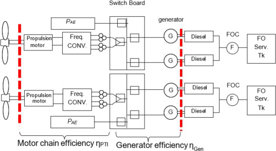
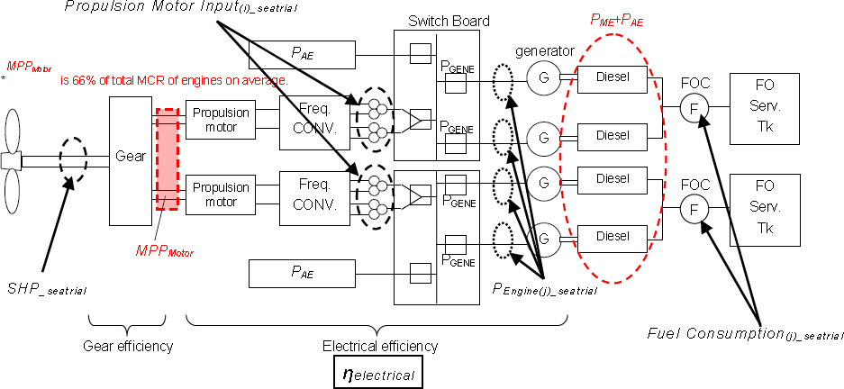
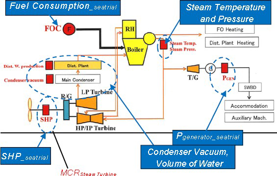

- identification of certificate for measuring standards
- description of environmental conditions
- calibration factor or calibration curve
- uncertainty of measurement
- minimum and maximum capacity' for which the error of measuring instrument is within specified (acceptable) limits.

### b) Intervals of Confirmation

The measuring equipment (including measuring standards) shall be confirmed at appropriate (usually periodical) intervals, established on the basis of their stability, purpose and wear. The intervals shall be such that confirmation is carried out again prior to any probable change in the equipment accuracy, which is important for the equipment reliability. Depending on the results of preceding calibrations, the confirmation period may be shortened, if necessary, to ensure the continuous accuracy of the measuring equipment.

The laboratory shall have specific objective criteria for decisions concerning the choice of intervals of confirmation.

### c) Non - Conforming Equipment

Any item of measuring equipment

- that has suffered damage,
- that has been overloaded or mishandled,
- that shows any malfunction,
- whose proper functioning is subject to doubt,
- that has exceeded its designated confirmation interval, or
- the integrity of whose seal has been violated, shall be removed from service by segregation, clear labelling or cancelling.

Such equipment shall not be returned to service until the reasons for its nonconformity have been eliminated and it is confirmed again.

If the results of calibration prior to any adjustment or repair were such as to indicate a risk of significant errors in any of the measurements made with the equipment before the calibration, the laboratory shall take the necessary corrective action.

## 4. Instrumentation

Especially the documentation on the calibration of the following Instrumentation should be shown.

### a) Carriage Speed

The carriage speed is to be calibrated as a distance against time. Period between the calibrations is to be in accordance with the internal procedure of the towing tank test organisation.

### b) Water Temperature

Measured by calibrated thermometer with certificate (accuracy 0.1°C).

### c) Trim Measurement

Calibrated against a length standard. Period between the calibrations is to be in accordance with the internal procedure of the towing tank test organisation.

### d) Resistance Test

Resistance Test is a force measurement. It is to be calibrated against a standard weight. Calibration normally before each test series.

### e) Propulsion Test

During Self Propulsion Test torque, thrust and rate of revolutions are measured. Thrust and Torque are calibrated against a standard weight. Rate of revolution is normally measured by a pulse tachometer and an electronic counter which can be calibrated e.g. by an oscillograph.

Period between the calibrations is to be in accordance with the internal procedure of the towing tank test organisation.

### f) Propeller Open Water Test

During Propeller Open Water Test torque, thrust and rate of revolutions are measured. Thrust and Torque are calibrated against a standard weight. Rate of revolution is normally measured by a pulse tachometer and an electronic counter which can be calibrated e.g. by an oscillograph.

Period between the calibrations is to be in accordance with the internal procedure of the towing tank test organisation.

Examples of documentation sheets are given in the Annexes 1 and 2:

## ANNEX 1: SAMPLE OF MEASURING EQUIPMENT CARD

| QM 4.10.5.1 | **Measurement Equipment Card** | Laboratory Identification Number |
| :--- | :---: | :--- |
| **Equipment** | **Manufacturer** / **Serial No.** | **Model** / **Date of Purchase** |
|  | **Basic range** |  |
| **Work Instructions** |  | **Status** |
| **Calibration Instructions** |  | **Calibrated** |
| **Verified at** |  | **Indication** / **Verified** |

| Date of Check | Certificate No. | Period | Date of Next Check | Responsible | Department | Approval |
| :--- | :--- | :--- | :--- | :--- | :--- | :--- |
|  |  |  |  |  |  |  |

## ANNEX 2: SAMPLE OF CALIBRATION CERTIFICATE.

| QM 4.10.6.2 | **CALIBRATION CERTIFICATE for PROPELLER** | **NO.** / **LIN** |
| :--- | :---: | :--- |

| Calibration Instructions |  | Calibrated by : |  |
| :--- | :--- | :--- | :--- |
| Date of calibration |  | Checked by |  |

**Measurement combination**

**DYNAMOMETER**

| LIN | Manufacturer | Model |
| :--- | :--- | :--- |
|  | Serial No | Date of purchased |
|  | Work instruction | Last calibration |

Cable

**AMPLIFIER**

| LIN | Manufacturer |  |
| :--- | :--- | :--- |
|  | Serial No. | Used |
|  | Work instruction | Transducer |
|  | Excitation | Frequency of excit. |

| **Thrust :** | Amp. gain |  | Zero not load |
| :--- | :--- | :--- | :--- |
| **Torque :** | Amp. gain |  | Zero not load |

Cable

**A/C TRANSDUCER**

| LIN | Manufacturer | Model |
| :--- | :--- | :--- |
|  | Serial No. | Date of purchased |
|  | Work instruction | Certificate No |

**MEASUREMENT STANDARDS**

| Mass |  | Certificate No |
| :--- | :--- | :--- |
| Length arm of force |  | Certificate No |
| Voltmeter |  | Certificate No |

| QM 4.10.6.2 | **CALIBRATION RESULTS** |
| :--- | :---: |

**Environmental condition**

| Place of test : |  |  |  |
| :--- | :--- | :--- | :--- |
| Temperature : | initial |  | final |
| Dampness : | initial |  | final |

**Computation results of calibrations test**

| Executed program | procedure | certificate NO. |
| :--- | :--- | :--- |

|  | **Thrust** | **Torque** |
| :--- | :--- | :--- |
| Drift : |  |  |
| Non Linearity errors : |  |  |
| Hysteresis : |  |  |
| Precision errors : |  |  |
| Total uncertainty : |  |  |
| Calibration factor : |  |  |

**Calibration requests:**

| Specified limits of | **Thrust** | **Torque** |
| :--- | :--- | :--- |
| errors : |  |  |
| Maximum capacity : |  |  |
| Minimum capacity : |  |  |

Note : tests and computations results are included in report

Prepared by : .................... Approved by : .................... Date : ....................

## APPENDIX 4

## Review and witnessing of model test procedures

The Model Tests are to be witnessed by the verifier. Special attention is to be given to the following items:

### 1. Ship Model

#### Hydrodynamic Criteria

a) *Model Size:* The model should generally be as large as possible for the size of the towing tank taking into consideration wall, blockage and finite depth effects, as well as model mass and the maximum speed of the towing carriage (ITTC Recommended Procedure 7.5-02-02-01 Resistance Test).

b) *Reynolds Number:* The Reynolds Number is to be, if possible, above 2.5x 106.

c) *Turbulence Stimulator:* In order to ensure turbulent flow, turbulence stimulators have to be applied.

#### Manufacture Accuracy

With regard to accuracy the ship model is to comply with the criteria given in ITTC Recommended Procedure 7.5-01-01-01, Ship Models.

The following points are to be checked:

a) *Main dimensions:* LPP, B.

b) *Surface finish:* Model is to be smooth. Particular care is to be taken when finishing the model to ensure that geometric features such as knuckles, spray rails, and boundaries of transom sterns remain well-defined.

c) *Stations and Waterlines:* The spacing and numbering of displacement stations and waterlines are to be properly defined and accurately marked on the model.

d) *Displacement:* The model is to be run at the correct calculated displacement. The model weight is to be correct to within 0.2% of the correct calculated weight displacement. In case the marked draught is not met when the calculated displacement has been established the calculation of the displacement and the geometry of the model compared to the ship has to be revised. (Checking the Offsets).

#### Documentation in the report

Identification (model number or similar)
Materials of construction
Principal dimensions
Length between perpendiculars (LPP)
Length of waterline (LWL)
Breadth (B)
Draught (T)
For multihull vessels, longitudinal and transverse hull spacing
Design displacement (*Δ*) (kg, fresh water)
Hydrostatics, including water plane area and wetted surface area
Details of turbulence stimulation
Details of appendages
Tolerances of manufacture

### 2. Propeller Model

The Manufacturing Tolerances of Propellers for Propulsion Tests are given IN ITTC Recommended Procedures 7.5-01-01-01, Ship Models Chapter 3.1.2. Attention: Procedure 7.5 -- 01-02-02 Propeller Model Accuracy is asking for higher standards which are applicable for cavitation tests and not required for self-propulsion tests.

#### Propeller Model Accuracy

**Stock Propellers**

During the "stock-propeller" testing phase, the geometrical particulars of the final design propeller are normally not known. Therefore, the stock propeller pitch (in case of CPP) is recommended to be adjusted to the anticipated propeller shaft power and design propeller revolutions. (ITTC Recommended Procedure 7.5-02-03-01.1 Propulsion/Bollard Pull Test).

**Adjustable Pitch Propellers**

Before the Tests the pitch adjustment is to be controlled.

**Final Propellers**

Propellers having diameter (D) typically from 150 mm to 300 mm is to be finished to the following tolerances:
Diameter (D) +/- 0.10 mm
Thickness (t) +/- 0.10 mm
Blade width (c) +/- 0.20 mm
Mean pitch at each radius (P/D): +/- 0.5% of de-sign value.
Special attention is to be paid to the shaping accuracy near the leading and trailing edges of the blade section and to the thickness distributions. The propeller will normally be completed to a polished finish.

#### Documentation in the report

Identification (model number or similar)
Materials of construction
Principal dimensions Diameter
Pitch-Diameter Ratio (P/D)
Expanded blade Area Ratio (AE/Ao)
Thickness Ratio (t/D)
Hub/Boss Diameter (do)
Tolerances of manufacture

### 3. Model Tests

### a) Resistance Test

The Resistance Test is to be performed acc. to ITTC Recommended Procedure 7.5-02-02-01 Resistance Test.

#### Documentation in the report

Model Hull Specification:

- Identification (model number or similar)
- Loading condition
- Turbulence stimulation method
- Model scale
- Main dimensions and hydrostatics (see ITTC Recommended Procedure 7.5-01-01-01 Ship Models and chapter 2 of this paper).

Particulars of the towing tank, including length, breadth and water depth
Test date
Parametric data for the test:

- Water temperature
- Water density
- Kinematic viscosity of the water
- Form factor (even if (1+k) =1.0 is applicable, this is to be stated)
- *ΔCF* or *CA*

For each speed, the following measured and extrapolated data is to be given as a minimum:

- Model speed
- Resistance of the model
- Sinkage fore and aft, or sinkage and trim

### b) Propulsion Test

The Propulsion Test is to be performed acc. to ITTC Recommended Procedure 7.5-02-03-01.1 Propulsion Test/Bollard Pull.

#### Documentation in the report

Model Hull Specification:

- Identification (model number or similar)
- Loading condition
- Turbulence stimulation method
- Model scale
- Main dimensions and hydrostatics (see ITTC Recommended Procedure 7.5-01-01-01 Ship Models and chapter 2 of this paper).

Model Propeller Specification:

- Identification (model number or similar)
- Model Scale
- Main dimensions and particulars (see ITTC Recommended Procedure 7.5-01-01-01 Ship Models and chapter 3 of this paper)

Particulars of the towing tank, including length, breadth and water depth
Test date
Parametric data for the test:

- Water temperature
- Water density
- Kinematic viscosity of the water
- Form factor (even if (1+k) = 1.0 is applicable, this is to be stated)
- *ΔCF* or *CA*
- Appendage drag scale effect correction factor (even if a factor for scale effect correction is not applied, this is to be stated).

For each speed the following measured data and extrapolated data is to be given as a minimum:

- Model speed
- External tow force
- Propeller thrust,
- Propeller torque
- Rate of revolutions.
- Sinkage fore and aft, or sinkage and trim
- The extrapolated values are also to contain the resulting delivered power PD.

### c) Propeller Open Water Test

In many cases the Propeller Open Water Characteristics of a stock propeller will be available and the Propeller Open Water Test need not be repeated for the particular project. A documentation of the Open Water Characteristics (Open Water Diagram) will suffice.

In case of a final propeller or where the Propeller Open Water Characteristics is not available the Propeller Open Water Test is to be performed acc. to ITTC Recommended Procedure 7.5-02-03-02.1 Open Water Test.

#### Documentation in the report

Model Propeller Specification:

- Identification (model number or similar)
- Model scale
- Main dimensions and particulars (see recommendations of ITTC Recommended Procedure 7.5-01-01-01 Ship Models and chapter 3 of this paper)
- Immersion of centreline of propeller shaft in the case of towing tank

Particulars of the towing tank or cavitation tunnel, including length, breadth and water depth or test section length, breadth and height.
Test date
Parametric data for the test:

- Water temperature
- Water density
- Kinematic viscosity of the water
- Reynolds Number (based on propeller blade chord at 0.7R)

For each speed the following data is to be given as a minimum:

- Speed
- Thrust of the propeller
- Torque of the propeller
- Rate of revolution
- Force of nozzle in the direction of the propeller shaft (in case of ducted propeller)

#### Propeller Open Water Diagram

### 4. Speed Trial Prediction

The principal steps of the Speed Trial Prediction Calculation are given in ITTC Recommended Procedure 7.5 - 02 - 03 -1.4 ITTC 1978 Trial Prediction Method (in its latest reviewed version of 2017). The main issue of a speed trial prediction is to get the loading of the propeller correct and also to assume the correct full scale wake. The right loading of the propeller can be achieved by increasing the friction deduction by the added resistance (e.g. wind resistance etc.) and run the self-propulsion test already at the right load or it can be achieved by calculation as given in Procedure 7.5-02-03-1.4.

A wake correction is always necessary for single screw ships. For twin screw ships it can be neglected unless the stern shape is of twin hull type or other special shape.

The following scheme indicates the main components of a speed trial prediction. It is to be based on a Resistance Test, a Propulsion Test and an Open Water Test and the Propeller Open Water Characteristics of the final propeller.

#### Documentation

Model Hull Specification:

- Identification (model number or similar)
- Loading condition
- Turbulence stimulation method
- Model scale
- Main dimensions and hydrostatics (see ITTC Recommended Procedure 7.5-01-01- 01 Ship Models and chapter 2 of this paper).

Model Propeller Specification:

- Main dimensions and particulars (see ITTC Recommended Procedure 7.5-01-01-01 Ship Models and chapter 3 of this paper)

Particulars of the towing tank, including length, breadth and water depth
Resistance Test Identification (Test No. or similar)
Propulsion Test Identification (Test No. or similar)
Open Water Characteristics of the model propeller
Open Water Characteristics of ship propeller
Ship Specification:

- Projected wind area
- Wind resistance coefficient
- Assumed BF
- CF and CA

Principle Scheme for Speed Trial Prediction

For each speed the following calculated data is to be given as a minimum:

- Ship speed
- Model wake coefficient
- Ship wake coefficient
- Propeller thrust on ship
- Propeller torque on ship
- Rate of revolutions on ship
- Predicted power on ship (delivered power on Propeller(s) PD)
- Sinkage fore and aft, or sinkage and trim

#### Scheme for review and witnessing Model Tests

Checking of Model Testing Procedure

## APPENDIX 5

## Sample report "Preliminary Verification of EEDI"

**ATTESTATION**
**PRELIMINARY VERIFICATION OF ENERGY EFFICIENCY DESIGN INDEX (EEDI) by VERIFIER**

Statement N° EEDI/YYYY/XXX

**Ship particulars:**

| Ship Owner: |  |
| :--- | :--- |
| Shipyard: |  |
| Ship's Name: |  |
| IMO Number: |  |
| Hull number: |  |
| Building contract date: |  |
| Type of ship: |  |
| Port of registry: |  |
| Deadweight: |  |

**Summary results of EEDI**

| Reference speed | VV.V knots |
| :--- | :--- |
| Attained EEDI | X.XX g/t.nm |
| Required EEDI | Y.YY g/t.nm |

**Supporting documents**

| Title | ID and/or remarks |
| :--- | :--- |
| EEDI Technical File | RRRR dated DD/MM/YYYY |

This is to certify:

1. That the attained EEDI of the ship has been calculated according to the *2022 Guidelines on the method of calculation of the attained Energy Efficiency Design Index (EEDI) for new ships*, IMO resolution MEPC.364(79) as amended.

2. That the preliminary verification of the EEDI shows that the ship complies with the applicable requirements in regulation 22 and regulation 24 of MARPOL Annex VI as amended.

Completion date of preliminary verification of EEDI: xx/xx/xxxx

Issued at:\_\_\_\_\_\_\_\_\_\_\_\_on: \_\_\_\_\_\_

Signature of the Verifier

## APPENDIX 6

## Sample calculations of EEDI

**Content**

Appendix 6.1: Cruise passenger ship with diesel-electric propulsion

Appendix 6.2: LNG carrier with diesel-electric propulsion

Appendix 6.3: Diesel-driven LNG carrier with re-liquefaction system

Appendix 6.4: LNG carrier with steam turbine propulsion

### Appendix 6.1

### Sample calculation for diesel-electric cruise passenger ship

#### 1. Preliminary calculation of attained EEDI at design stage

Attained EEDI for cruise passenger ship having diesel electric propulsion system is calculated as follows at design stage.
For a diesel-electric cruise passenger ship:
PME = 0, PPTI ≠ 0, PPTO = 0

#### 1) Input

The table below lists the input information needed at the design stage and verified at the final stage:

| Symbol | Name | Value | Source |
| :--- | :--- | :--- | :--- |
| MPP | Rated output of electric propulsion motors | 2 x 20000 kW | From EEDI technical file |
| ηPTI | Efficiency of transformer + converter + propulsion motor at 75% of rated motor output | 0.945 | From electric power table |
| ηGen | Power-weighted average efficiency of generators | 0.974 | Calculation from individual generator efficiencies given in electric power table: 0.975*19000+0.972*14000/(14000+19000) |
| HLOADmax | Consumed electric power excluding propulsion in cruise most demanding conditions (here extreme summer conditions 28°C during 80% of the time) | 15,779 kW | From electric power table for the most demanding cruise contractual conditions |
| SFCME | Power-weighted average of specific oil consumption among all engines at 75% of the MCR power | 185 g/kWh | From NOx technical file |
| GT | Gross Tonnage | 160000 ums | From EEDI technical file |

MCR of auxiliary diesel engines: 19,000 kW x 2 + 14,000 kW x 2
MPP: 20,000 kW x 2

*SFCME* recorded in the test report annexed to the NOx technical file at 75% of MCR power and corrected to the ISO standard reference conditions.
185 g/kWh for both types of engines (19,000 kW and 14,000 kW)

#### 2) Calculation of ΣPPTI

The input is the rated output of the electric propulsion motors, MPP, which can be identified with the quantity noted PPTI,Shaft in 2.2.5.3 of the "2022 guidelines on the method of calculation of the attained energy efficiency design index (EEDI) for new ships".
The term PPTI is then computed as follows:

$$P_{PTI(i)} = \frac{\Sigma(0.75 \times MPP(i))}{\eta_{PTI} \times \eta_{Gen}}$$

$$P_{PTI(i)} = \frac{2 \times 0.75 \times 20,000}{0.945 \times 0.974}$$

$$P_{PTI(i)} = 32,593 kW$$

Where ηPTI is the chain efficiency of the transformer, frequency converter and electric motor, as given by the manufacturer at 75% of the rated motor output and ηGen is the weighted average efficiency of the generators.

#### 3) Value of PAE

PAE is estimated by the consumed electric power, excluding propulsion, in most demanding (i.e. maximum electricity consumption) cruise conditions as given in the electric power table provided by the submitter, divided by the average efficiency of the generators.

The most demanding conditions maximise the design electrical load and correspond to contractual ambient conditions leading to the maximum consumption off heating ventilation and air conditioning systems, in accordance with Note 3 of the "2022 guidelines on the method of calculation of the attained energy efficiency design index (EEDI) for new ships".

In this example, the most demanding condition corresponds to extreme summer conditions, where the external air temperature is 28°C during 80% of the time.

$$P_{AE} = \frac{HLOAD_{max}}{\eta_{Gen}}$$

$$= \frac{15,779kW}{0.974}$$

$$= 16,200kW$$

#### 4) Vref at EEDI condition

*Vref* is obtained by the preliminary speed-power curves as the model tank test results at EEDI condition at design stage. Suppose that *Vref* of 22.5 kn is obtained at 75% of *MPP*, in this example calculation at design stage.

#### 5) Calculation of the attained EEDI at design stage

EEDI is calculated in accordance with paragraph 2 of the "2022 guidelines on the method of calculation of the attained energy efficiency design index (EEDI) for new ships". The primary fuel is marine Gas Oil in this example.

$$EEDI = \frac{(P_{ME} + \sum P_{PTI(i)}) \cdot C_{FME} \cdot SFC_{ME})}{Capacity \cdot V_{ref}}$$

$$= \frac{(16200 + 32593) \times 185 \times 3.206}{160,000(UMS) \times 22.5(kn)} = 8.04$$

#### 2. Final calculation of attained EEDI at sea trial

Attained EEDI at sea trial of cruise passenger ship having diesel electric propulsion system is calculated as follows.

#### 1) Typical configuration and example of measurement points at sea trial

#### 2) Specifications

Chain efficiency of the electric motor ηPTI and generator efficiency ηGen can be confirmed during the sea trials at EEDI conditions (i.e. 75% of the rated motor output) taking into account the power factor cosp of the electric consumers.

*SFCME* is computed form the NOx technical file if this file was not available at the preliminary stage.

Gross tonnage is confirmed at 160,000 ums.

Prior to sea trials, an on-board survey is performed to ensure that data read on the nameplates of the main electrical pieces of equipment comply with those recorded in the submitted electric power table.

#### 3) Vref at EEDI condition

*Vref* is obtained by the speed-power curves as a result of the sea trial in accordance with the paragraph 4.3.9 of "2022 guidelines on survey and certification of the energy efficiency design index (EEDI)" as amended. Suppose that *Vref* of 18.7kn is obtained at 75% of *MPP*, in this example calculation at sea trial.

During the sea trials, the shaft power transferred to the propellers PPTI,Shaft must be obtained. It could be measured by a torsimeter fitted on the propeller shaft, or obtained from the computation of the power consumption of the motor PME through the following relation:

$$P_{PTI,Shaft} = P_{ME} \times \eta_{PTI}$$

#### 4) Calculation of the attained EEDI at sea trial

EEDI is calculated in accordance with paragraph 2 of the "2022 guidelines on the method of calculation of the attained energy efficiency design index (EEDI) for new ships". The primary fuel is marine Gas Oil in this example.

$$EEDI = \frac{(P_{ME} + \sum P_{PTI(i)}) \cdot C_{FME} \cdot SFC_{ME})}{Capacity \cdot V_{ref}}$$

$$= \frac{(16200 + 32593) \times 185 \times 3.206}{160,000(UMS) \times 22.7(kn)} = 7.97$$

### Appendix 6.2

### Sample calculation for LNG carrier having diesel electric propulsion system

#### 1. Preliminary calculation of attained EEDI at design stage

Attained EEDI for LNG carrier having diesel electric propulsion system at design stage is calculated as follows.

#### 1) Specifications

| | |
| :--- | :--- |
| MCR of main engines | 10,000 (kW) x 3 + 6,400 (kW) x 1 |
| MPPMotor | 24,000 (kW) |
| *SFCME(i), electric, gas mode at 75% of MCR* | 162.0 (g/kWh) (for 10,000 (kW)-Engines) (SFC with the addition of the guarantee tolerance) |
|  | 162.6 (g/kWh) (for 6,400 (kW)-Engine) (Ditto) |
| *SFCME(i), PilotFuel* | 6.0 (g/kWh) (for 10,000 (kW)-Engines), 6.1 (g/kWh) (for 6,400 (kW)-Engine) |
| *Deadweight* | 75,000 (ton) |

#### 2) ηelectrical at design stage

ηelectrical is set as 0.913 in accordance with paragraph 2.2.5.1 of the "2022 guidelines on the method of calculation of the attained energy efficiency design index (EEDI) for new ships".

#### 3) Calculation of PME

PME is calculated in accordance with paragraph 2.2.5.1 of the "2022 guidelines on the method of calculation of the attained energy efficiency design index (EEDI) for new ships".

$$P_{ME} = 0.83 \times \frac{MPP_{Motor}}{\eta_{electrical}}$$

$$= 0.83 \times \frac{24,000}{0.913} = 21,818(kW)$$

#### 4) Calculation of PAE

PAE is calculated in accordance with paragraph 2.2.5.6.1 and 2.2.5.6.3 of the "2022 guidelines on the method of calculation of the attained energy efficiency design index (EEDI) for new ships".

$$P_{AE} = 0.025 \times \sum_{i}^{nME} MCR_{ME(i)} + \sum_{i}^{nPTI} PTI(i) \left( 0.75 \right) + 250 \quad and/or ,$$

$$ + CargoTankCapacity_{LNG} \times BOR \times COP_{reliquify} \times R_{reliquify} \quad ...(1) \quad and/or, (Not Applicable) $$

$$ + 0.33 \sum_{i}^{nME} SFC_{ME(i),gasmade} \times \frac{P_{ME(i)}}{1000} \quad ...(2) \quad and/or, (Not Applicable) $$

$$ + 0.02 \times \sum_{i}^{nME} PME_{(i)} \quad ...(3) $$

= {(0.025 x 24,000) + 250} + 0 + 0 + (0.02 x 21,818)
= 1,286(kW)

Note:
\*1. The value of MPPMotor is used instead of MCRME in accordance with paragraph 2.2.5.6.3.3.

#### 5) Vref at EEDI condition

*Vref* is obtained by the preliminary speed-power curves as the model tank test results at EEDI condition at design stage. Suppose that *Vref* of 18.4kn is obtained at 83% of *MPPMotor*, in this example calculation at design stage.

#### 6) Calculation of the attained EEDI at design stage

EEDI is calculated in accordance with paragraph 2 of the "2022 guidelines on the method of calculation of the attained energy efficiency design index (EEDI) for new ships". The primary fuel is LNG in this example calculation. In this case, *SFCME(i), electric, gas mode at 75% of MCR* is equal to *SFCME(i), PilotFuel* is equal to *SFCME(i), PilotFuel*.

$$EEDI = \frac{P_{ME} \cdot (C_{FME\_gas} \cdot SFC_{ME\_gas} + C_{FME\_Pilotfuel} \cdot SFC_{ME\_Pilotfuel}) + P_{AE} \cdot (C_{FAE\_gas} \cdot SFC_{AE\_gas} + C_{FAE\_Pilotfuel} \cdot SFC_{AE\_Pilotfuel})}{Capacity \cdot V_{ref}}$$

$$= \frac{21818 \times (2.750 \times 162.1 + 3.206 \times 6.0) + 1286 \times (2.750 \times 162.1 + 3.206 \times 6.0)}{75,000(DWT) \times 18.4(kn)} = 7.9$$

Note:

\*1: The average weighed value of *SFCME(i), electric, gas mode at 75% of MCR* and *SFCAE(i), electric, gas mode at 75% of MCR* is used:

$$\frac{162.0 \times (10,000(kW) \times 3) + 162.6 \times (6,400(kW))}{10,000(kW) \times 3 + 6,400(kW)} = 162.1(g/kWh)$$

\*2: The average weighed value of *SFCME(i), PilotFuel* and *SFCAE(i), PilotFuel* is used:

$$\frac{6.0 \times (10,000(kW) \times 3) + 6.1 \times (6,400(kW))}{10,000(kW) \times 3 + 6,400(kW)} = 6.0(g/kWh)$$

#### 2. Final calculation of attained EEDI at sea trial

Attained EEDI for LNG carrier having diesel electric propulsion system at sea trial is calculated as follows.

#### 1) Typical configuration and example of measurement points at sea trial

#### 2) Specifications

| | |
| :--- | :--- |
| MCR of main engines | 10,000 (kW) x 3 + 6,400 (kW) x 1 |
| MPPMotor | 24,000 (kW) |
| *SFCME(i), electric, gas mode at 75% of MCR* | 161.6 (g/kWh) (for 10,000 (kW)-Engines) (SFC of the test report in the NOx technical file) |
|  | 162.2 (g/kWh) (for 6,400 (kW)-Engine) (Ditto) |
| *SFCME(i), PilotFuel* | 6.0 (g/kWh) (for 10,000 (kW)-Engines), 6.1 (g/kWh) (for 6,400 (kW)-Engine) |
| *Deadweight* | 75,500 (ton) |

#### 3) ηelectrical at sea trial

ηelectrical is set as 0.913 in accordance with paragraph 2.2.5.1 of the "2022 guidelines on the method of calculation of the attained energy efficiency design index (EEDI) for new ships".

#### 4) Calculation of PME

PME is calculated in accordance with paragraph 2.2.5.1 of the "2022 guidelines on the method of calculation of the attained energy efficiency design index (EEDI) for new ships".

$$P_{ME} = 0.83 \times \frac{MPP_{Motor}}{\eta_{electrical}}$$

$$= 0.83 \times \frac{24,000}{0.913} = 21,818(kW)$$

#### 5) Calculation of PAE

PAE is calculated in accordance with paragraph 2.2.5.6.1 and 2.2.5.6.3 of the "2022 guidelines on the method of calculation of the attained energy efficiency design index (EEDI) for new ships".

$$P_{AE} = 0.025 \times \sum_{i}^{nME} MCR_{ME(i)} + \sum_{i}^{nPTI} PTI(i) \left( 0.75 \right) + 250 \quad and/or,$$

$$ + CargoTankCapacity_{LNG} \times BOR \times COP_{reliquify} \times R_{reliquify} \quad ...(1) \quad and/or, (Not Applicable) $$

$$ + 0.33 \sum_{i}^{nME} SFC_{ME(i),gasmade} \times \frac{P_{ME(i)}}{1000} \quad ...(2) \quad and/or, (Not Applicable) $$

$$ + 0.02 \times \sum_{i}^{nME} PME(i) \quad ...(3) $$

= {(0.025 x 24,000) + 250} + 0 + 0 + (0.02 x 21,818)
= 1,286(kW)

Note:
\*1. The value of MPPMotor is used instead of MCRME in accordance with paragraph 2.2.5.6.3.4.

#### 6) Vref at EEDI condition

*Vref* is obtained by the speed-power curves as a result of the sea trial in accordance with paragraph 4.3.9 of the "2022 guidelines on survey and certification of the energy efficiency design index (EEDI)" as amended. Suppose that *Vref* of 18.5kn is obtained at 83% of *MPPMotor*, in this example calculation at sea trial.

#### 7) Calculation of the attained EEDI at sea trial

EEDI is calculated in accordance with paragraph 2 of the "2022 guidelines on the method of calculation of the attained energy efficiency design index (EEDI) for new ships". The primary fuel is LNG in this example calculation. In this case, *SFCME(i), electric, gas mode at 75% of MCR* is equal to *SFCME(i), PilotFuel* is equal to *SFCME(i), PilotFuel*.

$$EEDI = \frac{P_{ME} \cdot (C_{FME\_gas} \cdot SFC_{ME\_gas} + C_{FME\_Pilotfuel} \cdot SFC_{ME\_Pilotfuel}) + P_{AE} \cdot (C_{FAE\_gas} \cdot SFC_{AE\_gas} + C_{FAE\_Pilotfuel} \cdot SFC_{AE\_Pilotfuel})}{Capacity \cdot V_{ref}}$$

$$= \frac{21818 \times (2.750 \times 161.7 + 3.206 \times 6.0) + 1286 \times (2.750 \times 161.7 + 3.206 \times 6.0)}{75,500(DWT) \times 18.5(kn)} = 7.67$$

Note:

\*1: The average weighed value of *SFCME(i), electric, gas mode at 75% of MCR* and *SFCAE(i), electric, gas mode at 75% of MCR* is used:

$$\frac{161.6 \times (10,000(kW) \times 3) + 162.2 \times (6,400(kW))}{10,000(kW) \times 3 + 6,400(kW)} = 161.7(g/kWh)$$

\*2: The average weighed value of *SFCME(i), PilotFuel* and *SFCAE(i), PilotFuel* is used:

$$\frac{6.0 \times (10,000(kW) \times 3) + 6.1 \times (6,400(kW))}{10,000(kW) \times 3 + 6,400(kW)} = 6.0(g/kWh)$$

### Appendix 6.3

### Sample calculation for LNG carrier having diesel driven with re-liquefaction system

#### 1. Preliminary calculation of attained EEDI at design stage

Attained EEDI for LNG carrier having diesel driven with re-liquefaction system at design stage is calculated as follows.

#### 1) Specifications

| | |
| :--- | :--- |
| *MCRME(i)* | 18,660 x 2 (kW) = 37,320 (kW) |
| *SFCME(i), at 75% of MCR* | 165.0 (g/kWh) |
| *SFCAE(i), at 50% of MCR* | 198.0 (g/kWh) |
| *CargoTankCapacityLNG* | 211,900 (m3) |
| *BOR* | 0.15 (%/day) |
| *COPcooling* | 0.166 |
| *COPreliquify* | 15.142 |

$$COP_{reliquify} = \frac{425(kJ/m^3) \times 511(kJ/kg)}{24(h) \times 3600(sec) \times COP_{cooling}} = 15.142$$

| | |
| :--- | :--- |
| *Rreliquify* | 1 |
| *Deadweight* | 109,000 (ton) |

#### 2) Calculation of PME

PME is calculated in accordance with paragraph 2.2.5.1 of the "2022 guidelines on the method of calculation of the attained energy efficiency design index (EEDI) for new ships".

$$P_{ME(i)} = 0.75 \times MCR_{ME(i)}$$

= 0.75 x (18,660 + 18,660) = 27,990(kW)

#### 3) Calculation of PAE

PAE is calculated in accordance with paragraph 2.2.5.6.1 and 2.2.5.6.3 of the "2022 guidelines on the method of calculation of the attained energy efficiency design index (EEDI) for new ships".

PAE = 0.025 x Σ 0.0ME(i) + 250
+ *CargoTankCapacityLNG* x *BOR* x *COPreliquify* x *Rreliquify*
= 0.025 x 37,320 +250
+ 211,900 x 0.15/100 x 15.142 x 1
= 5,996 (kW)

#### 4) Vref at EEDI condition

*Vref* is obtained by the preliminary speed-power curves as the model tank test results at EEDI condition at design stage.

Suppose that *Vref* of 19.7kn is obtained at 75% of *MCRME(i)*, in this example calculation at design stage.

#### 5) Calculation of the attained EEDI on design stage

EEDI is calculated in accordance with paragraph 2 of the "2022 guidelines on the method of calculation of the attained energy efficiency design index (EEDI) for new ships".

$$EEDI = \frac{P_{ME} \cdot C_{FME} \cdot SFC_{ME} + P_{AE} \cdot C_{FAE} \cdot SFC_{AE}}{Capacity \cdot V_{ref}}$$

$$EEDI = \frac{27,990 \times 3.206 \times 165.0 + 5,996 \times 3.206 \times 198.0}{109,000(DWT) \times 19.7(kn)} = 8.668$$

#### 2. Final calculation of attained EEDI at sea trial

Attained EEDI for LNG carrier having diesel driven with re-liquefaction system at sea trial is calculated as follows.

#### 1) Specifications

| | |
| :--- | :--- |
| *MCRME(i)* | 18,660 x 2 (kW) = 37,320 (kW) |
| *SFCME(i), at 75% of MCR* | 165.5 (g/kWh) |
| *SFCAE(i), at 50% of MCR* | 198.5 (g/kWh) |
| *CargoTankCapacityLNG* | 211,900 (m3) |
| *BOR* | 0.15 (%/day) |
| *COPcooling* | 0.166 |
| *COPreliquify* | 15.142 |

$$COP_{reliquify} = \frac{425(kJ/m^3) \times 511(kJ/kg)}{24(h) \times 3600(sec) \times COP_{cooling}} = 15.142$$

*SFCME(i), at 75% of MCR* and *SFCME(i), at 50% of MCR* are in accordance with paragraph 2.2.7.1 of the "2022 guidelines on the method of calculation of the attained energy efficiency design index (EEDI) for new ships".

Deadweight is in accordance with paragraph 4.3.10 of the "2022 guidelines on survey and certification of the energy efficiency design index (EEDI)" as amended.

| | |
| :--- | :--- |
| *Rreliquify* | 1 |
| *Deadweight* | 109,255 (ton) |

#### 2) Measured values at sea trial

Relation between *SHPseatrial* and Ship's speed shall be measured and verified at sea trial.

#### 3) Calculation of PME

PME is calculated in accordance with paragraph 2.2.5.1 of the "2022 guidelines on the method of calculation of the attained energy efficiency design index (EEDI) for new ships".

$$P_{ME(i)} = 0.75 \times MCR_{ME(i)}$$

= 0.75 x (18,660 + 18,660) = 27,990(kW)

#### 4) Calculation of PAE

PAE is calculated in accordance with paragraph 2.2.5.6.3.1 of the "2022 guidelines on the method of calculation of the attained energy efficiency design index (EEDI) for new ships".

PAE = 0.025 x 3.0ME(i) + 250
+ *CargoTankCapacityLNG* x *BOR* x *COPreliquify* x *Rreliquify*
= 0.025 x 37,320 +250
+ 211,900 x 0.15/100 x 15.142 x 1
= 5,996 (kW)

Note:
\*1. The value of MPPMotor is used instead of MCRME in accordance with paragraph 2.2.5.6.3.4.

#### 5) Vref at EEDI condition

*Vref* is obtained by the speed-power curves as a result of the sea trial in accordance with paragraph 4.3.9 of the "2022 guidelines on survey and certification of the energy efficiency design index (EEDI)" as amended. Suppose that *Vref* of 19.8kn is obtained at 75% of *MCRME(i)*, in this example calculation at sea trial.

#### 6) Calculation of the attained EEDI at sea trial

EEDI is calculated in accordance with paragraph 2 of the "2022 guidelines on the method of calculation of the attained energy efficiency design index (EEDI) for new ships".

$$EEDI = \frac{P_{ME} \cdot C_{FME} \cdot SFC_{ME} + P_{AE} \cdot C_{FAE} \cdot SFC_{AE}}{Capacity \cdot V_{ref}}$$

$$EEDI = \frac{27,990 \times 3.206 \times 165.5 + 5,996 \times 3.206 \times 198.5}{109,255(DWT) \times 19.8(kn)} = 8.629$$

### Appendix 6.4

### Sample calculation for LNG carrier having steam turbine propulsion system

#### 1. Preliminary calculation of attained EEDI at design stage

Attained EEDI for LNG carrier having steam turbine propulsion system at design stage is calculated as follows.

#### 1) Specifications

| | |
| :--- | :--- |
| *MCRSteam turbine* | 25,000 (kW) |
| *SFCSteam turbine* | 241.0 (g/kWh) |
| *Deadweight* | 75,000 (ton) |

#### 2) Calculation of PME

PME is calculated in accordance with paragraph 2.2.5.1 of the"2022 guidelines on the method of calculation of the attained energy efficiency design index (EEDI) for new ships".

$$P_{ME} = 0.83 \times MCR_{SteamTurbine}$$

= 0.83 x 25,000 = 20,750(kW)

#### 3) Calculation of PAE

PAE is treated as 0(zero) because electric load (Pgenerator\_seatrial) is supposed to be included in *SFCSteamTurbine*, in accordance with paragraph 2.2.5.6.5 and 2.2.7.2.1 of the "2022 guidelines on the method of calculation of the attained energy efficiency design index (EEDI) for new ships".

$$P_{AE} \equiv 0$$

#### 4) Vref at EEDI condition

*Vref* is obtained by the preliminary speed-power curves as the model tank test results at EEDI condition at design stage.

Suppose that *Vref* of 18.7kn is obtained at 83% of *MCRSteamTurbine*, in this example calculation at design stage.

#### 5) Calculation of the attained EEDI on design stage

EEDI is calculated in accordance with paragraph 2 of the "2022 guidelines on the method of calculation of the attained energy efficiency design index (EEDI) for new ships". The primary fuel is LNG in this example calculation.

$$EEDI = \frac{P_{ME} \cdot C_{FME} \cdot SFC_{ME} + P_{AE} \cdot C_{FAE} \cdot SFC_{AE}}{Capacity \cdot V_{ref}}$$

$$EEDI = \frac{20,750 \times 2.750 \times 241.0 + 0}{75,000(DWT) \times 18.7(kn)} = 9.81$$

#### 2. Final calculation of attained EEDI at sea trial

Attained EEDI for LNG carrier having steam turbine propulsion system at sea trial is calculated as follows.

#### 1) Typical configuration and example of measurement points at sea trial

In addition to the above, in order to correct measured *Fuel Consumption* to the design conditions corresponding to the SNAME condition, inlet air temperature, sea water temperature, steam temperature, steam pressure, etc. are measured, as appropriate.

PAE is treated as 0(zero) because electric load (Pgenerator\_seatrial) is supposed to be included in *SFCSteamTurbine*, in accordance with paragraph 2.2.5.6.5 and 2.2.7.2.1 of the " 2022 guidelines on the method of calculation of the attained energy efficiency design index (EEDI) for new ships".

#### 2) Specifications

| | |
| :--- | :--- |
| *MCRSteam turbine* | 25,000 (kW) |
| *SFCSteam turbine* | 241.0 (g/kWh) |
| *Deadweight* | 75,000 (ton) |

#### 3) Measured values at sea trial

| | |
| :--- | :--- |
| Pgenerator\_seatrial | 980 (kW) |
| *SHPseatrial* | 21,520 (kW) |
| *Fuel Consumptionseatrial* | 5.95 x 106 (g/hour) |

*Each Fuel Consumption(i)\_seatrial* should be corrected in accordance with paragraph 2.2.7.2 of the "2022 guidelines on the method of calculation of the attained energy efficiency design index (EEDI) for new ships".

| | |
| :--- | :--- |
| Coefficient of flow meter | 1.0010 |
| Steam temperature | 500 degree Celsius |
| Steam pressure | 5.85 (MPaG) |
| Condenser vacuum | 725 (mmHg) |
| Dist. water production | 28.5 (t/day) |
| Inlet air temperature of FAN | 45 degree Celsius |
| Lower calorific value of fuel used at sea trial | 42,030 (kJ/kg) |

#### 4) Calculation of SFCSteamTurbine at sea trial

*SFCSteamTurbine* is calculated in accordance with paragraph 2.2.7.2 of the "2022 guidelines on the method of calculation of the attained energy efficiency design index (EEDI) for new ships".

$$SFC_{SteamTurbine\_SeaTrial(i)} = \frac{FuelConsumption_{seatrial}}{SHP_{SeaTrial}}$$

$$= \frac{5.95 \times 10^6}{21,520} \times C_1 \times C_2 \times C_3 \times C_4 \times C_5 \times C_6 \times C_7 \times C1$$

$$= \frac{5.95 \times 10^6}{21,520} \times 0.9871 \times 0.8756 \times 1.0010 \times 1.0010 \times 1.0035 \times 0.9999 \times 1.0028$$

$$= 240.7 \quad (g/kWh)$$

Note:
\*1: SFC should be corrected to the value corresponding to SNAME and EEDI conditions, in accordance with paragraph 2.2.7.2 .2 and .3 of the "2022 guidelines on the method of calculation of the attained energy efficiency design index (EEDI) for new ships". Coefficients from C1 to C7 represent as follows.

C1: Coefficient of electric power to the electric load equivalent to

PAE = 0.025 x MCRSteam turbine + 250 = 875 (kW)

C2: Coefficient of LCV to the standard LCV of 48,000 kJ/kg for LNG fuel
C3: Coefficient of flow meter
C4: Coefficient of steam temperature and steam pressure
C5: Coefficient of condenser vacuum for steam turbine
C6: Coefficient of water feed of condenser
C7: Coefficient of inlet air temperature

*SFCSteamTurbine* is calculated as the value to include all losses of machinery and, gears necessary for main propulsion system and the specified electric load of PAE.

Minimum two SFCSteamTurbine at around the EEDI power are obtained at the sea trial. However in this example calculation, all SFCSteamTurbine (i) are supposed to the same value of 240.7 g/kWh.

#### 5) Calculation of PME

PME is calculated in accordance with paragraph 2.2.5.1 of the "2022 guidelines on the method of calculation of the attained energy efficiency design index (EEDI) for new ships".

$$P_{ME} = 0.83 \times MCR_{SteamTurbine}$$

= 0.83 x 25,000 = 20,750 (kW)

#### 6) Calculation of PAE

PAE is treated as 0(zero) because electric load (Pgenerator\_seatrial) is supposed to be included in *SFCSteamTurbine*, in accordance with paragraph 2.2.5.6.5 and 2.2.7.2.1 of the "2022 guidelines on the method of calculation of the attained energy efficiency design index (EEDI) for new ships".

$$P_{AE} \equiv 0$$

#### 7) Vref at EEDI condition

*Vref* is obtained by the speed-power curves as a result of the sea trial in accordance with paragraph 4.3.9 of the "2022 guidelines on survey and certification of the energy efficiency design index (EEDI)" as amended.

Suppose that *Vref* of 18.8kn is obtained at 83% of *MCRSteamTurbine*, in this example calculation at sea trial.

#### 8) Calculation of the attained EEDI at sea trial

EEDI is calculated in accordance with paragraph 2 of the "2022 guidelines on the method of calculation of the attained energy efficiency design index (EEDI) for new ships". The primary fuel is LNG in this example calculation.

$$EEDI = \frac{P_{ME} \cdot C_{FME} \cdot SFC_{ME} + P_{AE} \cdot C_{FAE} \cdot SFC_{AE}}{Capacity \cdot V_{ref}}$$

$$= \frac{20,750 \times 2.750 \times 240.7 + 0}{75,000(DWT) \times 18.8(kn)} = 9.74$$

End of Document
