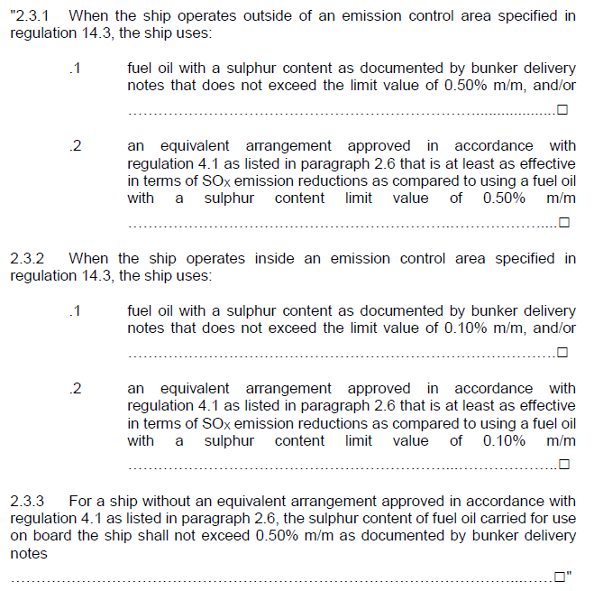

# MPC 101 (July 2012) (Rev.1 July 2020) (Corr.1 Sep 2020)

## Supplement to the International Air Pollution Prevention (IAPP) Certificate – Section 2.3

**MARPOL Annex VI, Regulation 8**

*"The International Air Pollution Prevention Certificate shall be drawn up in a form corresponding to the model given in appendix I to this Annex and shall be at least in English, French or Spanish. If an official language of the issuing country is also used, this shall prevail in case of a dispute or discrepancy."*

**Revised form of Supplement to the IAPP Certificate as per MEPC. 305(73)**

"2.3.1 When the ship operates outside of an emission control area specified in regulation 14.3, the ship uses:

- .1 fuel oil with a sulphur content as documented by bunker delivery notes that does not exceed the limit value of 0.50% m/m, and/or ☐
- .2 an equivalent arrangement approved in accordance with regulation 4.1 as listed in paragraph 2.6 that is at least as effective in terms of SOx emission reductions as compared to using a fuel oil with a sulphur content limit value of 0.50% m/m ☐

2.3.2 When the ship operates inside an emission control area specified in regulation 14.3, the ship uses:

- .1 fuel oil with a sulphur content as documented by bunker delivery notes that does not exceed the limit value of 0.10% m/m, and/or ☐
- .2 an equivalent arrangement approved in accordance with regulation 4.1 as listed in paragraph 2.6 that is at least as effective in terms of SOx emission reductions as compared to using a fuel oil with a sulphur content limit value of 0.10% m/m ☐

2.3.3 For a ship without an equivalent arrangement approved in accordance with regulation 4.1 as listed in paragraph 2.6, the sulphur content of fuel oil carried for use on board the ship shall not exceed 0.50% m/m as documented by bunker delivery notes ☐"

Note:

1. July 2012(new) version of this UI is to be uniformly implemented by IACS Societies not later than the first IAPP renewal survey carried on/after 1 January 2013.
2. Rev.1 of this UI is to be uniformly implemented by IACS Societies at the opportunity of the IAPP survey occurring after 1 March 2020 unless otherwise instructed by a flag state.

## Interpretation

Section 2.3 of the Supplement ("as documented by bunker delivery notes") allows for an "x" to be entered in all of the relevant check boxes recognizing that the bunker delivery notes, required to be retained on board for a minimum period of three years, provide the subsequent means to check that a ship is actually operating in a manner consistent with the intent as given in section 2.3.

End of Document
