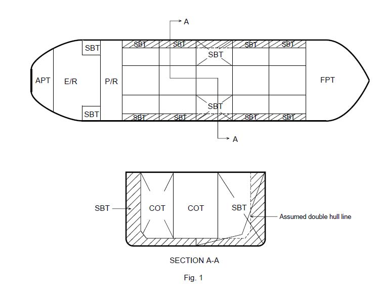
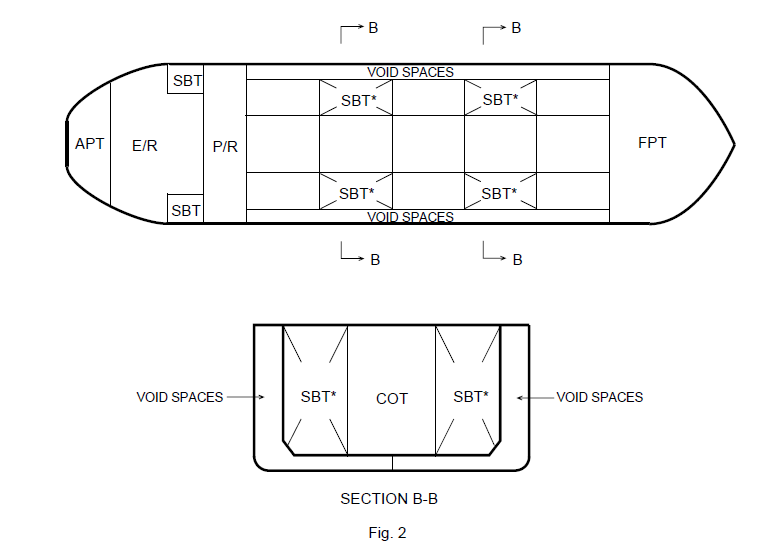

# MPC6 Calculation of the aggregate capacity of SBT

MPC6
(1997)
(Rev.1 Aug 2015)

**(Regulation 19.3.4)**

*19.3.4 The aggregate capacity of ballast tanks*

*On crude oil tankers of 20,000 tonnes deadweight and above and product carriers of 30,000 tonnes deadweight and above, the aggregate capacity of wing tanks, double bottom tanks, forepeak tanks and after peak tanks shall not be less than the capacity of segregated ballast tanks necessary to meet the requirements of regulation 18 of this Annex. Wing tanks or spaces and double bottom tanks used to meet the requirements of regulation 18 shall be located as uniformly as practicable along the cargo tank length. Additional segregated ballast capacity provided for reducing longitudinal hull girder bending stress, trim, etc. may be located anywhere within the ship.*

**Interpretation**

1. Any ballast carried in localized inboard extensions, indentations or recesses of the double hull, such as bulkhead stools, should be excess ballast above the minimum requirement for segregated ballast capacity according to regulation 18.

2. In calculating the aggregate capacity under regulation 19.3.4, the following should be taken into account:

2.1 the capacity of engine-room ballast tanks should be excluded from the aggregate capacity of ballast tanks;

2.2 the capacity of ballast tank located inboard of double hull should be excluded from the aggregate capacity of ballast tanks (see figure 1).

Notes:

1. This IACS Unified Interpretation was submitted to IMO and is contained in MEPC/Circ. 316 of 25th July 1996.

2. Revision 1 of this Unified Interpretation is to be uniformly implemented by IACS Societies for ships contracted for construction on or after 1 July 2016.

3. The "contracted for construction" date means the date on which the contract to build the vessel is signed between the prospective owner and the shipbuilder. For further details regarding the date of "contract for construction", refer to IACS Procedural Requirement (PR) No. 29.

2.3 spaces such as void spaces located in the double hull within the cargo tank length should be included in the aggregate capacity of ballast tanks (see figure 2).

End of Document
