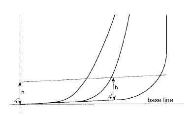
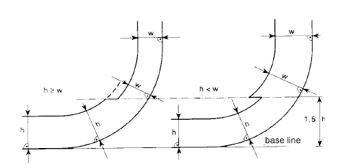
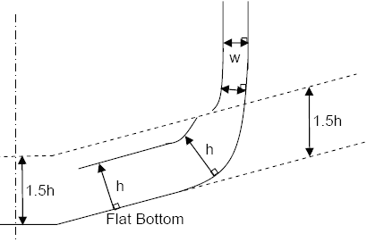

# MPC 94 (July 2008) Annex I of MARPOL 73/78 Regulation 12A.6-8 and 11.8 Oil Fuel Tank Protection, as amended by Resolution MEPC.141(54)

**Regulation 12A.6-8 and 11.8 as Amended by Resolution MEPC.141(54) reads:**

6 For ships, other than self-elevating drilling units, having an aggregate oil fuel capacity of 600m3 and above, oil fuel tanks shall be located above the moulded line of the bottom shell plating nowhere less than the distance h as specified below:

h = B/20 m or,

h = 2.0 m, whichever is the lesser.

The minimum value of h = 0.76 m

In the turn of the bilge area and at locations without a clearly defined turn of the bilge, the oil fuel tank boundary line shall run parallel to the line of the midship flat bottom as shown in Figure 1.

Figure 1 – Oil fuel tank boundary lines for the purpose of paragraph 6

7 For ships having an aggregate oil fuel capacity of 600 m3 or more but less than 5,000 m3, oil fuel tanks shall be located inboard of the moulded line of the side shell plating, nowhere less than the distance w which, as shown in Figure 2, is measured at any cross-section at right angles to the side shell, as specified below:

w = 0.4 + 2.4 C/20,000 m or

The minimum value of w = 1.0 m, however for individual tanks with an oil fuel capacity of less than 500 m3 the minimum value is 0.76 m.

Note:

This Unified Interpretation is to be applied by all Members and Associates on ships subject to MARPOL I, regulation 12A, as amended by Resolution MEPC.141(54), for which the building contract is placed on or after 1 April 2009.

8 For ships having an aggregate oil fuel capacity of 5,000 m3 and over, oil fuel tanks shall be located inboard of the moulded line of the side shell plating, nowhere less than the distance w which, as shown in Figure 2, is measured at any cross-section at right angles to the side shell, as specified below:

w = 0.5 + C/20,000 m or

w = 2.0 m, whichever is the lesser.

The minimum value of w = 1.0 m

Figure 2 – Oil fuel tank boundary lines for the purpose of paragraphs 7 and 8

….

11 Alternatively to paragraphs 6 and either 7 or 8, ships shall comply with the accidental oil fuel outflow performance standard specified below:

….

.8 For the purpose of maintenance and inspection, any oil fuel tanks that do not border the outer shell plating shall be located no closer to the bottom shell plating than the minimum value of h in paragraph 6 and no closer to the side shell plating than the applicable minimum value of w in paragraph 7 or 8."

**Interpretation:**

1. The distance "h" should be measured from the moulded line of the bottom shell plating at right angle to it (Reg.12A, Fig.1).

1.1 For vessels designed with a skeg, the skeg should not be considered as offering protection for the FO tanks. For the area within skeg's width the distance "h" should be measured perpendicular to a line parallel to the baseline at the intersection of the skeg and the moulded line of the bottom shell plating as indicated in Figure A.

Figure A

1.2 For vessels designed with a permanent trim, the baseline should not be used as a reference point. The distance "h" should be measured perpendicular to the moulded line of the bottom shell plating at the relevant frames where fuel tanks are to be protected.

2. For vessels designed with deadrising bottom, the distance "1.5h" should be measured from the moulded line of the bottom shell plating but at right angle to the baseline, as indicated in Figure B.

Figure B

3. Paragraphs 1 and 2, above also apply to the reference to the distance "h" in Regulation 12A-11.8.

End of Document
