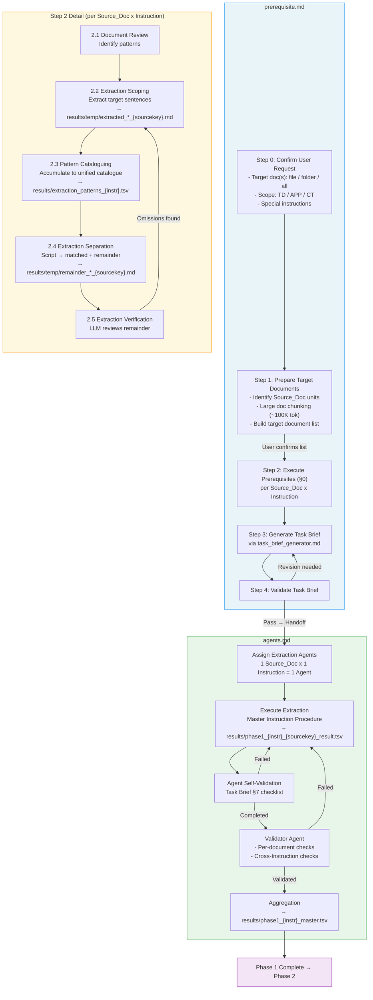
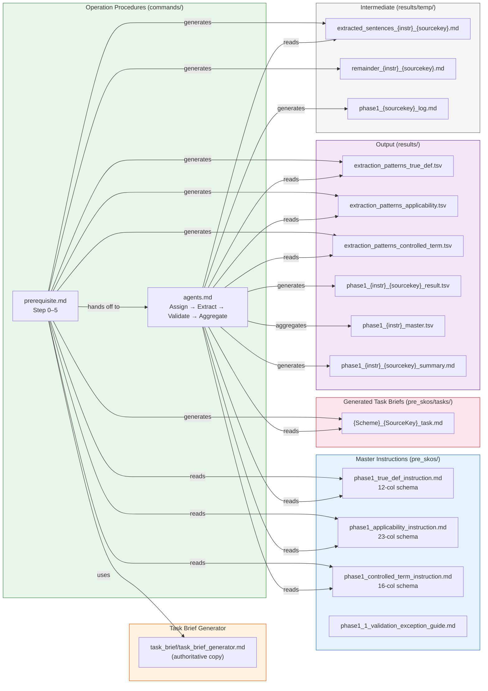
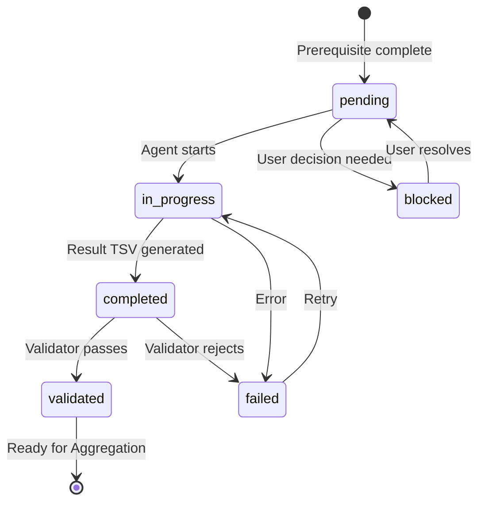

# Phase 1 — End-to-End Workflow

## Overview Diagram

```mermaid
flowchart TB
    subgraph PREREQ["prerequisite.md"]
        S0["Step 0: Confirm User Request<br/>- Target doc(s): file / folder / all<br/>- Scope: TD / APP / CT<br/>- Special instructions"]
        S1["Step 1: Prepare Target Documents<br/>- Identify Source_Doc units<br/>- Large doc chunking (~100K tok)<br/>- Build target document list"]
        S2["Step 2: Execute Prerequisites (§0)<br/>per Source_Doc x Instruction"]
        S3["Step 3: Generate Task Brief<br/>via task_brief_generator.md"]
        S4["Step 4: Validate Task Brief"]

        S0 --> S1
        S1 -->|"User confirms list"| S2
        S2 --> S3
        S3 --> S4
        S4 -->|"Revision needed"| S3
    end

    subgraph S2_DETAIL["Step 2 Detail (per Source_Doc x Instruction)"]
        direction TB
        S21["2.1 Document Review<br/>Identify patterns"]
        S22["2.2 Extraction Scoping<br/>Extract target sentences<br/>→ results/temp/extracted_*_{sourcekey}.md"]
        S23["2.3 Pattern Cataloguing<br/>Accumulate to unified catalogue<br/>→ results/extraction_patterns_{instr}.tsv"]
        S24["2.4 Extraction Separation<br/>Script → matched + remainder<br/>→ results/temp/remainder_*_{sourcekey}.md"]
        S25["2.5 Extraction Verification<br/>LLM reviews remainder"]

        S21 --> S22 --> S23 --> S24 --> S25
        S25 -->|"Omissions found"| S22
    end

    subgraph AGENTS["agents.md"]
        A1["Assign Extraction Agents<br/>1 Source_Doc x 1 Instruction = 1 Agent"]
        A2["Execute Extraction<br/>Master Instruction Procedure<br/>→ results/phase1_{instr}_{sourcekey}_result.tsv"]
        A3["Agent Self-Validation<br/>Task Brief §7 checklist"]
        A4["Validator Agent<br/>- Per-document checks<br/>- Cross-Instruction checks"]
        A5["Aggregation<br/>→ results/phase1_{instr}_master.tsv"]

        A1 --> A2
        A2 --> A3
        A3 -->|"Failed"| A2
        A3 -->|"Completed"| A4
        A4 -->|"Failed"| A2
        A4 -->|"Validated"| A5
    end

    S4 -->|"Pass → Handoff"| A1
    A5 --> DONE["Phase 1 Complete → Phase 2"]

    style PREREQ fill:#e8f4f8,stroke:#2196F3
    style S2_DETAIL fill:#fff8e1,stroke:#FF9800
    style AGENTS fill:#e8f5e9,stroke:#4CAF50
    style DONE fill:#f3e5f5,stroke:#9C27B0
```

## File Ecosystem Diagram

```mermaid
flowchart LR
    subgraph INSTRUCTIONS["Master Instructions (pre_skos/)"]
        TD["phase1_true_def_instruction.md<br/>12-col schema"]
        APP["phase1_applicability_instruction.md<br/>23-col schema"]
        CT["phase1_controlled_term_instruction.md<br/>16-col schema"]
        VEG["phase1_1_validation_exception_guide.md"]
    end

    subgraph GENERATOR["Task Brief Generator"]
        TBG["task_brief/task_brief_generator.md<br/>(authoritative copy)"]
    end

    subgraph COMMANDS["Operation Procedures (commands/)"]
        PRE["prerequisite.md<br/>Step 0–5"]
        AGT["agents.md<br/>Assign → Extract → Validate → Aggregate"]
    end

    subgraph TASKS["Generated Task Briefs (pre_skos/tasks/)"]
        TB1["{Scheme}_{SourceKey}_task.md"]
    end

    subgraph RESULTS["Output (results/)"]
        PAT_TD["extraction_patterns_true_def.tsv"]
        PAT_APP["extraction_patterns_applicability.tsv"]
        PAT_CT["extraction_patterns_controlled_term.tsv"]
        TSV["phase1_{instr}_{sourcekey}_result.tsv"]
        MASTER["phase1_{instr}_master.tsv"]
        SUM["phase1_{instr}_{sourcekey}_summary.md"]
    end

    subgraph TEMP["Intermediate (results/temp/)"]
        EXT["extracted_sentences_{instr}_{sourcekey}.md"]
        REM["remainder_{instr}_{sourcekey}.md"]
        LOG["phase1_{sourcekey}_log.md"]
    end

    PRE -->|"reads"| TD & APP & CT
    PRE -->|"uses"| TBG
    PRE -->|"generates"| TB1
    PRE -->|"generates"| EXT & PAT_TD & PAT_APP & PAT_CT & REM
    PRE -->|"hands off to"| AGT
    AGT -->|"reads"| TB1 & TD & APP & CT
    AGT -->|"reads"| EXT & PAT_TD & PAT_APP & PAT_CT
    AGT -->|"generates"| TSV & SUM & LOG
    AGT -->|"aggregates"| MASTER

    style INSTRUCTIONS fill:#e3f2fd,stroke:#1565C0
    style GENERATOR fill:#fff3e0,stroke:#E65100
    style COMMANDS fill:#e8f5e9,stroke:#2E7D32
    style TASKS fill:#fce4ec,stroke:#C62828
    style RESULTS fill:#f3e5f5,stroke:#6A1B9A
    style TEMP fill:#f5f5f5,stroke:#616161
```

## Agent State Diagram

```mermaid
stateDiagram-v2
    [*] --> pending: Prerequisite complete
    pending --> in_progress: Agent starts
    pending --> blocked: User decision needed
    in_progress --> completed: Result TSV generated
    in_progress --> failed: Error
    completed --> validated: Validator passes
    completed --> failed: Validator rejects
    failed --> in_progress: Retry
    blocked --> pending: User resolves
    validated --> [*]: Ready for Aggregation
```
